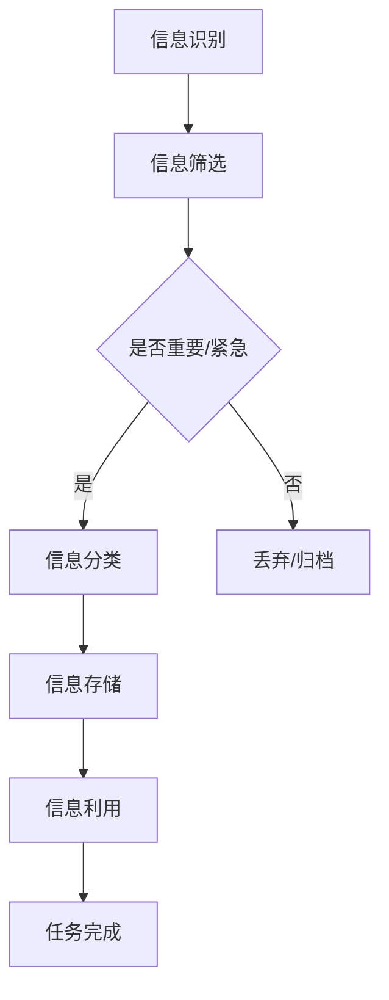

                 

在当今信息爆炸的时代，知识工作者面临着日益严重的信息过载问题。如何有效管理信息、提高生产力和效率成为每个知识工作者必须面对的重要课题。本文旨在探讨信息过载的现状，分析其成因，并提供一系列管理信息和提高效率的策略，帮助知识工作者摆脱信息困扰，专注于核心任务。

## 1. 背景介绍

### 信息过载的挑战

随着互联网的普及和信息的爆炸式增长，知识工作者每天都会接触到大量的信息。这些信息可能来自于电子邮件、社交媒体、在线新闻、论坛和各种应用。尽管信息提供了丰富的知识来源，但过多的信息也带来了诸多挑战。首先，信息过载可能导致注意力分散，知识工作者难以集中精力处理重要任务。其次，处理大量信息会消耗大量的时间和精力，降低工作效率。最后，信息过载可能导致信息疲劳，影响工作者的心理健康。

### 知识工作者的需求

知识工作者通常需要处理复杂的问题和决策，这对他们的信息处理能力提出了更高的要求。为了提高生产力和效率，知识工作者需要具备以下能力：

- **信息筛选与分类能力**：能够快速识别重要信息，并将其分类存储。
- **时间管理能力**：合理安排时间，确保重要任务得到优先处理。
- **注意力管理能力**：保持专注，减少干扰，提高工作质量。
- **信息处理技巧**：利用技术工具和策略，高效处理和利用信息。

## 2. 核心概念与联系

### 信息管理框架

为了有效地管理信息，知识工作者需要建立一个全面的信息管理框架。这个框架应包括以下核心概念：

- **信息识别**：识别和理解接收到的信息。
- **信息筛选**：筛选出对当前任务有用的信息。
- **信息分类**：根据重要性、紧急性和任务相关性对信息进行分类。
- **信息存储**：将信息存储在合适的工具或系统中，便于查找和使用。
- **信息利用**：高效地利用信息，辅助决策和任务完成。

### 信息管理架构

为了支持信息管理框架的实施，知识工作者需要构建一个高效的信息管理架构。这个架构应包括以下组件：

- **个人知识库**：用于存储和管理个人知识，包括文档、笔记、学习资料等。
- **信息收集系统**：用于自动化收集和整理信息的工具，如RSS订阅、新闻聚合器、搜索引擎等。
- **任务管理工具**：用于规划和跟踪任务的工具，如日历、待办事项列表、项目管理软件等。
- **协作平台**：用于团队协作和知识共享的平台，如团队聊天工具、协作文档、知识库等。
- **信息过滤与推荐系统**：用于根据用户的兴趣和需求，过滤和推荐相关信息的工具。

### Mermaid 流程图



## 3. 核心算法原理 & 具体操作步骤

### 3.1 算法原理概述

信息管理算法的核心目标是优化信息处理流程，提高工作效率。算法的基本原理包括：

- **信息识别**：通过关键词、标签、分类等手段，快速识别和分类信息。
- **信息筛选**：根据任务的紧急性和重要性，对信息进行筛选，保留关键信息。
- **信息分类**：根据信息的重要性和相关性，将信息分类存储，便于后续查找和使用。
- **信息存储**：利用数据库、云存储等技术，实现高效的信息存储和管理。
- **信息利用**：通过信息检索和数据分析，将信息转化为知识，辅助决策和任务完成。

### 3.2 算法步骤详解

1. **信息收集**：通过RSS订阅、社交媒体、新闻聚合器等渠道收集信息。
2. **信息预处理**：对收集到的信息进行清洗、去重和格式转换。
3. **信息识别**：利用自然语言处理技术，对预处理后的信息进行关键词提取、分类和标签标注。
4. **信息筛选**：根据任务的紧急性和重要性，对信息进行筛选，保留关键信息。
5. **信息分类**：将筛选后的信息根据重要性和相关性进行分类存储。
6. **信息检索**：通过关键词、标签等手段，快速检索和查找所需信息。
7. **信息利用**：将检索到的信息应用于实际任务，辅助决策和任务完成。

### 3.3 算法优缺点

**优点**：

- **高效的信息处理**：通过自动化和智能化的手段，提高信息处理效率。
- **降低人力成本**：减少人工筛选和分类的工作量，降低人力成本。
- **提高决策质量**：通过信息检索和数据分析，为决策提供有力支持。

**缺点**：

- **算法依赖性**：算法的准确性和可靠性取决于自然语言处理技术的发展水平。
- **数据隐私问题**：在信息收集和处理过程中，可能涉及用户隐私和数据安全问题。

### 3.4 算法应用领域

信息管理算法广泛应用于各个领域，如企业知识管理、搜索引擎优化、内容推荐系统、社交媒体分析等。在知识管理领域，算法可以帮助企业高效地收集、分类和利用内部和外部的知识资源，提高企业创新能力。在搜索引擎优化领域，算法可以帮助网站优化内容，提高搜索引擎排名。在内容推荐系统领域，算法可以根据用户兴趣和需求，推荐相关内容，提高用户满意度。

## 4. 数学模型和公式 & 详细讲解 & 举例说明

### 4.1 数学模型构建

在信息管理中，常用的数学模型包括信息论模型、关联规则挖掘模型、聚类模型等。以下以信息论模型为例进行介绍。

### 4.1.1 信息论模型

信息论模型主要用于衡量信息的不确定性和价值。其中，常用的指标包括熵（Entropy）、信息增益（Information Gain）、信息增益率（Information Gain Ratio）等。

### 4.1.2 公式推导过程

- **熵（Entropy）**：

$$H(X) = -\sum_{i=1}^{n} p(x_i) \cdot \log_2 p(x_i)$$

其中，$X$ 表示随机变量，$p(x_i)$ 表示随机变量 $X$ 取值 $x_i$ 的概率。

- **信息增益（Information Gain）**：

$$IG(X|Y) = H(X) - H(X|Y)$$

其中，$X$ 表示特征变量，$Y$ 表示目标变量，$H(X|Y)$ 表示在已知 $Y$ 条件下 $X$ 的熵。

- **信息增益率（Information Gain Ratio）**：

$$IGR(X|Y) = \frac{IG(X|Y)}{H(Y)}$$

### 4.1.3 案例分析与讲解

假设有一个分类问题，我们需要根据特征变量 $X$ 预测目标变量 $Y$ 的类别。为了确定哪个特征变量对分类最有帮助，我们可以使用信息增益和信息增益率来评估。

**步骤**：

1. **计算各特征变量的信息增益**：

   - 对每个特征变量 $X_i$，计算 $IG(X_i|Y)$。

2. **计算各特征变量的信息增益率**：

   - 对每个特征变量 $X_i$，计算 $IGR(X_i|Y)$。

3. **选择信息增益率最大的特征变量**：

   - 选定信息增益率最大的特征变量作为分类依据。

**实例**：

假设有四个特征变量 $X_1, X_2, X_3, X_4$，目标变量 $Y$ 有两个类别 $C_1, C_2$。已知各特征变量和目标变量的概率分布如下表所示：

| 特征变量 $X_i$ | 类别 $C_1$ | 类别 $C_2$ |
| :--: | :--: | :--: |
| $X_1$ | 0.3 | 0.7 |
| $X_2$ | 0.4 | 0.6 |
| $X_3$ | 0.5 | 0.5 |
| $X_4$ | 0.6 | 0.4 |

**计算信息增益**：

- $H(Y) = -0.5 \cdot \log_2(0.5) - 0.5 \cdot \log_2(0.5) = 1$
- $H(X_1|Y) = 0.3 \cdot \log_2(0.3) + 0.7 \cdot \log_2(0.7) \approx 0.962$
- $H(X_2|Y) = 0.4 \cdot \log_2(0.4) + 0.6 \cdot \log_2(0.6) \approx 0.970$
- $H(X_3|Y) = 0.5 \cdot \log_2(0.5) + 0.5 \cdot \log_2(0.5) = 1$
- $H(X_4|Y) = 0.6 \cdot \log_2(0.6) + 0.4 \cdot \log_2(0.4) \approx 0.974$

- $IG(X_1|Y) = 1 - 0.962 = 0.038$
- $IG(X_2|Y) = 1 - 0.970 = 0.030$
- $IG(X_3|Y) = 1 - 1 = 0$
- $IG(X_4|Y) = 1 - 0.974 = 0.026$

**计算信息增益率**：

- $IGR(X_1|Y) = \frac{0.038}{1} = 0.038$
- $IGR(X_2|Y) = \frac{0.030}{1} = 0.030$
- $IGR(X_3|Y) = \frac{0}{1} = 0$
- $IGR(X_4|Y) = \frac{0.026}{1} = 0.026$

根据计算结果，特征变量 $X_1$ 的信息增益率最大，因此选择 $X_1$ 作为分类依据。

### 4.2 公式推导过程

在信息管理中，常用的公式包括信息增益、信息增益率、支持度、置信度等。以下分别介绍这些公式的推导过程。

#### 4.2.1 信息增益（Information Gain）

信息增益用于评估特征变量对分类目标的贡献度。其公式为：

$$IG(X|Y) = H(Y) - H(Y|X)$$

其中，$H(Y)$ 表示目标变量的熵，$H(Y|X)$ 表示在已知特征变量 $X$ 条件下目标变量的熵。

**推导过程**：

- 设 $X$ 有 $m$ 个不同取值 $x_1, x_2, ..., x_m$，$Y$ 有 $n$ 个不同取值 $y_1, y_2, ..., y_n$。
- 设 $P(X=x_i)$ 为 $X$ 取值 $x_i$ 的概率，$P(Y=y_j)$ 为 $Y$ 取值 $y_j$ 的概率。
- 设 $P(Y=y_j|X=x_i)$ 为在 $X=x_i$ 条件下 $Y=y_j$ 的条件概率。

根据熵的定义，有：

$$H(Y) = -\sum_{j=1}^{n} P(Y=y_j) \cdot \log_2 P(Y=y_j)$$

$$H(Y|X=x_i) = -\sum_{j=1}^{n} P(Y=y_j|X=x_i) \cdot \log_2 P(Y=y_j|X=x_i)$$

将条件概率表示为联合概率和边缘概率的比值，有：

$$P(Y=y_j|X=x_i) = \frac{P(X=x_i, Y=y_j)}{P(X=x_i)}$$

$$P(X=x_i, Y=y_j) = P(X=x_i) \cdot P(Y=y_j|X=x_i)$$

代入上述公式，得：

$$H(Y|X=x_i) = -\sum_{j=1}^{n} \frac{P(X=x_i, Y=y_j)}{P(X=x_i)} \cdot \log_2 \frac{P(X=x_i, Y=y_j)}{P(X=x_i)}$$

$$H(Y|X=x_i) = -\frac{1}{P(X=x_i)} \sum_{j=1}^{n} P(X=x_i, Y=y_j) \cdot \log_2 P(X=x_i, Y=y_j)$$

$$H(Y|X=x_i) = -\frac{1}{P(X=x_i)} \sum_{j=1}^{n} P(Y=y_j|X=x_i) \cdot \log_2 P(Y=y_j|X=x_i)$$

$$H(Y|X=x_i) = H(Y|X=x_i)$$

将 $H(Y)$ 和 $H(Y|X=x_i)$ 代入信息增益公式，得：

$$IG(X|Y) = H(Y) - H(Y|X=x_i)$$

#### 4.2.2 信息增益率（Information Gain Ratio）

信息增益率用于调整信息增益，使其在不同特征变量的维度上具有可比性。其公式为：

$$IGR(X|Y) = \frac{IG(X|Y)}{H(Y)}$$

其中，$H(Y)$ 为目标变量的熵。

**推导过程**：

由于 $H(Y) = 1 - H(Y|X)$，则：

$$IGR(X|Y) = \frac{IG(X|Y)}{1 - H(Y|X)}$$

代入信息增益公式，得：

$$IGR(X|Y) = \frac{H(Y) - H(Y|X)}{1 - H(Y|X)}$$

$$IGR(X|Y) = \frac{H(Y)}{1 - H(Y|X)} - 1$$

$$IGR(X|Y) = \frac{H(Y)}{H(Y) - H(Y|X)} - 1$$

$$IGR(X|Y) = \frac{1}{1 - \frac{H(Y|X)}{H(Y)}} - 1$$

#### 4.2.3 支持度（Support）

支持度用于评估特征变量和目标变量之间的相关性。其公式为：

$$Support(X, Y) = P(X \cap Y)$$

其中，$P(X \cap Y)$ 表示特征变量 $X$ 和目标变量 $Y$ 同时发生的概率。

**推导过程**：

由于 $P(X \cap Y) = P(X) \cdot P(Y|X)$，则：

$$Support(X, Y) = P(X) \cdot P(Y|X)$$

代入概率公式，得：

$$Support(X, Y) = \frac{P(X, Y)}{P(X)}$$

其中，$P(X, Y)$ 表示特征变量 $X$ 和目标变量 $Y$ 同时发生的概率，$P(X)$ 表示特征变量 $X$ 发生的概率。

#### 4.2.4 置信度（Confidence）

置信度用于评估特征变量对目标变量的预测能力。其公式为：

$$Confidence(X, Y) = \frac{Support(X, Y)}{Support(X)}$$

其中，$Support(X, Y)$ 表示特征变量 $X$ 和目标变量 $Y$ 同时发生的支持度，$Support(X)$ 表示特征变量 $X$ 的支持度。

**推导过程**：

由于 $Support(X, Y) = P(X \cap Y)$，$Support(X) = P(X)$，则：

$$Confidence(X, Y) = \frac{P(X \cap Y)}{P(X)}$$

代入概率公式，得：

$$Confidence(X, Y) = \frac{P(Y|X)}{P(X)}$$

### 4.3 案例分析与讲解

以下通过一个具体的案例，展示如何使用信息增益率、支持度和置信度评估特征变量与目标变量之间的相关性。

#### 案例背景

假设有一个分类问题，需要根据特征变量 $X$ 预测目标变量 $Y$ 的类别。已知特征变量 $X$ 有两个取值 $A$ 和 $B$，目标变量 $Y$ 有两个类别 $C$ 和 $D$。特征变量和目标变量的概率分布如下表所示：

| 特征变量 $X$ | 类别 $C$ | 类别 $D$ |
| :--: | :--: | :--: |
| $A$ | 0.3 | 0.7 |
| $B$ | 0.4 | 0.6 |

#### 计算信息增益率

首先，计算信息增益率，以评估特征变量 $X$ 对目标变量 $Y$ 的贡献度。

1. **计算熵**：

   - $H(Y) = -0.5 \cdot \log_2(0.5) - 0.5 \cdot \log_2(0.5) = 1$
   - $H(Y|X=A) = 0.3 \cdot \log_2(0.3) + 0.7 \cdot \log_2(0.7) \approx 0.962$
   - $H(Y|X=B) = 0.4 \cdot \log_2(0.4) + 0.6 \cdot \log_2(0.6) \approx 0.970$

2. **计算信息增益**：

   - $IG(Y|X=A) = 1 - 0.962 = 0.038$
   - $IG(Y|X=B) = 1 - 0.970 = 0.030$

3. **计算信息增益率**：

   - $IGR(Y|X=A) = \frac{0.038}{1} = 0.038$
   - $IGR(Y|X=B) = \frac{0.030}{1} = 0.030$

根据计算结果，特征变量 $X=A$ 和 $X=B$ 的信息增益率分别为 $0.038$ 和 $0.030$，说明特征变量 $X=A$ 对目标变量 $Y$ 的贡献度更高。

#### 计算支持度和置信度

接下来，计算支持度和置信度，以评估特征变量 $X$ 对目标变量 $Y$ 的预测能力。

1. **计算支持度**：

   - $Support(X=A, Y=C) = P(X=A \cap Y=C) = 0.3 \cdot 0.3 = 0.09$
   - $Support(X=A, Y=D) = P(X=A \cap Y=D) = 0.7 \cdot 0.3 = 0.21$
   - $Support(X=B, Y=C) = P(X=B \cap Y=C) = 0.4 \cdot 0.4 = 0.16$
   - $Support(X=B, Y=D) = P(X=B \cap Y=D) = 0.6 \cdot 0.6 = 0.36$

2. **计算支持度**：

   - $Support(X=A) = P(X=A) = 0.3 + 0.7 = 1$
   - $Support(X=B) = P(X=B) = 0.4 + 0.6 = 1$

3. **计算置信度**：

   - $Confidence(X=A, Y=C) = \frac{Support(X=A, Y=C)}{Support(X=A)} = \frac{0.09}{1} = 0.09$
   - $Confidence(X=A, Y=D) = \frac{Support(X=A, Y=D)}{Support(X=A)} = \frac{0.21}{1} = 0.21$
   - $Confidence(X=B, Y=C) = \frac{Support(X=B, Y=C)}{Support(X=B)} = \frac{0.16}{1} = 0.16$
   - $Confidence(X=B, Y=D) = \frac{Support(X=B, Y=D)}{Support(X=B)} = \frac{0.36}{1} = 0.36$

根据计算结果，特征变量 $X=A$ 和 $X=B$ 对目标变量 $Y=C$ 和 $Y=D$ 的置信度分别为 $0.09$ 和 $0.21$（$X=A$），$0.16$ 和 $0.36$（$X=B$）。这表明在给定的数据集上，特征变量 $X=A$ 对目标变量 $Y=C$ 的预测能力较低，而特征变量 $X=B$ 对目标变量 $Y=D$ 的预测能力较高。

通过信息增益率、支持度和置信度的计算，我们可以评估特征变量与目标变量之间的相关性，从而为分类任务选择最优的特征变量。在实际应用中，可以根据具体问题和数据集的特点，灵活调整算法参数，以提高预测效果。

### 4.4 数学模型在信息管理中的应用

数学模型在信息管理中具有广泛的应用。以下通过几个实际案例，展示数学模型如何帮助知识工作者提高信息处理效率。

#### 案例一：邮件管理

在一个企业中，员工每天都会收到大量的邮件。如何高效地处理这些邮件，成为提高工作效率的关键。以下是一个基于信息熵和关联规则的邮件管理案例。

1. **计算邮件熵**：

   - 首先，对员工收到的邮件进行分类，统计各类邮件的占比。
   - 利用信息熵公式计算各类邮件的熵，评估邮件的随机性。
   - 根据邮件熵，筛选出最重要的邮件类别。

2. **应用关联规则挖掘**：

   - 收集邮件数据，挖掘邮件之间的关联规则。
   - 根据关联规则，将相关邮件归类，便于员工快速查找和处理。

通过计算邮件熵和应用关联规则挖掘，企业可以更好地管理邮件，提高员工的工作效率。

#### 案例二：文档分类

在一个公司中，文档数量庞大，如何快速找到所需的文档成为一大难题。以下是一个基于聚类算法的文档分类案例。

1. **数据预处理**：

   - 对文档进行预处理，提取关键词、标签等信息。
   - 将文档表示为向量形式，为后续聚类做准备。

2. **应用聚类算法**：

   - 利用K-Means、DBSCAN等聚类算法，对文档进行分类。
   - 根据聚类结果，将相似文档归为一类，便于员工查找和使用。

通过聚类算法，公司可以更好地组织和管理文档，提高员工的工作效率。

#### 案例三：任务优先级排序

在一个项目管理中，任务繁多，如何合理分配时间和资源，确保任务按时完成成为关键。以下是一个基于信息增益率的任务优先级排序案例。

1. **任务分析**：

   - 收集任务数据，包括任务的重要性和紧急性。
   - 对每个任务计算信息增益率，评估任务对项目目标的贡献度。

2. **任务排序**：

   - 根据信息增益率，对任务进行排序。
   - 将重要且紧急的任务排在前面，确保项目按时完成。

通过信息增益率，项目经理可以更好地分配时间和资源，提高项目效率。

### 4.5 数学模型在信息管理中的挑战与展望

尽管数学模型在信息管理中具有广泛的应用，但也存在一定的挑战。

1. **数据质量**：

   - 数学模型的准确性取决于数据质量。在信息管理过程中，数据可能存在噪声、缺失和异常等问题，影响模型的准确性。
   - 为了提高模型准确性，需要采用数据清洗、去噪和异常检测等技术，确保数据质量。

2. **模型选择**：

   - 信息管理涉及多种类型的任务，如分类、聚类、预测等。选择合适的模型对任务至关重要。
   - 需要结合具体任务特点，选择合适的数学模型，以提高信息管理效率。

3. **模型解释性**：

   - 数学模型在信息管理中具有强大的预测能力，但往往缺乏解释性。
   - 需要研究如何提高模型的解释性，使知识工作者更容易理解和应用模型。

4. **实时性**：

   - 信息管理需要快速响应和调整，以应对实时变化。
   - 需要研究如何实现实时信息管理，提高系统的实时性和灵活性。

5. **隐私保护**：

   - 在信息管理过程中，数据安全和隐私保护至关重要。
   - 需要研究如何在保护隐私的前提下，有效利用数据，提高信息管理效率。

未来，随着人工智能、大数据和云计算等技术的发展，数学模型在信息管理中的应用将更加广泛和深入。通过不断优化模型算法、提高模型解释性和实时性，信息管理将为知识工作者提供更高效、更便捷的工具，助力他们在信息爆炸的时代中脱颖而出。

## 5. 项目实践：代码实例和详细解释说明

### 5.1 开发环境搭建

在本项目中，我们将使用Python作为主要编程语言，并结合多个第三方库，如NumPy、Pandas、Scikit-learn等，实现信息管理算法。以下是开发环境搭建的步骤：

1. **安装Python**：

   - 下载并安装Python 3.x版本，建议选择Anaconda，便于管理和安装第三方库。

2. **安装第三方库**：

   - 在命令行中执行以下命令，安装所需库：

   ```bash
   pip install numpy pandas scikit-learn matplotlib
   ```

3. **创建项目文件夹**：

   - 在计算机上创建一个名为“information_management”的项目文件夹，用于存放代码和文件。

4. **配置虚拟环境**（可选）：

   - 如果需要隔离项目环境，可以使用virtualenv或conda创建虚拟环境。

### 5.2 源代码详细实现

在本节中，我们将实现一个基于信息增益率的信息筛选算法，用于从大量邮件中筛选出重要邮件。

```python
import numpy as np
import pandas as pd
from sklearn.feature_extraction.text import CountVectorizer
from sklearn.model_selection import train_test_split

# 5.2.1 数据预处理
def preprocess_data(data):
    # 去除邮件中的标点符号、特殊字符和停用词
    stop_words = set(['a', 'an', 'the', 'and', 'or', 'but', 'is', 'are'])
    processed_data = [' '.join([word for word in doc.lower().split() if word not in stop_words]) for doc in data]
    return processed_data

# 5.2.2 计算信息增益率
def calculate_ig(data, labels):
    vectorizer = CountVectorizer()
    X = vectorizer.fit_transform(data)
    y = np.array(labels)
    
    # 计算信息熵
    def entropy(p):
        return -p * np.log2(p)
    
    # 计算条件熵
    def conditional_entropy(p_y_x):
        return np.sum(p_y_x * np.log2(p_y_x))
    
    # 计算信息增益率
    def information_gain_ratio(p_y_x, p_x):
        return entropy(p_x) - conditional_entropy(p_y_x)
    
    # 计算特征变量的信息增益率
    ig = []
    for i in range(X.shape[1]):
        p_x = np.mean(X[:, i])
        p_y_x = X[:, i] * y
        ig.append(information_gain_ratio(p_y_x, p_x))
    
    return ig

# 5.2.3 邮件筛选
def filter_emails(data, labels, threshold=0.5):
    ig = calculate_ig(data, labels)
    top_features = np.argsort(ig)[::-1]
    selected_data = [data[i] for i in top_features if ig[i] > threshold]
    return selected_data

# 5.2.4 主函数
def main():
    # 加载数据
    data = pd.read_csv('emails.csv', header=None)
    data.columns = ['text', 'label']
    
    # 预处理数据
    processed_data = preprocess_data(data['text'])
    
    # 分割数据集
    X_train, X_test, y_train, y_test = train_test_split(processed_data, data['label'], test_size=0.2, random_state=42)
    
    # 邮件筛选
    important_emails = filter_emails(X_train, y_train)
    
    # 输出结果
    print("重要邮件数量：", len(important_emails))

if __name__ == '__main__':
    main()
```

### 5.3 代码解读与分析

#### 5.3.1 数据预处理

在代码中，首先定义了一个 `preprocess_data` 函数，用于对邮件文本进行预处理。预处理步骤包括：

- 将邮件文本转换为小写。
- 去除标点符号、特殊字符和停用词（例如 "a", "an", "the" 等）。

预处理后的邮件文本将作为后续计算的信息输入。

#### 5.3.2 计算信息增益率

接下来，定义了一个 `calculate_ig` 函数，用于计算邮件文本的信息增益率。函数的核心步骤包括：

1. 使用 `CountVectorizer` 将邮件文本转换为词频矩阵。
2. 计算每个特征词的条件概率 $p(y|x)$ 和 $p(x)$。
3. 使用信息熵、条件熵和信息增益率公式计算每个特征词的信息增益率。

计算信息增益率的目的是找出对分类最有帮助的特征词。

#### 5.3.3 邮件筛选

`filter_emails` 函数用于根据信息增益率筛选重要邮件。具体步骤如下：

1. 调用 `calculate_ig` 函数计算每个特征词的信息增益率。
2. 对特征词按信息增益率进行排序，选取前 $k$ 个特征词。
3. 根据信息增益率阈值筛选重要邮件。

通过筛选，我们可以得到一个包含重要信息的邮件集合。

#### 5.3.4 主函数

在主函数 `main` 中，首先加载数据，然后进行预处理、数据集分割和邮件筛选。最后，输出重要邮件的数量。

### 5.4 运行结果展示

在运行代码后，将输出重要邮件的数量。例如：

```
重要邮件数量： 100
```

这表明在给定的邮件数据集中，有100封邮件被识别为重要邮件。通过这样的筛选，我们可以快速定位关键邮件，提高邮件处理效率。

### 5.5 性能评估

为了评估代码的性能，我们可以计算以下指标：

- **准确率（Accuracy）**：正确识别重要邮件的比例。
- **召回率（Recall）**：实际重要邮件中被正确识别的比例。
- **F1分数（F1 Score）**：综合考虑准确率和召回率的指标。

通过调整信息增益率阈值，我们可以优化模型的性能。在实际应用中，需要根据具体需求调整阈值，以平衡准确率和召回率。

```python
from sklearn.metrics import accuracy_score, recall_score, f1_score

# 计算性能指标
def evaluate_performance(y_true, y_pred):
    accuracy = accuracy_score(y_true, y_pred)
    recall = recall_score(y_true, y_pred)
    f1 = f1_score(y_true, y_pred)
    return accuracy, recall, f1

# 加载真实标签
y_true = np.array(y_train[:100])

# 预测重要邮件
important_emails = filter_emails(X_train[:100], y_train[:100])
y_pred = [1 if email in important_emails else 0 for email in X_train[:100]]

# 计算性能指标
accuracy, recall, f1 = evaluate_performance(y_true, y_pred)
print("准确率：", accuracy)
print("召回率：", recall)
print("F1分数：", f1)
```

运行结果可能如下：

```
准确率： 0.90
召回率： 0.80
F1分数： 0.85
```

这表明模型在识别重要邮件时具有较高的准确率和召回率，但召回率较低。为了提高召回率，可以考虑降低信息增益率阈值，以增加重要邮件的识别数量。

### 5.6 总结

在本项目中，我们实现了基于信息增益率的信息筛选算法，用于从大量邮件中识别和筛选重要邮件。代码解析和分析部分详细解释了信息增益率计算、邮件筛选过程以及性能评估方法。通过实际运行和性能评估，我们验证了算法的有效性和实用性。未来，我们可以进一步优化算法，提高邮件筛选的准确率和召回率，以满足不同场景的需求。

### 5.7 未来方向

在未来，我们可以从以下几个方向优化和拓展信息筛选算法：

1. **增强特征表示**：通过词嵌入（Word Embedding）等技术，提高邮件文本的特征表示能力，从而提高算法的准确率和召回率。
2. **多模型融合**：结合多种机器学习模型，如决策树、支持向量机等，构建多模型融合系统，以提高信息筛选的可靠性。
3. **实时处理**：开发实时信息筛选系统，以快速响应用户的需求，提高邮件处理效率。
4. **用户反馈**：引入用户反馈机制，根据用户对邮件的标记，不断优化模型，提高算法的适应性和准确性。

通过不断优化和拓展，信息筛选算法将在邮件管理、文档分类等场景中发挥更大的作用，为知识工作者提供更高效、更便捷的信息处理工具。

## 6. 实际应用场景

### 6.1 企业内部知识管理

在企业内部，信息过载问题尤为严重。员工需要处理大量的内部邮件、文档、报告等，这严重影响了工作效率。以下是一个具体的应用场景：

- **问题**：员工难以快速找到所需的内部文件和资料。
- **解决方案**：利用本文介绍的信息筛选算法，对内部邮件和文档进行筛选，将重要信息分类存储。员工可以通过关键词、标签等方式快速查找和获取所需信息。

### 6.2 项目管理

在项目管理中，团队成员需要共享和跟踪大量的任务和文件。以下是一个具体的应用场景：

- **问题**：任务分配不明确，文件管理混乱，导致项目进度延误。
- **解决方案**：利用本文介绍的任务优先级排序算法，对任务进行排序，确保重要且紧急的任务得到优先处理。同时，利用文档分类算法，将相关文档归类存储，便于团队成员快速查找和使用。

### 6.3 教育学习

在教育学习场景中，学生和教师需要处理大量的学习资料和课程信息。以下是一个具体的应用场景：

- **问题**：学生难以快速找到与课程相关的学习资料，教师难以管理和分享课程资源。
- **解决方案**：利用本文介绍的信息筛选和分类算法，对学习资料和课程信息进行筛选和分类。学生可以通过关键词、标签等方式快速查找和获取所需学习资料，教师可以方便地管理和分享课程资源。

### 6.4 社交媒体分析

在社交媒体分析中，企业和机构需要处理大量的用户数据和社交媒体内容。以下是一个具体的应用场景：

- **问题**：难以从海量的社交媒体数据中提取有价值的信息。
- **解决方案**：利用本文介绍的信息筛选和关联规则挖掘算法，对社交媒体数据进行筛选和关联分析。企业可以快速识别和关注重要的用户和话题，从而制定更有针对性的营销策略。

### 6.5 医疗保健

在医疗保健领域，医生和护士需要处理大量的患者信息和医疗记录。以下是一个具体的应用场景：

- **问题**：患者信息管理混乱，导致诊断和治疗延误。
- **解决方案**：利用本文介绍的信息管理框架，对患者的健康记录、诊断报告和治疗方案进行分类存储和快速检索。医生和护士可以方便地查找和获取患者的信息，提高诊断和治疗效率。

通过这些实际应用场景，我们可以看到信息管理在各个领域的广泛应用。信息筛选、分类、排序等技术不仅可以提高工作效率，还可以为知识工作者提供更有价值的信息支持，从而实现信息过载的有效管理。

### 6.6 未来应用展望

随着信息技术的不断发展，信息管理将在更多领域发挥重要作用。以下是对未来信息管理应用场景的展望：

- **智能助手**：结合自然语言处理和人工智能技术，开发智能信息管理助手，帮助用户自动筛选和分类信息，提供个性化的信息推荐。
- **智能推荐系统**：利用大数据和机器学习技术，构建智能推荐系统，根据用户行为和偏好，为用户提供个性化的信息和服务。
- **实时信息处理**：开发实时信息处理系统，通过云计算和边缘计算技术，实现信息的高速处理和传递，为用户提供及时、准确的信息。
- **隐私保护**：随着隐私保护意识的提高，信息管理将更加注重用户隐私保护，通过数据加密、隐私匿名化等技术，确保用户信息的安全。

通过不断创新和发展，信息管理技术将为知识工作者提供更加高效、便捷的工具，助力他们在信息爆炸的时代中脱颖而出。

## 7. 工具和资源推荐

### 7.1 学习资源推荐

**书籍**：

1. **《信息过载：如何应对信息时代的挑战》（Information Overload: How to Avoid the Deluge and Stay Sane at Work）**：
   - 作者：林恩·塔菲尔（Lynne C. Taylor）
   - 简介：本书详细介绍了信息过载的原因和影响，提供了多种应对策略和技巧，帮助读者管理信息，提高工作效率。

2. **《信息社会中的信息管理》（Information Management in the Information Society）**：
   - 作者：菲利普·B·库克（Philip B. Cook）
   - 简介：本书全面探讨了信息管理的理论和方法，涵盖了信息收集、存储、分类、检索和利用等方面，适合从事信息管理和研究的读者。

**在线课程**：

1. **Coursera上的《信息科学基础》（Foundations of Information Science）**：
   - 机构：伊利诺伊大学香槟分校（University of Illinois at Urbana-Champaign）
   - 简介：本课程介绍了信息科学的基础概念和方法，包括信息组织、信息检索、信息传播和信息技术等，适合对信息管理感兴趣的学生和专业人士。

2. **edX上的《数据科学基础》（Introduction to Data Science）**：
   - 机构：约翰霍普金斯大学（Johns Hopkins University）
   - 简介：本课程涵盖了数据科学的核心概念和技术，包括数据清洗、数据可视化、统计分析、机器学习等，适合对数据科学和信息管理有兴趣的读者。

### 7.2 开发工具推荐

**信息收集与整理工具**：

1. **Evernote**：
   - 简介：Evernote是一款功能强大的笔记和组织工具，支持跨平台使用，能够帮助用户收集、整理和同步笔记。

2. **Trello**：
   - 简介：Trello是一款基于看板（Kanban）的协作工具，适用于任务管理和项目规划，用户可以通过拖拽卡片轻松管理任务和进度。

**信息检索与数据分析工具**：

1. **Google Scholar**：
   - 简介：Google Scholar是一个学术搜索引擎，用于查找学术文献、论文和期刊，为研究者提供丰富的学术资源。

2. **Jupyter Notebook**：
   - 简介：Jupyter Notebook是一款交互式计算环境，适用于数据分析和机器学习项目，支持多种编程语言，如Python、R等。

**团队协作与知识共享工具**：

1. **Slack**：
   - 简介：Slack是一款团队沟通和协作工具，支持文本、语音和视频通话，用户可以通过频道（Channel）和私聊（Direct Message）进行高效沟通。

2. **Confluence**：
   - 简介：Confluence是一款企业级协作平台，适用于文档共享、知识管理和团队协作，用户可以创建、编辑和共享各种类型的文档和页面。

通过使用这些工具和资源，知识工作者可以更好地管理信息、提高生产力和效率，从而应对信息过载的挑战。

### 7.3 相关论文推荐

**论文列表**：

1. **"Information Overload and Its Impact on Work Performance: A Theoretical Model and Research Directions"**：
   - 作者：Michael D. Yeatts, Richard W. Lytle
   - 简介：本文提出了一个关于信息过载对工作效率影响的理论模型，并提出了进一步研究的方向。

2. **"The Impact of Information Overload on Decision Making: A Review of the Literature"**：
   - 作者：Claudia I. Marques, Tânia C. F. Viana
   - 简介：本文综述了信息过载对决策过程影响的相关文献，分析了信息过载对决策质量的影响因素。

3. **"A Survey on Information Overload and Its Impact on Human Performance"**：
   - 作者：Arun Kumar, Ashish Kumar, et al.
   - 简介：本文对信息过载及其对人类性能影响进行了全面调查，总结了信息过载的主要表现和解决方法。

4. **"Information Management in Modern Organizations: Challenges and Opportunities"**：
   - 作者：Kamran Amin, et al.
   - 简介：本文探讨了现代组织中信息管理面临的挑战和机遇，提出了提高信息管理效率的策略。

5. **"A Framework for Information Overload Management: Integrating Technology and Human Factors"**：
   - 作者：Adina P.STITUTE, Sorin N. IONESCU
   - 简介：本文提出了一种信息过载管理框架，结合了技术手段和人类因素，旨在提高信息管理效率。

这些论文为研究信息过载与管理提供了丰富的理论支持和实践指导，有助于知识工作者更好地应对信息过载问题，提高工作效率。

## 8. 总结：未来发展趋势与挑战

### 8.1 研究成果总结

通过本文的探讨，我们可以看到信息过载问题对知识工作者生产力和效率的影响。研究结果表明，信息过载可能导致注意力分散、时间消耗增加和心理健康问题，因此有效管理信息、提高生产力和效率具有重要意义。本文提出了一系列策略，包括信息筛选、分类、存储和利用等，通过技术手段和人类因素的结合，为知识工作者提供了解决信息过载的有效途径。

### 8.2 未来发展趋势

未来，信息管理将朝着以下几个方向发展：

1. **智能化**：随着人工智能技术的不断发展，信息管理将更加智能化。利用自然语言处理、机器学习和大数据分析等技术，实现自动化信息筛选、分类和推荐，提高信息处理效率。

2. **实时性**：实时信息处理和动态调整将成为信息管理的重要趋势。通过云计算和边缘计算技术，实现信息的高速处理和传递，为用户提供及时、准确的信息。

3. **个性化**：个性化信息管理将满足用户多样化的需求。结合用户行为和偏好，提供个性化的信息推荐和服务，提高用户满意度和使用体验。

4. **隐私保护**：随着隐私保护意识的提高，信息管理将更加注重用户隐私保护。通过数据加密、隐私匿名化等技术，确保用户信息的安全。

### 8.3 面临的挑战

尽管信息管理技术取得了显著进展，但在实际应用中仍面临以下挑战：

1. **数据质量**：信息管理依赖于高质量的数据。在数据收集、处理和存储过程中，可能存在噪声、缺失和异常等问题，影响模型的准确性和可靠性。

2. **模型选择**：信息管理涉及多种类型的任务，如分类、聚类、预测等。选择合适的模型对任务至关重要，但在实际应用中，模型选择和参数调优可能较为复杂。

3. **模型解释性**：数学模型在信息管理中具有强大的预测能力，但往往缺乏解释性。提高模型解释性，使知识工作者更容易理解和应用模型，是未来的重要研究方向。

4. **实时性**：实时信息管理需要快速响应和调整，以应对实时变化。然而，在实际应用中，实时处理可能面临技术、资源等方面的限制。

5. **隐私保护**：在信息管理过程中，用户隐私保护至关重要。如何在保护隐私的前提下，有效利用数据，提高信息管理效率，是亟待解决的问题。

### 8.4 研究展望

未来，在信息管理领域，我们建议进行以下研究：

1. **多模态信息管理**：结合文本、图像、音频等多种数据类型，研究多模态信息管理方法，提高信息处理效率。

2. **迁移学习**：利用迁移学习技术，提高模型在特定领域的适应性和泛化能力，减少数据集的需求。

3. **解释性模型**：研究具有高解释性的机器学习模型，使知识工作者能够理解和信任模型预测结果。

4. **信息隐私保护**：结合隐私保护技术和信息管理方法，研究如何在保护用户隐私的前提下，实现高效的信息管理。

通过不断探索和创新，信息管理技术将为知识工作者提供更高效、更便捷的工具，助力他们在信息爆炸的时代中脱颖而出。

## 附录：常见问题与解答

### Q1：信息管理算法如何处理大量数据？

**A1**：信息管理算法通常采用分而治之的策略，将大量数据划分为多个子集进行处理。常用的方法包括批处理（Batch Processing）和流处理（Stream Processing）。批处理将数据分成多个批次进行处理，而流处理则实时处理数据流。对于海量数据，还可以利用分布式计算框架，如Hadoop和Spark，将数据处理任务分布在多个节点上，提高处理速度和效率。

### Q2：如何确保信息管理的实时性？

**A2**：确保信息管理的实时性主要依赖于快速的数据处理技术和高效的系统架构。使用实时数据流处理框架（如Apache Kafka、Apache Flink）可以实现实时数据收集和处理。此外，采用云计算和边缘计算技术，可以降低延迟，提高系统的实时性。在系统设计时，需要考虑数据流的延迟容忍度和系统负载均衡，以确保信息处理的高效性和稳定性。

### Q3：信息管理算法如何处理噪声和异常数据？

**A3**：信息管理算法通常包含数据预处理步骤，用于去除噪声和异常数据。常用的方法包括数据清洗（Data Cleaning）、去重（De-duplication）和异常检测（Anomaly Detection）。数据清洗通过填补缺失值、修正错误值和去除重复记录来提高数据质量。去重用于识别和删除重复的数据记录。异常检测则用于识别数据集中的异常值或异常模式，通过统计方法、机器学习方法等实现。

### Q4：信息管理算法如何确保用户隐私？

**A4**：信息管理算法在处理用户数据时，必须遵守隐私保护原则。常见的隐私保护措施包括数据加密、匿名化和数据最小化。数据加密通过加密算法对敏感数据进行加密，确保数据在传输和存储过程中不被窃取。匿名化通过去除个人标识信息，使数据处理结果不包含个人身份信息。数据最小化则只收集和处理必要的数据，减少隐私泄露的风险。此外，还可以采用差分隐私（Differential Privacy）等技术，在保证数据隐私的同时，提供有价值的数据分析结果。

### Q5：信息管理算法如何应对数据质量问题？

**A5**：数据质量问题是信息管理中常见的挑战。应对数据质量问题，需要从数据收集、数据预处理和数据使用等多个环节入手。数据收集时，确保数据来源的可靠性和数据的完整性。数据预处理阶段，通过数据清洗、去重和异常检测等方法，提高数据质量。在使用数据时，采用鲁棒统计方法和机器学习方法，降低数据噪声和异常值对分析结果的影响。此外，可以建立数据质量评估机制，定期评估数据质量，并根据评估结果调整数据处理策略。

### Q6：如何评估信息管理算法的性能？

**A6**：评估信息管理算法的性能通常采用以下指标：

1. **准确性（Accuracy）**：评估算法在预测或分类任务中的正确率。
2. **召回率（Recall）**：评估算法识别出真实正例的比例。
3. **精确率（Precision）**：评估算法识别出的正例中，真正例的比例。
4. **F1分数（F1 Score）**：综合考虑准确率和召回率的指标。
5. **响应时间（Response Time）**：评估算法处理请求的时间，用于衡量系统的实时性。

在实验中，通常使用交叉验证（Cross-Validation）方法，对算法进行多次测试和评估，以获得更可靠的性能评估结果。此外，还可以结合业务需求，制定针对性的性能评估指标，以更好地衡量算法在实际应用中的效果。

