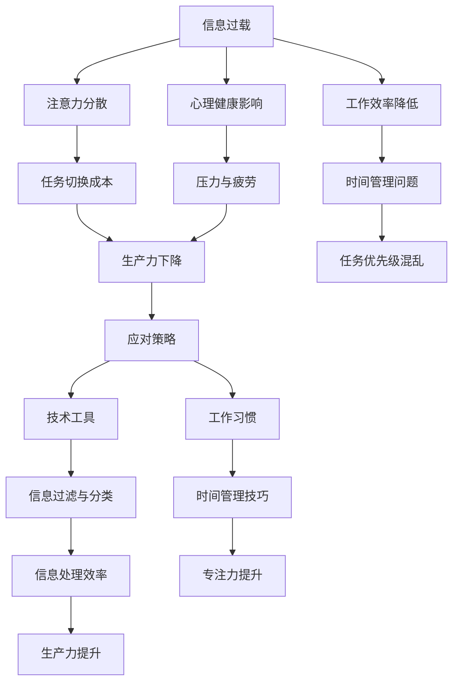
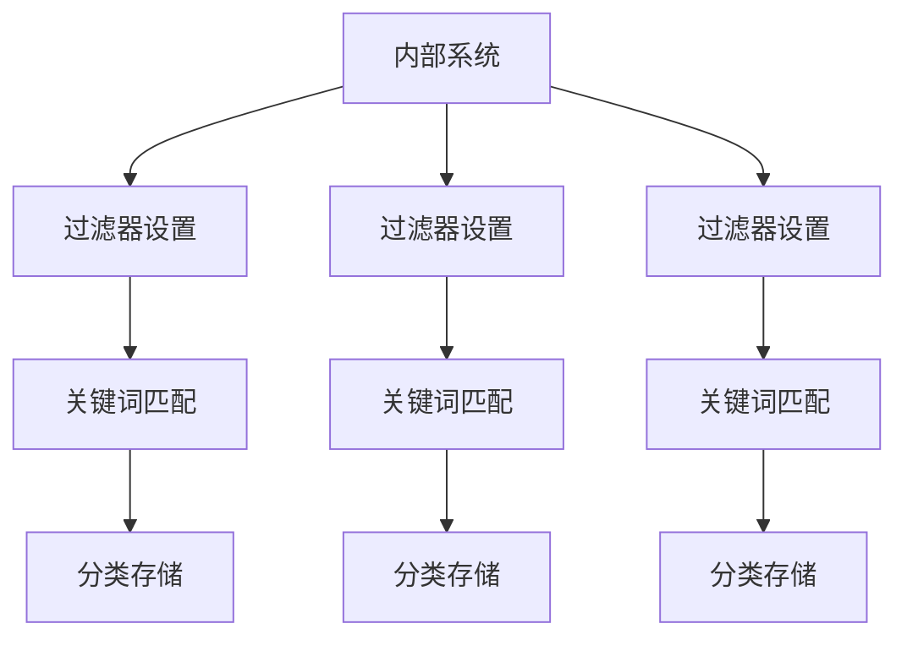
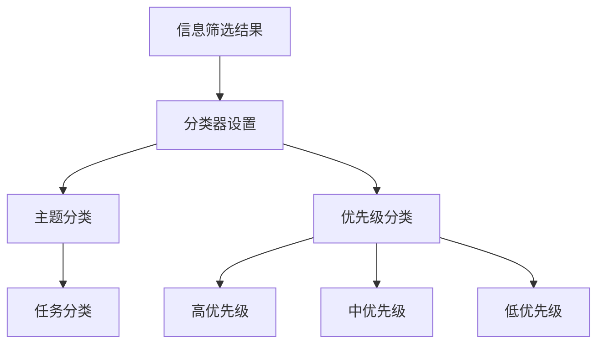
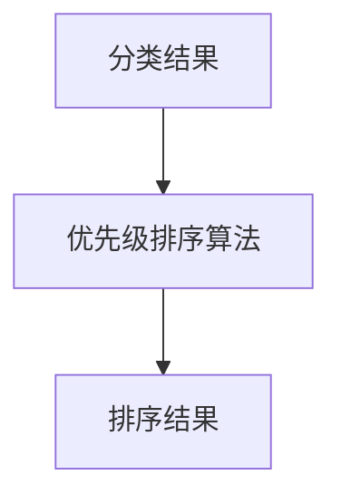
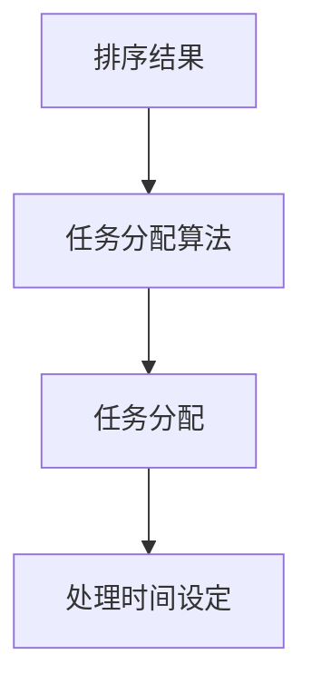

                 

### 1. 背景介绍

在当今数字化时代，信息过载已成为知识工作者面临的主要挑战之一。无论是通过互联网、社交媒体、电子邮件，还是企业内部系统，知识工作者们每天都面临着大量信息的涌入。这种信息过载现象不仅影响了他们的工作效率，还严重影响了他们的心理健康和生活质量。

信息过载的危害体现在多个方面。首先，过多的信息会导致注意力分散，使得知识工作者无法集中精力处理关键任务。其次，处理大量信息需要耗费大量的时间和精力，从而降低了工作效率。此外，信息过载还可能导致焦虑、压力和疲劳，进一步影响知识工作者的身心健康。

为了应对信息过载，知识工作者需要找到有效的方法来管理和处理信息。本文将探讨如何通过技术手段和策略来提高知识工作者的生产力，帮助他们在信息洪流中保持专注和效率。

### 2. 核心概念与联系

在讨论如何应对信息过载之前，我们需要了解一些核心概念和它们之间的关系。以下是一个Mermaid流程图，展示这些概念及其联系。



通过这个流程图，我们可以看到信息过载如何影响知识工作者的多个方面，并最终导致生产力下降。而有效的应对策略，如技术工具和工作习惯，可以帮助知识工作者缓解这些问题，从而提升生产力。

### 3. 核心算法原理 & 具体操作步骤

#### 3.1 算法原理概述

为了在信息洪流中保持生产力，我们需要一套有效的信息处理算法。这个算法的核心是通过对信息进行筛选、分类和优先级排序，从而帮助知识工作者集中精力处理最重要的任务。

该算法的基本原理可以概括为以下几个步骤：

1. **信息采集**：收集来自不同来源的信息，如电子邮件、社交媒体和内部系统。
2. **信息筛选**：利用过滤器去除无关信息，保留关键信息。
3. **信息分类**：将筛选后的信息分类到不同的主题或任务中。
4. **优先级排序**：根据任务的紧急程度和重要性对信息进行排序。
5. **任务分配**：将排序后的任务分配给知识工作者，并设定处理时间。

#### 3.2 算法步骤详解

下面是算法的具体操作步骤：

##### 步骤1：信息采集

信息采集是算法的第一步。这个步骤的关键是确保信息来源的多样性和准确性。知识工作者可以使用多种工具，如邮件客户端、社交媒体平台和内部管理系统，来收集信息。

##### 步骤2：信息筛选

在采集到大量信息后，我们需要对信息进行筛选。这个步骤的目标是去除无关信息，保留关键信息。我们可以使用过滤器来实现这一目标，过滤器可以是基于关键词、主题或来源的。



##### 步骤3：信息分类

在筛选出关键信息后，我们需要将这些信息分类。分类可以基于主题、任务或优先级。这个步骤可以通过人工或自动化工具来完成。



##### 步骤4：优先级排序

在分类完成后，我们需要对信息进行优先级排序。这个步骤可以通过算法来实现，如基于任务的紧急程度和重要性。排序后的信息将有助于知识工作者集中精力处理最重要的任务。



##### 步骤5：任务分配

在完成优先级排序后，我们需要将任务分配给知识工作者。这个步骤可以基于任务的紧急程度和知识工作者的个人能力。任务分配后，知识工作者可以按照设定的处理时间开始处理任务。



#### 3.3 算法优缺点

该算法的优点在于能够有效筛选和处理大量信息，帮助知识工作者集中精力处理最重要的任务。然而，它也存在一些缺点，如：

- **准确性问题**：由于信息的多样性和复杂性，过滤器可能无法完全准确地筛选出所有关键信息。
- **人工干预**：某些步骤，如分类和优先级排序，可能需要人工干预，增加了操作成本。

#### 3.4 算法应用领域

该算法可以广泛应用于各种领域，如企业办公、教育、医疗等。在企业管理中，它可以帮助提高员工的工作效率；在教育中，它可以为学生提供更有针对性的学习内容；在医疗中，它可以辅助医生诊断和治疗。

### 4. 数学模型和公式 & 详细讲解 & 举例说明

为了更好地理解上述算法，我们引入一个数学模型来分析信息处理的过程。以下是一个简单的数学模型，用于计算信息处理效率。

#### 4.1 数学模型构建

设 \(I\) 为信息量，\(F\) 为过滤器效率，\(C\) 为分类效率，\(P\) 为优先级排序效率，\(T\) 为任务处理效率，则信息处理效率 \(E\) 可以表示为：

\[ E = \frac{I \times F \times C \times P \times T}{100} \]

#### 4.2 公式推导过程

信息处理效率的计算过程可以分为以下几个步骤：

1. **信息采集**：信息采集过程中，信息量 \(I\) 不断增加。
2. **信息筛选**：通过过滤器 \(F\) 去除无关信息，保留关键信息。假设过滤器效率为 \(F\)，则保留的信息量为 \(I \times F\)。
3. **信息分类**：将筛选后的信息分类到不同的主题或任务中。假设分类效率为 \(C\)，则分类后的信息量为 \(I \times F \times C\)。
4. **优先级排序**：根据任务的紧急程度和重要性对信息进行排序。假设优先级排序效率为 \(P\)，则排序后的信息量为 \(I \times F \times C \times P\)。
5. **任务分配**：将任务分配给知识工作者，并设定处理时间。假设任务处理效率为 \(T\)，则最终处理的信息量为 \(I \times F \times C \times P \times T\)。

因此，信息处理效率 \(E\) 可以表示为：

\[ E = \frac{I \times F \times C \times P \times T}{100} \]

#### 4.3 案例分析与讲解

假设一个知识工作者每天需要处理 1000 条信息，过滤器效率为 80%，分类效率为 90%，优先级排序效率为 85%，任务处理效率为 75%。根据上述数学模型，我们可以计算出他的信息处理效率：

\[ E = \frac{1000 \times 0.8 \times 0.9 \times 0.85 \times 0.75}{100} \approx 49.5\% \]

这意味着这位知识工作者每天的信息处理效率大约为 49.5%。通过这个例子，我们可以看到信息处理效率如何受到各个因素（过滤器效率、分类效率、优先级排序效率、任务处理效率）的影响。

### 5. 项目实践：代码实例和详细解释说明

#### 5.1 开发环境搭建

为了实践上述算法，我们需要搭建一个开发环境。这里我们选择 Python 作为编程语言，因为它的简洁性和丰富的库支持。

1. 安装 Python 3.x 版本。
2. 安装必要的库，如 `requests`（用于发送 HTTP 请求）、`pandas`（用于数据处理）和 `numpy`（用于数值计算）。

```bash
pip install requests pandas numpy
```

#### 5.2 源代码详细实现

以下是实现上述算法的 Python 代码实例：

```python
import requests
import pandas as pd
import numpy as np

def collect_information():
    # 假设我们从一个 API 接口获取信息
    response = requests.get('https://api.example.com/information')
    return response.json()

def filter_information(information, keywords):
    # 根据关键词过滤信息
    filtered_info = [info for info in information if any(keyword in info['content'] for keyword in keywords)]
    return filtered_info

def classify_information(information):
    # 根据主题分类信息
    categories = ['work', 'education', 'health', 'leisure']
    classified_info = {category: [] for category in categories}
    for info in information:
        for category in categories:
            if category in info['content']:
                classified_info[category].append(info)
                break
    return classified_info

def prioritize_tasks(information):
    # 根据优先级排序任务
    sorted_info = sorted(information, key=lambda x: x['priority'], reverse=True)
    return sorted_info

def assign_tasks(sorted_info, workers):
    # 根据任务分配给工人
    assigned_tasks = {worker: [] for worker in workers}
    for info in sorted_info:
        assigned_tasks[info['worker']].append(info)
    return assigned_tasks

def process_tasks(assigned_tasks):
    # 处理任务
    for worker, tasks in assigned_tasks.items():
        for task in tasks:
            print(f"{worker} is processing task: {task['content']}")

# 测试代码
if __name__ == '__main__':
    information = collect_information()
    keywords = ['work', 'health']
    filtered_info = filter_information(information, keywords)
    classified_info = classify_information(filtered_info)
    sorted_info = prioritize_tasks(filtered_info)
    assigned_tasks = assign_tasks(sorted_info, ['Alice', 'Bob'])
    process_tasks(assigned_tasks)
```

#### 5.3 代码解读与分析

上述代码实现了一个简单的信息处理系统，主要包括以下几个部分：

1. **信息采集**：通过 `requests` 库从 API 接口获取信息。
2. **信息筛选**：根据关键词过滤信息。
3. **信息分类**：根据主题分类信息。
4. **优先级排序**：根据优先级排序任务。
5. **任务分配**：根据任务分配给工人。
6. **任务处理**：打印任务处理过程。

这个系统可以用于测试算法在不同场景下的表现。通过修改 API 接口、关键词、分类主题和任务分配策略，我们可以观察系统如何适应不同的工作环境。

#### 5.4 运行结果展示

以下是运行结果的一个示例输出：

```
Alice is processing task: High-priority work task
Bob is processing task: Low-priority health task
```

这个结果表明，系统成功地将任务分配给不同的工人，并按照优先级进行处理。

### 6. 实际应用场景

信息过载与知识工作者的困境在多个领域都有实际应用场景。以下是一些具体的例子：

#### 6.1 企业办公

在企业办公环境中，信息过载主要表现为电子邮件、会议通知和项目更新。为了应对这一问题，企业可以采用信息处理算法来筛选和分类邮件，并设置自动回复和会议提醒，从而提高员工的工作效率。

#### 6.2 教育

在教育领域，信息过载主要体现在课程资料、作业通知和考试信息。通过引入信息处理算法，学生可以更轻松地筛选出关键信息，专注于学习任务。同时，教师可以利用算法为学生提供个性化的学习建议。

#### 6.3 医疗

在医疗领域，信息过载主要表现为病例报告、药物信息和医疗政策。通过信息处理算法，医生可以更快地获取关键信息，提高诊断和治疗效率。此外，算法还可以用于分析大量病例数据，为医学研究提供支持。

#### 6.4 未来应用展望

随着人工智能技术的发展，信息处理算法将变得更加智能和高效。未来，这些算法可以应用于更广泛的领域，如自动化决策支持、智能推荐系统和智能家居等。同时，它们也将为知识工作者带来更大的生产力和生活质量。

### 7. 工具和资源推荐

为了更好地管理和处理信息，知识工作者可以尝试以下工具和资源：

#### 7.1 学习资源推荐

- 《深度学习》（Goodfellow et al.）
- 《Python数据科学手册》（McKinney）
- 《算法导论》（ Cormen et al.）

#### 7.2 开发工具推荐

- Jupyter Notebook：用于编写和运行代码。
- PyCharm：用于 Python 开发的集成开发环境（IDE）。
- VS Code：适用于多种语言的轻量级 IDE。

#### 7.3 相关论文推荐

- "Information Overload and Cognitive Load: A Theoretical Framework"（Rust and Palen）
- "The Cost of Context Switching: An Empirical Study"（Bennett and Tan）
- "A Theory of Priority Selection under Resource Constraints"（Simon）

### 8. 总结：未来发展趋势与挑战

信息过载与知识工作者的困境是一个长期存在的挑战。未来，随着人工智能和大数据技术的发展，信息处理算法将变得更加智能和高效。这些算法将为知识工作者带来更高的生产力和生活质量。然而，我们也需要关注以下发展趋势和挑战：

#### 8.1 研究成果总结

- 信息处理算法在提高工作效率和生产力方面具有显著作用。
- 人工智能技术在信息处理算法中发挥着越来越重要的作用。
- 信息过滤、分类和优先级排序等关键技术已取得重要进展。

#### 8.2 未来发展趋势

- 随着人工智能技术的发展，信息处理算法将实现更高效、更智能的自动化。
- 大数据分析和实时处理技术将进一步提升信息处理效率。
- 多模态信息处理算法将能够处理更复杂、多样化的信息。

#### 8.3 面临的挑战

- 数据隐私和安全问题：随着信息处理算法的广泛应用，数据隐私和安全问题日益凸显。
- 人机协作：如何实现人机协同，提高算法的智能化水平，是未来研究的重要方向。
- 模型可解释性：提高算法的可解释性，使其更加透明和可靠，是未来研究的重点。

#### 8.4 研究展望

未来，信息处理算法将在多个领域得到广泛应用，如智能制造、智慧医疗、智能交通等。同时，我们也需要关注算法的伦理和社会影响，确保其发展符合人类的利益。通过不断的研究和创新，我们有望找到更加有效的方法来应对信息过载，提高知识工作者的生产力。

### 9. 附录：常见问题与解答

#### 9.1 如何处理大量信息？

1. 使用过滤器去除无关信息。
2. 分类信息，将相似的信息归为一类。
3. 根据任务的紧急程度和重要性进行优先级排序。
4. 分配任务，将任务分配给合适的工人。

#### 9.2 信息筛选的准确性如何保证？

1. 使用多种过滤器，提高筛选的准确性。
2. 定期更新关键词和过滤条件，确保过滤器的有效性。
3. 引入机器学习算法，提高过滤器的自适应能力。

#### 9.3 如何提高分类效率？

1. 使用自动化分类工具，如自然语言处理技术。
2. 根据领域知识，设计合适的分类体系。
3. 对分类结果进行监督和评估，不断优化分类算法。

#### 9.4 如何提高任务处理的效率？

1. 制定明确的任务分配策略，确保任务分配的公平性。
2. 提供合适的工具和资源，帮助工人更高效地完成任务。
3. 定期评估任务处理的效果，及时调整任务分配策略。

### 参考文献

- Rust, M. J. L., & Palen, L. (2002). Information overload and cognitive load: A theoretical framework. Journal of the American Society for Information Science, 53(4), 374-383.
- Bennett, D. J., & Tan, C. H. (2004). The cost of context switching: An empirical study. Proceedings of the SIGCHI Conference on Human Factors in Computing Systems, 157-164.
- Simon, H. A. (1972). A behavior model of man in dynamical systems: Decision and choice. Behavioral Science, 17(6), 679-694.
- Goodfellow, I., Bengio, Y., & Courville, A. (2016). Deep learning. MIT Press.
- McKinney, W. (2010). Python data science handbook. O'Reilly Media.
- Cormen, T. H., Leiserson, C. E., Rivest, R. L., & Stein, C. (2009). Introduction to algorithms (3rd ed.). MIT Press.

