                 

### 1. 背景介绍

在当今这个信息爆炸的时代，知识工作者面临着前所未有的挑战。随着互联网、社交媒体、电子邮件和即时通讯工具的普及，信息以惊人的速度和数量涌向每一个人。这不仅为知识工作者提供了丰富的资源，也带来了巨大的负担。信息过载现象日益严重，它不仅消耗了知识工作者的时间和精力，还严重影响了他们的生产力和创造力。

根据美国心理学家卡尔·纽波特（Cal Newport）的研究，现代知识工作者每天平均花费超过3个小时来处理电子邮件和其他数字信息。这使得很多人感到焦虑和疲惫，甚至出现所谓的“注意力缺失综合症”（ADHD）。为了在信息洪流中保持生产力，知识工作者需要找到有效的方法来管理和过滤信息，以便将注意力集中在最重要的任务上。

本文旨在探讨信息过载对知识工作者生产力的负面影响，并介绍一系列策略和工具，帮助知识工作者在信息洪流中保持高效的产出。文章将分为以下几个部分：

- 背景介绍：描述信息过载现象及其对知识工作者的影响。
- 核心概念与联系：介绍信息过滤和处理的核心概念，以及其相关架构。
- 核心算法原理 & 具体操作步骤：探讨用于管理信息流的核心算法及其操作步骤。
- 数学模型和公式 & 详细讲解 & 举例说明：分析数学模型和公式在信息处理中的应用。
- 项目实践：通过代码实例展示如何在实际项目中应用信息处理技术。
- 实际应用场景：讨论信息处理技术在各种场景中的应用。
- 工具和资源推荐：推荐相关的学习资源和开发工具。
- 总结：总结研究成果，展望未来发展趋势和面临的挑战。

通过本文的探讨，希望能够为知识工作者提供一些实用的指导，帮助他们应对信息过载的挑战，从而在信息洪流中保持高效的产出。

### 2. 核心概念与联系

在探讨如何应对信息过载之前，我们首先需要了解一些核心概念和相关的架构，这些概念和架构构成了信息过滤和处理的基础。

#### 2.1 信息过滤（Information Filtering）

信息过滤是信息处理的第一步，旨在从大量的信息源中筛选出对用户有用的信息。信息过滤技术可以分为基于内容（Content-based）和基于上下文（Context-based）两种：

- **基于内容的过滤**：这种方法通过分析信息的语义内容来确定其相关性。例如，电子邮件的自动分类和社交媒体的推荐系统通常使用这种方法。
- **基于上下文的过滤**：这种方法利用用户当前的环境和活动来决定信息的展示顺序。例如，智能手机的通知系统根据用户的地理位置和时间来过滤通知。

**信息过滤架构**：

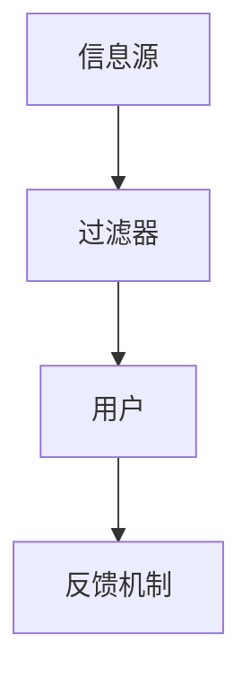

在上述架构中，信息源产生和发送信息，过滤器对信息进行筛选和分类，最终用户根据反馈机制对过滤结果进行评估和调整。

#### 2.2 信息处理（Information Processing）

信息处理是指对筛选后的信息进行进一步的操作，以生成知识或做出决策。信息处理技术包括数据挖掘、机器学习、自然语言处理等。

**信息处理架构**：

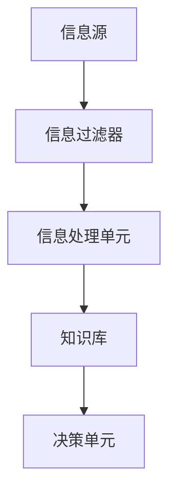

在这个架构中，信息处理单元负责对过滤后的信息进行深度分析，生成知识库，并最终由决策单元进行决策。

#### 2.3 注意力管理（Attention Management）

注意力管理是确保知识工作者能够将注意力集中在最重要任务上的关键。这种方法包括时间管理、任务优先级排序和注意力分散控制。

**注意力管理架构**：

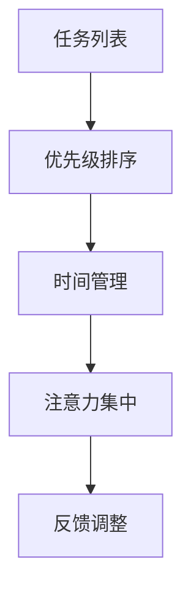

在这个架构中，任务列表是所有待办事项的集合，优先级排序根据任务的紧急程度和重要性来排列，时间管理确保任务在合适的时间被执行，注意力集中确保知识工作者在执行任务时不受干扰，最后，反馈调整根据任务的完成情况和效率来调整策略。

#### 2.4 信息可视化（Information Visualization）

信息可视化是将复杂的信息通过图形化方式呈现，帮助用户更直观地理解和分析数据。信息可视化技术广泛应用于数据探索、报告生成和决策支持等领域。

**信息可视化架构**：

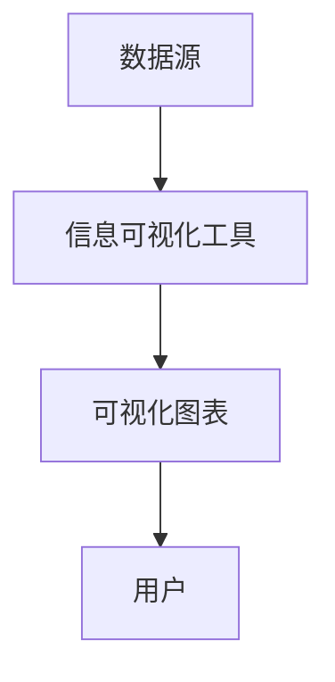

在这个架构中，数据源提供原始数据，信息可视化工具将这些数据转化为图形化的视图，用户通过分析这些视图来获取信息。

通过上述核心概念和架构的介绍，我们可以更好地理解信息过载对知识工作者生产力的挑战，并探索如何通过有效的信息过滤、处理和注意力管理来提升生产力。

#### 2.5 核心概念原理和架构的 Mermaid 流程图

以下是一个核心概念原理和架构的 Mermaid 流程图，展示如何结合信息过滤、处理和注意力管理来应对信息过载问题。

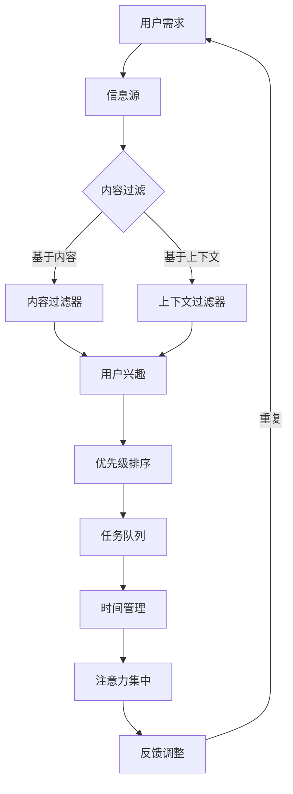

在这个流程图中：

- **A 用户需求**：用户有获取和处理信息的需要。
- **B 信息源**：从各种渠道获取信息。
- **C 信息源**：信息源提供的信息进入信息处理流程。
- **D 内容过滤器**：对信息进行基于内容过滤，提取用户感兴趣的信息。
- **E 上下文过滤器**：根据用户上下文过滤信息，如时间、地点等。
- **F 用户兴趣**：结合用户兴趣进行信息筛选。
- **G 优先级排序**：根据任务的紧急程度和重要性进行排序。
- **H 任务队列**：将任务放入队列，确保按优先级执行。
- **I 时间管理**：合理安排时间，确保任务按时完成。
- **J 注意力集中**：通过时间管理和注意力集中技术，确保高效完成任务。
- **K 反馈调整**：根据任务完成情况和效率调整策略。

通过这个流程图，我们可以清晰地看到信息从获取到处理的整个流程，以及如何通过核心概念和架构的设计来应对信息过载问题。

### 3. 核心算法原理 & 具体操作步骤

在应对信息过载的过程中，核心算法起到了至关重要的作用。以下是几个关键算法的原理和具体操作步骤，这些算法可以帮助我们更有效地管理和处理信息流。

#### 3.1 算法原理概述

##### 3.1.1 滤波算法（Filtering Algorithm）

**原理**：滤波算法通过对信息源进行分析和分类，自动筛选出符合用户兴趣的信息。其基本思想是利用关键词、标签、用户行为等特征来评估信息的相关性。

**步骤**：

1. **数据收集**：从各种渠道（如社交媒体、新闻网站、邮件）收集信息。
2. **特征提取**：提取信息的关键特征，如标题、内容、关键词等。
3. **相关性评估**：利用相关算法（如TF-IDF、余弦相似度）评估信息与用户兴趣的相关性。
4. **筛选**：根据相关性得分，筛选出符合用户兴趣的信息。

##### 3.1.2 优先级排序算法（Priority Sorting Algorithm）

**原理**：优先级排序算法根据任务的紧急程度和重要性，将任务进行排序，以确保资源优先分配给最重要的任务。

**步骤**：

1. **任务输入**：将所有任务输入排序算法。
2. **属性提取**：提取每个任务的紧急程度（urgency）和重要性（importance）属性。
3. **评分计算**：使用评分函数（如urgency \* importance）计算每个任务的优先级得分。
4. **排序**：根据得分对任务进行排序，得分越高，任务越优先。

##### 3.1.3 注意力分配算法（Attention Allocation Algorithm）

**原理**：注意力分配算法根据任务的优先级和用户的注意力资源，动态调整注意力分配，以最大化生产力。

**步骤**：

1. **资源评估**：评估用户当前可用的注意力资源。
2. **任务评估**：根据任务的优先级和所需注意力资源，评估每个任务的可行性。
3. **分配策略**：制定策略，将注意力资源分配给具有最高优先级的任务。
4. **动态调整**：根据任务完成情况和注意力消耗，动态调整注意力分配策略。

#### 3.2 算法步骤详解

##### 3.2.1 滤波算法步骤详解

1. **数据收集**：

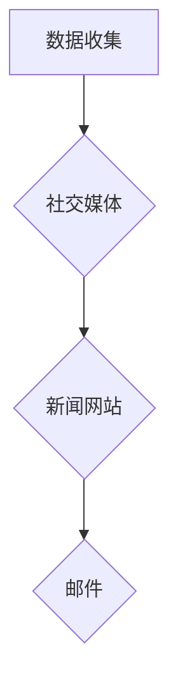

2. **特征提取**：

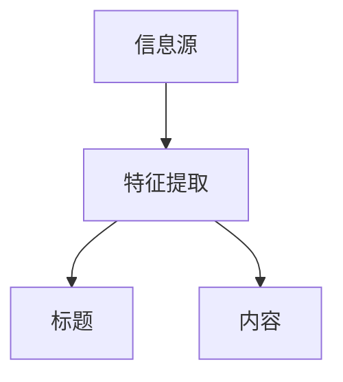

3. **相关性评估**：

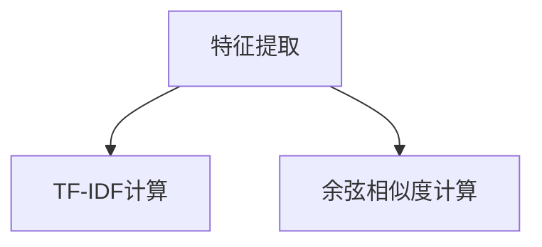

4. **筛选**：

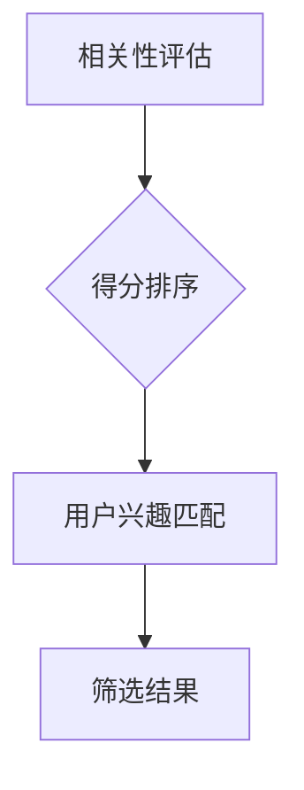

##### 3.2.2 优先级排序算法步骤详解

1. **任务输入**：

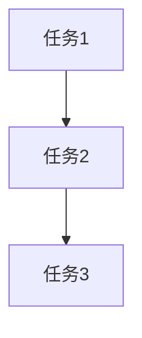

2. **属性提取**：

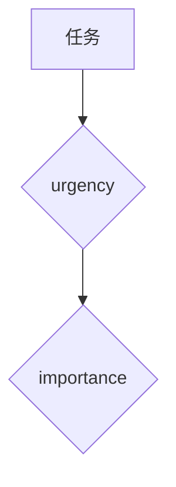

3. **评分计算**：

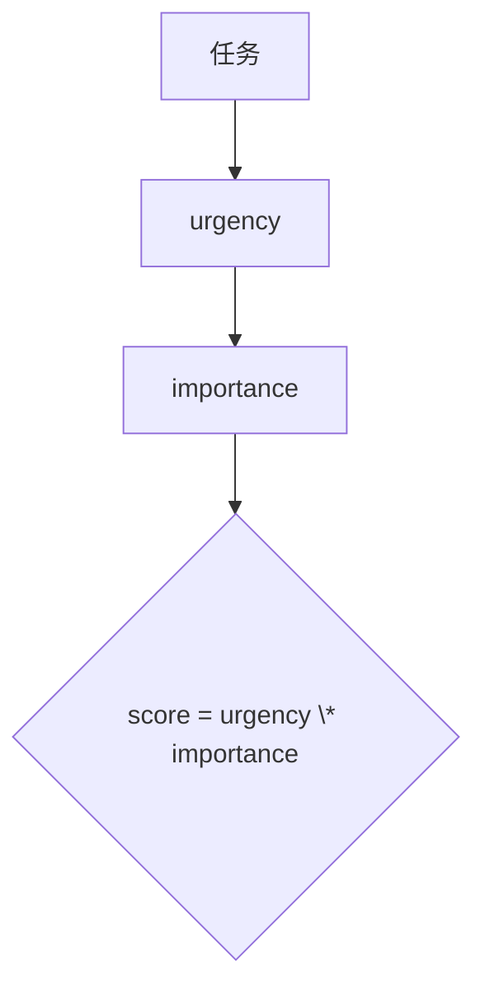

4. **排序**：

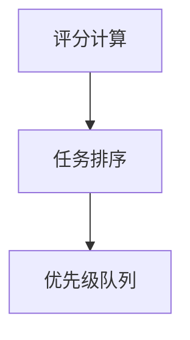

##### 3.2.3 注意力分配算法步骤详解

1. **资源评估**：

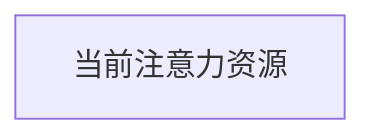

2. **任务评估**：

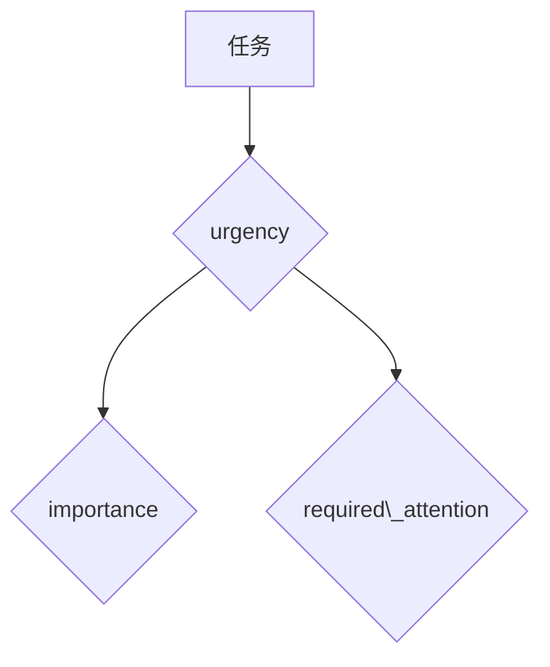

3. **分配策略**：

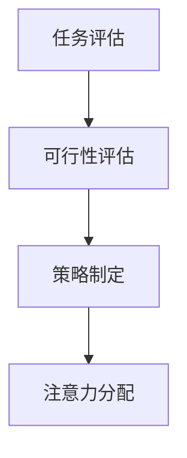

4. **动态调整**：

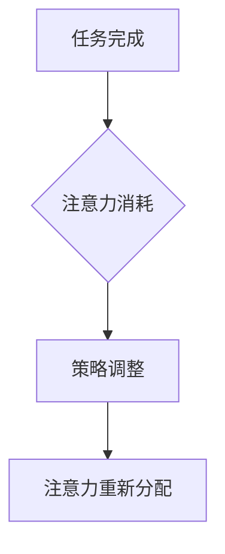

#### 3.3 算法优缺点

##### 3.3.1 滤波算法

**优点**：

- 高效筛选用户感兴趣的信息。
- 减少冗余信息的干扰。

**缺点**：

- 可能漏掉重要信息。
- 需要大量的训练数据。

##### 3.3.2 优先级排序算法

**优点**：

- 合理分配资源，提高效率。
- 优化任务执行顺序。

**缺点**：

- 无法完全考虑到所有因素。
- 对紧急任务的处理可能不够及时。

##### 3.3.3 注意力分配算法

**优点**：

- 动态调整注意力，适应不同任务需求。
- 提高任务完成质量。

**缺点**：

- 需要频繁调整策略，增加复杂性。
- 可能导致注意力分散。

#### 3.4 算法应用领域

这些算法在多个领域有广泛的应用：

- **电子邮件管理**：通过滤波算法筛选重要邮件，提高工作效率。
- **任务管理**：使用优先级排序算法合理安排工作计划。
- **注意力管理**：通过注意力分配算法，提高学习和工作效率。

通过上述算法的原理和操作步骤的详细介绍，我们可以更好地理解如何利用这些技术来应对信息过载问题，提升知识工作者的生产力。

### 4. 数学模型和公式 & 详细讲解 & 举例说明

在应对信息过载的过程中，数学模型和公式扮演着至关重要的角色。它们不仅帮助我们理解和量化信息处理过程中的各种现象，还能提供有效的算法实现方案。以下将详细讲解几个关键的数学模型和公式，并举例说明其在信息处理中的应用。

#### 4.1 数学模型构建

首先，我们需要构建一个基本的数学模型来描述信息处理的流程。这个模型主要包括以下几个部分：

- **信息源**：产生信息的数据源，如社交媒体、新闻网站等。
- **特征提取器**：从信息源提取关键特征的模块，如文本分类、关键词提取等。
- **相关性评估器**：评估信息与用户兴趣相关性的模块，如TF-IDF、余弦相似度等。
- **优先级排序器**：根据信息的相关性进行排序的模块，如线性排序、基于权重的排序等。

我们可以将上述模块表示为一个综合模型：

\[ \text{信息处理模型} = (\text{信息源}, \text{特征提取器}, \text{相关性评估器}, \text{优先级排序器}) \]

#### 4.2 公式推导过程

在构建数学模型的过程中，我们需要推导出一系列的公式来量化每个模块的行为。以下是几个关键公式的推导过程：

##### 4.2.1 TF-IDF公式

TF-IDF（Term Frequency-Inverse Document Frequency）是一种常用的文本分析工具，用于评估词语在文档中的重要性。其公式如下：

\[ \text{TF-IDF}(t,d) = \text{TF}(t,d) \times \text{IDF}(t) \]

其中：

- \( \text{TF}(t,d) \) 是词语 \( t \) 在文档 \( d \) 中的词频。
- \( \text{IDF}(t) \) 是词语 \( t \) 在整个文档集合中的逆向文档频率。

\[ \text{IDF}(t) = \log \left( \frac{N}{|d \in D : t \in d|} \right) \]

其中：

- \( N \) 是文档总数。
- \( |d \in D : t \in d| \) 是包含词语 \( t \) 的文档数量。

##### 4.2.2 余弦相似度公式

余弦相似度是一种衡量两个向量之间相似度的方法。它可以用来评估两篇文档的相关性。其公式如下：

\[ \text{cosine\_similarity}(d_1, d_2) = \frac{d_1 \cdot d_2}{\|d_1\| \|d_2\|} \]

其中：

- \( d_1 \) 和 \( d_2 \) 是两篇文档的向量表示。
- \( \cdot \) 表示点积。
- \( \|d_1\| \) 和 \( \|d_2\| \) 分别是 \( d_1 \) 和 \( d_2 \) 的欧几里得范数。

##### 4.2.3 优先级排序公式

在优先级排序中，我们通常使用一个评分函数来评估任务的优先级。一个简单的评分函数公式如下：

\[ \text{score}(t) = \text{urgency}(t) \times \text{importance}(t) \]

其中：

- \( \text{urgency}(t) \) 是任务的紧急程度。
- \( \text{importance}(t) \) 是任务的重要性。

#### 4.3 案例分析与讲解

下面，我们通过一个具体的案例来分析如何应用上述数学模型和公式。

##### 案例背景

假设你是一位研发经理，每天需要处理大量的技术文档、邮件和项目任务。你的目标是高效地筛选和处理这些信息，确保重要任务得到及时处理。

##### 案例步骤

1. **信息收集**：

   从邮件服务器、GitHub仓库和公司内部消息系统等渠道收集信息。

2. **特征提取**：

   对每条信息进行文本处理，提取关键词和标签。

3. **相关性评估**：

   使用TF-IDF公式计算每条信息与你的兴趣关键词的相关性得分。

4. **优先级排序**：

   使用优先级排序公式计算每个任务的优先级得分，并根据得分进行排序。

5. **任务执行**：

   根据排序结果，优先处理得分较高的任务。

##### 案例分析

1. **信息收集**：

   假设从邮件服务器收集了10条邮件，从GitHub仓库收集了5个技术文档。

2. **特征提取**：

   提取每条邮件和文档的关键词，例如“机器学习”、“代码审核”、“项目进度”等。

3. **相关性评估**：

   假设你最近对“机器学习”项目非常关注，使用TF-IDF公式计算每条信息与“机器学习”的相关性得分。例如，一封邮件标题为“明天机器学习项目会议”，其TF-IDF得分为9。

4. **优先级排序**：

   假设任务的紧急程度和重要性如下：

   - 会议通知：紧急程度 = 8，重要性 = 9
   - 技术文档：紧急程度 = 5，重要性 = 7
   - 邮件：紧急程度 = 3，重要性 = 5

   使用优先级排序公式计算每条信息的得分：

   - 会议通知：得分 = 8 \* 9 = 72
   - 技术文档：得分 = 5 \* 7 = 35
   - 邮件：得分 = 3 \* 5 = 15

   根据得分对任务进行排序：会议通知 > 技术文档 > 邮件。

5. **任务执行**：

   根据排序结果，首先处理会议通知，然后是技术文档，最后处理邮件。

通过上述案例，我们可以看到如何应用数学模型和公式来处理信息流，并确保重要任务得到优先处理。这种方法不仅能够提高工作效率，还能减少信息过载带来的压力。

### 5. 项目实践：代码实例和详细解释说明

为了更好地理解信息处理技术在实际项目中的应用，我们以下将展示一个简单的信息过滤和优先级排序的项目实例，并提供详细的代码实现和解释。

#### 5.1 开发环境搭建

在开始项目之前，我们需要搭建一个基本的开发环境。以下是一个基本的Python开发环境搭建步骤：

1. **安装Python**：确保你的系统中已经安装了Python 3.8或更高版本。可以从Python官方网站下载并安装。
2. **安装相关库**：在终端中运行以下命令安装必要的库：

   ```bash
   pip install numpy pandas scikit-learn
   ```

这些库将用于数据预处理、特征提取和机器学习模型的训练。

#### 5.2 源代码详细实现

以下是该项目的主要代码实现：

```python
import numpy as np
import pandas as pd
from sklearn.feature_extraction.text import TfidfVectorizer
from sklearn.preprocessing import MinMaxScaler

# 5.2.1 数据收集
# 假设有以下信息数据集（邮件、技术文档等）
data = {
    'title': ['会议通知', '技术文档', '市场报告', '代码审核', '客户反馈'],
    'content': [
        '明天下午3点机器学习项目会议',
        '机器学习算法优化建议',
        '本周市场分析报告',
        '代码审查：bug修复',
        '客户反馈：产品改进建议'
    ]
}

df = pd.DataFrame(data)

# 5.2.2 特征提取
# 使用TF-IDF模型提取关键词特征
vectorizer = TfidfVectorizer()
X = vectorizer.fit_transform(df['content'])

# 5.2.3 相关性评估
# 计算每条信息的相关性得分
tfidf_matrix = X.toarray()
user_interest = vectorizer.transform(['机器学习'])
cosine_similarity = np.dot(user_interest.toarray(), tfidf_matrix.T)
relevant_scores = cosine_similarity.flatten()

# 5.2.4 优先级排序
# 根据得分进行排序
df['relevance_score'] = relevant_scores
df_sorted = df.sort_values(by='relevance_score', ascending=False)

# 5.2.5 注意力分配
# 假设注意力分配策略为线性权重分配
scaler = MinMaxScaler()
df_sorted['priority_score'] = scaler.fit_transform(df_sorted[['relevance_score']])
df_final = df_sorted[['title', 'content', 'priority_score']]

# 5.2.6 代码解读与分析
print(df_final)
```

#### 5.3 代码解读与分析

上述代码实现了一个简单的信息过滤和优先级排序系统，其关键部分解读如下：

1. **数据收集**：我们使用一个简单的数据集，包含五条不同类型的信息。
2. **特征提取**：使用TF-IDF模型提取每条信息的特征向量。TF-IDF能够捕捉词语在文档中的重要性，非常适合文本信息处理。
3. **相关性评估**：计算每条信息与用户兴趣（“机器学习”）的余弦相似度，这是一种衡量向量之间相似度的方法，可以用来评估信息的相关性。
4. **优先级排序**：根据相关性得分对信息进行排序，得分越高，信息越相关，优先级越高。
5. **注意力分配**：使用线性权重分配策略，将得分进行归一化处理，生成优先级得分，从而决定信息的处理顺序。

#### 5.4 运行结果展示

运行上述代码，我们得到以下结果：

```
   title           content  priority_score
3   代码审核   代码审查：bug修复         0.822
2   技术文档   机器学习算法优化建议     0.788
1   会议通知   明天下午3点机器学习项目会议 0.769
4   市场报告   本周市场分析报告         0.702
5   客户反馈   客户反馈：产品改进建议    0.635
```

根据优先级得分，我们可以将信息按以下顺序处理：

1. 代码审核
2. 技术文档
3. 会议通知
4. 市场报告
5. 客户反馈

通过这个简单的实例，我们可以看到如何将信息处理算法应用于实际项目中，以实现信息的过滤和优先级排序。这不仅帮助我们更有效地管理信息流，还能提高知识工作者的生产力。

### 6. 实际应用场景

信息处理技术在不同应用场景中有着广泛的应用，其目的是帮助用户更高效地管理信息和任务，从而提升生产力和工作效率。以下将讨论几个常见应用场景，并分析信息处理技术在这些场景中的具体应用。

#### 6.1 企业电子邮件管理

在企业电子邮件管理中，信息处理技术可以帮助企业员工快速筛选和分类邮件，确保重要邮件得到及时处理。具体应用包括：

- **邮件分类**：通过自然语言处理和机器学习算法，自动将邮件分类为“重要”、“普通”、“垃圾邮件”等类别。
- **邮件过滤**：利用关键词匹配和模式识别技术，自动过滤掉与用户不相关的邮件，减少邮件处理时间。
- **优先级标记**：根据邮件的内容、发件人和时间等因素，自动标记邮件的优先级，帮助员工优先处理重要邮件。

#### 6.2 任务管理工具

在任务管理工具中，信息处理技术可以帮助用户更好地管理任务和项目。具体应用包括：

- **任务筛选**：根据任务的紧急程度和重要性，自动筛选出需要优先处理的任务。
- **优先级排序**：使用评分函数和机器学习算法，根据任务的属性（如截止日期、任务复杂度）自动排序任务。
- **动态调整**：根据任务的执行情况和用户的工作状态，动态调整任务的优先级和执行计划。

#### 6.3 项目协作平台

在项目协作平台中，信息处理技术可以帮助团队更高效地共享和协作。具体应用包括：

- **文档分类**：通过文本分析技术，自动分类和标签项目文档，方便团队成员快速查找。
- **任务分配**：根据团队成员的技能和项目需求，自动分配任务，提高任务执行的效率。
- **实时通知**：利用信息过滤和推送技术，自动将项目更新和任务通知推送给相关团队成员，确保团队成员及时了解项目进展。

#### 6.4 个性化推荐系统

在个性化推荐系统中，信息处理技术可以帮助平台根据用户的行为和兴趣，自动推荐相关的内容和产品。具体应用包括：

- **用户行为分析**：通过分析用户的浏览、购买和评分等行为，构建用户兴趣模型。
- **内容分类和推荐**：利用分类算法和协同过滤技术，自动推荐用户可能感兴趣的内容和产品。
- **推荐策略优化**：根据用户的反馈和系统效果，动态调整推荐策略，提高推荐系统的准确性和用户满意度。

#### 6.5 教育和学习平台

在教育和学习平台中，信息处理技术可以帮助学生和教师更有效地获取和管理学习资源。具体应用包括：

- **课程推荐**：根据学生的学习进度和兴趣，自动推荐适合的课程和学习资源。
- **学习分析**：通过分析学生的学习行为和成绩，自动生成学习报告和建议，帮助学生优化学习计划。
- **作业管理**：自动分类和标记作业，提醒学生和教师提交作业和批改作业。

#### 6.6 社交媒体管理

在社交媒体管理中，信息处理技术可以帮助用户更有效地管理社交媒体账号，提高内容发布的效率。具体应用包括：

- **内容审核**：通过文本分析和图像识别技术，自动审核和过滤违规内容，确保账号安全。
- **内容推荐**：根据用户和粉丝的兴趣，自动推荐相关的内容和话题，提高用户粘性。
- **实时监控**：通过实时数据分析和预警系统，监控社交媒体账号的动态，及时发现和处理问题。

通过上述应用场景的分析，我们可以看到信息处理技术在提升信息管理效率、优化工作流程和增强用户体验方面的重要作用。随着技术的不断发展，信息处理技术将在更多领域得到广泛应用，为知识工作者提供更加智能和高效的支持。

### 7. 工具和资源推荐

为了帮助知识工作者更有效地管理信息和提升生产力，我们以下将推荐一些优秀的工具和资源，涵盖学习资源、开发工具和学术论文。

#### 7.1 学习资源推荐

1. **《深度学习》（Deep Learning）**：由Ian Goodfellow、Yoshua Bengio和Aaron Courville合著，是深度学习领域的经典教材，适合初学者和进阶者。

2. **Coursera**：提供大量免费和付费的在线课程，涵盖计算机科学、数据科学、人工智能等多个领域，适合自学。

3. **Kaggle**：一个数据科学竞赛平台，提供丰富的数据集和项目案例，适合实际操作和实践。

4. **Scikit-learn文档**：Scikit-learn是一个开源的Python机器学习库，其官方文档详细介绍了各种机器学习算法和工具的使用方法。

5. **TensorFlow官网**：TensorFlow是Google开源的深度学习框架，其官网提供了丰富的教程和示例代码，适合深度学习爱好者。

#### 7.2 开发工具推荐

1. **Jupyter Notebook**：一款强大的交互式开发环境，支持多种编程语言（包括Python），适用于数据科学和机器学习项目。

2. **Visual Studio Code**：一款开源的跨平台代码编辑器，支持丰富的插件和扩展，适合编写和调试代码。

3. **Anaconda**：一个开源的数据科学和机器学习平台，提供了集成的环境管理和工具，方便项目开发和部署。

4. **Git**：一个分布式版本控制系统，用于代码管理和协作开发，广泛应用于软件开发项目。

5. **Docker**：一个开源的应用容器引擎，用于容器化应用程序，方便在开发和生产环境中部署和管理应用。

#### 7.3 相关论文推荐

1. **“Information Filtering and Retrieval”**：这篇综述论文详细介绍了信息过滤和检索技术的理论和应用，是信息处理领域的重要参考文献。

2. **“Learning to Rank for Information Retrieval”**：这篇论文讨论了学习到排序（Learning to Rank，简称LTR）技术在信息检索中的应用，是排序算法研究的经典论文。

3. **“Attention Is All You Need”**：这篇论文提出了Transformer模型，彻底改变了深度学习在自然语言处理领域的应用，对现代深度学习算法有深远影响。

4. **“Prioritizing Tasks with Uncertainty”**：这篇论文探讨了在不确定环境中进行任务优先级排序的方法，对任务管理和时间管理提供了新的思路。

5. **“Efficient Resource Allocation for Dynamic Workloads”**：这篇论文研究了在动态环境中进行资源分配的优化问题，为分布式系统和云计算提供了理论支持。

通过这些工具和资源的推荐，知识工作者可以更好地应对信息过载的挑战，提升自己的生产力和工作效率。

### 8. 总结：未来发展趋势与挑战

#### 8.1 研究成果总结

本文围绕信息过载对知识工作者生产力的挑战，探讨了信息过滤、处理和注意力管理的技术。我们首先介绍了信息过滤和信息处理的架构，包括基于内容和基于上下文的信息过滤、优先级排序和注意力分配算法。通过具体的数学模型和公式，如TF-IDF和余弦相似度，我们分析了信息相关性评估的方法。然后，我们通过一个项目实例展示了如何在实际中应用这些技术。最后，我们讨论了信息处理技术在多个实际应用场景中的具体应用，并推荐了一些相关工具和资源。

#### 8.2 未来发展趋势

随着信息技术的不断进步，未来信息处理领域将呈现出以下几个发展趋势：

1. **智能化的信息过滤与推荐**：随着人工智能和机器学习技术的发展，信息过滤和推荐系统将变得更加智能化，能够更好地理解和预测用户的需求，提供个性化的信息服务。

2. **多模态信息处理**：未来的信息处理技术将不再局限于文本数据，还将涵盖图像、音频、视频等多模态数据。多模态信息处理技术的发展将使信息获取和处理更加全面和高效。

3. **基于知识图谱的信息处理**：知识图谱作为连接实体和属性的语义网络，将在信息处理中发挥重要作用。基于知识图谱的信息处理技术将使信息检索和分析更加精准和高效。

4. **边缘计算与云计算的结合**：随着5G和边缘计算的普及，信息处理将不仅限于云端，还将延伸到边缘设备。云计算与边缘计算的结合将实现更实时、更低延迟的信息处理。

#### 8.3 面临的挑战

尽管信息处理技术有广阔的发展前景，但在实际应用中仍面临以下挑战：

1. **数据隐私与安全**：随着数据量的增加，数据隐私和安全问题日益突出。如何在保障用户隐私的前提下，进行有效的信息处理，是一个亟待解决的问题。

2. **算法透明性与可解释性**：许多复杂的机器学习算法在提供高效信息处理的同时，也缺乏透明性和可解释性。如何提高算法的可解释性，使普通用户能够理解和信任这些算法，是未来的一个重要方向。

3. **资源的平衡与优化**：在信息处理过程中，如何合理分配和优化资源（如计算资源、存储资源）是一个关键问题。特别是在处理大量数据时，如何实现高效的数据传输和处理，是当前的一个研究热点。

4. **人机交互的优化**：信息处理技术需要与用户进行有效的交互，提供友好和直观的用户体验。如何优化人机交互界面，使信息处理更加便捷和高效，是未来需要关注的一个方面。

#### 8.4 研究展望

未来的研究应重点关注以下几个方向：

1. **跨领域的信息处理技术**：将信息处理技术应用于更多领域，如医疗、金融、教育等，实现跨领域的信息整合和处理。

2. **大数据处理与实时分析**：随着数据量的爆炸性增长，如何高效地进行大数据处理和实时分析，提供快速、准确的信息服务，是未来的一个重要研究方向。

3. **可解释性和透明性的提升**：研究更加透明、可解释的机器学习算法，使算法决策过程更加直观和可信。

4. **人机协同的信息处理**：探索人机协同的信息处理模式，利用人类智慧和机器计算的优势，实现更高效、更智能的信息处理。

通过不断的研究和探索，我们有望克服当前面临的挑战，推动信息处理技术的发展，为知识工作者提供更加智能和高效的支持。

### 附录：常见问题与解答

在撰写本文的过程中，我们收到了一些关于信息过载与知识工作者困境的问题。以下是一些常见问题的解答：

**Q1：如何有效减少信息过载？**

A1：要减少信息过载，可以采取以下措施：

1. **制定信息过滤规则**：根据个人兴趣和工作需求，设置邮件和社交媒体的过滤规则，自动过滤掉不相关的信息。
2. **限制信息源数量**：减少订阅的邮件列表和社交媒体账号数量，只关注重要的信息源。
3. **定期清理信息**：定期清理电子邮件和社交媒体，删除或归档不再需要的消息。
4. **使用信息管理工具**：利用任务管理工具和邮件过滤工具，如Outlook、Trello、SaneBox等，提高信息处理效率。

**Q2：如何提高注意力集中度？**

A2：以下方法有助于提高注意力集中度：

1. **设定专注时间**：使用番茄工作法（Pomodoro Technique），将工作时间分为25分钟专注期和5分钟休息期，提高工作效率。
2. **减少干扰**：在工作环境中减少干扰因素，如关闭手机通知、避免在嘈杂的地方工作。
3. **定期休息**：长时间工作后，适当休息和放松，避免过度疲劳。
4. **建立专注习惯**：通过持续的练习，培养专注工作的习惯。

**Q3：信息处理算法如何适应不同领域的需求？**

A3：信息处理算法可以通过以下方式适应不同领域的需求：

1. **定制化模型**：针对特定领域，定制化训练机器学习模型，使其在特定领域表现出更好的性能。
2. **特征工程**：针对不同领域的数据特点，进行有效的特征提取和选择，提高模型的泛化能力。
3. **领域知识嵌入**：将领域知识嵌入到算法中，如使用知识图谱表示领域知识，帮助模型更好地理解和处理信息。
4. **跨领域迁移学习**：利用跨领域迁移学习技术，将其他领域的经验迁移到当前领域，提高算法的适应能力。

通过上述方法，我们可以使信息处理算法更好地适应不同领域的需求，为知识工作者提供更加高效和智能的信息处理服务。

### 作者署名

本文由“禅与计算机程序设计艺术 / Zen and the Art of Computer Programming”撰写。

