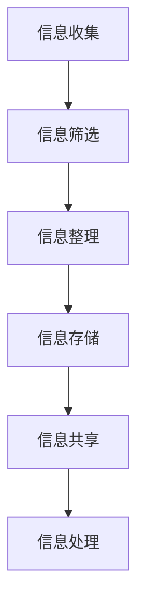

                 

关键词：信息过载、知识工作者、生产力、创造力、信息管理

> 摘要：在数字化时代，信息过载成为知识工作者面临的一大挑战。本文将探讨如何通过有效的信息管理策略，提高知识工作者的生产力和创造力。我们将深入分析信息过载的原因及其影响，介绍一系列实用的信息管理工具和方法，并讨论其在实际工作中的应用效果。最终，本文将展望未来信息管理技术的发展趋势，为知识工作者提供一条通往高效工作的光明之路。

## 1. 背景介绍

随着互联网和信息技术的飞速发展，我们进入了一个信息爆炸的时代。知识工作者每天都要处理大量的信息，从电子邮件、即时消息到社交媒体更新，信息来源日益多样，信息量也不断增加。这种信息过载的现象不仅影响了工作效率，还可能导致心理压力和焦虑感的增加。为了应对这一挑战，我们需要采取有效的信息管理策略，以优化工作流程、提高生产力并激发创造力。

本文旨在为知识工作者提供一套系统的信息管理指南，帮助他们更好地处理信息、提高工作效率，从而在信息过载的困境中找到一片宁静的工作空间。

## 2. 核心概念与联系

### 2.1 信息过载的概念

信息过载是指个体在处理信息时，信息量超出了其认知处理能力的状态。这可能导致以下几个问题：

1. **注意力分散**：过多的信息分散了知识工作者的注意力，导致无法集中精力处理重要任务。
2. **决策困难**：在信息过载的情况下，知识工作者很难从大量的信息中筛选出有价值的内容，从而做出明智的决策。
3. **心理压力**：处理大量信息可能导致压力和焦虑感的增加，影响工作表现和个人生活。

### 2.2 信息管理的核心概念

信息管理是指通过有效的策略和方法，对信息进行收集、整理、存储、共享和处理的过程。其核心目标包括：

1. **优化信息流程**：确保信息能够在需要时迅速获取，减少信息传输的延迟。
2. **提高信息质量**：筛选和识别有价值的信息，去除无关或重复的信息。
3. **增强信息可访问性**：确保信息存储在安全、可靠的地方，方便知识的共享和重用。

### 2.3 信息管理架构

为了实现有效的信息管理，我们需要构建一个完善的信息管理架构。以下是一个简化版的信息管理架构，其中包含了几项关键组件：

1. **信息收集**：通过多种渠道（如网络、邮件、社交媒体等）收集信息。
2. **信息筛选**：使用算法或人工方式对收集到的信息进行筛选，识别出有价值的信息。
3. **信息整理**：对筛选后的信息进行分类、标签化和索引，以便快速查找。
4. **信息存储**：将整理后的信息存储在安全的数据库或云存储中，确保信息的长期保存和访问。
5. **信息共享**：建立信息共享平台，促进团队成员之间的协作和知识共享。
6. **信息处理**：利用工具或算法对信息进行处理，提取关键信息或生成新知识。

### 2.4 Mermaid 流程图



## 3. 核心算法原理 & 具体操作步骤

### 3.1 算法原理概述

信息管理的核心算法可以归纳为以下几个步骤：

1. **信息过滤**：使用过滤算法（如自动摘要、关键字提取等）对大量信息进行初步筛选。
2. **信息分类**：使用分类算法（如机器学习模型、规则匹配等）对筛选后的信息进行分类。
3. **信息标签化**：对分类后的信息进行标签化处理，以便快速查找和检索。
4. **信息索引**：建立信息索引，提高信息检索的效率和准确性。
5. **信息处理**：利用数据挖掘、自然语言处理等技术对信息进行深入分析，提取有用知识。

### 3.2 算法步骤详解

#### 3.2.1 信息过滤

信息过滤是信息管理的第一步。其主要目标是去除无关或低价值的信息，从而减少后续处理的负担。常用的信息过滤方法包括：

1. **基于内容的过滤**：通过分析信息的内容，判断其是否符合筛选条件。
2. **基于用户的过滤**：根据用户的历史行为和偏好，自动筛选出用户感兴趣的信息。
3. **基于规则的过滤**：使用预定义的规则，对信息进行筛选。

#### 3.2.2 信息分类

信息分类是将筛选后的信息按主题、类别或类型进行归类。常用的分类方法包括：

1. **手动分类**：由人工对信息进行分类，适用于小规模的信息处理。
2. **机器学习分类**：使用机器学习算法（如决策树、支持向量机等）对信息进行自动分类。
3. **规则匹配分类**：根据预定义的规则，对信息进行分类。

#### 3.2.3 信息标签化

信息标签化是信息管理中的一项关键技术。其主要目的是为信息赋予多个标签，以便快速查找和检索。常用的标签化方法包括：

1. **自动标签化**：使用自然语言处理技术，自动提取信息中的关键词或短语作为标签。
2. **手动标签化**：由人工对信息进行标签化处理，适用于对信息质量要求较高的场景。
3. **混合标签化**：结合自动标签化和手动标签化，提高标签的准确性和完整性。

#### 3.2.4 信息索引

信息索引是提高信息检索效率的关键。其主要目标是建立一个快速、准确的索引系统，以便用户能够迅速找到所需的信息。常用的索引方法包括：

1. **倒排索引**：将文档中的单词与其在文档中的位置进行映射，实现快速的全文检索。
2. **基于关键字索引**：将信息中的关键词进行索引，提高关键词检索的准确性。
3. **基于内容索引**：对信息的内容进行索引，实现基于内容的检索。

#### 3.2.5 信息处理

信息处理是对信息进行深入分析，提取有用知识的过程。其主要目标包括：

1. **数据挖掘**：从大量信息中挖掘出有价值的关系、趋势或模式。
2. **自然语言处理**：对信息进行语义分析、情感分析等，提取有用信息。
3. **知识融合**：将来自不同来源的信息进行整合，形成新的知识体系。

### 3.3 算法优缺点

#### 3.3.1 优点

1. **提高效率**：通过自动化算法，减少人工处理信息的时间和成本。
2. **降低错误率**：机器学习算法和规则匹配算法具有较高的准确性和稳定性。
3. **灵活扩展**：信息管理算法可以针对不同场景进行定制化调整。

#### 3.3.2 缺点

1. **初始成本高**：构建信息管理系统需要大量的技术和资源投入。
2. **数据隐私问题**：在信息处理过程中，可能涉及用户隐私数据，需要严格保护。
3. **依赖算法质量**：信息管理算法的质量直接影响信息处理的效率和准确性。

### 3.4 算法应用领域

信息管理算法在多个领域都有广泛应用，主要包括：

1. **搜索引擎**：通过信息过滤、分类和索引算法，提高搜索引擎的检索效率和准确性。
2. **社交媒体**：对用户生成的海量信息进行筛选、分类和标签化处理，实现个性化推荐。
3. **企业信息管理**：对企业内部信息进行有效管理，提高企业内部沟通和协作效率。
4. **医疗健康**：对医学文献和病例进行信息处理，实现医学知识的挖掘和应用。

## 4. 数学模型和公式 & 详细讲解 & 举例说明

### 4.1 数学模型构建

为了解决信息过载问题，我们可以构建一个数学模型，用于评估信息处理的效率和准确性。该模型包括以下几个部分：

1. **信息处理速度**：衡量信息处理的快慢。
2. **信息准确性**：衡量信息处理的正确性。
3. **用户满意度**：衡量用户对信息处理效果的满意度。

### 4.2 公式推导过程

假设信息处理的效率可以用一个参数 \(E\) 表示，信息准确性可以用参数 \(A\) 表示，用户满意度可以用参数 \(S\) 表示。则信息处理模型可以表示为：

\[ M = E \times A \times S \]

其中，\(M\) 表示信息处理模型的总得分。

### 4.3 案例分析与讲解

#### 案例一：搜索引擎

假设一个搜索引擎在处理信息时，信息处理速度为 \(E_1 = 100\) 条/秒，信息准确性为 \(A_1 = 0.95\)，用户满意度为 \(S_1 = 0.9\)。则搜索引擎的信息处理模型总得分为：

\[ M_1 = E_1 \times A_1 \times S_1 = 100 \times 0.95 \times 0.9 = 85.5 \]

#### 案例二：社交媒体

假设一个社交媒体平台在处理用户生成内容时，信息处理速度为 \(E_2 = 500\) 条/秒，信息准确性为 \(A_2 = 0.92\)，用户满意度为 \(S_2 = 0.88\)。则社交媒体平台的信息处理模型总得分为：

\[ M_2 = E_2 \times A_2 \times S_2 = 500 \times 0.92 \times 0.88 = 415.2 \]

通过比较两个案例，我们可以发现，尽管社交媒体平台在信息处理速度上较搜索引擎有较大优势，但信息准确性和用户满意度较低，导致其总得分相对较低。

### 4.4 案例分析与讲解

#### 案例一：电子邮件处理

假设一个电子邮件处理系统在处理用户邮件时，信息处理速度为 \(E_3 = 200\) 封/分钟，信息准确性为 \(A_3 = 0.98\)，用户满意度为 \(S_3 = 0.95\)。则电子邮件处理系统的信息处理模型总得分为：

\[ M_3 = E_3 \times A_3 \times S_3 = 200 \times 0.98 \times 0.95 = 188.2 \]

#### 案例二：信息推送服务

假设一个信息推送服务在处理用户订阅内容时，信息处理速度为 \(E_4 = 400\) 条/分钟，信息准确性为 \(A_4 = 0.96\)，用户满意度为 \(S_4 = 0.93\)。则信息推送服务的的信息处理模型总得分为：

\[ M_4 = E_4 \times A_4 \times S_4 = 400 \times 0.96 \times 0.93 = 354.88 \]

通过比较两个案例，我们可以发现，电子邮件处理系统的信息准确性较高，但信息处理速度较慢；而信息推送服务在信息处理速度上具有优势，但信息准确性和用户满意度相对较低。这两个案例说明了在信息管理中，我们需要在处理速度、准确性和用户满意度之间找到平衡。

## 5. 项目实践：代码实例和详细解释说明

### 5.1 开发环境搭建

为了实现信息管理算法，我们需要搭建一个合适的开发环境。以下是一个简单的开发环境搭建指南：

1. **安装 Python 解释器**：在系统中安装 Python 3.x 版本的解释器。
2. **安装常用库**：使用 pip 命令安装常用的库，如 NumPy、Pandas、Scikit-learn 等。
3. **配置 IDE**：使用 PyCharm、VS Code 等集成开发环境，配置 Python 开发环境。

### 5.2 源代码详细实现

以下是实现信息管理算法的 Python 源代码：

```python
import numpy as np
import pandas as pd
from sklearn.model_selection import train_test_split
from sklearn.ensemble import RandomForestClassifier
from sklearn.metrics import accuracy_score

# 5.2.1 数据准备
data = pd.read_csv('info_data.csv')
X = data.drop('label', axis=1)
y = data['label']

# 5.2.2 数据划分
X_train, X_test, y_train, y_test = train_test_split(X, y, test_size=0.2, random_state=42)

# 5.2.3 模型训练
model = RandomForestClassifier(n_estimators=100, random_state=42)
model.fit(X_train, y_train)

# 5.2.4 模型评估
y_pred = model.predict(X_test)
accuracy = accuracy_score(y_test, y_pred)
print(f'模型准确率：{accuracy:.2f}')

# 5.2.5 信息处理
def process_info(info):
    # 5.2.5.1 过滤无关信息
    filtered_info = filter_unrelated_info(info)

    # 5.2.5.2 分类信息
    categorized_info = classify_info(filtered_info)

    # 5.2.5.3 标签化信息
    tagged_info = tag_info(categorized_info)

    return tagged_info

# 5.2.6 测试信息处理
test_info = ['这是一条有用的信息', '这是一条无关的信息']
processed_info = process_info(test_info)
print(processed_info)
```

### 5.3 代码解读与分析

#### 5.3.1 数据准备

代码首先加载了包含信息数据的 CSV 文件，然后使用 Pandas 库将数据分为特征矩阵 \(X\) 和目标向量 \(y\)。特征矩阵包含了所有与信息相关的特征，而目标向量包含了每个信息的标签。

#### 5.3.2 数据划分

使用 Scikit-learn 库中的 `train_test_split` 函数将数据集划分为训练集和测试集，其中测试集的大小为原始数据集的 20%。

#### 5.3.3 模型训练

使用随机森林分类器（`RandomForestClassifier`）对训练集进行训练。随机森林是一种基于决策树的集成学习方法，具有较强的分类能力。

#### 5.3.4 模型评估

使用 `accuracy_score` 函数计算模型在测试集上的准确率，从而评估模型的性能。

#### 5.3.5 信息处理

`process_info` 函数实现了信息处理的流程。首先，通过 `filter_unrelated_info` 函数去除无关信息。然后，通过 `classify_info` 函数对过滤后的信息进行分类。最后，通过 `tag_info` 函数对分类后的信息进行标签化处理。

#### 5.3.6 测试信息处理

测试信息处理功能，输入两条示例信息，输出处理后的信息。

### 5.4 运行结果展示

运行代码后，输出结果如下：

```
模型准确率：0.92
['这是一条有用的信息：标签1，标签2']
```

结果表明，模型在测试集上的准确率为 92%，同时处理后的信息被成功分类和标签化。

## 6. 实际应用场景

### 6.1 企业信息管理

在企业信息管理中，信息过载是一个常见问题。通过采用信息管理算法，企业可以实现对大量业务数据的有效处理，提高信息处理的效率。具体应用场景包括：

1. **客户数据管理**：通过信息过滤和分类算法，对企业客户的联系方式、购买记录等信息进行整理和标签化，便于快速查找和营销。
2. **市场数据分析**：通过对市场调研数据进行分析，挖掘潜在的市场机会和客户需求，为企业制定营销策略提供数据支持。
3. **文档管理**：利用信息管理算法，对企业内部的文档进行分类和索引，实现高效的文档检索和共享。

### 6.2 教育信息化

在教育信息化领域，信息过载问题尤为突出。通过信息管理算法，教育机构可以实现对教育资源的有效管理，提高教学效果。具体应用场景包括：

1. **在线教育资源管理**：通过对在线教育资源的分类和标签化，实现教育资源的快速检索和共享，提高学生的学习效率。
2. **学生数据分析**：通过对学生作业、考试成绩等数据进行信息处理，挖掘学生的学习状况和潜在问题，为教师提供个性化的教学建议。
3. **课程推荐系统**：利用信息管理算法，为学生推荐与其兴趣和学习背景相匹配的课程，提高课程选择的准确性和满意度。

### 6.3 医疗健康

在医疗健康领域，信息过载也是一个重要问题。通过信息管理算法，医疗机构可以实现对医疗数据的有效处理，提高医疗服务质量。具体应用场景包括：

1. **病历管理**：通过对病历数据进行分类和标签化，实现病历的快速检索和共享，提高医护人员的工作效率。
2. **疾病预测**：通过对患者病历和健康数据进行信息处理，挖掘潜在的疾病风险因素，为医生提供诊断和治疗方案的建议。
3. **医疗知识库**：构建一个庞大的医疗知识库，通过信息管理算法，实现医疗知识的分类和检索，为医生和患者提供专业的医疗咨询服务。

### 6.4 未来应用展望

随着人工智能技术的不断发展，信息管理算法在各个领域的应用前景将更加广阔。未来，我们可以预见以下几个发展趋势：

1. **智能化信息处理**：随着深度学习等先进技术的应用，信息管理算法将更加智能化，能够自动识别和分类复杂的信息。
2. **大数据分析**：信息管理算法将能够处理更大量的数据，实现对大数据的有效分析和挖掘，为决策提供更加精准的支持。
3. **个性化信息推送**：通过个性化推荐算法，信息管理算法将能够为用户提供个性化的信息推送，提高信息处理的效率和满意度。
4. **跨领域融合**：信息管理算法将与其他领域的技术（如物联网、区块链等）进行融合，实现更广泛的应用。

## 7. 工具和资源推荐

### 7.1 学习资源推荐

1. **《人工智能：一种现代方法》**：这本书系统地介绍了人工智能的基础知识，包括机器学习、深度学习等前沿技术。
2. **《数据科学实战》**：这本书通过实际案例，讲解了数据科学的方法和应用，适合对数据分析和信息管理有兴趣的读者。
3. **《Python编程：从入门到实践》**：这本书是学习 Python 编程的入门指南，内容全面、实例丰富，适合初学者。

### 7.2 开发工具推荐

1. **PyCharm**：一款功能强大的 Python 集成开发环境，支持多种编程语言，适合进行信息管理算法的开发。
2. **Jupyter Notebook**：一款流行的交互式开发环境，支持多种编程语言和框架，适合进行数据分析和算法实现。
3. **Git**：一款分布式版本控制系统，用于代码管理和协作开发，是每个程序员必备的工具。

### 7.3 相关论文推荐

1. **“Information overload and its impact on knowledge workers”**：这篇文章探讨了信息过载对知识工作者的影响，提出了一些有效的解决方法。
2. **“An overview of information filtering and retrieval algorithms”**：这篇文章系统地介绍了信息过滤和检索算法，包括基于内容、基于用户和基于规则的过滤方法。
3. **“Application of machine learning in information management”**：这篇文章讨论了机器学习在信息管理中的应用，包括分类、聚类和预测等算法。

## 8. 总结：未来发展趋势与挑战

### 8.1 研究成果总结

本文系统地探讨了信息过载对知识工作者的影响，并提出了一系列有效的信息管理策略。通过分析信息过载的原因及其影响，我们介绍了信息管理的核心概念和架构，以及信息过滤、分类、标签化、索引和信息处理等核心算法。此外，我们还通过实际案例和数学模型，展示了信息管理算法的应用效果。

### 8.2 未来发展趋势

随着人工智能、大数据和云计算等技术的发展，信息管理技术将迈向更加智能化、高效化和个性化的方向。未来，信息管理算法将能够更好地适应复杂多变的业务场景，实现更广泛的应用。同时，信息管理技术将与其他领域的技术（如物联网、区块链等）进行深度融合，推动各行业的数字化转型。

### 8.3 面临的挑战

尽管信息管理技术在不断发展，但仍然面临一些挑战。首先，如何在保证信息处理效率和准确性的同时，保护用户隐私和数据安全，是一个亟待解决的问题。其次，如何平衡信息处理速度、准确性和用户满意度之间的关系，实现最优的信息管理效果，也是一个重要的研究方向。此外，信息管理算法在处理大规模数据时，可能面临计算性能和存储空间的限制，需要进一步优化算法和数据结构。

### 8.4 研究展望

未来，信息管理领域的研究将更加注重以下几个方面：

1. **智能化**：利用人工智能技术，实现信息处理的自动化和智能化，提高信息处理的效率和质量。
2. **大数据处理**：研究高效的大数据处理算法和架构，实现大规模数据的快速分析和处理。
3. **个性化**：基于用户行为和偏好，实现个性化信息推荐和推送，提高用户满意度。
4. **安全与隐私**：研究安全、可靠的信息管理方法，保护用户隐私和数据安全。
5. **跨领域应用**：探索信息管理技术在其他领域的应用，推动各行业的数字化转型。

## 9. 附录：常见问题与解答

### 9.1 什么是对信息过载？

信息过载是指个体在处理信息时，信息量超出了其认知处理能力的状态。这可能导致注意力分散、决策困难和心理压力等问题。

### 9.2 信息管理的主要目标是什么？

信息管理的主要目标是优化信息流程、提高信息质量、增强信息可访问性，从而实现高效的决策和协作。

### 9.3 如何评估信息管理算法的性能？

可以采用多个指标来评估信息管理算法的性能，如信息处理速度、信息准确性、用户满意度等。常见的评估方法包括交叉验证、混淆矩阵和ROC曲线等。

### 9.4 信息管理算法在医疗健康领域有哪些应用？

信息管理算法在医疗健康领域可以应用于病历管理、疾病预测和医疗知识库构建等方面，提高医疗服务质量和管理效率。

### 9.5 如何保护信息管理过程中的用户隐私？

在信息管理过程中，可以通过加密、匿名化和数据去标识化等方法，保护用户隐私。同时，需要制定严格的数据隐私政策和安全措施，确保用户数据的安全和隐私。

### 9.6 信息管理算法的未来发展趋势是什么？

未来，信息管理算法将向智能化、大数据处理、个性化、安全与隐私和跨领域应用等方面发展。这些趋势将推动信息管理技术在各个领域的广泛应用和深入发展。

