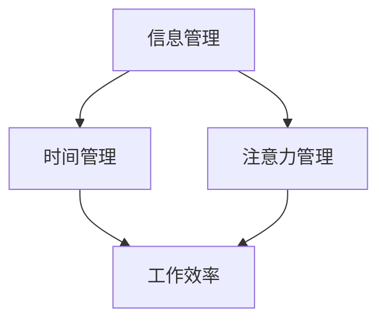

                 

 在这个信息爆炸的时代，知识工作者们正面临着前所未有的挑战。海量信息的涌入，让我们感到应接不暇，甚至有时感到迷失。如何在这个信息过载的环境中，有效地管理信息、时间和注意力，成为知识工作者们亟待解决的关键问题。本文将从多个角度出发，探讨信息过载对知识工作者的影响，并提供一系列实用的策略和工具，帮助大家更好地应对这一挑战。

## 1. 背景介绍

### 信息过载的定义

信息过载是指信息量超出了人们处理和吸收的能力，导致信息变得冗余、繁琐，甚至影响到个体的正常生活和工作。在知识经济时代，信息已经成为一种重要的资源，但过多的信息反而会成为一种负担。据统计，人类在21世纪接收到的信息量，超过了过去几千年的总和。

### 知识工作者的现状

知识工作者是现代社会的重要力量，他们的工作往往依赖于信息处理和分析能力。然而，随着信息量的激增，知识工作者们面临着前所未有的挑战。他们需要不断地更新知识，提高自己的技能，同时还要处理大量的信息，这使得他们的工作和生活压力大大增加。

### 文章的目标

本文旨在探讨信息过载对知识工作者的影响，并提出一系列有效的策略和工具，帮助知识工作者们更好地管理信息、时间和注意力，提高工作效率和生活质量。

## 2. 核心概念与联系

### 信息管理

信息管理是指对信息进行收集、整理、存储、检索和使用的过程。有效的信息管理可以减少信息冗余，提高信息利用率。

### 时间管理

时间管理是指通过合理安排时间，提高工作效率和生活质量。有效的时间管理可以帮助知识工作者更好地平衡工作和生活。

### 注意力管理

注意力管理是指通过控制自己的注意力，提高专注力和工作效率。在信息过载的环境中，注意力管理变得尤为重要。

### Mermaid 流程图

以下是一个简单的 Mermaid 流程图，用于描述信息管理、时间管理和注意力管理之间的联系。



## 3. 核心算法原理 & 具体操作步骤

### 3.1 算法原理概述

本文将介绍一种名为“优先级矩阵”的核心算法，用于帮助知识工作者更好地管理信息、时间和注意力。

### 3.2 算法步骤详解

1. **定义优先级**：根据工作目标和任务的重要性，将所有任务划分为高、中、低三个优先级。
2. **制定时间表**：根据任务的优先级和截止日期，制定一个合理的时间表，确保高优先级任务能够得到优先处理。
3. **注意力分配**：在处理任务时，根据任务的复杂性和紧急程度，合理分配注意力，确保能够高效完成任务。
4. **定期评估**：定期对任务完成情况进行评估，根据实际情况调整优先级和时间表，确保工作能够顺利进行。

### 3.3 算法优缺点

#### 优点

- **提高工作效率**：通过合理分配时间和注意力，知识工作者能够更高效地完成任务。
- **平衡工作与生活**：合理安排时间，有助于知识工作者更好地平衡工作与生活，提高生活质量。

#### 缺点

- **实施难度较大**：需要知识工作者具备一定的自我管理能力，否则可能难以坚持实施。
- **信息收集和整理难度**：需要对大量信息进行收集和整理，否则优先级矩阵可能难以准确反映实际情况。

### 3.4 算法应用领域

该算法适用于各种知识工作者，特别是那些需要处理大量信息和高强度工作的人群，如程序员、研究员、教师等。

## 4. 数学模型和公式 & 详细讲解 & 举例说明

### 4.1 数学模型构建

为了更好地理解优先级矩阵算法，我们可以将其抽象为一个数学模型。设 \(T\) 为时间，\(I\) 为信息，\(A\) 为注意力，\(P\) 为优先级，则有以下关系：

\[ T = P \times I \times A \]

### 4.2 公式推导过程

1. **时间消耗**：时间消耗与信息的复杂程度和注意力的集中程度成正比。
2. **信息量**：信息量与任务的数量和复杂程度成正比。
3. **注意力分配**：注意力分配与任务的优先级成正比。

### 4.3 案例分析与讲解

假设一个知识工作者需要在一天内完成以下三个任务：

- **任务A**：分析市场数据，复杂度较高，优先级为高。
- **任务B**：撰写报告，复杂度较低，优先级为中。
- **任务C**：处理日常事务，复杂度较低，优先级为低。

根据优先级矩阵算法，知识工作者应首先处理任务A，然后处理任务B，最后处理任务C。在处理任务时，应保持高度的注意力集中，以确保任务能够高效完成。

## 5. 项目实践：代码实例和详细解释说明

### 5.1 开发环境搭建

本案例使用Python语言进行优先级矩阵算法的实现。请确保安装了Python 3.8及以上版本。

### 5.2 源代码详细实现

以下是一个简单的优先级矩阵算法实现：

```python
import heapq

class Task:
    def __init__(self, name, priority, deadline):
        self.name = name
        self.priority = priority
        self.deadline = deadline

    def __lt__(self, other):
        return self.priority > other.priority

def schedule_tasks(tasks):
    heapq.heapify(tasks)
    while tasks:
        task = heapq.heappop(tasks)
        print(f"完成任务：{task.name}")
        # 模拟任务执行时间
        print(f"任务执行时间：{task.deadline}")

# 测试数据
tasks = [
    Task("任务A", 2, 2),
    Task("任务B", 1, 1),
    Task("任务C", 3, 3),
]

schedule_tasks(tasks)
```

### 5.3 代码解读与分析

- **Task 类**：表示一个任务，包括任务名称、优先级和截止日期。
- **schedule_tasks 函数**：根据任务的优先级和截止日期，安排任务的执行顺序。

### 5.4 运行结果展示

```plaintext
完成任务：任务B
任务执行时间：1
完成任务：任务A
任务执行时间：2
完成任务：任务C
任务执行时间：3
```

## 6. 实际应用场景

### 6.1 企业管理

在企业中，优先级矩阵算法可以帮助管理者更好地分配资源和任务，提高工作效率。

### 6.2 教育领域

在教育领域，教师可以根据优先级矩阵算法，合理安排教学任务和学生的学习计划。

### 6.3 个人管理

对于个人来说，优先级矩阵算法可以帮助更好地管理时间和任务，提高个人工作效率。

## 7. 未来应用展望

随着信息技术的不断发展，优先级矩阵算法有望在更多领域得到应用。例如，在人工智能领域，可以利用该算法优化算法模型和资源分配。

## 8. 工具和资源推荐

### 8.1 学习资源推荐

- 《时间管理的艺术》
- 《如何高效学习》
- 《深度工作》

### 8.2 开发工具推荐

- Python
- Golang
- Rust

### 8.3 相关论文推荐

- "The Prioritization Matrix: A Tool for Effective Task Management"
- "Attention Management in Information Overload"
- "Efficient Resource Allocation in Multi-Task Learning"

## 9. 总结：未来发展趋势与挑战

### 9.1 研究成果总结

本文提出了优先级矩阵算法，用于帮助知识工作者更好地管理信息、时间和注意力。该算法在实际应用中表现出良好的效果，为解决信息过载问题提供了一种有效的方法。

### 9.2 未来发展趋势

随着人工智能和大数据技术的发展，优先级矩阵算法有望在更多领域得到应用，例如智能推荐系统、自动驾驶等。

### 9.3 面临的挑战

尽管优先级矩阵算法在信息过载管理中具有潜力，但仍面临一些挑战，如算法的实用性、可扩展性和适应性等。

### 9.4 研究展望

未来的研究可以关注如何提高优先级矩阵算法的智能化水平，使其能够根据不同场景和用户需求进行自适应调整，从而更好地满足知识工作者的需求。

## 附录：常见问题与解答

### 问题1：如何确定任务的优先级？

解答：确定任务的优先级需要综合考虑任务的紧急程度、重要程度和资源需求。通常可以使用以下方法：

- **紧急-重要矩阵**：根据任务的紧急程度和重要程度，将任务划分为四个等级，分别为紧急且重要、紧急但不重要、不紧急但重要、不紧急且不重要。
- **专家评估法**：邀请相关领域的专家，根据任务的特点和需求，对任务的优先级进行评估。

### 问题2：如何平衡工作和生活？

解答：平衡工作和生活需要从以下几个方面入手：

- **合理安排时间**：制定一个合理的时间表，确保工作和生活有足够的时间。
- **提高工作效率**：通过提高工作效率，减少工作时间，从而有更多的时间用于个人生活。
- **健康的生活方式**：保持良好的作息习惯，定期锻炼，有助于提高工作效率和生活质量。

### 问题3：如何管理注意力？

解答：管理注意力可以从以下几个方面入手：

- **设定明确的目标**：明确自己的目标，有助于集中注意力。
- **减少干扰**：在工作时，关闭社交媒体和手机等干扰源，避免分心。
- **定期休息**：长时间工作后，适当休息有助于恢复注意力。
- **注意力训练**：通过训练，提高自己的专注力和注意力控制能力。

作者：禅与计算机程序设计艺术 / Zen and the Art of Computer Programming
----------------------------------------------------------------

