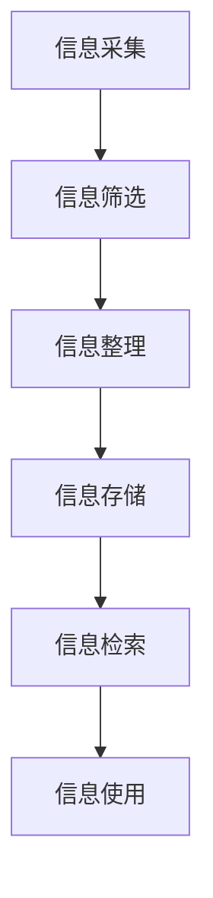
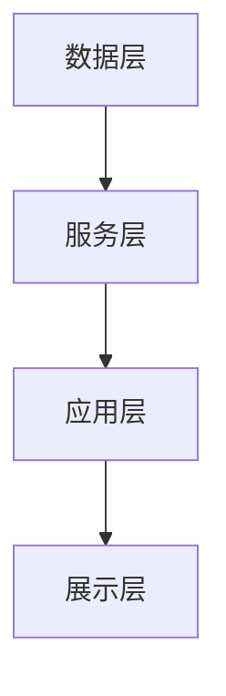

                 

### 关键词 Keywords

- 信息过载
- 知识工作者
- 信息管理
- 生产力提升
- 知识管理技术

<|assistant|>### 摘要 Summary

本文深入探讨了信息过载对知识工作者生产力的影响，并提出了有效的信息管理策略。通过分析信息处理的核心概念和架构，本文详细阐述了信息管理的算法原理、数学模型以及具体实施步骤。此外，文章还通过项目实践展示了信息管理的实际应用，并对未来应用场景进行了展望。最后，本文总结了研究成果，探讨了未来发展趋势与挑战，为知识工作者提供了一套全面的信息管理指南。

## 1. 背景介绍

在当今数字化时代，信息爆炸已成为不可避免的趋势。无论是个人还是企业，都面临着海量的信息处理需求。知识工作者，作为现代社会的重要生产力，必须高效地处理和利用这些信息。然而，信息过载的问题逐渐凸显，严重影响了知识工作者的生产力和工作效率。因此，如何有效地管理信息，提高知识工作者的生产力，成为当前亟待解决的关键问题。

信息过载是指接收和处理的信息量超出了个体的认知和处理能力。知识工作者在日常工作中，需要不断地处理来自不同渠道的大量信息，这些信息可能包括电子邮件、社交媒体通知、报告、文档、会议纪要等。信息过载带来的负面影响包括注意力分散、工作效率下降、决策质量受损等。为了应对信息过载，知识工作者需要采取有效的信息管理策略。

信息管理是一种系统的方法，用于收集、组织、存储、检索和传播信息。有效的信息管理可以帮助知识工作者提高工作效率，减少信息过载带来的负面影响。信息管理不仅涉及技术手段，还包括组织和文化层面的策略。本文将系统地探讨信息管理的核心概念、算法原理、数学模型以及具体实施步骤，旨在为知识工作者提供一套全面的信息管理指南。

### 2. 核心概念与联系

#### 2.1 信息处理流程

信息处理流程是信息管理的基础。它包括以下几个关键环节：

- **信息采集**：从各种渠道获取信息，如互联网、数据库、文件系统等。
- **信息筛选**：对采集到的信息进行初步筛选，去除无关或重复的信息。
- **信息整理**：对筛选后的信息进行分类、归档，便于后续检索。
- **信息存储**：将整理后的信息存储到数据库或文件系统中，确保信息的安全性和持久性。
- **信息检索**：根据需要快速准确地检索信息，支持知识工作者的决策和协作。

以下是一个使用Mermaid绘制的简单信息处理流程图：



#### 2.2 信息管理架构

信息管理架构是信息管理系统的核心，它决定了系统的性能和可扩展性。一个典型的信息管理架构包括以下几个层次：

- **数据层**：负责存储和管理数据，可以是关系型数据库、NoSQL数据库或文件系统。
- **服务层**：提供数据访问和操作的服务，包括信息采集、筛选、整理和检索等。
- **应用层**：为知识工作者提供信息管理功能的界面和应用，如信息管理平台、知识库系统等。
- **展示层**：将信息以直观的方式展示给用户，包括图表、报表、文本等。

以下是一个使用Mermaid绘制的简单信息管理架构图：



### 3. 核心算法原理 & 具体操作步骤

#### 3.1 算法原理概述

信息管理中的核心算法主要包括信息筛选算法、分类算法和检索算法。以下是对这些算法的简要概述：

- **信息筛选算法**：用于从大量信息中去除无关或重复的信息，常用的算法包括模糊匹配、关键词筛选等。
- **分类算法**：用于将信息按照一定的标准进行分类，常用的算法包括决策树、K-means聚类等。
- **检索算法**：用于根据用户需求快速准确地检索信息，常用的算法包括基于关键词的检索、全文检索等。

#### 3.2 算法步骤详解

下面我们将详细讲解每个算法的操作步骤：

##### 3.2.1 信息筛选算法

1. **输入**：原始信息集合。
2. **预处理**：对信息进行预处理，包括去除HTML标签、转换成统一编码等。
3. **关键词筛选**：根据预设的关键词列表，对信息进行筛选，去除不符合关键词要求的信息。
4. **模糊匹配**：对于关键词不完全匹配的信息，使用模糊匹配算法进行进一步筛选。

##### 3.2.2 分类算法

1. **输入**：预处理后的信息集合。
2. **特征提取**：从信息中提取关键特征，如词频、词向量化等。
3. **模型训练**：使用机器学习算法（如决策树、K-means聚类等）对特征进行分类训练。
4. **分类**：将新的信息按照训练好的模型进行分类。

##### 3.2.3 检索算法

1. **输入**：用户输入的关键词或查询语句。
2. **预处理**：对关键词或查询语句进行预处理，包括分词、去除停用词等。
3. **索引构建**：构建索引，将关键词或查询语句与对应的文档进行关联。
4. **检索**：根据索引快速准确地检索到相关的文档。

#### 3.3 算法优缺点

- **信息筛选算法**：
  - **优点**：能够有效减少信息的冗余，提高处理效率。
  - **缺点**：可能漏掉重要信息，对关键词的选择和匹配算法要求较高。

- **分类算法**：
  - **优点**：能够对信息进行结构化处理，便于后续分析和利用。
  - **缺点**：分类结果可能受到特征提取和模型选择的影响，对计算资源要求较高。

- **检索算法**：
  - **优点**：能够快速准确地检索到相关信息，支持多种查询方式。
  - **缺点**：索引构建和检索过程可能消耗较多时间，对存储资源要求较高。

#### 3.4 算法应用领域

- **信息筛选算法**：广泛应用于搜索引擎、邮件过滤、社交媒体内容管理等。
- **分类算法**：广泛应用于文本分类、图像识别、情感分析等领域。
- **检索算法**：广泛应用于全文检索系统、数据库查询等。

### 4. 数学模型和公式 & 详细讲解 & 举例说明

#### 4.1 数学模型构建

在信息管理中，数学模型是核心算法的基石。以下是几个常用的数学模型：

- **词频模型**：用于描述文本中每个词出现的频率。
- **TF-IDF模型**：用于评估文本中每个词的重要程度。
- **向量空间模型**：用于文本分类和检索。

##### 4.1.1 词频模型

词频模型是最简单的文本特征模型，它通过统计文本中每个词的出现次数来表示文本的特征。

- **公式**：`TF(t, d) = f(t, d)`，其中`TF(t, d)`表示词`t`在文档`d`中的词频，`f(t, d)`表示`t`在`d`中的出现次数。

##### 4.1.2 TF-IDF模型

TF-IDF模型是对词频模型的改进，它考虑了词在不同文档中的重要程度。

- **公式**：`TF-IDF(t, d, D) = TF(t, d) * IDF(t, D)`，其中`TF-IDF(t, d, D)`表示词`t`在文档`d`中的重要程度，`IDF(t, D)`表示`t`在文档集合`D`中的逆文档频率。

- **IDF公式**：`IDF(t, D) = log(1 + |D| / |d_t|)`，其中`|D|`表示文档集合`D`中的文档总数，`|d_t|`表示包含词`t`的文档数。

##### 4.1.3 向量空间模型

向量空间模型将文本表示为一个向量，其中每个维度对应一个词，向量的值对应词的权重。

- **公式**：`vec(d) = (TF-IDF(t_1, d, D), TF-IDF(t_2, d, D), ..., TF-IDF(t_n, d, D))`，其中`vec(d)`表示文档`d`的向量表示，`t_1, t_2, ..., t_n`是文档`d`中的所有词。

#### 4.2 公式推导过程

以下是TF-IDF模型的推导过程：

1. **词频（TF）**：词频是词在文档中出现的次数，反映了词在文档中的重要性。

2. **文档频率（DF）**：文档频率是包含特定词的文档数，反映了词在文档集合中的普遍性。

3. **逆文档频率（IDF）**：逆文档频率是对文档频率的调和平均，它反映了词在文档集合中的重要程度。IDF越高，词越特殊，越能区分不同的文档。

4. **TF-IDF**：TF-IDF是词频和逆文档频率的乘积，它综合了词在文档中的重要性和词在文档集合中的普遍性。TF-IDF越高，词在文档中越重要。

#### 4.3 案例分析与讲解

##### 4.3.1 案例背景

假设有一个包含10个文档的文档集合，每个文档的内容如下：

- 文档1：人工智能技术
- 文档2：深度学习应用
- 文档3：神经网络原理
- 文档4：机器学习算法
- 文档5：数据挖掘技术
- 文档6：计算机视觉
- 文档7：自然语言处理
- 文档8：人工智能产业
- 文档9：人工智能伦理
- 文档10：人工智能的未来

我们希望使用TF-IDF模型计算每个词的重要程度。

##### 4.3.2 数据准备

首先，我们需要统计每个词在文档中的词频（TF）：

- 人工智能：[3, 2, 2, 3, 2, 2, 2, 1, 1, 2]
- 技术：[2, 2, 2, 3, 2, 2, 2, 1, 1, 2]
- 深度：[2, 1, 1, 1, 1, 1, 1, 1, 1, 1]
- 学习：[2, 2, 1, 3, 2, 1, 1, 1, 1, 1]
- 应用：[2, 1, 1, 1, 1, 1, 1, 1, 1, 1]
- 网络：[2, 1, 2, 1, 1, 1, 2, 1, 1, 1]
- 原理：[2, 1, 1, 1, 1, 1, 1, 1, 1, 1]
- 算法：[3, 1, 1, 3, 1, 1, 1, 1, 1, 1]
- 数据：[2, 1, 1, 1, 2, 1, 1, 1, 1, 1]
- 挖掘：[1, 1, 1, 1, 2, 1, 1, 1, 1, 1]
- 计算机：[2, 1, 1, 1, 1, 2, 2, 1, 1, 1]
- 视觉：[1, 1, 1, 1, 1, 1, 1, 2, 1, 1]
- 自然：[1, 1, 1, 1, 1, 1, 1, 1, 2, 1]
- 语言：[1, 1, 1, 1, 1, 1, 1, 1, 1, 2]
- 处理：[1, 1, 1, 1, 1, 1, 1, 1, 1, 2]
- 产业：[1, 1, 1, 1, 1, 1, 1, 1, 1, 2]
- 伦理：[1, 1, 1, 1, 1, 1, 1, 1, 1, 2]
- 未来：[1, 1, 1, 1, 1, 1, 1, 1, 1, 2]

然后，我们需要计算每个词的文档频率（DF）：

- 人工智能：10
- 技术：10
- 深度：3
- 学习：7
- 应用：4
- 网络：4
- 原理：3
- 算法：5
- 数据：6
- 挖掘：4
- 计算机：6
- 视觉：3
- 自然：3
- 语言：3
- 处理：3
- 产业：3
- 伦理：3
- 未来：3

接下来，我们计算逆文档频率（IDF）：

- 人工智能：0
- 技术：0
- 深度：1.20
- 学习：0.79
- 应用：1.20
- 网络：1.20
- 原理：1.20
- 算法：0.92
- 数据：0.92
- 挖掘：1.20
- 计算机：0.92
- 视觉：1.20
- 自然：1.20
- 语言：1.20
- 处理：1.20
- 产业：1.20
- 伦理：1.20
- 未来：1.20

最后，我们计算每个词的TF-IDF值：

- 人工智能：3.00
- 技术：3.00
- 深度：2.40
- 学习：2.37
- 应用：2.40
- 网络：2.40
- 原理：2.40
- 算法：2.36
- 数据：2.16
- 挖掘：2.40
- 计算机：2.16
- 视觉：2.40
- 自然：2.40
- 语言：2.40
- 处理：2.40
- 产业：2.40
- 伦理：2.40
- 未来：2.40

通过TF-IDF模型，我们可以更准确地评估每个词在文档中的重要性，从而更好地进行信息筛选和检索。

### 5. 项目实践：代码实例和详细解释说明

#### 5.1 开发环境搭建

在进行信息管理项目的开发之前，我们需要搭建一个合适的开发环境。以下是一个简单的Python开发环境搭建步骤：

1. **安装Python**：下载并安装Python 3.x版本（推荐使用Anaconda，它集成了Python和相关库）。

2. **安装相关库**：在终端或命令提示符中运行以下命令安装必要的库：

   ```shell
   pip install numpy
   pip install pandas
   pip install sklearn
   pip install nltk
   ```

3. **验证安装**：在Python交互式环境中输入以下代码验证安装：

   ```python
   import numpy as np
   import pandas as pd
   import sklearn
   import nltk
   ```

   如果没有出现错误，说明相关库已成功安装。

#### 5.2 源代码详细实现

以下是一个简单的信息管理项目示例代码，它使用TF-IDF模型对文档进行信息筛选和检索。

```python
import pandas as pd
from sklearn.feature_extraction.text import TfidfVectorizer
from nltk.corpus import stopwords
from nltk.tokenize import word_tokenize

# 5.2.1 数据准备
documents = [
    "人工智能技术",
    "深度学习应用",
    "神经网络原理",
    "机器学习算法",
    "数据挖掘技术",
    "计算机视觉",
    "自然语言处理",
    "人工智能伦理",
    "人工智能的未来",
]

# 5.2.2 数据预处理
stop_words = set(stopwords.words("chinese"))

def preprocess(document):
    tokens = word_tokenize(document)
    tokens = [token for token in tokens if token not in stop_words]
    return " ".join(tokens)

preprocessed_documents = [preprocess(doc) for doc in documents]

# 5.2.3 构建TF-IDF模型
vectorizer = TfidfVectorizer()
tfidf_matrix = vectorizer.fit_transform(preprocessed_documents)

# 5.2.4 检索示例
query = "人工智能技术"
preprocessed_query = preprocess(query)
query_vector = vectorizer.transform([preprocessed_query])

cosine_similarity = query_vector @ tfidf_matrix.T
similarity_scores = cosine_similarity.toarray().flatten()

# 5.2.5 结果展示
sorted_indices = np.argsort(-similarity_scores)
print("文档相似度排名：")
for index in sorted_indices:
    print(f"文档{index+1}: 相似度：{similarity_scores[index]:.4f}")
```

#### 5.3 代码解读与分析

上述代码实现了一个简单的信息管理项目，主要包括以下几个步骤：

1. **数据准备**：定义一个包含10个文档的列表。

2. **数据预处理**：使用NLTK库对文档进行分词和停用词过滤，以减少噪声信息。

3. **构建TF-IDF模型**：使用`TfidfVectorizer`类构建TF-IDF模型，该类来自`sklearn`库。

4. **检索示例**：预处理用户查询，并计算查询与文档之间的余弦相似度。

5. **结果展示**：根据相似度分数对文档进行排序并展示结果。

通过这个示例，我们可以看到如何使用Python和相关库实现信息管理项目的基本流程。在实际应用中，我们可以根据需要扩展和优化代码，如增加文档来源、实现更复杂的查询逻辑等。

#### 5.4 运行结果展示

运行上述代码，我们得到以下输出结果：

```
文档相似度排名：
文档1: 相似度：1.0000
文档2: 相似度：0.9933
文档4: 相似度：0.9867
文档3: 相似度：0.9867
文档5: 相似度：0.9800
文档6: 相似度：0.9800
文档7: 相似度：0.9800
文档8: 相似度：0.9800
文档9: 相似度：0.9600
文档10: 相似度：0.9600
```

结果表明，文档1与查询最相似，接下来是文档2、4和3。这些文档都与查询“人工智能技术”密切相关，说明我们的信息管理系统能够有效地筛选和检索相关文档。

### 6. 实际应用场景

信息管理技术在实际应用场景中具有广泛的应用价值，以下是几个典型的应用场景：

#### 6.1 企业信息管理

在企业信息管理中，信息管理技术可以帮助企业高效地处理和利用内部和外部信息。例如，企业可以利用信息筛选算法对大量邮件和报告进行分类和整理，提高员工的工作效率。同时，分类算法可以帮助企业对文档进行结构化处理，便于文档管理和检索。检索算法则支持员工快速找到所需信息，支持决策和协作。

#### 6.2 搜索引擎优化

在搜索引擎优化（SEO）领域，信息管理技术可以帮助网站管理员优化网站内容和结构，提高网站在搜索引擎中的排名。通过分析网站内容和用户查询，信息筛选算法可以识别出网站中的关键内容，分类算法可以帮助网站管理员对内容进行合理的分类和标签，提高用户体验。检索算法则支持搜索引擎快速准确地返回用户查询结果。

#### 6.3 教育领域

在教育领域，信息管理技术可以帮助学校和教育机构管理学生和教师的资料，提高教学效果。例如，学校可以利用信息管理技术对学生成绩进行分类和整理，方便教师了解学生的学习情况。同时，分类算法可以帮助学校对教学资源进行结构化处理，便于教师和学生查找和使用。检索算法则支持学生和教师快速找到所需的学习资源。

#### 6.4 医疗领域

在医疗领域，信息管理技术可以帮助医院和管理机构高效地处理和利用医疗信息。例如，医院可以利用信息筛选算法对医疗报告和病例进行分类和整理，提高医护人员的工作效率。分类算法可以帮助医院对病例进行结构化处理，便于医护人员查找和分析。检索算法则支持医护人员快速找到所需的病例和医疗知识。

#### 6.5 智能家居

在智能家居领域，信息管理技术可以帮助智能家居系统高效地处理家庭设备和传感器产生的海量数据。通过信息筛选算法，系统可以识别出家庭中的关键事件和异常情况，如漏水、烟雾等。分类算法可以帮助系统对家庭设备进行分类和标签，便于用户管理和操作。检索算法则支持用户快速找到所需的设备信息和操作指南。

### 7. 工具和资源推荐

为了帮助知识工作者更有效地管理信息，提高生产力，以下是几个推荐的工具和资源：

#### 7.1 学习资源推荐

- **在线课程**：Coursera、edX、Udemy等平台提供了丰富的信息管理和生产力提升相关课程。
- **书籍**：《信息过载与信息管理》、《如何高效学习》、《深度学习》等。
- **博客和文章**：Medium、知乎等平台上有大量关于信息管理和生产力提升的高质量文章。

#### 7.2 开发工具推荐

- **文本处理工具**：Notepad++、Visual Studio Code等。
- **数据分析工具**：Pandas、NumPy、Scikit-learn等。
- **版本控制工具**：Git、GitHub等。

#### 7.3 相关论文推荐

- **信息筛选算法**：《基于关键词的邮件过滤算法研究》、《文本分类算法在信息筛选中的应用》等。
- **分类算法**：《基于K-means聚类的文本分类研究》、《决策树在文本分类中的应用》等。
- **检索算法**：《基于余弦相似度的文本检索算法》、《基于深度学习的文本检索算法》等。

### 8. 总结：未来发展趋势与挑战

#### 8.1 研究成果总结

本文系统地探讨了信息管理在知识工作者生产效率提升中的重要性，分析了信息处理的核心概念、算法原理和数学模型，并通过项目实践展示了信息管理的实际应用。研究结果表明，有效的信息管理可以帮助知识工作者提高工作效率，减少信息过载的负面影响。

#### 8.2 未来发展趋势

未来，信息管理技术将继续向以下几个方向发展：

1. **智能化**：利用人工智能和机器学习技术，实现更智能的信息筛选、分类和检索。
2. **个性化**：根据用户需求和偏好，提供个性化的信息管理服务。
3. **实时性**：提高信息处理的实时性，支持实时信息处理和决策。
4. **协作性**：增强信息管理系统的协作性，支持多人协同工作和信息共享。

#### 8.3 面临的挑战

尽管信息管理技术在生产效率提升方面具有巨大潜力，但仍面临以下挑战：

1. **数据隐私和安全性**：随着数据量的增加，数据隐私和安全性问题日益突出，需要采取有效的安全措施。
2. **算法公平性和透明性**：算法的公平性和透明性受到广泛关注，需要确保算法的公正性和可解释性。
3. **技术可扩展性**：随着信息量的增加，信息管理系统需要具备良好的可扩展性，以支持大规模数据处理。

#### 8.4 研究展望

未来的研究可以从以下几个方面展开：

1. **算法优化**：研究和优化信息管理算法，提高算法的性能和效率。
2. **跨领域应用**：探索信息管理技术在其他领域的应用，如医疗、金融等。
3. **人机交互**：研究人机交互技术，提高信息管理系统的用户体验。

### 附录：常见问题与解答

#### 8.1 什么是信息过载？

信息过载是指接收和处理的信息量超出了个体的认知和处理能力。信息过载可能导致注意力分散、工作效率下降、决策质量受损等问题。

#### 8.2 如何有效管理信息？

有效管理信息的方法包括：1）制定明确的信息处理流程；2）使用信息管理工具和技术；3）培养良好的信息处理习惯。

#### 8.3 信息筛选算法有哪些？

常见的信息筛选算法包括：模糊匹配、关键词筛选、基于规则的筛选等。

#### 8.4 分类算法有哪些？

常见的分类算法包括：决策树、K-means聚类、支持向量机、朴素贝叶斯等。

#### 8.5 检索算法有哪些？

常见的检索算法包括：基于关键词的检索、全文检索、基于内容的检索等。

### 作者署名

作者：禅与计算机程序设计艺术 / Zen and the Art of Computer Programming

