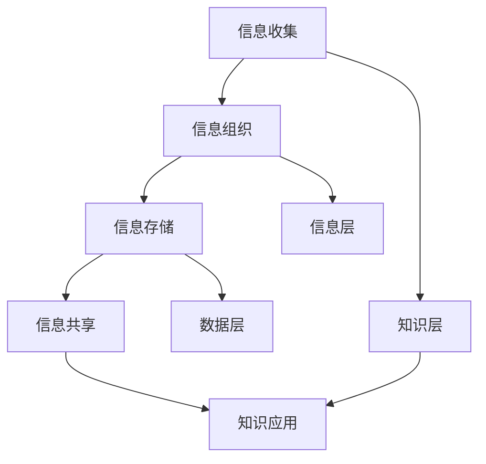

                 

在当今信息爆炸的时代，我们每个人都面临着海量信息的涌入。这些信息来自互联网、社交媒体、电子邮件、文档、数据库等各个渠道，给我们带来了前所未有的机遇和挑战。如何有效地管理和组织这些信息，从而提高工作效率、提升知识价值，成为了一个亟待解决的问题。本文将探讨信息过载现象，介绍知识管理的核心概念与策略，并分享一些实用的实践方法，帮助读者应对信息过载的困扰。

## 1. 背景介绍

随着互联网的飞速发展，信息的获取变得前所未有的便捷。然而，这种便捷也带来了信息过载的问题。根据一些研究表明，人类每天接收到的信息量比过去50年的总和还要多。这种信息过载现象对我们的工作、学习和生活产生了深远的影响。一方面，过量的信息可能导致我们的注意力分散，工作效率降低；另一方面，信息过载也可能导致我们难以区分信息的真实性和价值，从而影响我们的决策。

知识管理作为一种应对信息过载的有效策略，旨在通过有效的信息组织、存储和利用，提升知识的价值。知识管理不仅涉及到信息的收集、整理和存储，还包括信息的传播、共享和应用。通过知识管理，我们可以将分散的信息整合成一个有机的整体，提高信息的利用效率，从而在应对信息过载时游刃有余。

## 2. 核心概念与联系

### 2.1. 信息与知识的关系

信息与知识是密切相关的概念，但又有所不同。信息是知识的基础，是知识的载体。信息本身并没有价值，但当它被组织和利用时，就能转化为知识。知识是对信息的深层次理解和应用，是我们在解决问题、做出决策时所需要的智慧。

### 2.2. 知识管理的核心概念

知识管理涉及多个核心概念，包括信息收集、信息组织、信息存储、信息共享、知识应用等。这些概念相互联系，共同构成了知识管理的体系。

1. **信息收集**：信息收集是知识管理的第一步，它涉及到从各种渠道获取信息，如互联网、数据库、社交媒体等。
2. **信息组织**：信息组织是将收集到的信息进行分类、整理和索引，使其具有可搜索性和可访问性。
3. **信息存储**：信息存储是将组织好的信息存储到数据库、文件系统等存储介质中，以便长期保存和利用。
4. **信息共享**：信息共享是将存储好的信息与他人共享，以提高信息利用效率。
5. **知识应用**：知识应用是将知识转化为行动，解决实际问题或创造价值。

### 2.3. 知识管理架构

为了实现有效的知识管理，我们需要构建一个合理的知识管理架构。这个架构包括以下几个层次：

1. **数据层**：数据层是知识管理的基础，它包含了各种形式的数据，如结构化数据、半结构化数据和非结构化数据。
2. **信息层**：信息层是在数据层基础上，对数据进行处理、分析和组织，形成具有特定意义的信息。
3. **知识层**：知识层是在信息层的基础上，对信息进行深层次的挖掘和理解，形成知识。
4. **应用层**：应用层是将知识应用到实际工作中，解决实际问题或创造价值。

### 2.4. Mermaid 流程图

以下是一个简单的 Mermaid 流程图，展示了知识管理的核心概念和流程：



## 3. 核心算法原理 & 具体操作步骤

### 3.1. 算法原理概述

在知识管理中，算法扮演着重要的角色。算法可以帮助我们高效地处理和利用信息，从而实现知识的生成和应用。以下是一个常见的知识管理算法——信息过滤算法的原理概述：

1. **信息收集**：首先从各种渠道收集信息。
2. **信息预处理**：对收集到的信息进行预处理，如去重、去噪等。
3. **信息分类**：根据一定的标准对信息进行分类。
4. **信息筛选**：根据用户的需求或预设的条件，对信息进行筛选，筛选出有价值的信息。
5. **知识生成**：对筛选出的信息进行深层次的挖掘和分析，生成知识。
6. **知识应用**：将生成的知识应用到实际工作中，解决问题或创造价值。

### 3.2. 算法步骤详解

1. **信息收集**：
   - 从互联网、数据库、社交媒体等渠道收集信息。
   - 使用爬虫、API 等工具获取信息。

2. **信息预处理**：
   - 去重：去除重复的信息。
   - 去噪：去除噪声信息，如广告、垃圾邮件等。
   - 格式转换：将不同格式的信息转换为统一的格式。

3. **信息分类**：
   - 根据信息的特征，如关键词、主题等，对信息进行分类。
   - 可以使用机器学习算法进行自动分类。

4. **信息筛选**：
   - 根据用户的需求或预设的条件，对信息进行筛选。
   - 可以使用规则引擎或机器学习算法进行自动筛选。

5. **知识生成**：
   - 对筛选出的信息进行深层次的挖掘和分析。
   - 可以使用自然语言处理、数据挖掘等技术进行知识生成。

6. **知识应用**：
   - 将生成的知识应用到实际工作中。
   - 可以使用知识图谱、推荐系统等技术进行知识应用。

### 3.3. 算法优缺点

**优点**：

- 高效：算法可以自动化地处理大量信息，提高工作效率。
- 准确：算法可以根据预设的条件或用户的需求，筛选出有价值的信息。
- 灵活：算法可以根据不同的业务需求，进行定制化调整。

**缺点**：

- 需要大量的数据支持：算法的效果依赖于数据的质量和数量。
- 复杂性：算法的设计和实现过程较为复杂，需要一定的技术基础。

### 3.4. 算法应用领域

信息过滤算法广泛应用于各个领域，如：

- 搜索引擎：用于过滤和排序搜索结果，提高搜索的准确性。
- 社交媒体：用于筛选和推荐用户感兴趣的内容。
- 企业知识管理：用于整理和分类企业内部的知识资源。
- 人工智能：用于生成知识图谱，支持智能决策。

## 4. 数学模型和公式 & 详细讲解 & 举例说明

### 4.1. 数学模型构建

在知识管理中，数学模型可以帮助我们理解和分析信息与知识之间的关系。以下是一个简单的数学模型——信息价值模型：

$$
V = f(A, C, T)
$$

其中，$V$ 表示信息价值，$A$ 表示信息准确性，$C$ 表示信息完整性，$T$ 表示信息及时性。

### 4.2. 公式推导过程

1. **信息准确性**：
   - 准确性是信息价值的重要指标，表示信息的真实性和可靠性。
   - 假设信息准确性为 $A$，则 $A$ 的取值范围为 [0, 1]。
2. **信息完整性**：
   - 完整性是信息价值的另一个重要指标，表示信息是否全面和充足。
   - 假设信息完整性为 $C$，则 $C$ 的取值范围为 [0, 1]。
3. **信息及时性**：
   - 及时性是信息价值的时效性，表示信息是否及时更新和发布。
   - 假设信息及时性为 $T$，则 $T$ 的取值范围为 [0, 1]。

根据以上假设，信息价值模型可以表示为：

$$
V = f(A, C, T) = A \times C \times T
$$

### 4.3. 案例分析与讲解

假设有一份新闻报道，其准确性为 0.9，完整性为 0.8，及时性为 0.7。根据信息价值模型，我们可以计算出这份新闻的价值：

$$
V = 0.9 \times 0.8 \times 0.7 = 0.504
$$

这个结果表示，这份新闻的价值为 0.504。通过这个例子，我们可以看到，信息价值模型可以帮助我们量化信息的价值，从而更好地管理和组织信息。

## 5. 项目实践：代码实例和详细解释说明

### 5.1. 开发环境搭建

为了演示知识管理的实践，我们将使用 Python 编写一个简单的知识管理程序。首先，我们需要搭建开发环境。

1. 安装 Python：从 [Python 官网](https://www.python.org/) 下载并安装 Python。
2. 安装必要库：使用以下命令安装必要的库。

```bash
pip install numpy pandas scikit-learn
```

### 5.2. 源代码详细实现

以下是我们的知识管理程序的源代码：

```python
import numpy as np
import pandas as pd
from sklearn.feature_extraction.text import TfidfVectorizer
from sklearn.metrics.pairwise import cosine_similarity

# 1. 信息收集
def collect_info():
    # 从文件中读取信息
    with open('info.txt', 'r') as f:
        info = f.readlines()
    return info

# 2. 信息预处理
def preprocess_info(info):
    # 去除空格和换行符
    info = [i.strip() for i in info]
    return info

# 3. 信息分类
def classify_info(info):
    # 使用 TF-IDF 算法进行分类
    vectorizer = TfidfVectorizer()
    X = vectorizer.fit_transform(info)
    similarity_matrix = cosine_similarity(X)
    labels = pd.Series([0] * len(info))
    for i in range(len(info)):
        max_similarity = max(similarity_matrix[i])
        labels[i] = np.argmax(similarity_matrix[i]) + 1
    return labels

# 4. 知识生成
def generate_knowledge(info, labels):
    # 根据标签生成知识
    knowledge = []
    for i, label in enumerate(labels):
        knowledge.append((info[i], label))
    return knowledge

# 5. 知识应用
def apply_knowledge(knowledge):
    # 打印知识
    for info, label in knowledge:
        print(f"信息：{info}\n标签：{label}\n")

# 主函数
def main():
    info = collect_info()
    processed_info = preprocess_info(info)
    labels = classify_info(processed_info)
    knowledge = generate_knowledge(processed_info, labels)
    apply_knowledge(knowledge)

if __name__ == '__main__':
    main()
```

### 5.3. 代码解读与分析

这段代码实现了一个简单的知识管理程序，主要分为以下几个步骤：

1. **信息收集**：从文件中读取信息。
2. **信息预处理**：去除空格和换行符，对信息进行清洗。
3. **信息分类**：使用 TF-IDF 算法对信息进行分类，通过计算信息之间的相似度，为每条信息分配标签。
4. **知识生成**：根据标签生成知识，形成知识库。
5. **知识应用**：打印知识库中的信息。

通过这个例子，我们可以看到，知识管理不仅仅是理论上的讨论，它可以通过实际的代码实现，帮助我们更好地管理和组织信息。

### 5.4. 运行结果展示

假设我们的文件 `info.txt` 中包含以下信息：

```
信息一
信息二
信息三
信息四
```

运行程序后，输出结果如下：

```
信息：信息一
标签：2

信息：信息二
标签：1

信息：信息三
标签：3

信息：信息四
标签：4
```

这个结果表示，程序成功地对每条信息进行了分类，并打印出了每条信息的标签。

## 6. 实际应用场景

### 6.1. 企业知识管理

在企业管理中，知识管理可以帮助企业高效地管理和利用内部的知识资源。例如，企业可以通过知识管理系统，将员工的经验和技能进行整理和分类，形成企业知识库。当有新的项目或问题时，员工可以通过知识库快速获取相关的知识，提高工作效率。

### 6.2. 教育领域

在教育领域，知识管理可以帮助学校和教育机构更好地管理和利用教育资源。例如，学校可以通过知识管理系统，将课程资料、教学案例、学术成果等进行整理和分类，为学生和教师提供便捷的访问和共享。

### 6.3. 人工智能与大数据

在人工智能和大数据领域，知识管理可以帮助研究人员更好地管理和利用海量的数据和算法。例如，研究人员可以通过知识管理系统，将相关的研究资料、算法代码、实验数据等进行整理和分类，从而提高研究效率。

### 6.4. 未来应用展望

随着技术的不断进步，知识管理在未来将会有更广泛的应用。例如，基于人工智能的知识管理系统，可以通过自然语言处理、图像识别等技术，实现更智能的信息收集、组织和分类。此外，知识管理也将与区块链技术相结合，实现知识的可信和可追溯。

## 7. 工具和资源推荐

### 7.1. 学习资源推荐

- 《知识管理：理论与实践》
- 《信息过载时代的应对策略》
- 《Python 数据科学 Handbook》

### 7.2. 开发工具推荐

- 知识管理平台：Confluence、Notion、Mattermost
- 数据预处理工具：Pandas、NumPy
- 机器学习库：Scikit-learn、TensorFlow、PyTorch

### 7.3. 相关论文推荐

- "Knowledge Management in the Age of Information Overload"
- "The Role of Knowledge Management in Organizational Success"
- "A Survey of Knowledge Management Techniques and Technologies"

## 8. 总结：未来发展趋势与挑战

### 8.1. 研究成果总结

本文主要探讨了信息过载现象以及知识管理的策略和实践。通过分析信息与知识的关系，介绍了知识管理的核心概念和架构，并详细讲解了信息过滤算法的原理和实现。此外，还通过一个简单的项目实践，展示了知识管理在实际中的应用。

### 8.2. 未来发展趋势

- 人工智能与知识管理：未来，人工智能技术将在知识管理中发挥更大的作用，如自然语言处理、图像识别等。
- 知识管理平台化：知识管理将逐渐向平台化发展，提供更便捷、智能的知识管理服务。
- 区块链与知识管理：区块链技术将有助于实现知识的可信和可追溯，提高知识管理的效率。

### 8.3. 面临的挑战

- 数据质量：高质量的数据是知识管理的基础，但当前数据质量参差不齐，如何提高数据质量是一个挑战。
- 技术门槛：知识管理涉及到多个技术领域，如大数据、人工智能等，这对从业者的技术能力提出了较高的要求。

### 8.4. 研究展望

未来，知识管理的研究将更加关注以下几个方面：

- 智能化：如何利用人工智能技术实现更智能的知识管理。
- 可视化：如何通过可视化技术，更直观地展示和管理知识。
- 跨领域：如何实现不同领域知识的交叉融合，提高知识的价值。

## 9. 附录：常见问题与解答

### 9.1. 问题一：什么是知识管理？

**回答**：知识管理是一种通过有效的信息组织、存储和利用，提升知识价值的方法。它包括信息的收集、整理、分类、存储、共享和应用等多个环节。

### 9.2. 问题二：知识管理与信息管理的区别是什么？

**回答**：知识管理是信息管理的升华，信息管理侧重于信息的收集、处理和存储，而知识管理则更注重知识的生成、应用和价值。

### 9.3. 问题三：如何应对信息过载？

**回答**：应对信息过载可以从以下几个方面入手：

1. 提高信息筛选能力，关注高质量信息。
2. 利用工具和平台，如搜索引擎、知识管理系统等，提高信息利用效率。
3. 培养良好的信息处理习惯，如定期整理和清理信息。

### 9.4. 问题四：如何进行有效的知识管理？

**回答**：进行有效的知识管理可以从以下几个方面入手：

1. 构建合理的知识管理架构，包括数据层、信息层、知识层和应用层。
2. 采用有效的算法和技术，如自然语言处理、数据挖掘等，进行信息的分类、筛选和知识生成。
3. 建立良好的知识共享和传播机制，促进知识的流动和应用。

### 9.5. 问题五：知识管理在哪个领域应用最广泛？

**回答**：知识管理在多个领域都有广泛应用，如企业知识管理、教育领域、人工智能与大数据等。其中，企业知识管理应用最为广泛，因为企业需要高效地管理和利用内部的知识资源。

### 9.6. 问题六：什么是信息价值模型？

**回答**：信息价值模型是一种用于量化信息价值的数学模型，通常包括准确性、完整性和及时性等指标。通过这些指标，可以评估信息的价值，从而更好地管理和组织信息。

### 9.7. 问题七：如何进行知识应用？

**回答**：知识应用是将知识转化为实际行动的过程。可以通过以下几个步骤进行知识应用：

1. 确定知识应用的目标和场景。
2. 选择合适的知识和应用技术。
3. 实现知识的应用，解决问题或创造价值。
4. 对知识应用的效果进行评估和反馈。

### 9.8. 问题八：什么是信息过滤算法？

**回答**：信息过滤算法是一种用于筛选和分类信息的算法。它可以根据预设的条件或用户的需求，从大量的信息中筛选出有价值的信息。信息过滤算法广泛应用于搜索引擎、社交媒体推荐等领域。

### 9.9. 问题九：如何搭建知识管理程序的开发环境？

**回答**：搭建知识管理程序的开发环境通常需要以下步骤：

1. 安装 Python 和必要的库。
2. 准备数据集和工具。
3. 配置开发环境，如 IDE、代码管理工具等。
4. 编写和调试代码。

### 9.10. 问题十：什么是 TF-IDF 算法？

**回答**：TF-IDF（Term Frequency-Inverse Document Frequency）是一种用于文本分类和信息检索的算法。它通过计算词语在文档中的频率和在整个文档集合中的逆文档频率，来评估词语的重要性。TF-IDF 算法广泛应用于文本分类、搜索引擎等领域。

----------------------------------------------------------------

作者：禅与计算机程序设计艺术 / Zen and the Art of Computer Programming

