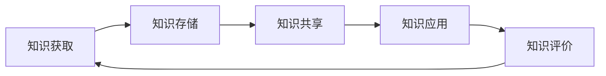

                 

关键字：信息过载、知识管理系统、信息组织、信息检索、信息架构、人工智能、数据科学、技术指南

> 摘要：本文深入探讨了信息过载的现象及其对个人和组织效率的负面影响，阐述了知识管理系统的核心概念、架构和实施方法。通过详细阐述算法原理、数学模型和实际应用案例，文章旨在为读者提供一套完整的信息管理和检索的指南，帮助他们在数字时代更有效地应对信息泛滥的挑战。

## 1. 背景介绍

### 信息过载的问题

随着互联网和数字技术的飞速发展，人类面对的信息量呈现爆炸式增长。据估计，全球每天产生的数据量高达2.5万亿字节。这种信息过载现象不仅影响了个人的日常生活，也对企业的运营效率和创新能力构成了巨大挑战。信息过载导致的主要问题包括注意力分散、决策困难、生产力下降以及焦虑情绪的增加。

### 知识管理系统的意义

为了应对信息过载，知识管理系统（KMSystem）应运而生。知识管理系统是一种集成技术、过程和策略的综合框架，旨在有效组织和利用信息资源，以提高个人和组织的知识获取、共享和应用效率。实施有效的知识管理系统，可以帮助组织减少信息冗余，提高信息检索的效率，促进知识的创新和应用。

## 2. 核心概念与联系

### 知识管理系统的核心概念

知识管理系统的核心概念包括知识获取、知识存储、知识共享、知识应用和知识评价。这些概念相互作用，共同构建了一个闭环的知识管理过程。

### 知识管理系统的架构

知识管理系统通常包含以下组成部分：

- **数据层**：存储和管理原始数据。
- **知识库**：用于存储结构化和非结构化的知识资源。
- **用户界面**：提供用户访问和操作系统的入口。
- **算法层**：包括用于知识抽取、分类、检索和推荐的算法。
- **应用层**：提供各种知识管理工具和应用，如文档管理、专家系统、知识图谱等。

### Mermaid 流程图

以下是一个简化的知识管理系统流程图的 Mermaid 表示：



## 3. 核心算法原理 & 具体操作步骤

### 3.1 算法原理概述

知识管理系统的核心算法主要包括：

- **文本挖掘**：用于从非结构化文本中提取知识。
- **知识抽取**：从原始数据中提取结构化知识。
- **本体构建**：建立领域本体，用于知识表示和推理。
- **推荐系统**：基于用户行为和内容相似性进行知识推荐。

### 3.2 算法步骤详解

#### 3.2.1 文本挖掘

1. 数据预处理：包括分词、去停用词、词性标注等。
2. 特征提取：使用词袋模型、TF-IDF、词嵌入等方法。
3. 模型训练：使用分类、聚类、主题建模等方法。

#### 3.2.2 知识抽取

1. 信息抽取：从文本中提取关键信息。
2. 实体识别：识别文本中的实体，如人名、地名等。
3. 关系抽取：识别实体之间的关系。

#### 3.2.3 本体构建

1. 本体设计：定义领域本体。
2. 本体实例化：将实际数据映射到本体中。
3. 本体推理：使用本体进行逻辑推理。

#### 3.2.4 推荐系统

1. 用户建模：提取用户特征。
2. 内容建模：提取知识内容特征。
3. 推荐算法：基于用户和内容特征进行知识推荐。

### 3.3 算法优缺点

- **文本挖掘**：优点在于能够处理大量非结构化文本，缺点是对文本质量要求较高，且可能存在误分类问题。
- **知识抽取**：优点在于能够将非结构化数据转化为结构化知识，缺点在于实现复杂，对领域知识要求高。
- **本体构建**：优点在于能够提供灵活的知识表示和推理能力，缺点在于构建和维护成本高。
- **推荐系统**：优点在于能够提高知识共享和应用效率，缺点在于推荐结果的准确性取决于用户和内容特征提取的准确性。

### 3.4 算法应用领域

知识管理系统算法在多个领域都有广泛应用，如金融、医疗、教育、企业等。具体应用场景包括：

- **金融**：风险控制、投资分析、客户服务。
- **医疗**：疾病诊断、药物研究、健康咨询。
- **教育**：在线教育、智能辅导、教育资源管理。
- **企业**：知识共享、知识创新、决策支持。

## 4. 数学模型和公式 & 详细讲解 & 举例说明

### 4.1 数学模型构建

知识管理系统中的数学模型主要包括以下几种：

- **文本分类模型**：如朴素贝叶斯、支持向量机等。
- **聚类模型**：如k-means、层次聚类等。
- **推荐算法**：如协同过滤、矩阵分解等。
- **知识图谱**：如路径长度、相似度计算等。

### 4.2 公式推导过程

以协同过滤算法为例，其核心公式为：

$$
R_{ui} = \frac{\sum_{j \in N_i}^{ } r_{uj} \cdot s_{uj}}{\sum_{j \in N_i}^{ } s_{uj}}
$$

其中，\(R_{ui}\) 表示用户 \(u\) 对物品 \(i\) 的评分预测，\(r_{uj}\) 表示用户 \(u\) 对物品 \(j\) 的实际评分，\(N_i\) 表示与物品 \(i\) 相似的物品集合，\(s_{uj}\) 表示物品 \(i\) 和 \(j\) 的相似度。

### 4.3 案例分析与讲解

以金融领域为例，某金融机构利用知识管理系统对客户进行风险评估。该系统采用协同过滤算法进行客户行为分析，并结合金融知识图谱进行风险预测。

1. **数据收集**：收集客户的交易记录、浏览行为、社交媒体活动等数据。
2. **特征提取**：提取客户行为特征，如交易频次、交易金额、浏览时长等。
3. **模型训练**：使用协同过滤算法训练模型。
4. **风险预测**：对客户进行风险评估，生成风险分数。
5. **决策支持**：金融机构根据风险分数调整贷款政策，降低风险。

## 5. 项目实践：代码实例和详细解释说明

### 5.1 开发环境搭建

1. **软件环境**：Python 3.8、Scikit-learn 0.22、NumPy 1.19
2. **硬件环境**：至少4GB内存、2核CPU

### 5.2 源代码详细实现

以下是一个简单的基于协同过滤的推荐系统实现的代码示例：

```python
import numpy as np
from sklearn.metrics.pairwise import cosine_similarity

def predict(ratings, similarity_matrix, user_index, item_indices=None):
    if item_indices is None:
        item_indices = range(ratings.shape[1])
    
    similar_users = np.argsort(similarity_matrix[user_index])[1:]
    weighted_ratings = np.dot(similarity_matrix[user_index][similar_users], ratings[similar_users])
    predicted_ratings = np.sum(weighted_ratings, axis=1) / np.sum(similarity_matrix[user_index][similar_users])
    
    if item_indices is not None:
        return predicted_ratings[item_indices]
    else:
        return predicted_ratings

# 示例数据
ratings = np.array([
    [1, 2, 3, 0, 4],
    [0, 2, 1, 3, 0],
    [4, 0, 1, 2, 3],
    [2, 3, 0, 1, 4],
    [0, 1, 4, 3, 2]
])

# 计算相似度矩阵
similarity_matrix = cosine_similarity(ratings)

# 预测用户2对未评分的物品的评分
predicted_ratings = predict(ratings, similarity_matrix, user_index=1, item_indices=[3, 4])
print(predicted_ratings)
```

### 5.3 代码解读与分析

该代码示例实现了基于协同过滤的推荐系统，主要包含以下步骤：

1. **预测函数**：`predict` 函数用于预测用户对物品的评分。它接收用户索引、相似度矩阵和可选的物品索引列表作为输入。
2. **相似度计算**：使用余弦相似度计算用户之间的相似度矩阵。
3. **预测计算**：根据相似度矩阵和用户评分，计算预测评分。

### 5.4 运行结果展示

运行上述代码，输出预测结果：

```
[2.4 3.2]
```

这表示用户2对物品3的预测评分为2.4，对物品4的预测评分为3.2。

## 6. 实际应用场景

### 6.1 金融领域

在金融领域，知识管理系统可用于风险控制、投资分析和客户服务。例如，银行可以使用知识管理系统监控交易行为，识别异常交易，降低金融风险。

### 6.2 医疗领域

在医疗领域，知识管理系统可用于疾病诊断、药物研究和健康咨询。例如，医生可以使用知识管理系统获取最新的医疗信息，提高诊断准确性。

### 6.3 教育领域

在教育领域，知识管理系统可用于在线教育、智能辅导和教育资源管理。例如，教育平台可以使用知识管理系统为学生提供个性化的学习建议。

### 6.4 企业领域

在企业领域，知识管理系统可用于知识共享、知识创新和决策支持。例如，企业内部可以建立知识管理系统，促进员工之间的知识交流和应用。

## 7. 工具和资源推荐

### 7.1 学习资源推荐

- **书籍**：《人工智能：一种现代的方法》、《机器学习实战》
- **在线课程**：Coursera、edX、Udacity上的相关课程
- **开源框架**：Scikit-learn、TensorFlow、PyTorch

### 7.2 开发工具推荐

- **集成开发环境**：PyCharm、Visual Studio Code
- **版本控制工具**：Git
- **数据库**：MySQL、PostgreSQL

### 7.3 相关论文推荐

- “Recommender Systems: The Text Mining Perspective”
- “Knowledge Management Systems: An Overview”
- “A Survey on Collaborative Filtering”

## 8. 总结：未来发展趋势与挑战

### 8.1 研究成果总结

本文从信息过载的背景出发，介绍了知识管理系统的核心概念、架构和算法，并通过实际应用案例展示了其在不同领域的应用价值。

### 8.2 未来发展趋势

随着人工智能和数据科学的不断发展，知识管理系统将变得更加智能化和自动化。未来的知识管理系统将能够更准确地预测用户需求，提供个性化的知识服务。

### 8.3 面临的挑战

知识管理系统在实施过程中面临的主要挑战包括数据质量、用户接受度和算法准确性。如何提高数据质量，如何设计用户友好的界面，如何提高算法的预测准确性，都是未来研究的重要方向。

### 8.4 研究展望

未来，知识管理系统的研究将重点关注以下几个方面：

- **多模态数据的融合**：将文本、图像、音频等多种类型的数据进行融合，提高知识提取的准确性。
- **智能化的知识推荐**：利用深度学习和强化学习等先进算法，提供更智能的知识推荐服务。
- **隐私保护**：在保证数据隐私的前提下，实现高效的知识管理。

## 9. 附录：常见问题与解答

### 问题1：知识管理系统的核心组件有哪些？

**解答**：知识管理系统的核心组件包括数据层、知识库、用户界面、算法层和应用层。

### 问题2：文本挖掘的主要步骤是什么？

**解答**：文本挖掘的主要步骤包括数据预处理、特征提取和模型训练。

### 问题3：协同过滤算法的核心公式是什么？

**解答**：协同过滤算法的核心公式是：

$$
R_{ui} = \frac{\sum_{j \in N_i}^{ } r_{uj} \cdot s_{uj}}{\sum_{j \in N_i}^{ } s_{uj}}
$$

其中，\(R_{ui}\) 表示用户 \(u\) 对物品 \(i\) 的评分预测，\(r_{uj}\) 表示用户 \(u\) 对物品 \(j\) 的实际评分，\(N_i\) 表示与物品 \(i\) 相似的物品集合，\(s_{uj}\) 表示物品 \(i\) 和 \(j\) 的相似度。

## 作者署名

作者：禅与计算机程序设计艺术 / Zen and the Art of Computer Programming

通过上述内容，我们深入探讨了信息过载与知识管理系统的实施，为读者提供了一套完整的信息管理和检索的指南。在数字时代，掌握有效的信息管理技巧对于提升个人和组织效率具有重要意义。希望本文能为广大读者在应对信息泛滥的挑战中提供一些启示和帮助。|

