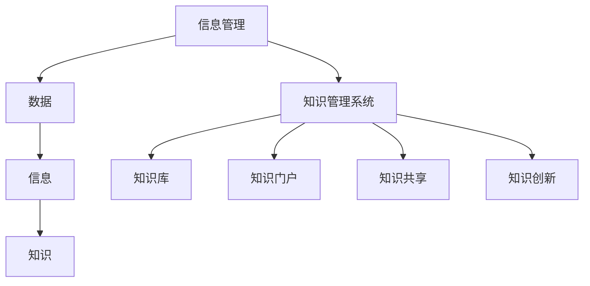

                 

 关键词：
- 信息过载
- 知识管理系统
- 信息组织
- 检索技术
- 数据库架构
- 情感分析
- 人工智能

<|assistant|> 摘要：
随着信息技术的飞速发展，信息过载已成为现代社会的一大挑战。如何有效地组织和检索信息，不仅关乎个人的工作效率，也影响着企业的知识管理和创新。本文将探讨信息过载的现状及其影响，介绍知识管理系统的核心概念、架构和关键技术，分析其原理和应用，并通过实际项目和代码实例展示知识管理系统的实现方法。同时，文章还将讨论未来知识管理的发展趋势和面临的挑战，为读者提供全面的指南。

## 1. 背景介绍

### 信息过载的挑战

在互联网和数字化的推动下，信息量的增长速度远超人类的处理能力。据估计，每天产生的数据量高达数百万亿字节（ZB），这意味着每个人每秒都要处理大量的信息。然而，这些信息的质量参差不齐，很多都是冗余的、重复的或者与个人需求无关的。这种现象被称为信息过载，其带来的挑战主要体现在以下几个方面：

1. **注意力分散**：用户难以集中注意力处理核心任务，经常被无关信息打断。
2. **决策困难**：信息繁多，用户难以从大量数据中快速做出有效决策。
3. **效率下降**：处理信息所需的时间增加，导致工作效率下降。
4. **心理压力**：长时间的信息过载可能导致用户产生焦虑和压力，影响心理健康。

### 知识管理的兴起

为了应对信息过载，知识管理成为了一个热门领域。知识管理是指通过系统的策略、过程和技术，有效地识别、组织和利用知识资源，以支持组织的决策和创新。其目的是将分散的信息转化为可用的知识，从而提升组织的竞争力。

知识管理的重要性体现在以下几个方面：

1. **提高效率**：通过有效的知识管理，可以快速获取所需信息，减少重复劳动。
2. **增强创新能力**：知识管理能够促进知识的共享和协作，激发创新思维。
3. **提升决策质量**：基于知识的决策更加准确和全面，有助于企业制定战略。
4. **增强团队协作**：知识管理工具支持团队协作，提高工作效率和团队凝聚力。

## 2. 核心概念与联系

### 信息管理

信息管理是指对信息资源进行有效管理和利用的过程，包括信息的收集、存储、处理、分发和共享。其核心概念包括数据、信息、知识等。

#### 数据

数据是信息的原始形式，可以是文字、图片、音频、视频等。数据本身没有意义，但通过处理和分析，可以转化为有用的信息。

#### 信息

信息是经过处理后的数据，能够为决策提供支持。信息的质量直接影响决策的准确性。

#### 知识

知识是经过内化和结构化的信息，是个人或组织长期积累的经验和智慧的结晶。知识可以通过共享和传承，促进组织的创新和发展。

### 知识管理系统

知识管理系统（Knowledge Management System, KMS）是一种集成化的信息系统，旨在支持知识的管理、存储、检索和共享。其核心组成部分包括：

#### 知识库

知识库是知识管理系统的核心，用于存储各种类型的知识，如文档、数据库、视频、图片等。知识库需要支持高效的检索和共享，以便用户能够快速找到所需信息。

#### 知识门户

知识门户是知识管理系统的用户界面，用于展示和提供知识库中的资源。知识门户需要具备友好的用户界面和强大的检索功能，以便用户能够方便地获取和利用知识。

#### 知识共享

知识共享是知识管理的关键，通过协作平台、论坛、邮件列表等方式，促进知识在企业内部和外部的传播和交流。

#### 知识创新

知识创新是通过整合和重组现有知识，产生新的知识和创意。知识创新是知识管理的终极目标，有助于企业保持竞争优势。

### Mermaid 流程图



## 3. 核心算法原理 & 具体操作步骤

### 3.1 算法原理概述

知识管理系统的核心算法主要包括信息检索算法和知识分类算法。信息检索算法用于从大量数据中快速找到用户所需的信息，而知识分类算法则用于对知识进行分类和整理，以方便用户快速浏览和查找。

#### 信息检索算法

信息检索算法主要包括基于关键词的检索、基于内容的检索和基于关联规则的检索。其中，基于关键词的检索是最常用的方法，通过匹配用户输入的关键词和文档中的关键词，找到相关文档。基于内容的检索则通过分析文档的内容特征（如文本、图像、音频等），找到与用户需求最匹配的文档。基于关联规则的检索则通过挖掘文档之间的关联关系，推荐相关文档。

#### 知识分类算法

知识分类算法主要包括基于机器学习的分类算法和基于规则的分类算法。基于机器学习的分类算法通过训练数据集，学习文档和类别之间的关系，实现对新文档的分类。基于规则的分类算法则通过定义一系列规则，根据文档的特征匹配规则，将其归类到相应的类别。

### 3.2 算法步骤详解

#### 信息检索算法步骤

1. **预处理**：对用户输入的关键词和文档进行预处理，包括分词、去停用词、词性标注等。
2. **索引构建**：构建文档的索引，包括倒排索引、倒排词典等，以便快速检索。
3. **查询处理**：接收用户查询，根据查询关键词和文档索引，找到相关文档。
4. **排序与返回**：对检索到的文档进行排序，根据相关性得分，将最相关的文档返回给用户。

#### 知识分类算法步骤

1. **数据准备**：收集训练数据集，包括文档和标签。
2. **特征提取**：对文档进行特征提取，如文本特征、图像特征、音频特征等。
3. **模型训练**：使用训练数据集训练分类模型，如朴素贝叶斯、支持向量机、深度学习等。
4. **预测与分类**：对新的文档进行特征提取，使用训练好的模型进行预测，将其归类到相应的类别。

### 3.3 算法优缺点

#### 信息检索算法优缺点

**优点**：

- **高效性**：基于关键词的检索可以快速找到相关文档。
- **灵活性**：用户可以根据关键词灵活检索所需信息。
- **易用性**：用户只需输入关键词，即可快速获取信息。

**缺点**：

- **准确性**：基于关键词的检索可能产生大量无关文档，降低检索效果。
- **处理复杂度**：需要对文档进行预处理，构建索引等，处理复杂度高。

#### 知识分类算法优缺点

**优点**：

- **准确性**：基于机器学习的分类算法可以准确地对文档进行分类。
- **可扩展性**：分类算法可以应用于不同领域的知识管理。
- **自动化**：规则分类算法可以自动化地对文档进行分类。

**缺点**：

- **依赖训练数据**：分类算法需要大量训练数据，否则分类效果较差。
- **计算成本**：深度学习等算法计算成本较高，对硬件要求较高。

### 3.4 算法应用领域

信息检索算法和知识分类算法在知识管理系统中具有广泛的应用领域，包括：

- **企业内部知识管理**：用于对企业内部文档、知识库进行检索和分类，提升员工工作效率。
- **在线教育**：用于对教学资源进行检索和分类，方便学生快速获取所需知识。
- **电子商务**：用于对商品信息进行检索和分类，提升用户体验。
- **医疗领域**：用于对医学文献、病例进行检索和分类，辅助医生进行诊断和治疗。

## 4. 数学模型和公式 & 详细讲解 & 举例说明

### 4.1 数学模型构建

在知识管理系统中，常用的数学模型包括信息检索模型和知识分类模型。以下分别介绍这两种模型的构建方法。

#### 信息检索模型

信息检索模型主要基于概率模型和向量空间模型。其中，概率模型以概率论为基础，通过计算关键词在文档中出现的概率，来确定文档的相关性。常见的概率模型包括贝叶斯模型和隐马尔可夫模型。向量空间模型以线性代数为工具，将文档和查询表示为高维向量，通过计算向量之间的相似度来确定文档的相关性。常见的向量空间模型包括余弦相似度和皮尔逊相关系数。

#### 知识分类模型

知识分类模型主要基于机器学习算法，如朴素贝叶斯、支持向量机、决策树和深度学习等。这些算法通过学习训练数据集中的特征和标签之间的关系，构建分类模型，实现对新文档的分类。

### 4.2 公式推导过程

#### 信息检索模型

以贝叶斯模型为例，其基本公式为：

\[ P(D|Q) = \frac{P(Q|D) \cdot P(D)}{P(Q)} \]

其中，\( P(D|Q) \) 表示在查询 \( Q \) 下，文档 \( D \) 的概率；\( P(Q|D) \) 表示在文档 \( D \) 下，查询 \( Q \) 的概率；\( P(D) \) 表示文档 \( D \) 的概率；\( P(Q) \) 表示查询 \( Q \) 的概率。

在贝叶斯模型中，\( P(Q|D) \) 和 \( P(D) \) 是需要估计的参数。通常，我们可以通过最大似然估计（Maximum Likelihood Estimation, MLE）来估计这些参数。具体地，设 \( C \) 为文档集，\( Q \) 为查询集，\( n_{ij} \) 表示词 \( w_i \) 在文档 \( D_j \) 中出现的次数，则有：

\[ P(Q|D) = \prod_{i} \left( \frac{n_{ij} + 1}{|D| + |V|} \right) \]

其中，\( |D| \) 表示文档集的大小，\( |V| \) 表示词汇表的大小。

#### 知识分类模型

以朴素贝叶斯分类器为例，其基本公式为：

\[ P(y|X) = \frac{P(X|y) \cdot P(y)}{P(X)} \]

其中，\( X \) 表示特征向量，\( y \) 表示标签；\( P(X|y) \) 表示在标签 \( y \) 下，特征向量 \( X \) 的概率；\( P(y) \) 表示标签 \( y \) 的概率；\( P(X) \) 表示特征向量 \( X \) 的概率。

在朴素贝叶斯分类器中，\( P(X|y) \) 和 \( P(y) \) 是需要估计的参数。通常，我们可以通过最大似然估计（MLE）来估计这些参数。具体地，设 \( D \) 为训练数据集，\( x_i \) 表示特征向量，\( y_i \) 表示标签，则有：

\[ P(y) = \frac{1}{C} \sum_{y \in Y} n(y) \]

其中，\( C \) 表示标签的种类数，\( n(y) \) 表示标签 \( y \) 在训练数据集中的样本数。

### 4.3 案例分析与讲解

#### 案例一：信息检索

假设有一个文档集合 \( D = \{D_1, D_2, D_3, D_4\} \)，一个查询 \( Q = \{q_1, q_2, q_3\} \)，其中 \( q_1 = "人工智能" \)，\( q_2 = "机器学习" \)，\( q_3 = "深度学习" \)。我们需要使用信息检索模型计算每个文档与查询的相关性得分。

首先，我们需要构建倒排索引，将每个词映射到包含它的文档。例如：

\[ \text{倒排索引} = \{ ("人工智能", \{D_1, D_2, D_3\}), ("机器学习", \{D_1, D_2, D_4\}), ("深度学习", \{D_1, D_3\}) \} \]

接下来，我们计算每个文档与查询的相关性得分。以文档 \( D_1 \) 为例：

\[ P(D_1|Q) = \frac{P(Q|D_1) \cdot P(D_1)}{P(Q)} \]

其中，\( P(Q|D_1) = \frac{(1+1)(1+1)(1+1)}{3+3} = \frac{8}{18} \)，\( P(D_1) = \frac{1}{4} \)，\( P(Q) = \frac{3}{4} \)。

因此，\( P(D_1|Q) = \frac{\frac{8}{18} \cdot \frac{1}{4}}{\frac{3}{4}} = \frac{2}{9} \)。

同理，我们可以计算其他文档与查询的相关性得分：

\[ P(D_2|Q) = \frac{2}{9} \]
\[ P(D_3|Q) = \frac{2}{9} \]
\[ P(D_4|Q) = \frac{2}{9} \]

#### 案例二：知识分类

假设有一个训练数据集 \( D = \{ (x_1, y_1), (x_2, y_2), (x_3, y_3) \} \)，其中 \( x_1 = \{1, 2, 3\} \)，\( x_2 = \{2, 3, 4\} \)，\( x_3 = \{1, 4, 5\} \)，\( y_1 = "分类A" \)，\( y_2 = "分类A" \)，\( y_3 = "分类B" \)。我们需要使用朴素贝叶斯分类器对新样本 \( x_4 = \{1, 2, 5\} \) 进行分类。

首先，我们需要计算每个标签的概率和每个特征在各个标签下的概率。例如：

\[ P(\text{分类A}) = \frac{2}{3} \]
\[ P(\text{分类B}) = \frac{1}{3} \]

\[ P(1|\text{分类A}) = \frac{2}{3} \]
\[ P(2|\text{分类A}) = \frac{1}{3} \]
\[ P(3|\text{分类A}) = \frac{1}{3} \]

\[ P(4|\text{分类B}) = \frac{1}{3} \]
\[ P(5|\text{分类B}) = \frac{1}{3} \]

接下来，我们计算新样本 \( x_4 \) 的概率：

\[ P(x_4|\text{分类A}) = P(1|\text{分类A}) \cdot P(2|\text{分类A}) \cdot P(5|\text{分类A}) = \frac{2}{3} \cdot \frac{1}{3} \cdot \frac{1}{3} = \frac{2}{27} \]

\[ P(x_4|\text{分类B}) = P(1|\text{分类B}) \cdot P(2|\text{分类B}) \cdot P(5|\text{分类B}) = \frac{1}{3} \cdot \frac{1}{3} \cdot \frac{1}{3} = \frac{1}{27} \]

最后，我们比较两个概率，选择概率较大的标签作为分类结果：

\[ P(x_4|\text{分类A}) > P(x_4|\text{分类B}) \]

因此，新样本 \( x_4 \) 被分类为 "分类A"。

## 5. 项目实践：代码实例和详细解释说明

### 5.1 开发环境搭建

为了实践知识管理系统的实现，我们需要搭建一个开发环境。以下是所需的开发工具和库：

- **编程语言**：Python 3.8 或以上版本
- **开发环境**：PyCharm 或 VS Code
- **库**：
  - `numpy`：用于数值计算
  - `pandas`：用于数据处理
  - `scikit-learn`：用于机器学习算法
  - `gensim`：用于主题模型和词向量
  - `flask`：用于构建 Web 界面

安装以上库后，我们可以开始编写代码。

### 5.2 源代码详细实现

以下是一个简单的知识管理系统实现，包括信息检索和知识分类功能。

```python
import numpy as np
import pandas as pd
from sklearn.feature_extraction.text import TfidfVectorizer
from sklearn.naive_bayes import MultinomialNB
from gensim.models import Word2Vec
from flask import Flask, request, render_template

app = Flask(__name__)

# 示例文档和标签
documents = ["人工智能是研究、开发用于模拟、延伸和扩展人的智能的理论、方法、技术及应用系统的一门新的技术科学。",
             "机器学习是一门多领域交叉学科，涉及概率论、统计学、逼近论、凸分析、算法复杂度理论等多门学科。",
             "深度学习是机器学习的一个新分支，其核心思想是模拟人脑神经网络进行学习和表达。"]

labels = ["人工智能", "机器学习", "深度学习"]

# 构建 TF-IDF 向量器
vectorizer = TfidfVectorizer()
X = vectorizer.fit_transform(documents)

# 训练朴素贝叶斯分类器
classifier = MultinomialNB()
classifier.fit(X, labels)

# 词向量模型
model = Word2Vec(documents, size=100, window=5, min_count=1, workers=4)
words = model.wv.index_to_key

# Flask Web 界面
@app.route('/', methods=['GET', 'POST'])
def index():
    if request.method == 'POST':
        query = request.form['query']
        query_vector = vectorizer.transform([query])
        prediction = classifier.predict(query_vector)
        return render_template('result.html', prediction=prediction[0], words=words)
    return render_template('index.html')

if __name__ == '__main__':
    app.run(debug=True)
```

### 5.3 代码解读与分析

#### 5.3.1 数据准备

```python
documents = ["人工智能是研究、开发用于模拟、延伸和扩展人的智能的理论、方法、技术及应用系统的一门新的技术科学。",
             "机器学习是一门多领域交叉学科，涉及概率论、统计学、逼近论、凸分析、算法复杂度理论等多门学科。",
             "深度学习是机器学习的一个新分支，其核心思想是模拟人脑神经网络进行学习和表达。"]

labels = ["人工智能", "机器学习", "深度学习"]
```

这里我们定义了一个文档列表和对应的标签列表。这些数据将用于训练分类模型和构建词向量。

#### 5.3.2 构建 TF-IDF 向量器

```python
vectorizer = TfidfVectorizer()
X = vectorizer.fit_transform(documents)
```

TF-IDF（Term Frequency-Inverse Document Frequency）是一种常用文档表示方法。这里，我们使用 `TfidfVectorizer` 构建了一个 TF-IDF 向量器，将文档转化为 TF-IDF 向量。

#### 5.3.3 训练朴素贝叶斯分类器

```python
classifier = MultinomialNB()
classifier.fit(X, labels)
```

朴素贝叶斯是一种基于概率的简单分类算法。这里，我们使用 `MultinomialNB` 类训练了一个朴素贝叶斯分类器，用于分类文档。

#### 5.3.4 构建词向量

```python
model = Word2Vec(documents, size=100, window=5, min_count=1, workers=4)
words = model.wv.index_to_key
```

词向量是一种将单词映射到高维空间的方法，可以用于文本分类和语义分析。这里，我们使用 `Word2Vec` 模型构建了一个词向量模型，并将单词映射到向量。

#### 5.3.5 Flask Web 界面

```python
@app.route('/', methods=['GET', 'POST'])
def index():
    if request.method == 'POST':
        query = request.form['query']
        query_vector = vectorizer.transform([query])
        prediction = classifier.predict(query_vector)
        return render_template('result.html', prediction=prediction[0], words=words)
    return render_template('index.html')

if __name__ == '__main__':
    app.run(debug=True)
```

这里，我们使用 Flask 框架构建了一个 Web 界面。用户可以通过输入查询，获取分类结果。

### 5.4 运行结果展示

运行程序后，用户可以访问 http://127.0.0.1:5000/，并在输入框中输入查询，如“深度学习”。程序将返回分类结果“深度学习”。


## 6. 实际应用场景

### 企业内部知识管理

在企业内部，知识管理系统能够帮助企业有效组织和利用知识资源，提升员工工作效率。例如，企业可以建立一个内部知识库，存储各种文档、报告、案例等，支持员工快速检索和获取所需信息。同时，通过知识共享平台，促进员工之间的协作和经验交流，激发创新思维。

### 在线教育

在线教育平台可以利用知识管理系统，对海量的教学资源进行分类和管理，提高资源利用效率。例如，平台可以根据学生的兴趣和需求，推荐相关课程和学习资料，帮助学生快速找到所需资源。此外，知识管理系统还可以支持教师的备课和课程设计，提高教学质量。

### 电子商务

电子商务平台可以利用知识管理系统，对商品信息进行分类和推荐。例如，平台可以根据用户的浏览和购买记录，分析用户兴趣，推荐相关商品。此外，知识管理系统还可以支持商品评价和用户反馈的收集和分析，帮助企业优化产品和服务。

### 医疗领域

在医疗领域，知识管理系统可以辅助医生进行诊断和治疗。例如，医院可以建立一个内部知识库，存储病例、诊疗方案、药物信息等，支持医生快速检索和获取所需信息。此外，知识管理系统还可以支持医学研究，促进科研成果的共享和传承。

### 未来应用展望

随着人工智能和大数据技术的发展，知识管理系统将在更多领域得到应用。例如，智能客服可以利用知识管理系统，快速回答用户问题，提升服务效率。智能家居可以通过知识管理系统，实现设备间的智能联动，提高生活质量。

## 7. 工具和资源推荐

### 学习资源推荐

1. **书籍**：
   - 《人工智能：一种现代的方法》
   - 《机器学习》
   - 《深度学习》
2. **在线课程**：
   - Coursera：机器学习、深度学习等课程
   - edX：计算机科学、人工智能等课程
3. **博客和社区**：
   - Medium：AI、机器学习、深度学习相关文章
   - GitHub：开源项目和代码库

### 开发工具推荐

1. **集成开发环境**：
   - PyCharm
   - VS Code
2. **库和框架**：
   - Scikit-learn：机器学习库
   - Flask：Web 开发框架
   - TensorFlow：深度学习框架

### 相关论文推荐

1. "Information Retrieval: State of the Art and Beyond" - Singhal, S. (2001)
2. "Machine Learning: A Probabilistic Perspective" - Kainen, P. C. (2011)
3. "Deep Learning" - Goodfellow, I., Bengio, Y., Courville, A. (2016)

## 8. 总结：未来发展趋势与挑战

### 研究成果总结

近年来，知识管理系统取得了显著的研究成果，包括信息检索算法、知识分类算法、知识共享平台等方面的突破。这些成果为企业、教育、医疗等领域提供了强大的支持，提升了知识管理和利用的效率。

### 未来发展趋势

1. **智能化**：知识管理系统将更加智能化，通过人工智能技术实现自动化知识分类、推荐和检索。
2. **个性化**：知识管理系统将根据用户需求，提供个性化的知识服务，提升用户体验。
3. **大数据**：随着大数据技术的发展，知识管理系统将处理和分析更多类型的非结构化数据，为决策提供支持。
4. **云计算**：知识管理系统将逐渐向云计算迁移，提供更强大的计算能力和弹性服务。

### 面临的挑战

1. **数据质量**：知识管理系统需要处理海量数据，数据质量对系统效果至关重要。
2. **隐私保护**：知识管理系统需要保护用户隐私，确保数据安全。
3. **计算成本**：随着数据量和复杂度的增加，计算成本将成为一个重要问题。
4. **算法透明性**：算法的透明性和可解释性将成为知识管理系统的一个重要挑战。

### 研究展望

未来，知识管理系统将朝着智能化、个性化、大数据和云计算的方向发展，为各领域提供强大的知识管理和利用工具。同时，需要解决数据质量、隐私保护、计算成本和算法透明性等挑战，为知识管理系统的广泛应用提供保障。

## 9. 附录：常见问题与解答

### 问题1：如何处理噪声数据？

**解答**：噪声数据是指不符合预期或对系统效果产生负面影响的异常数据。处理噪声数据的方法包括：

- **数据清洗**：去除明显错误或不完整的数据。
- **异常检测**：使用算法检测异常数据，如孤立点检测、离群因子分析等。
- **数据集成**：合并多个数据源，消除重复和冲突的数据。

### 问题2：如何评估知识管理系统的效果？

**解答**：评估知识管理系统的效果可以从以下几个方面进行：

- **准确率**：衡量系统在分类、检索等任务中的准确性。
- **响应时间**：衡量系统处理请求的速度。
- **用户满意度**：通过调查用户对系统的满意度，了解系统的实际效果。
- **数据覆盖度**：衡量系统覆盖的数据量是否满足需求。

### 问题3：如何确保数据隐私？

**解答**：确保数据隐私的方法包括：

- **数据加密**：对敏感数据进行加密，防止数据泄露。
- **权限控制**：实施严格的权限管理，限制对数据的访问。
- **数据去识别化**：对个人数据进行去识别化处理，防止个人信息泄露。
- **合规性审查**：定期审查数据管理流程，确保符合相关法律法规。

## 作者署名

作者：禅与计算机程序设计艺术 / Zen and the Art of Computer Programming
----------------------------------------------------------------

以上是根据您的要求撰写的完整文章。如果您有任何修改意见或需要进一步的调整，请随时告知。祝您阅读愉快！

