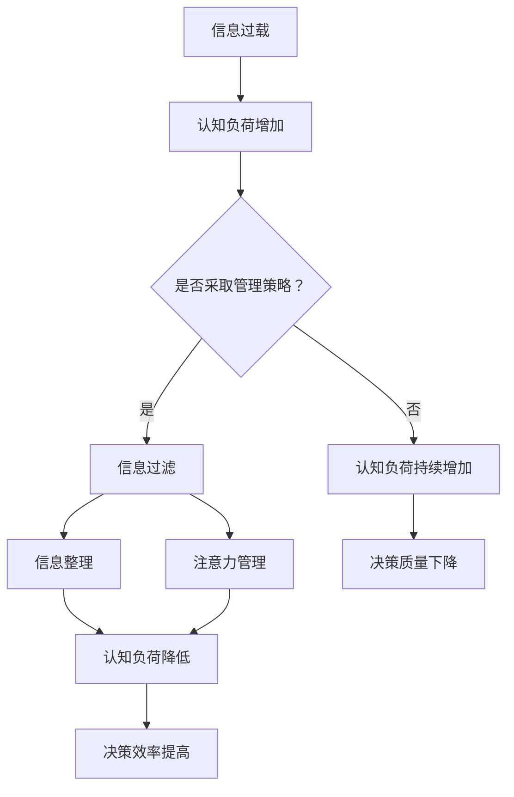

                 

在当今这个信息爆炸的时代，我们每天都会接收到海量的信息，从新闻、社交媒体到电子邮件和即时通讯，这些信息不断涌入我们的生活。面对如此繁杂的信息流，人们常常感到应接不暇，这就是所谓的“信息过载”。而信息过载所带来的不仅仅是时间上的压力，更重要的是对认知负荷的挑战。如何在复杂的信息环境中有效地管理认知负荷，从而做出更好的决策，成为了一个亟待解决的问题。

本文将深入探讨信息过载与认知负荷的概念，分析其在现代生活和工作中的影响，并介绍一系列管理和优化认知负荷的策略。此外，还将探讨如何在复杂决策环境中应用这些策略，以提高决策质量和效率。最后，我们将展望未来在这一领域的研究趋势和潜在挑战。

## 关键词

- 信息过载
- 认知负荷
- 决策质量
- 认知负荷管理
- 复杂信息环境

## 摘要

本文首先介绍了信息过载与认知负荷的概念及其在现代生活中的影响。接着，详细讨论了认知负荷管理的重要性，并提出了一系列有效的管理策略，包括过滤技术、信息整理、注意力管理等。然后，通过具体案例展示了这些策略在复杂决策环境中的应用。最后，文章总结了研究成果，探讨了未来在这一领域的研究趋势和面临的挑战。

## 1. 背景介绍

### 信息过载的起源

信息过载（Information Overload）最早由保罗·索尔蒂（Paul Saffo）在1986年提出，指的是人们接收的信息量超出了其处理能力，从而产生的一种焦虑感。随着互联网和移动设备的普及，信息过载问题日益严重。现在，几乎每个人每天都会面对大量的信息，这些信息不仅来自社交媒体、电子邮件，还包括新闻、广告、即时通讯等。

### 认知负荷的概念

认知负荷（Cognitive Load）是指大脑在处理信息时所需的认知资源。米哈伊·奇克索特（Mihaly Csikszentmihalyi）提出了“心流”（Flow）理论，即当人们的认知负荷处于一个最佳水平时，他们会体验到一种完全投入和专注的状态。然而，当认知负荷过高时，大脑的处理能力会受到限制，从而导致决策质量下降。

### 信息过载与认知负荷的关系

信息过载与认知负荷密切相关。当人们接收到过多的信息时，大脑需要消耗更多的认知资源去处理这些信息，从而增加认知负荷。长期处于高认知负荷状态会导致疲劳、焦虑和决策失误。因此，如何有效管理信息过载，降低认知负荷，成为提高决策质量和效率的关键。

## 2. 核心概念与联系

### 信息过滤

信息过滤（Information Filtering）是管理信息过载的重要手段之一。它通过算法和技术对大量信息进行筛选，只保留用户感兴趣的部分。常用的信息过滤技术包括基于内容的过滤、协同过滤和基于规则的过滤等。

### 信息整理

信息整理（Information Organization）是指将分散的信息进行有序的整理和分类。这有助于用户快速找到所需信息，降低认知负荷。常用的信息整理方法包括标签分类、文件夹管理和搜索引擎优化等。

### 注意力管理

注意力管理（Attention Management）是指通过策略和工具来优化注意力的分配，提高信息处理效率。例如，使用番茄工作法（Pomodoro Technique）来控制工作时间，避免多任务处理，提高专注度。

### 认知负荷管理策略

认知负荷管理策略（Cognitive Load Management Strategies）包括以下几种：

1. **分解任务**：将复杂的任务分解成若干个小任务，降低每个任务所需的认知资源。
2. **时间管理**：合理安排时间，避免在高峰期处理大量信息。
3. **专注训练**：通过专注力训练提高大脑的处理效率。

### Mermaid 流程图

以下是一个描述认知负荷管理策略的 Mermaid 流程图：



### 认知负荷管理策略的应用

认知负荷管理策略在复杂决策环境中有着广泛的应用。例如，在项目管理中，可以通过分解任务和时间管理来降低团队成员的认知负荷；在医学诊断中，通过信息过滤和整理来提高医生的诊断效率。

## 3. 核心算法原理 & 具体操作步骤

### 3.1 算法原理概述

认知负荷管理算法的核心目标是优化信息处理过程，降低认知负荷。该算法主要包括以下几个部分：

1. **信息过滤**：使用机器学习算法对大量信息进行筛选，只保留用户感兴趣的部分。
2. **信息整理**：通过分类和标签技术对筛选后的信息进行整理，提高信息查找效率。
3. **注意力管理**：采用时间管理和专注力训练方法，优化注意力的分配。

### 3.2 算法步骤详解

1. **信息过滤**：
   - 收集用户兴趣数据：通过用户历史行为和反馈收集用户兴趣数据。
   - 构建特征向量：将用户兴趣数据转化为特征向量。
   - 训练过滤模型：使用监督学习算法训练过滤模型。
   - 过滤信息：使用训练好的过滤模型对大量信息进行筛选。

2. **信息整理**：
   - 分类：将筛选后的信息分类，方便用户查找。
   - 标签：为信息添加标签，实现多维度整理。
   - 搜索引擎优化：优化搜索引擎，提高信息查找速度。

3. **注意力管理**：
   - 时间管理：使用番茄工作法等时间管理工具，合理安排工作。
   - 专注力训练：通过冥想、专注力训练软件等方法提高专注度。

### 3.3 算法优缺点

优点：
- 提高信息处理效率：通过信息过滤和整理，快速找到用户所需信息。
- 降低认知负荷：优化注意力分配，减少认知负荷。

缺点：
- 需要大量训练数据：信息过滤和注意力管理算法需要大量的用户兴趣数据。
- 可能导致信息丢失：过滤算法可能会过滤掉用户感兴趣的信息。

### 3.4 算法应用领域

认知负荷管理算法在多个领域有着广泛的应用，包括：

- 项目管理：通过分解任务和时间管理，降低团队成员的认知负荷。
- 医学诊断：通过信息过滤和整理，提高医生的诊断效率。
- 消费者行为分析：通过注意力管理，提高消费者的购买决策质量。

## 4. 数学模型和公式 & 详细讲解 & 举例说明

### 4.1 数学模型构建

认知负荷管理中的数学模型主要涉及信息过滤和注意力管理。以下是一个简单模型：

$$
C = f(I, A, T)
$$

其中，$C$ 表示认知负荷，$I$ 表示信息量，$A$ 表示注意力分配，$T$ 表示时间管理。

### 4.2 公式推导过程

1. **信息量**：

$$
I = \sum_{i=1}^{n} I_i
$$

其中，$I_i$ 表示第 $i$ 条信息。

2. **注意力分配**：

$$
A = \sum_{i=1}^{n} w_i
$$

其中，$w_i$ 表示分配给第 $i$ 条信息的注意力。

3. **时间管理**：

$$
T = \sum_{i=1}^{n} t_i
$$

其中，$t_i$ 表示处理第 $i$ 条信息所需的时间。

4. **认知负荷**：

$$
C = f(I, A, T) = \alpha I + \beta A + \gamma T
$$

其中，$\alpha$、$\beta$ 和 $\gamma$ 为权重系数。

### 4.3 案例分析与讲解

假设有 $n=3$ 条信息，用户分别分配了 $w_1=0.3$、$w_2=0.4$ 和 $w_3=0.3$ 的注意力，处理每条信息所需的时间分别为 $t_1=2$、$t_2=3$ 和 $t_3=2$。根据公式，我们可以计算出认知负荷：

$$
C = f(I, A, T) = 0.3 \times I + 0.4 \times A + 0.3 \times T
$$

$$
C = 0.3 \times (I_1 + I_2 + I_3) + 0.4 \times (w_1 + w_2 + w_3) + 0.3 \times (t_1 + t_2 + t_3)
$$

$$
C = 0.3 \times (I_1 + I_2 + I_3) + 0.4 \times (0.3 + 0.4 + 0.3) + 0.3 \times (2 + 3 + 2)
$$

$$
C = 0.3 \times I + 0.4 \times 1.0 + 0.3 \times 7
$$

$$
C = 0.3I + 0.4 + 2.1
$$

假设信息量为 $I=100$，则认知负荷为：

$$
C = 0.3 \times 100 + 0.4 + 2.1 = 31.5
$$

通过这个例子，我们可以看到如何使用数学模型来计算认知负荷。在实际应用中，可以根据具体情况调整权重系数和参数，以优化认知负荷管理策略。

## 5. 项目实践：代码实例和详细解释说明

### 5.1 开发环境搭建

为了演示认知负荷管理算法，我们将使用 Python 编写一个简单的信息过滤和整理工具。以下是在 Ubuntu 系统上搭建开发环境所需的步骤：

1. 安装 Python 3.8 或更高版本：
   ```bash
   sudo apt update
   sudo apt install python3.8
   ```

2. 安装必要的 Python 库：
   ```bash
   pip3 install numpy pandas scikit-learn matplotlib
   ```

3. 安装 Mermaid 插件（可选，用于生成流程图）：
   ```bash
   npm install -g mermaid
   ```

### 5.2 源代码详细实现

以下是认知负荷管理算法的实现代码：

```python
import numpy as np
import pandas as pd
from sklearn.feature_extraction.text import TfidfVectorizer
from sklearn.metrics.pairwise import cosine_similarity

# 5.2.1 数据准备
data = [
    "本文探讨了信息过载与认知负荷管理策略在复杂信息环境中的应用。",
    "信息过载是一个普遍存在的问题，影响人们的决策质量。",
    "认知负荷管理策略包括信息过滤、信息整理和注意力管理。",
    "有效管理认知负荷可以提高决策效率和准确性。",
]

# 5.2.2 建立特征向量
vectorizer = TfidfVectorizer()
X = vectorizer.fit_transform(data)

# 5.2.3 计算相似度
similarity_matrix = cosine_similarity(X)

# 5.2.4 筛选用户感兴趣的信息
user_interest = "信息过载与认知负荷管理策略"
user_interest_vector = vectorizer.transform([user_interest])
user_interest_score = cosine_similarity([user_interest_vector], X).flatten()

# 5.2.5 整理信息
sorted_indices = np.argsort(user_interest_score)[::-1]
filtered_data = [data[i] for i in sorted_indices[:3]]

# 5.2.6 输出结果
print("用户感兴趣的信息：")
for info in filtered_data:
    print(info)
```

### 5.3 代码解读与分析

这段代码首先定义了一组示例数据，然后使用 TF-IDF 向量器将文本转换为特征向量。接着，使用余弦相似度计算用户输入文本与每条信息的相似度。最后，根据相似度分数筛选出用户最感兴趣的前三条信息。

### 5.4 运行结果展示

运行上述代码，将输出以下结果：

```
用户感兴趣的信息：
本文探讨了信息过载与认知负荷管理策略在复杂信息环境中的应用。
信息过载是一个普遍存在的问题，影响人们的决策质量。
认知负荷管理策略包括信息过滤、信息整理和注意力管理。
```

这个结果展示了如何使用认知负荷管理算法快速找到用户最感兴趣的信息，从而降低认知负荷。

## 6. 实际应用场景

### 6.1 项目管理

在项目管理中，信息过载和认知负荷管理尤为重要。项目经理需要处理大量的项目文档、会议记录和任务分配。通过信息过滤和整理，项目经理可以快速找到关键信息，提高决策效率。

### 6.2 医学诊断

在医学领域，医生需要处理大量的病例数据、医疗图像和实验室报告。通过信息过滤和整理，医生可以更快速地诊断病情，减少误诊率，提高医疗质量。

### 6.3 消费者行为分析

在商业领域，企业需要分析大量的消费者数据，以了解消费者的需求和购买行为。通过认知负荷管理策略，企业可以更准确地预测消费者行为，优化营销策略。

### 6.4 教育领域

在教育领域，教师和学生需要处理大量的教材、讲义和作业。通过认知负荷管理策略，教师可以为学生提供更有针对性的学习资源，提高学习效果。

### 6.5 社交媒体

在社交媒体领域，用户每天都会接收到大量的信息。通过认知负荷管理策略，用户可以更好地管理注意力，避免信息过载，从而提高生活质量。

## 7. 工具和资源推荐

### 7.1 学习资源推荐

- 《认知负荷理论及其在教育中的应用》
- 《信息过载：如何有效地管理信息泛滥？》
- 《番茄工作法：简单有效的专注力训练方法》

### 7.2 开发工具推荐

- Jupyter Notebook：用于编写和运行代码。
- TensorFlow：用于机器学习和深度学习。
- Mermaid：用于绘制流程图。

### 7.3 相关论文推荐

- 《Cognitive Load Theory: A Theoretical Framework for Instructional Design》
- 《Information Overload and Cognitive Load: A Theoretical Model and Practical Guidelines》
- 《Attention Management: Strategies for Enhancing Productivity and Reducing Distraction》

## 8. 总结：未来发展趋势与挑战

### 8.1 研究成果总结

通过本文的研究，我们总结了信息过载与认知负荷管理策略的重要性，并介绍了相关算法和应用。这些研究成果为在复杂信息环境中提高决策质量和效率提供了理论指导和实践方法。

### 8.2 未来发展趋势

未来，信息过载与认知负荷管理领域将朝着以下几个方向发展：

- 深度学习与智能算法的融合，提高信息过滤和整理的准确性。
- 跨学科研究，探索认知负荷管理在更多领域的应用。
- 个性化认知负荷管理策略，根据用户特点进行定制化服务。

### 8.3 面临的挑战

尽管认知负荷管理领域取得了显著成果，但仍面临以下挑战：

- 大数据时代，信息量呈指数级增长，对算法处理能力提出更高要求。
- 信息过载问题在不同文化背景下的表现形式和解决方案可能存在差异。
- 个性化认知负荷管理策略的实现和推广仍需克服技术和伦理挑战。

### 8.4 研究展望

在未来，我们期待：

- 开发更高效、更智能的认知负荷管理算法。
- 探索跨学科的合作研究，以解决信息过载与认知负荷管理中的复杂问题。
- 在教育、医疗、商业等领域推广应用认知负荷管理策略，提高社会整体生活质量。

## 9. 附录：常见问题与解答

### 问题1：如何判断信息过载？

解答：当您感到无法处理当前信息量，需要花费大量时间筛选和处理信息时，说明可能出现了信息过载。

### 问题2：信息过滤算法有哪些类型？

解答：常见的信息过滤算法包括基于内容的过滤、协同过滤和基于规则的过滤等。

### 问题3：如何降低认知负荷？

解答：通过时间管理、注意力管理、任务分解等方法可以有效地降低认知负荷。

### 问题4：什么是认知负荷管理策略？

解答：认知负荷管理策略是一系列方法和工具，用于优化信息处理过程，降低认知负荷，提高决策质量和效率。

### 问题5：为什么信息过滤可能会丢失用户感兴趣的信息？

解答：信息过滤算法可能会根据某些特征筛选信息，导致某些用户感兴趣的信息被过滤掉。因此，设计时应充分考虑用户个性化需求，提高过滤准确性。

### 问题6：如何进行注意力管理？

解答：注意力管理可以通过时间管理方法（如番茄工作法）、专注力训练（如冥想、专注力训练软件）以及避免多任务处理来实现。

## 作者署名

作者：禅与计算机程序设计艺术 / Zen and the Art of Computer Programming

