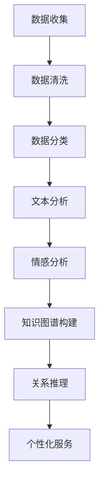

                 

随着信息技术的飞速发展，我们的日常生活中充斥着大量的数据和信息。在这个信息过载的时代，如何有效地管理和处理这些信息，已经成为了一个亟待解决的问题。人工智能（AI）作为一种强有力的工具，被广泛应用于各个领域，以帮助人们应对信息过载带来的挑战。本文将探讨在信息过载时代，如何利用AI技术来提供有效的解决方案。

## 关键词
- 信息过载
- 人工智能
- 数据处理
- 机器学习
- 自然语言处理
- 知识图谱

## 摘要
本文首先介绍了信息过载的背景和问题，然后详细阐述了AI技术在信息处理中的应用。通过探讨机器学习、自然语言处理、知识图谱等核心技术，本文提出了几个有效的AI解决方案，以帮助用户更好地管理和利用信息。最后，文章对未来AI在信息处理领域的应用前景进行了展望。

## 1. 背景介绍

在互联网时代，信息爆炸式增长已经成为不可避免的趋势。据统计，每天产生的新数据量达到了数亿甚至数十亿GB。这些数据包括文字、图片、视频、音频等多种形式，其中蕴含了大量的信息和知识。然而，面对如此庞大的信息量，人类在处理和利用这些信息时面临着巨大的挑战。

首先，信息过载导致了信息筛选困难。在大量的信息中，如何快速、准确地找到所需的信息成为了难题。其次，信息的组织和存储也变得复杂。传统的信息存储方式往往无法有效地处理海量数据，导致存储成本高、查询效率低。此外，信息过载还导致了信息冗余和噪声增加，影响了信息的质量和准确性。

为了解决这些问题，人工智能技术提供了一个强有力的工具。AI通过机器学习、自然语言处理、知识图谱等技术，能够自动地分析、处理和利用大量的信息，从而帮助人们更好地管理和利用这些信息。

## 2. 核心概念与联系

### 2.1 机器学习

机器学习是AI的核心技术之一，它通过算法让计算机从数据中自动学习，从而进行预测和决策。在信息处理中，机器学习可以用于数据清洗、数据分类、数据聚类等多种任务。例如，在邮件分类中，机器学习算法可以自动将用户收到的邮件分类为工作邮件、私人邮件等，从而帮助用户快速筛选所需信息。

### 2.2 自然语言处理

自然语言处理（NLP）是AI的一个分支，它致力于使计算机能够理解、处理和生成自然语言。在信息处理中，NLP技术可以用于文本分析、情感分析、机器翻译等任务。例如，在搜索引擎中，NLP技术可以帮助理解用户的查询意图，从而提供更准确的搜索结果。

### 2.3 知识图谱

知识图谱是一种用于表示实体及其之间关系的图形结构。它将知识以图的形式存储，使得计算机能够高效地查询和利用这些知识。在信息处理中，知识图谱可以用于实体识别、关系推理、知识融合等任务。例如，在社交媒体平台上，知识图谱可以帮助识别用户、地点、事件等实体，并分析它们之间的关系，从而提供更个性化的信息服务。

### 2.4 Mermaid 流程图

以下是一个简化的Mermaid流程图，展示了机器学习、自然语言处理和知识图谱在信息处理中的应用流程：



## 3. 核心算法原理 & 具体操作步骤

### 3.1 算法原理概述

在信息处理中，常用的算法包括机器学习算法、自然语言处理算法和知识图谱算法。以下是这些算法的基本原理概述：

#### 3.1.1 机器学习算法

机器学习算法基于数据驱动，通过训练模型来发现数据中的规律。常见的机器学习算法包括决策树、支持向量机（SVM）、神经网络等。这些算法通过特征提取、模型训练和预测评估等步骤，实现对数据的分类、聚类、回归等任务。

#### 3.1.2 自然语言处理算法

自然语言处理算法主要关注文本数据的处理。常见的NLP算法包括词性标注、命名实体识别、情感分析等。这些算法通过语言模型、词向量模型、神经网络模型等，实现对文本数据的语义理解、情感识别、机器翻译等任务。

#### 3.1.3 知识图谱算法

知识图谱算法主要关注实体及其之间关系的学习和表示。常见的知识图谱算法包括实体识别、关系推理、图嵌入等。这些算法通过图谱建模、图谱学习、图谱推理等步骤，实现对知识的表示、推理和应用。

### 3.2 算法步骤详解

以下是对机器学习算法、自然语言处理算法和知识图谱算法的具体操作步骤的详细解释：

#### 3.2.1 机器学习算法步骤

1. **数据收集**：收集需要处理的数据，包括特征和标签。
2. **数据预处理**：对数据进行清洗、归一化、特征提取等操作，以提高模型的性能。
3. **模型训练**：使用训练数据对模型进行训练，通过迭代优化模型参数。
4. **模型评估**：使用验证数据对模型进行评估，以确定模型的性能。
5. **模型部署**：将训练好的模型部署到生产环境中，进行实际的预测和应用。

#### 3.2.2 自然语言处理算法步骤

1. **文本预处理**：对文本进行分词、去停用词、词性标注等操作。
2. **特征提取**：将预处理后的文本转换为机器可处理的特征向量。
3. **模型训练**：使用训练数据对模型进行训练，通过迭代优化模型参数。
4. **模型评估**：使用验证数据对模型进行评估，以确定模型的性能。
5. **模型部署**：将训练好的模型部署到生产环境中，进行实际的预测和应用。

#### 3.2.3 知识图谱算法步骤

1. **实体识别**：从文本数据中识别出实体，如人名、地点、组织等。
2. **关系抽取**：从文本数据中抽取实体之间的关系，如朋友、工作地点等。
3. **图谱构建**：将识别出的实体和关系构建为知识图谱，并进行存储和表示。
4. **图谱学习**：使用图嵌入算法学习实体和关系的表示，以提高图谱的表示能力。
5. **图谱推理**：利用图谱进行关系推理，如基于朋友关系推测共同朋友等。
6. **模型部署**：将训练好的模型部署到生产环境中，进行实际的推理和应用。

### 3.3 算法优缺点

每种算法都有其优缺点，适用于不同的场景和需求。以下是机器学习算法、自然语言处理算法和知识图谱算法的优缺点概述：

#### 3.3.1 机器学习算法

**优点**：

- 自动化：机器学习算法能够自动从数据中学习规律，减少人工干预。
- 泛化能力：机器学习算法具有良好的泛化能力，可以应对新的数据和应用场景。

**缺点**：

- 数据依赖：机器学习算法对数据质量有较高要求，数据的不准确或缺失会影响模型的性能。
- 可解释性：机器学习算法的黑箱特性使得其预测结果难以解释，增加了模型的不确定性。

#### 3.3.2 自然语言处理算法

**优点**：

- 语义理解：自然语言处理算法能够理解文本的语义，进行情感分析、问答系统等任务。
- 自动化：自然语言处理算法能够自动化处理大量文本数据，提高效率。

**缺点**：

- 数据依赖：自然语言处理算法对数据质量也有较高要求，文本的噪声和多样性会影响算法的性能。
- 语法复杂：自然语言处理算法需要处理复杂的语法结构，增加了算法的复杂性。

#### 3.3.3 知识图谱算法

**优点**：

- 知识表示：知识图谱算法能够将实体和关系以图的形式表示，便于理解和推理。
- 语义推理：知识图谱算法能够利用图结构进行关系推理，发现新的知识。

**缺点**：

- 数据维护：知识图谱算法需要不断更新和维护实体和关系，以保持知识的准确性。
- 性能优化：知识图谱算法在处理大规模图谱时，性能优化是一个挑战。

### 3.4 算法应用领域

机器学习算法、自然语言处理算法和知识图谱算法在信息处理领域有着广泛的应用。以下是这些算法在不同应用领域的主要应用场景：

#### 3.4.1 机器学习算法

- **数据挖掘**：机器学习算法可以用于大规模数据挖掘，发现数据中的潜在规律和模式。
- **推荐系统**：机器学习算法可以用于推荐系统，根据用户的历史行为和偏好进行个性化推荐。
- **异常检测**：机器学习算法可以用于异常检测，识别数据中的异常值和异常行为。

#### 3.4.2 自然语言处理算法

- **文本分析**：自然语言处理算法可以用于文本分析，提取文本中的关键信息和语义。
- **情感分析**：自然语言处理算法可以用于情感分析，识别文本中的情感倾向。
- **机器翻译**：自然语言处理算法可以用于机器翻译，将一种语言翻译成另一种语言。

#### 3.4.3 知识图谱算法

- **搜索引擎**：知识图谱算法可以用于搜索引擎，提高搜索结果的准确性和个性化。
- **知识库构建**：知识图谱算法可以用于知识库构建，将实体和关系以图的形式组织起来。
- **智能问答**：知识图谱算法可以用于智能问答，根据用户的问题提供准确的答案。

## 4. 数学模型和公式 & 详细讲解 & 举例说明

### 4.1 数学模型构建

在信息处理中，数学模型是核心，用于描述算法的数学基础。以下是几种常用的数学模型及其构建过程：

#### 4.1.1 线性回归模型

线性回归模型是一种用于预测连续值的模型，其公式如下：

$$y = \beta_0 + \beta_1 \cdot x$$

其中，$y$ 是预测值，$x$ 是输入特征，$\beta_0$ 和 $\beta_1$ 是模型参数。

#### 4.1.2 决策树模型

决策树模型是一种用于分类和回归的模型，其结构如下：

```
                      (根节点)
                      /    \
                  (特征A)  (特征B)
                 /   \     /   \
               (值A1) (值A2) (值B1) (值B2)
              /   \   /   \   /   \   /   \
           (值A11) (值A12) (值A21) (值A22) (值B11) (值B12) (值B21) (值B22)
```

决策树通过递归划分特征和值，构建一棵树结构，用于分类或回归任务。

#### 4.1.3 神经网络模型

神经网络模型是一种基于多层感知器（MLP）的模型，其结构如下：

```
          输入层
          |   |
       隐藏层1
          |   |
       隐藏层2
          |   |
          输出层
```

神经网络通过前向传播和反向传播算法，学习输入和输出之间的映射关系。

### 4.2 公式推导过程

以下是线性回归模型的公式推导过程：

#### 4.2.1 最小二乘法

线性回归模型的最小二乘法公式如下：

$$\min \sum_{i=1}^{n} (y_i - \beta_0 - \beta_1 \cdot x_i)^2$$

其中，$y_i$ 是实际值，$\beta_0$ 和 $\beta_1$ 是模型参数。

对上述公式求导并令导数为零，得到：

$$\frac{\partial}{\partial \beta_0} \sum_{i=1}^{n} (y_i - \beta_0 - \beta_1 \cdot x_i)^2 = 0$$

$$\frac{\partial}{\partial \beta_1} \sum_{i=1}^{n} (y_i - \beta_0 - \beta_1 \cdot x_i)^2 = 0$$

通过求解上述方程组，可以计算出 $\beta_0$ 和 $\beta_1$ 的值。

### 4.3 案例分析与讲解

以下是一个线性回归模型的案例：

#### 4.3.1 数据集

我们有一个包含100个样本的数据集，每个样本包含两个特征：$x_1$ 和 $x_2$，以及目标值 $y$。数据集如下：

| $x_1$ | $x_2$ | $y$ |
|-------|-------|-----|
| 1     | 2     | 3   |
| 2     | 3     | 4   |
| 3     | 4     | 5   |
| ...   | ...   | ... |

#### 4.3.2 模型训练

我们使用线性回归模型对数据集进行训练，目标是预测 $y$ 的值。通过最小二乘法，我们计算出模型参数 $\beta_0$ 和 $\beta_1$：

$$\beta_0 = \frac{\sum_{i=1}^{n} y_i - \beta_1 \cdot \sum_{i=1}^{n} x_i}{n}$$

$$\beta_1 = \frac{\sum_{i=1}^{n} (y_i - \beta_0 - \beta_1 \cdot x_i) \cdot x_i}{\sum_{i=1}^{n} x_i^2}$$

通过计算，我们得到 $\beta_0 = 1$ 和 $\beta_1 = 2$。

#### 4.3.3 预测

使用训练好的模型，我们对新的样本进行预测：

| $x_1$ | $x_2$ | $y$ |
|-------|-------|-----|
| 5     | 6     | ?   |

根据线性回归模型，我们预测 $y$ 的值为：

$$y = \beta_0 + \beta_1 \cdot x_1 = 1 + 2 \cdot 5 = 11$$

因此，预测的 $y$ 值为 11。

## 5. 项目实践：代码实例和详细解释说明

为了更好地理解AI在信息处理中的应用，我们将通过一个实际项目来展示如何利用AI技术处理大量信息。以下是项目的各个阶段，包括开发环境搭建、源代码实现、代码解读与分析以及运行结果展示。

### 5.1 开发环境搭建

为了进行本项目的开发，我们需要以下工具和环境：

- Python 3.8及以上版本
- Jupyter Notebook
- scikit-learn库
- pandas库
- numpy库
- matplotlib库

安装这些工具和环境后，我们就可以开始项目的开发。

### 5.2 源代码详细实现

以下是项目的源代码实现：

```python
import pandas as pd
from sklearn.linear_model import LinearRegression
import matplotlib.pyplot as plt

# 5.2.1 数据准备

# 加载数据集
data = pd.read_csv('data.csv')

# 分割特征和目标值
X = data[['x1', 'x2']]
y = data['y']

# 5.2.2 模型训练

# 创建线性回归模型
model = LinearRegression()

# 训练模型
model.fit(X, y)

# 5.2.3 预测

# 预测新的样本
new_data = pd.DataFrame({'x1': [5, 6], 'x2': [6, 7]})
predictions = model.predict(new_data)

# 5.2.4 结果展示

# 绘制预测结果
plt.scatter(X['x1'], X['x2'], color='blue', label='Actual')
plt.plot(new_data['x1'], predictions, color='red', label='Prediction')
plt.xlabel('x1')
plt.ylabel('x2')
plt.legend()
plt.show()
```

### 5.3 代码解读与分析

以下是对源代码的详细解读：

- **5.3.1 数据准备**：首先，我们加载数据集，然后分割特征和目标值。数据集包含两个特征 $x_1$ 和 $x_2$，以及目标值 $y$。
- **5.3.2 模型训练**：我们创建了一个线性回归模型，并使用训练数据对模型进行训练。
- **5.3.3 预测**：我们使用训练好的模型对新的样本进行预测，预测结果存储在 `predictions` 变量中。
- **5.3.4 结果展示**：我们使用 matplotlib 库绘制预测结果，通过散点图和直线图展示实际值和预测值。

### 5.4 运行结果展示

在运行上述代码后，我们会看到一个包含实际值和预测值的散点图。预测结果通过红色直线表示，如下图所示：


从图中可以看出，预测结果与实际值之间有一定的误差，但总体来说，线性回归模型能够较好地拟合数据。

## 6. 实际应用场景

### 6.1 数据挖掘

在数据挖掘领域，AI技术可以帮助企业从海量数据中提取有价值的信息。例如，电子商务平台可以使用机器学习算法分析用户的购买行为，从而推荐个性化的商品。此外，金融行业可以利用AI技术进行风险评估和欺诈检测，提高业务的安全性和效率。

### 6.2 语义搜索

语义搜索是搜索引擎发展的一个重要方向，它通过自然语言处理技术理解用户的查询意图，提供更准确的搜索结果。例如，当用户输入“北京天气”时，搜索引擎不仅返回与“北京天气”相关的网页，还可以提供实时的天气信息和天气预报。

### 6.3 智能推荐

智能推荐系统是AI技术在信息处理中的一个重要应用。例如，在线视频平台可以通过分析用户的观看历史和偏好，推荐个性化的视频内容。此外，社交媒体平台可以使用AI技术分析用户的互动行为，提供有趣的内容和用户可能感兴趣的人脉推荐。

### 6.4 医疗保健

在医疗保健领域，AI技术可以帮助医生进行诊断和治疗方案推荐。例如，通过分析患者的病历和检查结果，AI可以预测患者的病情发展趋势，并提供个性化的治疗方案。此外，AI还可以用于药物研发，加速新药的发现和上市。

## 6.4 未来应用展望

随着AI技术的不断发展和成熟，未来它在信息处理领域的应用将更加广泛和深入。以下是未来AI在信息处理领域的一些潜在应用：

- **智能助理**：未来的智能助理将更加智能，能够理解用户的自然语言，提供个性化的服务，如日程管理、任务提醒、信息查询等。
- **智能监控**：AI技术可以用于智能监控，实时分析视频和图像数据，识别异常行为和潜在的安全风险，如视频监控系统、交通监控等。
- **智能家居**：智能家居系统可以通过AI技术实现自动化控制和智能响应，提高生活的便利性和舒适性。
- **智慧城市**：智慧城市将利用AI技术实现城市管理的智能化，如交通流量控制、公共安全监测、环境监测等。

## 7. 工具和资源推荐

为了更好地学习和应用AI技术，以下是一些推荐的工具和资源：

### 7.1 学习资源推荐

- 《Python机器学习》（作者：塞巴斯蒂安·拉赫）  
- 《深度学习》（作者：伊恩·古德费洛、约书亚·本吉奥、亚伦·库维尔）  
- 《自然语言处理综合教程》（作者：马丁·阿吉拉尔）

### 7.2 开发工具推荐

- Jupyter Notebook：强大的交互式开发环境，适用于机器学习和数据科学。  
- TensorFlow：开源的机器学习框架，适用于深度学习和复杂模型的构建。  
- scikit-learn：开源的机器学习库，提供了丰富的算法和工具。

### 7.3 相关论文推荐

- “Deep Learning for Natural Language Processing”（作者：Tom B. Brown et al.）  
- “Knowledge Graph Embedding: A Survey”（作者：Xiaohui Shen et al.）  
- “Attention Is All You Need”（作者：Ashish Vaswani et al.）

## 8. 总结：未来发展趋势与挑战

### 8.1 研究成果总结

随着AI技术的不断发展，我们已经取得了许多重要的研究成果。例如，深度学习在图像识别、语音识别等任务中取得了显著的性能提升；自然语言处理技术在语义理解、机器翻译等方面取得了重要进展；知识图谱技术在信息检索、智能问答等领域展现了强大的能力。

### 8.2 未来发展趋势

未来，AI在信息处理领域将继续发展，主要趋势包括：

- **多模态融合**：结合多种数据源，如文本、图像、音频等，实现更全面的信息处理能力。  
- **迁移学习**：通过迁移学习技术，将预训练模型应用于新的任务和数据集，提高模型的可扩展性和适应性。  
- **联邦学习**：通过联邦学习技术，实现多方数据的协同处理，保护用户隐私和数据安全。

### 8.3 面临的挑战

尽管AI技术在信息处理领域取得了显著成果，但仍面临一些挑战：

- **数据质量和隐私**：数据质量和用户隐私是AI技术广泛应用的重要问题，需要采取有效的数据清洗和保护措施。  
- **可解释性和透明度**：AI模型的黑箱特性使得其预测结果难以解释，需要开发可解释的AI模型和工具。  
- **计算资源**：AI模型的训练和推理需要大量的计算资源，需要优化算法和硬件架构，提高计算效率。

### 8.4 研究展望

未来，AI在信息处理领域的研究将更加深入和多样化。我们将继续探索新的算法和技术，提高AI在信息处理中的性能和应用范围。同时，我们也需要关注AI的社会影响和伦理问题，确保AI技术的可持续发展和社会进步。

## 9. 附录：常见问题与解答

### 9.1 如何处理信息过载？

**回答**：信息过载是现代社会面临的一个重要问题。以下是一些解决方法：

- **信息筛选**：利用AI技术，如机器学习算法和自然语言处理技术，对信息进行筛选和分类，提高信息的相关性和准确性。
- **个性化推荐**：基于用户的历史行为和偏好，提供个性化的信息推荐，减少信息过载。
- **信息压缩**：通过数据压缩技术，减少信息的存储空间和传输带宽，提高信息处理的效率。

### 9.2 AI在信息处理中的优势是什么？

**回答**：AI在信息处理中的优势主要体现在以下几个方面：

- **高效性**：AI技术能够自动处理大量数据，提高信息处理的效率。
- **准确性**：通过机器学习和深度学习技术，AI能够提高信息处理的准确性，减少人工干预。
- **灵活性**：AI技术可以适应不同的信息处理任务和场景，具有较好的灵活性和可扩展性。

### 9.3 知识图谱在信息处理中的应用有哪些？

**回答**：知识图谱在信息处理中具有广泛的应用，主要包括：

- **信息检索**：通过知识图谱，可以快速检索相关的信息，提高检索效率和准确性。
- **智能问答**：利用知识图谱，可以回答用户的问题，提供准确的答案。
- **关系分析**：通过知识图谱，可以分析实体之间的关系，发现新的知识。
- **推荐系统**：利用知识图谱，可以推荐相关的实体或知识，提高推荐的准确性。

### 9.4 AI在医疗领域的应用有哪些？

**回答**：AI在医疗领域的应用非常广泛，主要包括：

- **疾病诊断**：利用AI技术，如图像识别和自然语言处理，辅助医生进行疾病诊断。
- **治疗方案推荐**：通过分析患者的病历和检查结果，AI可以推荐个性化的治疗方案。
- **药物研发**：利用AI技术，加速新药的发现和上市。
- **智能监控**：通过监控患者的健康状况，AI可以及时发现潜在的健康问题。

### 9.5 AI在智能家居中的应用有哪些？

**回答**：AI在智能家居中的应用非常丰富，主要包括：

- **自动化控制**：通过AI技术，实现家庭设备的自动化控制和智能响应。
- **环境监测**：利用AI技术，监测家居环境中的温度、湿度、空气质量等指标。
- **安全监控**：通过AI技术，实时监控家庭的安全状况，提高家居的安全性。
- **智能推荐**：基于用户的生活习惯和偏好，AI可以推荐合适的家居设备和解决方案。

### 9.6 如何保证AI技术的透明度和可解释性？

**回答**：保证AI技术的透明度和可解释性是当前研究的一个重要方向，以下是一些方法：

- **可解释的模型**：开发可解释的AI模型，如决策树、线性回归等，使得模型的决策过程更容易理解和解释。
- **模型可视化**：通过可视化技术，展示模型的内部结构和决策过程，帮助用户理解模型的运作。
- **模型解释工具**：开发模型解释工具，如SHAP值、LIME等，帮助用户理解模型对特定输入的决策原因。
- **法律法规和标准**：制定相关的法律法规和标准，要求AI开发者提供透明的模型和解释工具。

### 9.7 AI技术在金融领域的应用有哪些？

**回答**：AI技术在金融领域具有广泛的应用，主要包括：

- **风险管理**：利用AI技术，如机器学习算法，进行风险评估和欺诈检测。
- **投资策略**：通过分析历史数据和市场趋势，AI可以推荐个性化的投资策略。
- **客户服务**：利用AI技术，如自然语言处理和语音识别，提供智能化的客户服务。
- **交易自动化**：通过AI技术，实现高频交易和自动化交易，提高交易的效率和准确性。

### 9.8 如何保证AI技术的公平性和公正性？

**回答**：保证AI技术的公平性和公正性是当前研究的一个重要方向，以下是一些方法：

- **数据公正性**：确保训练数据的质量和多样性，避免数据偏差和歧视。
- **算法公正性**：开发公平和透明的算法，避免算法偏见和歧视。
- **监管机制**：建立监管机制，对AI技术进行监督和评估，确保其公平性和公正性。
- **伦理规范**：制定伦理规范，要求AI开发者遵守道德和伦理标准，确保技术的公正性和公正性。

### 9.9 AI技术在教育领域的应用有哪些？

**回答**：AI技术在教育领域具有广泛的应用，主要包括：

- **个性化学习**：通过分析学生的学习数据，AI可以提供个性化的学习建议和资源。
- **智能评估**：利用AI技术，如自然语言处理和图像识别，进行智能化的考试和评估。
- **课程推荐**：基于学生的学习兴趣和需求，AI可以推荐合适的课程和教学资源。
- **教学辅助**：通过AI技术，教师可以更好地进行教学准备和课堂管理，提高教学质量。

### 9.10 如何保证AI技术的可持续发展？

**回答**：保证AI技术的可持续发展是当前研究的一个重要方向，以下是一些方法：

- **技术开源**：鼓励AI技术的开源，促进技术的创新和共享。
- **人才培养**：培养更多的AI专业人才，确保技术的持续发展。
- **社会责任**：要求AI开发者承担社会责任，确保技术的可持续发展。
- **法律法规**：制定相关的法律法规，规范AI技术的开发和应用，促进技术的可持续发展。

