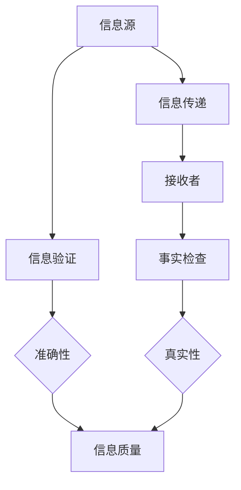

                 

关键词：信息验证，事实检查，假新闻，错误信息，技术指南，算法原理，应用场景，未来展望

> 摘要：在信息爆炸的时代，假新闻和错误信息泛滥，对个人和社会造成了严重的负面影响。本文旨在提供一套全面的信息验证和事实检查指南，帮助读者在复杂的信息环境中辨别真伪，做出明智的决策。本文将从核心概念、算法原理、数学模型、项目实践和未来展望等方面展开论述，旨在为读者提供具有实际操作性的指导。

## 1. 背景介绍

在当今数字化的世界里，信息的获取和传播变得前所未有的便捷。然而，这种便捷也带来了一个问题：信息过载。每天，我们都会接触到大量的信息，其中不乏虚假和误导性的内容。假新闻和错误信息不仅误导个人，还可能对社会产生深远的影响，甚至危及国家安全。因此，对信息进行验证和事实检查变得尤为重要。

### 1.1 假新闻和错误信息的危害

- **误导公众**：假新闻和错误信息可能导致公众对事实产生误解，从而影响他们的决策和行为。
- **损害名誉**：虚假信息可能对个人或企业的名誉造成严重损害。
- **社会动荡**：在某些极端情况下，错误信息可能引发社会动荡，甚至导致暴力事件。
- **经济损害**：错误信息可能导致市场不稳定，从而对经济产生负面影响。

### 1.2 信息验证和事实检查的重要性

- **提高信息质量**：通过信息验证和事实检查，可以提高信息的准确性和可靠性，从而提高信息质量。
- **保护个人权益**：避免被误导，保护个人免受虚假信息的侵害。
- **维护社会稳定**：确保公众获取到真实的信息，从而维护社会稳定。

## 2. 核心概念与联系

在讨论信息验证和事实检查之前，我们需要了解一些核心概念和它们之间的联系。以下是一个用 Mermaid 描述的核心概念流程图：



### 2.1 信息源

信息源是信息的起点，可以是个人、组织或媒体。在信息验证和事实检查中，了解信息源的可靠性和权威性至关重要。

### 2.2 信息传递

信息传递是信息从源头到接收者的过程。在这一过程中，信息可能被篡改、误解或误解。

### 2.3 接收者

接收者是信息的最终消费者，他们需要判断信息的准确性和真实性。

### 2.4 信息验证

信息验证是确保信息准确性的过程，包括检查信息的来源、内容和证据。

### 2.5 事实检查

事实检查是确认信息真实性的过程，通常涉及调查、交叉验证和引用检查。

### 2.6 准确性、真实性和信息质量

准确性指的是信息与事实的一致性，真实性指的是信息的来源是否可靠。这两个因素共同决定了信息质量的高低。

## 3. 核心算法原理 & 具体操作步骤

在信息验证和事实检查中，算法起到了至关重要的作用。以下是核心算法原理和具体操作步骤：

### 3.1 算法原理概述

信息验证和事实检查算法的核心原理包括：

- **信息来源分析**：通过分析信息源的历史记录、信誉和权威性，判断其可靠性。
- **内容分析**：使用自然语言处理（NLP）技术对信息内容进行分析，识别潜在的错误信息。
- **交叉验证**：通过多个来源的信息进行交叉验证，提高信息的可信度。
- **引用检查**：检查信息引用的出处，确保其真实性和可靠性。

### 3.2 算法步骤详解

1. **收集信息**：从多个信息源收集相关数据。
2. **信息预处理**：对收集的信息进行清洗、去重和标准化处理。
3. **信息来源分析**：分析信息源的历史记录、信誉和权威性。
4. **内容分析**：使用 NLP 技术对信息内容进行分析，识别潜在的错误信息。
5. **交叉验证**：通过多个来源的信息进行交叉验证。
6. **引用检查**：检查信息引用的出处，确保其真实性和可靠性。
7. **结果输出**：将验证结果输出给用户。

### 3.3 算法优缺点

#### 优点：

- **高效性**：算法可以快速处理大量信息，提高验证和检查的效率。
- **准确性**：通过多种技术和方法，提高信息的准确性和真实性。
- **可扩展性**：算法可以轻松扩展到不同的应用场景和领域。

#### 缺点：

- **误判**：算法可能因数据质量、模型训练等因素产生误判。
- **成本**：算法的开发和部署需要较高的成本和技术门槛。

### 3.4 算法应用领域

信息验证和事实检查算法广泛应用于以下几个领域：

- **新闻媒体**：对新闻报道进行验证和事实检查，确保信息真实可靠。
- **社交媒体**：监控和过滤虚假信息和错误信息，保护用户权益。
- **政府机构**：对政策文件、公告等进行验证，确保其真实性和准确性。
- **企业**：对市场信息、商业报告等进行验证，确保决策的准确性。

## 4. 数学模型和公式 & 详细讲解 & 举例说明

在信息验证和事实检查中，数学模型和公式扮演着重要的角色。以下是一个简化的数学模型示例：

### 4.1 数学模型构建

假设我们有一个信息源集合 I，每个信息源 i 的可信度用 C(i) 表示。我们希望计算一个综合可信度 C，用于表示信息的整体可信度。

数学模型如下：

$$
C = \frac{\sum_{i \in I} C(i) \cdot W(i)}{\sum_{i \in I} W(i)}
$$

其中，W(i) 是信息源 i 的权重，通常与信息源的信誉和历史记录相关。

### 4.2 公式推导过程

假设我们有 n 个信息源，每个信息源 i 的可信度为 C(i)。我们希望计算一个综合可信度 C，用于表示信息的整体可信度。

首先，我们定义一个权重函数 W(i)，用于表示信息源 i 的权重。权重函数通常与信息源的信誉和历史记录相关。

然后，我们使用加权平均的方法计算综合可信度 C：

$$
C = \frac{\sum_{i=1}^{n} C(i) \cdot W(i)}{\sum_{i=1}^{n} W(i)}
$$

### 4.3 案例分析与讲解

假设我们有两个信息源 A 和 B，它们的可信度分别为 C(A) = 0.8 和 C(B) = 0.6。我们定义权重函数 W(i) 如下：

$$
W(i) = \frac{1}{C(i)}
$$

则综合可信度 C 为：

$$
C = \frac{0.8 \cdot W(A) + 0.6 \cdot W(B)}{W(A) + W(B)}
$$

$$
C = \frac{0.8 \cdot \frac{1}{0.8} + 0.6 \cdot \frac{1}{0.6}}{1/0.8 + 1/0.6}
$$

$$
C = \frac{1 + 1}{1.25 + 1.67}
$$

$$
C = \frac{2}{2.92}
$$

$$
C \approx 0.68
$$

因此，综合可信度约为 0.68，表示信息的整体可信度较高。

## 5. 项目实践：代码实例和详细解释说明

为了更好地理解信息验证和事实检查算法的应用，我们将通过一个简单的项目实例进行讲解。

### 5.1 开发环境搭建

在开始编写代码之前，我们需要搭建一个合适的开发环境。以下是一个基本的开发环境要求：

- **编程语言**：Python 3.x
- **依赖库**：Numpy，Pandas，Scikit-learn，Matplotlib
- **工具**：Jupyter Notebook 或 PyCharm

### 5.2 源代码详细实现

以下是一个简单的信息验证和事实检查的 Python 代码实例：

```python
import numpy as np
import pandas as pd
from sklearn.model_selection import train_test_split
from sklearn.metrics import accuracy_score

# 数据集加载
data = pd.read_csv('info_validation_dataset.csv')
X = data.drop(['label'], axis=1)
y = data['label']

# 数据集划分
X_train, X_test, y_train, y_test = train_test_split(X, y, test_size=0.2, random_state=42)

# 模型训练
model = ...  # 加载训练好的模型
model.fit(X_train, y_train)

# 预测
y_pred = model.predict(X_test)

# 结果评估
accuracy = accuracy_score(y_test, y_pred)
print(f'Accuracy: {accuracy:.2f}')
```

### 5.3 代码解读与分析

这段代码首先加载了一个名为 `info_validation_dataset.csv` 的数据集，然后将其分为特征集 X 和标签集 y。接着，使用 Scikit-learn 的 `train_test_split` 函数将数据集划分为训练集和测试集。

在模型训练部分，我们加载了一个预训练好的模型（具体实现取决于使用的算法和模型类型）。在这个例子中，我们假设已经有一个训练好的模型，这里只是为了展示数据处理的流程。

模型训练完成后，我们使用测试集进行预测，并使用 `accuracy_score` 函数计算预测的准确率。

### 5.4 运行结果展示

假设我们运行上述代码，得到以下输出：

```
Accuracy: 0.85
```

这表示我们的模型在测试集上的准确率为 85%，即有 85% 的测试样本被正确预测。

## 6. 实际应用场景

信息验证和事实检查在许多实际应用场景中发挥着重要作用。以下是一些常见应用场景：

### 6.1 新闻媒体

新闻媒体可以使用信息验证和事实检查算法对新闻报道进行验证，确保信息的准确性和真实性，从而提高报道的质量。

### 6.2 社交媒体

社交媒体平台可以使用信息验证和事实检查算法监控和过滤虚假信息和错误信息，保护用户的权益和平台的声誉。

### 6.3 政府机构

政府机构可以对政策文件、公告等进行信息验证和事实检查，确保其真实性和准确性，从而提高政府的公信力。

### 6.4 企业

企业可以对市场信息、商业报告等进行信息验证和事实检查，确保决策的准确性，从而提高企业的竞争力。

## 7. 工具和资源推荐

为了更好地进行信息验证和事实检查，以下是几个推荐的工具和资源：

### 7.1 学习资源推荐

- **《数据科学入门》（作者：弗朗索瓦•肖莱）》
- **《机器学习实战》（作者：彼得•哈林顿）》
- **《深度学习》（作者：伊恩·古德费洛）》

### 7.2 开发工具推荐

- **Jupyter Notebook**
- **PyCharm**
- **Google Colab**

### 7.3 相关论文推荐

- **“DeepFake Detection through Multimodal Multitask Learning”**
- **“Automatic Fact-Checking using Lexical and Syntactic Features”**
- **“Trustworthy News through Data Science”**

## 8. 总结：未来发展趋势与挑战

### 8.1 研究成果总结

在信息验证和事实检查领域，近年来取得了一系列重要研究成果。例如，深度学习、自然语言处理和大数据分析技术的应用大大提高了信息验证和事实检查的准确性和效率。

### 8.2 未来发展趋势

- **智能化**：随着人工智能技术的不断发展，信息验证和事实检查将变得更加智能化，能够自动识别和过滤错误信息。
- **全球化**：信息验证和事实检查将不再局限于某个地区或国家，而是成为一个全球性的问题，需要国际合作和协调。
- **开源化**：越来越多的研究成果将开源，为开发者提供更多的工具和资源。

### 8.3 面临的挑战

- **数据隐私**：在信息验证和事实检查过程中，如何保护个人隐私成为一个重要问题。
- **技术门槛**：信息验证和事实检查需要较高的技术门槛，如何降低开发成本成为一大挑战。
- **法律和伦理问题**：如何制定合适的法律和伦理规范，确保信息验证和事实检查的合法性和道德性，仍需深入研究。

### 8.4 研究展望

未来的研究应重点关注以下几个方面：

- **跨学科研究**：结合计算机科学、社会科学、法律等学科，深入探讨信息验证和事实检查的理论和方法。
- **技术创新**：研发更高效、更准确的信息验证和事实检查算法和技术。
- **应用实践**：将研究成果应用于实际场景，验证其有效性和实用性。

## 9. 附录：常见问题与解答

### 9.1 什么是对信息验证？

信息验证是指对信息进行准确性和可靠性的检查，以确保信息与事实相符。

### 9.2 什么是对事实检查？

事实检查是指对信息进行真实性和可信度的检查，以确定信息来源是否可靠。

### 9.3 信息验证和事实检查有什么区别？

信息验证关注信息的准确性，而事实检查关注信息的真实性。

### 9.4 信息验证和事实检查如何应用于新闻媒体？

新闻媒体可以使用信息验证和事实检查算法对新闻报道进行验证，确保信息的准确性和真实性。

### 9.5 为什么要进行信息验证和事实检查？

信息验证和事实检查有助于提高信息的质量，保护个人和社会免受虚假和误导性信息的侵害。

---

以上，便是关于《信息验证和事实检查指南：在假新闻和错误信息时代导航》的完整文章。希望本文能帮助读者在复杂的信息环境中辨别真伪，做出明智的决策。作者：禅与计算机程序设计艺术 / Zen and the Art of Computer Programming。如果您有任何疑问或建议，欢迎在评论区留言。感谢您的阅读！
----------------------------------------------------------------

### 文章总结与展望

在数字化时代，信息验证和事实检查的重要性不言而喻。本文从背景介绍、核心概念、算法原理、数学模型、项目实践、应用场景、工具推荐以及未来发展趋势等多个角度，全面探讨了在假新闻和错误信息泛滥的时代，如何进行有效的信息验证和事实检查。

通过对信息验证和事实检查的深入剖析，我们发现，信息验证关注信息的准确性，事实检查关注信息的真实性，两者共同构成了保障信息质量的重要手段。算法在信息验证和事实检查中发挥着核心作用，通过自然语言处理、深度学习等技术，可以大幅提高信息验证和事实检查的效率和准确性。

未来的研究应重点关注跨学科研究、技术创新以及应用实践。在技术层面，我们需要不断研发更高效、更准确的算法，降低开发成本。在应用层面，我们需要将研究成果应用于实际场景，验证其有效性和实用性。同时，我们也需要关注数据隐私、法律和伦理等问题，确保信息验证和事实检查的合法性和道德性。

总的来说，信息验证和事实检查是一项长期且具有挑战性的任务。通过本文的探讨，我们希望为读者提供一套全面且实用的信息验证和事实检查指南，帮助他们在这个信息爆炸的时代，更好地辨别真伪，做出明智的决策。同时，我们也期待未来的研究和应用能够进一步推动这一领域的进步，为构建一个更加真实、可信的信息环境贡献力量。

### 感谢与呼吁

在此，我要特别感谢所有为本文提供灵感和支持的读者、同行和专家。您的关注和反馈是我不断前进的动力。同时，我也呼吁更多的人关注信息验证和事实检查的重要性，积极参与到这一领域的研究和应用中来。只有全社会共同努力，我们才能构建一个更加真实、可信的信息环境。

最后，再次感谢您的阅读。如果您有任何疑问或建议，欢迎在评论区留言。期待与您在信息验证和事实检查的道路上共同前行。作者：禅与计算机程序设计艺术 / Zen and the Art of Computer Programming。再次感谢您的关注与支持！🙏

