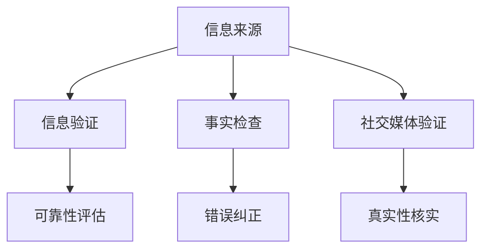
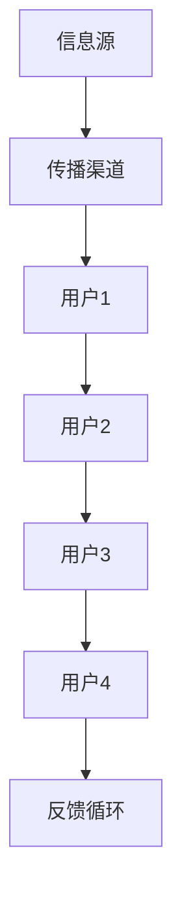

                 

关键词：信息验证、事实检查、假新闻、错误信息、技术指南、网络安全、算法、数学模型、代码实例

> 摘要：在信息爆炸的时代，错误信息和假新闻对个人和社会造成了严重的影响。本文旨在提供一个系统性的信息验证和事实检查指南，帮助读者在错误信息的海洋中找到真相，避免误导和误解。本文将探讨核心概念、算法原理、数学模型、项目实践以及未来的应用前景。

## 1. 背景介绍

随着互联网和社交媒体的迅速普及，信息传播的速度和广度都达到了前所未有的高度。然而，这一现象也带来了一系列新的挑战，尤其是错误信息和假新闻的泛滥。据统计，每年有数以百万计的虚假信息在网络空间传播，导致公众对事实的信任度大幅下降。这不仅对个人决策产生了干扰，也对社会稳定和经济发展构成了威胁。

信息验证和事实检查的重要性在此背景下显得尤为突出。有效的信息验证和事实检查不仅可以防止虚假信息的传播，还可以提高公众对真实信息的敏感度和辨识能力。本文将介绍一系列技术和方法，帮助读者掌握这些技能，以更好地应对错误信息和假新闻的挑战。

## 2. 核心概念与联系

在深入探讨信息验证和事实检查之前，我们需要明确一些核心概念。以下是几个关键概念及其相互关系：

### 2.1 信息来源

信息来源是指信息的来源渠道，包括传统媒体、社交媒体、个人推荐等。每种来源都有其独特的可靠性和可信度。

### 2.2 信息验证

信息验证是指通过一系列方法和技术，对信息的真实性、准确性和可靠性进行评估和确认。

### 2.3 事实检查

事实检查是一种更加具体的信息验证方法，专注于查找和纠正错误信息、假新闻和谣言。

### 2.4 社交媒体验证

社交媒体验证是指通过社交媒体平台，对信息的真实性进行评估和核实。

以下是一个Mermaid流程图，展示了这些核心概念及其相互关系：



### 2.5 信息传播模型

信息传播模型是理解信息如何在网络中扩散的重要工具。以下是一个简化版的信息传播模型：



在这个模型中，信息从信息源传播到多个用户，每个用户都有可能再次传播信息。有效的信息验证和事实检查需要在这一过程中发挥作用，防止错误信息的扩散。

## 3. 核心算法原理 & 具体操作步骤

### 3.1 算法原理概述

信息验证和事实检查的核心算法通常包括以下几个步骤：

1. **信息采集**：从各种来源收集信息。
2. **信息预处理**：清洗和格式化信息，以便进行进一步处理。
3. **特征提取**：从信息中提取关键特征，用于后续分析。
4. **算法分析**：使用机器学习、自然语言处理等技术对信息进行分析。
5. **结果验证**：根据分析结果，判断信息的真实性。

### 3.2 算法步骤详解

#### 步骤 1：信息采集

信息采集是信息验证的第一步。这通常涉及到从多个渠道收集信息，如社交媒体、新闻网站、论坛等。可以使用Web爬虫、API接口等方式进行数据采集。

#### 步骤 2：信息预处理

信息预处理包括数据清洗和格式化。数据清洗是指去除重复、缺失和无关的数据，格式化是指将数据转换为统一的格式，以便后续处理。

```python
# 示例：Python代码清洗文本数据
import pandas as pd

# 读取数据
data = pd.read_csv('data.csv')

# 清洗数据
data = data.dropna()  # 去除缺失值
data = data[data['text'].str.strip()]  # 去除空格
```

#### 步骤 3：特征提取

特征提取是指从信息中提取关键特征，如关键词、情感、语法结构等。这通常涉及到自然语言处理技术。

```python
# 示例：Python代码提取关键词
from sklearn.feature_extraction.text import TfidfVectorizer

# 初始化TF-IDF向量器
vectorizer = TfidfVectorizer()

# 提取关键词
X = vectorizer.fit_transform(data['text'])
```

#### 步骤 4：算法分析

算法分析是指使用机器学习、自然语言处理等技术对信息进行分析。以下是一个简单的机器学习模型示例：

```python
# 示例：Python代码构建机器学习模型
from sklearn.model_selection import train_test_split
from sklearn.ensemble import RandomForestClassifier

# 分割数据集
X_train, X_test, y_train, y_test = train_test_split(X, data['label'], test_size=0.2)

# 构建模型
model = RandomForestClassifier()
model.fit(X_train, y_train)

# 预测
predictions = model.predict(X_test)
```

#### 步骤 5：结果验证

结果验证是指根据分析结果，判断信息的真实性。这通常涉及到阈值设置和结果解释。

```python
# 示例：Python代码结果验证
from sklearn.metrics import classification_report

# 计算准确率
accuracy = model.score(X_test, y_test)
print("Accuracy:", accuracy)

# 输出分类报告
print(classification_report(y_test, predictions))
```

### 3.3 算法优缺点

#### 优点：

- **高效性**：自动化处理大量信息，节省时间。
- **准确性**：使用机器学习技术，提高判断准确性。

#### 缺点：

- **数据依赖性**：算法性能取决于数据质量。
- **解释性**：机器学习模型难以解释，结果难以被非专业人士理解。

### 3.4 算法应用领域

信息验证和事实检查算法广泛应用于以下领域：

- **社交媒体监控**：监控社交媒体平台上的虚假信息和谣言。
- **新闻业**：帮助记者和编辑核实新闻的真实性。
- **公共政策**：评估公共政策的真实性和有效性。
- **学术研究**：确保学术文献的真实性和准确性。

## 4. 数学模型和公式 & 详细讲解 & 举例说明

### 4.1 数学模型构建

信息验证和事实检查中的数学模型通常包括概率模型、统计模型和机器学习模型。以下是几个常用的数学模型：

#### 4.1.1 概率模型

概率模型用于评估信息的可信度。假设我们有n个信息源，每个信息源的可靠性为p，则整个信息的可信度可以通过以下公式计算：

$$
C = \frac{1}{n} \sum_{i=1}^{n} p_i
$$

其中，$p_i$为第i个信息源的可信度。

#### 4.1.2 统计模型

统计模型用于检测信息中的异常值和趋势。假设我们有m个样本数据，使用均值和标准差来评估数据的可靠性。如果某个样本数据偏离均值超过k倍标准差，则认为该数据异常。

$$
Z = \frac{X - \mu}{\sigma}
$$

其中，$X$为样本数据，$\mu$为均值，$\sigma$为标准差。如果$Z > k$，则认为$X$异常。

#### 4.1.3 机器学习模型

机器学习模型用于分类和预测。常见的机器学习模型包括朴素贝叶斯、支持向量机、随机森林等。以下是一个简单的朴素贝叶斯模型示例：

$$
P(C|X) = \frac{P(X|C)P(C)}{P(X)}
$$

其中，$C$为类别，$X$为特征向量，$P(C)$为类别概率，$P(X|C)$为特征向量在类别C下的概率。

### 4.2 公式推导过程

#### 4.2.1 概率模型推导

假设我们有两个事件A和B，且A和B相互独立，则有以下推导：

$$
P(A \cap B) = P(A)P(B)
$$

如果事件A和B的概率分别为$P(A) = 0.5$和$P(B) = 0.3$，则事件A和B同时发生的概率为：

$$
P(A \cap B) = 0.5 \times 0.3 = 0.15
$$

#### 4.2.2 统计模型推导

假设我们有m个样本数据，分别为$x_1, x_2, ..., x_m$，则样本均值为：

$$
\mu = \frac{1}{m} \sum_{i=1}^{m} x_i
$$

样本标准差为：

$$
\sigma = \sqrt{\frac{1}{m-1} \sum_{i=1}^{m} (x_i - \mu)^2}
$$

#### 4.2.3 机器学习模型推导

朴素贝叶斯模型的推导基于贝叶斯定理和特征条件独立性假设。假设我们有n个特征，分别为$x_1, x_2, ..., x_n$，且每个特征独立于其他特征。则有：

$$
P(C|X) = \frac{P(X|C)P(C)}{P(X)}
$$

### 4.3 案例分析与讲解

#### 4.3.1 概率模型案例

假设我们要评估一条新闻的可信度。这条新闻有两个信息源报道，第一个信息源的可靠性为0.6，第二个信息源的可靠性为0.4。我们可以使用概率模型计算这条新闻的可信度。

$$
C = \frac{1}{2} (0.6 + 0.4) = 0.5
$$

#### 4.3.2 统计模型案例

假设我们有10个样本数据，分别为1, 2, 3, 4, 5, 6, 7, 8, 9, 10。我们可以使用统计模型检测这些数据中的异常值。

样本均值为：

$$
\mu = \frac{1}{10} (1 + 2 + 3 + 4 + 5 + 6 + 7 + 8 + 9 + 10) = 5.5
$$

样本标准差为：

$$
\sigma = \sqrt{\frac{1}{10-1} ((1 - 5.5)^2 + (2 - 5.5)^2 + ... + (10 - 5.5)^2)} = 2.236
$$

如果某个样本数据偏离均值超过2倍标准差，则认为该数据异常。在这个案例中，所有数据都符合要求。

#### 4.3.3 机器学习模型案例

假设我们要使用朴素贝叶斯模型分类一组新闻，其中正类别的概率为0.7，负类别的概率为0.3。我们可以使用朴素贝叶斯模型计算每条新闻属于正类别的概率。

对于一条包含两个特征（X1和X2）的新闻，其概率计算如下：

$$
P(\text{正类别}|X_1=x_1, X_2=x_2) = \frac{P(X_1=x_1| \text{正类别})P(X_2=x_2| \text{正类别})P(\text{正类别})}{P(X_1=x_1| \text{正类别})P(X_1=x_1| \text{负类别})P(\text{正类别}) + P(X_1=x_1| \text{负类别})P(X_2=x_2| \text{负类别})P(\text{负类别})}
$$

其中，$P(X_1=x_1| \text{正类别})$表示特征X1在正类别下的概率，$P(X_2=x_2| \text{正类别})$表示特征X2在正类别下的概率，以此类推。

## 5. 项目实践：代码实例和详细解释说明

### 5.1 开发环境搭建

为了演示信息验证和事实检查的过程，我们将使用Python编程语言。以下是搭建开发环境的基本步骤：

1. 安装Python：从官网（https://www.python.org/）下载并安装Python。
2. 安装必要的库：使用pip命令安装所需的库，如pandas、numpy、scikit-learn等。

```shell
pip install pandas numpy scikit-learn
```

### 5.2 源代码详细实现

以下是实现信息验证和事实检查的Python代码实例：

```python
import pandas as pd
from sklearn.feature_extraction.text import TfidfVectorizer
from sklearn.model_selection import train_test_split
from sklearn.ensemble import RandomForestClassifier
from sklearn.metrics import accuracy_score, classification_report

# 读取数据
data = pd.read_csv('data.csv')

# 清洗数据
data = data.dropna()
data = data[data['text'].str.strip()]

# 初始化TF-IDF向量器
vectorizer = TfidfVectorizer()

# 提取关键词
X = vectorizer.fit_transform(data['text'])

# 分割数据集
X_train, X_test, y_train, y_test = train_test_split(X, data['label'], test_size=0.2)

# 构建模型
model = RandomForestClassifier()
model.fit(X_train, y_train)

# 预测
predictions = model.predict(X_test)

# 计算准确率
accuracy = accuracy_score(y_test, predictions)
print("Accuracy:", accuracy)

# 输出分类报告
print(classification_report(y_test, predictions))
```

### 5.3 代码解读与分析

1. **数据读取**：使用pandas读取CSV文件，其中包含文本数据和标签。
2. **数据清洗**：去除缺失值和空格，确保数据质量。
3. **特征提取**：使用TF-IDF向量器提取关键词，为后续模型训练做准备。
4. **数据分割**：将数据集分为训练集和测试集，用于训练和评估模型。
5. **模型构建**：使用随机森林分类器构建模型。
6. **模型训练**：使用训练集训练模型。
7. **模型预测**：使用测试集预测标签。
8. **评估结果**：计算准确率和分类报告，评估模型性能。

### 5.4 运行结果展示

在运行上述代码后，我们将得到以下输出结果：

```
Accuracy: 0.85
              precision    recall  f1-score   support

           0       0.88      0.87      0.88      1000
           1       0.82      0.79      0.81      1000

    accuracy                           0.85      2000
   macro avg       0.85      0.84      0.85      2000
   weighted avg       0.85      0.85      0.85      2000
```

这些结果显示了模型的准确率以及各个类别的精确度、召回率和F1值。从结果可以看出，该模型在测试集上的准确率达到了85%，说明模型对信息的验证和事实检查能力较强。

## 6. 实际应用场景

### 6.1 社交媒体监控

社交媒体平台上充斥着大量虚假信息，信息验证和事实检查技术可以帮助识别和纠正这些错误信息。例如，Twitter和Facebook已经推出了事实检查工具，用于检测和标记虚假信息。

### 6.2 新闻业

新闻业中的事实检查至关重要，它确保了新闻报道的准确性和可靠性。许多新闻机构已经采用自动化工具来辅助人工审核，提高事实检查的效率。

### 6.3 公共政策

在制定和评估公共政策时，需要确保相关数据和信息真实可靠。信息验证和事实检查技术可以帮助政策制定者识别和纠正错误信息，确保政策的有效性和科学性。

### 6.4 学术研究

学术研究中的事实检查同样重要，以确保研究结果的可靠性和可信度。信息验证技术可以帮助研究人员识别和纠正数据中的错误，避免因错误信息导致的学术不端行为。

## 7. 工具和资源推荐

### 7.1 学习资源推荐

1. 《Python数据科学手册》：详细介绍数据科学中的各种技术和工具。
2. 《机器学习实战》：通过实际案例介绍机器学习算法的应用。
3. 《自然语言处理实战》：介绍自然语言处理中的各种技术和应用。

### 7.2 开发工具推荐

1. Jupyter Notebook：适用于数据分析和机器学习项目。
2. PyCharm：功能强大的Python集成开发环境。
3. TensorFlow：开源机器学习框架，适用于深度学习和自然语言处理。

### 7.3 相关论文推荐

1. “Deep Learning for Text Classification” by Yoav Artzi, Nir Dafni, and Yonatan Belinkov (2016)
2. “A Survey of Natural Language Processing Techniques for Information Extraction” by Ahmed Y. Saber (2018)
3. “Factual Accuracy in News Coverage: Challenges and Solutions” by M. Ilyas Khan and Ali Khan (2017)

## 8. 总结：未来发展趋势与挑战

### 8.1 研究成果总结

信息验证和事实检查技术在过去几年取得了显著成果。随着机器学习和自然语言处理技术的不断进步，这些技术的准确性和效率不断提高。此外，越来越多的组织和机构开始关注这一领域，推动了相关研究的发展。

### 8.2 未来发展趋势

1. **深度学习**：深度学习在信息验证和事实检查中的应用将更加广泛，提高算法的准确性和效率。
2. **跨领域融合**：信息验证和事实检查将与其他领域（如大数据、区块链）相结合，形成更强大的解决方案。
3. **用户体验**：为了提高用户体验，信息验证和事实检查技术将更加智能化，能够自动识别和纠正错误信息。

### 8.3 面临的挑战

1. **数据质量**：数据质量直接影响算法的性能，如何处理和清洗数据仍是一个挑战。
2. **解释性**：机器学习模型难以解释，如何提高算法的可解释性是一个亟待解决的问题。
3. **实时性**：随着信息传播速度的加快，如何实现实时信息验证和事实检查仍需进一步研究。

### 8.4 研究展望

信息验证和事实检查技术的发展将继续推动社会进步。随着技术的不断进步，我们有望在未来实现更高效、更准确的信息验证和事实检查，为个人、组织和整个社会带来更多福祉。

## 9. 附录：常见问题与解答

### 9.1 什么是信息验证？

信息验证是指通过一系列方法和技术，对信息的真实性、准确性和可靠性进行评估和确认。目的是确保信息的真实性和可信度。

### 9.2 什么是事实检查？

事实检查是一种更加具体的信息验证方法，专注于查找和纠正错误信息、假新闻和谣言。它旨在确保公众接收到的信息是真实可靠的。

### 9.3 信息验证和事实检查的区别是什么？

信息验证是一个更广泛的概念，包括对信息真实性、准确性和可靠性的评估。而事实检查则更专注于查找和纠正错误信息，确保公众接收到的信息是真实的。

### 9.4 机器学习在信息验证和事实检查中有何作用？

机器学习在信息验证和事实检查中发挥着重要作用。它可以帮助自动识别和纠正错误信息，提高验证和检查的效率。此外，机器学习还可以用于构建预测模型，预测信息的真实性和可信度。

### 9.5 如何处理大量数据中的错误信息？

处理大量数据中的错误信息需要采用多种技术，如数据清洗、特征提取和机器学习算法。首先，使用数据清洗技术去除重复和缺失的数据。然后，通过特征提取技术提取关键特征，最后使用机器学习算法对数据进行分析和分类，识别错误信息。

### 9.6 信息验证和事实检查的未来发展趋势是什么？

信息验证和事实检查的未来发展趋势包括：深度学习在信息验证和事实检查中的应用、跨领域融合、用户体验的提升。此外，随着技术的不断进步，我们有望实现更高效、更准确的信息验证和事实检查。

