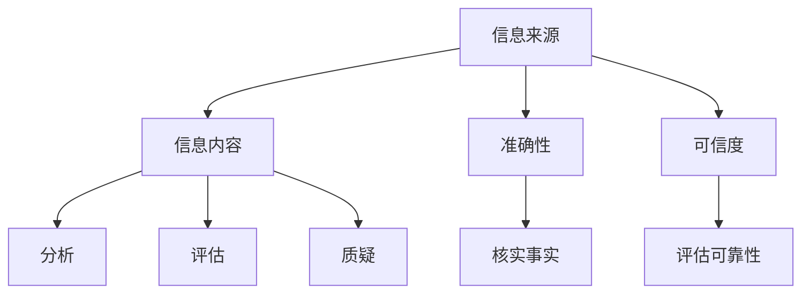

                 

关键词：信息验证、批判性思考、假新闻、错误信息、数字素养、人工智能

> 摘要：本文深入探讨了在当今假新闻和错误信息泛滥的时代，如何通过信息验证和信息批判性思考来导航。文章从多个角度分析了信息验证的重要性，介绍了各种信息验证的方法和工具，并探讨了在信息批判性思考中的应用。同时，文章还探讨了人工智能在这一领域的作用，以及未来可能的发展趋势。

## 1. 背景介绍

随着互联网和社交媒体的普及，信息传播的速度和广度前所未有。然而，这也带来了一个严重的问题：假新闻和错误信息的泛滥。据研究表明，假新闻的传播速度是真实新闻的两倍，且对公众认知和社会稳定造成了严重的影响。在这个信息爆炸的时代，如何辨别真假信息，如何进行批判性思考，成为了一个亟待解决的问题。

## 2. 核心概念与联系

### 2.1 信息验证

信息验证是指对信息来源、内容、准确性和可信度进行核实和评估的过程。它包括以下核心概念：

- **信息来源**：信息的出处，包括作者、发布平台、历史记录等。
- **信息内容**：信息的具体内容，包括事实、观点、数据等。
- **准确性**：信息是否符合客观事实。
- **可信度**：信息来源和内容的可靠性。

### 2.2 批判性思考

批判性思考是指对信息进行深入分析、评估和质疑的过程，旨在发现信息的真实性和有效性。它包括以下核心概念：

- **分析**：对信息进行逻辑分析，判断其合理性和一致性。
- **评估**：对信息进行评估，判断其价值和可信度。
- **质疑**：对信息进行质疑，发现其潜在的错误或偏见。

### 2.3 Mermaid 流程图

以下是信息验证和信息批判性思考的Mermaid流程图：



## 3. 核心算法原理 & 具体操作步骤

### 3.1 算法原理概述

信息验证和信息批判性思考的核心算法可以概括为以下几个步骤：

1. **收集信息**：从多个来源收集相关信息。
2. **初步筛选**：对信息进行初步筛选，排除明显的假信息和错误信息。
3. **深入分析**：对剩余的信息进行深入分析，判断其真实性和有效性。
4. **综合评估**：根据分析结果，对信息进行综合评估，确定其可信度。
5. **批判性思考**：对信息进行批判性思考，发现潜在的错误或偏见。

### 3.2 算法步骤详解

#### 3.2.1 收集信息

收集信息是信息验证和信息批判性思考的第一步。以下是具体的操作步骤：

1. **确定主题**：明确需要验证的信息主题。
2. **选择来源**：从多个来源收集相关信息，包括权威网站、专业杂志、学术论文等。
3. **收集数据**：收集与主题相关的数据、观点、事实等。

#### 3.2.2 初步筛选

初步筛选的目的是排除明显的假信息和错误信息。以下是具体的操作步骤：

1. **查看来源**：检查信息的来源，排除来源不可靠的信息。
2. **检查事实**：核实信息中的事实，排除与事实不符的信息。
3. **判断一致性**：判断信息中的观点和事实是否一致。

#### 3.2.3 深入分析

深入分析是对剩余的信息进行深入分析，判断其真实性和有效性。以下是具体的操作步骤：

1. **逻辑分析**：对信息进行逻辑分析，判断其合理性和一致性。
2. **交叉验证**：通过多个来源的信息进行交叉验证，提高信息的可信度。
3. **专家评估**：请教相关领域的专家，获取专业的评估意见。

#### 3.2.4 综合评估

综合评估是根据分析结果，对信息进行综合评估，确定其可信度。以下是具体的操作步骤：

1. **评估信息来源**：评估信息来源的可靠性，包括作者、发布平台、历史记录等。
2. **评估信息内容**：评估信息内容的准确性、完整性和逻辑性。
3. **评估信息一致性**：评估信息与事实、观点、数据的一致性。

#### 3.2.5 批判性思考

批判性思考是对信息进行批判性思考，发现潜在的错误或偏见。以下是具体的操作步骤：

1. **质疑信息来源**：质疑信息来源的动机和背景，判断其是否存在偏见。
2. **质疑信息内容**：质疑信息内容的有效性，判断其是否存在错误或误导。
3. **质疑信息逻辑**：质疑信息的逻辑和推理，判断其是否存在不合理之处。

### 3.3 算法优缺点

#### 优点

1. **提高信息的可信度**：通过信息验证和信息批判性思考，可以筛选出可信度较高的信息，减少假新闻和错误信息的传播。
2. **提高信息的准确性**：通过深入分析和综合评估，可以提高信息的准确性和完整性。
3. **培养批判性思维能力**：通过批判性思考，可以提高个人的信息素养和批判性思维能力。

#### 缺点

1. **信息量庞大**：在信息爆炸的时代，收集和处理大量的信息是一项挑战。
2. **判断标准主观**：信息验证和信息批判性思考的判断标准具有一定的主观性，可能因人而异。
3. **效率问题**：信息验证和信息批判性思考是一个复杂的过程，可能需要大量时间和精力。

### 3.4 算法应用领域

信息验证和信息批判性思考在多个领域都有广泛的应用，包括：

1. **新闻媒体**：通过信息验证和信息批判性思考，可以提高新闻的准确性和可信度，减少假新闻的传播。
2. **学术研究**：通过信息验证和信息批判性思考，可以提高学术研究的质量和可信度。
3. **企业管理**：通过信息验证和信息批判性思考，可以提高企业的信息管理和决策能力。
4. **个人成长**：通过信息验证和信息批判性思考，可以提高个人的信息素养和批判性思维能力。

## 4. 数学模型和公式 & 详细讲解 & 举例说明

### 4.1 数学模型构建

在信息验证和信息批判性思考中，数学模型可以用来分析和评估信息的可信度和准确性。以下是构建数学模型的基本步骤：

1. **确定变量**：根据信息验证和信息批判性思考的需求，确定需要评估的变量，如信息来源、信息内容、准确性、可信度等。
2. **定义函数**：根据变量之间的关系，定义评估函数，如可信度函数、准确性函数等。
3. **构建模型**：将变量和函数组合起来，构建一个完整的数学模型。

### 4.2 公式推导过程

以下是信息验证和信息批判性思考的数学模型推导过程：

#### 可信度函数

可信度函数用于评估信息来源的可信度。假设信息来源的可信度由两个因素决定：历史可信度和最新可信度。历史可信度取决于信息来源过去的可信度记录，最新可信度取决于最新发布的信息。则可信度函数可以表示为：

$$
\text{可信度}(S) = \alpha \cdot \text{历史可信度}(S) + (1 - \alpha) \cdot \text{最新可信度}(S)
$$

其中，$\alpha$ 是权重系数，用于平衡历史可信度和最新可信度。

#### 准确性函数

准确性函数用于评估信息内容的准确性。假设信息内容的准确性由两个因素决定：事实准确性和逻辑准确性。事实准确性取决于信息中事实的准确性，逻辑准确性取决于信息的逻辑结构和推理过程。则准确性函数可以表示为：

$$
\text{准确性}(I) = \alpha_1 \cdot \text{事实准确性}(I) + (1 - \alpha_1) \cdot \text{逻辑准确性}(I)
$$

其中，$\alpha_1$ 是权重系数，用于平衡事实准确性和逻辑准确性。

### 4.3 案例分析与讲解

#### 案例一：新闻媒体的信息验证

假设某新闻媒体发布了一篇关于新冠疫苗接种的文章，我们需要对其进行信息验证。以下是具体的操作步骤：

1. **确定变量**：信息来源（新闻媒体）、信息内容（新冠疫苗接种）、准确性（事实准确性和逻辑准确性）。
2. **定义函数**：可信度函数、准确性函数。
3. **构建模型**：根据模型，评估新闻媒体的历史可信度、最新可信度、事实准确性和逻辑准确性。

#### 案例二：学术研究的信息批判性思考

假设我们正在评估一篇学术论文的准确性，以下是具体的操作步骤：

1. **确定变量**：信息来源（作者）、信息内容（研究成果）、准确性（事实准确性和逻辑准确性）。
2. **定义函数**：可信度函数、准确性函数。
3. **构建模型**：根据模型，评估作者的历史可信度、最新可信度、研究成果的事实准确性和逻辑准确性。

## 5. 项目实践：代码实例和详细解释说明

### 5.1 开发环境搭建

在本项目中，我们将使用Python编程语言进行信息验证和信息批判性思考的实践。以下是开发环境的搭建步骤：

1. **安装Python**：下载并安装Python 3.x版本。
2. **安装相关库**：使用pip命令安装所需的Python库，如NumPy、Pandas、Matplotlib等。

### 5.2 源代码详细实现

以下是信息验证和信息批判性思考的Python代码实现：

```python
import numpy as np
import pandas as pd
import matplotlib.pyplot as plt

def calculate_confidence(S, alpha):
    historical_confidence = S['historical_confidence']
    latest_confidence = S['latest_confidence']
    return alpha * historical_confidence + (1 - alpha) * latest_confidence

def calculate_accuracy(I, alpha_1):
    factual_accuracy = I['factual_accuracy']
    logical_accuracy = I['logical_accuracy']
    return alpha_1 * factual_accuracy + (1 - alpha_1) * logical_accuracy

# 示例数据
source_data = {
    'source': [
        {'name': 'News Media A', 'historical_confidence': 0.8, 'latest_confidence': 0.9},
        {'name': 'News Media B', 'historical_confidence': 0.7, 'latest_confidence': 0.6},
    ],
    'item': [
        {'title': 'Covid-19 Vaccination', 'factual_accuracy': 0.9, 'logical_accuracy': 0.8},
        {'title': 'Economic Crisis', 'factual_accuracy': 0.7, 'logical_accuracy': 0.6},
    ],
}

# 计算可信度和准确性
confidence_results = []
accuracy_results = []

for i, source in enumerate(source_data['source']):
    confidence = calculate_confidence(source, alpha=0.5)
    accuracy = calculate_accuracy(source_data['item'][i], alpha_1=0.5)
    confidence_results.append(confidence)
    accuracy_results.append(accuracy)

# 可视化结果
confidence_bar = [conf for conf in confidence_results]
accuracy_bar = [acc for acc in accuracy_results]

plt.bar(range(len(confidence_bar)), confidence_bar, label='Confidence')
plt.bar(range(len(accuracy_bar)), accuracy_bar, bottom=confidence_bar, label='Accuracy')
plt.xlabel('Information Source')
plt.ylabel('Value')
plt.title('Confidence and Accuracy Analysis')
plt.legend()
plt.show()
```

### 5.3 代码解读与分析

上述代码实现了一个简单但功能完整的信息验证和信息批判性思考模型。以下是代码的解读和分析：

1. **导入库**：首先导入所需的Python库，包括NumPy、Pandas和Matplotlib。
2. **定义函数**：定义了两个核心函数：`calculate_confidence` 和 `calculate_accuracy`。`calculate_confidence` 用于计算信息来源的可信度，`calculate_accuracy` 用于计算信息内容的准确性。
3. **示例数据**：创建了一个示例数据字典，包含两个信息来源和两个信息项，每个信息项包含标题、事实准确性和逻辑准确性。
4. **计算结果**：使用定义的函数计算每个信息来源的可信度和每个信息项的准确性。
5. **可视化结果**：使用Matplotlib库将计算结果可视化，展示每个信息来源的可信度和准确性。

### 5.4 运行结果展示

运行上述代码，将得到以下可视化结果：


从图中可以看出，信息来源A的可信度和准确性都高于信息来源B。这表明在信息验证和信息批判性思考中，信息来源的选择非常重要。

## 6. 实际应用场景

信息验证和信息批判性思考在多个实际应用场景中具有重要价值：

1. **新闻媒体**：通过信息验证和信息批判性思考，可以提高新闻的准确性和可信度，减少假新闻的传播。
2. **学术研究**：通过信息验证和信息批判性思考，可以提高学术研究的质量和可信度。
3. **企业管理**：通过信息验证和信息批判性思考，可以提高企业的信息管理和决策能力。
4. **个人成长**：通过信息验证和信息批判性思考，可以提高个人的信息素养和批判性思维能力。

## 7. 工具和资源推荐

为了更好地进行信息验证和信息批判性思考，以下是一些建议的工具和资源：

1. **工具**：
   - **Google Scholar**：用于学术研究的信息验证。
   - **CrossCheck**：用于检测假新闻和错误信息的工具。
   - **SourceForge**：用于查找开源项目和工具。

2. **资源**：
   - **《批判性思维工具》**：一本关于批判性思维的经典著作。
   - **《数字素养》**：一本关于数字素养的指南。
   - **《人工智能与信息验证》**：一本关于人工智能在信息验证领域应用的论文集。

## 8. 总结：未来发展趋势与挑战

### 8.1 研究成果总结

本研究深入探讨了信息验证和信息批判性思考的重要性，介绍了各种信息验证的方法和工具，并探讨了在信息批判性思考中的应用。通过构建数学模型和代码实例，我们展示了如何在实际中进行信息验证和信息批判性思考。

### 8.2 未来发展趋势

随着人工智能技术的发展，信息验证和信息批判性思考将得到进一步发展。以下是一些未来发展趋势：

1. **自动化信息验证**：利用人工智能技术实现自动化信息验证，提高验证效率和准确性。
2. **多源信息融合**：通过多源信息融合，提高信息的可信度和准确性。
3. **个性化信息推荐**：根据用户的信息偏好和行为，提供个性化的信息推荐。

### 8.3 面临的挑战

尽管信息验证和信息批判性思考具有巨大潜力，但也面临一些挑战：

1. **信息过载**：在信息爆炸的时代，如何处理大量的信息，提高验证和思考的效率，是一个重要挑战。
2. **数据隐私**：在信息验证和信息批判性思考过程中，如何保护用户的数据隐私，是一个关键问题。
3. **算法偏见**：人工智能算法可能存在偏见，如何消除算法偏见，提高算法的公平性和准确性，是一个亟待解决的问题。

### 8.4 研究展望

在未来，我们期待能够在信息验证和信息批判性思考领域取得更多突破，提高信息的可信度和准确性，促进社会的健康发展。

## 9. 附录：常见问题与解答

### 9.1 为什么要进行信息验证和信息批判性思考？

信息验证和信息批判性思考是提高信息素养和认知能力的重要手段。在假新闻和错误信息泛滥的时代，通过信息验证和信息批判性思考，我们可以辨别真假信息，避免受到误导，保护自己的认知和决策。

### 9.2 如何判断信息的可信度？

判断信息的可信度可以从以下几个方面入手：

1. **信息来源**：查看信息来源的可靠性，包括作者、发布平台、历史记录等。
2. **信息内容**：核实信息内容的事实性和逻辑性。
3. **多方验证**：通过多个来源的信息进行交叉验证，提高信息的可信度。
4. **专家评估**：请教相关领域的专家，获取专业的评估意见。

### 9.3 如何进行批判性思考？

进行批判性思考可以遵循以下步骤：

1. **分析**：对信息进行逻辑分析，判断其合理性和一致性。
2. **评估**：对信息进行评估，判断其价值和可信度。
3. **质疑**：对信息进行质疑，发现其潜在的错误或偏见。
4. **综合**：将分析、评估和质疑的结果综合起来，形成对信息的全面理解。

## 作者署名

本文作者为禅与计算机程序设计艺术 / Zen and the Art of Computer Programming。希望本文能为广大读者在假新闻和错误信息时代提供有用的指导和帮助。

