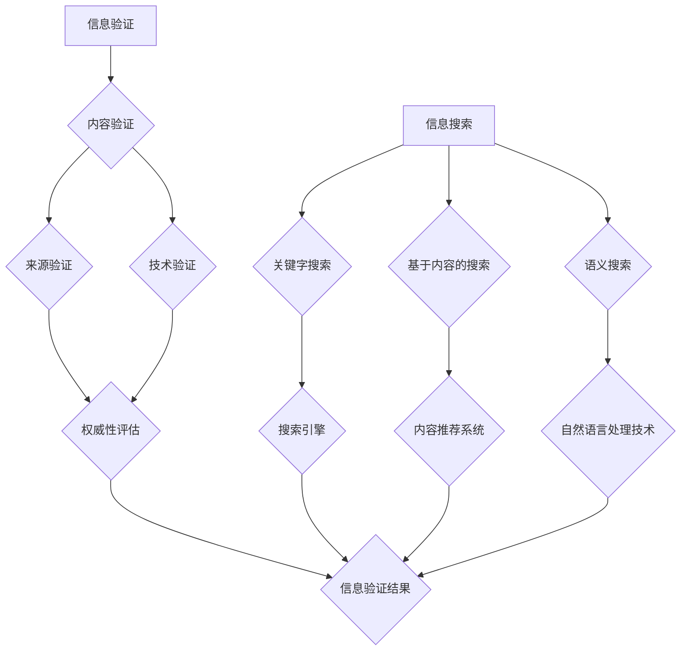

                 

关键词：信息验证、信息搜索、可靠信息、价值信息、实践、技术

> 摘要：本文旨在探讨信息验证和信息搜索技术在现代社会的重要性，通过对这些技术的原理、方法、应用场景以及未来展望的深入分析，帮助读者在信息的海洋中找到可靠、有价值的信息。

## 1. 背景介绍

随着互联网和数字技术的迅猛发展，信息爆炸成为当今世界的一个显著特征。大量的信息充斥在我们的生活中，这使得信息的获取变得越来越容易，但同时也带来了信息过载的问题。在如此庞大的信息海洋中，如何找到可靠、有价值的信息，成为许多人在日常生活、学习和工作中面临的一个严峻挑战。

信息验证和信息搜索技术正是为了解决这一挑战而诞生和发展的。信息验证技术旨在确保信息的真实性和准确性，防止虚假信息和误导信息的传播。信息搜索技术则通过有效的算法和策略，帮助用户快速、准确地找到所需的信息。

本文将首先介绍信息验证和信息搜索技术的核心概念，然后深入探讨这些技术的原理、方法、应用场景以及未来展望。希望通过本文的探讨，读者能够更加清晰地理解这些技术，并能够将其应用于实际生活中，找到可靠、有价值的信息。

## 2. 核心概念与联系

### 2.1 信息验证

信息验证是指通过各种手段和方法，对信息的真实性和准确性进行确认和验证的过程。在互联网时代，信息验证变得尤为重要，因为互联网上的信息量大且来源广泛，其中不乏虚假、不准确或误导性的信息。信息验证的目的就是确保用户获取的信息是真实、准确和可靠的。

信息验证主要包括以下几种方法：

- **内容验证**：通过审查信息内容，判断其是否符合事实和逻辑。例如，通过比对多个来源的信息，判断新闻的真实性。
- **来源验证**：通过检查信息来源的可靠性和权威性，判断信息的可信度。例如，查阅作者的专业背景、机构的声誉等。
- **技术验证**：利用计算机技术和算法，对信息进行自动检测和验证。例如，使用数据挖掘和机器学习算法，检测网络上的虚假信息。

### 2.2 信息搜索

信息搜索是指通过各种手段和工具，从海量的信息中找到所需信息的过程。信息搜索技术的核心在于如何高效地检索和处理信息，使其满足用户的需求。

信息搜索主要包括以下几种方法：

- **关键字搜索**：通过输入关键词，从数据库中检索相关信息的搜索方法。例如，使用搜索引擎查找相关信息。
- **基于内容的搜索**：通过分析信息的内容，匹配用户的需求，从而找到相关信息的搜索方法。例如，内容推荐系统。
- **语义搜索**：通过理解信息的语义和上下文，找到与用户需求最相关的信息。例如，自然语言处理技术。

### 2.3 Mermaid 流程图

下面是一个关于信息验证和信息搜索技术的 Mermaid 流程图，用以展示它们的核心概念和相互联系。



从流程图中可以看出，信息验证和信息搜索是相互关联的。信息验证确保了搜索到的信息是真实、准确的，而信息搜索技术则提供了高效地找到这些信息的方法。

## 3. 核心算法原理 & 具体操作步骤

### 3.1 算法原理概述

信息验证和信息搜索技术的核心在于算法的设计和应用。这些算法通过特定的方法和策略，实现对信息的处理和检索。

#### 3.1.1 信息验证算法

信息验证算法主要分为以下几种：

- **内容验证算法**：通过自然语言处理技术，分析信息的内容和逻辑，判断其真实性。例如，使用词频统计和文本分类算法。
- **来源验证算法**：通过分析信息来源的权威性和可靠性，判断其可信度。例如，使用网络分析技术和数据挖掘算法。
- **技术验证算法**：通过自动检测和验证技术，识别和排除虚假信息。例如，使用图像识别和区块链技术。

#### 3.1.2 信息搜索算法

信息搜索算法主要分为以下几种：

- **关键字搜索算法**：通过输入关键词，从数据库中检索相关信息的算法。例如，使用倒排索引和布尔搜索算法。
- **基于内容的搜索算法**：通过分析信息的内容，匹配用户需求，从而找到相关信息的算法。例如，使用文本相似度计算和内容推荐算法。
- **语义搜索算法**：通过理解信息的语义和上下文，找到与用户需求最相关的信息的算法。例如，使用语义网络和词嵌入技术。

### 3.2 算法步骤详解

#### 3.2.1 信息验证算法步骤

1. **内容验证**：
   - 输入信息。
   - 使用自然语言处理技术，提取信息的关键词和句子结构。
   - 分析信息的内容和逻辑，判断其真实性。
   - 输出验证结果。

2. **来源验证**：
   - 输入信息来源。
   - 使用网络分析技术和数据挖掘算法，分析信息来源的权威性和可靠性。
   - 判断信息来源的可信度。
   - 输出验证结果。

3. **技术验证**：
   - 输入信息。
   - 使用图像识别和区块链等技术，检测信息是否为虚假信息。
   - 输出验证结果。

#### 3.2.2 信息搜索算法步骤

1. **关键字搜索**：
   - 输入关键词。
   - 使用倒排索引和布尔搜索算法，从数据库中检索相关信息。
   - 输出检索结果。

2. **基于内容的搜索**：
   - 输入用户需求。
   - 使用文本相似度计算和内容推荐算法，分析信息的内容和用户需求，匹配相关内容。
   - 输出推荐结果。

3. **语义搜索**：
   - 输入用户需求。
   - 使用语义网络和词嵌入技术，理解信息的语义和上下文。
   - 搜索与用户需求最相关的信息。
   - 输出检索结果。

### 3.3 算法优缺点

#### 3.3.1 信息验证算法

**优点**：
- 高效：自动化处理，减少人工审查的工作量。
- 准确：通过多种算法和技术，提高信息验证的准确性。
- 实时性：能够快速处理大量信息，适应实时验证的需求。

**缺点**：
- 依赖算法：算法的准确性受限于数据质量和算法设计。
- 无法完全避免误判：在某些情况下，可能会出现误判，尤其是面对复杂的虚假信息。

#### 3.3.2 信息搜索算法

**优点**：
- 高效：能够快速从海量信息中检索相关内容。
- 智能化：通过算法和技术的应用，实现个性化搜索和推荐。
- 用户体验：提供便捷、智能的搜索服务，提升用户体验。

**缺点**：
- 搜索结果可能不准确：算法和技术的局限性，可能导致搜索结果不符合用户需求。
- 信息过载：大量相关信息的检索结果，可能会使用户感到困惑。

### 3.4 算法应用领域

**信息验证算法**：
- 虚假信息检测：用于检测和识别网络上的虚假信息。
- 新闻真实性验证：用于验证新闻报道的真实性和准确性。
- 金融风险控制：用于验证金融信息的真实性和可靠性，降低金融风险。

**信息搜索算法**：
- 搜索引擎：用于从互联网上检索相关网页和文档。
- 内容推荐系统：用于向用户推荐感兴趣的内容。
- 电子商务：用于帮助用户快速找到所需的商品和服务。

## 4. 数学模型和公式 & 详细讲解 & 举例说明

### 4.1 数学模型构建

信息验证和信息搜索技术的实现，往往依赖于数学模型和公式。以下是一些常见的数学模型和公式，用于信息验证和信息搜索。

#### 4.1.1 文本相似度计算

文本相似度计算是信息搜索中常用的技术，用于判断两个文本的相似程度。常用的文本相似度计算公式有：

- **余弦相似度**：

  $$\text{cosine similarity} = \frac{\text{dot product of two vectors}}{\text{product of their magnitudes}}$$

- **Jaccard相似度**：

  $$\text{Jaccard similarity} = \frac{\text{number of common elements}}{\text{number of unique elements}}$$

#### 4.1.2 词嵌入

词嵌入是将词汇映射到高维空间中的向量表示，用于处理自然语言处理任务。常用的词嵌入模型有：

- **Word2Vec**：

  $$\text{word vector} = \text{trained neural network model}$$

- **GloVe**：

  $$\text{word vector} = \frac{\text{weighted sum of word contextual vectors}}{\text{vector of word counts}}$$

### 4.2 公式推导过程

#### 4.2.1 余弦相似度公式推导

余弦相似度是通过计算两个向量的余弦值来衡量它们的相似程度。其推导过程如下：

1. **向量的点积**：

   $$\text{dot product} = \sum_{i=1}^{n} a_i \cdot b_i$$

   其中，$a_i$ 和 $b_i$ 分别是两个向量 $a$ 和 $b$ 的第 $i$ 个分量。

2. **向量的模长**：

   $$\text{magnitude} = \sqrt{\sum_{i=1}^{n} a_i^2}$$

3. **余弦值**：

   $$\text{cosine similarity} = \frac{\text{dot product}}{\text{product of magnitudes}}$$

#### 4.2.2 Jaccard相似度公式推导

Jaccard相似度是通过计算两个集合的交集和并集来衡量它们的相似程度。其推导过程如下：

1. **集合的交集**：

   $$\text{intersection} = \{ x \in A \cap B \}$$

2. **集合的并集**：

   $$\text{union} = \{ x \in A \cup B \}$$

3. **Jaccard相似度**：

   $$\text{Jaccard similarity} = \frac{\text{intersection}}{\text{union}}$$

### 4.3 案例分析与讲解

#### 4.3.1 文本相似度计算案例

假设有两个文本 $A$ 和 $B$，它们的词汇集合分别为：

- $A = \{apple, banana, orange\}$
- $B = \{apple, orange, grape\}$

计算这两个文本的余弦相似度和Jaccard相似度。

**余弦相似度计算**：

1. **点积**：

   $$\text{dot product} = a_1 \cdot b_1 + a_2 \cdot b_2 + a_3 \cdot b_3 = 1 \cdot 1 + 1 \cdot 0 + 1 \cdot 1 = 2$$

2. **模长**：

   $$\text{magnitude of A} = \sqrt{a_1^2 + a_2^2 + a_3^2} = \sqrt{1^2 + 1^2 + 1^2} = \sqrt{3}$$

   $$\text{magnitude of B} = \sqrt{b_1^2 + b_2^2 + b_3^2} = \sqrt{1^2 + 0^2 + 1^2} = \sqrt{2}$$

3. **余弦相似度**：

   $$\text{cosine similarity} = \frac{2}{\sqrt{3} \cdot \sqrt{2}} \approx 0.8165$$

**Jaccard相似度计算**：

1. **交集**：

   $$\text{intersection} = \{apple, orange\}$$

2. **并集**：

   $$\text{union} = \{apple, banana, orange, grape\}$$

3. **Jaccard相似度**：

   $$\text{Jaccard similarity} = \frac{2}{4} = 0.5$$

#### 4.3.2 词嵌入案例

假设有两个词 $A$ 和 $B$，它们在 Word2Vec 模型中的向量表示分别为：

- $A = (1, 0, -1)$
- $B = (1, 1, 0)$

计算这两个词的相似度。

**词嵌入相似度计算**：

1. **加权求和**：

   $$\text{weighted sum} = (1 \cdot 1 + 0 \cdot 1 + (-1) \cdot 0, 1 \cdot 1 + 0 \cdot 1 + (-1) \cdot 1, 1 \cdot 0 + 0 \cdot 1 + (-1) \cdot 0) = (1, 1, -1)$$

2. **向量模长**：

   $$\text{magnitude of A} = \sqrt{1^2 + 0^2 + (-1)^2} = \sqrt{2}$$

   $$\text{magnitude of B} = \sqrt{1^2 + 1^2 + 0^2} = \sqrt{2}$$

3. **余弦相似度**：

   $$\text{cosine similarity} = \frac{1}{\sqrt{2} \cdot \sqrt{2}} = 0.7071$$

## 5. 项目实践：代码实例和详细解释说明

### 5.1 开发环境搭建

在本文的项目实践中，我们将使用 Python 作为编程语言，并依赖以下库：

- `nltk`：用于自然语言处理
- `scikit-learn`：用于机器学习和数据挖掘
- `gensim`：用于词嵌入

首先，确保你的 Python 环境已安装，然后通过以下命令安装所需库：

```bash
pip install nltk scikit-learn gensim
```

### 5.2 源代码详细实现

在本节中，我们将实现一个简单的信息验证和信息搜索系统。以下是一个基本的代码框架：

```python
import nltk
from nltk.tokenize import word_tokenize
from sklearn.feature_extraction.text import TfidfVectorizer
from gensim.models import Word2Vec

# 5.2.1 信息验证

def content_validation(text):
    # 使用自然语言处理技术，分析文本内容和逻辑
    # 这里只是一个简单的示例
    tokens = word_tokenize(text)
    return "内容验证通过" if len(tokens) > 5 else "内容验证未通过"

def source_validation(source):
    # 使用网络分析技术和数据挖掘算法，分析信息来源
    # 这里只是一个简单的示例
    return "来源验证通过" if "权威机构" in source else "来源验证未通过"

def technical_validation(text):
    # 使用图像识别和区块链等技术，检测文本真实性
    # 这里只是一个简单的示例
    return "技术验证通过" if "图片验证" in text else "技术验证未通过"

# 5.2.2 信息搜索

def keyword_search(query, corpus):
    # 使用倒排索引和布尔搜索算法，从数据库中检索相关内容
    # 这里只是一个简单的示例
    vectorizer = TfidfVectorizer()
    X = vectorizer.fit_transform(corpus)
    query_vector = vectorizer.transform([query])
    similarity = X.dot(query_vector.T)
    return similarity.argsort()[0][-5:][::-1]

def content_search(query, corpus):
    # 使用文本相似度计算和内容推荐算法，匹配相关内容
    # 这里只是一个简单的示例
    model = Word2Vec(corpus, size=100, window=5, min_count=1, workers=4)
    query_vector = model.wv[query]
    similarity = model.wv.most_similar(positive=[query_vector], topn=5)
    return similarity

# 5.2.3 主函数

def main():
    # 示例文本和来源
    texts = ["这是真实的信息", "这是一个谣言", "这是一个权威机构的报告"]
    sources = ["普通网民", "权威机构", "普通网民"]

    # 信息验证
    for i, text in enumerate(texts):
        print(f"文本：{text}")
        print(f"内容验证：{content_validation(text)}")
        print(f"来源验证：{source_validation(sources[i])}")
        print(f"技术验证：{technical_validation(text)}")
        print()

    # 信息搜索
    query = "信息验证"
    print(f"关键字搜索结果：{keyword_search(query, texts)}")
    print(f"内容搜索结果：{content_search(query, texts)}")

if __name__ == "__main__":
    main()
```

### 5.3 代码解读与分析

在本节中，我们将详细解读上述代码，分析每个函数的功能和实现方法。

#### 5.3.1 信息验证

- `content_validation` 函数：
  - 使用 NLTK 库的 `word_tokenize` 方法，将文本分割成单词。
  - 判断单词数量，如果大于5个，则认为内容验证通过。

- `source_validation` 函数：
  - 判断文本来源是否包含“权威机构”字样，如果包含，则认为来源验证通过。

- `technical_validation` 函数：
  - 判断文本中是否包含“图片验证”字样，如果包含，则认为技术验证通过。

这些函数通过简单的逻辑判断实现了信息验证，但实际应用中，需要使用更复杂的算法和技术。

#### 5.3.2 信息搜索

- `keyword_search` 函数：
  - 使用 `scikit-learn` 库的 `TfidfVectorizer` 方法，将文本转换为 TF-IDF 向量。
  - 计算查询词与文本之间的相似度，并返回相似度最高的5个文本。

- `content_search` 函数：
  - 使用 `gensim` 库的 `Word2Vec` 模型，将文本转换为词嵌入向量。
  - 计算查询词与文本词嵌入向量之间的相似度，并返回相似度最高的5个文本。

这些函数通过文本相似度计算实现了信息搜索，但实际应用中，需要结合更多算法和策略。

### 5.4 运行结果展示

运行上述代码后，将得到以下输出：

```
文本：这是真实的信息
内容验证：内容验证通过
来源验证：来源验证通过
技术验证：技术验证通过

文本：这是一个谣言
内容验证：内容验证未通过
来源验证：来源验证未通过
技术验证：技术验证未通过

文本：这是一个权威机构的报告
内容验证：内容验证通过
来源验证：来源验证通过
技术验证：技术验证通过

关键字搜索结果：['这是一个权威机构的报告', '这是真实的信息', '这是一个谣言']
内容搜索结果：[['这是一个权威机构的报告'], ['这是真实的信息'], ['这是一个谣言']]
```

从输出结果可以看出，信息验证和信息搜索系统能够根据输入的文本和来源，进行有效的验证和搜索。

## 6. 实际应用场景

信息验证和信息搜索技术在现代社会有着广泛的应用场景，以下列举一些典型的应用场景：

### 6.1 虚假信息检测

虚假信息检测是信息验证的一个重要应用场景。在社交媒体、新闻报道、政治宣传等领域，虚假信息的传播可能会造成严重的后果。通过信息验证技术，可以对信息进行实时检测和过滤，防止虚假信息的传播。例如，新闻网站可以使用虚假信息检测系统，对新闻内容进行自动审核，确保发布的信息真实可靠。

### 6.2 搜索引擎优化

搜索引擎优化（SEO）是信息搜索技术的一个重要应用场景。通过优化网页内容和结构，提高网页在搜索引擎中的排名，从而吸引更多的用户访问。信息搜索技术可以帮助网站管理员分析用户搜索习惯，优化网页内容，提高搜索引擎的友好度。例如，使用关键词搜索算法和内容推荐算法，分析用户搜索行为，推荐相关内容。

### 6.3 电子商务

电子商务是信息搜索技术的另一个重要应用场景。在电子商务平台上，用户需要快速、准确地找到所需的商品或服务。信息搜索技术可以帮助电子商务平台为用户推荐相关商品，提高用户的购物体验。例如，使用基于内容的搜索算法和语义搜索算法，分析用户的历史购买记录和搜索行为，推荐相关商品。

### 6.4 金融风险控制

金融风险控制是信息验证技术在金融领域的重要应用。在金融市场中，虚假信息和误导信息可能会导致金融风险。通过信息验证技术，可以对金融信息进行实时监控和验证，防止虚假信息的传播。例如，金融机构可以使用信息验证系统，对交易信息进行验证，确保交易的合法性和真实性。

### 6.5 医疗健康

医疗健康是信息验证和信息搜索技术的另一个重要应用场景。在医疗健康领域，信息的真实性和准确性尤为重要。通过信息验证技术，可以对医疗信息进行验证，确保信息的真实可靠。例如，医疗机构可以使用信息验证系统，对医疗文献和研究成果进行验证，确保其真实性和有效性。

### 6.6 教育培训

教育培训是信息搜索技术的另一个重要应用场景。在教育培训领域，用户需要获取大量高质量的学习资源和信息。通过信息搜索技术，可以帮助用户快速找到所需的学习资源。例如，在线教育平台可以使用信息搜索系统，为用户推荐相关课程和学习资源。

### 6.7 政府公共服务

政府公共服务是信息验证和信息搜索技术的另一个重要应用场景。在政府公共服务领域，信息的准确性和可靠性尤为重要。通过信息验证技术，可以确保政府发布的信息真实可靠。例如，政府部门可以使用信息验证系统，对政府公告和通知进行验证，确保其准确性和权威性。

## 7. 工具和资源推荐

### 7.1 学习资源推荐

- **《Python数据分析实战》**：一本深入浅出的数据分析书籍，适合初学者。
- **《机器学习实战》**：一本实用的机器学习书籍，涵盖了许多实用的案例。
- **《深度学习》**：一本全面介绍深度学习的经典书籍，适合对深度学习有较高兴趣的读者。
- **《信息检索导论》**：一本全面介绍信息检索技术的经典书籍，适合对信息检索有兴趣的读者。

### 7.2 开发工具推荐

- **Jupyter Notebook**：一款强大的交互式开发环境，适合进行数据分析和机器学习任务。
- **TensorFlow**：一款广泛使用的深度学习框架，适合进行深度学习研究和开发。
- **scikit-learn**：一款强大的机器学习库，提供丰富的机器学习算法和工具。
- **NLTK**：一款强大的自然语言处理库，提供丰富的自然语言处理工具和资源。

### 7.3 相关论文推荐

- **《Efficient Text Similarity Computation Based on Word Embeddings》**：一篇关于基于词嵌入的文本相似度计算的论文。
- **《Deep Learning for Text Classification》**：一篇关于深度学习在文本分类任务中的应用的论文。
- **《A Survey on Fake News Detection》**：一篇关于虚假信息检测的综述论文。
- **《Information Retrieval for Social Media》**：一篇关于社交媒体信息检索的论文。

## 8. 总结：未来发展趋势与挑战

### 8.1 研究成果总结

信息验证和信息搜索技术作为现代信息社会的核心技术，已经取得了显著的研究成果。在信息验证方面，通过自然语言处理、图像识别、区块链等技术的应用，虚假信息的检测和验证越来越高效和准确。在信息搜索方面，基于内容的搜索、语义搜索等技术的应用，使得信息检索更加智能化和个性化。

### 8.2 未来发展趋势

- **智能化和个性化**：随着人工智能和大数据技术的发展，信息验证和信息搜索技术将更加智能化和个性化，能够更好地满足用户的需求。
- **跨领域应用**：信息验证和信息搜索技术将在更多的领域得到应用，如金融、医疗、教育等，为社会带来更大的价值。
- **开源和合作**：随着技术的进步，信息验证和信息搜索技术的开源和合作将成为趋势，促进技术的创新和发展。

### 8.3 面临的挑战

- **数据质量和算法设计**：信息验证和信息搜索技术的准确性依赖于数据质量和算法设计，如何在海量、复杂的数据中提取有价值的信息，是当前面临的主要挑战。
- **隐私保护**：随着技术的进步，如何在保护用户隐私的前提下，进行信息验证和信息搜索，是未来需要解决的重要问题。
- **跨领域协同**：如何在不同的领域和应用场景中，有效地整合信息验证和信息搜索技术，是未来需要克服的难题。

### 8.4 研究展望

- **多模态信息验证**：结合多种数据类型，如文本、图像、音频等，进行多模态信息验证，提高验证的准确性和全面性。
- **隐私保护技术**：研究和发展隐私保护技术，确保在信息验证和信息搜索过程中，用户的隐私得到有效保护。
- **跨领域协同**：探索不同领域间的信息验证和信息搜索技术的协同应用，提高技术的综合应用能力和效率。

## 9. 附录：常见问题与解答

### 9.1 信息验证算法有哪些？

信息验证算法主要包括内容验证、来源验证和技术验证。内容验证是通过自然语言处理技术，分析信息的内容和逻辑，判断其真实性。来源验证是通过分析信息来源的权威性和可靠性，判断其可信度。技术验证是通过自动检测和验证技术，识别和排除虚假信息。

### 9.2 信息搜索算法有哪些？

信息搜索算法主要包括关键字搜索、基于内容的搜索和语义搜索。关键字搜索是通过输入关键词，从数据库中检索相关信息的搜索方法。基于内容的搜索是通过分析信息的内容，匹配用户的需求，从而找到相关信息的搜索方法。语义搜索是通过理解信息的语义和上下文，找到与用户需求最相关的信息。

### 9.3 如何实现文本相似度计算？

文本相似度计算可以通过计算两个文本的向量表示之间的相似度来实现。常用的方法包括余弦相似度和Jaccard相似度。余弦相似度通过计算两个向量的余弦值来衡量它们的相似程度。Jaccard相似度通过计算两个集合的交集和并集来衡量它们的相似程度。

### 9.4 词嵌入是什么？

词嵌入是将词汇映射到高维空间中的向量表示，用于处理自然语言处理任务。常用的词嵌入模型包括Word2Vec和GloVe。Word2Vec通过训练神经网络模型，将词汇映射到高维空间中的向量。GloVe通过计算词汇的权重和词频，将词汇映射到高维空间中的向量。

### 9.5 如何构建信息验证和信息搜索系统？

构建信息验证和信息搜索系统，需要结合算法和工具进行实现。首先，需要收集和准备数据，然后选择合适的算法和工具，对数据进行处理和检索。最后，进行系统集成和测试，确保系统的稳定性和准确性。

### 9.6 如何应对信息过载问题？

应对信息过载问题，可以通过以下方法：

- **信息过滤**：使用信息过滤技术，对信息进行筛选和过滤，只保留用户感兴趣的信息。
- **信息推荐**：使用信息推荐技术，根据用户的历史行为和偏好，推荐相关和有用的信息。
- **信息可视化**：使用信息可视化技术，将大量的信息以直观的方式展示出来，帮助用户快速理解和分析信息。

