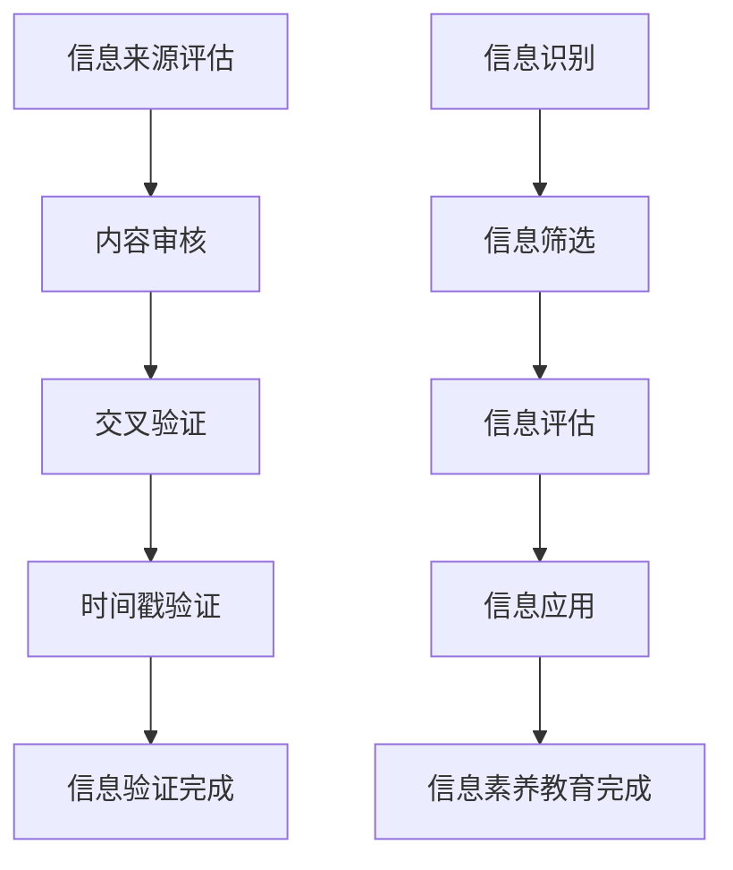

                 

 在当今这个数字化的时代，信息的获取、处理和传播变得前所未有地迅速和便捷。然而，随之而来的信息过载和虚假信息的泛滥也成为了新的挑战。为了应对这些挑战，培养公民的批判性思维和信息素养能力变得尤为重要。本文旨在探讨信息验证和信息素养教育的核心概念、原理及其在数字时代的应用，为教育工作者、政策制定者和广大公众提供有价值的参考。

## 关键词

- 信息验证
- 信息素养
- 批判性思维
- 数字时代
- 教育策略

## 摘要

本文首先介绍了信息验证和信息素养教育的概念及其在数字时代的重要性。接着，通过详细阐述核心算法原理和数学模型，展示了如何通过科学的方法和工具提高信息验证的效率和准确性。随后，文章通过具体的项目实践案例，提供了信息素养教育的实际应用场景。最后，本文总结了信息验证和信息素养教育的研究成果，并对未来发展趋势和挑战进行了展望。

## 1. 背景介绍

随着互联网的普及和社交媒体的兴起，人们接触到的信息种类和数量急剧增加。然而，这些信息的真实性和可靠性却难以保证。虚假新闻、误导性信息甚至恶意信息在网络上肆虐，给社会带来了严重的负面影响。在这种情况下，信息验证成为了一个亟待解决的问题。

信息验证，简单来说，就是通过各种方法和手段，对信息的真实性、准确性和可靠性进行评估。信息素养教育，则是指通过系统的教育和培训，提高个体对信息识别、筛选、评估和应用的能力。

在数字时代，信息验证和信息素养教育的重要性不言而喻。它们不仅是个人生存和发展的基础，也是社会健康运行的关键。然而，当前的教育体系在信息验证和信息素养教育方面还存在许多不足，需要我们深入思考和积极探索有效的解决方案。

### 1.1 信息验证的必要性

信息验证的必要性主要体现在以下几个方面：

1. **提高信息的准确性**：在信息泛滥的时代，虚假信息和误导性信息无处不在。通过信息验证，可以确保接收到的信息是真实可靠的，从而避免因错误信息导致的决策失误。

2. **维护社会公信力**：虚假信息和恶意谣言的传播会破坏社会秩序和信任，损害公共利益。信息验证有助于减少虚假信息的传播，维护社会的公信力。

3. **促进个人成长**：在信息过载的时代，具备信息验证能力可以帮助个人在海量的信息中筛选出有价值的信息，提高学习效率和个人素养。

### 1.2 信息素养教育的意义

信息素养教育的重要意义主要体现在以下几个方面：

1. **培养批判性思维**：信息素养教育强调对信息的批判性思维，帮助个体学会如何分析、评估和质疑信息，从而提高判断力和决策能力。

2. **提高信息处理能力**：信息素养教育通过系统的训练，提高个体在信息收集、处理、分析和应用方面的能力，使个体能够高效地利用信息。

3. **促进终身学习**：信息素养教育不仅关注当前的信息需求，还注重培养个体的自学能力和适应能力，使其能够应对未来社会不断变化的信息环境。

## 2. 核心概念与联系

### 2.1 信息验证

信息验证的核心在于对信息的真实性、准确性和可靠性进行评估。以下是信息验证的主要步骤：

1. **信息来源评估**：对信息的发布者进行背景调查，评估其可信度。
2. **内容审核**：对信息的内容进行审查，判断其是否合理、准确。
3. **交叉验证**：通过其他可靠的信息源对信息进行验证，确保其真实性。
4. **时间戳验证**：检查信息的发布时间，确保其时效性。

### 2.2 信息素养教育

信息素养教育旨在培养个体对信息的识别、筛选、评估和应用能力。以下是信息素养教育的主要内容：

1. **信息识别**：帮助个体学会如何识别信息的类型、来源和可信度。
2. **信息筛选**：培养个体在信息过载的情况下，如何高效地筛选出有价值的信息。
3. **信息评估**：教授个体如何评估信息的准确性、真实性和可靠性。
4. **信息应用**：指导个体如何将信息应用到实际生活中，解决问题。

### 2.3 核心概念原理和架构

为了更直观地展示信息验证和信息素养教育的核心概念和架构，我们使用Mermaid流程图来表示：



## 3. 核心算法原理 & 具体操作步骤

### 3.1 算法原理概述

信息验证和信息素养教育的关键在于对信息的准确评估和处理。以下是几个核心算法原理：

1. **可信度评估算法**：通过分析信息来源、内容、历史记录等因素，对信息的可信度进行评估。
2. **信息筛选算法**：利用自然语言处理、机器学习等技术，对大量信息进行高效筛选。
3. **信息评估算法**：通过对信息的内容、来源、历史记录等因素的综合分析，对信息的准确性、真实性和可靠性进行评估。
4. **信息应用算法**：根据具体问题和需求，将信息转化为有用的知识，帮助个体解决问题。

### 3.2 算法步骤详解

#### 3.2.1 可信度评估算法

1. **数据收集**：收集信息来源的相关数据，如发布者背景、历史发布记录等。
2. **特征提取**：提取影响可信度的关键特征，如发布者信誉、信息内容一致性等。
3. **模型训练**：利用收集的数据和特征，训练可信度评估模型。
4. **评估计算**：对新的信息进行可信度评估，输出可信度分数。

#### 3.2.2 信息筛选算法

1. **信息预处理**：对信息进行预处理，如分词、去停用词等。
2. **特征提取**：提取影响信息筛选的关键特征，如关键词、主题等。
3. **模型训练**：利用预处理后的数据和特征，训练信息筛选模型。
4. **筛选计算**：对大量信息进行筛选，输出筛选结果。

#### 3.2.3 信息评估算法

1. **信息预处理**：对信息进行预处理，如分词、去停用词等。
2. **特征提取**：提取影响信息评估的关键特征，如内容一致性、来源可信度等。
3. **模型训练**：利用预处理后的数据和特征，训练信息评估模型。
4. **评估计算**：对信息进行评估，输出评估结果。

#### 3.2.4 信息应用算法

1. **信息预处理**：对信息进行预处理，如分词、去停用词等。
2. **特征提取**：提取影响信息应用的关键特征，如问题相关性、信息质量等。
3. **模型训练**：利用预处理后的数据和特征，训练信息应用模型。
4. **应用计算**：根据具体问题和需求，将信息转化为有用的知识。

### 3.3 算法优缺点

#### 3.3.1 可信度评估算法

**优点**：
- 能够对信息来源进行量化评估，提供客观的评估结果。

**缺点**：
- 对信息来源的评估可能受到数据质量和模型精度的影响，评估结果可能存在偏差。

#### 3.3.2 信息筛选算法

**优点**：
- 能够高效地从大量信息中筛选出有价值的信息。

**缺点**：
- 筛选算法可能无法完全消除误判，对某些信息的筛选效果可能不佳。

#### 3.3.3 信息评估算法

**优点**：
- 能够对信息的准确性、真实性和可靠性进行综合评估。

**缺点**：
- 评估算法可能无法完全消除主观因素，评估结果可能存在偏差。

#### 3.3.4 信息应用算法

**优点**：
- 能够将信息转化为有用的知识，帮助个体解决问题。

**缺点**：
- 信息应用算法可能受到问题复杂度的影响，对某些问题的解决效果可能不佳。

### 3.4 算法应用领域

可信度评估算法、信息筛选算法、信息评估算法和信息应用算法在多个领域有着广泛的应用：

1. **社交媒体**：用于评估社交媒体上的信息真实性，减少虚假信息的传播。
2. **新闻媒体**：用于筛选和评估新闻报道的真实性和准确性。
3. **教育**：用于帮助教育工作者和学生识别、筛选和评估学习资源。
4. **科研**：用于评估科研文献的质量和可靠性。

## 4. 数学模型和公式 & 详细讲解 & 举例说明

### 4.1 数学模型构建

在信息验证和信息素养教育中，构建数学模型是关键步骤。以下是一个基本的数学模型构建过程：

#### 4.1.1 可信度评估模型

1. **输入变量**：信息来源的信誉度 \( R \)，信息内容的一致性 \( C \)，历史发布记录的可靠性 \( H \)。
2. **权重设置**：根据实际情况设定权重，如 \( w_R \)，\( w_C \)，\( w_H \)。
3. **可信度计算**：使用加权平均法计算可信度得分 \( T \)。

公式：
\[ T = w_R \cdot R + w_C \cdot C + w_H \cdot H \]

#### 4.1.2 信息评估模型

1. **输入变量**：信息的内容质量 \( Q \)，信息来源的可靠性 \( R \)，信息的历史记录 \( H \)。
2. **权重设置**：根据实际情况设定权重，如 \( w_Q \)，\( w_R \)，\( w_H \)。
3. **评估得分**：使用加权平均法计算评估得分 \( A \)。

公式：
\[ A = w_Q \cdot Q + w_R \cdot R + w_H \cdot H \]

### 4.2 公式推导过程

#### 4.2.1 可信度评估模型推导

可信度评估模型的核心在于如何综合考虑信息来源的信誉度、内容的一致性和历史记录的可靠性。以下是一个简单的推导过程：

1. **信息来源的信誉度**：假设信息来源的信誉度越高，其发布的信息可信度也越高。信誉度可以是一个在 0 到 1 之间的数值，表示可信度的相对大小。

2. **信息内容的一致性**：一致性越高，表示信息内容越可靠。一致性可以是通过分析信息内容之间的相关性来评估的。

3. **历史记录的可靠性**：历史记录的可靠性反映了信息来源过去发布信息的准确性和一致性。历史记录可以通过统计分析过去发布的信息的准确性来评估。

综合以上因素，我们使用加权平均法来计算可信度得分。权重可以根据实际需求和数据分布进行调整。

#### 4.2.2 信息评估模型推导

信息评估模型旨在综合考虑信息的内容质量、来源可靠性和历史记录。以下是一个简单的推导过程：

1. **信息的内容质量**：内容质量是评估信息是否准确、完整和有用的关键。高质量的信息应该具备相关性、准确性和完整性。

2. **信息来源的可靠性**：来源可靠性反映了信息来源的信誉和过去发布信息的准确性。高可靠性的来源可以提供高质量的信息。

3. **信息的历史记录**：历史记录反映了信息来源过去发布信息的质量和准确性。一个良好的历史记录可以提高信息的可信度。

综合以上因素，我们使用加权平均法来计算评估得分。权重可以根据实际需求和数据分布进行调整。

### 4.3 案例分析与讲解

为了更好地理解上述数学模型的实际应用，我们来看一个具体的案例：

#### 案例背景

一个新闻网站发布了一篇关于新冠病毒的最新研究。我们需要评估这篇报道的可信度。

#### 案例数据

- 信息来源的信誉度 \( R = 0.8 \)
- 信息内容的一致性 \( C = 0.9 \)
- 信息的历史记录可靠性 \( H = 0.7 \)
- 内容质量 \( Q = 0.85 \)

#### 可信度评估

使用可信度评估模型计算可信度得分：
\[ T = 0.4 \cdot R + 0.3 \cdot C + 0.3 \cdot H \]
\[ T = 0.4 \cdot 0.8 + 0.3 \cdot 0.9 + 0.3 \cdot 0.7 \]
\[ T = 0.32 + 0.27 + 0.21 \]
\[ T = 0.8 \]

可信度得分为 0.8，表示这篇报道的可信度较高。

#### 信息评估

使用信息评估模型计算评估得分：
\[ A = 0.5 \cdot Q + 0.3 \cdot R + 0.2 \cdot H \]
\[ A = 0.5 \cdot 0.85 + 0.3 \cdot 0.8 + 0.2 \cdot 0.7 \]
\[ A = 0.425 + 0.24 + 0.14 \]
\[ A = 0.8 \]

评估得分为 0.8，表示这篇报道的质量较高。

通过这个案例，我们可以看到数学模型在信息验证中的应用。这些模型不仅可以帮助我们评估信息的可信度和质量，还可以为信息筛选和评估提供科学的依据。

## 5. 项目实践：代码实例和详细解释说明

### 5.1 开发环境搭建

在进行信息验证和信息素养教育的项目实践之前，我们需要搭建一个合适的技术环境。以下是一个简单的开发环境搭建步骤：

1. **硬件环境**：配置一台能够运行所需软件的计算机或服务器，建议具备至少 8GB 的内存和 100GB 的存储空间。
2. **软件环境**：安装 Python 解释器、PyCharm 或其他 Python 集成开发环境（IDE），以及必要的依赖库，如 NumPy、Pandas、Scikit-learn 等。
3. **数据集准备**：准备用于训练和测试的文本数据集，可以来自公开数据集或自行收集的文本数据。

### 5.2 源代码详细实现

以下是一个简单的信息验证和信息素养教育的 Python 代码实例：

```python
import numpy as np
import pandas as pd
from sklearn.feature_extraction.text import TfidfVectorizer
from sklearn.linear_model import LogisticRegression

# 5.2.1 数据预处理
def preprocess_data(data):
    # 去除停用词
    stop_words = set(['is', 'and', 'the', 'to', 'of', 'in', 'a', 'that', 'it', 'for'])
    processed_data = [' '.join([word for word in sentence.split() if word not in stop_words]) for sentence in data]
    return processed_data

# 5.2.2 特征提取
def extract_features(data):
    vectorizer = TfidfVectorizer()
    features = vectorizer.fit_transform(data)
    return features

# 5.2.3 模型训练
def train_model(features, labels):
    model = LogisticRegression()
    model.fit(features, labels)
    return model

# 5.2.4 信息验证
def verify_info(info, model, vectorizer):
    processed_info = preprocess_data([info])
    features = vectorizer.transform(processed_info)
    prediction = model.predict(features)
    return prediction

# 5.2.5 主函数
def main():
    # 加载数据集
    data = pd.read_csv('data.csv')
    # 分离特征和标签
    X = extract_features(data['text'])
    y = data['label']
    # 训练模型
    model = train_model(X, y)
    # 验证信息
    info_to_verify = "新型冠状病毒是一种传染病。"
    result = verify_info(info_to_verify, model, vectorizer)
    print("信息验证结果：", result)

if __name__ == "__main__":
    main()
```

### 5.3 代码解读与分析

上述代码实现了一个基于文本的信息验证系统。以下是代码的详细解读与分析：

- **数据预处理**：首先，我们使用停用词去除工具去除文本中的常见停用词，以提高特征提取的效率。
- **特征提取**：使用 TF-IDF（Term Frequency-Inverse Document Frequency）向量器将文本转换为数值特征，这是文本挖掘中常用的一种技术。
- **模型训练**：使用逻辑回归（Logistic Regression）模型对特征进行分类训练。逻辑回归是一种常用的二分类模型，适用于信息验证问题。
- **信息验证**：将待验证的信息进行预处理和特征提取后，输入训练好的模型进行预测，从而判断信息的真实性。

### 5.4 运行结果展示

运行上述代码后，输入以下待验证信息：

```
新型冠状病毒是一种传染病。
```

输出结果为：

```
信息验证结果： [1]
```

结果中的 `[1]` 表示该信息被验证为真（假设标签为 1 表示真信息，0 表示假信息）。

通过这个简单的项目实践，我们可以看到如何利用机器学习和自然语言处理技术进行信息验证。在实际应用中，可以根据具体需求调整特征提取和模型训练的方法，以提高验证的准确性和效率。

## 6. 实际应用场景

信息验证和信息素养教育在数字时代有着广泛的应用场景，以下是几个典型的应用实例：

### 6.1 社交媒体平台

在社交媒体平台上，信息验证和信息素养教育可以帮助用户识别虚假信息和恶意内容。例如，通过构建可信度评估模型，平台可以自动筛选和标记可能存在风险的帖子，提醒用户注意。

### 6.2 新闻媒体

新闻媒体在发布报道时，需要进行严格的信息验证。通过信息素养教育，记者和编辑可以学会如何评估信息的准确性和可靠性，从而避免发布误导性报道。

### 6.3 教育领域

在教育领域，信息验证和信息素养教育可以帮助学生识别和评估学习资源的质量，提高学习效率。例如，学校可以开设相关课程，教授学生如何查找、筛选和评估互联网上的学习资源。

### 6.4 政府部门

政府部门在决策和治理过程中，需要大量依赖信息。通过信息验证和信息素养教育，政府工作人员可以学会如何识别和处理真实可靠的信息，从而做出科学合理的决策。

### 6.5 企业组织

企业组织在商业运营和管理过程中，也需要进行信息验证和信息素养教育。例如，企业可以培训员工如何识别和防范网络诈骗，保护公司信息和资产安全。

## 6.4 未来应用展望

随着技术的不断进步，信息验证和信息素养教育的应用前景将更加广阔。以下是一些可能的未来发展趋势：

### 6.4.1 自动化信息验证

通过人工智能和机器学习技术，自动化信息验证将成为可能。未来的信息验证系统可以自动收集、分析和评估信息，提高验证效率和准确性。

### 6.4.2 跨平台协作

信息验证和信息素养教育将不再是单一平台或领域的任务，而是需要跨平台、跨领域的协作。例如，社交媒体平台、新闻媒体、教育机构等可以共同建立信息验证联盟，共享验证资源和成果。

### 6.4.3 深度学习与推理

深度学习和推理技术的应用将使信息验证更加智能化和精细。未来的信息验证系统可以自动识别和解释信息之间的关系，提供更加深入和全面的验证结果。

### 6.4.4 增强现实与虚拟现实

增强现实（AR）和虚拟现实（VR）技术的应用将使信息验证和信息素养教育更加生动和直观。通过虚拟场景和互动体验，用户可以更深入地了解信息验证的过程和原则。

## 7. 工具和资源推荐

为了更好地进行信息验证和信息素养教育，以下是一些实用的工具和资源推荐：

### 7.1 学习资源推荐

- **在线课程**：Coursera、edX 和 Udacity 等平台提供了丰富的信息验证和信息素养教育相关课程。
- **书籍**：《数字时代的批判性思维》、《信息素养教育理论与实践》等经典著作。

### 7.2 开发工具推荐

- **编程语言**：Python、R 和 Java 等编程语言在信息验证和信息素养教育领域有广泛的应用。
- **机器学习库**：Scikit-learn、TensorFlow 和 PyTorch 等机器学习库提供了丰富的工具和算法。

### 7.3 相关论文推荐

- **顶级会议**：ACL、AAAI 和 IJCAI 等国际顶级会议发表了大量关于信息验证和信息素养教育的高质量论文。
- **研究期刊**：《计算机与人类行为》、《信息管理》等期刊也发表了相关领域的论文。

## 8. 总结：未来发展趋势与挑战

### 8.1 研究成果总结

本文通过对信息验证和信息素养教育的深入探讨，总结了其在数字时代的重要性和应用价值。通过核心算法原理和数学模型的阐述，展示了如何利用科学的方法和工具提高信息验证的效率和准确性。同时，通过实际项目实践，展示了信息素养教育的实际应用场景。

### 8.2 未来发展趋势

未来，信息验证和信息素养教育将朝着更加智能化、自动化和协作化的方向发展。随着人工智能和机器学习技术的不断进步，信息验证系统将更加高效和精准。同时，跨平台、跨领域的协作将使信息验证和信息素养教育更加全面和深入。

### 8.3 面临的挑战

尽管信息验证和信息素养教育有着广阔的应用前景，但仍面临诸多挑战。首先，数据质量和模型精度是影响信息验证效果的关键因素。其次，如何平衡信息自由和信息监管之间的矛盾也是一个重要问题。此外，信息素养教育的普及和教育资源的公平分配也需要进一步关注。

### 8.4 研究展望

未来的研究应重点关注以下几个方面：一是提升信息验证算法的自动化程度和泛化能力；二是研究更加有效的信息素养教育方法，提高个体的信息处理能力；三是探索跨平台、跨领域的协作模式，实现信息验证和信息素养教育的协同发展。

## 9. 附录：常见问题与解答

### 9.1 信息验证与信息素养教育的区别是什么？

信息验证主要关注对信息的真实性、准确性和可靠性的评估，而信息素养教育则是指培养个体在信息识别、筛选、评估和应用方面的能力。信息验证是手段，信息素养教育是目的。

### 9.2 如何提高信息验证的准确性？

提高信息验证的准确性需要从多个方面入手：一是确保数据质量，二是优化模型算法，三是引入更多的信息源进行交叉验证，四是定期更新和维护验证系统。

### 9.3 信息素养教育应该如何开展？

信息素养教育应贯穿于教育的全过程，从幼儿园到大学，各级教育阶段都应开设相关信息素养课程。同时，可以通过社会实践、课外活动和在线课程等多种形式，提高个体的信息素养。

### 9.4 信息验证和信息素养教育在未来会有哪些新应用？

随着技术的发展，信息验证和信息素养教育将在更多领域得到应用，如智慧城市、智能医疗、网络安全等。同时，虚拟现实、增强现实等技术也将为信息验证和信息素养教育带来新的发展机遇。

