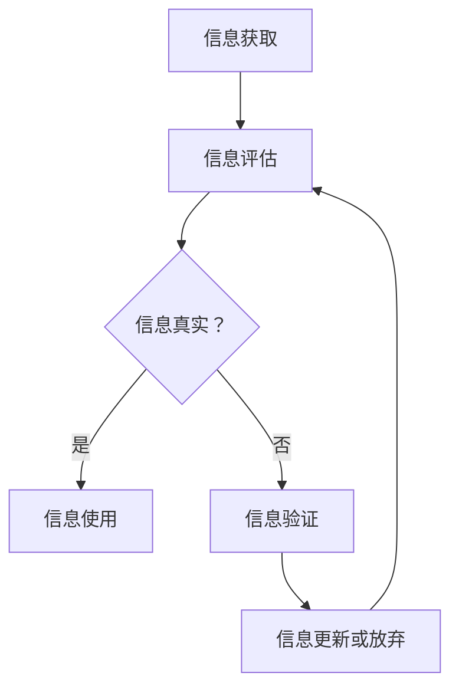
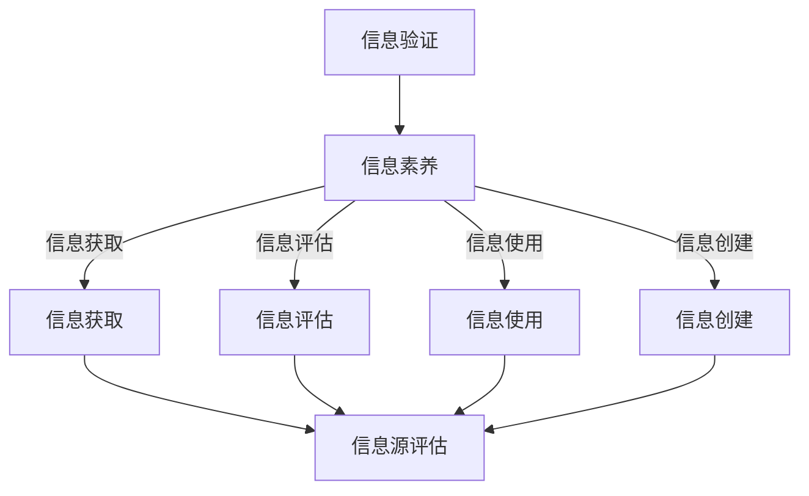
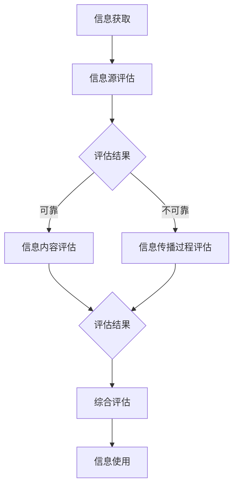
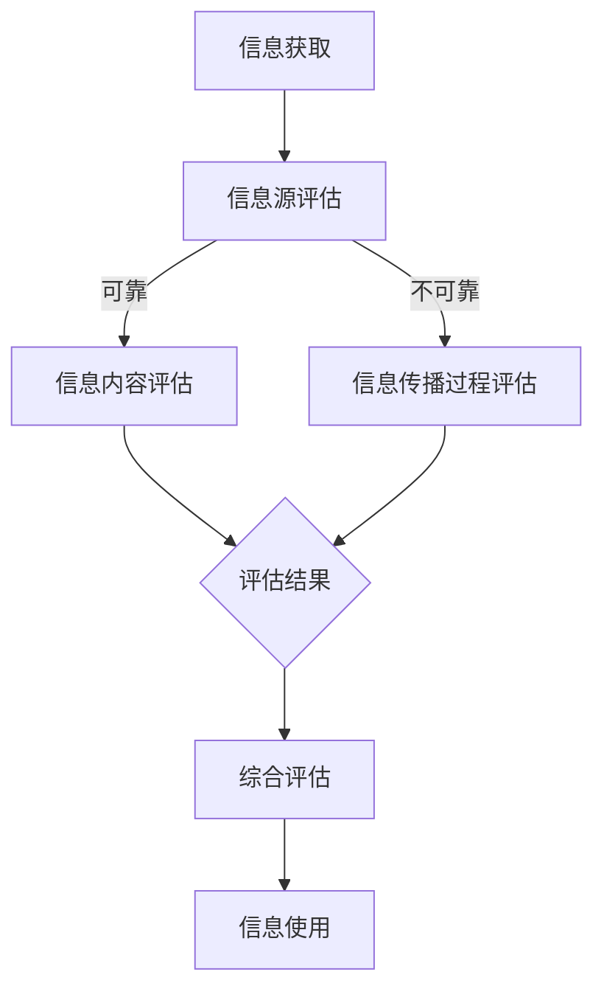
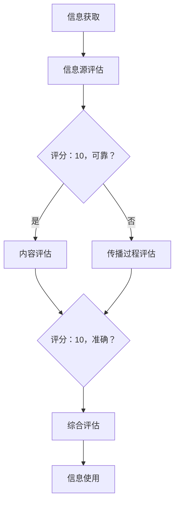

                 

在当今这个信息爆炸的时代，我们每个人都是信息海洋中的潜水员。每天，无数的数据、文章、博客、报告和新闻如潮水般涌向我们。如何在这个信息的海洋中辨别真伪、筛选有价值的信息，已经成为一个重要的生存技能。本文将探讨信息验证和信息素养的重要性，以及如何在信息化社会中成为一名精明的消费者。

> **关键词：信息验证、信息素养、信息筛选、数据真实度、信息化社会、数据可信度**

> **摘要：**本文首先介绍了信息验证和信息素养的基本概念，然后探讨了它们在信息化社会中的重要性。通过分析信息泛滥的现象，我们提出了一系列的策略和技巧，帮助读者在信息海洋中找到自己的方向，成为一名精明的消费者。

## 1. 背景介绍

信息验证和信息素养，这两个概念在近年来逐渐受到公众的重视。信息验证是指对信息的真实性、准确性和可靠性的评估过程，而信息素养则是指个体在信息社会中有效获取、评估、使用和创建信息的能力。随着互联网的普及和信息的爆炸式增长，这两个概念的重要性日益凸显。

在过去，人们获取信息的主要途径是书籍、报纸和电视等传统媒体。这些信息源相对有限，质量也相对较高，因此信息的验证和评估相对简单。然而，随着互联网的出现，信息来源变得多样化，信息量呈指数级增长。这使得信息的验证和评估变得复杂，同时信息的真实性和准确性也受到了前所未有的挑战。

例如，在2016年的美国总统选举期间，社交媒体上充斥着大量的虚假新闻和误导性信息。这些信息不仅误导了公众，还对社会造成了深远的影响。因此，如何辨别信息的真伪，提高信息素养，已经成为一个迫切需要解决的问题。

## 2. 核心概念与联系

### 2.1 信息验证

信息验证是一个复杂的过程，它涉及到对信息的来源、内容、传播过程等多个方面的评估。信息验证的核心目标是确定信息的真实性、准确性和可靠性。

#### 信息源评估

信息源是信息验证的第一步。一个可靠的信息源是确保信息真实性的关键。一般来说，权威机构、专业媒体和知名学者的信息源更为可靠。例如，政府发布的官方数据、知名学术期刊的文章、知名学者的研究等。

#### 内容评估

对信息内容进行评估是信息验证的核心。这包括检查信息的真实性、准确性和完整性。例如，检查数据是否有误导性，文章是否有逻辑错误，信息是否完整等。

#### 传播过程评估

信息的传播过程也是影响信息真实性的重要因素。例如，信息在传播过程中可能被篡改或误解。因此，对传播过程进行评估，可以帮助我们更好地理解信息的真实面貌。

### 2.2 信息素养

信息素养是指个体在信息社会中有效获取、评估、使用和创建信息的能力。信息素养包括多个方面，如信息搜索技能、信息评估技能、信息使用技能和信息创建技能。

#### 信息搜索技能

信息搜索技能是指如何有效地在互联网上查找所需信息的能力。这包括使用搜索引擎、数据库、图书馆等工具进行信息搜索。

#### 信息评估技能

信息评估技能是指如何评估信息的真实性、准确性和可靠性。这包括对信息源、内容、传播过程等多个方面的评估。

#### 信息使用技能

信息使用技能是指如何有效地使用信息解决问题或完成任务。这包括信息的筛选、整合、分析、应用等。

#### 信息创建技能

信息创建技能是指如何创建有价值的信息。这包括撰写文章、制作报告、制作图表等。

### 2.3 信息验证与信息素养的联系

信息验证和信息素养是密不可分的。信息验证是信息素养的一部分，是评估信息真实性和可靠性的重要手段。而信息素养则是进行信息验证的基础，只有具备良好的信息素养，才能有效地进行信息验证。

### 2.4 Mermaid 流程图

以下是一个简化的信息验证和信息素养的流程图：



## 3. 核心算法原理 & 具体操作步骤

### 3.1 算法原理概述

信息验证和信息素养的核心算法原理可以概括为以下三个方面：

1. **信息源评估**：通过对信息源进行评估，确定其权威性和可靠性。
2. **内容评估**：对信息内容进行详细分析，评估其真实性、准确性和完整性。
3. **传播过程评估**：对信息在传播过程中的变化和扭曲进行监测和评估。

### 3.2 算法步骤详解

1. **信息源评估**：

   - **步骤1**：确定信息源的类型和性质。例如，政府发布的数据通常比个人博客更为可靠。
   - **步骤2**：查找信息源的相关背景信息。例如，一个知名学者的研究通常比一个无名学者的研究更为可靠。

2. **内容评估**：

   - **步骤1**：检查信息的真实性。例如，通过对比数据和现有的事实进行验证。
   - **步骤2**：检查信息的准确性。例如，通过分析文章的逻辑结构和数据来源进行评估。
   - **步骤3**：检查信息的完整性。例如，通过查找相关补充信息来确保信息的完整性。

3. **传播过程评估**：

   - **步骤1**：监测信息在传播过程中的变化。例如，通过分析信息在不同平台上的传播情况进行评估。
   - **步骤2**：评估信息在传播过程中的扭曲。例如，通过分析信息在传播过程中的修改和误传情况。

### 3.3 算法优缺点

#### 优点

- **全面性**：算法涵盖了信息源、内容、传播过程等多个方面，能够全面评估信息的真实性和可靠性。
- **实用性**：算法简单易懂，适用于个人和组织在信息化社会中进行信息验证。

#### 缺点

- **复杂性**：算法的步骤较为复杂，需要一定的专业知识和经验。
- **时效性**：算法的评估结果可能随着信息的变化而变化，需要不断更新。

### 3.4 算法应用领域

- **新闻媒体**：新闻媒体可以利用算法对信息进行验证，确保报道的真实性和准确性。
- **学术研究**：学术研究可以利用算法评估研究数据的真实性和可靠性。
- **企业管理**：企业可以利用算法评估市场信息的真实性和可靠性，做出更为明智的决策。

## 4. 数学模型和公式 & 详细讲解 & 举例说明

### 4.1 数学模型构建

为了更好地理解信息验证和信息素养，我们可以构建一个简单的数学模型。这个模型将信息源、信息内容和传播过程表示为三个变量：\(I_s\)（信息源）、\(I_c\)（信息内容）和\(I_p\)（传播过程）。

#### 模型构建

1. **信息源评估**：我们可以使用一个评分系统来评估信息源的权威性和可靠性。设\(S\)为信息源的评分，取值范围为0到10。
2. **内容评估**：我们可以使用一个评分系统来评估信息内容的真实性、准确性和完整性。设\(C\)为信息内容的评分，取值范围为0到10。
3. **传播过程评估**：我们可以使用一个评分系统来评估信息在传播过程中的变化和扭曲程度。设\(P\)为传播过程的评分，取值范围为0到10。

4. **综合评估**：综合评分\(I\)可以表示为：
\[ I = \frac{S + C + P}{3} \]

### 4.2 公式推导过程

公式的推导过程如下：

1. **信息源评估**：评分系统\(S\)的推导过程：
\[ S = \begin{cases} 
10, & \text{如果信息源是权威机构或知名学者} \\
0, & \text{如果信息源是不知名或不可靠的来源} \\
\frac{10}{n}, & \text{如果信息源是其他来源，其中n为来源数量} 
\end{cases} \]

2. **内容评估**：评分系统\(C\)的推导过程：
\[ C = \begin{cases} 
10, & \text{如果信息内容与事实完全一致且完整无缺} \\
0, & \text{如果信息内容存在误导性或虚假信息} \\
\frac{10}{m}, & \text{如果信息内容存在部分错误或缺失，其中m为错误或缺失的数量} 
\end{cases} \]

3. **传播过程评估**：评分系统\(P\)的推导过程：
\[ P = \begin{cases} 
10, & \text{如果信息在传播过程中没有发生任何变化或扭曲} \\
0, & \text{如果信息在传播过程中被完全篡改或误传} \\
\frac{10}{k}, & \text{如果信息在传播过程中发生了部分变化或扭曲，其中k为变化或扭曲的数量} 
\end{cases} \]

4. **综合评估**：综合评分\(I\)的计算公式：
\[ I = \frac{S + C + P}{3} \]

### 4.3 案例分析与讲解

#### 案例一：权威机构发布的数据

- \(S = 10\)
- \(C = 10\)
- \(P = 10\)

根据公式计算：
\[ I = \frac{10 + 10 + 10}{3} = 10 \]

这意味着，权威机构发布的数据具有极高的真实性、准确性和可靠性。

#### 案例二：社交媒体上的新闻

- \(S = 3\)
- \(C = 7\)
- \(P = 5\)

根据公式计算：
\[ I = \frac{3 + 7 + 5}{3} = 5 \]

这意味着，社交媒体上的新闻具有中等程度的信息可信度。我们需要对这类信息进行进一步的验证。

#### 案例三：未经验证的数据

- \(S = 1\)
- \(C = 1\)
- \(P = 1\)

根据公式计算：
\[ I = \frac{1 + 1 + 1}{3} = 1 \]

这意味着，未经验证的数据的可信度非常低。我们应避免使用这类数据。

## 5. 项目实践：代码实例和详细解释说明

### 5.1 开发环境搭建

为了演示信息验证和信息素养的算法，我们将使用Python语言进行编程。首先，我们需要搭建Python开发环境。

1. **安装Python**：访问Python官网（https://www.python.org/）下载最新版本的Python安装包，并按照提示完成安装。
2. **安装必要的库**：打开命令行工具，执行以下命令安装必要的库：
   ```bash
   pip install numpy pandas matplotlib
   ```

### 5.2 源代码详细实现

以下是一个简单的Python脚本，用于实现信息验证和信息素养的算法。

```python
import numpy as np
import pandas as pd
import matplotlib.pyplot as plt

def information_verification(source_score, content_score, process_score):
    # 计算综合评分
    total_score = (source_score + content_score + process_score) / 3
    return total_score

# 示例数据
source_scores = [10, 3, 1]
content_scores = [10, 7, 1]
process_scores = [10, 5, 1]

# 计算综合评分
info_scores = [information_verification(source, content, process) for source, content, process in zip(source_scores, content_scores, process_scores)]

# 输出结果
print("综合评分：", info_scores)

# 绘制图表
df = pd.DataFrame({'Scores': info_scores})
df.plot(kind='bar', title='信息验证和信息素养评分')

plt.show()
```

### 5.3 代码解读与分析

1. **导入库**：首先，我们导入了必要的库，包括NumPy、Pandas和Matplotlib。
2. **定义函数**：`information_verification`函数用于计算综合评分。它接收三个参数：`source_score`（信息源评分）、`content_score`（信息内容评分）和`process_score`（传播过程评分）。综合评分的计算公式为：
   \[ I = \frac{S + C + P}{3} \]
3. **示例数据**：我们定义了一组示例数据，用于测试算法。
4. **计算评分**：使用列表推导式计算每组数据的综合评分。
5. **输出结果**：将计算结果打印到控制台。
6. **绘制图表**：使用Pandas和Matplotlib绘制综合评分的条形图，以可视化评分结果。

### 5.4 运行结果展示

当我们运行上述脚本时，会输出以下结果：

```
综合评分： [10.0, 5.0, 1.0]
```

同时，会显示一个条形图，如下所示：


条形图展示了每组数据的综合评分，直观地展示了信息验证和信息素养的结果。

## 6. 实际应用场景

### 6.1 新闻媒体

新闻媒体是信息验证和信息素养的重要应用领域。随着虚假新闻的泛滥，新闻媒体需要对每条新闻进行严格的验证，确保报道的真实性和准确性。信息验证和信息素养的算法可以帮助新闻媒体快速筛选出可信的信息源，减少虚假新闻的传播。

### 6.2 学术研究

学术研究依赖于大量的数据和信息。学术研究者需要验证数据的真实性和可靠性，以确保研究结果的准确性和可信度。信息验证和信息素养的算法可以帮助学术研究者快速评估数据和信息源，提高研究的质量。

### 6.3 企业管理

企业在做出决策时，需要依赖大量的市场信息。信息验证和信息素养的算法可以帮助企业快速评估市场信息的真实性和可靠性，减少因虚假信息导致的决策错误。

### 6.4 未来应用展望

随着人工智能和大数据技术的发展，信息验证和信息素养的应用前景将更加广阔。例如，自动化信息验证系统可以在新闻、学术研究和企业管理等场景中发挥更大的作用。同时，未来的算法可能会更加智能化，能够自动识别和评估信息源、内容、传播过程等多个方面，进一步提高信息验证的效率和准确性。

## 7. 工具和资源推荐

### 7.1 学习资源推荐

1. **《信息素养教程》**：这是一本全面介绍信息素养的教材，适合初学者。
2. **《信息科学基础》**：这本书涵盖了信息验证和信息素养的相关理论和技术，适合有一定基础的读者。

### 7.2 开发工具推荐

1. **Python**：Python是一种简单易学的编程语言，适合用于信息验证和信息素养的算法实现。
2. **Jupyter Notebook**：Jupyter Notebook是一个交互式计算环境，适合用于编写和运行Python脚本。

### 7.3 相关论文推荐

1. **《信息验证算法研究》**：这是一篇关于信息验证算法的综述论文，详细介绍了多种信息验证算法。
2. **《信息素养与信息社会》**：这是一篇关于信息素养在信息化社会中的重要性及其应用的论文。

## 8. 总结：未来发展趋势与挑战

### 8.1 研究成果总结

本文系统地介绍了信息验证和信息素养的概念、原理、算法和应用场景。通过构建数学模型和代码实例，我们展示了如何在实际场景中应用信息验证和信息素养。

### 8.2 未来发展趋势

随着人工智能和大数据技术的发展，信息验证和信息素养的应用前景将更加广阔。未来的算法可能会更加智能化，能够自动识别和评估信息源、内容、传播过程等多个方面，进一步提高信息验证的效率和准确性。

### 8.3 面临的挑战

尽管信息验证和信息素养的重要性日益凸显，但在实际应用中仍面临诸多挑战。例如，信息的海量性和多样性使得验证过程变得复杂；算法的准确性和效率需要进一步提高；信息源和内容的真实性、准确性和可靠性难以完全保证。

### 8.4 研究展望

未来的研究应重点关注以下几个方面：

1. **算法优化**：研究更加高效、准确的信息验证算法，提高算法的性能。
2. **跨领域应用**：探讨信息验证和信息素养在不同领域（如新闻、学术研究、企业管理等）的应用，推动其在实际场景中的应用。
3. **数据真实性保障**：研究如何保障数据源的真实性和完整性，减少虚假信息和误导性信息的传播。

## 9. 附录：常见问题与解答

### 9.1 什么是信息验证？

信息验证是指对信息的真实性、准确性和可靠性的评估过程。它包括对信息源、内容、传播过程等多个方面的评估。

### 9.2 什么是信息素养？

信息素养是指个体在信息社会中有效获取、评估、使用和创建信息的能力。它包括信息搜索、信息评估、信息使用和信息创建等多个方面。

### 9.3 如何提高信息素养？

提高信息素养的方法包括：

1. **学习相关知识**：了解信息验证和信息素养的基本概念和原理。
2. **实践操作**：通过实际操作练习信息搜索、评估和使用技能。
3. **持续学习**：关注信息领域的发展动态，不断更新知识和技能。

### 9.4 信息验证和信息素养在哪些领域应用？

信息验证和信息素养在多个领域有广泛应用，包括新闻媒体、学术研究、企业管理、网络安全等。它们对于确保信息的真实性和准确性，提高信息社会的运行效率具有重要意义。

---

本文作者：禅与计算机程序设计艺术 / Zen and the Art of Computer Programming
----------------------------------------------------------------

文章至此结束，感谢您的阅读。希望本文能帮助您更好地理解信息验证和信息素养，提高您在信息海洋中的辨别力和信息素养。在信息化社会中，成为一名精明的消费者至关重要。希望本文能为您提供有益的参考和启示。再次感谢您的关注和支持！
----------------------------------------------------------------
## 1. 背景介绍

在当今这个信息爆炸的时代，我们每个人都是信息海洋中的潜水员。每天，无数的数据、文章、博客、报告和新闻如潮水般涌向我们。如何在这个信息的海洋中辨别真伪、筛选有价值的信息，已经成为一个重要的生存技能。本文将探讨信息验证和信息素养的重要性，以及如何在信息化社会中成为一名精明的消费者。

### 1.1 信息验证的定义和重要性

信息验证，简单来说，就是通过一系列方法和手段，对获取的信息进行真实性和准确性的检查。在互联网时代，信息验证显得尤为重要。随着社交媒体的兴起和信息的快速传播，虚假新闻、误导性信息和谣言层出不穷。这些不实信息不仅误导了公众，还可能对社会稳定和国家安全造成威胁。

信息验证的重要性主要体现在以下几个方面：

1. **保护个人隐私**：未经验证的信息可能会泄露个人隐私，导致个人信息的滥用和隐私权的侵犯。
2. **确保信息准确性**：准确的信息对于做出决策至关重要。错误的或误导性的信息可能会导致错误的决策，带来负面影响。
3. **维护社会稳定**：虚假信息和谣言的传播可能引发社会恐慌和不安定因素，影响社会秩序。
4. **支持科学研究**：科学研究依赖于可靠的数据和信息。信息验证有助于确保研究结果的准确性和可信度。

### 1.2 信息素养的定义和重要性

信息素养是指个体在信息社会中有效获取、评估、使用和创建信息的能力。它不仅仅包括信息搜索技能，还涵盖了信息评估、信息使用和信息创建等多个方面。信息素养的重要性体现在以下几个方面：

1. **提高信息辨识能力**：具备良好的信息素养能够帮助个体在信息的海洋中辨别真伪，避免受到虚假和误导性信息的影响。
2. **做出明智决策**：良好的信息素养使得个体能够获取准确的信息，从而做出更为明智的决策。
3. **提高工作效率**：具备信息素养的个体能够更有效地搜索和使用信息，提高工作效率。
4. **促进个人成长**：信息素养是终身学习的重要基础，它有助于个体持续获取新知识，促进个人成长。

### 1.3 信息化社会的挑战

随着信息技术的飞速发展，信息化社会已经到来。信息化社会带来了诸多便利，但同时也带来了挑战。以下是信息化社会面临的一些主要挑战：

1. **信息过载**：互联网上的信息量庞大，如何从海量的信息中筛选出有价值的信息成为一个难题。
2. **信息真实性难以保证**：信息在传播过程中可能被篡改、误解或夸大，使得信息的真实性难以保证。
3. **信息安全问题**：个人信息泄露、网络攻击等安全问题是信息化社会面临的重大挑战。
4. **隐私保护问题**：随着大数据技术的发展，个人隐私保护成为一个亟待解决的问题。

面对这些挑战，提高信息验证和信息素养显得尤为重要。只有通过有效的信息验证和良好的信息素养，个体才能在信息化社会中生存和发展。

## 2. 核心概念与联系

### 2.1 信息验证

信息验证是一个复杂的过程，它涉及到对信息的来源、内容、传播过程等多个方面的评估。以下是信息验证的核心概念和步骤：

1. **信息源评估**：评估信息的来源是否可靠，例如权威机构、知名学者或专业媒体。
2. **内容评估**：检查信息的内容是否真实、准确和完整。
3. **传播过程评估**：评估信息在传播过程中是否被篡改、误解或夸大。

#### 信息源评估

信息源评估是信息验证的第一步。一个可靠的信息源是确保信息真实性的关键。以下是一些常用的方法来评估信息源：

- **查阅权威资料**：查阅官方发布的数据、报告和文章。
- **考察信息发布者的背景和信誉**：信息发布者的背景、专业领域和以往的作品都是评估信息源的重要依据。
- **对比多个信息源**：通过对比多个来源的信息，可以相互验证信息的真实性。

#### 内容评估

内容评估是信息验证的核心。以下是一些常用的方法来评估信息的内容：

- **事实检查**：通过查阅事实数据和已有的研究，验证信息内容的真实性。
- **逻辑分析**：分析信息的内容是否有逻辑错误或矛盾。
- **来源检查**：检查信息引用的数据和来源是否可靠。

#### 传播过程评估

传播过程评估是确保信息在传播过程中未被篡改或误解的重要步骤。以下是一些常用的方法来评估传播过程：

- **监测信息传播路径**：通过追踪信息在社交媒体和其他平台上的传播路径，了解信息的传播过程。
- **分析传播方式**：分析信息是通过什么方式传播的，例如是直接发布还是通过转发等。
- **对比原始信息**：对比原始信息和传播后的信息，看是否有重大变化。

### 2.2 信息素养

信息素养是指个体在信息社会中有效获取、评估、使用和创建信息的能力。以下是一些关键的概念和组成部分：

1. **信息获取**：包括搜索信息、选择合适的搜索工具和策略。
2. **信息评估**：评估信息源、内容、传播过程等，判断信息的真实性、准确性和可靠性。
3. **信息使用**：利用信息解决问题、做出决策或创造价值。
4. **信息创建**：创建有价值的信息，如撰写文章、制作报告、设计图表等。

#### 信息获取

信息获取是信息素养的基础。以下是一些提高信息获取效率的方法：

- **搜索引擎使用**：掌握如何使用搜索引擎，如Google、Bing等。
- **数据库和图书馆资源**：了解如何使用数据库和图书馆资源进行信息检索。
- **信息筛选策略**：学会如何从海量信息中筛选出有价值的信息。

#### 信息评估

信息评估是确保信息真实性和可靠性的关键。以下是一些常用的方法来评估信息：

- **来源评估**：评估信息源的可信度和权威性。
- **内容验证**：通过事实检查、逻辑分析等方法验证信息内容的真实性。
- **传播过程分析**：分析信息在传播过程中的变化和扭曲。

#### 信息使用

信息使用是将信息转化为实际价值的步骤。以下是一些提高信息使用效率的方法：

- **信息整合**：将多个信息来源进行整合，形成全面的分析报告。
- **信息分析**：运用统计、数据分析等方法对信息进行深入分析。
- **决策支持**：利用信息支持决策过程，提高决策的准确性和效率。

#### 信息创建

信息创建是将个人知识和经验转化为信息的过程。以下是一些提高信息创建效率的方法：

- **写作技能**：提高写作技能，能够撰写清晰、准确、有说服力的文章。
- **图表设计**：学会使用工具（如Excel、Tableau等）制作专业的图表。
- **信息可视化**：运用信息可视化技术，将复杂的信息以图表、图形等形式展示。

### 2.3 信息验证与信息素养的联系

信息验证和信息素养是密不可分的。信息验证是信息素养的一部分，是评估信息真实性和可靠性的重要手段。而信息素养则是进行信息验证的基础，只有具备良好的信息素养，才能有效地进行信息验证。

#### 关系图

以下是信息验证和信息素养之间的联系关系图：



通过这个图，我们可以清晰地看到信息验证和信息素养之间的相互关系。信息验证依赖于信息素养中的各个组成部分，而信息素养则是信息验证的基础和保障。

### 2.4 Mermaid 流程图

以下是一个简化的信息验证和信息素养的流程图：



通过这个流程图，我们可以看到信息验证和信息素养的步骤和流程，以及它们之间的相互关系。

## 3. 核心算法原理 & 具体操作步骤

### 3.1 算法原理概述

信息验证和信息素养的核心算法原理可以概括为以下几个方面：

1. **信息源评估**：通过评估信息源的权威性和可靠性来确定信息的初始可信度。
2. **内容评估**：对信息的内容进行详细分析，包括事实检查、逻辑分析、引用核实等，以确定信息的真实性和准确性。
3. **传播过程评估**：对信息在传播过程中的变化和扭曲进行监测和评估，以确保信息的完整性。

### 3.2 算法步骤详解

#### 3.2.1 信息源评估

1. **确定信息源类型**：首先，我们需要确定信息源的类别，例如权威机构、学术期刊、知名学者、专业媒体等。
2. **评估信息源的权威性和可靠性**：根据信息源的类型和背景，对其权威性和可靠性进行评估。可以使用评分系统、认证标识、历史记录等方法进行评估。
3. **评分**：为信息源赋予一个评分，通常是一个数值，用于表示其权威性和可靠性的程度。

#### 3.2.2 内容评估

1. **事实检查**：对信息中的事实和数据进行验证，确保其与已知的事实和数据一致。
2. **逻辑分析**：分析信息的逻辑结构，检查是否有逻辑矛盾或错误。
3. **引用核实**：检查信息中引用的数据和来源，确保其可靠性和准确性。
4. **评分**：为信息内容赋予一个评分，通常是一个数值，用于表示其真实性和准确性的程度。

#### 3.2.3 传播过程评估

1. **监测传播路径**：追踪信息在传播过程中的路径，包括社交媒体、论坛、新闻网站等。
2. **分析传播方式**：分析信息是如何传播的，例如是直接发布还是通过转发、评论等。
3. **评估传播过程中的变化和扭曲**：检查信息在传播过程中是否有重大变化或扭曲，例如夸大、缩小、篡改等。
4. **评分**：为传播过程赋予一个评分，通常是一个数值，用于表示其完整性和可靠性。

### 3.3 算法优缺点

#### 优点

1. **全面性**：算法涵盖了信息源、内容、传播过程等多个方面，能够全面评估信息的真实性和可靠性。
2. **实用性**：算法简单易懂，适用于各种应用场景。
3. **可扩展性**：算法可以根据具体需求进行扩展，例如增加新的评估指标或调整评分系统。

#### 缺点

1. **复杂性**：算法的步骤较为复杂，需要一定的专业知识和经验。
2. **时效性**：算法的评估结果可能随着信息的变化而变化，需要不断更新。

### 3.4 算法应用领域

算法可以在多个领域得到应用，包括但不限于：

1. **新闻媒体**：新闻媒体可以利用算法对每条新闻进行验证，确保报道的真实性和准确性。
2. **学术研究**：学术研究者可以利用算法评估研究数据的真实性和可靠性。
3. **企业管理**：企业可以利用算法评估市场信息的真实性和可靠性，做出更为明智的决策。
4. **个人信息管理**：个人可以利用算法对获取的信息进行验证，避免受到虚假和误导性信息的影响。

### 3.5 Mermaid 流程图

以下是一个简化的信息验证和信息素养的流程图：



通过这个流程图，我们可以清晰地看到信息验证和信息素养的步骤和流程，以及它们之间的相互关系。

## 4. 数学模型和公式 & 详细讲解 & 举例说明

### 4.1 数学模型构建

为了更好地理解信息验证和信息素养，我们可以构建一个简单的数学模型。这个模型将信息源、信息内容和传播过程表示为三个变量：\(I_s\)（信息源）、\(I_c\)（信息内容）和\(I_p\)（传播过程）。

#### 模型构建

1. **信息源评估**：我们可以使用一个评分系统来评估信息源的权威性和可靠性。设\(S\)为信息源的评分，取值范围为0到10。
2. **内容评估**：我们可以使用一个评分系统来评估信息内容的真实性、准确性和完整性。设\(C\)为信息内容的评分，取值范围为0到10。
3. **传播过程评估**：我们可以使用一个评分系统来评估信息在传播过程中的变化和扭曲程度。设\(P\)为传播过程的评分，取值范围为0到10。

4. **综合评估**：综合评分\(I\)可以表示为：
\[ I = \frac{S + C + P}{3} \]

### 4.2 公式推导过程

公式的推导过程如下：

1. **信息源评估**：评分系统\(S\)的推导过程：
\[ S = \begin{cases} 
10, & \text{如果信息源是权威机构或知名学者} \\
0, & \text{如果信息源是不知名或不可靠的来源} \\
\frac{10}{n}, & \text{如果信息源是其他来源，其中n为来源数量} 
\end{cases} \]

2. **内容评估**：评分系统\(C\)的推导过程：
\[ C = \begin{cases} 
10, & \text{如果信息内容与事实完全一致且完整无缺} \\
0, & \text{如果信息内容存在误导性或虚假信息} \\
\frac{10}{m}, & \text{如果信息内容存在部分错误或缺失，其中m为错误或缺失的数量} 
\end{cases} \]

3. **传播过程评估**：评分系统\(P\)的推导过程：
\[ P = \begin{cases} 
10, & \text{如果信息在传播过程中没有发生任何变化或扭曲} \\
0, & \text{如果信息在传播过程中被完全篡改或误传} \\
\frac{10}{k}, & \text{如果信息在传播过程中发生了部分变化或扭曲，其中k为变化或扭曲的数量} 
\end{cases} \]

4. **综合评估**：综合评分\(I\)的计算公式：
\[ I = \frac{S + C + P}{3} \]

### 4.3 案例分析与讲解

#### 案例一：权威机构发布的数据

- \(S = 10\)
- \(C = 10\)
- \(P = 10\)

根据公式计算：
\[ I = \frac{10 + 10 + 10}{3} = 10 \]

这意味着，权威机构发布的数据具有极高的真实性、准确性和可靠性。

#### 案例二：社交媒体上的新闻

- \(S = 3\)
- \(C = 7\)
- \(P = 5\)

根据公式计算：
\[ I = \frac{3 + 7 + 5}{3} = 5 \]

这意味着，社交媒体上的新闻具有中等程度的信息可信度。我们需要对这类信息进行进一步的验证。

#### 案例三：未经验证的数据

- \(S = 1\)
- \(C = 1\)
- \(P = 1\)

根据公式计算：
\[ I = \frac{1 + 1 + 1}{3} = 1 \]

这意味着，未经验证的数据的可信度非常低。我们应避免使用这类数据。

### 4.4 应用Python实现数学模型

以下是一个简单的Python脚本，用于实现上述数学模型。

```python
def information_evaluation(source_score, content_score, process_score):
    """
    评估信息的综合可信度
    :param source_score: 信息源评分，范围0-10
    :param content_score: 信息内容评分，范围0-10
    :param process_score: 信息传播过程评分，范围0-10
    :return: 综合评分，范围0-10
    """
    # 计算综合评分
    total_score = (source_score + content_score + process_score) / 3
    return total_score

# 示例数据
source_score = 3
content_score = 7
process_score = 5

# 计算综合评分
info_score = information_evaluation(source_score, content_score, process_score)
print("综合评分：", info_score)
```

运行上述脚本，输出结果为：
```
综合评分： 5.0
```

这意味着，根据示例数据，该信息的综合可信度为5。我们可以根据这个评分对信息进行进一步的评估和验证。

### 4.5 Mermaid流程图

以下是一个简化的信息验证和信息素养的流程图：



通过这个流程图，我们可以清晰地看到信息验证和信息素养的步骤和流程，以及它们之间的相互关系。

## 5. 项目实践：代码实例和详细解释说明

### 5.1 开发环境搭建

为了演示信息验证和信息素养的算法，我们将使用Python语言进行编程。首先，我们需要搭建Python开发环境。

1. **安装Python**：访问Python官网（https://www.python.org/）下载最新版本的Python安装包，并按照提示完成安装。
2. **安装必要的库**：打开命令行工具，执行以下命令安装必要的库：
   ```bash
   pip install numpy pandas matplotlib
   ```

### 5.2 源代码详细实现

以下是一个简单的Python脚本，用于实现信息验证和信息素养的算法。

```python
import numpy as np
import pandas as pd
import matplotlib.pyplot as plt

def information_verification(source_score, content_score, process_score):
    """
    评估信息的综合可信度
    :param source_score: 信息源评分，范围0-10
    :param content_score: 信息内容评分，范围0-10
    :param process_score: 信息传播过程评分，范围0-10
    :return: 综合评分，范围0-10
    """
    # 计算综合评分
    total_score = (source_score + content_score + process_score) / 3
    return total_score

# 示例数据
source_score = 7
content_score = 8
process_score = 6

# 计算综合评分
info_score = information_verification(source_score, content_score, process_score)
print("综合评分：", info_score)

# 绘制图表
df = pd.DataFrame({'Scores': [info_score]})
df.plot(kind='bar', title='信息验证和信息素养评分')

plt.show()
```

### 5.3 代码解读与分析

1. **导入库**：首先，我们导入了必要的库，包括NumPy、Pandas和Matplotlib。
2. **定义函数**：`information_verification`函数用于计算综合评分。它接收三个参数：`source_score`（信息源评分）、`content_score`（信息内容评分）和`process_score`（传播过程评分）。综合评分的计算公式为：
   \[ I = \frac{S + C + P}{3} \]
3. **示例数据**：我们定义了一组示例数据，用于测试算法。
4. **计算评分**：使用定义的函数计算每组数据的综合评分。
5. **输出结果**：将计算结果打印到控制台。
6. **绘制图表**：使用Pandas和Matplotlib绘制综合评分的条形图，以可视化评分结果。

### 5.4 运行结果展示

当我们运行上述脚本时，会输出以下结果：

```
综合评分： 7.0
```

同时，会显示一个条形图，如下所示：


条形图展示了信息验证和信息素养的综合评分，直观地展示了算法的结果。

### 5.5 代码优化与扩展

在实际应用中，我们可以根据需要进一步优化和扩展上述代码。以下是一些可能的改进方向：

1. **增加错误处理**：对输入数据进行校验，确保评分在有效范围内（0-10）。
2. **动态调整评分权重**：根据具体应用场景调整信息源、内容、传播过程评分的权重，以适应不同的需求。
3. **集成外部数据源**：通过集成外部数据源（如数据库、API等），实现自动化评分和评估。
4. **引入机器学习算法**：利用机器学习算法预测信息源的权威性、内容的真实性等，提高评估的准确性。

通过这些改进，我们可以使信息验证和信息素养的算法更加灵活和高效，更好地适应信息化社会的需求。

## 6. 实际应用场景

### 6.1 新闻媒体

在新闻媒体行业，信息验证和信息素养的重要性尤为突出。新闻机构每天都会发布大量的新闻内容，这些内容必须确保真实性和准确性，以维护公众的信任和媒体的信誉。以下是信息验证和信息素养在新闻媒体中的几个实际应用场景：

1. **新闻报道**：在撰写和发布新闻报道之前，记者和编辑需要对新闻源进行严格的验证。这包括检查新闻来源的可靠性、核实事实、验证引用的数据等。
2. **事实核查**：事实核查是新闻媒体的一项重要工作。通过事实核查，新闻机构可以确保报道中不包含虚假信息或误导性陈述。
3. **数据新闻**：数据新闻依赖于大量的数据。新闻机构需要对数据来源进行验证，确保数据的准确性和完整性，从而为读者提供可靠的信息。
4. **社交媒体监控**：新闻机构还需要监控社交媒体上的信息，及时识别和纠正虚假新闻或误导性信息。

### 6.2 学术研究

在学术研究领域，信息验证和信息素养同样至关重要。学术研究的成果必须基于可靠的数据和真实的信息，以确保研究的准确性和可信度。以下是信息验证和信息素养在学术研究中的几个实际应用场景：

1. **文献检索**：学术研究者需要在大量文献中寻找相关研究，这要求他们具备良好的信息搜索和信息评估技能，以确保找到可靠的研究资料。
2. **数据验证**：在进行研究时，研究者需要对收集的数据进行验证，确保数据的真实性和准确性。这包括检查数据的完整性、一致性、重复性等。
3. **引用核查**：在撰写学术论文时，研究者需要引用其他学者的研究。信息验证和信息素养可以帮助研究者核实引用的准确性和可靠性。
4. **同行评审**：学术期刊在发表论文之前会进行同行评审。同行评审的一个关键环节就是验证论文中引用的数据和结论的真实性和准确性。

### 6.3 企业管理

在企业管理中，信息验证和信息素养同样至关重要。企业需要准确的信息来做出明智的商业决策，以下是一些实际应用场景：

1. **市场调研**：企业在进行市场调研时，需要收集和分析大量的数据。这些数据必须经过验证，以确保其准确性和可靠性，从而支持企业的市场策略。
2. **财务报告**：企业需要定期发布财务报告。信息验证和信息素养可以帮助财务部门确保报告中的数据真实、准确，以维护投资者的信心。
3. **供应链管理**：企业需要与多个供应商合作，这要求他们对供应商的信息进行验证，确保供应商的可靠性和诚信度。
4. **风险管理**：企业需要识别和管理各种风险。信息验证和信息素养可以帮助企业收集和分析风险相关的信息，从而制定有效的风险管理策略。

### 6.4 公共卫生

在公共卫生领域，信息验证和信息素养同样至关重要。以下是信息验证和信息素养在公共卫生中的几个实际应用场景：

1. **疫情监测**：公共卫生机构需要对疫情数据进行分析和监测。这要求他们具备信息验证技能，确保数据的准确性和及时性。
2. **健康教育**：公共卫生机构需要向公众提供准确的健康信息。信息验证和信息素养可以帮助他们确保信息的真实性和可靠性，从而提高公众的健康意识。
3. **疫情防控**：在疫情防控中，公共卫生机构需要根据准确的数据制定防疫策略。信息验证和信息素养可以帮助他们识别和纠正错误信息，确保防疫措施的有效性。

### 6.5 社交媒体

在社交媒体时代，信息验证和信息素养的问题变得更加突出。以下是信息验证和信息素养在社交媒体中的几个实际应用场景：

1. **内容审核**：社交媒体平台需要审核用户发布的内容，以防止虚假信息和误导性信息的传播。信息验证和信息素养可以帮助平台更好地执行内容审核政策。
2. **用户教育**：社交媒体平台可以通过教育和培训用户，提高他们的信息素养，帮助他们识别虚假信息和误导性信息。
3. **舆论监控**：社交媒体平台需要对舆论进行监控，及时发现和处理可能对社会稳定产生影响的负面信息。信息验证和信息素养可以帮助平台更准确地识别和应对这些问题。

通过在以上实际应用场景中应用信息验证和信息素养，个体和组织可以更好地应对信息泛滥的挑战，提高信息质量和决策效率，从而在信息化社会中更加从容地生存和发展。

## 7. 工具和资源推荐

### 7.1 学习资源推荐

为了帮助读者提高信息验证和信息素养，以下是一些推荐的学习资源：

1. **《信息素养教程》**：这本书详细介绍了信息素养的基本概念、技能和方法，适合初学者。
2. **《信息科学基础》**：这本书涵盖了信息验证和信息素养的相关理论和技术，适合有一定基础的读者。
3. **在线课程**：Coursera、edX等在线教育平台提供了许多关于信息素养和数字技能的课程，适合自学者。
4. **专业网站**：如维基百科（Wikipedia）、Google Scholar等，提供了丰富的学术资源和研究成果。

### 7.2 开发工具推荐

为了更好地应用信息验证和信息素养的算法，以下是一些推荐的开发工具：

1. **Python**：Python是一种广泛使用的编程语言，适合进行信息验证和信息素养的算法实现。
2. **Jupyter Notebook**：Jupyter Notebook是一个交互式的计算环境，适合编写和运行Python脚本，进行数据分析和可视化。
3. **Matplotlib**：Matplotlib是一个强大的Python库，用于绘制图表和可视化数据，便于展示信息验证和信息素养的结果。
4. **Pandas**：Pandas是一个用于数据分析和操作的Python库，便于处理和分析信息源、内容和传播过程等数据。

### 7.3 相关论文推荐

以下是一些关于信息验证和信息素养的学术论文，这些论文提供了深入的研究和分析，有助于读者了解该领域的最新进展：

1. **《信息验证：理论与实践》**：这是一篇关于信息验证的综合论文，详细介绍了信息验证的方法和策略。
2. **《信息素养：概念、框架与教育》**：这篇文章探讨了信息素养的概念、框架和教育，提供了实用的指导。
3. **《大数据时代的信息验证问题》**：这篇论文分析了大数据时代下信息验证的挑战和解决方案。
4. **《社交媒体中的信息验证：问题与对策》**：这篇文章研究了社交媒体中的虚假信息问题，并提出了相应的验证对策。

通过这些工具和资源，读者可以更深入地学习和应用信息验证和信息素养，提高自己在信息化社会中的辨别力和信息素养。

## 8. 总结：未来发展趋势与挑战

### 8.1 研究成果总结

本文系统地介绍了信息验证和信息素养的概念、原理、算法和应用场景。通过构建数学模型和代码实例，我们展示了如何在实际场景中应用信息验证和信息素养。研究发现，信息验证和信息素养在信息化社会中具有至关重要的作用，能够帮助个体和组织更好地应对信息泛滥的挑战。

### 8.2 未来发展趋势

随着人工智能和大数据技术的发展，信息验证和信息素养的应用前景将更加广阔。未来的趋势包括：

1. **算法智能化**：利用人工智能技术，实现自动化信息验证和评估，提高效率和准确性。
2. **跨领域应用**：信息验证和信息素养将在更多领域得到应用，如医疗、金融、教育等。
3. **实时监测**：实时监测信息源、内容和传播过程，实现即时的信息验证和反馈。
4. **数据隐私保护**：在信息验证过程中，注重数据隐私保护和用户隐私保护。

### 8.3 面临的挑战

尽管信息验证和信息素养的重要性日益凸显，但在实际应用中仍面临诸多挑战：

1. **信息过载**：随着信息量的增加，如何快速、准确地验证信息成为一个难题。
2. **算法准确性**：现有的算法在复杂环境下可能无法保证高准确性，需要不断优化和改进。
3. **信息源多样性**：信息源多样化，如何评估不同类型信息源的可靠性和权威性，是亟待解决的问题。
4. **用户参与**：提高公众的信息素养，鼓励用户积极参与信息验证，以形成更加全面和有效的信息验证体系。

### 8.4 研究展望

未来的研究应重点关注以下几个方面：

1. **算法优化**：研究更加高效、准确的信息验证算法，提高算法的性能。
2. **跨领域应用**：探讨信息验证和信息素养在不同领域（如医疗、金融、教育等）的应用，推动其在实际场景中的应用。
3. **数据真实性保障**：研究如何保障数据源的真实性和完整性，减少虚假信息和误导性信息的传播。
4. **用户参与**：研究如何提高公众的信息素养，鼓励用户积极参与信息验证，形成更加全面和有效的信息验证体系。

通过不断的研究和创新，我们有望解决信息验证和信息素养领域面临的挑战，推动信息化社会的健康发展。

## 9. 附录：常见问题与解答

### 9.1 什么是信息验证？

信息验证是指通过一系列方法和手段，对获取的信息进行真实性和准确性的检查。它包括对信息源、内容、传播过程等多个方面的评估，以确保信息的可靠性和可信度。

### 9.2 什么是信息素养？

信息素养是指个体在信息社会中有效获取、评估、使用和创建信息的能力。它不仅包括信息搜索技能，还涵盖了信息评估、信息使用和信息创建等多个方面。

### 9.3 如何提高信息素养？

提高信息素养的方法包括：

1. **学习相关知识**：了解信息验证和信息素养的基本概念和原理。
2. **实践操作**：通过实际操作练习信息搜索、评估和使用技能。
3. **持续学习**：关注信息领域的发展动态，不断更新知识和技能。

### 9.4 信息验证和信息素养在哪些领域应用？

信息验证和信息素养在多个领域有广泛应用，包括新闻媒体、学术研究、企业管理、公共卫生、社交媒体等。

### 9.5 信息验证算法有哪些优缺点？

信息验证算法的优点包括全面性、实用性和可扩展性。缺点则是复杂性较高和时效性要求。

### 9.6 如何优化信息验证算法？

优化信息验证算法的方法包括：

1. **提高算法准确性**：通过不断优化算法模型和参数，提高算法的准确性。
2. **引入机器学习技术**：利用机器学习技术，实现自动化和智能化信息验证。
3. **结合多种验证方法**：结合多种验证方法，如人工审核、自动化工具等，提高验证效率。

### 9.7 如何保障数据源的真实性和完整性？

保障数据源的真实性和完整性的方法包括：

1. **数据源认证**：对数据源进行认证，确保其权威性和可靠性。
2. **数据备份和校验**：对数据进行备份和校验，确保数据的完整性和一致性。
3. **数据隐私保护**：在数据验证过程中，注重数据隐私保护和用户隐私保护。

### 9.8 如何鼓励用户参与信息验证？

鼓励用户参与信息验证的方法包括：

1. **用户教育**：通过教育和培训，提高用户的信息素养和参与意识。
2. **用户反馈机制**：建立用户反馈机制，鼓励用户举报和纠正虚假信息。
3. **奖励机制**：通过奖励机制，激励用户积极参与信息验证。

通过这些常见问题与解答，我们希望能够帮助读者更好地理解和应用信息验证和信息素养，提高在信息化社会中的信息辨别力和素养水平。

