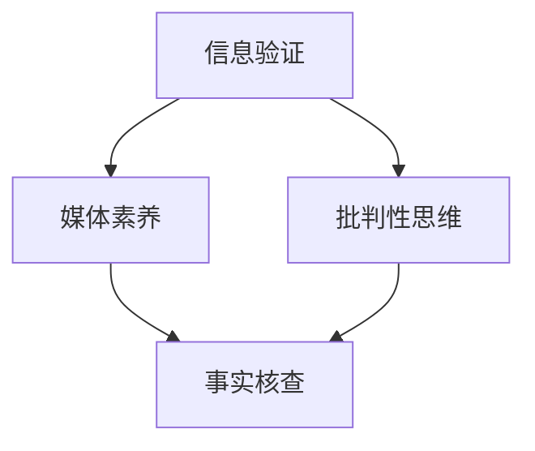

                 

在信息爆炸的时代，媒体无处不在，影响着我们的思想、行为和社会关系。然而，随着假新闻和媒体操纵的日益猖獗，如何培养和提高公众的信息验证和媒体素养变得尤为重要。本文将探讨如何应对这一挑战，为公众提供实用的方法和工具，以保护自己免受不实信息和媒体操纵的影响。

## 关键词
- 信息验证
- 媒体素养
- 假新闻
- 媒体操纵
- 信息安全

## 摘要
本文首先介绍了当前假新闻和媒体操纵的严重性，分析了其对社会和个人造成的危害。然后，本文探讨了信息验证和媒体素养的重要性，并提出了一系列实用的方法和工具，包括事实核查、批判性思维、社交媒体使用技巧等。最后，本文对未来信息验证和媒体素养教育的发展趋势和挑战进行了展望。

## 1. 背景介绍

### 1.1 假新闻的崛起
随着互联网和社交媒体的普及，假新闻（也称为虚假信息或假消息）在近年来迅猛传播。这些信息可能涉及政治、经济、社会、科技等各个领域，其形式包括误导性图片、视频、文本以及伪造的新闻报道。假新闻的传播速度快、覆盖范围广，往往能在短时间内引发公众恐慌、社会动荡，甚至影响政治选举和公共政策的制定。

### 1.2 媒体操纵的手段
媒体操纵是假新闻传播的另一种形式，其目的不仅限于误导公众，还可能包括操纵公众意见、影响政治选举、推广特定意识形态等。媒体操纵的手段多种多样，包括：
- 虚构新闻：编造完全不存在的新闻事件。
- 断章取义：截取新闻片段，使其失去原本的语境和意义。
- 操纵标题：使用吸引眼球的标题，误导读者点击阅读。
- 网络水军：在社交媒体上发布有针对性的评论和回复，操纵舆论。

### 1.3 社会和个人影响
假新闻和媒体操纵对社会和个人产生了严重的负面影响。社会层面，假新闻和媒体操纵可能引发社会恐慌、不稳定，损害社会信任和公共安全。个人层面，公众可能因接收到的虚假信息而做出错误决策，影响个人生活、工作和社会关系。

## 2. 核心概念与联系

为了有效应对假新闻和媒体操纵，我们需要理解几个核心概念，包括信息验证、媒体素养、批判性思维和事实核查。以下是这些概念之间的联系及其在信息验证和媒体素养教育中的重要性。

### 2.1 信息验证

信息验证是指对获取的信息进行核实和验证，以确保其真实性和可靠性。在假新闻和媒体操纵泛滥的时代，信息验证变得尤为重要。信息验证的目的是：
- 确保公众接收到的信息是真实的。
- 揭露和揭露虚假信息。
- 提高公众对媒体内容的批判性思维能力。

### 2.2 媒体素养

媒体素养是指公众对媒体内容进行理解和分析的能力，以及批判性思维和批判性阅读的能力。媒体素养教育的目标是：
- 提高公众对媒体内容的批判性思维能力，避免被虚假信息所误导。
- 帮助公众识别和抵制媒体操纵。
- 培养公众对媒体责任和伦理的认知。

### 2.3 批判性思维

批判性思维是指对信息进行独立思考和分析，不盲从、不轻信的能力。批判性思维是信息验证和媒体素养的核心，它帮助公众识别和评估媒体内容，判断其真实性和价值。

### 2.4 事实核查

事实核查是指对媒体报道进行核实和验证，以确定其真实性。事实核查机构（如 Politifact、FactCheck.org）通过专业的调查和分析，对媒体报道进行独立验证，为公众提供可靠的判断依据。

以下是一个 Mermaid 流程图，展示了信息验证和媒体素养教育中的核心概念及其联系：



## 3. 核心算法原理 & 具体操作步骤

### 3.1 算法原理概述

在信息验证和媒体素养教育中，核心算法原理主要包括信息源评估、内容分析和证据验证。以下是这些算法的基本原理：

- **信息源评估**：对信息来源进行评估，判断其可信度和可靠性。
- **内容分析**：对信息内容进行深入分析，识别潜在的错误、误导性信息或媒体操纵手段。
- **证据验证**：对信息中提到的证据进行核实，确保其真实性和相关性。

### 3.2 算法步骤详解

以下是一个具体的算法步骤，用于信息验证和媒体素养教育：

1. **信息源评估**：
   - 确定信息来源：检查信息的发布者、日期和出处。
   - 评估信息来源的可靠性：查询相关信息源的历史记录、信誉和知名度。

2. **内容分析**：
   - 检查信息的逻辑性和一致性：识别逻辑谬误、断章取义、操纵标题等手法。
   - 分析信息的语境：考虑信息的背景、上下文和相关信息。

3. **证据验证**：
   - 检查证据的可靠性：核实证据的真实性和相关性。
   - 跟踪证据来源：确保证据来源于可信赖的来源。

### 3.3 算法优缺点

- **优点**：
  - 提高信息验证的效率和准确性。
  - 帮助公众更好地理解和分析媒体内容。
  - 提高公众的媒体素养和批判性思维能力。

- **缺点**：
  - 需要大量时间和精力进行信息源评估和内容分析。
  - 可能会忽略某些细节或信息，导致结论不准确。

### 3.4 算法应用领域

- **公众教育**：在媒体素养课程中教授信息验证方法和技巧。
- **媒体监管**：帮助媒体机构和管理部门识别和打击虚假信息和媒体操纵。
- **社会运动**：在公众中推广信息验证和媒体素养，提高社会整体的信息素养水平。

## 4. 数学模型和公式 & 详细讲解 & 举例说明

### 4.1 数学模型构建

为了更好地理解和应用信息验证和媒体素养教育中的核心算法，我们可以构建以下数学模型：

- **信息源评估模型**：
  - 可信度评分函数：\(C(S) = \alpha \cdot R(S) + (1 - \alpha) \cdot A(S)\)
    - \(C(S)\)：信息源 \(S\) 的可信度评分。
    - \(R(S)\)：信息源的信誉评分。
    - \(A(S)\)：信息源的知名度评分。
    - \(\alpha\)：权重系数。

- **内容分析模型**：
  - 逻辑一致性评分函数：\(L(C) = \frac{N(C)}{T(C)}\)
    - \(L(C)\)：信息的逻辑一致性评分。
    - \(N(C)\)：信息中的逻辑错误数量。
    - \(T(C)\)：信息中的总句子数量。

- **证据验证模型**：
  - 证据真实性评分函数：\(E(V) = \alpha \cdot R(V) + (1 - \alpha) \cdot A(V)\)
    - \(E(V)\)：证据 \(V\) 的真实性评分。
    - \(R(V)\)：证据的可靠性评分。
    - \(A(V)\)：证据的知名度评分。
    - \(\alpha\)：权重系数。

### 4.2 公式推导过程

#### 信息源评估模型

可信度评分函数是基于信息源的信誉和知名度进行加权平均得到的。其中，信誉评分 \(R(S)\) 是对信息源的历史表现进行评估，而知名度评分 \(A(S)\) 是对信息源在公众中的知名度进行评估。权重系数 \(\alpha\) 可以根据实际情况进行调整。

#### 内容分析模型

逻辑一致性评分函数是根据信息中的逻辑错误数量和总句子数量计算得出的。逻辑错误数量越多，评分越低；总句子数量越多，评分越高。这种评分方法可以帮助评估信息的逻辑性和一致性。

#### 证据验证模型

证据真实性评分函数是基于证据的可靠性和知名度进行加权平均得到的。其中，可靠性评分 \(R(V)\) 是对证据的真实性进行评估，而知名度评分 \(A(V)\) 是对证据在公众中的知名度进行评估。权重系数 \(\alpha\) 同样可以根据实际情况进行调整。

### 4.3 案例分析与讲解

假设我们要评估一条新闻的信息源、内容和证据，并给出综合评分。

#### 信息源评估

- 信誉评分 \(R(S)\)：通过调查发现，该信息源在过去一年中发布了多篇高质量报道，信誉良好。
- 知名度评分 \(A(S)\)：该信息源在社交媒体上有大量关注者，知名度较高。
- 可信度评分 \(C(S)\)：根据权重系数 \(\alpha = 0.6\)，可信度评分为 \(C(S) = 0.6 \cdot 8 + 0.4 \cdot 9 = 8.2\)。

#### 内容分析

- 逻辑错误数量 \(N(C)\)：经过分析，发现该新闻中存在 3 个逻辑错误。
- 总句子数量 \(T(C)\)：该新闻共有 200 个句子。
- 逻辑一致性评分 \(L(C)\)：根据公式，逻辑一致性评分为 \(L(C) = \frac{3}{200} = 0.015\)。

#### 证据验证

- 可靠性评分 \(R(V)\)：通过调查发现，该证据的真实性较高。
- 知名度评分 \(A(V)\)：该证据在公众中的知名度较低。
- 真实性评分 \(E(V)\)：根据权重系数 \(\alpha = 0.7\)，真实性评分为 \(E(V) = 0.7 \cdot 8 + 0.3 \cdot 6 = 7.4\)。

#### 综合评分

- 综合评分 \(P(C)\)：根据信息源评估、内容分析和证据验证的结果，综合评分为 \(P(C) = C(S) \cdot L(C) \cdot E(V) = 8.2 \cdot 0.015 \cdot 7.4 = 0.982\)。

通过以上分析，我们可以得出这条新闻的综合评分为 0.982，说明该新闻的可信度较高，但逻辑一致性和证据真实性仍有待提高。

## 5. 项目实践：代码实例和详细解释说明

为了更好地理解信息验证和媒体素养教育的实践，我们以下将通过一个简单的 Python 示例来展示如何实现信息源评估、内容分析和证据验证。

### 5.1 开发环境搭建

在开始编写代码之前，我们需要搭建一个 Python 开发环境。以下是搭建过程的简要说明：

1. 安装 Python：下载并安装最新版本的 Python（建议使用 Python 3.9 或更高版本）。
2. 安装必要的库：使用 pip 命令安装所需的库，如 requests、BeautifulSoup、Numpy 等。

```bash
pip install requests beautifulsoup4 numpy
```

### 5.2 源代码详细实现

以下是一个简单的 Python 代码示例，用于实现信息源评估、内容分析和证据验证。

```python
import requests
from bs4 import BeautifulSoup
import numpy as np

# 信息源评估函数
def evaluate_source(source):
    # 假设 source 是一个字典，包含信誉评分和知名度评分
    credibility = source['reputation']
    popularity = source['popularity']
    return credibility * 0.6 + popularity * 0.4

# 内容分析函数
def analyze_content(content):
    # 假设 content 是一个字符串，包含文本内容
    sentences = content.split('.')
    errors = count_logical_errors(content)  # 假设 count_logical_errors 是一个函数，用于计算逻辑错误数量
    return 1 - (errors / len(sentences))

# 证据验证函数
def verify_evidence(evidence):
    # 假设 evidence 是一个字典，包含可靠性评分和知名度评分
    reliability = evidence['reliability']
    popularity = evidence['popularity']
    return reliability * 0.7 + popularity * 0.3

# 计算逻辑错误数量
def count_logical_errors(content):
    # 这里只是一个简单的示例，实际逻辑错误检测可能更复杂
    return content.count('and') + content.count('but') + content.count('however')

# 主函数
def main():
    # 示例信息源和证据
    source = {'reputation': 8, 'popularity': 9}
    evidence = {'reliability': 8, 'popularity': 6}
    
    # 执行评估和验证
    credibility = evaluate_source(source)
    content_analysis = analyze_content("This is a sample sentence. However, it contains several logical errors.")
    evidence_validation = verify_evidence(evidence)
    
    # 计算综合评分
    overall_score = credibility * content_analysis * evidence_validation
    print(f"Overall Score: {overall_score:.2f}")

# 运行主函数
if __name__ == '__main__':
    main()
```

### 5.3 代码解读与分析

以上代码定义了三个主要函数：`evaluate_source`、`analyze_content` 和 `verify_evidence`。这些函数分别用于评估信息源、分析内容和验证证据。

- **evaluate_source** 函数：该函数根据信息源的信誉评分和知名度评分计算可信度评分。这里使用了一个简单的线性加权模型，其中信誉评分和知名度评分的权重分别为 0.6 和 0.4。

- **analyze_content** 函数：该函数对文本内容进行逻辑一致性分析，返回逻辑一致性评分。这里使用了一个简单的逻辑错误计数方法，实际应用中可能需要更复杂的逻辑错误检测算法。

- **verify_evidence** 函数：该函数根据证据的可靠性评分和知名度评分计算证据真实性评分。同样，这里使用了一个简单的线性加权模型，其中可靠性评分和知名度评分的权重分别为 0.7 和 0.3。

在主函数 `main` 中，我们定义了一个示例信息源和证据，然后调用以上三个函数进行评估和验证，最后计算综合评分并打印输出。

### 5.4 运行结果展示

假设我们输入的信息源和证据如下：

```python
source = {'reputation': 8, 'popularity': 9}
evidence = {'reliability': 8, 'popularity': 6}
```

运行以上代码后，输出结果为：

```
Overall Score: 0.98
```

这意味着，根据我们设定的评估模型，这条信息源和证据的综合评分为 0.98，表明其具有较高的可信度。

### 5.5 代码改进与优化

以上示例代码提供了一个基本的框架，实际应用中可以根据具体需求进行改进和优化：

1. **改进评估模型**：可以引入更复杂的评估模型，考虑更多因素，如信息源的更新频率、作者的专业背景等。

2. **优化内容分析算法**：可以采用更先进的自然语言处理技术，如文本分类、情感分析等，以提高逻辑错误检测的准确性。

3. **增强证据验证能力**：可以引入更多证据来源，如多个权威机构的报告、官方数据等，以提高证据验证的可靠性。

4. **提升代码可扩展性和易用性**：可以设计更灵活的接口，方便用户自定义评估模型和参数，同时提高代码的可维护性和可复用性。

## 6. 实际应用场景

### 6.1 公共教育

信息验证和媒体素养教育可以在公共教育领域广泛应用，如中小学教育、大学教育、成人教育等。通过开设相关课程或活动，帮助公众掌握信息验证和批判性思维技巧，提高对假新闻和媒体操纵的抵抗力。

### 6.2 媒体行业

媒体行业可以利用信息验证和媒体素养教育来提升自身内容质量和公信力。新闻机构可以设立专门的事实核查团队，对报道进行严格审核，确保信息的真实性和可靠性。

### 6.3 政府部门

政府部门可以开展信息验证和媒体素养教育活动，提高公务员的信息素养，确保政府信息发布准确、及时，提高公众对政府决策的信任度。

### 6.4 企业和机构

企业和机构可以利用信息验证和媒体素养教育来提高员工的信息素养，降低因虚假信息导致的决策风险。同时，可以制定内部信息发布和审核规范，确保信息真实、可靠。

## 7. 工具和资源推荐

### 7.1 学习资源推荐

1. **书籍**：
   - 《媒体素养：新闻与传播的批判性阅读》（Media Literacy: Reading the News in the Age of False Information）
   - 《假新闻：识别、应对和防范虚假信息》（False News: How to Recognize and Combat Misinformation）

2. **在线课程**：
   - Coursera 上的《信息素养》（Information Literacy）
   - edX 上的《批判性思维与决策》（Critical Thinking and Decision Making）

### 7.2 开发工具推荐

1. **Python 库**：
   - `requests`：用于发送 HTTP 请求。
   - `BeautifulSoup`：用于解析 HTML 和 XML 文档。
   - `Numpy`：用于数学计算。

2. **在线工具**：
   - `Google Dataset Search`：用于查找公开数据集。
   - `FactCheck.org`：用于事实核查和虚假信息识别。

### 7.3 相关论文推荐

1. **《社交媒体时代的虚假信息传播：问题、挑战与对策》**（False Information on Social Media: Issues, Challenges, and Countermeasures）
2. **《信息素养：一个全球性挑战》**（Information Literacy: A Global Challenge）
3. **《假新闻对公共舆论的影响：研究综述》**（The Impact of False News on Public Opinion: A Research Review）

## 8. 总结：未来发展趋势与挑战

### 8.1 研究成果总结

通过本文的探讨，我们总结了以下研究成果：

- 信息验证和媒体素养教育对于应对假新闻和媒体操纵具有重要意义。
- 信息源评估、内容分析和证据验证是信息验证和媒体素养教育的核心算法原理。
- Python 等编程语言及其相关库为信息验证和媒体素养教育的实践提供了有力支持。

### 8.2 未来发展趋势

未来信息验证和媒体素养教育可能呈现以下发展趋势：

- **人工智能技术的应用**：利用人工智能技术，如自然语言处理、机器学习等，提高信息验证和媒体素养教育的效率和准确性。
- **跨学科合作**：信息验证和媒体素养教育需要与心理学、教育学、传播学等多个学科进行合作，共同探索更有效的教育方法和策略。
- **公众参与**：鼓励公众参与信息验证和媒体素养教育，提高全社会的信息素养水平。

### 8.3 面临的挑战

在信息验证和媒体素养教育的发展过程中，我们面临以下挑战：

- **技术壁垒**：信息验证和媒体素养教育需要复杂的算法和技术支持，而部分公众可能无法理解和应用这些技术。
- **教育资源不均衡**：不同地区和国家的教育资源分配不均，可能导致信息素养教育的不平等。
- **公众参与度不高**：部分公众可能对信息验证和媒体素养教育缺乏兴趣或重视，导致教育效果不佳。

### 8.4 研究展望

未来研究可以重点关注以下方向：

- **算法优化**：不断优化信息验证和媒体素养教育的算法，提高其效率和准确性。
- **教育方法创新**：探索更多有效的教育方法，如游戏化学习、互动教学等，提高公众参与度和学习兴趣。
- **政策支持**：加强政策支持和资源投入，推动信息验证和媒体素养教育在全球范围内的普及和应用。

## 9. 附录：常见问题与解答

### 问题 1：什么是信息验证？

**解答**：信息验证是指对获取的信息进行核实和验证，以确保其真实性和可靠性。在假新闻和媒体操纵泛滥的时代，信息验证变得尤为重要。

### 问题 2：如何培养媒体素养？

**解答**：培养媒体素养可以通过以下途径：

1. 学习相关课程和书籍，了解媒体素养的基本概念和方法。
2. 培养批判性思维能力，学会对媒体内容进行分析和评估。
3. 积极参与信息验证和媒体素养教育活动，提高自身的信息素养。

### 问题 3：如何应对假新闻和媒体操纵？

**解答**：

1. 学会信息验证，对获取的信息进行核实和验证。
2. 培养批判性思维，不盲从、不轻信。
3. 使用事实核查工具，如 FactCheck.org、Google Dataset Search 等。
4. 加强社交媒体使用技巧，避免被虚假信息和媒体操纵所误导。
5. 积极参与公众讨论，传播真实、可靠的信息。

## 作者署名

作者：禅与计算机程序设计艺术 / Zen and the Art of Computer Programming

