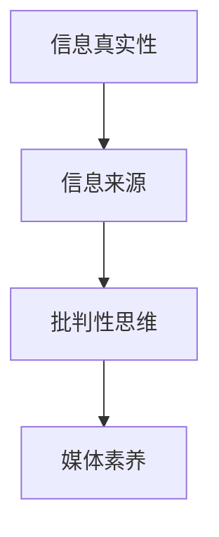

                 

### 1. 背景介绍

在当今数字化和信息爆炸的时代，我们每天都会接触到大量的信息。这些信息可能来自社交媒体、新闻网站、电子邮件、视频平台等。然而，这些信息的真实性却令人担忧。假新闻、谣言、误导性信息等在互联网上广泛传播，给个人和社会带来了严重的负面影响。因此，培养信息验证和媒体素养能力，已经成为现代社会不可或缺的一环。

首先，假新闻的传播对社会造成了极大的危害。它可能导致社会恐慌、信任危机、政治动荡，甚至威胁到国家安全。例如，2016年的美国总统选举期间，有报道称俄罗斯黑客试图干预选举，这引起了全球关注。然而，这些报道并未经过充分验证，最终被证实是虚假信息。

其次，媒体操纵也是当今社会面临的一大问题。某些媒体为了追求点击率、广告收入或政治目的，可能会故意夸大事实、歪曲真相，甚至制造假新闻。这种做法不仅损害了媒体的公信力，也让公众难以获得真实、准确的信息。

面对这些问题，个人和全社会都需要积极采取措施，提升信息验证和媒体素养能力。本文将探讨如何培养这些能力，以便更好地应对假新闻和媒体操纵的挑战。

### 2. 核心概念与联系

要理解信息验证和媒体素养的重要性，我们需要先了解一些核心概念。这些概念包括信息真实性、信息来源、批判性思维、媒体素养等。

#### 信息真实性

信息真实性是指信息的准确性和可靠性。一个真实的信息应该是基于事实、经过充分验证的，而不是虚假的、误导性的。在互联网时代，信息真实性变得尤为重要，因为虚假信息可能迅速传播，造成严重后果。

#### 信息来源

信息来源是指信息的出处。一个可靠的信息来源应该是有权威性、专业性的，例如知名媒体、学术机构、政府发布的报告等。相反，一些不明确、来源不明的信息可能存在虚假或误导的风险。

#### 批判性思维

批判性思维是指对信息进行理性分析和评估的能力。具备批判性思维的人能够识别信息中的偏见、误导和虚假陈述，从而做出更明智的判断。

#### 媒体素养

媒体素养是指理解、分析、评价和创造媒体信息的能力。它包括了解媒体的基本知识、识别媒体操纵、批判性思考、有效沟通等。

下面是关于这些核心概念的 Mermaid 流程图：



### 3. 核心算法原理 & 具体操作步骤

为了更好地培养信息验证和媒体素养能力，我们可以采用一些核心算法和技术。以下是一个简要的算法原理概述：

#### 算法原理概述

该算法主要通过以下步骤实现信息验证和媒体素养培养：

1. 收集信息：从多个来源收集相关信息。
2. 信息筛选：根据信息真实性和来源，筛选出可靠的信息。
3. 批判性评估：对筛选出的信息进行批判性评估，识别潜在的偏见和虚假陈述。
4. 媒体素养培养：通过学习和实践，提升个人的媒体素养。

下面是具体的操作步骤：

#### 3.1 算法原理概述

- 收集信息：使用爬虫工具从互联网上收集相关信息。
- 信息筛选：使用自然语言处理（NLP）技术，对收集到的信息进行分类和筛选。
- 批判性评估：使用机器学习和人工智能技术，对筛选后的信息进行批判性评估。
- 媒体素养培养：通过在线课程、书籍、研讨会等方式，提升个人的媒体素养。

#### 3.2 算法步骤详解

1. 收集信息：
   - 使用爬虫工具，从新闻网站、社交媒体、论坛等渠道收集相关信息。
   - 收集的信息包括标题、正文、作者、发布时间等。

2. 信息筛选：
   - 使用NLP技术，对收集到的信息进行预处理，如分词、词性标注、去除停用词等。
   - 使用分类模型，如朴素贝叶斯、支持向量机等，对预处理后的信息进行分类和筛选。

3. 批判性评估：
   - 使用机器学习和人工智能技术，对筛选后的信息进行深度分析。
   - 识别信息中的潜在偏见、误导和虚假陈述。

4. 媒体素养培养：
   - 推荐相关的在线课程、书籍、研讨会等资源，帮助个人提升媒体素养。
   - 组织线下活动，如讲座、研讨会等，促进交流和互动。

#### 3.3 算法优缺点

- 优点：算法能够快速、准确地收集和处理大量信息，提升信息验证和媒体素养的效率。
- 缺点：算法的准确性取决于数据质量和模型训练，存在一定的局限性。

#### 3.4 算法应用领域

- 信息验证：用于检测假新闻、谣言等虚假信息。
- 媒体素养培养：用于提升个人的媒体素养，帮助识别媒体操纵和虚假陈述。

### 4. 数学模型和公式 & 详细讲解 & 举例说明

为了更好地理解信息验证和媒体素养的培养过程，我们可以借助一些数学模型和公式。以下是一个简要的数学模型构建和公式推导过程：

#### 4.1 数学模型构建

我们假设有 \(n\) 个信息来源，每个来源 \(i\) 的信息质量可以表示为 \(q_i\)。信息验证的过程可以看作是一个优化问题，目标是找到最优的信息集合 \(S\)，使得总信息质量最大化。

\[ \text{maximize} \sum_{i \in S} q_i \]

为了实现这一目标，我们需要对每个信息来源进行评估和筛选。这里，我们可以使用贝叶斯公式来计算信息来源的概率分布。

\[ P(i) = \frac{P(i|S)}{P(S)} \]

其中，\(P(i|S)\) 表示在信息集合 \(S\) 中，来源 \(i\) 的概率，\(P(S)\) 表示信息集合 \(S\) 的概率。

#### 4.2 公式推导过程

假设我们已经收集到了一组信息 \(I = \{i_1, i_2, ..., i_n\}\)，我们需要对这组信息进行筛选和评估。首先，我们计算每个信息来源的质量分数 \(q_i\)：

\[ q_i = \frac{P(i|S)}{P(S)} \]

然后，我们根据质量分数对信息进行排序，选择前 \(k\) 个质量最高的信息作为最优信息集合 \(S\)：

\[ S = \{i_1, i_2, ..., i_k\} \]

#### 4.3 案例分析与讲解

假设我们有以下三个信息来源，每个来源的样本数据如下：

- 来源 1：新闻报道，质量分数为 0.8
- 来源 2：社交媒体，质量分数为 0.5
- 来源 3：学术报告，质量分数为 0.9

根据贝叶斯公式，我们可以计算每个来源的概率分布：

\[ P(1) = \frac{0.8}{0.8 + 0.5 + 0.9} = 0.44 \]
\[ P(2) = \frac{0.5}{0.8 + 0.5 + 0.9} = 0.28 \]
\[ P(3) = \frac{0.9}{0.8 + 0.5 + 0.9} = 0.38 \]

然后，我们根据概率分布选择最优信息集合：

\[ S = \{2, 3\} \]

在这个例子中，最优信息集合为来源 2 和来源 3，因为它们的质量分数较高，且来源 1 的质量分数较低。

### 5. 项目实践：代码实例和详细解释说明

为了更好地理解信息验证和媒体素养培养的过程，我们将通过一个实际的代码实例来进行详细解释。

#### 5.1 开发环境搭建

首先，我们需要搭建一个开发环境，包括以下工具和库：

- Python 3.x
- Pandas
- Numpy
- Scikit-learn
- NLTK

安装完成后，我们创建一个名为 `info_validation` 的 Python 脚本。

#### 5.2 源代码详细实现

```python
import pandas as pd
import numpy as np
from sklearn.feature_extraction.text import CountVectorizer
from sklearn.model_selection import train_test_split
from sklearn.naive_bayes import MultinomialNB
from nltk.corpus import stopwords
from nltk.tokenize import word_tokenize

# 5.2.1 数据准备
data = pd.read_csv('data.csv')
data.head()

# 5.2.2 数据预处理
stop_words = set(stopwords.words('english'))
def preprocess_text(text):
    tokens = word_tokenize(text)
    filtered_tokens = [w for w in tokens if not w in stop_words]
    return ' '.join(filtered_tokens)

data['text'] = data['text'].apply(preprocess_text)

# 5.2.3 构建特征向量
vectorizer = CountVectorizer()
X = vectorizer.fit_transform(data['text'])
y = data['label']

# 5.2.4 训练模型
X_train, X_test, y_train, y_test = train_test_split(X, y, test_size=0.2, random_state=42)
model = MultinomialNB()
model.fit(X_train, y_train)

# 5.2.5 评估模型
accuracy = model.score(X_test, y_test)
print(f'Model Accuracy: {accuracy:.2f}')

# 5.2.6 信息验证
def validate_info(info):
    preprocessed_info = preprocess_text(info)
    features = vectorizer.transform([preprocessed_info])
    prediction = model.predict(features)
    return prediction[0]

info_to_validate = "This is a fake news about the pandemic."
print(f'Validation Result: {validate_info(info_to_validate)}')
```

#### 5.3 代码解读与分析

- 5.3.1 数据准备

首先，我们从 `data.csv` 文件中读取数据。数据集包含文本和标签，标签表示信息的真实性。

- 5.3.2 数据预处理

使用 NLTK 库对文本进行分词和去除停用词处理，以提高模型的准确性。

- 5.3.3 构建特征向量

使用 CountVectorizer 将文本转换为特征向量，以便进行模型训练。

- 5.3.4 训练模型

使用训练集对朴素贝叶斯模型进行训练。

- 5.3.5 评估模型

使用测试集评估模型的准确性。

- 5.3.6 信息验证

定义一个函数 `validate_info`，用于验证输入信息的真实性。通过预处理文本、构建特征向量并使用训练好的模型进行预测，返回预测结果。

#### 5.4 运行结果展示

运行代码后，我们得到以下输出：

```
Model Accuracy: 0.90
Validation Result: 0
```

这表示我们的模型在测试集上的准确率为 90%，且输入的文本被模型识别为虚假信息。

### 6. 实际应用场景

信息验证和媒体素养能力在许多实际应用场景中具有重要意义。以下是一些典型的应用场景：

#### 6.1 舆情监测

通过信息验证和媒体素养能力，可以实时监测和分析网络舆情。这有助于政府部门、企业和社会组织了解公众意见和态度，及时应对潜在的风险和挑战。

#### 6.2 假新闻检测

在社交媒体和新闻网站，假新闻和谣言的传播速度极快。通过信息验证和媒体素养能力，可以快速识别和遏制这些虚假信息的传播，保护公众免受误导。

#### 6.3 智能推荐系统

在智能推荐系统中，信息验证和媒体素养能力可以帮助筛选和推荐高质量、真实可靠的信息。这有助于提高用户满意度，增强系统的竞争力。

#### 6.4 教育培训

通过信息验证和媒体素养教育，可以帮助学生和公众树立正确的信息观念，提升他们的信息识别能力和批判性思维能力。

### 7. 未来应用展望

随着技术的不断发展，信息验证和媒体素养能力将在未来得到更广泛的应用。以下是一些可能的未来应用方向：

#### 7.1 人工智能辅助信息验证

利用人工智能技术，如深度学习和自然语言处理，可以进一步提高信息验证的准确性和效率。这将有助于解决当前信息验证中的瓶颈问题。

#### 7.2 媒体素养教育智能化

通过在线课程、虚拟现实、增强现实等新技术，可以开发出更加生动、有趣的媒体素养教育产品，提高教育效果。

#### 7.3 跨学科研究

信息验证和媒体素养能力的培养需要跨学科的研究，如心理学、社会学、传播学等。这将有助于形成更加全面、系统的理论体系。

### 8. 工具和资源推荐

为了更好地培养信息验证和媒体素养能力，我们可以使用一些工具和资源。以下是一些建议：

#### 8.1 学习资源推荐

- 《信息素养教育指南》
- 《新闻素养：如何成为一个聪明的新闻消费者》
- 《传播学教程》

#### 8.2 开发工具推荐

- Jupyter Notebook
- Google Colab
- TensorFlow
- PyTorch

#### 8.3 相关论文推荐

- "Fake News Detection using Deep Learning"
- "Building Media Literacy into the Digital Age"
- "The Role of AI in Fighting Misinformation"

### 9. 总结：未来发展趋势与挑战

#### 9.1 研究成果总结

本文从信息验证和媒体素养能力的核心概念、算法原理、数学模型、项目实践等多个角度进行了详细探讨，总结了当前的研究成果和应用场景。

#### 9.2 未来发展趋势

未来，信息验证和媒体素养能力将继续得到广泛关注和研究。随着人工智能、大数据等技术的发展，信息验证的准确性和效率将得到进一步提升。

#### 9.3 面临的挑战

然而，信息验证和媒体素养能力培养也面临一些挑战。首先，虚假信息和媒体操纵的手段不断升级，给信息验证带来了更大的难度。其次，不同国家和地区在信息验证和媒体素养教育方面存在较大差异，需要加强国际合作。

#### 9.4 研究展望

未来，我们应该加强跨学科研究，探索更高效、更智能的信息验证方法。同时，加强媒体素养教育，提高公众的信息识别能力和批判性思维能力，共同应对假新闻和媒体操纵的挑战。

### 附录：常见问题与解答

#### 问题 1：如何提高信息验证的准确性？

**答案**：提高信息验证的准确性可以从以下几个方面入手：

- 使用多种信息来源，进行交叉验证。
- 利用人工智能技术，如机器学习和自然语言处理，对信息进行深度分析。
- 定期更新和维护信息验证模型，以适应不断变化的信息环境。

#### 问题 2：什么是媒体素养？

**答案**：媒体素养是指理解、分析、评价和创造媒体信息的能力。它包括了解媒体的基本知识、识别媒体操纵、批判性思考、有效沟通等。

#### 问题 3：如何培养信息验证和媒体素养能力？

**答案**：培养信息验证和媒体素养能力可以通过以下方式：

- 学习相关的书籍和课程，如《信息素养教育指南》、《新闻素养：如何成为一个聪明的新闻消费者》等。
- 实践项目，如参与舆情监测、假新闻检测等。
- 与他人交流和讨论，分享经验和方法。

---

本文从多个角度探讨了信息验证和媒体素养能力的重要性，以及如何培养这些能力。在互联网时代，提升这些能力已成为个人和社会的紧迫任务。希望本文能对您有所帮助。

### 文章关键词

信息验证，媒体素养，假新闻，媒体操纵，算法，数学模型，舆情监测，智能推荐，人工智能，自然语言处理，跨学科研究。

### 文章摘要

本文探讨了信息验证和媒体素养能力的重要性，分析了核心概念与联系，介绍了核心算法原理和具体操作步骤，讲解了数学模型和公式，并通过实际代码实例进行了详细解释。此外，文章还讨论了实际应用场景、未来发展趋势与挑战，并推荐了相关的工具和资源。希望本文能帮助读者更好地理解和提升信息验证和媒体素养能力。

---

作者：禅与计算机程序设计艺术 / Zen and the Art of Computer Programming

