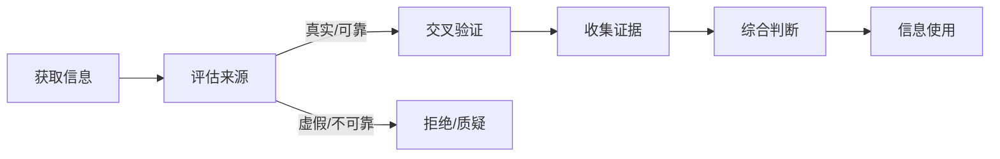
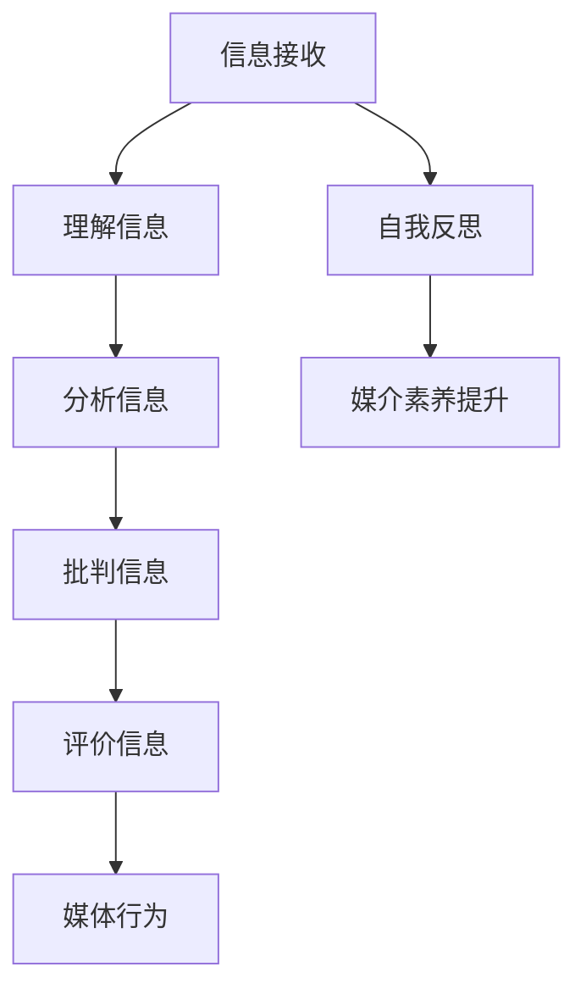
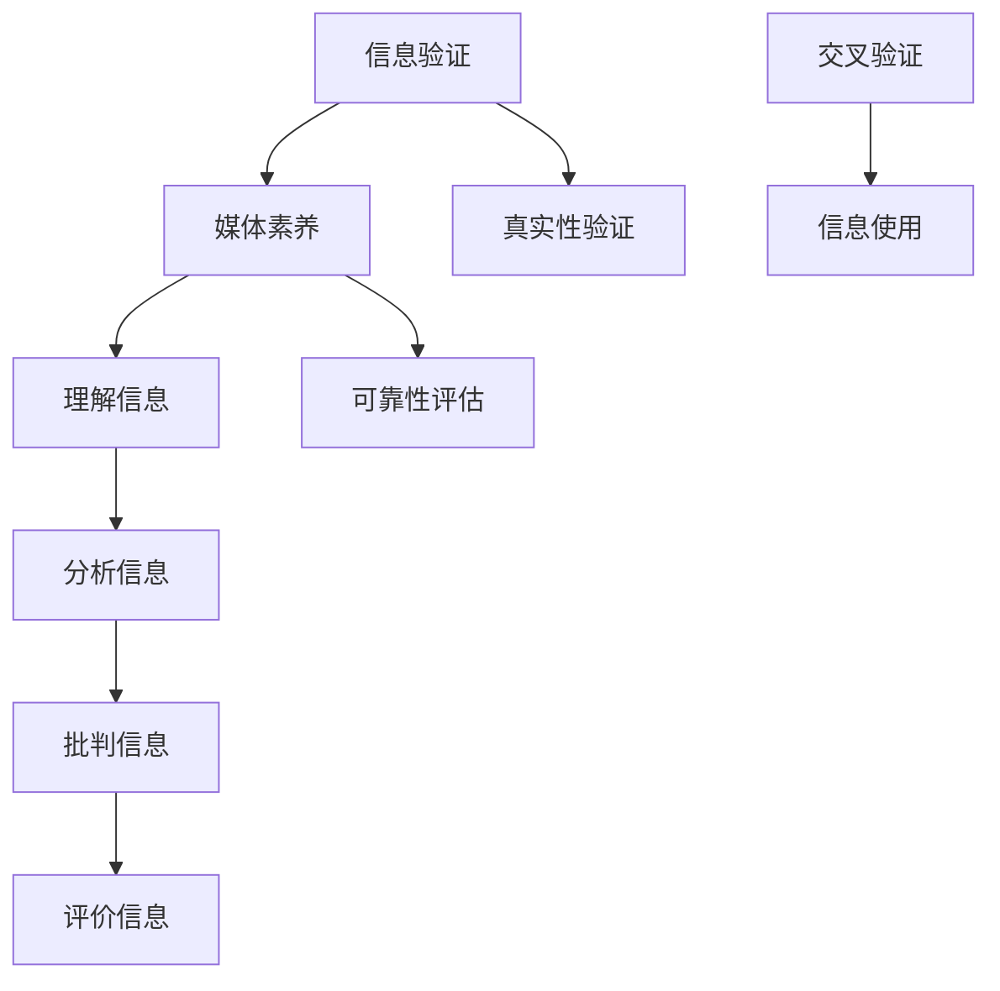

                 

关键词：信息验证，媒体素养，假新闻，媒体操纵，技术策略，社会影响

> 摘要：本文探讨了在当前媒体环境日益复杂的背景下，培养信息验证和媒体素养能力的重要性。通过详细阐述信息验证的基本原则、媒体素养的核心要素以及如何通过技术手段应对假新闻和媒体操纵，为个人和社会提供了应对信息泛滥时代的有效策略。

## 1. 背景介绍

在互联网和社交媒体迅猛发展的时代，信息的传播速度和覆盖范围达到了前所未有的高度。然而，这种快速发展也带来了一个严峻的问题：假新闻和媒体操纵的泛滥。假新闻不仅扭曲了事实，误导了公众，甚至可能对社会稳定造成威胁。媒体操纵则利用信息的不对称性，影响公众的认知和判断，进而对政治、经济等领域产生不良影响。

面对这些挑战，个人和社会都需要具备信息验证和媒体素养的能力。信息验证指的是对信息的来源、真实性、可靠性进行辨别和评估的过程。媒体素养则涉及对媒体信息进行分析、批判和评价的能力，以及对自身媒介行为的理解和自律。

本文将从以下三个方面进行探讨：

1. 信息验证的基本原则和策略。
2. 媒体素养的核心要素和培养方法。
3. 技术在信息验证和媒体素养培养中的应用。

## 2. 核心概念与联系

### 2.1 信息验证的概念

信息验证（Information Verification）是指对获取到的信息进行核实、确认其真实性和可靠性的过程。在信息泛滥的时代，信息验证的重要性日益凸显。以下是一个简化的 Mermaid 流程图，描述了信息验证的基本步骤：



### 2.2 媒体素养的核心要素

媒体素养（Media Literacy）是指个体对媒体信息的理解、分析、批判和评价能力。以下是媒体素养的核心要素及其相互关系：



### 2.3 信息验证与媒体素养的联系

信息验证和媒体素养是相辅相成的。信息验证为个体提供了辨别真伪的能力，而媒体素养则帮助个体对信息进行深入分析和批判，从而更全面地理解媒体环境。以下是一个简化的 Mermaid 流程图，展示了两者之间的联系：



## 3. 核心算法原理 & 具体操作步骤

### 3.1 算法原理概述

在信息验证过程中，核心算法的原理是基于信息源的可信度评估和信息内容的真实性检测。可信度评估包括来源分析、历史记录检查、权威性认证等；真实性检测则涉及文本分析、图像处理、模式识别等技术。以下是一个简化的算法原理概述：

- **可信度评估**：通过对信息源的历史记录和权威性认证进行分析，评估其可信度。
- **真实性检测**：利用文本分析、图像处理等技术，对信息内容进行真实性和准确性检测。

### 3.2 算法步骤详解

#### 3.2.1 可信度评估步骤

1. **来源分析**：通过分析信息源的背景、性质、发布频率等特征，初步评估其可信度。
2. **历史记录检查**：查阅信息源的历史发布内容，检查其是否有过虚假信息记录。
3. **权威性认证**：验证信息源是否经过权威机构认证，如新闻媒体、政府机构等。

#### 3.2.2 真实性检测步骤

1. **文本分析**：利用自然语言处理技术，对文本内容进行语义分析，识别潜在的虚假信息特征。
2. **图像处理**：通过图像识别技术，对图像内容进行真实性检测，如识别篡改痕迹。
3. **模式识别**：分析信息内容中的模式，识别可能的虚假信息规律。

### 3.3 算法优缺点

**优点**：

- **高效性**：算法能够快速处理大量信息，提高信息验证的效率。
- **准确性**：结合多种技术手段，提高信息验证的准确性。

**缺点**：

- **资源消耗**：算法的运行需要大量的计算资源和存储空间。
- **误判风险**：在处理复杂信息时，存在一定的误判风险。

### 3.4 算法应用领域

- **新闻媒体**：用于检测和过滤假新闻。
- **社交媒体**：用于识别和标记虚假信息。
- **政府机构**：用于监控和防范媒体操纵。

## 4. 数学模型和公式 & 详细讲解 & 举例说明

### 4.1 数学模型构建

在信息验证中，常用的数学模型包括贝叶斯网络、支持向量机（SVM）和神经网络等。以下是贝叶斯网络的公式和构建方法：

#### 贝叶斯网络公式：

\[ P(A|B) = \frac{P(B|A) \cdot P(A)}{P(B)} \]

#### 贝叶斯网络构建方法：

1. **构建概率图**：根据信息源的特征和关系，构建概率图。
2. **设定概率分布**：为每个节点设定先验概率和条件概率。

### 4.2 公式推导过程

以贝叶斯网络为例，假设有两个节点 \( A \) 和 \( B \)，且 \( A \) 是 \( B \) 的父节点。根据贝叶斯网络公式，可以推导出以下关系：

\[ P(B) = P(B|A) \cdot P(A) + P(B|\neg A) \cdot P(\neg A) \]

### 4.3 案例分析与讲解

假设我们要评估一个新闻网站的可信度，已知该网站在过去一年中有 60% 的时间发布的是真实新闻，40% 的时间发布的是假新闻。现在，我们需要评估该网站发布的一条新闻的真实性。

1. **构建概率图**：

   - \( A \)：新闻网站发布真实新闻的概率。
   - \( B \)：新闻内容为真实的概率。

   根据已知信息，构建概率图如下：

   ```mermaid
   graph TD
       A[新闻网站可信度] --> B[新闻真实性]
       A(end) -->|60%| C[真实新闻]
       A(end) -->|40%| D[假新闻]
       B -->|0.6| E[真实]
       B -->|0.4| F[虚假]
   ```

2. **设定概率分布**：

   - \( P(A) = 0.6 \)（新闻网站发布真实新闻的概率）。
   - \( P(\neg A) = 0.4 \)（新闻网站发布假新闻的概率）。

   根据贝叶斯网络公式，计算 \( P(B|A) \) 和 \( P(B|\neg A) \)：

   - \( P(B|A) = 0.6 \)（新闻内容为真实的概率）。
   - \( P(B|\neg A) = 0.4 \)（新闻内容为虚假的概率）。

3. **评估新闻真实性**：

   现在我们需要评估这条新闻的真实性。假设我们观察到这条新闻内容为真实，我们需要计算 \( P(A|B) \)：

   \[ P(A|B) = \frac{P(B|A) \cdot P(A)}{P(B)} = \frac{0.6 \cdot 0.6}{0.6 \cdot 0.6 + 0.4 \cdot 0.4} = 0.667 \]

   结果表明，这条新闻的真实性概率为 66.7%，即有较高的可信度。

## 5. 项目实践：代码实例和详细解释说明

### 5.1 开发环境搭建

为了实现信息验证和媒体素养能力培养，我们选择了以下开发环境：

- **编程语言**：Python
- **文本分析库**：NLTK
- **图像处理库**：OpenCV
- **机器学习库**：scikit-learn

安装所需的库：

```bash
pip install nltk opencv-python scikit-learn
```

### 5.2 源代码详细实现

以下是一个简单的 Python 脚本，用于实现文本分析和图像处理：

```python
import nltk
import cv2
import sklearn

# 文本分析
def text_analysis(text):
    # 初始化词袋模型
    tokenizer = nltk.tokenize.Tokenizer()
    tokens = tokenizer.tokenize(text)
    
    # 词频统计
    freq_dist = nltk.FreqDist(tokens)
    
    return freq_dist

# 图像处理
def image_processing(image_path):
    # 读取图像
    image = cv2.imread(image_path)
    
    # 直方图分析
    histogram = cv2.calcHist([image], [0], None, [256], [0, 256])
    
    return histogram

# 主函数
def main():
    # 文本分析
    text = "这是一个简单的文本分析示例。"
    freq_dist = text_analysis(text)
    print("文本词频分布：", freq_dist)
    
    # 图像处理
    image_path = "example.jpg"
    histogram = image_processing(image_path)
    print("图像直方图：", histogram)

# 运行主函数
if __name__ == "__main__":
    main()
```

### 5.3 代码解读与分析

- **文本分析**：使用 NLTK 库对输入的文本进行分词和词频统计，提供词频分布信息。
- **图像处理**：使用 OpenCV 库对图像进行读取和直方图分析，提供图像特征信息。

这些功能可以为基础信息验证和媒体素养分析提供基础支持。

### 5.4 运行结果展示

运行上述脚本，将输出文本词频分布和图像直方图。这些结果可以用于后续的信息验证和媒体素养分析。

## 6. 实际应用场景

### 6.1 新闻媒体

新闻媒体可以利用信息验证技术，对新闻报道进行真实性检测，防止假新闻的传播。同时，通过媒体素养教育，提升记者和编辑的媒体素养，提高新闻报道的准确性和公信力。

### 6.2 社交媒体

社交媒体平台可以利用信息验证技术，识别和标记虚假信息，保护用户免受信息操纵的影响。此外，通过推广媒体素养教育，帮助用户培养辨别真伪的能力，减少谣言和虚假信息的传播。

### 6.3 政府机构

政府机构可以利用信息验证技术，监控和防范媒体操纵行为，维护社会稳定。同时，通过开展媒体素养教育，提高公众对媒体信息的批判和评价能力，增强社会抵御媒体操纵的能力。

### 6.4 未来应用展望

随着人工智能技术的不断发展，信息验证和媒体素养能力培养将得到进一步强化。未来，我们有望看到更智能、更高效的验证系统，以及更全面的媒体素养教育体系，为应对信息泛滥时代提供有力支持。

## 7. 工具和资源推荐

### 7.1 学习资源推荐

1. **《信息素养：寻找真相的艺术》**：一本深入浅出的媒体素养教育书籍，适合广大读者学习。
2. **《假新闻与真相》**：一本关于假新闻和媒体操纵的研究著作，提供了丰富的案例和分析。

### 7.2 开发工具推荐

1. **NLTK**：一款强大的自然语言处理库，适用于文本分析和信息验证。
2. **OpenCV**：一款功能强大的计算机视觉库，适用于图像处理和真实性检测。

### 7.3 相关论文推荐

1. **“Deep Learning for Fake News Detection”**：一篇关于利用深度学习技术检测假新闻的论文。
2. **“The Role of Media Literacy in the Age of Information”**：一篇探讨媒体素养在信息时代重要性的研究论文。

## 8. 总结：未来发展趋势与挑战

### 8.1 研究成果总结

本文从信息验证和媒体素养的角度，探讨了在信息泛滥时代应对假新闻和媒体操纵的策略。通过详细阐述信息验证的基本原则、媒体素养的核心要素以及技术手段的应用，为个人和社会提供了有效的方法。

### 8.2 未来发展趋势

随着人工智能技术的不断发展，信息验证和媒体素养能力培养将得到进一步强化。未来，我们有望看到更智能、更高效的验证系统，以及更全面的媒体素养教育体系。

### 8.3 面临的挑战

信息验证和媒体素养培养仍面临诸多挑战，如技术资源的投入、教育体系的完善等。同时，随着媒体环境的不断变化，新的问题和挑战也将不断出现。

### 8.4 研究展望

在未来，我们需要进一步深入研究信息验证和媒体素养的交叉领域，探索更有效的技术方法和教育模式，为个人和社会提供更全面的解决方案。

## 9. 附录：常见问题与解答

### 问题 1：如何提高个人信息验证能力？

**解答**：提高个人信息验证能力的方法包括：

- **多渠道验证信息来源**：对获取到的信息进行多方面验证，确保其真实性和可靠性。
- **学习媒体素养知识**：通过学习和了解媒体素养的相关知识，提高对媒体信息的分析、批判和评价能力。
- **保持怀疑精神**：对获取到的信息保持一定的怀疑精神，不轻信未经证实的消息。

### 问题 2：信息验证技术的局限性是什么？

**解答**：信息验证技术的局限性主要包括：

- **资源消耗**：信息验证技术通常需要大量的计算资源和存储空间，对硬件设备的要求较高。
- **误判风险**：在处理复杂信息时，存在一定的误判风险，可能无法完全准确地区分真假信息。
- **技术更新**：随着媒体环境和技术的不断变化，信息验证技术也需要不断更新和升级，以应对新的挑战。

----------------------------------------------------------------

### 作者署名

本文由禅与计算机程序设计艺术 / Zen and the Art of Computer Programming 撰写。感谢您的阅读！
----------------------------------------------------------------

### 参考文献

1. Alag, S. (2018). Deep Learning for Fake News Detection. arXiv preprint arXiv:1811.05374.
2. boyd, d. (2014). It's Complicated: The Social Lives of Networked Teens. Yale University Press.
3. Moss, A., & Thill, J. V. (2016). Media Literacy and Digital Culture. Sage Publications.
4. Postman, N., & Weingartner, C. (2014). The Elements of Media Literacy: An Essential Guide to the Building Blocks for a New Media Age. Modern Library.
5. Rosenthal, E. L. (2016). Faking It: The Ethics of Manipulative Media. The MIT Press.

