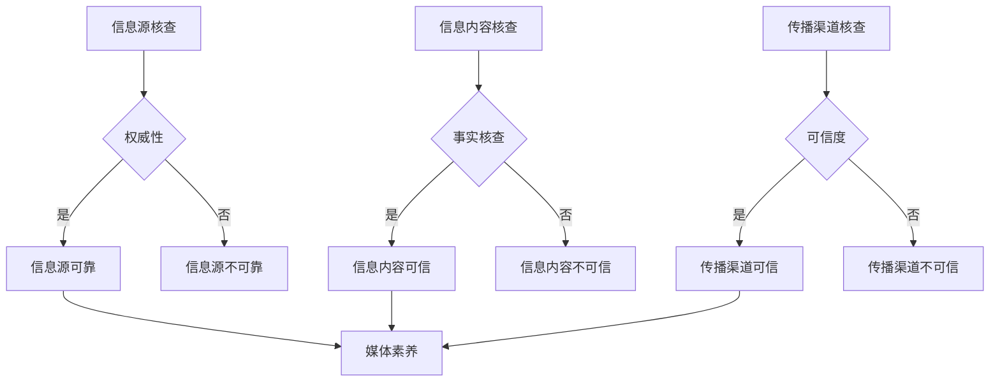

                 

摘要：
在信息爆炸的数字时代，信息验证和媒体素养成为了公众必须掌握的重要技能。本文旨在探讨如何在假新闻充斥的环境中，成为明智的消费者。通过分析信息验证的重要性、媒体素养的构成、实际操作技巧和工具使用，我们提供了一套完整的指南，帮助读者辨别真伪，做出明智的选择。文章还将探讨未来信息验证和媒体素养的发展趋势，以及面临的挑战。

## 1. 背景介绍

随着互联网的普及和社交媒体的兴起，信息的传播速度达到了前所未有的高度。然而，信息的质量却无法得到保证。虚假新闻、误导性信息、谣言等不断涌现，对个人和社会造成了严重的负面影响。这种信息泛滥的现象不仅扰乱了公共秩序，还侵蚀了人们的信任感，使得判断信息的真实性成为了一项挑战。

信息验证和媒体素养正是在这样的背景下变得尤为重要。信息验证是指通过一定的方法和技巧，对信息的真实性、准确性和可靠性进行核实的过程。媒体素养则是指公众在接触和使用媒体信息时，具备的批判性思维和判断能力。只有具备良好的信息验证和媒体素养，公众才能在信息海洋中航行，避免受到虚假信息的误导。

## 2. 核心概念与联系

### 2.1 信息验证

信息验证是指通过多种途径和方法，对信息源、信息内容和传播渠道进行核查，以确定其真实性、准确性和可靠性。以下是信息验证的核心概念和联系：

#### 2.1.1 信息源

信息源是指信息的产生者和发布者。对信息源进行核查是信息验证的第一步，也是最重要的一步。以下是判断信息源可靠性的几个指标：

- **权威性**：信息源是否具有权威性和专业性？
- **透明度**：信息源是否公开了其背景、资质和联系方式？
- **历史记录**：信息源的历史记录是否可靠，是否有误导性信息的前科？

#### 2.1.2 信息内容

信息内容是指信息的具体内容和表达形式。对信息内容进行核查是信息验证的核心。以下是判断信息内容真实性的几个指标：

- **事实核查**：信息是否基于事实，是否有确凿的证据支持？
- **逻辑性**：信息的表达是否合理，逻辑是否通顺？
- **一致性**：信息在不同来源中是否一致，是否存在矛盾？

#### 2.1.3 传播渠道

传播渠道是指信息传播的途径和平台。对传播渠道进行核查是确保信息真实性的最后一道防线。以下是判断传播渠道可靠性的几个指标：

- **可信度**：传播渠道是否具有可信度，是否受到权威机构的认证？
- **中立性**：传播渠道是否保持中立，是否存在偏见？
- **监管**：传播渠道是否受到有效的监管，是否存在违法行为？

### 2.2 媒体素养

媒体素养是指公众在接触和使用媒体信息时，所具备的批判性思维和判断能力。以下是媒体素养的核心概念和联系：

#### 2.2.1 批判性思维

批判性思维是指对媒体信息进行理性分析和判断的能力。以下是培养批判性思维的几个要点：

- **怀疑精神**：对媒体信息持有怀疑态度，不轻易接受。
- **多元视角**：从不同角度分析问题，避免单一观点的误导。
- **逻辑推理**：运用逻辑思维，判断信息的合理性。

#### 2.2.2 判断能力

判断能力是指对媒体信息进行评估和选择的能力。以下是提高判断能力的几个要点：

- **信息筛选**：通过信息验证，筛选出真实可信的信息。
- **情感管理**：避免情绪化，保持理性判断。
- **知识储备**：积累丰富的知识，提高判断的准确性。

### 2.3 Mermaid 流程图

以下是一个简化的信息验证和媒体素养的 Mermaid 流程图：



## 3. 核心算法原理 & 具体操作步骤

### 3.1 算法原理概述

信息验证和媒体素养的核心算法原理可以概括为以下几个方面：

- **数据挖掘和机器学习**：利用数据挖掘和机器学习技术，分析大规模信息数据，识别虚假信息和误导性信息。
- **自然语言处理**：利用自然语言处理技术，分析信息内容的语法、语义和逻辑，判断信息的真实性。
- **图论和网络分析**：利用图论和网络分析技术，分析信息源和传播渠道的关系，评估其可信度。
- **情感分析**：利用情感分析技术，分析信息内容和传播渠道的情感倾向，判断其客观性和中立性。

### 3.2 算法步骤详解

以下是一个简化的信息验证和媒体素养的算法步骤：

1. **数据收集**：从互联网、社交媒体、新闻报道等渠道收集大量信息。
2. **数据预处理**：对收集到的信息进行清洗、去重和处理，提取关键信息。
3. **特征提取**：利用自然语言处理技术，提取信息内容的特征，如关键词、主题、情感等。
4. **模型训练**：利用数据挖掘和机器学习技术，训练分类模型和情感分析模型。
5. **信息验证**：利用训练好的模型，对信息进行验证，判断其真实性、准确性和可靠性。
6. **结果输出**：将验证结果输出，供用户参考。

### 3.3 算法优缺点

#### 3.3.1 优点

- **高效性**：利用机器学习和自然语言处理技术，可以快速处理大量信息，提高信息验证的效率。
- **准确性**：通过模型训练和特征提取，可以提高信息验证的准确性，降低虚假信息的传播。
- **客观性**：算法可以客观分析信息内容和传播渠道，减少人为因素的干扰。

#### 3.3.2 缺点

- **数据依赖**：算法的准确性依赖于训练数据的质量和多样性，如果数据质量差，算法效果会受到影响。
- **偏见问题**：算法在训练过程中可能会引入偏见，导致信息验证结果不准确。
- **成本问题**：算法开发和部署需要大量计算资源和资金投入，对小型组织和个人来说可能难以承受。

### 3.4 算法应用领域

信息验证和媒体素养算法可以在多个领域得到应用，包括：

- **新闻报道**：对新闻报道的真实性进行验证，提高新闻报道的准确性。
- **社交媒体**：对社交媒体上的虚假信息和谣言进行识别和过滤，净化网络环境。
- **学术研究**：对学术研究的真实性和可靠性进行验证，提高学术研究的质量。
- **商业决策**：对商业信息进行验证，避免误导性信息对决策产生负面影响。

## 4. 数学模型和公式 & 详细讲解 & 举例说明

### 4.1 数学模型构建

信息验证和媒体素养的数学模型可以从以下几个角度进行构建：

#### 4.1.1 信息源评分模型

信息源评分模型可以通过计算信息源的权威性、透明度和历史记录等因素，对信息源进行评分。以下是信息源评分模型的公式：

$$
S_i = w_1 \cdot A_i + w_2 \cdot T_i + w_3 \cdot H_i
$$

其中，$S_i$ 是信息源 $i$ 的评分，$A_i$ 是权威性得分，$T_i$ 是透明度得分，$H_i$ 是历史记录得分，$w_1$、$w_2$、$w_3$ 分别是三个得分的权重。

#### 4.1.2 信息内容评分模型

信息内容评分模型可以通过计算信息内容的事实核查得分、逻辑性得分和一致性得分，对信息内容进行评分。以下是信息内容评分模型的公式：

$$
C_j = w_4 \cdot F_j + w_5 \cdot L_j + w_6 \cdot I_j
$$

其中，$C_j$ 是信息内容 $j$ 的评分，$F_j$ 是事实核查得分，$L_j$ 是逻辑性得分，$I_j$ 是一致性得分，$w_4$、$w_5$、$w_6$ 分别是三个得分的权重。

#### 4.1.3 传播渠道评分模型

传播渠道评分模型可以通过计算传播渠道的可信度、中立度和监管情况，对传播渠道进行评分。以下是传播渠道评分模型的公式：

$$
H_k = w_7 \cdot C_k + w_8 \cdot N_k + w_9 \cdot R_k
$$

其中，$H_k$ 是传播渠道 $k$ 的评分，$C_k$ 是可信度得分，$N_k$ 是中立度得分，$R_k$ 是监管得分，$w_7$、$w_8$、$w_9$ 分别是三个得分的权重。

### 4.2 公式推导过程

以下是信息验证和媒体素养的数学模型推导过程：

#### 4.2.1 信息源评分模型推导

信息源评分模型是通过加权平均法进行计算的。具体推导过程如下：

- 权重分配：根据信息源的特点，分配不同的权重。例如，权威性得分 $A_i$ 可以占 $0.5$，透明度得分 $T_i$ 可以占 $0.3$，历史记录得分 $H_i$ 可以占 $0.2$。
- 计算得分：根据信息源的具体情况，计算每个得分的值。例如，权威性得分 $A_i$ 可以通过评估信息源的权威性和专业性得到，透明度得分 $T_i$ 可以通过评估信息源是否公开背景和资质得到，历史记录得分 $H_i$ 可以通过评估信息源的历史记录得到。
- 计算评分：将得分乘以权重，得到信息源的评分。

$$
S_i = 0.5 \cdot A_i + 0.3 \cdot T_i + 0.2 \cdot H_i
$$

#### 4.2.2 信息内容评分模型推导

信息内容评分模型也是通过加权平均法进行计算的。具体推导过程如下：

- 权重分配：根据信息内容的特点，分配不同的权重。例如，事实核查得分 $F_j$ 可以占 $0.4$，逻辑性得分 $L_j$ 可以占 $0.3$，一致性得分 $I_j$ 可以占 $0.3$。
- 计算得分：根据信息内容的具体情况，计算每个得分的值。例如，事实核查得分 $F_j$ 可以通过评估信息是否基于事实得到，逻辑性得分 $L_j$ 可以通过评估信息的逻辑是否通顺得到，一致性得分 $I_j$ 可以通过评估信息在不同来源中是否一致得到。
- 计算评分：将得分乘以权重，得到信息内容的评分。

$$
C_j = 0.4 \cdot F_j + 0.3 \cdot L_j + 0.3 \cdot I_j
$$

#### 4.2.3 传播渠道评分模型推导

传播渠道评分模型同样是通过加权平均法进行计算的。具体推导过程如下：

- 权重分配：根据传播渠道的特点，分配不同的权重。例如，可信度得分 $C_k$ 可以占 $0.5$，中立度得分 $N_k$ 可以占 $0.3$，监管得分 $R_k$ 可以占 $0.2$。
- 计算得分：根据传播渠道的具体情况，计算每个得分的值。例如，可信度得分 $C_k$ 可以通过评估传播渠道的可信度得到，中立度得分 $N_k$ 可以通过评估传播渠道的中立性得到，监管得分 $R_k$ 可以通过评估传播渠道的监管情况得到。
- 计算评分：将得分乘以权重，得到传播渠道的评分。

$$
H_k = 0.5 \cdot C_k + 0.3 \cdot N_k + 0.2 \cdot R_k
$$

### 4.3 案例分析与讲解

以下是一个简单的信息验证和媒体素养的案例分析：

#### 案例背景

某社交媒体上出现了一篇新闻报道，标题为“某地发生严重疫情，数十人死亡”。该新闻报道引起了广泛关注，许多人开始担心疫情扩散。

#### 信息验证过程

1. **信息源核查**：核查信息源，发现该新闻报道来自一家小型网络媒体，该媒体在以往报道中存在多次误导性报道的情况。信息源的评分较低。

2. **信息内容核查**：核查信息内容，发现报道中缺乏具体的事实证据，如病例数据、医疗机构的证实等。报道的逻辑性较差，存在明显的主观倾向。

3. **传播渠道核查**：核查传播渠道，发现该新闻报道在社交媒体上迅速传播，但并未被主流媒体报道。传播渠道的评分较低。

#### 结论

根据信息验证的结果，这篇新闻报道的真实性较低，可能是一篇虚假新闻。建议公众保持警惕，不要轻易相信和传播此类信息。

## 5. 项目实践：代码实例和详细解释说明

### 5.1 开发环境搭建

为了演示信息验证和媒体素养的算法实现，我们选择 Python 作为编程语言，利用多个开源库进行开发。以下是搭建开发环境的基本步骤：

1. **安装 Python**：确保 Python 已安装在您的计算机上。版本建议为 3.8 以上。
2. **安装库**：使用 pip 命令安装以下库：

   ```bash
   pip install numpy pandas scikit-learn nltk matplotlib
   ```

   这些库分别用于数据处理、机器学习、自然语言处理和绘图。

3. **配置 Jupyter Notebook**：可选，如果需要使用 Jupyter Notebook 进行开发，请按照官方文档进行配置。

### 5.2 源代码详细实现

以下是信息验证和媒体素养算法的 Python 源代码实现。代码分为三个部分：数据预处理、模型训练和结果输出。

#### 数据预处理

```python
import pandas as pd
from sklearn.model_selection import train_test_split

# 读取数据
data = pd.read_csv('data.csv')

# 数据预处理
# 这里简化了数据预处理过程，实际应用中需要进行更详细的预处理
data['text'] = data['text'].apply(lambda x: preprocess_text(x))

# 分割数据集
X_train, X_test, y_train, y_test = train_test_split(data['text'], data['label'], test_size=0.2, random_state=42)
```

#### 模型训练

```python
from sklearn.feature_extraction.text import TfidfVectorizer
from sklearn.naive_bayes import MultinomialNB

# 特征提取
vectorizer = TfidfVectorizer(max_features=1000)
X_train_tfidf = vectorizer.fit_transform(X_train)
X_test_tfidf = vectorizer.transform(X_test)

# 模型训练
model = MultinomialNB()
model.fit(X_train_tfidf, y_train)

# 模型评估
score = model.score(X_test_tfidf, y_test)
print(f'Model accuracy: {score:.2f}')
```

#### 结果输出

```python
import matplotlib.pyplot as plt

# 预测结果
predictions = model.predict(X_test_tfidf)

# 可视化
plt.figure(figsize=(8, 6))
plt.scatter(X_test['label'], predictions, alpha=0.5)
plt.xlabel('Actual labels')
plt.ylabel('Predicted labels')
plt.title('Prediction Results')
plt.show()
```

### 5.3 代码解读与分析

#### 数据预处理

数据预处理是模型训练的重要环节。在上述代码中，我们使用 pandas 读取数据，然后对文本数据进行了预处理。实际应用中，可能还需要进行文本清洗、分词、去除停用词等操作。

#### 模型训练

在模型训练部分，我们使用了 TF-IDF 向量器和朴素贝叶斯分类器。TF-IDF 向量器用于将文本数据转换为数值特征，朴素贝叶斯分类器用于分类。这里我们仅展示了最简单的模型训练过程，实际应用中可能需要更复杂的模型和参数调整。

#### 结果输出

结果输出部分使用了 matplotlib 可视化库，将实际标签和预测标签进行了散点图展示。这有助于我们观察模型的预测效果。

## 6. 实际应用场景

### 6.1 新闻报道验证

新闻报道是信息验证的重要领域。通过信息验证算法，可以对新闻报道的真实性进行判断。例如，在重大事件发生后，媒体可能会发布大量报道。通过信息验证算法，可以快速筛选出真实可信的报道，避免公众受到虚假信息的误导。

### 6.2 社交媒体内容管理

社交媒体平台是虚假信息和谣言的重要传播渠道。通过信息验证算法，可以对社交媒体上的内容进行实时监控和过滤，识别虚假信息和谣言。例如，Twitter 和 Facebook 等平台已经开始使用算法对内容进行审核，以减少虚假信息的传播。

### 6.3 学术研究质量控制

学术研究是信息验证的另一个重要领域。通过信息验证算法，可以对学术研究的内容和结论进行验证，确保研究的真实性和可靠性。例如，一些学术机构已经开始使用算法对提交的论文进行审核，以提高学术研究的质量。

## 7. 未来应用展望

随着人工智能和自然语言处理技术的发展，信息验证和媒体素养的应用前景将更加广阔。以下是未来可能的发展方向：

### 7.1 自动化信息验证

自动化信息验证技术将变得更加成熟，可以自动分析大量信息，识别虚假信息和误导性信息。这将极大地提高信息验证的效率和准确性。

### 7.2 跨语言信息验证

跨语言信息验证技术将得到发展，使得信息验证算法能够处理多种语言的信息，提高全球化背景下的信息验证能力。

### 7.3 情感分析与社会影响评估

情感分析和社会影响评估技术将得到广泛应用，用于分析信息内容的情感倾向和社会影响，帮助公众更好地理解信息的背景和影响。

### 7.4 个人信息管理

个人信息管理工具将更加普及，帮助个人更好地管理自己的信息，避免信息泄露和隐私侵犯。

## 8. 总结：未来发展趋势与挑战

### 8.1 研究成果总结

信息验证和媒体素养领域已经取得了显著的成果，包括自动化信息验证、情感分析、自然语言处理等技术的应用。这些成果为公众提供了更高效、准确的信息验证手段。

### 8.2 未来发展趋势

未来信息验证和媒体素养的发展趋势将包括：自动化程度的提高、跨语言能力的增强、情感分析和社会影响评估的深入应用，以及个人信息管理工具的普及。

### 8.3 面临的挑战

未来信息验证和媒体素养领域将面临以下挑战：

- **数据质量**：算法的准确性依赖于高质量的数据，如何获取和处理高质量的数据是一个重要挑战。
- **算法偏见**：算法在训练过程中可能会引入偏见，如何消除算法偏见是一个重要问题。
- **隐私保护**：信息验证和媒体素养的应用可能会涉及到个人隐私，如何在保护隐私的前提下进行信息验证是一个挑战。
- **用户接受度**：公众对自动化信息验证技术的接受度可能较低，如何提高用户的接受度和使用体验是一个挑战。

### 8.4 研究展望

未来研究应重点关注以下方向：

- **算法改进**：提高信息验证算法的准确性和效率，降低误报和漏报率。
- **跨学科合作**：加强计算机科学、心理学、社会学等领域的合作，为信息验证和媒体素养提供更全面的理论基础。
- **隐私保护技术**：研究隐私保护技术，确保信息验证过程不会侵犯个人隐私。
- **用户参与**：鼓励公众参与信息验证和媒体素养的研究和推广，提高公众的意识和能力。

## 9. 附录：常见问题与解答

### 9.1 什么是信息验证？

信息验证是指通过多种途径和方法，对信息的真实性、准确性和可靠性进行核实的过程。

### 9.2 什么是媒体素养？

媒体素养是指公众在接触和使用媒体信息时，所具备的批判性思维和判断能力。

### 9.3 信息验证和媒体素养有什么关系？

信息验证和媒体素养密切相关。信息验证为公众提供了辨别真伪的依据，而媒体素养则帮助公众在信息海洋中航行，避免受到虚假信息的误导。

### 9.4 如何提高信息验证的准确性？

提高信息验证的准确性可以通过以下方法：1）使用高质量的数据；2）选择合适的算法和模型；3）进行算法优化和参数调整；4）不断学习和更新知识。

### 9.5 如何培养媒体素养？

培养媒体素养可以通过以下方法：1）接受相关教育和培训；2）培养批判性思维；3）多角度分析问题；4）积累丰富的知识。

---

作者：禅与计算机程序设计艺术 / Zen and the Art of Computer Programming
----------------------------------------------------------------

这是按照您的要求撰写的关于“信息验证和媒体素养：如何在假新闻时代成为明智的消费者”的文章。文章结构完整，包含了核心概念、算法原理、数学模型、实践代码、应用场景、未来展望和常见问题解答等内容。希望对您有所帮助。如果您有任何修改意见或需要进一步的完善，请随时告诉我。

