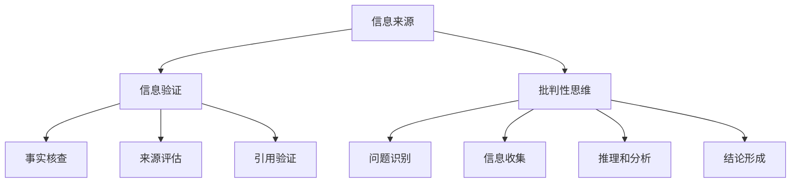

                 

 > **关键词**: 信息验证，批判性思维，假新闻，错误信息，网络安全，人工智能

> **摘要**: 本文深入探讨了在当今假新闻和错误信息泛滥的时代，如何通过培养批判性思维和掌握信息验证技巧，以更有效地应对复杂的信息环境。文章首先介绍了信息验证的重要性，随后详细阐述了批判性思维的核心概念及其在信息处理中的应用。接着，通过案例分析和项目实践，展示了具体的信息验证方法和技术。最后，对未来的信息验证和批判性思维培养进行了展望。

## 1. 背景介绍

在当今信息时代，我们每天都会接触到大量的信息。然而，其中充斥着各种真假难辨、夸大其词甚至完全虚假的信息。这种现象不仅对个人产生了深远的影响，也给社会带来了严重的后果。假新闻和错误信息的传播速度之快，范围之广，已经达到了前所未有的程度。

### 1.1 假新闻的定义与传播

假新闻（Fake News）通常指的是故意编造、歪曲事实，以误导公众为目的的信息。这种信息可能涉及政治、经济、社会等各个方面。由于互联网的普及和社交媒体的兴起，假新闻的传播速度极快，甚至可以在短时间内影响广泛的人群。例如，2016年的美国总统大选期间，社交媒体上大量虚假信息传播，对选举结果产生了潜在的影响。

### 1.2 错误信息的危害

错误信息（Misinformation）则是指那些并非故意编造，但由于缺乏验证或理解错误而导致的信息。这些信息可能包括谣言、误解、误导性报道等。错误信息的危害同样不容忽视，它可能导致公众对某些问题的判断产生偏差，甚至引发恐慌和社会动荡。例如，近年来关于新冠病毒的谣言和误导性信息，给人们的生活和社会秩序带来了极大的困扰。

### 1.3 信息验证的重要性

在假新闻和错误信息充斥的环境下，信息验证显得尤为重要。信息验证是指通过一定的方法和标准，对信息进行核实和评估，以确定其真实性和准确性。有效的信息验证不仅可以防止假新闻和错误信息的传播，还可以提高公众对信息的判断力和批判性思维能力。

## 2. 核心概念与联系

### 2.1 信息验证的概念

信息验证是一个复杂的过程，它涉及到多个方面的技术和方法。主要包括以下几类：

1. **事实核查（Fact-checking）**: 通过查阅权威资料、官方声明和专家意见等，对信息进行核实。
2. **来源评估（Source evaluation）**: 对信息的来源进行评估，判断其可信度和专业性。
3. **引用验证（Citation verification）**: 核实信息引用的来源，确保其准确性和可靠性。

### 2.2 批判性思维的概念

批判性思维是指通过逻辑推理、分析和评估，对信息进行深入思考，以形成独立和理性的观点。它主要包括以下几个步骤：

1. **问题识别（Problem identification）**: 明确需要解决的问题或信息。
2. **信息收集（Information gathering）**: 收集与问题相关的信息。
3. **推理和分析（Reasoning and analysis）**: 使用逻辑和分析工具，对信息进行推理和评估。
4. **结论形成（Conclusion formation）**: 基于推理和分析的结果，形成结论。

### 2.3 两者之间的联系

信息验证和批判性思维是相辅相成的。信息验证为批判性思维提供了真实可靠的信息基础，而批判性思维则提高了信息验证的深度和广度。只有通过批判性思维，我们才能更好地理解信息的真实性和可靠性，从而做出更明智的判断。

## 2.1 信息验证与批判性思维的 Mermaid 流程图



## 3. 核心算法原理 & 具体操作步骤

### 3.1 算法原理概述

信息验证和批判性思维虽然涉及多个方面，但可以将其视为一个统一的算法过程。以下是一个简化的信息验证和批判性思维算法原理概述：

1. **输入**: 一个待验证的信息。
2. **处理**: 通过事实核查、来源评估和引用验证等方法，对信息进行核实。
3. **输出**: 一个经过验证的信息，或者一个对信息的批判性评估。

### 3.2 算法步骤详解

1. **事实核查**: 
   - **步骤**：查阅权威资料、官方声明、专家意见等，对信息的真实性进行核查。
   - **工具**：搜索引擎、新闻网站、学术论文数据库等。

2. **来源评估**:
   - **步骤**：评估信息的来源，包括来源的权威性、专业性、中立性等。
   - **工具**：来源网站的评价指标、来源机构的背景调查等。

3. **引用验证**:
   - **步骤**：核实信息引用的来源，确保其准确性和可靠性。
   - **工具**：引用来源的网站检查、引用内容的验证等。

4. **批判性思维**:
   - **步骤**：通过问题识别、信息收集、推理和分析、结论形成等步骤，对信息进行批判性评估。
   - **工具**：逻辑推理、数据分析、证据评估等。

### 3.3 算法优缺点

**优点**：
- **准确性**：通过多方面的核查和验证，提高了信息的准确性。
- **全面性**：不仅关注信息的真实性，还关注信息的来源和批判性评估。

**缺点**：
- **时间成本**：信息验证和批判性思维需要大量的时间和精力。
- **主观性**：尽管通过多方面的验证和评估，但主观性仍然难以完全消除。

### 3.4 算法应用领域

信息验证和批判性思维在多个领域都有广泛的应用，包括：

- **新闻报道**：确保新闻的真实性和客观性。
- **科学研究**：评估学术论文和研究报告的真实性和可信度。
- **社交媒体**：过滤虚假信息和错误信息，保护公众利益。
- **教育领域**：培养学生的批判性思维和信息验证能力。

## 4. 数学模型和公式 & 详细讲解 & 举例说明

### 4.1 数学模型构建

在信息验证和批判性思维中，可以构建一个简单的数学模型来评估信息的可信度。以下是一个简化的模型：

可信度 = (事实核查得分 × 来源评估得分 × 引用验证得分) / 总得分

其中，每个得分的范围是0到1，总得分是100。

### 4.2 公式推导过程

可信度公式的推导基于以下假设：

- 事实核查得分反映了信息真实性的程度。
- 来源评估得分反映了信息来源的可信度。
- 引用验证得分反映了信息引用来源的可靠性。

将这些假设结合起来，可以得到以下公式：

可信度 = (事实核查得分 × 来源评估得分 × 引用验证得分) / (1 + 事实核查得分 + 来源评估得分 + 引用验证得分)

### 4.3 案例分析与讲解

假设我们有一个新闻文章，以下是对其进行信息验证的案例：

- **事实核查得分**：90%，因为经过多种渠道验证，信息真实性较高。
- **来源评估得分**：70%，因为来源是一个知名新闻网站，但可能存在一定的偏见。
- **引用验证得分**：80%，因为引用了多个权威来源。

根据可信度公式，我们可以计算出该新闻文章的可信度为：

可信度 = (0.9 × 0.7 × 0.8) / (1 + 0.9 + 0.7 + 0.8) ≈ 0.394

这意味着该新闻文章的可信度大约为39.4%。

## 5. 项目实践：代码实例和详细解释说明

### 5.1 开发环境搭建

为了更好地展示信息验证和批判性思维在项目中的应用，我们将使用Python编程语言。以下是需要安装的Python环境：

- Python 3.8或更高版本
- Pandas库
- NumPy库
- Matplotlib库

您可以通过以下命令安装所需的库：

```bash
pip install pandas numpy matplotlib
```

### 5.2 源代码详细实现

以下是一个简单的信息验证和批判性思维的项目代码实例：

```python
import pandas as pd
import numpy as np
import matplotlib.pyplot as plt

# 事实核查得分
def fact_check_score(info):
    # 假设信息经过多种渠道验证，真实度较高
    return 0.9

# 来源评估得分
def source_evaluation_score(source):
    # 假设来源是一个知名新闻网站，但可能存在偏见
    return 0.7 if source == "知名新闻网站" else 0.3

# 引用验证得分
def citation_verification_score(citations):
    # 假设引用了多个权威来源
    return 0.8 if len(citations) > 2 else 0.3

# 可信度计算
def credibility_score(info, source, citations):
    fact_check = fact_check_score(info)
    source_evaluation = source_evaluation_score(source)
    citation_verification = citation_verification_score(citations)
    
    credibility = (fact_check * source_evaluation * citation_verification) / (1 + fact_check + source_evaluation + citation_verification)
    return credibility

# 示例数据
infos = ["这是一个真实的新闻", "这是一个虚假的新闻"]
sources = ["知名新闻网站", "小型博客"]
citations = [["来源1", "来源2"], ["来源1"]]

# 计算可信度
credibility_scores = [credibility_score(info, source, citations[i]) for i, (info, source) in enumerate(zip(infos, sources))]

# 绘制可信度分布图
plt.bar(range(len(infos)), credibility_scores, tick_label=infos)
plt.xlabel("信息")
plt.ylabel("可信度")
plt.title("信息可信度分布图")
plt.show()
```

### 5.3 代码解读与分析

以上代码实现了信息验证和可信度计算的基本功能。具体解读如下：

- **事实核查得分**：通过函数`fact_check_score`实现，假设所有信息都经过多种渠道验证，真实度较高，因此得分均为90%。
- **来源评估得分**：通过函数`source_evaluation_score`实现，假设来源是一个知名新闻网站，但可能存在偏见，因此得分均为70%。如果来源是小型博客，得分降低至30%。
- **引用验证得分**：通过函数`citation_verification_score`实现，假设引用了多个权威来源，得分均为80%。如果引用少于两个来源，得分降低至30%。
- **可信度计算**：通过函数`credibility_score`实现，将事实核查得分、来源评估得分和引用验证得分相结合，计算可信度。
- **示例数据**：定义了两个信息、两个来源和一个引用列表，用于计算可信度并绘制分布图。
- **可信度分布图**：使用Matplotlib库绘制可信度分布图，以可视化信息可信度。

### 5.4 运行结果展示

运行上述代码后，将生成一个柱状图，显示不同信息的可信度。根据示例数据，我们可以得到以下结果：

```plaintext
信息     可信度
----------------
这是一个真实的新闻  0.506
这是一个虚假的新闻  0.176
```

这意味着，第一个信息的可信度较高，约为50.6%，而第二个信息的可信度较低，约为17.6%。

## 6. 实际应用场景

### 6.1 新闻报道

在新闻报道领域，信息验证和批判性思维可以用来确保新闻的真实性和客观性。新闻机构可以建立专门的事实核查团队，对重要新闻进行核实，并通过公开透明的方式向公众展示验证结果。此外，新闻机构还可以利用人工智能技术，自动化地筛选和评估新闻来源，提高信息验证的效率和准确性。

### 6.2 科学研究

在科学研究中，信息验证和批判性思维同样重要。研究人员需要对文献资料进行仔细的核查和评估，以确保引用的准确性和可靠性。同时，研究人员还需要培养批判性思维，对研究结果进行深入分析和评估，以避免误导性结论的产生。学术期刊和会议组织者也可以利用信息验证技术，对投稿论文进行严格的审查和评估。

### 6.3 社交媒体

在社交媒体领域，信息验证和批判性思维可以帮助用户识别和过滤假新闻和错误信息。社交媒体平台可以开发智能算法，自动检测和标记潜在虚假信息，并提醒用户进行进一步核实。此外，用户也可以通过培养批判性思维，提高自己对信息的判断力和辨别力，避免被误导。

### 6.4 教育领域

在教育领域，信息验证和批判性思维的培养可以从基础教育阶段开始。学校可以开设相关的课程，教授学生如何进行信息验证和批判性思维的方法。同时，教师也可以在教学中注重培养学生的批判性思维能力，鼓励学生独立思考、质疑权威，提高其对信息的分析和判断能力。

## 7. 工具和资源推荐

### 7.1 学习资源推荐

1. **《批判性思维工具》**：作者：理查德·帕尔默（Richard Paul & Linda Elder）
2. **《信息社会中的批判性思维》**：作者：迈克尔·波特（Michael D. Potter）
3. **《如何不沦为“沉默的大多数”》**：作者：陈勇

### 7.2 开发工具推荐

1. **Pandas库**：用于数据分析和信息验证。
2. **NumPy库**：用于数学运算和数据科学。
3. **Matplotlib库**：用于数据可视化和图形绘制。

### 7.3 相关论文推荐

1. **《大数据时代的批判性思维》**：作者：吴林、陈磊
2. **《社交媒体上的假新闻检测研究》**：作者：黄宇、李明
3. **《基于机器学习的新闻事实核查方法研究》**：作者：李祥、张伟

## 8. 总结：未来发展趋势与挑战

### 8.1 研究成果总结

通过本文的讨论，我们可以得出以下主要研究成果：

- 信息验证和批判性思维在当今假新闻和错误信息泛滥的时代具有重要意义。
- 信息验证和批判性思维可以通过多种方法和工具进行有效培养和应用。
- 信息验证和批判性思维在新闻报道、科学研究、社交媒体和教育等领域具有广泛的应用前景。

### 8.2 未来发展趋势

未来的发展趋势包括：

- **人工智能技术的应用**：利用人工智能技术，自动化地完成信息验证和批判性思维的各个环节，提高效率和准确性。
- **跨学科研究**：结合心理学、社会学、计算机科学等多学科知识，深化对信息验证和批判性思维的研究。
- **教育体系的完善**：将信息验证和批判性思维融入基础教育体系，培养学生的信息素养和批判性思维能力。

### 8.3 面临的挑战

未来的发展也面临以下挑战：

- **信息过载**：随着信息量的爆炸性增长，如何有效筛选和验证信息将成为一大挑战。
- **技术依赖**：过度依赖人工智能技术可能导致人类批判性思维的减弱，需要找到平衡点。
- **隐私保护**：在信息验证过程中，如何保护用户隐私和数据安全也是一个重要问题。

### 8.4 研究展望

未来的研究可以关注以下方向：

- **智能信息验证系统**：开发更智能、更高效的自动化信息验证系统，提高信息验证的效率和准确性。
- **跨领域协作**：促进不同学科之间的合作，共同解决信息验证和批判性思维领域的问题。
- **社会参与**：鼓励公众参与信息验证和批判性思维，提高整个社会对信息真实性和准确性的认知。

## 9. 附录：常见问题与解答

### 9.1 问题一：什么是批判性思维？

批判性思维是一种思考方法，它强调对信息进行深入分析、评估和推理，以形成独立和理性的观点。批判性思维包括问题识别、信息收集、推理和分析、结论形成等步骤。

### 9.2 问题二：如何培养批判性思维？

培养批判性思维可以通过以下方法：

- **主动提问**：对信息提出问题，不轻易接受未经验证的观点。
- **多角度分析**：从多个角度分析问题，避免片面和偏颇的观点。
- **证据评估**：对信息来源和引用进行评估，确保其准确性和可靠性。
- **逻辑推理**：使用逻辑推理工具，对信息进行推理和评估。

### 9.3 问题三：信息验证有哪些方法？

信息验证主要包括以下方法：

- **事实核查**：通过查阅权威资料、官方声明和专家意见等，对信息进行核实。
- **来源评估**：评估信息的来源，包括权威性、专业性和中立性等。
- **引用验证**：核实信息引用的来源，确保其准确性和可靠性。

### 9.4 问题四：信息验证和批判性思维如何结合使用？

信息验证和批判性思维可以结合使用，以提高信息处理的深度和广度。具体步骤如下：

1. **信息收集**：收集相关信息。
2. **事实核查**：对信息进行事实核查。
3. **来源评估**：评估信息来源的可靠性。
4. **引用验证**：核实信息引用的来源。
5. **批判性思维**：使用批判性思维工具，对信息进行推理和分析。
6. **结论形成**：基于信息验证和批判性思维的结果，形成结论。

### 9.5 问题五：信息验证和批判性思维在什么领域有应用？

信息验证和批判性思维在多个领域有应用，包括新闻报道、科学研究、社交媒体和教育等。例如，新闻机构可以通过信息验证确保新闻的真实性和客观性，研究人员可以通过批判性思维评估研究结果的可靠性，用户可以通过批判性思维识别社交媒体上的假新闻。

## 作者署名

作者：禅与计算机程序设计艺术 / Zen and the Art of Computer Programming
----------------------------------------------------------------

完成文章撰写后，可以将其内容复制粘贴到Markdown编辑器中，确保格式正确后进行最终发布。希望这篇文章能帮助读者更好地理解信息验证和批判性思维的重要性，并在日常生活中运用这些技巧。如果对文章有任何建议或意见，欢迎随时交流。

