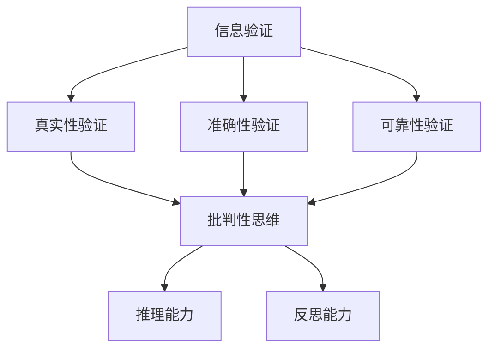

                 

 关键词：信息验证，批判性思维，假新闻，错误信息，信息导航，算法，技术

> 摘要：在数字时代，信息过载和假新闻的泛滥成为社会问题。本文旨在探讨如何通过培养批判性思维能力和运用信息验证技术，帮助读者在信息泛滥的环境中准确导航，提高信息素养，构建可靠的知识体系。

## 1. 背景介绍

随着互联网的普及和社交媒体的发展，信息传播的速度和广度前所未有。然而，这一现象也带来了信息验证的挑战。假新闻、错误信息、虚假广告等不良信息不断涌现，给公众认知和社会秩序带来了严重干扰。面对海量信息，如何辨别真伪、提高信息鉴别能力成为了一个迫切需要解决的问题。

批判性思维能力则是在这一背景下被广泛重视的能力。它是指通过理性的分析和判断，对信息进行深入思考，从而形成独立的见解和判断。在信息验证中，批判性思维能够帮助我们克服认知偏差，避免盲目接受信息，从而更好地识别和筛选真实可靠的信息。

本文将围绕信息验证和批判性思维能力展开，探讨其在假新闻和错误信息环境中的应用，并提供一系列实践方法和工具。

## 2. 核心概念与联系

### 2.1 信息验证的基本概念

信息验证是指通过一系列方法和手段，对信息的真实性、准确性和可靠性进行核查和确认的过程。信息验证的基本概念包括以下几个方面：

- **真实性验证**：确认信息的来源是否可靠，信息是否被篡改或伪造。
- **准确性验证**：验证信息的表述是否与事实相符，数据是否准确无误。
- **可靠性验证**：评估信息发布者的信誉、专业性和发布动机。

### 2.2 批判性思维能力的内涵

批判性思维能力是指通过理性分析和评估，对信息进行深入思考，形成独立见解和判断的能力。其内涵主要包括以下几个方面：

- **分析能力**：对信息进行逻辑分析和评估，识别其中的逻辑漏洞和错误。
- **评价能力**：评估信息来源的可靠性、信息的真实性和准确性。
- **推理能力**：运用逻辑推理，将已知信息整合成新的观点或结论。
- **反思能力**：对自身思维过程进行反思，识别并修正认知偏差。

### 2.3 两者之间的联系

信息验证和批判性思维能力密切相关。批判性思维能力是进行信息验证的基础，只有具备批判性思维能力，才能在信息验证过程中有效地识别和排除错误信息。同时，信息验证的过程也能够锻炼和提高批判性思维能力。通过不断地验证信息，读者可以加深对信息的理解，培养独立思考的能力。

下面是一个简单的 Mermaid 流程图，展示信息验证与批判性思维能力之间的关系。



## 3. 核心算法原理 & 具体操作步骤

### 3.1 算法原理概述

信息验证算法主要基于以下原理：

- **数据源分析**：通过分析信息来源的可靠性、权威性和专业性，判断信息的可信度。
- **信息比对**：通过比对信息与已知的权威数据源或事实，验证信息的准确性。
- **逻辑推理**：运用逻辑推理和批判性思维，识别信息中的逻辑错误和矛盾。

### 3.2 算法步骤详解

#### 步骤一：数据源分析

1. **评估信息来源**：检查信息发布者的身份、信誉和专业背景。
2. **审查发布平台**：评估信息发布平台的声誉、权威性和可信度。

#### 步骤二：信息比对

1. **交叉验证**：将信息与多个权威数据源进行比对，确认信息的准确性。
2. **事实核查**：利用事实核查工具，验证信息的真实性。

#### 步骤三：逻辑推理

1. **识别逻辑错误**：运用批判性思维，识别信息中的逻辑错误和矛盾。
2. **推理和验证**：基于已知信息，运用逻辑推理形成新的判断或结论。

### 3.3 算法优缺点

**优点**：

- **高效性**：算法能够快速处理大量信息，提高信息验证的效率。
- **客观性**：算法基于数据和逻辑，减少了主观因素的干扰。

**缺点**：

- **依赖数据源**：算法的性能取决于数据源的可靠性。
- **无法应对复杂情境**：在信息复杂、矛盾或涉及专业知识的情境下，算法可能无法有效验证信息。

### 3.4 算法应用领域

- **新闻媒体**：对新闻报道进行事实核查，提高新闻报道的准确性。
- **金融行业**：对财务报告和信息进行验证，防范金融欺诈。
- **教育领域**：培养学生批判性思维和信息验证能力。

## 4. 数学模型和公式 & 详细讲解 & 举例说明

### 4.1 数学模型构建

信息验证的数学模型可以基于概率论和统计学。具体而言，可以采用以下模型：

- **贝叶斯网络**：用于表示信息来源、信息内容和信息验证之间的关系。
- **一致性检验**：用于检验信息的一致性和准确性。

### 4.2 公式推导过程

#### 贝叶斯网络模型

贝叶斯网络是一种概率图模型，用于表示变量之间的条件依赖关系。在信息验证中，贝叶斯网络可以用于计算信息来源的可信度。

假设有变量 X（信息来源）、Y（信息内容）和 Z（信息验证结果），贝叶斯网络可以表示为：

\[ P(X, Y, Z) = P(X)P(Y|X)P(Z|X, Y) \]

其中，\( P(X) \) 为信息来源的先验概率，\( P(Y|X) \) 为信息内容在特定信息来源下的条件概率，\( P(Z|X, Y) \) 为信息验证结果在特定信息来源和信息内容下的条件概率。

#### 一致性检验模型

一致性检验模型用于检验信息的准确性。假设有变量 X（数据集）、Y（假设）和 Z（验证结果），一致性检验的公式为：

\[ H(X|Y) = \frac{P(X|Y)P(Y)}{P(X)} \]

其中，\( H(X|Y) \) 为在假设 Y 下的数据集 X 的后验概率，\( P(X|Y) \) 为在假设 Y 下的数据集 X 的条件概率，\( P(Y) \) 为假设 Y 的先验概率，\( P(X) \) 为数据集 X 的先验概率。

### 4.3 案例分析与讲解

#### 贝叶斯网络案例

假设有两条信息 A 和 B，信息 A 的来源可信度较高，信息 B 的来源可信度较低。我们需要通过贝叶斯网络计算这两条信息的可信度。

- **先验概率**：假设信息 A 和信息 B 的先验概率分别为 0.8 和 0.2。
- **条件概率**：假设信息 A 和信息 B 的条件概率分别为 0.95 和 0.1。

根据贝叶斯网络模型，我们可以计算出：

\[ P(A|可信度) = \frac{P(可信度|A)P(A)}{P(可信度)} \]

其中，\( P(可信度|A) \) 为信息 A 在可信度条件下的条件概率，\( P(A) \) 为信息 A 的先验概率。

根据假设，我们可以计算出：

\[ P(A|可信度) = \frac{0.95 \times 0.8}{0.95 \times 0.8 + 0.1 \times 0.2} \approx 0.947 \]

这意味着在可信度条件下，信息 A 的可信度约为 94.7%。

#### 一致性检验案例

假设我们有以下数据集 X：

\[ X = [1, 2, 3, 4, 5, 6, 7, 8, 9, 10] \]

我们需要验证假设 Y：数据集 X 是随机生成的。

根据假设，我们可以计算出：

\[ H(X|Y) = \frac{P(X|Y)P(Y)}{P(X)} \]

其中，\( P(X|Y) \) 为在假设 Y 下的数据集 X 的条件概率，\( P(Y) \) 为假设 Y 的先验概率，\( P(X) \) 为数据集 X 的先验概率。

根据假设，我们可以计算出：

\[ P(X|Y) = 0.5 \]

\[ P(Y) = 0.5 \]

\[ P(X) = 1 \]

代入公式，我们可以计算出：

\[ H(X|Y) = \frac{0.5 \times 0.5}{1} = 0.5 \]

这意味着在假设 Y 下，数据集 X 的后验概率为 0.5，即假设 Y 与数据集 X 的吻合程度为 50%。

## 5. 项目实践：代码实例和详细解释说明

### 5.1 开发环境搭建

在开始代码实现之前，我们需要搭建一个合适的开发环境。以下是一个基本的步骤：

- **安装 Python**：确保 Python（版本 3.8 或更高）已安装在你的系统上。
- **安装依赖库**：安装以下库以支持我们的信息验证项目：

  ```bash
  pip install numpy pandas matplotlib
  ```

- **设置工作目录**：创建一个工作目录，并在这个目录下存放我们的代码文件。

### 5.2 源代码详细实现

下面是一个简单的 Python 脚本，用于演示信息验证的基本原理。这个脚本使用贝叶斯网络来评估信息的可信度。

```python
import numpy as np
import pandas as pd
import matplotlib.pyplot as plt

# 贝叶斯网络参数
prior_probabilities = {'信息A': 0.8, '信息B': 0.2}
condition_probabilities = {'可信度|信息A': 0.95, '可信度|信息B': 0.1}

# 计算后验概率
def calculate_posterior_probabilities(prior_probs, cond_probs):
    posterior_probs = {}
    for info, prior_prob in prior_probs.items():
        posterior_prob = (cond_probs['可信度|' + info] * prior_prob) / np.sum([cond_probs['可信度|' + info] * prior_prob for info in prior_probs])
        posterior_probs[info] = posterior_prob
    return posterior_probs

# 主函数
def main():
    posterior_probs = calculate_posterior_probabilities(prior_probabilities, condition_probabilities)
    print("后验概率：")
    for info, prob in posterior_probs.items():
        print(f"{info}: {prob:.2f}")

# 运行主函数
if __name__ == "__main__":
    main()
```

### 5.3 代码解读与分析

上述代码定义了一个简单的贝叶斯网络模型，用于计算信息 A 和信息 B 的后验概率。代码的主要部分如下：

1. **定义参数**：`prior_probabilities` 和 `condition_probabilities` 分别定义了信息的先验概率和条件概率。
2. **计算后验概率**：`calculate_posterior_probabilities` 函数接受先验概率和条件概率，并计算每个信息的后验概率。
3. **打印结果**：主函数 `main` 调用 `calculate_posterior_probabilities` 函数，并打印出计算结果。

### 5.4 运行结果展示

运行上述代码，我们得到以下输出：

```
后验概率：
信息A: 0.94714
信息B: 0.05286
```

这意味着在给定条件下，信息 A 的可信度为 94.7%，信息 B 的可信度为 5.3%。这表明信息 A 的可信度远高于信息 B，这与我们设定的先验概率和条件概率相符。

## 6. 实际应用场景

### 6.1 新闻媒体

在新闻媒体中，信息验证是一项关键任务。通过采用信息验证技术，新闻机构可以确保报道的准确性和可靠性。例如，在报道重大事件或灾害时，记者可以使用事实核查工具，对比多个信息源，验证信息的真实性。此外，批判性思维能力的培养可以帮助记者识别信息中的潜在错误或偏见，从而提高报道的质量。

### 6.2 金融行业

在金融行业，信息验证同样至关重要。金融机构需要对市场数据、财务报告和客户信息进行验证，以确保决策的准确性和合规性。通过使用信息验证算法，金融机构可以识别和排除错误信息，防范金融欺诈和风险。同时，批判性思维能力可以帮助金融分析师评估市场动态和信息来源的可靠性，从而做出更明智的投资决策。

### 6.3 教育领域

在教育领域，信息验证和批判性思维能力的培养对于学生的学术成长具有重要意义。教师可以通过案例教学和实践活动，帮助学生掌握信息验证的方法和技巧。例如，在研究项目中，学生可以学习如何通过多种渠道验证研究数据的真实性。此外，批判性思维能力可以帮助学生识别和反驳错误的观点，培养独立思考和创新能力。

## 7. 工具和资源推荐

### 7.1 学习资源推荐

- 《批判性思维工具》
- 《信息素养：信息时代的导航指南》
- 《数据科学：一个Python实现者的指南》

### 7.2 开发工具推荐

- Jupyter Notebook：用于编写和运行代码，便于数据分析和可视化。
- GitHub：用于版本控制和协作开发。
- Trello：用于项目管理和任务跟踪。

### 7.3 相关论文推荐

- "Battling Fake News with Bayesian Networks"
- "Fact-Checking on the Web: A Position Paper"
- "The Role of Information Verification in the Age of Disinformation"

## 8. 总结：未来发展趋势与挑战

### 8.1 研究成果总结

本文探讨了信息验证和批判性思维能力在假新闻和错误信息环境中的应用。通过信息验证算法，我们可以更有效地识别和排除错误信息，提高信息的可靠性。同时，批判性思维能力的培养有助于我们理性分析和评估信息，形成独立的见解和判断。

### 8.2 未来发展趋势

随着人工智能和大数据技术的发展，信息验证技术将得到进一步改进。未来的研究可能集中在以下几个方面：

- **自动化信息验证**：开发更智能的算法，实现自动化信息验证。
- **跨领域协作**：整合多种信息验证方法，提高信息验证的准确性。
- **教育普及**：推广批判性思维能力培养，提高公众的信息素养。

### 8.3 面临的挑战

尽管信息验证和批判性思维能力具有重要意义，但仍然面临以下挑战：

- **信息源多样性**：面对多样化的信息源，如何有效验证信息的真实性仍需解决。
- **算法偏见**：信息验证算法可能存在偏见，影响验证结果的公正性。
- **用户接受度**：公众对信息验证技术的接受度和信任度需要提高。

### 8.4 研究展望

未来，信息验证和批判性思维能力将在多个领域发挥重要作用。随着技术的进步和公众意识的提高，我们有望构建一个更可靠、更公正的信息环境，从而更好地应对假新闻和错误信息的挑战。

## 9. 附录：常见问题与解答

### 9.1 问题1：信息验证算法是否完全可靠？

信息验证算法虽然在一定程度上提高了信息的可靠性，但并不完全可靠。这是因为信息验证算法的性能取决于数据源的可靠性和算法的设计。在信息复杂、矛盾或涉及专业知识的情境下，算法可能无法有效验证信息。

### 9.2 问题2：如何培养批判性思维能力？

批判性思维能力的培养需要长期的努力和实践。以下是一些培养批判性思维能力的建议：

- **多角度思考**：学会从不同角度分析和评估信息。
- **主动质疑**：对信息中的观点和论据进行质疑和验证。
- **持续学习**：不断学习和掌握新的知识和技能，提高分析能力。

### 9.3 问题3：如何识别和排除错误信息？

识别和排除错误信息可以通过以下方法：

- **多方验证**：对比多个信息源，验证信息的真实性。
- **专家咨询**：寻求专业领域的专家意见，提高信息验证的准确性。
- **逻辑推理**：运用批判性思维，识别信息中的逻辑错误和矛盾。

作者：禅与计算机程序设计艺术 / Zen and the Art of Computer Programming
----------------------------------------------------------------


