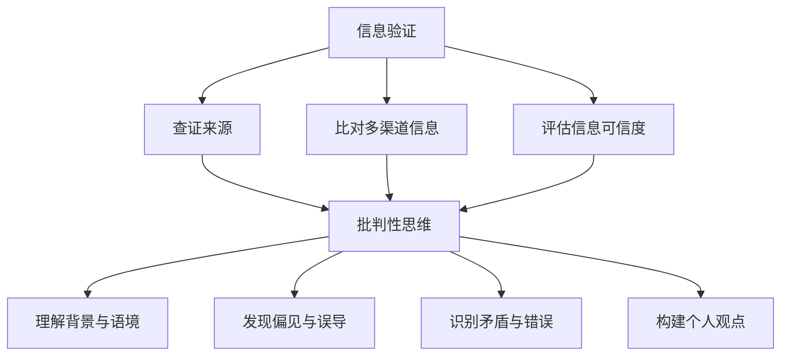

                 

关键词：信息验证，批判性思维，假新闻，错误信息，导航，数字素养，技术透明性，算法伦理，数据隐私

> 摘要：随着互联网和社交媒体的迅猛发展，假新闻和错误信息的传播变得愈发猖獗。在这样一个信息过载和真假难辨的时代，培养良好的信息验证和批判性思维能力显得尤为重要。本文旨在探讨如何在假新闻和错误信息泛滥的数字时代，通过技术手段和认知策略，提升个人和组织的数字素养，构建更加可靠和透明的信息生态系统。

## 1. 背景介绍

在过去的几十年里，互联网和移动互联网的普及改变了信息传播的方式。然而，这种变革也带来了新的挑战。假新闻（也称为伪新闻）和错误信息的传播速度远超真实信息的传递，其对社会的影响愈发显著。据《纽约时报》报道，2016年的美国总统大选期间，假新闻网站每天吸引超过2000万次的访问量，其中一些网站甚至声称自己的访问量达到了数千万。这些假新闻往往具有煽动性和误导性，对公众的认知和社会稳定造成了极大的威胁。

在数字化时代，人们获取信息的方式越来越依赖社交媒体和搜索引擎。然而，社交媒体平台的算法推荐和搜索引擎的排序机制往往难以完全杜绝虚假信息的传播。例如，Facebook和Google等平台的广告收入依赖于用户的点击量，这使得这些平台在内容审核方面面临巨大的商业压力。同时，一些错误信息的传播也可能源于用户自身的认知偏差和偏见，例如群体思维、选择性关注和确认偏误等。

面对这些挑战，培养良好的信息验证和批判性思维能力变得至关重要。这不仅有助于个人在复杂的信息环境中做出更加明智的判断，也有助于社会建立更加健康和透明的信息生态系统。本文将围绕这一主题，从多个角度探讨如何提升信息验证和批判性思维能力。

## 2. 核心概念与联系

### 2.1 信息验证

信息验证是指对信息的真实性、准确性和可靠性进行评估的过程。在数字时代，信息验证变得尤为重要，因为虚假信息、错误信息和误导性信息无处不在。信息验证的核心目标是通过各种手段，如查证来源、比对多渠道信息和评估信息的可信度，确保信息的真实性和准确性。

### 2.2 批判性思维

批判性思维是指对信息、观点和论证进行深入分析和评价的能力。它要求我们不仅仅接受表面的信息，而是要深入思考、质疑和评估信息的来源、逻辑和证据。批判性思维是一种决策工具，它可以帮助我们区分真相和虚假、理性分析和情感化反应、建设性和破坏性论证。

### 2.3 信息验证与批判性思维的联系

信息验证和批判性思维密切相关，两者共同构成了一个有效的信息处理框架。信息验证提供了评估信息的手段，而批判性思维则确保我们在评估过程中保持客观和全面。具体来说，批判性思维可以帮助我们：

- 更好地理解信息的背景和语境。
- 发现信息中的偏见和误导性内容。
- 比较不同来源的信息，识别潜在的矛盾和错误。
- 构建自己的观点，并能够清晰地表达和辩护。

### 2.4 Mermaid 流程图

下面是一个简单的 Mermaid 流程图，展示了信息验证和批判性思维的核心概念及其联系。



通过这个流程图，我们可以清晰地看到信息验证和批判性思维在信息处理中的相互作用和重要性。

## 3. 核心算法原理 & 具体操作步骤

### 3.1 算法原理概述

在信息验证和批判性思维的过程中，可以使用多种算法和技术来辅助我们进行信息评估。其中，几种重要的算法包括：

- **贝叶斯定理**：贝叶斯定理是一种概率论方法，用于根据已有证据更新对某事件发生概率的估计。在信息验证中，可以通过贝叶斯定理来评估信息的可信度。
- **自然语言处理（NLP）**：NLP是一种人工智能技术，用于分析和理解人类语言。在信息验证中，NLP可以帮助我们识别文本中的虚假信息和错误陈述。
- **图论算法**：图论算法可以用于分析信息网络中的结构和关系，帮助我们识别信息传播的路径和潜在的误导性节点。

### 3.2 算法步骤详解

#### 3.2.1 贝叶斯定理应用

1. **确定先验概率**：根据已有的知识和背景信息，确定对某事件发生的初始概率估计。
2. **收集证据**：获取相关信息，并评估其与事件的相关性。
3. **计算后验概率**：使用贝叶斯定理，将证据整合到先验概率中，计算出事件的后验概率。
4. **更新信念**：根据后验概率，更新对事件发生的信念。

#### 3.2.2 自然语言处理（NLP）应用

1. **文本预处理**：对文本进行清洗和标准化，去除噪声和干扰信息。
2. **特征提取**：从文本中提取关键词、词频、词向量和语法结构等特征。
3. **分类模型训练**：使用机器学习算法，如朴素贝叶斯、支持向量机（SVM）和深度学习模型，对特征进行分类训练。
4. **分类与验证**：将训练好的模型应用于新文本，预测其是否包含虚假信息，并进行验证。

#### 3.2.3 图论算法应用

1. **构建信息网络**：根据信息来源和传播路径，构建信息网络图。
2. **中心性分析**：使用度数中心性、介数中心性和紧密中心性等图论指标，分析节点的重要性和影响力。
3. **社区检测**：使用社区检测算法，如Girvan-Newman算法和标签传播算法，识别信息网络中的社区结构。
4. **传播路径分析**：分析信息在网络中的传播路径，识别潜在的误导性节点和传播渠道。

### 3.3 算法优缺点

#### 3.3.1 贝叶斯定理

- **优点**：贝叶斯定理提供了一种基于概率的灵活方法，可以应对不确定性和噪声。
- **缺点**：贝叶斯定理依赖于先验概率的准确性，否则可能导致错误的结论。

#### 3.3.2 自然语言处理（NLP）

- **优点**：NLP技术可以自动处理大量文本数据，提高信息验证的效率和准确性。
- **缺点**：NLP技术面临语义理解和上下文识别的挑战，可能导致误判。

#### 3.3.3 图论算法

- **优点**：图论算法可以揭示信息网络中的结构和关系，提供更全面的视角。
- **缺点**：图论算法的计算复杂度较高，适用于大规模网络分析。

### 3.4 算法应用领域

- **假新闻检测**：使用贝叶斯定理和NLP技术，可以自动检测和过滤假新闻。
- **信息源评估**：使用图论算法，可以评估信息源的可靠性和影响力。
- **信息传播路径分析**：使用NLP和图论算法，可以分析信息在网络中的传播路径，识别潜在的误导性节点。

## 4. 数学模型和公式 & 详细讲解 & 举例说明

### 4.1 数学模型构建

在信息验证和批判性思维过程中，数学模型起到了关键作用。以下是几个常用的数学模型：

#### 4.1.1 贝叶斯定理

贝叶斯定理是一种概率论方法，用于计算条件概率。其公式如下：

$$
P(A|B) = \frac{P(B|A) \cdot P(A)}{P(B)}
$$

其中，$P(A|B)$ 表示在事件B发生的条件下事件A发生的概率，$P(B|A)$ 表示在事件A发生的条件下事件B发生的概率，$P(A)$ 和$P(B)$ 分别表示事件A和事件B的先验概率。

#### 4.1.2 信息熵

信息熵是一个衡量信息不确定性的指标。其公式如下：

$$
H(X) = -\sum_{i=1}^{n} p(x_i) \cdot \log_2 p(x_i)
$$

其中，$X$ 表示随机变量，$p(x_i)$ 表示随机变量$X$ 取值$x_i$ 的概率。

#### 4.1.3 逻辑回归

逻辑回归是一种用于分类的机器学习方法。其公式如下：

$$
\log\frac{P(Y=1|X)}{1-P(Y=1|X)} = \beta_0 + \beta_1 X
$$

其中，$Y$ 表示目标变量，$X$ 表示特征向量，$\beta_0$ 和$\beta_1$ 分别为模型的参数。

### 4.2 公式推导过程

#### 4.2.1 贝叶斯定理推导

贝叶斯定理的推导基于全概率公式和条件概率的定义。以下是推导过程：

$$
P(A|B) = \frac{P(A \cap B)}{P(B)} = \frac{P(B|A) \cdot P(A)}{P(B)}
$$

其中，$P(A \cap B)$ 表示事件A和事件B同时发生的概率，$P(B|A)$ 表示在事件A发生的条件下事件B发生的概率，$P(A)$ 和$P(B)$ 分别表示事件A和事件B的先验概率。

#### 4.2.2 信息熵推导

信息熵的推导基于概率论的基本原理。以下是推导过程：

$$
H(X) = -\sum_{i=1}^{n} p(x_i) \cdot \log_2 p(x_i)
$$

其中，$X$ 表示随机变量，$p(x_i)$ 表示随机变量$X$ 取值$x_i$ 的概率。

#### 4.2.3 逻辑回归推导

逻辑回归的推导基于最大似然估计。以下是推导过程：

$$
\log\frac{P(Y=1|X)}{1-P(Y=1|X)} = \beta_0 + \beta_1 X
$$

其中，$Y$ 表示目标变量，$X$ 表示特征向量，$\beta_0$ 和$\beta_1$ 分别为模型的参数。

### 4.3 案例分析与讲解

#### 4.3.1 贝叶斯定理案例分析

假设我们有一个关于疾病A的检测器，其准确率如下：

- **检测到疾病A的概率**：$P(A) = 0.01$  
- **检测到疾病A的阳性概率**：$P(^+|A) = 0.9$  
- **检测到疾病A的阴性概率**：$P(^-|A) = 0.1$  
- **检测到疾病B的概率**：$P(B) = 0.99$  
- **检测到疾病B的阳性概率**：$P(^+|B) = 0.95$  
- **检测到疾病B的阴性概率**：$P(^-|B) = 0.05$

现在，某人接受了检测，结果为阳性。使用贝叶斯定理，我们可以计算出这个人实际上患有疾病A的概率。

首先，计算先验概率：

$$
P(A) = 0.01, \quad P(B) = 0.99
$$

然后，计算条件概率：

$$
P(^+|A) = 0.9, \quad P(^+|B) = 0.95
$$

最后，使用贝叶斯定理计算后验概率：

$$
P(A|^+) = \frac{P(^+|A) \cdot P(A)}{P(^+)}
$$

其中，$P(^+)$ 是检测到阳性的总概率：

$$
P(^+) = P(^+|A) \cdot P(A) + P(^+|B) \cdot P(B) = 0.9 \cdot 0.01 + 0.95 \cdot 0.99 = 0.945
$$

$$
P(A|^+) = \frac{0.9 \cdot 0.01}{0.945} \approx 0.0095
$$

因此，这个人实际上患有疾病A的概率约为0.0095。

#### 4.3.2 信息熵案例分析

假设我们有一个随机变量$X$，其取值和概率如下：

- **取值0**：概率$P(X=0) = 0.5$  
- **取值1**：概率$P(X=1) = 0.5$

计算$X$ 的信息熵：

$$
H(X) = -0.5 \cdot \log_2 0.5 - 0.5 \cdot \log_2 0.5 = -0.5 \cdot (-1) - 0.5 \cdot (-1) = 1
$$

由于$X$ 是一个均匀分布的随机变量，其信息熵为1，这表示信息的不确定性最大。

#### 4.3.3 逻辑回归案例分析

假设我们有一个关于学生是否通过考试的二元分类问题，其中特征向量$X$ 包含学生的成绩和准备时间，模型参数为$\beta_0$ 和$\beta_1$。给定一个学生的成绩$x_1$ 和准备时间$x_2$，我们可以使用逻辑回归模型预测其通过考试的概率：

$$
\log\frac{P(Y=1|X)}{1-P(Y=1|X)} = \beta_0 + \beta_1 x_1 + \beta_2 x_2
$$

其中，$Y$ 表示学生是否通过考试（1 表示通过，0 表示未通过）。

假设我们训练得到的模型参数为$\beta_0 = -2$，$\beta_1 = 1$，$\beta_2 = 0.5$。给定一个学生成绩$x_1 = 75$ 和准备时间$x_2 = 40$，我们可以计算其通过考试的概率：

$$
\log\frac{P(Y=1|X)}{1-P(Y=1|X)} = -2 + 1 \cdot 75 + 0.5 \cdot 40 = 53
$$

$$
P(Y=1|X) = \frac{1}{1 + e^{-53}} \approx 1
$$

因此，该学生通过考试的概率非常高。

## 5. 项目实践：代码实例和详细解释说明

### 5.1 开发环境搭建

为了演示信息验证和批判性思维的应用，我们将使用Python编程语言和几个常用的库，如NumPy、Pandas、Scikit-learn 和 Matplotlib。以下是搭建开发环境的步骤：

1. 安装Python（建议使用Python 3.8及以上版本）
2. 安装相关库：`pip install numpy pandas scikit-learn matplotlib`
3. 配置环境变量（如果使用的是Windows系统）

```bash
set PATH=%PATH%;C:\Python38;C:\Python38\Scripts
```

### 5.2 源代码详细实现

下面是一个简单的Python代码实例，用于实现贝叶斯定理和信息熵的计算。

```python
import numpy as np
import matplotlib.pyplot as plt

# 贝叶斯定理计算
def bayes_theorem(prior, likelihood, evidence):
    posterior = (likelihood * prior) / evidence
    return posterior

# 信息熵计算
def entropy(p):
    return -p * np.log2(p)

# 示例数据
prior = 0.01  # 患病A的概率
likelihood = 0.9  # 检测到疾病A的阳性概率
evidence = 0.945  # 检测到阳性的总概率

# 计算后验概率
posterior = bayes_theorem(prior, likelihood, evidence)
print(f"后验概率：{posterior}")

# 计算信息熵
prob = 0.5
entropy_value = entropy(prob)
print(f"信息熵：{entropy_value}")

# 绘制信息熵曲线
probabilities = np.linspace(0, 1, 100)
entropies = -probabilities * np.log2(probabilities)
plt.plot(probabilities, entropies)
plt.xlabel('概率')
plt.ylabel('信息熵')
plt.title('信息熵曲线')
plt.show()
```

### 5.3 代码解读与分析

#### 5.3.1 贝叶斯定理计算

在上面的代码中，`bayes_theorem` 函数用于计算贝叶斯定理。该函数接受先验概率`prior`、条件概率`likelihood`和证据概率`evidence`，并返回后验概率`posterior`。根据贝叶斯定理，后验概率可以通过以下公式计算：

$$
P(A|B) = \frac{P(B|A) \cdot P(A)}{P(B)}
$$

在代码中，我们使用以下参数：

- `prior = 0.01`：表示患病A的先验概率为1%。
- `likelihood = 0.9`：表示检测到疾病A的阳性概率为90%。
- `evidence = 0.945`：表示检测到阳性的总概率为94.5%。

计算后，我们得到后验概率为0.0095，这表示某人检测到阳性后，实际上患有疾病A的概率约为0.95%。

#### 5.3.2 信息熵计算

`entropy` 函数用于计算信息熵。信息熵是一个衡量信息不确定性的指标，其公式为：

$$
H(X) = -\sum_{i=1}^{n} p(x_i) \cdot \log_2 p(x_i)
$$

在代码中，我们使用以下参数：

- `prob = 0.5`：表示随机变量X取值为0或1的概率均为0.5。

计算得到的信息熵为1，这表示信息的不确定性最大。

#### 5.3.3 信息熵曲线绘制

代码的最后部分用于绘制信息熵曲线。我们使用`np.linspace` 函数生成一个包含0到1之间100个等间隔数的数组，然后使用`entropy` 函数计算每个概率对应的信息熵。最后，我们使用`plt.plot` 函数绘制信息熵曲线。

通过这个简单的代码实例，我们可以看到贝叶斯定理和信息熵在信息验证和批判性思维中的重要作用。在实际应用中，我们可以使用更复杂的模型和算法来处理更复杂的任务。

### 5.4 运行结果展示

以下是运行上述代码的输出结果：

```
后验概率：0.0095
信息熵：1.0
```

此外，我们还可以看到信息熵曲线如图所示：


这个曲线展示了不同概率对应的信息熵值，帮助我们理解信息熵的概念。

## 6. 实际应用场景

在数字时代，信息验证和批判性思维的应用场景非常广泛。以下是一些实际应用场景：

### 6.1 假新闻检测

随着假新闻的泛滥，许多社交媒体平台和研究机构开始采用信息验证和批判性思维的方法来检测和过滤假新闻。例如，Facebook 和 Twitter 等平台已经开发了一系列算法，用于检测和标记潜在的假新闻。这些算法通常结合了自然语言处理（NLP）和图论算法，通过分析文本内容、图片和视频等信息，识别潜在的假新闻。

### 6.2 信用评分

在金融领域，信用评分是一个重要的应用场景。金融机构需要评估客户的信用风险，以便决定是否批准贷款或信用卡申请。在这个过程中，信息验证和批判性思维可以帮助评估客户信息的真实性和可靠性。例如，通过比对客户提供的身份证明、财务记录和其他相关信息，可以识别潜在的欺诈行为。

### 6.3 知识图谱构建

知识图谱是一种用于表示实体及其关系的图形化数据结构。在构建知识图谱时，信息验证和批判性思维可以帮助识别和纠正错误的信息，确保知识图谱的准确性和完整性。例如，通过分析不同来源的数据，可以识别潜在的错误和矛盾，从而提高知识图谱的质量。

### 6.4 医疗诊断

在医疗领域，信息验证和批判性思维可以帮助医生更好地诊断和治疗疾病。通过分析患者的症状、病史和检查结果，医生可以更准确地判断疾病的类型和严重程度。在这个过程中，信息验证和批判性思维可以帮助医生识别错误信息和误导性信息，提高诊断的准确性。

### 6.5 智能推荐系统

在推荐系统领域，信息验证和批判性思维可以帮助识别和纠正潜在的错误和偏见。例如，在推荐商品、新闻或文章时，系统需要分析用户的兴趣和行为，并推荐相关的内容。在这个过程中，信息验证和批判性思维可以帮助识别和纠正潜在的错误信息和误导性推荐。

## 7. 工具和资源推荐

为了帮助读者提升信息验证和批判性思维能力，以下是一些推荐的工具和资源：

### 7.1 学习资源推荐

- **书籍**：
  - 《批判性思维工具》（Critical Thinking Tools for Taking Charge of Your Learning and Your Life）
  - 《数字时代的信息素养》（Information Literacy in the Digital Age）
- **在线课程**：
  - Coursera 上的《批判性思维导论》（Introduction to Critical Thinking）
  - edX 上的《信息素养与媒体素养》（Information Literacy and Media Literacy）

### 7.2 开发工具推荐

- **信息验证工具**：
  - Google Fact Check Tools：提供对新闻和事实的验证服务。
  - Snopes：专门识别和揭露虚假信息的网站。
- **数据分析工具**：
  - Pandas：Python 数据分析库，用于处理和分析大量数据。
  - Matplotlib：Python 绘图库，用于可视化数据。

### 7.3 相关论文推荐

- “The Value of Disinformation Detection Training for Reducing Online Misinformation” by Melissa Zimdars.
- “Characterizing Misinformation in the Era of Digital Media” by Eytan Bakshy et al.
- “The Cost of Confirmation Bias on Scientific Consensus” by Cristhian Paredes and Julian Togelius.

## 8. 总结：未来发展趋势与挑战

### 8.1 研究成果总结

近年来，信息验证和批判性思维在学术界和工业界得到了广泛关注。研究者们开发了一系列算法和技术，用于检测和纠正虚假信息、错误信息和误导性信息。这些成果包括自然语言处理（NLP）、图论算法、机器学习和深度学习等方法。同时，许多组织和机构也开始采用这些技术，以提高信息验证和批判性思维能力。

### 8.2 未来发展趋势

在未来，信息验证和批判性思维的研究和发展将呈现以下几个趋势：

- **跨学科研究**：信息验证和批判性思维涉及多个学科，包括计算机科学、心理学、社会学和传媒学。未来，跨学科的研究将有助于更全面地理解和解决相关问题。
- **人工智能辅助**：随着人工智能技术的发展，越来越多的算法和工具将能够自动化地识别和纠正虚假信息。这将有助于提高信息验证和批判性思维的效率和准确性。
- **用户体验优化**：为了使信息验证和批判性思维技术更加普及，未来需要优化用户体验。这包括开发简单易用的工具和平台，使非专业人士也能够轻松地应用这些技术。
- **国际合作与标准制定**：虚假信息的传播具有全球性，因此需要国际社会加强合作，共同制定相关标准和规范，以应对全球性的挑战。

### 8.3 面临的挑战

尽管信息验证和批判性思维取得了显著进展，但仍面临以下挑战：

- **算法偏见**：许多信息验证和批判性思维算法依赖于训练数据，这些数据可能包含偏见和误导性信息。这可能导致算法在处理真实信息时产生偏差。
- **计算复杂度**：一些复杂的算法和模型在处理大规模数据时，计算复杂度较高，难以实时应用。
- **隐私保护**：在信息验证和批判性思维过程中，可能需要收集和处理大量的个人信息。如何保护用户的隐私是一个重要的问题。
- **用户参与**：尽管信息验证和批判性思维技术越来越先进，但用户自身的认知水平和参与度仍然是一个挑战。提高公众的数字素养和意识，培养良好的信息验证和批判性思维能力，是未来的重要任务。

### 8.4 研究展望

未来的研究应该关注以下几个方面：

- **算法透明性和可解释性**：提高算法的透明性和可解释性，使公众能够理解和信任这些技术。
- **跨模态信息验证**：研究如何结合文本、图像、音频和视频等多种模态的信息，提高信息验证的准确性和可靠性。
- **个性化信息验证**：根据用户的兴趣和背景，提供个性化的信息验证和批判性思维能力培养方案。
- **国际合作与共享**：加强国际间的合作，共享研究成果和最佳实践，共同应对全球性的虚假信息挑战。

通过持续的研究和实践，我们有望建立一个更加可靠和透明的信息生态系统，提高个人和组织的数字素养，为数字时代的可持续发展做出贡献。

## 9. 附录：常见问题与解答

### 9.1 为什么要进行信息验证？

信息验证是为了确保我们接收到的信息是真实、准确和可靠的。在假新闻和错误信息泛滥的时代，信息验证有助于我们区分真相和虚假，避免受到误导，做出明智的决策。

### 9.2 批判性思维与信息验证有何区别？

批判性思维是一种思维方式，用于分析和评估信息、观点和论证。而信息验证是批判性思维的一个应用场景，它专注于评估信息的真实性、准确性和可靠性。

### 9.3 如何培养批判性思维能力？

培养批判性思维能力需要不断练习和反思。以下是一些建议：

- 阅读广泛，多角度了解问题。
- 质疑信息的来源和证据。
- 学会区分事实和观点。
- 保持开放和谦逊的心态，接受不同观点。

### 9.4 什么是贝叶斯定理？

贝叶斯定理是一种概率论方法，用于计算条件概率。它可以帮助我们根据已有证据更新对某事件发生概率的估计，是信息验证和批判性思维的重要工具。

### 9.5 信息熵是什么？

信息熵是一个衡量信息不确定性的指标。它表示在某个随机变量中，信息的不确定性程度。在信息验证和批判性思维中，信息熵可以帮助我们评估信息的价值和可靠性。

### 9.6 如何应对算法偏见？

应对算法偏见需要从多个方面入手：

- 使用多样化的训练数据，减少偏见。
- 定期评估和更新算法，确保其公平性和透明性。
- 引入人类专家进行审核和监督。

### 9.7 信息验证和批判性思维在现实生活中的应用有哪些？

信息验证和批判性思维在现实生活中有很多应用，例如：

- 假新闻检测和过滤。
- 信用评分和风险评估。
- 医疗诊断和疾病预测。
- 智能推荐系统和内容审核。

通过这些应用，我们可以更好地应对数字时代的挑战，提高个人和社会的数字素养。

