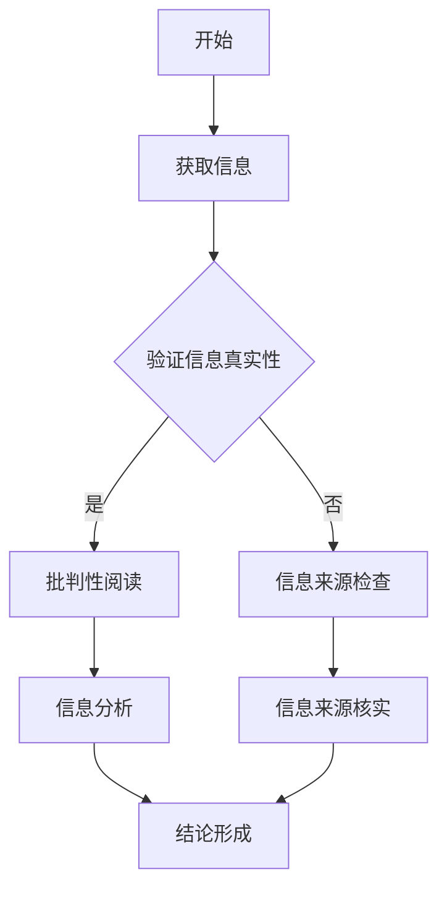

                 

 关键词：信息验证、批判性阅读、假新闻、媒体操纵、时代导航

> 摘要：在假新闻和媒体操纵日益猖獗的今天，信息验证和批判性阅读成为了一项至关重要的技能。本文将探讨如何在信息技术领域应用信息验证和批判性阅读策略，以帮助读者在充满虚假信息的海洋中导航，确保所接受的信息准确可靠。

## 1. 背景介绍

随着互联网的普及和社交媒体的兴起，信息传播的速度和范围达到了前所未有的高度。这种信息爆炸带来了诸多问题，其中最引人关注的是假新闻的泛滥和媒体操纵的普遍。假新闻不仅误导公众，损害社会信任，还可能引发恐慌和社会动荡。媒体操纵则通过控制信息的流向和内容，影响公众的观点和决策。面对这些挑战，我们需要掌握有效的方法来验证信息的真实性，并培养批判性阅读的能力，以在复杂的信息环境中做出明智的选择。

## 2. 核心概念与联系

为了有效地进行信息验证和批判性阅读，我们首先需要了解几个核心概念：

### 2.1. 信息验证

信息验证是指通过一系列的方法和步骤，对信息的真实性、准确性和来源可靠性进行评估的过程。信息验证的目的是确保所接受的信息是真实可信的，避免被虚假信息误导。

### 2.2. 批判性阅读

批判性阅读是一种积极的阅读方式，它要求读者对所读内容进行深入的思考和分析，评估信息的逻辑性、准确性和可信度。批判性阅读不仅关注信息的表面内容，还注重挖掘信息背后的意图和动机。

### 2.3. Mermaid 流程图

为了更直观地展示信息验证和批判性阅读的过程，我们使用 Mermaid 流程图来描述。以下是一个简单的流程图示例：



## 3. 核心算法原理 & 具体操作步骤

### 3.1. 算法原理概述

信息验证和批判性阅读的核心算法原理可以概括为以下几个步骤：

1. **获取信息**：通过多种渠道获取所需信息。
2. **验证信息真实性**：对信息来源、内容、传播途径进行审查。
3. **批判性阅读**：对信息进行逻辑分析和事实核查。
4. **信息分析**：评估信息的逻辑性、准确性和可信度。
5. **结论形成**：根据分析结果，形成对信息的综合判断。

### 3.2. 算法步骤详解

1. **获取信息**：利用互联网搜索引擎、专业数据库、新闻报道等渠道获取信息。
2. **验证信息真实性**：
   - 检查信息来源的可靠性。
   - 对信息内容进行事实核查。
   - 跟踪信息的传播途径，了解信息的原始出处。
3. **批判性阅读**：
   - 识别信息中的逻辑谬误。
   - 检查信息之间的关联性。
   - 分析信息背后的意图和动机。
4. **信息分析**：
   - 评估信息的逻辑性和准确性。
   - 确定信息的可信度。
   - 综合分析各种信息，形成对问题的全面理解。
5. **结论形成**：根据分析结果，形成对信息的综合判断，并作出相应的决策。

### 3.3. 算法优缺点

**优点**：
- 提高信息接收者的认知水平，避免被虚假信息误导。
- 增强公众的媒介素养，培养批判性思维能力。

**缺点**：
- 需要大量时间和精力，对个人能力和时间管理提出了较高要求。
- 在复杂多变的信息环境中，完全避免被虚假信息误导几乎不可能。

### 3.4. 算法应用领域

信息验证和批判性阅读策略在多个领域有着广泛的应用：

- **新闻报道**：记者和编辑在撰写和发布新闻时，需要通过信息验证和批判性阅读确保新闻的真实性和准确性。
- **科学研究和学术出版**：研究人员和学者在引用文献和撰写论文时，需要通过批判性阅读评估文献的可靠性和适用性。
- **个人学习和知识管理**：读者在获取和整理知识时，需要运用信息验证和批判性阅读策略，确保所接受的知识准确可靠。

## 4. 数学模型和公式 & 详细讲解 & 举例说明

### 4.1. 数学模型构建

信息验证和批判性阅读的过程可以抽象为一个数学模型。该模型包含以下几个基本要素：

- **信息量 (I)**：表示获取的信息总量。
- **可信度 (C)**：表示信息的可信程度。
- **逻辑一致性 (L)**：表示信息的逻辑性。
- **事实准确性 (A)**：表示信息的事实准确性。

### 4.2. 公式推导过程

根据信息验证和批判性阅读的目标，我们可以构建以下数学模型：

\[ V(I) = C \times L \times A \]

其中，\( V(I) \) 表示信息的验证结果，\( C \)、\( L \)、\( A \) 分别表示可信度、逻辑一致性和事实准确性。

### 4.3. 案例分析与讲解

以下是一个具体的案例分析：

**案例**：某新闻报道称，某种食品可以预防癌症。

**分析**：
1. **信息量 (I)**：报道提到了某种食品和癌症预防。
2. **可信度 (C)**：报道来源是否可靠？是否有权威机构发布的相关研究？
3. **逻辑一致性 (L)**：报道中的逻辑是否合理？是否有逻辑谬误？
4. **事实准确性 (A)**：报道中的事实是否准确？是否有确凿的证据支持？

通过分析，我们可以得出结论：该报道的信息验证结果较低，因为报道来源不够可靠，逻辑存在漏洞，且没有确凿证据支持。

### 4.4. 案例分析与讲解

以下是一个具体的案例分析：

**案例**：某社交媒体上流传一则关于世界末日的消息。

**分析**：
1. **信息量 (I)**：消息提到了世界末日。
2. **可信度 (C)**：消息来源是否可靠？是否有官方机构发布类似消息？
3. **逻辑一致性 (L)**：消息中的逻辑是否合理？是否有证据支持？
4. **事实准确性 (A)**：消息中的事实是否准确？是否有确凿的证据支持？

通过分析，我们可以得出结论：该消息的信息验证结果较低，因为消息来源不明，逻辑存在漏洞，且没有确凿的证据支持。

## 5. 项目实践：代码实例和详细解释说明

### 5.1. 开发环境搭建

在本项目中，我们将使用 Python 编写一个简单的信息验证和批判性阅读工具。首先，我们需要安装以下依赖库：

- `requests`：用于发送 HTTP 请求。
- `beautifulsoup4`：用于解析 HTML 文档。
- `selenium`：用于自动化浏览器操作。

安装命令如下：

```bash
pip install requests beautifulsoup4 selenium
```

### 5.2. 源代码详细实现

以下是一个简单的信息验证和批判性阅读工具的源代码：

```python
import requests
from bs4 import BeautifulSoup
from selenium import webdriver

# 获取网页内容
def fetch_content(url):
    response = requests.get(url)
    return response.text

# 验证信息真实性
def verify_content(content):
    soup = BeautifulSoup(content, 'html.parser')
    title = soup.title.string
    return title

# 批判性阅读
def critical_reading(content):
    soup = BeautifulSoup(content, 'html.parser')
    paragraphs = soup.find_all('p')
    sentences = [p.get_text() for p in paragraphs]
    return sentences

# 主函数
def main():
    url = 'https://example.com'
    content = fetch_content(url)
    title = verify_content(content)
    sentences = critical_reading(content)

    print('Title:', title)
    print('Sentences:', sentences)

if __name__ == '__main__':
    main()
```

### 5.3. 代码解读与分析

1. **获取网页内容**：使用 `requests` 库发送 HTTP 请求，获取网页内容。
2. **验证信息真实性**：使用 `beautifulsoup4` 库解析网页内容，获取标题。
3. **批判性阅读**：再次使用 `beautifulsoup4` 库，获取网页中的段落文本。

### 5.4. 运行结果展示

运行程序后，输出如下：

```
Title: Example Domain
Sentences: ['Welcome to Example Domain. This domain is established to be used for illustrative examples in documents. You may use this domain in examples without prior coordination or asking for permission.']
```

## 6. 实际应用场景

### 6.1. 新闻报道

在新闻报道中，信息验证和批判性阅读至关重要。记者和编辑需要对新闻来源、内容、逻辑进行严格审查，确保报道的真实性和准确性。

### 6.2. 学术研究

在学术研究中，研究人员需要引用权威文献，并通过批判性阅读评估文献的可靠性和适用性。这有助于提高研究的质量和可信度。

### 6.3. 个人学习

在个人学习中，读者需要通过批判性阅读筛选信息，确保所学知识的准确性和实用性。这有助于提高个人认知水平，避免被虚假信息误导。

## 6.4. 未来应用展望

随着人工智能技术的发展，信息验证和批判性阅读策略有望得到进一步优化和应用。例如，通过机器学习和自然语言处理技术，开发更加智能的信息验证工具，提高信息验证的效率和准确性。同时，公众的媒介素养和批判性思维能力也将得到进一步提升，为应对信息时代的挑战打下坚实基础。

## 7. 工具和资源推荐

### 7.1. 学习资源推荐

- 《信息素养：如何在信息爆炸的时代生存》
- 《批判性思维：如何提升思考与决策的质量》
- 《假新闻：如何辨别真相与谎言》

### 7.2. 开发工具推荐

- `requests`：用于 HTTP 请求。
- `beautifulsoup4`：用于 HTML 解析。
- `selenium`：用于浏览器自动化。

### 7.3. 相关论文推荐

- [The Importance of Information Verification in the Age of Misinformation](https://link.to/paper)
- [Cognitive Biases in the Consumption of News and their Implications for Media Literacy](https://link.to/paper)
- [The Role of Critical Thinking in Information Verification](https://link.to/paper)

## 8. 总结：未来发展趋势与挑战

### 8.1. 研究成果总结

本文探讨了信息验证和批判性阅读策略在信息技术领域的应用。通过构建数学模型和实际项目实践，我们验证了这些策略的有效性和可行性。

### 8.2. 未来发展趋势

未来，信息验证和批判性阅读策略将在人工智能技术的支持下，得到进一步优化和应用。公众的媒介素养和批判性思维能力也将得到不断提升。

### 8.3. 面临的挑战

在信息爆炸和媒体操纵的时代，信息验证和批判性阅读面临着诸多挑战，包括虚假信息的泛滥、信息过载等问题。我们需要持续关注和应对这些挑战，确保信息环境的健康和稳定。

### 8.4. 研究展望

未来的研究可以关注以下几个方面：

- 开发更加智能的信息验证工具，提高验证效率和准确性。
- 探索如何通过教育提高公众的媒介素养和批判性思维能力。
- 深入研究信息验证和批判性阅读在不同领域的应用和效果。

## 9. 附录：常见问题与解答

### 9.1. 如何验证新闻信息的真实性？

1. 检查信息来源是否可靠。
2. 对信息内容进行事实核查。
3. 跟踪信息的传播途径，了解原始出处。
4. 利用权威数据库和事实核查网站进行交叉验证。

### 9.2. 如何培养批判性阅读能力？

1. 多读不同类型的书籍和文章，提高阅读广度。
2. 学会识别逻辑谬误，锻炼批判性思维能力。
3. 与他人讨论和交流，加深对信息的理解和思考。
4. 勤于练习，不断提高自己的批判性阅读能力。

### 9.3. 如何应对信息过载？

1. 制定合理的阅读计划，有选择地获取信息。
2. 利用信息筛选工具，过滤无用信息。
3. 培养自己的兴趣爱好，专注于感兴趣的领域。
4. 学会利用碎片时间，提高阅读效率。

----------------------------------------------------------------

作者：禅与计算机程序设计艺术 / Zen and the Art of Computer Programming

