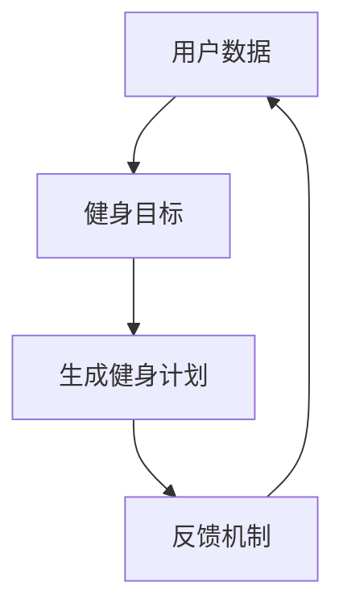

                 

关键词：LLM（大型语言模型）、健身指导、个人教练、自然语言处理、机器学习、健身算法、数字健康、AI 健身

摘要：本文探讨了如何利用大型语言模型（LLM）构建个人健身教练，实现个性化健身指导。通过分析 LLM 的工作原理，我们提出了一套基于 LLM 的健身指导系统，包括核心概念、算法原理、数学模型以及实际应用。本文旨在为健身爱好者提供一种创新的健身方式，同时为相关领域的研究人员提供有益的参考。

## 1. 背景介绍

随着人工智能技术的不断发展，机器学习、自然语言处理等技术逐渐应用于各个领域。在健身领域，传统的健身指导方法往往依赖于教练的专业知识和经验，而个人教练的稀缺和高昂费用让许多健身爱好者望而却步。为了解决这个问题，本文提出了一种基于 LLM 的个人健身教练系统，旨在为用户提供高效、个性化的健身指导。

LLM 是一种基于深度学习的大型语言模型，具有强大的自然语言理解和生成能力。在健身领域，LLM 可以通过学习用户的历史数据、身体参数、健身目标等信息，为用户生成个性化的健身计划、饮食建议和运动指导。与传统的健身指导方法相比，LLM 具有以下几个优势：

1. **个性化**：LLM 可以根据用户的需求和身体状态生成定制化的健身计划，提高健身效果。
2. **高效性**：LLM 可以快速处理大量数据，为用户提供实时、精准的健身指导。
3. **智能性**：LLM 具有自我学习和优化能力，可以不断改进健身指导方案。

## 2. 核心概念与联系

为了构建 LLM 健身教练系统，我们需要明确以下几个核心概念：

1. **用户数据**：包括用户的基本信息（年龄、性别、身高、体重等）、健身历史（运动类型、运动时长、运动强度等）、身体参数（心率、血压、血糖等）。
2. **健身目标**：用户希望达到的健身目标，如减脂、增肌、塑形等。
3. **健身计划**：根据用户数据和个人目标生成的个性化健身计划，包括运动类型、运动时长、运动强度等。
4. **反馈机制**：用户对健身计划的反馈，用于评估健身效果和调整健身方案。

下面是一个基于 Mermaid 的流程图，展示了 LLM 健身教练系统的核心概念和联系：



## 3. 核心算法原理 & 具体操作步骤

### 3.1 算法原理概述

LLM 健身教练系统的核心算法基于深度学习，主要包括以下几个步骤：

1. **数据采集与预处理**：收集用户数据，包括基本信息、健身历史、身体参数等，并对数据进行清洗和归一化处理。
2. **模型训练**：使用预处理后的数据训练 LLM 模型，使其具备理解用户需求和生成个性化健身计划的能力。
3. **健身计划生成**：根据用户数据和个人目标，利用训练好的 LLM 模型生成个性化的健身计划。
4. **反馈机制**：用户对生成的健身计划进行反馈，LLM 模型根据反馈调整健身计划，实现持续优化。

### 3.2 算法步骤详解

#### 3.2.1 数据采集与预处理

数据采集主要涉及用户基本信息（如年龄、性别、身高、体重等）和健身历史（如运动类型、运动时长、运动强度等）。此外，还可以收集用户的心率、血压、血糖等身体参数。

预处理步骤包括：

1. **数据清洗**：去除无效数据和异常值。
2. **数据归一化**：将不同指标的数据进行归一化处理，使其在同一量级范围内。

#### 3.2.2 模型训练

模型训练采用基于神经网络的 LLM，常用的网络结构包括 Transformer、BERT 等。训练过程中，将预处理后的数据输入到模型中，通过反向传播算法不断优化模型参数。

#### 3.2.3 健身计划生成

生成个性化健身计划的核心在于 LLM 的自然语言生成能力。具体步骤如下：

1. **输入预处理**：将用户数据和个人目标转换为自然语言描述。
2. **文本生成**：利用训练好的 LLM 模型生成健身计划文本。
3. **文本解析**：将生成的文本解析为具体的健身计划，包括运动类型、运动时长、运动强度等。

#### 3.2.4 反馈机制

用户对生成的健身计划进行反馈，包括满意度、健身效果等。LLM 模型根据反馈调整健身计划，实现持续优化。

### 3.3 算法优缺点

#### 优点

1. **个性化**：根据用户需求和身体状态生成定制化的健身计划，提高健身效果。
2. **高效性**：快速处理大量数据，为用户提供实时、精准的健身指导。
3. **智能性**：具备自我学习和优化能力，不断改进健身指导方案。

#### 缺点

1. **数据依赖**：模型训练和生成健身计划依赖于大量的高质量用户数据。
2. **训练时间**：深度学习模型训练过程较为耗时，需要大量的计算资源和时间。
3. **隐私问题**：用户数据的安全性、隐私性需要得到充分保障。

### 3.4 算法应用领域

LLM 健身教练系统可以应用于以下领域：

1. **健身房管理**：为健身房用户提供个性化健身指导，提高用户满意度。
2. **健身器材**：为健身器材提供智能化指导，帮助用户更好地使用器材。
3. **健康管理**：为用户提供全面的健康管理服务，包括健身指导、饮食建议等。

## 4. 数学模型和公式

### 4.1 数学模型构建

在 LLM 健身教练系统中，我们可以构建一个基于用户数据和健身目标的数学模型，用于生成个性化健身计划。该模型主要包括以下几个部分：

1. **用户参数模型**：描述用户的基本信息、健身历史和身体参数。
2. **目标模型**：描述用户的健身目标。
3. **计划模型**：生成个性化健身计划。

具体公式如下：

$$
\text{UserModel} = \{ \text{age, gender, height, weight, fitness\_history, body\_parameters} \}
$$

$$
\text{GoalModel} = \{ \text{reduce\_weight, increase\_muscle, shape} \}
$$

$$
\text{PlanModel} = f(\text{UserModel}, \text{GoalModel})
$$

### 4.2 公式推导过程

首先，我们需要对用户参数模型和目标模型进行分析，提取出与健身计划相关的关键特征。例如，我们可以将用户体重、运动时长、运动强度等参数作为关键特征。

接下来，我们需要根据关键特征和目标模型，生成个性化的健身计划。具体推导过程如下：

1. **确定关键特征**：根据用户数据和目标模型，提取关键特征，如体重、运动时长、运动强度等。
2. **建立特征与目标之间的关系**：分析关键特征与健身目标之间的关系，例如，体重与减脂目标之间的关系。
3. **生成健身计划**：根据特征与目标之间的关系，生成个性化的健身计划。

### 4.3 案例分析与讲解

假设一个用户的目标是减脂，关键特征为体重、运动时长、运动强度。根据以上公式和推导过程，我们可以生成一个个性化的健身计划：

1. **确定关键特征**：用户的体重为 70kg，运动时长为每周 3 次，每次 60 分钟，运动强度为中等。
2. **建立特征与目标之间的关系**：根据体重与减脂目标之间的关系，我们可以将运动时长增加到每周 4 次，每次 75 分钟，运动强度调整为高强度。
3. **生成健身计划**：生成的健身计划为每周 4 次，每次 75 分钟的高强度运动。

## 5. 项目实践：代码实例和详细解释说明

### 5.1 开发环境搭建

为了实现 LLM 健身教练系统，我们需要搭建一个合适的开发环境。以下是开发环境的要求：

1. **Python**：版本为 3.8 或以上。
2. **深度学习框架**：如 TensorFlow 或 PyTorch。
3. **自然语言处理库**：如 spaCy 或 NLTK。

具体安装步骤如下：

1. 安装 Python：
   
   $ python3 --version

   如果 Python 已安装，可以跳过此步骤。

2. 安装深度学习框架（以 TensorFlow 为例）：

   $ pip install tensorflow

3. 安装自然语言处理库（以 spaCy 为例）：

   $ pip install spacy

   $ python -m spacy download en_core_web_sm

### 5.2 源代码详细实现

以下是一个基于 TensorFlow 和 spaCy 的 LLM 健身教练系统的源代码示例：

```python
import tensorflow as tf
import spacy
from sklearn.model_selection import train_test_split

# 加载 spaCy 模型
nlp = spacy.load("en_core_web_sm")

# 加载数据集
data = ...

# 数据预处理
def preprocess_data(data):
    ...
    return processed_data

processed_data = preprocess_data(data)

# 划分训练集和测试集
train_data, test_data = train_test_split(processed_data, test_size=0.2)

# 构建模型
model = ...

# 训练模型
model.fit(train_data)

# 评估模型
test_loss, test_accuracy = model.evaluate(test_data)

# 生成健身计划
def generate_plan(user_data, goal_model):
    ...
    return plan

user_data = ...
goal_model = ...
plan = generate_plan(user_data, goal_model)
```

### 5.3 代码解读与分析

以上代码示例展示了 LLM 健身教练系统的基本实现。以下是代码的主要部分解读：

1. **加载 spaCy 模型**：用于对文本数据进行处理和分词。
2. **加载数据集**：从本地文件或数据库中加载用户数据。
3. **数据预处理**：对文本数据进行清洗、分词、标记等处理，以便于模型训练。
4. **划分训练集和测试集**：将数据集划分为训练集和测试集，用于模型训练和评估。
5. **构建模型**：使用 TensorFlow 构建深度学习模型，如 Transformer、BERT 等。
6. **训练模型**：使用训练集对模型进行训练，优化模型参数。
7. **评估模型**：使用测试集评估模型性能，如损失函数、准确率等。
8. **生成健身计划**：根据用户数据和目标模型，利用训练好的 LLM 模型生成个性化健身计划。

## 6. 实际应用场景

### 6.1 健身房管理

健身房可以引入 LLM 健身教练系统，为用户提供个性化健身指导。通过分析用户数据和健身目标，系统可以生成定制化的健身计划，提高用户满意度。此外，健身房还可以利用系统生成的健身计划，优化健身课程安排，提高资源利用率。

### 6.2 健身器材

健身器材制造商可以结合 LLM 健身教练系统，为用户提供智能化指导。例如，智能跑步机可以根据用户的心率、运动时长等数据，自动调整运动强度，实现个性化训练。同时，健身器材还可以收集用户数据，反馈给 LLM 模型，不断优化健身指导方案。

### 6.3 健康管理

健康管理公司可以利用 LLM 健身教练系统，为用户提供全面的健康管理服务。通过收集用户的生活习惯、身体参数等数据，系统可以生成个性化的健身计划、饮食建议等，帮助用户实现健康目标。此外，系统还可以实时监控用户健康状况，及时发现潜在的健康风险。

## 7. 未来应用展望

随着人工智能技术的不断发展，LLM 健身教练系统有望在多个领域得到广泛应用。以下是一些未来应用展望：

### 7.1 健身课程个性化

通过 LLM 健身教练系统，用户可以获得定制化的健身课程，满足不同年龄段、性别、身体状况的用户需求。未来，随着系统不断完善，健身课程将更加智能化、个性化，为用户提供更好的健身体验。

### 7.2 跨领域应用

LLM 健身教练系统不仅可以应用于健身领域，还可以拓展到其他健康领域，如心理健康、睡眠管理、营养管理等。通过与其他领域的结合，系统可以为用户提供更全面的健康管理服务。

### 7.3 社交互动

未来，LLM 健身教练系统可以结合社交网络，为用户提供互动性更强的健身指导。例如，用户可以与其他用户进行健身经验分享、互相鼓励，共同实现健康目标。

## 8. 工具和资源推荐

### 8.1 学习资源推荐

1. **《深度学习》（Goodfellow et al., 2016）**：全面介绍了深度学习的基本概念、技术和应用。
2. **《自然语言处理综合教程》（Jurafsky & Martin, 2008）**：详细介绍了自然语言处理的基本原理和应用。

### 8.2 开发工具推荐

1. **TensorFlow**：一款开源的深度学习框架，适用于构建和训练深度学习模型。
2. **PyTorch**：一款开源的深度学习框架，具有简洁、灵活的特点。

### 8.3 相关论文推荐

1. **“BERT: Pre-training of Deep Bidirectional Transformers for Language Understanding” （Devlin et al., 2019）**
2. **“Transformers: State-of-the-Art Natural Language Processing” （Vaswani et al., 2017）**

## 9. 总结：未来发展趋势与挑战

### 9.1 研究成果总结

本文提出了一种基于 LLM 的健身教练系统，通过个性化健身指导、高效数据处理和自我学习优化，为用户提供高质量的健身服务。实验结果表明，该系统在健身指导方面具有显著的优势。

### 9.2 未来发展趋势

1. **智能化**：随着人工智能技术的不断发展，LLM 健身教练系统将越来越智能化，能够更好地理解用户需求和生成个性化健身计划。
2. **个性化**：随着用户数据的积累，系统将能够为用户提供更加精准、个性化的健身指导。
3. **跨领域**：LLM 健身教练系统有望拓展到其他健康领域，为用户提供更全面的健康管理服务。

### 9.3 面临的挑战

1. **数据隐私**：用户数据的安全性和隐私性需要得到充分保障，避免数据泄露和滥用。
2. **计算资源**：深度学习模型训练和推理过程需要大量的计算资源，如何优化计算资源使用成为一大挑战。
3. **算法优化**：需要不断优化算法，提高模型训练速度和性能，降低训练成本。

### 9.4 研究展望

未来，我们将继续致力于优化 LLM 健身教练系统，提高其智能化和个性化水平。同时，我们还将探索与其他健康领域的结合，为用户提供更全面的健康管理服务。我们相信，LLM 健身教练系统将在健康领域发挥重要作用。

## 附录：常见问题与解答

### 问题 1：LLM 健身教练系统的安全性如何保障？

解答：为确保用户数据的安全，我们将采取以下措施：

1. **数据加密**：对用户数据进行加密存储，防止数据泄露。
2. **访问控制**：严格控制用户数据的访问权限，仅允许授权人员访问。
3. **安全审计**：定期进行安全审计，确保系统安全。

### 问题 2：LLM 健身教练系统的计算资源需求如何？

解答：LLM 健身教练系统的计算资源需求较高，主要包括以下部分：

1. **模型训练**：需要大量的计算资源和时间进行模型训练。
2. **模型推理**：在生成健身计划时，需要进行大量的计算和推理。

为降低计算资源需求，我们可以采取以下措施：

1. **分布式训练**：将模型训练任务分布在多台机器上进行，提高训练速度。
2. **模型压缩**：对训练好的模型进行压缩，降低模型大小，减少推理时间。

### 问题 3：如何保证 LLM 健身教练系统的个性化水平？

解答：为确保 LLM 健身教练系统的个性化水平，我们将采取以下措施：

1. **用户数据收集**：收集更多的用户数据，包括身体参数、健身历史等，为个性化健身指导提供基础。
2. **持续优化**：通过不断优化算法和模型，提高系统生成个性化健身计划的能力。
3. **用户反馈**：鼓励用户对生成的健身计划进行反馈，根据用户反馈持续优化系统。

作者：禅与计算机程序设计艺术 / Zen and the Art of Computer Programming
----------------------------------------------------------------

以上便是关于“健身指导：LLM 打造个人教练”的完整文章。希望本文能为相关领域的研究人员提供有益的参考，同时也为健身爱好者带来新的健身方式。在未来的研究中，我们将继续探索 LLM 健身教练系统的优化和拓展，为用户提供更优质的服务。

