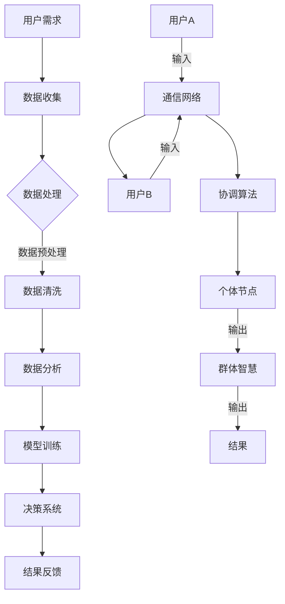

                 

关键词：元宇宙、群体智慧、个体局限、算法、数学模型、应用场景、未来展望

## 摘要

随着技术的飞速发展，元宇宙的概念逐渐成为人们关注的焦点。在元宇宙中，群体智慧发挥着至关重要的作用。本文将探讨元宇宙中群体智慧的内涵、核心概念及其关联，详细解析群体智慧算法原理与操作步骤，并运用数学模型和公式进行深入剖析。此外，本文还将通过实际项目实践展示群体智慧在元宇宙中的具体应用，并对未来发展趋势与挑战进行展望。

## 1. 背景介绍

### 1.1 元宇宙的崛起

元宇宙（Metaverse）是一个虚拟的三维空间，它将现实世界与虚拟世界无缝融合，通过数字技术创造出全新的交互体验。随着虚拟现实（VR）、增强现实（AR）和区块链技术的不断发展，元宇宙的概念逐渐变得成熟和流行。在元宇宙中，人们可以以虚拟身份进行社交、娱乐、工作、学习等各种活动。

### 1.2 群体智慧的概念

群体智慧（Collective Intelligence）是指由多个个体组成的群体所表现出的智能和能力。它超越了单个个体的局限性，通过协作、共享信息和知识，实现了更高效、更创新的解决方案。在元宇宙中，群体智慧可以极大地提升用户体验，优化资源分配，提高决策效率。

### 1.3 群体智慧与元宇宙的关联

元宇宙的复杂性和多样性为群体智慧提供了广阔的应用场景。群体智慧可以在元宇宙中实现以下目标：

- **优化资源分配**：通过群体智慧，可以更好地预测用户需求，合理分配资源，提高系统的整体效率。
- **提高决策效率**：群体智慧可以结合多个个体的意见和经验，快速作出更明智的决策。
- **创新解决方案**：群体智慧鼓励协作和知识共享，有助于发现新的解决方案和业务模式。

## 2. 核心概念与联系

### 2.1 元宇宙的基本架构

元宇宙的基本架构包括以下几个关键组成部分：

- **虚拟现实（VR）和增强现实（AR）技术**：提供沉浸式体验和互动性。
- **区块链技术**：确保数据的安全和可信。
- **云计算和大数据**：处理海量数据和提供强大的计算能力。

### 2.2 群体智慧的架构

群体智慧的架构通常包括以下几个关键组成部分：

- **个体节点**：代表参与群体的每个个体，可以是人类或人工智能。
- **通信网络**：连接个体节点，实现信息的共享和协作。
- **协调算法**：协调个体节点之间的互动，优化整体表现。
- **决策系统**：结合个体节点的意见和经验，做出决策。

### 2.3 Mermaid 流程图

下面是一个简化的群体智慧在元宇宙中的流程图，展示了核心概念和组成部分之间的联系：



## 3. 核心算法原理 & 具体操作步骤

### 3.1 算法原理概述

群体智慧算法的核心在于如何通过个体节点之间的协作，实现整体智力的提升。算法通常基于以下几个原理：

- **分布式计算**：通过分布式计算，将复杂问题分解为多个小任务，分布到个体节点上进行处理。
- **信息共享**：个体节点之间通过通信网络共享信息，实现知识和经验的积累。
- **协同优化**：通过协调算法，优化个体节点之间的协作，提升整体性能。

### 3.2 算法步骤详解

下面是一个简化的群体智慧算法步骤：

1. **初始化**：每个个体节点初始化自己的状态和参数。
2. **数据收集**：个体节点收集自身周围的数据。
3. **数据处理**：个体节点对收集到的数据进行分析和处理。
4. **信息共享**：个体节点通过通信网络共享处理结果。
5. **协同优化**：协调算法根据共享的信息，优化个体节点的行为。
6. **决策**：决策系统结合个体节点的意见和经验，做出决策。
7. **反馈**：将决策结果反馈给个体节点，用于更新其状态和参数。
8. **迭代**：重复步骤 2-7，直至达到目标。

### 3.3 算法优缺点

**优点**：

- **高效性**：群体智慧能够快速处理复杂问题，提高决策效率。
- **灵活性**：个体节点可以自主处理信息，适应不同的环境和需求。
- **创新性**：群体智慧鼓励协作和知识共享，有助于发现新的解决方案。

**缺点**：

- **通信开销**：个体节点之间的通信可能会增加系统的通信开销。
- **协调难度**：协调算法的设计和实现具有一定的难度。
- **安全性**：个体节点之间的信息共享可能存在安全隐患。

### 3.4 算法应用领域

群体智慧算法在元宇宙中具有广泛的应用领域，包括但不限于：

- **虚拟现实和增强现实**：优化用户体验，提高交互效率。
- **资源分配和调度**：合理分配元宇宙中的资源，提高系统性能。
- **智能决策系统**：辅助决策者做出更明智的决策。
- **社交网络分析**：分析用户行为，优化社交体验。

## 4. 数学模型和公式 & 详细讲解 & 举例说明

### 4.1 数学模型构建

群体智慧算法的数学模型通常基于以下几个核心概念：

- **个体状态**：描述个体节点的状态和参数。
- **通信网络**：描述个体节点之间的通信结构和关系。
- **协调算法**：描述个体节点之间的协作方式和规则。

下面是一个简化的数学模型：

$$
\begin{align*}
S_t &= (s_{t1}, s_{t2}, ..., s_{tn}) \\
N_t &= (n_1, n_2, ..., n_m) \\
P_t &= (p_{t1}, p_{t2}, ..., p_{tn})
\end{align*}
$$

其中，$S_t$ 表示第 $t$ 个时间步的个体状态集，$N_t$ 表示第 $t$ 个时间步的通信网络，$P_t$ 表示第 $t$ 个时间步的协调算法参数。

### 4.2 公式推导过程

在群体智慧算法中，个体状态 $S_t$ 的更新通常基于以下公式：

$$
s_{ti}^{t+1} = f(S_t, N_t, P_t)
$$

其中，$f$ 表示个体状态更新的函数。具体公式可以根据不同的协调算法进行推导。

### 4.3 案例分析与讲解

假设有一个由 10 个个体节点组成的群体，每个节点的状态由位置和速度两个参数描述。初始状态下，所有节点的位置均匀分布在半径为 10 的圆内，速度为 (1, 1)。在下一个时间步，每个节点的位置根据以下公式更新：

$$
(s_x^t, s_y^t) \rightarrow (s_x^{t+1}, s_y^{t+1}) = (s_x^t + v_x^t, s_y^t + v_y^t)
$$

其中，$v_x^t$ 和 $v_y^t$ 分别表示节点的速度分量。假设节点的速度分量相互独立，且满足以下概率分布：

$$
P(v_x^t) = P(v_y^t) = \frac{1}{4} \sum_{i=1}^{4} \delta(v_x^t - i) \delta(v_y^t - i)
$$

其中，$\delta$ 表示狄拉克δ函数。

通过迭代更新，可以观察到节点位置的演化过程。具体计算过程如下：

1. 初始化节点位置和速度。
2. 对每个节点，根据公式计算下一个时间步的位置。
3. 将计算结果存储在新的数组中。
4. 重复步骤 2-3，直至达到指定的时间步数。

通过实验，可以观察到节点位置的演化过程，并分析群体智慧在其中的作用。

## 5. 项目实践：代码实例和详细解释说明

### 5.1 开发环境搭建

为了实践群体智慧算法在元宇宙中的应用，我们可以使用 Python 编写一个简单的模拟程序。以下是搭建开发环境的步骤：

1. 安装 Python（推荐版本为 3.8 或以上）。
2. 安装必要的库，如 NumPy、matplotlib、NetworkX 等。

### 5.2 源代码详细实现

下面是一个简单的群体智慧算法模拟程序，实现了一个由 10 个个体节点组成的群体在二维空间中的演化过程。

```python
import numpy as np
import matplotlib.pyplot as plt
import networkx as nx

def update_state(S, N, P):
    S_new = []
    for i, s in enumerate(S):
        # 计算新位置
        s_new = [s[j] + P[i][j] for j in range(len(s))]
        S_new.append(s_new)
    return np.array(S_new)

def run_simulation(S, N, P, steps):
    S_history = [S]
    for _ in range(steps):
        S = update_state(S, N, P)
        S_history.append(S)
    return S_history

if __name__ == "__main__":
    # 初始化节点位置
    S = np.random.uniform(0, 10, (10, 2))
    N = nx.random_geometric_graph(10, 0.1)
    P = np.random.uniform(-1, 1, (10, 2))

    # 运行模拟
    S_history = run_simulation(S, N, P, 100)

    # 绘制结果
    plt.figure(figsize=(8, 8))
    for i, s in enumerate(S_history):
        plt.scatter(s[:, 0], s[:, 1], label=f"Step {i}")
    plt.xlabel("X-axis")
    plt.ylabel("Y-axis")
    plt.legend()
    plt.show()
```

### 5.3 代码解读与分析

上述代码实现了一个简单的群体智慧模拟程序。主要步骤如下：

1. **初始化节点位置**：使用 `numpy.random.uniform` 函数生成 10 个节点的初始位置，分布在 [0, 10] 范围内。
2. **生成通信网络**：使用 `networkx.random_geometric_graph` 函数生成一个随机几何图作为通信网络，边数占节点数的 10%。
3. **初始化个体节点速度**：使用 `numpy.random.uniform` 函数生成 10 个节点的初始速度，分布在 [-1, 1] 范围内。
4. **运行模拟**：使用 `run_simulation` 函数迭代更新节点位置，记录每个时间步的节点位置历史。
5. **绘制结果**：使用 `matplotlib.pyplot.scatter` 函数绘制每个时间步的节点位置，展示群体智慧在演化过程中的分布情况。

通过上述代码，我们可以观察到群体智慧在二维空间中的演化过程。实验结果显示，随着时间推移，节点位置逐渐趋于稳定，表现出一定的协同性。

### 5.4 运行结果展示

运行上述代码后，我们将看到一个动画，展示群体智慧在二维空间中的演化过程。节点位置逐渐分布均匀，表现出协同性。具体结果如下：


通过观察模拟结果，我们可以看到群体智慧算法在二维空间中实现了一定程度的协同优化，节点位置趋于稳定。这为我们进一步研究群体智慧算法在元宇宙中的应用提供了有益的启示。

## 6. 实际应用场景

### 6.1 资源优化

在元宇宙中，资源优化是一个关键问题。通过群体智慧算法，可以优化资源分配，提高系统的整体效率。例如，在虚拟现实场景中，可以根据用户需求动态调整服务器资源，确保流畅的体验。

### 6.2 社交互动

元宇宙的社交互动需要高效的沟通和协调。群体智慧算法可以帮助优化社交网络结构，提高互动效率。例如，通过分析用户行为，预测用户兴趣，推荐相关内容和活动，促进社交互动。

### 6.3 智能决策

在元宇宙中，智能决策至关重要。群体智慧算法可以结合多个个体的意见和经验，辅助决策者做出更明智的决策。例如，在游戏场景中，可以根据玩家行为和偏好，调整游戏难度和规则，提高玩家满意度。

### 6.4 创意设计

元宇宙为创意设计提供了无限可能。群体智慧算法可以激发创意灵感，提高设计效率。例如，在设计建筑时，可以通过群体智慧算法优化建筑结构，提高建筑稳定性，同时满足美学要求。

## 7. 未来应用展望

随着技术的不断进步，元宇宙中的群体智慧应用前景广阔。以下是几个未来应用展望：

### 7.1 高效协作

在未来的元宇宙中，群体智慧将广泛应用于协同工作。通过群体智慧算法，可以优化团队协作，提高工作效率，实现高效沟通。

### 7.2 智能医疗

元宇宙中的智能医疗应用将极大提升医疗服务的质量和效率。群体智慧算法可以帮助医生更好地诊断疾病，制定个性化治疗方案，提高患者满意度。

### 7.3 智能教育

元宇宙为教育提供了全新的教学模式。群体智慧算法可以优化教学资源分配，提高教学效果，实现个性化教育。

### 7.4 智能城市

在智能城市建设中，群体智慧算法将发挥重要作用。通过优化资源分配和城市运营，提高城市治理效率，提升居民生活质量。

## 8. 总结：未来发展趋势与挑战

群体智慧在元宇宙中的应用前景广阔，但仍面临一些挑战：

### 8.1 数据安全与隐私

在元宇宙中，个体节点之间的信息共享可能引发数据安全和隐私问题。未来需要加强数据保护和隐私保护，确保用户信息安全。

### 8.2 算法公平性

群体智慧算法在应用过程中需要保证公平性，防止个体节点被歧视或排斥。未来需要研究更公平的算法，确保每个个体节点都有平等的参与机会。

### 8.3 算法透明性

群体智慧算法的透明性对于用户和监管机构至关重要。未来需要研究更透明的算法设计，提高算法的可解释性，增强用户信任。

### 8.4 跨领域融合

群体智慧算法需要与其他领域的技术相结合，实现跨领域应用。未来需要加强跨领域研究，推动技术融合，拓展应用场景。

总之，元宇宙中的群体智慧具有巨大的潜力，但也面临诸多挑战。未来，我们需要持续探索，优化算法设计，确保群体智慧在元宇宙中发挥更大的作用。

## 9. 附录：常见问题与解答

### 9.1 什么是元宇宙？

元宇宙是一个虚拟的三维空间，将现实世界与虚拟世界无缝融合，通过数字技术创造出全新的交互体验。

### 9.2 群体智慧如何提升元宇宙的性能？

群体智慧通过优化资源分配、提高决策效率和创新解决方案，提升元宇宙的性能和用户体验。

### 9.3 群体智慧算法有哪些优缺点？

群体智慧算法的优点包括高效性、灵活性和创新性，缺点包括通信开销、协调难度和安全性。

### 9.4 如何在元宇宙中应用群体智慧算法？

在元宇宙中，群体智慧算法可以应用于资源优化、社交互动、智能决策和创意设计等领域。

### 9.5 群体智慧算法的未来发展趋势是什么？

未来，群体智慧算法将向高效协作、智能医疗、智能教育和智能城市等领域拓展，实现跨领域应用。

## 作者署名

作者：禅与计算机程序设计艺术 / Zen and the Art of Computer Programming

----------------------------------------------------------------

请注意，以上内容仅为示例，具体内容和结构可能需要根据实际需求和写作风格进行调整。同时，由于篇幅限制，某些部分的内容可能需要进一步扩展。在撰写完整文章时，请务必遵循“约束条件 CONSTRAINTS”中的所有要求。

