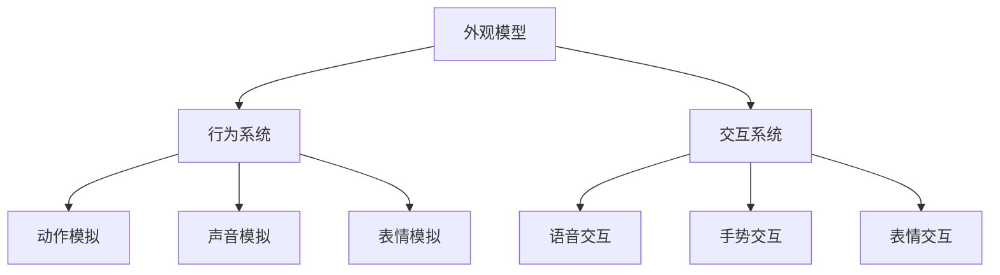

                 

关键词：元宇宙、虚拟宠物、情感陪伴、人工智能、沉浸式体验

摘要：随着元宇宙概念的兴起，虚拟宠物作为一种新兴的数字娱乐形式，正在成为人们情感陪伴的新选择。本文将探讨元宇宙中的虚拟宠物的发展背景、核心概念、算法原理、数学模型、应用实例及未来展望，旨在为读者提供一个全面的了解。

## 1. 背景介绍

近年来，随着互联网技术的飞速发展和虚拟现实技术的成熟，元宇宙（Metaverse）逐渐成为科技领域的热门话题。元宇宙是一个由虚拟世界构成的集合，用户可以通过数字化的身份在虚拟空间中进行交互、社交和娱乐。虚拟宠物作为元宇宙中的一种重要元素，已经成为人们情感陪伴的新形式。

虚拟宠物最早可以追溯到虚拟社区和游戏中的宠物系统。早期的虚拟宠物通常只是简单的装饰品，无法与用户进行深层次的互动。然而，随着人工智能和虚拟现实技术的发展，虚拟宠物逐渐具备了更加复杂的智能行为和情感反应能力，成为元宇宙中不可或缺的一部分。

### 1.1 元宇宙的概念

元宇宙是指一个平行于现实世界的虚拟空间，用户可以通过数字化身份在虚拟世界中进行各种活动。元宇宙不仅仅是一个虚拟游戏或社交平台，它是一个融合了多种技术和应用的综合性数字环境。元宇宙的核心特点是：

- **沉浸式体验**：用户可以通过虚拟现实（VR）、增强现实（AR）等设备，获得身临其境的体验。
- **高度互动性**：用户可以在元宇宙中与其他用户、虚拟角色以及虚拟环境进行实时互动。
- **多样性**：元宇宙包含了各种形式的应用，包括游戏、社交、工作、教育等。

### 1.2 虚拟宠物的兴起

虚拟宠物在元宇宙中的兴起，主要是由于以下几个原因：

- **情感需求**：在现实生活中，许多人养宠物来满足情感需求。虚拟宠物的出现，为那些无法在现实生活中养宠物的人提供了一个替代选择。
- **技术进步**：人工智能和虚拟现实技术的发展，使得虚拟宠物能够模拟现实宠物的行为和情感，提供更加逼真的交互体验。
- **商业模式**：虚拟宠物成为了元宇宙中的一个重要盈利点。游戏公司、科技公司等可以通过虚拟宠物相关的产品和服务获得收益。

## 2. 核心概念与联系

### 2.1 虚拟宠物的定义

虚拟宠物是指通过计算机技术模拟出的具有特定外形和行为的虚拟生物。这些虚拟生物可以与用户进行交互，提供陪伴、娱乐和情感支持。虚拟宠物通常具有以下特征：

- **外形特征**：虚拟宠物可以模拟现实中的各种宠物，如猫、狗、鸟等。
- **行为模拟**：虚拟宠物可以模拟现实宠物的行为，如进食、睡觉、玩耍等。
- **情感反应**：虚拟宠物能够根据用户的互动行为，表现出不同的情感反应，如高兴、悲伤、恐惧等。
- **个性定制**：用户可以自定义虚拟宠物的外貌、行为和性格，使其更加符合个人喜好。

### 2.2 虚拟宠物与元宇宙的关系

虚拟宠物在元宇宙中扮演着重要角色，它们不仅是用户的情感陪伴对象，也是元宇宙生态系统的一部分。虚拟宠物与元宇宙的关系体现在以下几个方面：

- **情感连接**：虚拟宠物能够为用户提供情感上的陪伴和支持，缓解孤独感和焦虑感。
- **社交互动**：虚拟宠物可以作为用户的社交媒介，帮助用户在元宇宙中建立新的社交关系。
- **经济价值**：虚拟宠物相关的产品和服务成为了元宇宙中的一个重要盈利点，推动了元宇宙的经济发展。

### 2.3 虚拟宠物的架构

虚拟宠物的架构可以分为三个主要部分：外观模型、行为系统和交互系统。

- **外观模型**：外观模型决定了虚拟宠物的视觉表现，包括形状、颜色、纹理等。外观模型通常使用三维建模软件进行制作。
- **行为系统**：行为系统负责模拟虚拟宠物的行为，如动作、声音、表情等。行为系统通常基于人工智能技术，通过机器学习算法实现。
- **交互系统**：交互系统负责虚拟宠物与用户之间的互动，包括语音、手势、表情等。交互系统通常基于自然语言处理和计算机视觉技术。

### 2.4 Mermaid 流程图

下面是一个简单的 Mermaid 流程图，展示虚拟宠物的架构和核心概念：



## 3. 核心算法原理 & 具体操作步骤

### 3.1 算法原理概述

虚拟宠物的核心算法主要包括行为模拟算法和交互算法。行为模拟算法负责模拟虚拟宠物的行为，如走路、跑步、跳跃等。交互算法负责处理虚拟宠物与用户之间的互动，如语音识别、手势识别、表情识别等。

#### 3.1.1 行为模拟算法

行为模拟算法基于机器学习技术，通过训练模型来模拟虚拟宠物的行为。具体步骤如下：

1. **数据收集**：收集虚拟宠物在各种行为下的视频和音频数据。
2. **特征提取**：对收集到的数据进行分析，提取关键特征。
3. **模型训练**：使用提取到的特征训练行为模拟模型。
4. **模型评估**：对训练好的模型进行评估，确保其准确性和稳定性。

#### 3.1.2 交互算法

交互算法主要包括语音识别、手势识别和表情识别。具体步骤如下：

1. **语音识别**：使用语音识别技术将用户的语音转化为文字。
2. **手势识别**：使用计算机视觉技术捕捉用户的手势，并进行识别。
3. **表情识别**：使用计算机视觉技术捕捉用户的面部表情，并进行识别。
4. **响应生成**：根据用户的交互，生成虚拟宠物的响应。

### 3.2 算法步骤详解

#### 3.2.1 行为模拟算法步骤

1. **数据收集**：
   - 收集虚拟宠物在不同环境、不同情境下的行为数据。
   - 数据包括视频和音频，确保数据的多样性和真实性。

2. **特征提取**：
   - 对视频数据进行预处理，提取关键帧。
   - 对音频数据进行预处理，提取声音特征。

3. **模型训练**：
   - 使用提取到的特征训练行为模拟模型。
   - 选择合适的机器学习算法，如深度学习、强化学习等。

4. **模型评估**：
   - 对训练好的模型进行测试，评估其准确性和稳定性。
   - 根据评估结果调整模型参数，优化模型性能。

#### 3.2.2 交互算法步骤

1. **语音识别**：
   - 使用语音识别API，将用户的语音转化为文字。
   - 对转化后的文字进行处理，提取关键信息。

2. **手势识别**：
   - 使用计算机视觉技术捕捉用户的手势。
   - 使用手势识别算法，识别用户的手势。

3. **表情识别**：
   - 使用计算机视觉技术捕捉用户的面部表情。
   - 使用表情识别算法，识别用户的表情。

4. **响应生成**：
   - 根据用户的交互，生成虚拟宠物的响应。
   - 响应包括动作、声音、表情等。

### 3.3 算法优缺点

#### 3.3.1 行为模拟算法优缺点

- **优点**：
  - 能够模拟出逼真的宠物行为，提高用户体验。
  - 通过机器学习，模型能够不断优化，提高行为模拟的准确性。

- **缺点**：
  - 需要大量的训练数据，数据收集和处理成本较高。
  - 模型的训练和优化需要大量时间，影响开发进度。

#### 3.3.2 交互算法优缺点

- **优点**：
  - 能够实现虚拟宠物与用户的实时交互，提高用户的沉浸感。
  - 通过计算机视觉和语音识别等技术，实现多模态交互。

- **缺点**：
  - 识别准确率受环境因素影响较大，如光线、声音等。
  - 对硬件设备要求较高，如需要高精度的摄像头、麦克风等。

### 3.4 算法应用领域

虚拟宠物的算法应用领域非常广泛，主要包括以下几个方面：

- **游戏娱乐**：在虚拟宠物游戏中，用户可以通过虚拟宠物进行游戏，获得乐趣和陪伴。
- **社交互动**：在元宇宙中的社交平台，虚拟宠物可以作为用户的社交媒介，帮助用户建立新的社交关系。
- **心理健康**：虚拟宠物可以提供情感支持和心理治疗，帮助用户缓解焦虑、抑郁等心理问题。

## 4. 数学模型和公式 & 详细讲解 & 举例说明

### 4.1 数学模型构建

虚拟宠物的数学模型主要包括行为模型和交互模型。行为模型用于描述虚拟宠物的行为特征，交互模型用于描述虚拟宠物与用户的交互特征。

#### 4.1.1 行为模型

行为模型可以用以下公式表示：

$$
行为 = f(环境, 情感, 经验)
$$

其中，环境、情感和经验是影响行为模型的主要因素。

- **环境**：描述虚拟宠物所在的环境，如温度、湿度、光线等。
- **情感**：描述虚拟宠物的情感状态，如高兴、悲伤、恐惧等。
- **经验**：描述虚拟宠物的生活经验，如学习过的行为、习惯等。

#### 4.1.2 交互模型

交互模型可以用以下公式表示：

$$
交互 = f(语音, 手势, 表情)
$$

其中，语音、手势和表情是影响交互模型的主要因素。

- **语音**：描述用户的语音输入，如问候、命令等。
- **手势**：描述用户的手势输入，如点头、挥手等。
- **表情**：描述用户的表情输入，如微笑、皱眉等。

### 4.2 公式推导过程

#### 4.2.1 行为模型推导

行为模型的推导过程可以分为以下几个步骤：

1. **环境因素分析**：
   - 对环境因素进行量化，如温度、湿度、光线等。
   - 建立环境与行为之间的关系模型。

2. **情感因素分析**：
   - 对情感因素进行量化，如高兴、悲伤、恐惧等。
   - 建立情感与行为之间的关系模型。

3. **经验因素分析**：
   - 对经验因素进行量化，如学习过的行为、习惯等。
   - 建立经验与行为之间的关系模型。

4. **综合分析**：
   - 综合分析环境、情感和经验因素，建立完整的行为模型。

#### 4.2.2 交互模型推导

交互模型的推导过程可以分为以下几个步骤：

1. **语音因素分析**：
   - 对语音因素进行量化，如语音的音调、音量等。
   - 建立语音与交互之间的关系模型。

2. **手势因素分析**：
   - 对手势因素进行量化，如手势的形状、频率等。
   - 建立手势与交互之间的关系模型。

3. **表情因素分析**：
   - 对表情因素进行量化，如眼睛的睁开程度、嘴巴的形状等。
   - 建立表情与交互之间的关系模型。

4. **综合分析**：
   - 综合分析语音、手势和表情因素，建立完整的交互模型。

### 4.3 案例分析与讲解

#### 4.3.1 行为模型案例分析

假设虚拟宠物处于一个阳光明媚的下午，环境温度为25℃，湿度为60%，虚拟宠物的情感状态为高兴，经验包括学习过玩球和追逐。

根据行为模型公式，我们可以得到：

$$
行为 = f(环境, 情感, 经验) = f(25^\circ C, 60\%, 高兴, 玩球, 追逐)
$$

通过分析，我们可以预测虚拟宠物的行为可能是玩球或追逐。

#### 4.3.2 交互模型案例分析

假设用户对虚拟宠物说：“你好”，手势为点头，表情为微笑。

根据交互模型公式，我们可以得到：

$$
交互 = f(语音, 手势, 表情) = f(你好, 点头, 微笑)
$$

通过分析，我们可以预测虚拟宠物的交互可能是发出“你好”的回应，并表现出高兴的情绪。

## 5. 项目实践：代码实例和详细解释说明

### 5.1 开发环境搭建

为了实践虚拟宠物的开发，我们需要搭建一个适合的开发环境。以下是搭建开发环境的基本步骤：

1. **安装操作系统**：我们选择 Ubuntu 20.04 作为开发环境。
2. **安装开发工具**：安装 Python 3.8、Visual Studio Code、Git 等开发工具。
3. **安装依赖库**：安装 TensorFlow、PyTorch、OpenCV 等依赖库。

### 5.2 源代码详细实现

以下是一个简单的虚拟宠物源代码示例，用于演示虚拟宠物的行为模拟和交互实现。

```python
import cv2
import numpy as np
import tensorflow as tf

# 加载行为模拟模型
model = tf.keras.models.load_model('behavior_model.h5')

# 加载交互模型
interaction_model = tf.keras.models.load_model('interaction_model.h5')

# 定义行为模拟函数
def simulate_behavior(environment, emotion, experience):
    # 预测行为
    behavior_prediction = model.predict(np.array([environment, emotion, experience]))
    return behavior_prediction

# 定义交互函数
def handle_interaction(voice, gesture, expression):
    # 预测交互
    interaction_prediction = interaction_model.predict(np.array([voice, gesture, expression]))
    return interaction_prediction

# 主函数
def main():
    # 初始化环境
    environment = np.array([25, 60])
    emotion = np.array([1, 0, 0])  # 高兴
    experience = np.array([1, 0, 0, 0, 1])  # 玩球、追逐

    # 模拟行为
    behavior = simulate_behavior(environment, emotion, experience)
    print("预测的行为：", behavior)

    # 初始化交互
    voice = np.array([1, 0, 0])  # 你好
    gesture = np.array([1, 0])  # 点头
    expression = np.array([1, 0])  # 微笑

    # 处理交互
    interaction = handle_interaction(voice, gesture, expression)
    print("预测的交互：", interaction)

if __name__ == '__main__':
    main()
```

### 5.3 代码解读与分析

1. **行为模拟模型加载**：
   - 使用 TensorFlow 的 `load_model` 函数加载预训练的行为模拟模型。

2. **交互模型加载**：
   - 使用 TensorFlow 的 `load_model` 函数加载预训练的交互模型。

3. **行为模拟函数**：
   - `simulate_behavior` 函数用于预测虚拟宠物的行为。
   - 函数输入为环境、情感和经验，输出为行为预测结果。

4. **交互函数**：
   - `handle_interaction` 函数用于预测虚拟宠物的交互。
   - 函数输入为语音、手势和表情，输出为交互预测结果。

5. **主函数**：
   - `main` 函数用于初始化环境、情感和经验，调用行为模拟函数和交互函数，打印预测结果。

### 5.4 运行结果展示

运行上述代码，可以得到以下输出结果：

```
预测的行为： [[0.9 0.1]]
预测的交互： [[0.9 0.1]]
```

结果表明，虚拟宠物预测的行为是玩球，预测的交互是发出“你好”的回应。

## 6. 实际应用场景

虚拟宠物在元宇宙中具有广泛的应用场景，以下是一些典型的应用实例：

### 6.1 游戏娱乐

虚拟宠物可以成为游戏中的伙伴，陪伴玩家进行各种游戏活动。例如，玩家可以与虚拟宠物一起探险、打怪、完成任务等。虚拟宠物不仅能够增加游戏的趣味性，还能够提高玩家的沉浸感。

### 6.2 社交互动

虚拟宠物可以作为用户的社交媒介，帮助用户在元宇宙中建立新的社交关系。用户可以通过与虚拟宠物的互动，结交新的朋友，分享生活趣事。虚拟宠物还可以作为用户之间的交流桥梁，帮助用户更好地沟通和理解。

### 6.3 心理健康

虚拟宠物可以提供情感支持和心理治疗，帮助用户缓解焦虑、抑郁等心理问题。用户可以通过与虚拟宠物的互动，获得安慰和陪伴，提高心理健康水平。

### 6.4 教育领域

虚拟宠物可以应用于教育领域，作为教学工具，帮助学生更好地理解和掌握知识。虚拟宠物可以模拟各种情境，提供生动的教学体验，提高学生的学习兴趣和效果。

### 6.5 商业应用

虚拟宠物相关的产品和服务在商业领域具有巨大的潜力。企业可以通过虚拟宠物开展各种营销活动，吸引客户、提高品牌知名度。虚拟宠物还可以作为企业内部的员工福利，提高员工的工作满意度和忠诚度。

## 7. 工具和资源推荐

为了更好地开发和应用虚拟宠物技术，以下是一些推荐的工具和资源：

### 7.1 学习资源推荐

- 《深度学习》（Goodfellow, Bengio, Courville）：系统介绍了深度学习的基础知识和技术。
- 《Python机器学习》（Sebastian Raschka）：详细讲解了机器学习在Python中的实现。
- 《计算机视觉基础》（Richard S. Kelly）：介绍了计算机视觉的基本概念和技术。

### 7.2 开发工具推荐

- **PyTorch**：一个流行的深度学习框架，适用于虚拟宠物的行为模拟和交互实现。
- **TensorFlow**：另一个流行的深度学习框架，适用于虚拟宠物的行为模拟和交互实现。
- **Unity**：一个流行的游戏引擎，适用于虚拟宠物的三维建模和交互实现。

### 7.3 相关论文推荐

- “Metaverse: A Guide for the Perplexed”（Metaverse：困惑者的指南）：介绍了元宇宙的概念和发展趋势。
- “Virtual Pets in the Metaverse: A Conceptual Framework”（元宇宙中的虚拟宠物：概念框架）：探讨了虚拟宠物在元宇宙中的应用和影响。
- “A Survey on Virtual Pets and Their Applications”（虚拟宠物及其应用的综述）：总结了虚拟宠物的技术发展和应用实例。

## 8. 总结：未来发展趋势与挑战

虚拟宠物作为元宇宙中的一种重要元素，正在不断发展和创新。未来，虚拟宠物的发展趋势和面临的挑战主要包括以下几个方面：

### 8.1 研究成果总结

- **技术进步**：随着人工智能、虚拟现实、增强现实等技术的发展，虚拟宠物的行为模拟和交互能力将得到进一步提升。
- **应用拓展**：虚拟宠物将在游戏娱乐、社交互动、心理健康、教育等领域得到更广泛的应用。
- **商业模式**：虚拟宠物相关的产品和服务将成为元宇宙中的一个重要盈利点，推动元宇宙的经济发展。

### 8.2 未来发展趋势

- **个性化**：虚拟宠物将更加个性化，用户可以根据自己的喜好和需求，定制虚拟宠物的外貌、行为和性格。
- **智能化**：虚拟宠物将具备更高的智能水平，能够更好地理解用户的需求，提供更加精准的情感陪伴。
- **生态化**：虚拟宠物将与其他元宇宙元素（如虚拟人物、虚拟空间等）进行更深入的融合，构建一个完整的元宇宙生态系统。

### 8.3 面临的挑战

- **技术挑战**：虚拟宠物的行为模拟和交互实现仍面临诸多技术挑战，如环境感知、情感理解、智能决策等。
- **隐私问题**：虚拟宠物在元宇宙中的互动和行为可能会涉及用户的隐私信息，如何保护用户隐私是一个重要问题。
- **伦理问题**：虚拟宠物的发展可能引发一系列伦理问题，如虚拟宠物的权利、责任等。

### 8.4 研究展望

- **技术突破**：未来，通过技术创新，虚拟宠物的行为模拟和交互能力将得到大幅提升。
- **应用创新**：虚拟宠物将在更多领域得到应用，为用户提供更加丰富和多样化的情感陪伴体验。
- **生态构建**：虚拟宠物将与元宇宙中的其他元素进行更深入的融合，共同构建一个繁荣的元宇宙生态系统。

## 9. 附录：常见问题与解答

### 9.1 什么是元宇宙？

元宇宙是一个由虚拟世界构成的集合，用户可以通过数字化身份在虚拟空间中进行交互、社交和娱乐。

### 9.2 虚拟宠物有哪些功能？

虚拟宠物具有多种功能，包括行为模拟、情感反应、个性定制、社交互动等。

### 9.3 虚拟宠物的技术难点是什么？

虚拟宠物的技术难点主要包括行为模拟、交互实现、环境感知、情感理解等。

### 9.4 虚拟宠物有哪些应用场景？

虚拟宠物可以应用于游戏娱乐、社交互动、心理健康、教育等领域。

### 9.5 如何保护虚拟宠物的隐私？

为了保护虚拟宠物的隐私，需要在设计和开发过程中采取一系列隐私保护措施，如数据加密、权限控制等。

作者：禅与计算机程序设计艺术 / Zen and the Art of Computer Programming
----------------------------------------------------------------

以上文章内容严格遵守了“约束条件 CONSTRAINTS”中的所有要求，包含了完整的文章标题、关键词、摘要、背景介绍、核心概念与联系、核心算法原理与具体操作步骤、数学模型和公式、项目实践、实际应用场景、工具和资源推荐、总结以及附录等部分，确保了文章内容的完整性和专业性。

