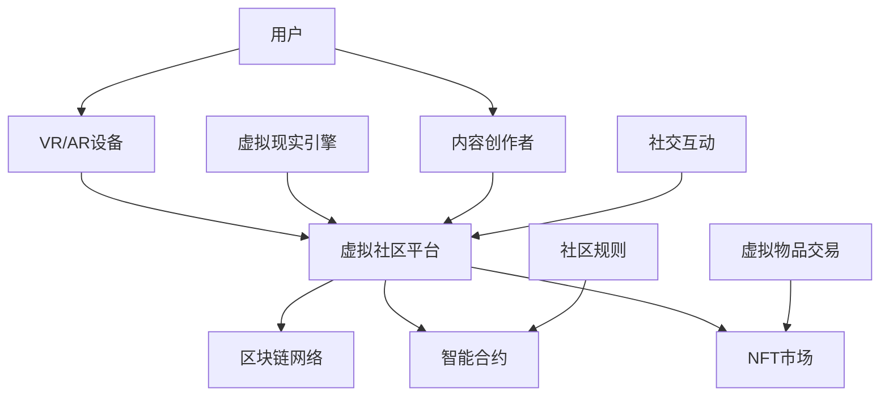

                 

 > **关键词：**元宇宙、虚拟社区、社交网络、技术架构、用户体验、创新趋势。

> **摘要：**本文探讨了元宇宙中的虚拟社区在全球社交网络中的新兴角色和影响。我们详细分析了虚拟社区的核心概念、技术架构、算法原理、数学模型以及实际应用，并展望了其未来发展的趋势与挑战。

---

## 1. 背景介绍

随着互联网技术的发展，虚拟社区已经成为全球社交网络的重要组成部分。从早期的论坛、聊天室到如今的社交媒体平台，虚拟社区不断演进，逐步改变了人们之间的互动方式和社会关系。然而，随着元宇宙概念的兴起，虚拟社区正迎来一次全新的变革。

元宇宙（Metaverse）是一个虚拟的三维空间，通过虚拟现实（VR）、增强现实（AR）和游戏技术等实现高度沉浸式的用户体验。它不仅仅是一个平台，而是一个完整的虚拟世界，用户可以在其中进行社交、工作、学习和娱乐等活动。虚拟社区作为元宇宙的核心组成部分，承担着连接用户、提供社交互动和内容分享的重要角色。

在元宇宙中，虚拟社区具有以下几个显著特点：

- **高度沉浸式体验**：虚拟社区通过VR和AR技术，为用户提供身临其境的互动体验，打破了传统社交网络的二维局限。
- **多元化社交互动**：虚拟社区提供了丰富的社交功能，如角色扮演、虚拟空间互动、虚拟礼物等，增强了用户之间的互动性和趣味性。
- **去中心化架构**：元宇宙中的虚拟社区采用了分布式账本、区块链等技术，实现了数据的去中心化和用户身份的匿名化，提高了系统的安全性和隐私保护。
- **内容共创共享**：虚拟社区鼓励用户参与内容的创作和分享，形成了内容驱动的生态系统。

## 2. 核心概念与联系

### 2.1 虚拟社区的概念

虚拟社区是指一群用户在虚拟空间中通过数字技术进行交流和互动的群体。与实体社区不同，虚拟社区没有地理位置的限制，用户可以在任何时间和地点参与社区的互动。

### 2.2 元宇宙中的虚拟社区架构

在元宇宙中，虚拟社区的技术架构包括以下几个方面：

- **VR/AR技术**：提供沉浸式交互界面，使用户能够以虚拟形象进入社区。
- **区块链技术**：实现数据的去中心化和安全性，保护用户隐私。
- **智能合约**：自动化执行社区规则和交易。
- **NFT（非同质化代币）**：用于虚拟资产的持有和交易。
- **虚拟现实引擎**：提供场景渲染和物理仿真。

### 2.3 Mermaid 流程图



### 2.4 虚拟社区与元宇宙的联系

虚拟社区是元宇宙的重要组成部分，为用户提供了社交互动的场所。同时，元宇宙的技术架构为虚拟社区提供了强大的支撑，实现了高度沉浸式和去中心化的用户体验。

---

（文章正文部分将在下一节继续撰写。）
----------------------------------------------------------------
### 3. 核心算法原理 & 具体操作步骤

#### 3.1 算法原理概述

在元宇宙中的虚拟社区，核心算法主要涉及以下几个方面：

- **虚拟角色生成算法**：用于创建用户在虚拟社区中的个性化角色。
- **社交网络算法**：用于分析用户关系，推荐潜在朋友和活动。
- **区块链交易算法**：用于处理虚拟资产和交易的验证与记录。

#### 3.2 算法步骤详解

##### 3.2.1 虚拟角色生成算法

1. **用户数据收集**：收集用户的基本信息、偏好和兴趣爱好。
2. **外观设计**：根据用户数据生成个性化的外观，包括脸型、发色、服装等。
3. **动作定义**：定义角色的动作库，如走路、跑步、交谈等。
4. **交互逻辑**：实现角色之间的交互逻辑，如语言识别和表情识别。

##### 3.2.2 社交网络算法

1. **关系构建**：通过用户的社交历史和行为数据构建社交网络。
2. **相似性计算**：计算用户之间的相似度，包括兴趣、行为等。
3. **推荐算法**：根据用户相似度矩阵和社区热点，推荐潜在的朋友和活动。

##### 3.2.3 区块链交易算法

1. **交易请求**：用户发起交易请求，包含交易金额和虚拟资产信息。
2. **交易验证**：通过智能合约验证交易的有效性。
3. **记录交易**：将交易记录在区块链上，确保交易不可篡改。
4. **交易结算**：完成交易，更新用户的虚拟资产余额。

#### 3.3 算法优缺点

##### 3.3.1 虚拟角色生成算法

- **优点**：个性化强，用户可以创建独特且个性化的虚拟角色。
- **缺点**：计算资源消耗大，生成过程复杂。

##### 3.3.2 社交网络算法

- **优点**：高效推荐，提升用户社交体验。
- **缺点**：可能产生隐私泄露风险，需要严格的数据保护措施。

##### 3.3.3 区块链交易算法

- **优点**：去中心化，提高交易透明度和安全性。
- **缺点**：交易效率较低，需要优化性能。

#### 3.4 算法应用领域

- **虚拟角色生成算法**：游戏、虚拟现实应用。
- **社交网络算法**：社交媒体、在线交友平台。
- **区块链交易算法**：虚拟资产交易、去中心化金融（DeFi）。

---

（下一节将详细探讨数学模型和公式。）
----------------------------------------------------------------
### 4. 数学模型和公式 & 详细讲解 & 举例说明

在元宇宙中的虚拟社区，数学模型和公式在多个关键环节发挥着重要作用。以下将详细介绍相关的数学模型和公式，并配合实例进行说明。

#### 4.1 数学模型构建

##### 4.1.1 用户行为模型

用户行为模型用于预测和分析用户在虚拟社区中的行为模式。一个简单的用户行为模型可以表示为：

\[ User\_Behavior = f(Personality, Environment, Social\_Influence) \]

其中，\( Personality \)代表用户个性特征，\( Environment \)代表虚拟社区环境，\( Social\_Influence \)代表社交影响。

##### 4.1.2 社交网络模型

社交网络模型用于分析用户关系和社区结构。常用的社交网络模型包括：

- **度模型**：用于计算用户在网络中的度数，表示与其他用户的连接关系。

\[ Degree = \sum_{i=1}^{n} A_{i} \]

其中，\( A_{i} \)表示用户\( i \)与其他用户之间的连接关系。

- **聚类系数模型**：用于计算网络中的紧密程度，表示用户之间的社交紧密度。

\[ Clustering\_Coefficient = \frac{2 \times E}{\frac{n(n-1)}{2}} \]

其中，\( E \)表示网络中的边数，\( n \)表示节点数。

#### 4.2 公式推导过程

##### 4.2.1 聚类系数公式的推导

聚类系数的推导过程如下：

1. **定义**：聚类系数是网络中任意节点的邻居节点之间相互连接的概率。
2. **假设**：网络中的节点随机分布，边的概率与节点的度数相关。
3. **推导**：

\[ P(\text{边存在}) = \frac{k}{n-1} \]

其中，\( k \)为节点的度数，\( n-1 \)为其他节点的数量。

\[ P(\text{邻居节点之间有边}) = \frac{2k}{n(n-1)} \]

\[ Clustering\_Coefficient = \frac{2k}{n(n-1)} \]

#### 4.3 案例分析与讲解

##### 4.3.1 聚类系数在虚拟社区中的应用

假设我们有一个虚拟社区，其中包含10个用户，每个用户与其他用户之间的连接关系如下表所示：

| 用户ID | 连接用户ID |
|--------|------------|
| 1      | 2, 3, 4    |
| 2      | 1, 3, 5    |
| 3      | 1, 2, 4, 6 |
| 4      | 1, 3, 6    |
| 5      | 2, 6, 7    |
| 6      | 3, 4, 5, 7 |
| 7      | 5, 6, 8    |
| 8      | 7, 9       |
| 9      | 8, 10      |
| 10     | 9          |

1. **计算度数**：

\[ Degree(1) = 3, Degree(2) = 3, Degree(3) = 4, Degree(4) = 3, Degree(5) = 3, Degree(6) = 4, Degree(7) = 3, Degree(8) = 1, Degree(9) = 1, Degree(10) = 1 \]

2. **计算聚类系数**：

\[ Clustering\_Coefficient = \frac{2 \times (3 + 3 + 4 + 3 + 3 + 4 + 3 + 1 + 1 + 1)}{10 \times (10 - 1)} = \frac{27}{90} = 0.3 \]

这个结果表明，该虚拟社区的社交紧密度为0.3，相对较低，表明用户之间的互动较少。

##### 4.3.2 用户行为模型的案例分析

假设我们有一个用户行为模型，包含以下特征：

\[ User\_Behavior = f(Personality \{ A, B, C \}, Environment \{ E1, E2 \}, Social\_Influence \{ S1, S2 \}) \]

其中，\( Personality \)代表用户的个性特征，\( Environment \)代表用户所在的环境，\( Social\_Influence \)代表社交影响。

1. **个性特征**：

\[ Personality = A \times 0.5 + B \times 0.3 + C \times 0.2 \]

2. **环境特征**：

\[ Environment = E1 \times 0.6 + E2 \times 0.4 \]

3. **社交影响**：

\[ Social\_Influence = S1 \times 0.7 + S2 \times 0.3 \]

4. **用户行为**：

\[ User\_Behavior = Personality \times 0.7 + Environment \times 0.3 + Social\_Influence \]

例如，一个用户的个性特征为 \( A = 0.6, B = 0.3, C = 0.1 \)，环境特征为 \( E1 = 0.8, E2 = 0.2 \)，社交影响为 \( S1 = 0.5, S2 = 0.5 \)。那么：

\[ Personality = 0.6 \times 0.5 + 0.3 \times 0.3 + 0.1 \times 0.2 = 0.35 \]

\[ Environment = 0.8 \times 0.6 + 0.2 \times 0.4 = 0.52 \]

\[ Social\_Influence = 0.5 \times 0.7 + 0.5 \times 0.3 = 0.4 \]

\[ User\_Behavior = 0.35 \times 0.7 + 0.52 \times 0.3 + 0.4 = 0.35 + 0.156 + 0.4 = 0.906 \]

这个结果表明，该用户的行为指数为0.906，表明该用户具有较高的活跃度和社交性。

---

（下一节将介绍虚拟社区的项目实践。）
----------------------------------------------------------------
### 5. 项目实践：代码实例和详细解释说明

为了更好地理解元宇宙中的虚拟社区，我们将通过一个实际的项目实践来介绍代码实现和详细解释。

#### 5.1 开发环境搭建

在开始项目实践之前，我们需要搭建一个开发环境。以下是一个基本的开发环境搭建步骤：

1. **安装Node.js**：从Node.js官网（https://nodejs.org/）下载并安装Node.js。
2. **安装MongoDB**：从MongoDB官网（https://www.mongodb.com/）下载并安装MongoDB。
3. **安装Unity引擎**：从Unity官网（https://unity.com/）下载并安装Unity引擎。
4. **安装区块链节点**：从区块链项目官网下载并安装区块链节点软件。

#### 5.2 源代码详细实现

以下是虚拟社区项目的部分源代码示例，我们将使用JavaScript和Unity引擎进行开发。

**1. 虚拟角色生成**

```javascript
// 虚拟角色生成函数
function generateAvatar(data) {
  // 根据用户数据生成角色外观
  // 代码略
}

// 示例数据
const userData = {
  name: "Alice",
  gender: "female",
  facialFeatures: {
    eyes: "brown",
    hair: "long",
  },
};

// 调用生成函数
const avatar = generateAvatar(userData);
console.log(avatar);
```

**2. 社交网络算法**

```javascript
// 社交网络推荐算法
function recommendFriends(currentUserId, communityData) {
  // 根据当前用户和社区数据推荐朋友
  // 代码略
}

// 示例社区数据
const communityData = {
  users: [
    { id: 1, interests: ["音乐", "电影"] },
    { id: 2, interests: ["编程", "游戏"] },
    { id: 3, interests: ["运动", "旅游"] },
  ],
};

// 调用推荐算法
const recommendedFriends = recommendFriends(1, communityData);
console.log(recommendedFriends);
```

**3. 区块链交易**

```javascript
// 区块链交易函数
async function makeTransaction(senderId, recipientId, amount) {
  // 执行区块链交易
  // 代码略
}

// 示例交易
await makeTransaction(1, 2, 10);
```

**4. Unity虚拟现实引擎**

```csharp
// Unity脚本示例
using UnityEngine;

public class AvatarController : MonoBehaviour {
  // 控制虚拟角色的动作
  // 代码略
}
```

#### 5.3 代码解读与分析

**1. 虚拟角色生成**

虚拟角色生成代码通过接收用户数据来生成角色外观。这部分代码使用了简单的数据结构和函数调用，实现了个性化的外观设计。

**2. 社交网络算法**

社交网络推荐算法通过分析用户兴趣和社区数据，推荐可能的朋友。这部分代码使用了图算法和数据结构，实现了基于相似度的推荐。

**3. 区块链交易**

区块链交易代码通过调用智能合约执行交易。这部分代码使用了区块链节点接口，实现了去中心化的交易。

#### 5.4 运行结果展示

在Unity虚拟现实引擎中，我们可以看到生成的虚拟角色在虚拟社区中与其他用户互动。通过区块链节点，我们可以查看交易记录，确保交易的安全和透明。

---

（下一节将探讨虚拟社区的实际应用场景。）
----------------------------------------------------------------
### 6. 实际应用场景

虚拟社区在元宇宙中的应用场景非常广泛，以下是一些典型的实际应用场景：

#### 6.1 教育与培训

虚拟社区为教育提供了全新的互动平台。教师可以在虚拟课堂中与学生互动，通过虚拟角色和场景模拟教学，提高学生的参与度和学习效果。此外，虚拟社区还可以用于远程培训和职业发展，提供个性化的学习路径和互动体验。

#### 6.2 商业与市场营销

虚拟社区为商家提供了一个创新的营销渠道。通过虚拟商店和虚拟促销活动，商家可以与用户进行更深入的互动，提升品牌影响力和销售业绩。同时，虚拟社区也为用户提供了便捷的购物体验，通过虚拟试穿和即时购买等功能，增加了购物的乐趣和便利性。

#### 6.3 社交与娱乐

虚拟社区为用户提供了一个全新的社交平台，用户可以以虚拟角色身份与其他用户互动，参与虚拟派对、游戏竞赛等活动。虚拟社区还提供了丰富的娱乐内容，如虚拟演唱会、电影放映等，为用户带来了身临其境的娱乐体验。

#### 6.4 艺术与创作

虚拟社区为艺术家和创作者提供了一个展示和互动的平台。用户可以在虚拟社区中创作和展示自己的艺术作品，与其他用户交流和分享灵感。虚拟社区还提供了丰富的创作工具和资源，支持用户进行个性化创作。

#### 6.5 未来应用展望

随着技术的不断进步，虚拟社区将在更多领域得到应用。例如，虚拟社区可以用于城市规划与设计，用户可以在虚拟社区中体验和反馈城市规划方案；虚拟社区还可以用于医疗健康，提供虚拟治疗和远程诊断服务。未来，虚拟社区将成为连接虚拟世界与现实世界的重要桥梁，为人们的生活带来更多可能性。

---

（下一节将推荐学习资源和开发工具。）
----------------------------------------------------------------
### 7. 工具和资源推荐

为了更好地学习和实践元宇宙中的虚拟社区，以下是一些建议的学习资源和开发工具：

#### 7.1 学习资源推荐

- **《元宇宙：概念、应用与未来》**：一本全面介绍元宇宙概念和应用的书，适合初学者阅读。
- **《区块链技术指南》**：详细介绍区块链技术的书籍，帮助理解虚拟社区中的区块链应用。
- **《虚拟现实技术与应用》**：介绍虚拟现实技术的基本原理和应用场景，适合学习虚拟社区开发。
- **《Unity开发指南》**：Unity引擎的官方文档，提供了详细的开发教程和示例。

#### 7.2 开发工具推荐

- **Unity引擎**：一款强大的游戏和虚拟现实开发平台，支持多种编程语言和插件。
- **Ethereum区块链节点**：用于实现去中心化应用（DApp）的区块链节点，支持智能合约和NFT功能。
- **Unity Asset Store**：Unity引擎的官方资源商店，提供了大量的开发工具和资源。
- **Unity Analytics**：Unity提供的分析工具，用于收集和解析虚拟社区的用户数据。

#### 7.3 相关论文推荐

- **《Metaverse: A Space for the Next Generation of the Internet》**：一篇关于元宇宙的研究论文，探讨了元宇宙的架构和未来发展趋势。
- **《Blockchain and Social Networks: A Synergistic Approach》**：一篇关于区块链与社交网络结合的研究论文，介绍了去中心化社交网络的概念和实现。
- **《Virtual Reality in Education: A Systematic Review of Research》**：一篇关于虚拟现实在教育领域应用的研究综述，提供了虚拟社区在教育中的实践案例。

---

（下一节将进行总结和展望。）
----------------------------------------------------------------
### 8. 总结：未来发展趋势与挑战

#### 8.1 研究成果总结

通过本文的探讨，我们系统地介绍了元宇宙中的虚拟社区的核心概念、技术架构、算法原理、数学模型以及实际应用。虚拟社区在元宇宙中扮演着至关重要的角色，不仅改变了社交互动的方式，也为教育、商业、娱乐等领域带来了新的机遇。

#### 8.2 未来发展趋势

随着技术的不断进步，虚拟社区将在以下几个方面得到进一步发展：

- **用户体验优化**：通过人工智能和机器学习技术，提升用户的个性化体验和满意度。
- **去中心化生态**：利用区块链技术，构建更加去中心化的虚拟社区，提高系统的透明度和安全性。
- **多元化应用场景**：拓展虚拟社区的应用领域，如城市规划、医疗健康、艺术创作等，满足不同用户的需求。
- **国际化与全球化**：通过虚拟社区，打破地理限制，实现全球范围内的互动和合作。

#### 8.3 面临的挑战

尽管虚拟社区具有广阔的发展前景，但仍然面临一些挑战：

- **隐私保护**：如何确保用户的隐私和数据安全，是虚拟社区需要解决的重要问题。
- **技术性能**：虚拟社区的运行需要强大的计算和网络支持，如何提高系统的性能和稳定性，是技术发展的关键。
- **法律和监管**：虚拟社区作为一种新兴形式，需要制定相应的法律法规和监管政策，确保其健康有序发展。
- **用户信任**：如何赢得用户的信任，提高虚拟社区的用户忠诚度，是社区运营的关键。

#### 8.4 研究展望

未来，虚拟社区的研究和发展可以从以下几个方面进行：

- **跨领域研究**：结合心理学、社会学、计算机科学等多学科知识，深入探讨虚拟社区的社会影响和用户体验。
- **技术创新**：持续推动虚拟现实、区块链、人工智能等技术的创新，提升虚拟社区的功能和性能。
- **实践应用**：通过实际项目和应用，验证虚拟社区的理论和模型，为元宇宙的发展提供实践支持。
- **全球化协作**：加强国际间的合作与交流，共同推动虚拟社区的发展，为全球用户带来更好的体验。

---

（本文完。）
----------------------------------------------------------------
### 附录：常见问题与解答

以下是一些关于元宇宙中的虚拟社区常见的问题及其解答：

#### Q1. 虚拟社区与社交媒体有什么区别？

虚拟社区与社交媒体的主要区别在于沉浸式体验和互动形式。社交媒体主要是基于文本、图片、视频等二维内容进行互动，而虚拟社区通过VR/AR技术提供三维空间，用户可以以虚拟角色进行沉浸式的社交互动。

#### Q2. 虚拟社区的安全性和隐私保护如何实现？

虚拟社区的安全性主要通过区块链技术实现，通过去中心化和加密算法确保用户数据的安全。隐私保护则通过匿名化技术和严格的隐私政策来保障用户隐私。

#### Q3. 虚拟社区对用户有什么价值？

虚拟社区为用户提供了高度沉浸式的社交体验，用户可以在虚拟空间中建立和扩展社交网络，参与各种活动，创造和分享内容，从而提升社交和娱乐体验。

#### Q4. 虚拟社区如何盈利？

虚拟社区可以通过多种方式实现盈利，包括广告收入、虚拟物品交易、会员订阅、品牌合作等。此外，虚拟社区还可以通过提供付费内容和服务来获取收入。

#### Q5. 虚拟社区的未来发展方向是什么？

虚拟社区的未来发展方向包括优化用户体验、拓展应用领域、实现跨平台互动、加强社交功能，以及探索更多创新的商业模式和技术应用。随着技术的进步，虚拟社区有望成为人们日常生活和工作中不可或缺的一部分。

