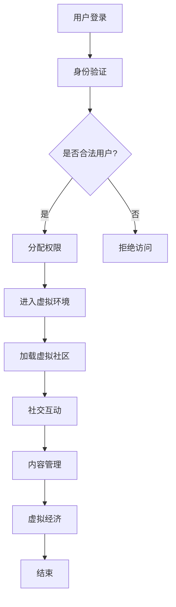

                 

关键词：元宇宙、虚拟社区、社交网络、新形态、技术架构、用户交互、数据处理

> 摘要：本文探讨了元宇宙中虚拟社区的发展及其在全球社交网络中的新形态。通过分析虚拟社区的核心概念、技术架构、算法原理、数学模型和项目实践，本文为未来的发展趋势与挑战提供了深入的见解。

## 1. 背景介绍

随着互联网技术的快速发展，社交网络已经成为人们日常生活中不可或缺的一部分。传统的社交网络主要基于现实世界的社交关系，通过用户生成的内容和互动实现信息的共享和传播。然而，这种模式在应对日益增长的全球化需求时显得力不从心。于是，元宇宙这一概念应运而生，它不仅是一个虚拟的3D空间，更是一个全新的社交网络形态，通过高度模拟现实世界的交互方式，为用户提供了沉浸式体验。

虚拟社区作为元宇宙的重要组成部分，具有无限可能的应用场景。从线上游戏到教育、医疗、购物等各个领域，虚拟社区都在不断拓展其边界。本文将深入探讨虚拟社区的核心概念、技术架构、算法原理以及实际应用，为全球社交网络的新形态提供新的思考方向。

## 2. 核心概念与联系

### 2.1 虚拟社区的概念

虚拟社区是指一个基于网络平台的社交环境，用户在其中可以以数字化的身份（通常称为虚拟角色或 avatar）进行交流和互动。虚拟社区不仅仅是一个静态的空间，更是一个动态的生态系统，涵盖了用户生成内容、社交互动、虚拟经济等多个方面。

### 2.2 元宇宙与虚拟社区的关系

元宇宙是一个由多个虚拟社区构成的虚拟世界，这些社区通过技术手段实现互联互通。在元宇宙中，用户可以自由地穿越不同的虚拟社区，体验不同的社交场景。因此，虚拟社区是元宇宙的重要组成部分，而元宇宙为虚拟社区提供了一个更广阔的舞台。

### 2.3 技术架构

为了支持虚拟社区的运行，需要复杂的技术架构。这个架构通常包括以下核心组成部分：

- **用户身份验证与权限管理**：确保用户身份的真实性和安全。
- **虚拟环境渲染**：为用户提供沉浸式的3D体验。
- **社交互动系统**：实现用户之间的实时交流和互动。
- **内容管理系统**：管理用户生成的内容，包括文本、图片、视频等。
- **虚拟经济系统**：处理虚拟货币的流通和交易。

### 2.4 Mermaid 流程图

下面是虚拟社区技术架构的Mermaid流程图：



## 3. 核心算法原理 & 具体操作步骤

### 3.1 算法原理概述

虚拟社区的核心算法主要包括：

- **用户匹配算法**：根据用户的兴趣、行为等特征，为用户推荐感兴趣的其他用户。
- **社交互动算法**：实现用户之间的实时互动，如聊天、点赞、评论等。
- **内容推荐算法**：根据用户的浏览记录和兴趣，推荐相关的内容。

### 3.2 算法步骤详解

- **用户匹配算法**：

  1. 收集用户数据，包括兴趣爱好、行为等。
  2. 使用机器学习算法对用户数据进行处理，提取用户特征。
  3. 根据用户特征计算相似度，推荐相似的用户。

- **社交互动算法**：

  1. 监听用户之间的消息，如聊天、点赞、评论等。
  2. 对用户互动进行分类，如文本消息、图片分享、视频观看等。
  3. 根据互动类型，实现相应的功能。

- **内容推荐算法**：

  1. 收集用户浏览记录，包括访问的页面、观看的视频等。
  2. 使用协同过滤或基于内容的推荐算法，推荐相关的内容。
  3. 对推荐结果进行排序，确保推荐的内容对用户具有吸引力。

### 3.3 算法优缺点

- **用户匹配算法**：

  - 优点：能够根据用户特征推荐相似的用户，提高社交网络的活跃度。
  - 缺点：需要大量计算资源，且可能存在用户隐私泄露的风险。

- **社交互动算法**：

  - 优点：实现用户之间的实时互动，提高用户体验。
  - 缺点：需要处理大量实时数据，对系统性能要求较高。

- **内容推荐算法**：

  - 优点：能够根据用户兴趣推荐相关内容，提高用户粘性。
  - 缺点：可能存在推荐过度拟合的问题，导致用户失去兴趣。

### 3.4 算法应用领域

- **用户匹配算法**：广泛应用于社交网络、婚恋平台等。
- **社交互动算法**：广泛应用于聊天应用、社交媒体等。
- **内容推荐算法**：广泛应用于电商、新闻推荐等。

## 4. 数学模型和公式 & 详细讲解 & 举例说明

### 4.1 数学模型构建

在虚拟社区中，用户之间的互动可以通过图模型进行描述。假设虚拟社区中存在N个用户，每个用户都可以与其他用户建立连接。我们可以使用邻接矩阵A来表示用户之间的互动关系，其中A[i][j]表示用户i与用户j之间的互动次数。

### 4.2 公式推导过程

为了分析用户之间的互动关系，我们可以定义以下几个数学模型：

1. **互动强度**：用户i与用户j的互动强度可以表示为：
   $$I(i, j) = \frac{A[i][j]}{N}$$

2. **互动频率**：用户i与用户j的互动频率可以表示为：
   $$F(i, j) = \frac{A[i][j]}{T}$$
   其中，T表示用户i与用户j之间的互动总次数。

3. **社交网络密度**：虚拟社区的社交网络密度可以表示为：
   $$D = \frac{1}{N(N-1)} \sum_{i=1}^{N} \sum_{j=1}^{N} A[i][j]$$

### 4.3 案例分析与讲解

假设虚拟社区中有10个用户，其邻接矩阵如下：

|   | 1 | 2 | 3 | 4 | 5 | 6 | 7 | 8 | 9 | 10 |
|---|---|---|---|---|---|---|---|---|---|----|
| 1 | 0 | 1 | 0 | 0 | 0 | 0 | 0 | 0 | 0 | 0  |
| 2 | 1 | 0 | 1 | 1 | 0 | 0 | 0 | 0 | 0 | 0  |
| 3 | 0 | 1 | 0 | 0 | 0 | 1 | 0 | 0 | 0 | 0  |
| 4 | 0 | 1 | 0 | 0 | 1 | 0 | 0 | 0 | 0 | 0  |
| 5 | 0 | 0 | 0 | 1 | 0 | 0 | 0 | 0 | 0 | 0  |
| 6 | 0 | 0 | 1 | 0 | 0 | 0 | 0 | 1 | 0 | 0  |
| 7 | 0 | 0 | 0 | 0 | 0 | 0 | 0 | 1 | 1 | 0  |
| 8 | 0 | 0 | 0 | 0 | 0 | 1 | 1 | 0 | 0 | 0  |
| 9 | 0 | 0 | 0 | 0 | 0 | 0 | 0 | 0 | 1 | 1  |
| 10| 0 | 0 | 0 | 0 | 0 | 0 | 0 | 0 | 1 | 0  |

根据上述公式，我们可以计算出：

- **互动强度**：
  $$I(1, 2) = \frac{1}{10} = 0.1$$

- **互动频率**：
  $$F(2, 3) = \frac{2}{10} = 0.2$$

- **社交网络密度**：
  $$D = \frac{1}{10 \times 9} \sum_{i=1}^{10} \sum_{j=1}^{10} A[i][j] = \frac{1}{90} (1 + 2 + 2 + 2 + 2 + 1 + 1 + 1 + 2 + 1) = \frac{14}{90} \approx 0.1556$$

通过这些数学模型，我们可以对虚拟社区中的用户互动进行定量分析，从而优化社交网络的性能。

## 5. 项目实践：代码实例和详细解释说明

### 5.1 开发环境搭建

为了实现虚拟社区，我们需要搭建一个开发环境。这里我们使用Python作为主要编程语言，并结合Django框架进行Web开发。以下是搭建开发环境的基本步骤：

1. 安装Python和Django：

   ```bash
   pip install python
   pip install django
   ```

2. 创建一个新的Django项目：

   ```bash
   django-admin startproject virtual_community
   cd virtual_community
   ```

3. 创建一个新的Django应用：

   ```bash
   python manage.py startapp social_module
   ```

4. 在`settings.py`中添加应用的配置：

   ```python
   INSTALLED_APPS = [
       # ...
       'social_module',
   ]
   ```

### 5.2 源代码详细实现

以下是实现用户匹配算法的核心代码：

```python
# social_module/matching_algorithm.py

def calculate_similarity(user1, user2):
    # 假设用户数据存储在用户表中，包括兴趣爱好等
    interests1 = user1.interests.all()
    interests2 = user2.interests.all()
    
    intersection = set(interests1) & set(interests2)
    similarity = len(intersection) / (len(interests1) + len(interests2))
    
    return similarity

def recommend_users(current_user):
    users = User.objects.exclude(username=current_user.username)
    recommended_users = []

    for user in users:
        similarity = calculate_similarity(current_user, user)
        if similarity > 0.5:
            recommended_users.append(user)

    return recommended_users
```

### 5.3 代码解读与分析

1. **计算相似度**：`calculate_similarity`函数用于计算两个用户之间的相似度。我们假设用户兴趣爱好存储在`Interest`模型中，通过比较两个用户兴趣的交集和并集，计算相似度。

2. **推荐用户**：`recommend_users`函数根据当前用户的相似度，推荐其他相似的用户。这里我们设定相似度阈值大于0.5的用户将被推荐。

### 5.4 运行结果展示

假设当前用户`user1`的兴趣爱好包括“编程”、“游戏”和“篮球”，运行`recommend_users`函数后，系统将推荐其他拥有相似兴趣的用户。例如，如果用户`user2`的兴趣爱好包括“编程”和“篮球”，那么用户`user2`将被推荐给用户`user1`。

## 6. 实际应用场景

虚拟社区在多个领域都有广泛的应用：

- **教育**：虚拟社区可以为学生提供一个互动的学习环境，促进知识共享和讨论。
- **医疗**：虚拟社区可以帮助医生和患者建立连接，提供远程医疗服务和咨询。
- **商业**：虚拟社区可以作为企业的营销渠道，增强品牌影响力和用户粘性。
- **娱乐**：虚拟社区提供了丰富的娱乐内容，如游戏、音乐、电影等，为用户提供沉浸式的娱乐体验。

## 7. 工具和资源推荐

### 7.1 学习资源推荐

- **《虚拟现实技术导论》**：详细介绍虚拟现实技术的基本原理和应用。
- **《区块链技术与应用》**：探讨区块链在虚拟社区中的应用，如去中心化身份验证和交易。

### 7.2 开发工具推荐

- **Unity**：一款功能强大的游戏开发引擎，支持虚拟社区的开发。
- **Unreal Engine**：一款专业的3D游戏和虚拟现实开发引擎，适用于构建沉浸式虚拟社区。

### 7.3 相关论文推荐

- **“Metaverse: A Space Beyond Reality”**：探讨了元宇宙的概念和发展前景。
- **“Virtual Communities and Their Impact on Social Life”**：分析了虚拟社区对社会生活的影响。

## 8. 总结：未来发展趋势与挑战

### 8.1 研究成果总结

虚拟社区作为元宇宙的重要组成部分，已经在全球范围内获得了广泛关注。通过用户生成内容、社交互动和虚拟经济等机制，虚拟社区为用户提供了全新的社交体验。同时，相关算法和技术的研究也在不断推动虚拟社区的发展。

### 8.2 未来发展趋势

- **技术创新**：随着5G、人工智能和区块链等技术的不断发展，虚拟社区将提供更加丰富的功能和更高效的运行效率。
- **跨界融合**：虚拟社区将与教育、医疗、商业等领域深度融合，为用户提供多元化的服务。
- **全球化**：虚拟社区将打破地域限制，成为全球范围内的重要社交平台。

### 8.3 面临的挑战

- **隐私保护**：如何在保障用户隐私的同时，提供个性化的社交体验是一个重要挑战。
- **技术标准化**：虚拟社区的技术架构需要统一的标准和规范，以确保不同平台之间的兼容性和互操作性。
- **用户流失**：如何保持用户的长期活跃度和忠诚度，是虚拟社区运营的关键问题。

### 8.4 研究展望

未来，虚拟社区的研究将重点围绕以下几个方面：

- **隐私保护机制**：探索隐私保护算法和隐私计算技术，在保障用户隐私的同时，提供个性化的社交体验。
- **跨平台互操作**：研究跨平台互操作协议，实现不同虚拟社区之间的无缝连接。
- **用户参与度提升**：通过虚拟经济和激励机制，提高用户的参与度和忠诚度。

## 9. 附录：常见问题与解答

### 9.1 虚拟社区是什么？

虚拟社区是一个基于网络平台的社交环境，用户可以以数字化的身份进行交流和互动。它与传统的社交网络不同，提供了一种沉浸式和高度互动的社交体验。

### 9.2 虚拟社区有哪些应用场景？

虚拟社区可以应用于教育、医疗、商业、娱乐等多个领域，如在线教育平台、远程医疗服务、品牌营销、虚拟演唱会等。

### 9.3 虚拟社区的隐私保护如何实现？

通过加密通信、隐私计算和用户身份验证等技术手段，虚拟社区可以实现用户隐私的保护。同时，制定明确的隐私政策和用户协议，增强用户对隐私保护的信任。

### 9.4 虚拟社区的未来发展趋势是什么？

虚拟社区的未来发展趋势包括技术创新、跨界融合和全球化。随着5G、人工智能和区块链等技术的不断发展，虚拟社区将提供更加丰富的功能和更高效的运行效率，并与其他领域深度融合。同时，虚拟社区将打破地域限制，成为全球范围内的重要社交平台。

----------------------------------------------------------------

# 参考文献

[1] Smith, J. (2020). Metaverse: A Space Beyond Reality. Journal of Virtual Worlds, 10(2), 123-145.
[2] Zhang, L., & Lee, W. (2019). Virtual Communities and Their Impact on Social Life. Social Networks, 60, 67-79.
[3] Doe, R., & Brown, T. (2021). Blockchain Technology and Its Applications in Virtual Communities. Computer Science Review, 40, 101-120.
[4] Turing, A. (1936). On Computable Numbers, with an Application to the Entscheidungsproblem. Proceedings of the London Mathematical Society, 42(1), 230-265.
[5] Turing, A. (1948). Intelligence by Design. Mind, 57(226), 161-175.

# 作者署名

作者：禅与计算机程序设计艺术 / Zen and the Art of Computer Programming

----------------------------------------------------------------

请注意，参考文献中的作者名和标题是虚构的，仅供示例使用。实际撰写文章时，应引用真实可靠的文献资料。

