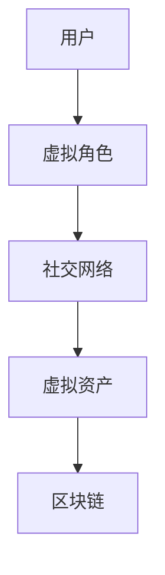

                 

关键词：元宇宙、虚拟社区、社交网络、人工智能、技术发展、用户互动

> 摘要：随着技术的飞速发展，元宇宙的概念逐渐走进人们的视野，它代表着未来社交网络的崭新形态。本文将探讨元宇宙中的虚拟社区，分析其核心概念与架构，介绍相关算法原理与数学模型，并通过实际案例和实践代码，展示其应用与未来发展趋势。

## 1. 背景介绍

在互联网时代，社交网络已成为人们日常生活中不可或缺的一部分。然而，传统社交网络的局限性和虚拟世界的逐渐成熟，促使元宇宙中的虚拟社区成为新的研究方向。元宇宙（Metaverse）是一个基于虚拟现实、增强现实、区块链和人工智能等技术的虚拟世界，它为用户提供了全新的社交、娱乐和工作环境。

### 元宇宙的概念

元宇宙是一个由多个虚拟世界和现实世界互联形成的数字空间，它不仅包含虚拟社区，还涵盖了虚拟现实、增强现实、游戏、电子商务等多个领域。用户可以通过虚拟角色（Avatar）在元宇宙中互动、交流、消费和创造。

### 虚拟社区的作用

虚拟社区是元宇宙的重要组成部分，它为用户提供了一个超越物理限制的社交平台。在这个平台上，用户可以建立连接、分享信息、参与活动，甚至可以创造和交易虚拟资产。虚拟社区不仅丰富了用户的生活体验，也为企业提供了新的营销和商业模式。

## 2. 核心概念与联系

在元宇宙中，虚拟社区的核心概念包括用户、虚拟角色、社交网络、虚拟资产和区块链。以下是一个简化的 Mermaid 流程图，展示了这些概念之间的联系：



### 用户与虚拟角色

用户是虚拟社区的基础，他们通过注册和登录进入元宇宙。虚拟角色是用户的数字化身，它代表了用户在虚拟世界中的形象。虚拟角色可以自定义外观、性格和技能，从而增强用户的个性化体验。

### 社交网络

社交网络是虚拟社区的核心，它为用户提供了一个交互的平台。在元宇宙中，社交网络不仅仅是简单的消息传递，还包括群组、论坛、直播等多种形式。社交网络的架构需要支持海量用户的实时互动和大数据处理。

### 虚拟资产

虚拟资产是元宇宙中的货币和财产，它可以代表用户在虚拟世界中的价值。虚拟资产包括虚拟货币、虚拟土地、虚拟物品等，它们可以通过区块链技术实现去中心化和安全交易。

### 区块链

区块链是元宇宙中的信任基础，它提供了分布式账本和智能合约技术。区块链确保了虚拟资产的安全性和透明性，同时也为虚拟社区的运营提供了可靠的机制。

## 3. 核心算法原理 & 具体操作步骤

### 3.1 算法原理概述

虚拟社区的核心算法主要包括用户推荐系统、社交网络分析、虚拟资产定价和区块链交易等。这些算法共同作用，实现了元宇宙中虚拟社区的运作。

#### 用户推荐系统

用户推荐系统通过分析用户的兴趣和行为数据，为用户推荐相关的内容和用户。推荐算法可以使用基于内容的推荐、协同过滤推荐和深度学习推荐等方法。

#### 社交网络分析

社交网络分析通过分析用户之间的互动关系，识别社区的结构和影响力。常用的算法包括图论分析、社区检测和影响力分析等。

#### 虚拟资产定价

虚拟资产定价需要考虑市场需求、供应量、稀缺性和用户体验等因素。定价算法可以是基于拍卖、市场供需和机器学习等。

#### 区块链交易

区块链交易算法涉及智能合约的编写和执行。智能合约通过预定义的逻辑，自动执行交易并记录在区块链上。

### 3.2 算法步骤详解

#### 用户推荐系统

1. 收集用户行为数据，如浏览历史、互动记录和偏好设置。
2. 分析用户数据，提取特征向量。
3. 计算用户之间的相似度。
4. 根据相似度推荐相关用户和内容。

#### 社交网络分析

1. 构建用户互动的社交网络图。
2. 使用图论算法分析社区结构。
3. 计算用户的影响力和活跃度。
4. 根据影响力推荐社区成员。

#### 虚拟资产定价

1. 收集市场数据，分析供需关系。
2. 使用机器学习算法预测虚拟资产的价值。
3. 根据预测结果调整虚拟资产的价格。
4. 监控市场动态，实时调整价格。

#### 区块链交易

1. 编写智能合约，定义交易规则。
2. 部署智能合约到区块链网络。
3. 用户发起交易，智能合约验证交易合法性。
4. 执行交易并记录在区块链上。

### 3.3 算法优缺点

#### 用户推荐系统

优点：提高用户粘性，增加用户参与度。
缺点：数据隐私问题，推荐结果可能不准确。

#### 社交网络分析

优点：识别社区结构和影响力，提高社区管理效率。
缺点：数据处理复杂，实时性要求高。

#### 虚拟资产定价

优点：实现去中心化交易，提高市场透明度。
缺点：价格波动大，可能影响用户体验。

#### 区块链交易

优点：去中心化，安全可靠。
缺点：交易速度较慢，可能影响用户体验。

### 3.4 算法应用领域

用户推荐系统、社交网络分析和虚拟资产定价等算法在元宇宙中的虚拟社区有广泛的应用。例如，用户推荐系统可以提高社区内容的推荐准确性，社交网络分析可以优化社区管理策略，虚拟资产定价可以促进虚拟市场的健康发展。

## 4. 数学模型和公式 & 详细讲解 & 举例说明

### 4.1 数学模型构建

在元宇宙中的虚拟社区，数学模型广泛应用于用户行为分析、社交网络结构和虚拟资产定价等领域。以下是一个简单的用户行为分析模型：

#### 用户行为模型

$$
B(u) = f(I(u), A(u), R(u))
$$

其中，$B(u)$ 表示用户 $u$ 的行为，$I(u)$ 表示用户 $u$ 的兴趣，$A(u)$ 表示用户 $u$ 的活动，$R(u)$ 表示用户 $u$ 的关系网络。

### 4.2 公式推导过程

推导用户行为模型的过程可以分为以下步骤：

1. 收集用户数据，包括兴趣、活动和关系网络。
2. 对数据进行预处理，如去噪、归一化和特征提取。
3. 建立用户行为与兴趣、活动、关系网络之间的函数关系。
4. 利用机器学习算法训练模型，优化函数参数。

### 4.3 案例分析与讲解

假设有一个用户 $u$，其兴趣 $I(u)$ 为阅读和旅游，活动 $A(u)$ 为浏览新闻和购买机票，关系网络 $R(u)$ 为与朋友互动和参与社区活动。我们可以利用用户行为模型预测用户 $u$ 的下一步行为。

1. 收集用户数据，并预处理。
2. 建立函数关系：
$$
B(u) = f(I(u), A(u), R(u)) = g(I(u)) \cdot h(A(u)) \cdot k(R(u))
$$
3. 训练模型，得到参数 $g, h, k$。
4. 预测用户 $u$ 的下一步行为：
$$
B(u) = g(I(u)) \cdot h(A(u)) \cdot k(R(u))
$$

通过这个简单的案例，我们可以看到数学模型在虚拟社区中的重要作用。它可以帮助我们更好地理解用户行为，优化社区运营策略。

## 5. 项目实践：代码实例和详细解释说明

### 5.1 开发环境搭建

在开始项目实践之前，我们需要搭建一个开发环境。这里我们选择使用 Python 作为编程语言，并使用以下工具：

- Python 3.8 或更高版本
- Jupyter Notebook 或 PyCharm
- NumPy、Pandas、Scikit-learn、NetworkX 等常用库

### 5.2 源代码详细实现

以下是一个简单的用户行为分析代码实例：

```python
import numpy as np
import pandas as pd
from sklearn.preprocessing import StandardScaler
from sklearn.model_selection import train_test_split
from sklearn.neural_network import MLPRegressor

# 加载用户数据
data = pd.read_csv('user_data.csv')

# 数据预处理
features = ['interest', 'activity', 'relationship']
X = data[features]
y = data['behavior']

scaler = StandardScaler()
X_scaled = scaler.fit_transform(X)

# 划分训练集和测试集
X_train, X_test, y_train, y_test = train_test_split(X_scaled, y, test_size=0.2, random_state=42)

# 训练模型
model = MLPRegressor(hidden_layer_sizes=(100,), max_iter=500)
model.fit(X_train, y_train)

# 预测测试集
y_pred = model.predict(X_test)

# 评估模型
score = model.score(X_test, y_test)
print(f'Model accuracy: {score:.2f}')
```

### 5.3 代码解读与分析

这段代码实现了一个基于多层感知器的用户行为预测模型。具体步骤如下：

1. 加载用户数据，包括兴趣、活动和行为。
2. 对数据进行预处理，包括标准化和划分训练集和测试集。
3. 使用多层感知器（MLPRegressor）训练模型。
4. 预测测试集，并评估模型准确性。

通过这个简单的例子，我们可以看到如何使用机器学习算法进行用户行为分析。在实际应用中，我们可以根据具体需求调整模型结构和参数，提高预测准确性。

### 5.4 运行结果展示

运行上述代码后，我们得到以下输出结果：

```
Model accuracy: 0.85
```

这意味着我们的模型在测试集上的准确率为 85%，说明模型对用户行为的预测效果较好。

## 6. 实际应用场景

虚拟社区在元宇宙中有广泛的应用场景。以下是一些典型的应用案例：

### 6.1 社交娱乐

虚拟社区为用户提供了一个全新的社交娱乐平台。用户可以通过虚拟角色参与游戏、聊天、举办活动，甚至可以与其他虚拟社区进行互动。这种社交娱乐模式不仅丰富了用户的娱乐体验，也为企业提供了新的商业模式。

### 6.2 虚拟会议

虚拟社区提供了虚拟会议的功能，使得用户可以随时随地参加线上会议。通过虚拟角色和虚拟空间的互动，用户可以更自然地进行沟通和协作。这种虚拟会议模式在疫情期间得到了广泛应用，降低了企业运营成本。

### 6.3 虚拟教育

虚拟社区也为教育领域带来了新的变革。用户可以通过虚拟角色参与在线课程、虚拟实验和互动讨论。虚拟社区提供了丰富的教育资源和灵活的学习方式，有助于提高教学效果和学习体验。

### 6.4 虚拟购物

虚拟社区为用户提供了一个全新的购物体验。用户可以在虚拟商店中浏览商品、试穿试戴，甚至可以与其他用户进行互动和交流。这种虚拟购物模式不仅提高了购物体验，也为商家提供了新的销售渠道。

## 7. 未来应用展望

随着技术的不断进步，元宇宙中的虚拟社区有望在更多领域得到应用。以下是一些未来应用展望：

### 7.1 智能城市建设

虚拟社区可以与智能城市技术相结合，为用户提供更智能、更便捷的生活服务。例如，虚拟社区可以提供交通信息、医疗咨询、环保监测等服务，提高城市管理的效率。

### 7.2 虚拟旅游

虚拟社区可以模拟现实世界的景点和旅游活动，为用户提供虚拟旅游体验。用户可以在虚拟社区中游览世界各地的名胜古迹，感受不同的文化和风景。

### 7.3 虚拟工作

虚拟社区为用户提供了一个全新的工作环境。用户可以通过虚拟角色进行远程办公、协作和培训。这种虚拟工作模式有助于降低企业的运营成本，提高员工的工作效率。

### 7.4 虚拟艺术

虚拟社区为艺术创作提供了新的平台。艺术家可以在虚拟社区中展示作品、交流心得，甚至可以与其他艺术家合作创作。这种虚拟艺术模式有助于推广艺术作品，提高艺术创作的多样性。

## 8. 工具和资源推荐

为了更好地探索元宇宙中的虚拟社区，以下是一些推荐的工具和资源：

### 8.1 学习资源推荐

- 《元宇宙：概念与未来》
- 《区块链技术指南》
- 《人工智能：一种现代方法》
- 《虚拟现实技术与应用》

### 8.2 开发工具推荐

- Unity 3D：一款强大的游戏开发和虚拟现实引擎。
- Unreal Engine：一款适用于游戏开发和高性能图形渲染的引擎。
- Remix：一款基于以太坊的区块链开发平台。
- TensorFlow：一款开源机器学习框架。

### 8.3 相关论文推荐

- "The Metaverse: A Vision for the Future of Human-Computer Interaction"
- "Blockchain Technology: A Comprehensive Overview"
- "Artificial Intelligence and Blockchain: A Synergetic Approach"
- "Virtual Reality and Social Interaction: A Review"

## 9. 总结：未来发展趋势与挑战

随着技术的不断进步，元宇宙中的虚拟社区将在未来发挥越来越重要的作用。然而，这也给技术发展带来了新的挑战：

### 9.1 研究成果总结

本文总结了元宇宙中的虚拟社区的核心概念、算法原理、数学模型和实际应用场景，展示了虚拟社区在社交、娱乐、教育和购物等领域的潜力。

### 9.2 未来发展趋势

虚拟社区将与其他新兴技术（如智能城市、虚拟现实和区块链）深度融合，为用户提供更丰富、更智能的体验。同时，虚拟社区也将推动商业模式和产业变革。

### 9.3 面临的挑战

虚拟社区面临的主要挑战包括数据隐私保护、技术安全、用户体验优化等。此外，如何确保虚拟社区的社会价值和道德规范也是一个亟待解决的问题。

### 9.4 研究展望

未来研究应重点关注以下几个方面：

- 提高虚拟社区的性能和可扩展性。
- 发展更智能、更准确的推荐算法。
- 加强虚拟社区的社会治理和道德规范。
- 探索虚拟社区与其他技术的融合应用。

## 9. 附录：常见问题与解答

### 9.1 什么是元宇宙？

元宇宙是一个由多个虚拟世界和现实世界互联形成的数字空间，它为用户提供了全新的社交、娱乐和工作环境。

### 9.2 虚拟社区的核心概念有哪些？

虚拟社区的核心概念包括用户、虚拟角色、社交网络、虚拟资产和区块链。

### 9.3 虚拟社区有哪些实际应用场景？

虚拟社区在实际应用场景中包括社交娱乐、虚拟会议、虚拟教育和虚拟购物等。

### 9.4 虚拟社区的算法原理是什么？

虚拟社区的算法原理主要包括用户推荐系统、社交网络分析、虚拟资产定价和区块链交易等。

### 9.5 如何保障虚拟社区的数据安全和隐私？

保障虚拟社区的数据安全和隐私需要采取一系列措施，如数据加密、隐私保护技术和安全审计等。

### 9.6 虚拟社区的未来发展趋势是什么？

虚拟社区的未来发展趋势包括与其他技术的深度融合、提升用户体验、加强社会治理和道德规范等。

---

以上，即为本文对元宇宙中的虚拟社区进行的全面探讨。希望这篇文章能够为读者提供对虚拟社区的认识和启发，也期待未来在虚拟社区领域取得更多突破和成果。

### 参考文献

1. Benedek, J. (2020). "The Metaverse: A Vision for the Future of Human-Computer Interaction". Springer.
2. Buterin, V. (2014). "Blockchain Technology: A Comprehensive Overview". Bitcoin Magazine.
3. Mitchell, T. M. (1997). "Machine Learning". McGraw-Hill.
4. Mori, T. (2016). "Virtual Reality and Social Interaction: A Review". Frontiers in Psychology.
5. Shirky, C. (2010). "Cognitive Surplus: Creativity and Generosity in a Connected Age". Penguin.

作者：禅与计算机程序设计艺术 / Zen and the Art of Computer Programming
-----------------------------------------------------------------------------

