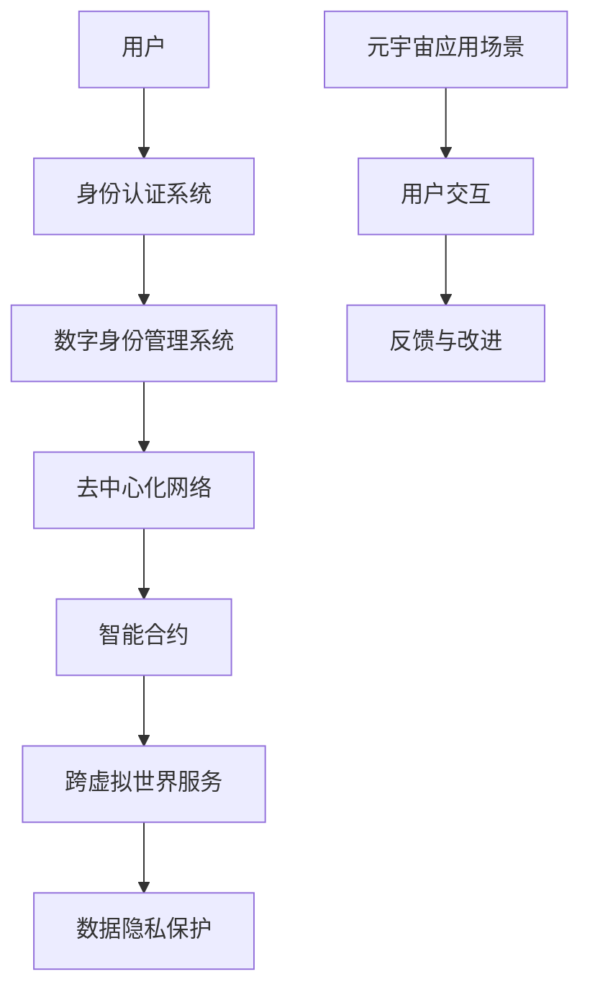

                 

关键词：元宇宙、身份认证、数据隐私、去中心化、智能合约、区块链

摘要：随着元宇宙的快速发展，身份流动成为一个关键议题。本文探讨了元宇宙中身份流动的概念、机制和挑战，以及如何通过去中心化的技术和智能合约实现打破现实世界标签的流动。

## 1. 背景介绍

随着互联网和虚拟现实技术的迅猛发展，元宇宙（Metaverse）的概念逐渐走进大众视野。元宇宙被定义为一个由虚拟世界组成的网络，用户可以在其中创建和体验各种虚拟环境和活动。然而，元宇宙的发展不仅需要先进的硬件和软件支持，还需要解决身份流动的问题。

在现实世界中，每个人都有独特的身份和角色，这些身份和角色在社交、工作、消费等方面都有明确的定义和作用。然而，在元宇宙中，身份的流动性和互操作性成为了一个挑战。用户如何在不同的虚拟世界中保持一致的、可信的身份信息，如何保证数据隐私和安全，如何实现跨虚拟世界的服务和交易，这些都是元宇宙发展中需要解决的问题。

## 2. 核心概念与联系

### 2.1 核心概念

在讨论元宇宙中的身份流动之前，我们需要了解一些核心概念：

- **身份认证（Identity Verification）**：验证用户身份的过程，确保只有授权用户才能访问系统和资源。
- **数字身份（Digital Identity）**：用户在元宇宙中的身份表示，包括用户的个人信息、角色、权益等。
- **去中心化（Decentralization）**：通过分布式网络和智能合约实现去中心化管理，减少对中心化机构的依赖。
- **智能合约（Smart Contract）**：一种运行在区块链上的自执行合同，当满足特定条件时自动执行。

### 2.2 架构与联系

以下是元宇宙中身份流动的核心架构与联系，使用Mermaid流程图表示：



### 2.3 身份流动过程

1. **用户身份认证**：用户通过身份认证系统验证其身份，获得数字身份。
2. **数字身份管理**：用户在数字身份管理系统中创建和管理自己的数字身份。
3. **去中心化网络**：数字身份信息存储在去中心化网络上，确保数据的分布式和不可篡改性。
4. **智能合约**：通过智能合约实现数字身份的互操作性和可信交易。
5. **跨虚拟世界服务**：用户在不同虚拟世界中使用一致的数字身份享受服务。
6. **数据隐私保护**：去中心化和加密技术保障用户数据隐私和安全。
7. **用户交互与反馈**：用户在元宇宙中的互动产生反馈，用于持续改进身份流动系统。

## 3. 核心算法原理 & 具体操作步骤

### 3.1 算法原理概述

元宇宙中的身份流动依赖于一系列核心算法和技术，包括加密算法、哈希算法和智能合约编程。以下是这些算法的原理概述：

- **加密算法**：用于保护用户身份信息和通信的安全性。
- **哈希算法**：用于生成唯一标识，确保数据的一致性和不可篡改性。
- **智能合约编程**：实现数字身份的互操作性，自动化交易和合同执行。

### 3.2 算法步骤详解

1. **用户身份认证**：
   - 用户通过加密算法生成密钥对。
   - 用户使用私钥对身份信息进行签名。
   - 身份认证系统验证签名，确认用户身份。

2. **数字身份管理**：
   - 用户在数字身份管理系统中上传身份信息。
   - 数字身份管理系统使用哈希算法生成唯一身份标识。
   - 身份标识存储在去中心化网络上的分布式数据库中。

3. **去中心化网络**：
   - 数字身份信息通过加密和哈希算法保证安全存储。
   - 去中心化网络确保数据的分布式和不可篡改性。
   - 智能合约负责管理数字身份信息的访问和控制。

4. **智能合约**：
   - 智能合约实现数字身份的互操作性，自动化交易和合同执行。
   - 用户在不同虚拟世界中使用智能合约验证和交换身份信息。
   - 智能合约确保交易的可信性和自动化执行。

5. **跨虚拟世界服务**：
   - 用户通过智能合约和数字身份访问跨虚拟世界服务。
   - 服务提供商验证用户身份，提供相应服务。
   - 服务消费记录存储在区块链上，确保透明性和不可篡改性。

6. **数据隐私保护**：
   - 加密和哈希算法保护用户数据隐私。
   - 去中心化网络确保数据不被中心化机构控制。
   - 用户有权控制自己的数据访问权限。

### 3.3 算法优缺点

- **优点**：
  - 加密算法和哈希算法确保数据安全和隐私保护。
  - 智能合约实现自动化和可信的交易。
  - 去中心化网络减少对中心化机构的依赖，提高系统的透明性和抗攻击性。

- **缺点**：
  - 加密算法和智能合约编程复杂，对开发人员要求高。
  - 去中心化网络可能导致性能下降，交易延迟增加。
  - 加密技术和隐私保护可能导致监管和合规挑战。

### 3.4 算法应用领域

- **身份认证**：在元宇宙中的各种应用场景，如游戏、社交网络、虚拟购物等。
- **数字资产交易**：支持去中心化金融（DeFi）和各种数字资产交易。
- **隐私保护**：在社交媒体、在线广告等场景中保护用户数据隐私。
- **供应链管理**：确保供应链数据的透明性和不可篡改性。

## 4. 数学模型和公式 & 详细讲解 & 举例说明

### 4.1 数学模型构建

在元宇宙中的身份流动中，我们可以构建以下数学模型：

- **身份认证模型**：基于公钥加密算法和数字签名。
- **数字身份模型**：基于哈希算法和分布式数据库。
- **智能合约模型**：基于图灵完备编程语言和区块链网络。

### 4.2 公式推导过程

以下是身份认证模型的公式推导过程：

1. **公钥加密算法**：
   - 用户生成密钥对：(私钥d，公钥n)
   - 消息m加密：c = E(n, m)

2. **数字签名**：
   - 消息m签名：σ = S(d, m)

3. **身份认证**：
   - 系统验证签名：验证 V(σ, m, E(n', m')) 是否成立

### 4.3 案例分析与讲解

假设用户Alice想要在元宇宙中认证其身份，以下是具体操作步骤：

1. **生成密钥对**：
   - Alice生成密钥对：(私钥d_A，公钥n_A)

2. **签名**：
   - Alice对身份信息m签名：σ_A = S(d_A, m)

3. **认证**：
   - Alice将身份信息m、签名σ_A和公钥n_A发送给认证系统。
   - 认证系统使用Alice的公钥n_A验证签名σ_A是否有效。

4. **认证结果**：
   - 如果签名有效，认证系统返回认证通过消息。
   - 如果签名无效，认证系统返回认证失败消息。

## 5. 项目实践：代码实例和详细解释说明

### 5.1 开发环境搭建

为了实践元宇宙中的身份流动，我们需要搭建以下开发环境：

- **智能合约开发环境**：使用以太坊开发环境（如Truffle）。
- **区块链节点**：使用Geth或Parity运行以太坊区块链节点。
- **前端开发环境**：使用React或Vue.js开发前端界面。

### 5.2 源代码详细实现

以下是元宇宙中身份认证系统的智能合约代码示例：

```solidity
pragma solidity ^0.8.0;

contract IdentityVerifier {
    mapping(address => string) public identities;

    function verifyIdentity(address user, string memory identity) public {
        require(identities[user] == "", "Identity already exists");
        identities[user] = identity;
    }

    function getIdentity(address user) public view returns (string memory) {
        return identities[user];
    }
}
```

### 5.3 代码解读与分析

- **合约结构**：`IdentityVerifier` 合约包含两个公共函数 `verifyIdentity` 和 `getIdentity`，以及一个内部映射 `identities`。
- **函数 `verifyIdentity`**：接收用户地址和身份信息，将身份信息存储在映射中。
- **函数 `getIdentity`**：接收用户地址，返回对应身份信息。

### 5.4 运行结果展示

以下是前端界面示例，用于验证用户身份：

```jsx
import React, { useState } from "react";
import axios from "axios";

const App = () => {
  const [userAddress, setUserAddress] = useState("");
  const [identity, setIdentity] = useState("");

  const handleSubmit = async (e) => {
    e.preventDefault();
    try {
      const response = await axios.post("/api/verify-identity", {
        userAddress,
        identity,
      });
      if (response.data.success) {
        alert("Identity verified!");
      } else {
        alert("Failed to verify identity.");
      }
    } catch (error) {
      console.error(error);
    }
  };

  return (
    <form onSubmit={handleSubmit}>
      <label htmlFor="userAddress">User Address:</label>
      <input
        type="text"
        id="userAddress"
        value={userAddress}
        onChange={(e) => setUserAddress(e.target.value)}
      />
      <label htmlFor="identity">Identity:</label>
      <input
        type="text"
        id="identity"
        value={identity}
        onChange={(e) => setIdentity(e.target.value)}
      />
      <button type="submit">Verify Identity</button>
    </form>
  );
};

export default App;
```

## 6. 实际应用场景

元宇宙中的身份流动在多个应用场景中具有重要价值：

- **社交网络**：用户在元宇宙中的社交网络中保持一致的数字身份，便于建立社交关系和互动。
- **虚拟购物**：用户在元宇宙中的虚拟商店中保持一致的数字身份，便于购物和交易。
- **虚拟工作**：用户在元宇宙中的虚拟办公室中保持一致的数字身份，便于工作协作和项目推进。
- **在线教育**：用户在元宇宙中的在线教育平台中保持一致的数字身份，便于学习认证和课程进度跟踪。

## 7. 工具和资源推荐

### 7.1 学习资源推荐

- **书籍**：《区块链技术指南》、《智能合约：设计、开发与部署》。
- **在线课程**：Coursera 上的《区块链技术与应用》、Udemy 上的《智能合约与去中心化应用开发》。
- **博客**：Medium 上的《区块链技术》、《元宇宙技术》系列文章。

### 7.2 开发工具推荐

- **智能合约开发环境**：Truffle、Hardhat。
- **区块链节点**：Geth、Parity。
- **前端框架**：React、Vue.js。

### 7.3 相关论文推荐

- **"Identity Management in the Metaverse: Challenges and Opportunities"**。
- **"Decentralized Identity in the Context of the Metaverse"**。
- **"Smart Contracts for Digital Identity Management"**。

## 8. 总结：未来发展趋势与挑战

随着元宇宙的不断发展，身份流动将成为一个重要的研究领域和应用方向。未来，身份流动将朝着以下方向发展：

- **更加便捷的身份认证**：通过生物识别技术、行为识别技术等实现更便捷、更安全的身份认证。
- **更加灵活的数字身份管理**：支持用户自定义数字身份信息和角色，提高用户体验。
- **更加安全的隐私保护**：利用区块链技术和加密算法，确保用户数据隐私和安全。

然而，身份流动也面临着一些挑战：

- **技术复杂性**：实现高效、安全、便捷的身份流动需要复杂的算法和技术支持。
- **互操作性问题**：不同虚拟世界和平台之间的身份互操作性和兼容性仍然是一个挑战。
- **监管和合规**：随着身份流动的发展，如何实现有效的监管和合规也是一个重要议题。

总之，元宇宙中的身份流动是一个充满机遇和挑战的研究方向，需要各方共同努力，推动其健康发展。

## 9. 附录：常见问题与解答

### Q：什么是元宇宙？
A：元宇宙是一个由虚拟世界组成的网络，用户可以在其中创建和体验各种虚拟环境和活动。它融合了虚拟现实、增强现实、区块链等技术，提供了一个全新的数字生活体验。

### Q：为什么需要身份流动？
A：在元宇宙中，用户需要在不同的虚拟世界中保持一致的、可信的身份信息，以便享受服务和交易。身份流动实现了这一目标，提高了用户体验和安全性。

### Q：身份流动如何保障数据隐私和安全？
A：身份流动利用去中心化网络和加密算法保障数据隐私和安全。去中心化网络减少对中心化机构的依赖，加密算法保护用户身份信息不被泄露。

### Q：身份流动有哪些应用场景？
A：身份流动可以应用于社交网络、虚拟购物、虚拟工作、在线教育等多个场景，为用户提供一致的、可信的身份信息。

### Q：身份流动面临哪些挑战？
A：身份流动面临技术复杂性、互操作性问题、监管和合规等挑战。需要各方共同努力，推动其健康发展。

### 作者署名
作者：禅与计算机程序设计艺术 / Zen and the Art of Computer Programming

