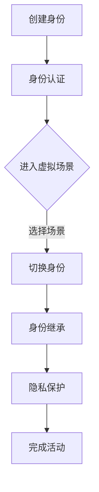

                 

关键词：元宇宙、身份流动、现实世界、标签、数字化身份

> 摘要：随着元宇宙概念的兴起，人们对于虚拟世界的探索和参与日益增多。本文将探讨元宇宙中的身份流动现象，分析其如何打破现实世界的标签，为用户带来全新的体验和社交方式。文章将深入讨论元宇宙中的身份体系、身份流动的机制及其对现实世界的启示。

## 1. 背景介绍

随着科技的迅猛发展，尤其是虚拟现实（VR）、增强现实（AR）和区块链技术的结合，元宇宙这个概念逐渐走进人们的视野。元宇宙是一个虚拟的共享空间，用户可以在其中创建自己的数字化身份，进行各种社交、工作和娱乐活动。元宇宙的兴起不仅为人们提供了新的生活方式，同时也带来了身份流动的挑战和机遇。

身份流动指的是用户在元宇宙中切换不同身份的能力，这可能与现实世界的身份不同，也可能与现实世界的身份相对应。在现实世界中，人们通常通过姓名、职业、社会地位等标签来识别和区分个体。而在元宇宙中，这些标签可能会被打破，用户可以自由选择和切换自己的数字化身份，这使得元宇宙成为一个更加开放和包容的社交平台。

本文将围绕元宇宙中的身份流动展开讨论，分析其背后的机制、技术挑战和潜在影响。首先，我们将介绍元宇宙中的身份体系，包括身份的创建、管理和认证。接着，我们将探讨身份流动的具体实现方法，以及如何打破现实世界的标签。最后，我们将讨论身份流动对现实世界的影响，并展望未来的发展趋势。

## 2. 核心概念与联系

### 2.1 元宇宙中的身份体系

在元宇宙中，身份体系是构建虚拟社交和经济活动的基础。一个完善的身份体系需要包括身份的创建、管理、认证和流动等多个方面。

**身份的创建**：用户可以在元宇宙中创建属于自己的虚拟身份，这个过程可能涉及选择虚拟形象、命名、设定背景故事等。身份的创建应该简单易用，同时要确保唯一性，避免重复。

**身份的管理**：用户需要对虚拟身份进行管理，包括修改个人资料、更新形象、参与社交活动等。良好的身份管理系统能够提升用户体验，增强身份的个性化和定制化。

**身份的认证**：为了确保元宇宙中的交易和社交活动安全可信，身份认证是不可或缺的一环。常见的认证方式包括密码、生物识别（如指纹、面部识别）和数字证书等。

**身份的流动**：身份流动指的是用户在不同虚拟场景中切换身份的能力。身份的流动可以为用户提供更多的选择和灵活性，同时也带来了一定的技术挑战。

### 2.2 身份流动的机制

身份流动的机制可以分为以下几个方面：

**身份切换**：用户可以在不同的虚拟场景之间切换身份，比如从一个虚拟办公室切换到虚拟的咖啡厅。这个过程需要保证身份的一致性和连续性。

**身份映射**：在元宇宙中，用户的虚拟身份可以与现实世界的身份进行映射。这种映射可以是单向的，也可以是双向的，比如通过区块链技术实现虚拟身份与现实世界身份的绑定。

**身份继承**：用户在元宇宙中创建的身份可以在不同的虚拟场景中继承，这样用户就不需要为每个场景重新创建身份。身份继承能够提升用户体验，降低使用门槛。

**身份隐私**：身份流动涉及到大量的个人信息，如何保护用户的隐私是身份流动机制中需要解决的重要问题。可以通过加密技术、隐私计算等方式来保护用户的隐私。

### 2.3 Mermaid 流程图

下面是一个简单的 Mermaid 流程图，展示了一个用户在元宇宙中身份流动的基本流程。



在这个流程图中，用户首先创建自己的虚拟身份，然后进行身份认证。接下来，用户可以选择进入不同的虚拟场景，并根据需要切换身份。身份的继承和隐私保护是在整个流程中需要持续关注的问题。

## 3. 核心算法原理 & 具体操作步骤

### 3.1 算法原理概述

在元宇宙中实现身份流动，核心在于身份认证和身份映射算法的设计。身份认证算法用于确保用户的身份安全性和唯一性，而身份映射算法则负责将虚拟身份与现实世界身份进行关联。

**身份认证算法**：基于密码学原理，通过加密和签名技术，实现用户的身份认证。常见的加密算法包括SHA-256、RSA等，签名算法包括ECDSA等。

**身份映射算法**：利用区块链技术，实现虚拟身份与现实世界身份的绑定。区块链的分布式账本特性可以确保身份映射的透明性和不可篡改性。

### 3.2 算法步骤详解

**身份认证算法步骤**：

1. 用户创建虚拟身份时，系统生成一个唯一密钥对（公钥和私钥）。
2. 用户使用私钥对身份信息进行签名，生成签名信息。
3. 系统接收用户的身份信息和签名，使用公钥验证签名的有效性。
4. 如果签名有效，则认证通过，用户可以进入元宇宙。

**身份映射算法步骤**：

1. 用户在元宇宙中创建虚拟身份后，系统生成一个区块链地址。
2. 用户通过区块链地址与自己的现实世界身份进行绑定，这一过程通常通过智能合约实现。
3. 智能合约记录用户的虚拟身份和现实世界身份的映射关系，确保其透明性和不可篡改性。
4. 用户在元宇宙中的每次身份切换，都会在区块链上生成一条新的交易记录，更新身份映射关系。

### 3.3 算法优缺点

**身份认证算法优点**：

- 安全性高：基于密码学原理，可以有效防止身份被盗用。
- 简单易用：用户只需使用私钥进行签名验证，操作过程简单。

**身份认证算法缺点**：

- 需要一定计算资源：加密和签名过程需要一定的计算资源，可能会影响用户体验。
- 面临隐私保护挑战：用户的私钥和签名信息可能暴露给系统，需要采取措施保护用户隐私。

**身份映射算法优点**：

- 可靠性强：基于区块链的分布式账本技术，确保身份映射关系的透明性和不可篡改性。
- 安全性高：智能合约确保了身份映射的自动化和可信性。

**身份映射算法缺点**：

- 中心化风险：虽然区块链去中心化，但智能合约的开发和部署仍可能由中心化机构控制。
- 性能瓶颈：区块链处理交易的能力可能成为性能瓶颈，特别是在高并发场景下。

### 3.4 算法应用领域

身份认证和映射算法在元宇宙中的应用非常广泛，以下是一些具体的应用场景：

- **社交平台**：用户可以在元宇宙中的社交平台使用虚拟身份进行互动，身份认证和映射算法确保了社交活动的安全性和隐私保护。
- **虚拟办公室**：员工可以在虚拟办公室中通过身份认证和映射算法，安全地访问公司资源和进行工作。
- **在线购物**：用户在元宇宙中的虚拟商店购物时，可以通过身份认证和映射算法，确保交易的安全性和可靠性。
- **虚拟教育**：学生和教师可以在元宇宙中进行虚拟课堂互动，身份认证和映射算法保障了教育活动的有序进行。

## 4. 数学模型和公式 & 详细讲解 & 举例说明

### 4.1 数学模型构建

在元宇宙中，身份流动的数学模型主要涉及密码学和区块链技术的相关概念。以下是一个简化的数学模型：

- **身份认证模型**：

  - 假设用户A的私钥为\(d_A\)，公钥为\(p_A\)。
  - 用户A的身份信息为\(I_A\)。
  - 用户A使用私钥\(d_A\)对身份信息\(I_A\)进行签名，生成签名\(s_A\)。
  - 系统使用公钥\(p_A\)验证签名\(s_A\)的有效性。

  数学公式表示为：

  $$ s_A = Sig(d_A, I_A) $$

  $$ Ver(p_A, I_A, s_A) = \text{true} \text{（如果签名有效）} $$

- **身份映射模型**：

  - 假设用户A在区块链上的地址为\(A\)。
  - 用户A的虚拟身份为\(ID_V\)。
  - 用户A通过智能合约与区块链绑定，生成映射关系\(ID_V \rightarrow A\)。

  数学公式表示为：

  $$ Map(ID_V, A) = \text{true} \text{（如果映射成功）} $$

### 4.2 公式推导过程

**身份认证模型的推导过程**：

1. **私钥和公钥生成**：

   使用椭圆曲线密码学生成用户A的私钥\(d_A\)和公钥\(p_A\)。

   $$ p_A = PubKeyGen(d_A) $$

2. **身份信息签名**：

   用户A使用私钥\(d_A\)对身份信息\(I_A\)进行签名。

   $$ s_A = Sig(d_A, I_A) $$

3. **签名验证**：

   系统使用公钥\(p_A\)验证签名\(s_A\)的有效性。

   $$ Ver(p_A, I_A, s_A) = \text{true} $$

**身份映射模型的推导过程**：

1. **区块链地址生成**：

   用户A在区块链上生成自己的地址\(A\)。

   $$ A = AddrGen() $$

2. **身份映射**：

   用户A通过智能合约将虚拟身份\(ID_V\)映射到区块链地址\(A\)。

   $$ Map(ID_V, A) = \text{true} $$

### 4.3 案例分析与讲解

**案例一：社交平台中的身份认证**

假设用户A想要在元宇宙的社交平台注册并使用虚拟身份进行互动。以下是具体步骤：

1. 用户A在注册时生成私钥\(d_A\)和公钥\(p_A\)。
2. 用户A输入身份信息\(I_A\)，系统对身份信息进行哈希处理。
3. 用户A使用私钥\(d_A\)对哈希后的身份信息进行签名，生成签名\(s_A\)。
4. 用户A将签名\(s_A\)上传到社交平台。
5. 社交平台使用公钥\(p_A\)验证签名\(s_A\)的有效性，如果有效，则用户A成功注册并可以登录。

**案例二：虚拟教育中的身份映射**

假设用户A在元宇宙中的虚拟学校注册，以下是具体步骤：

1. 用户A在虚拟学校注册时，系统生成区块链地址\(A\)。
2. 用户A确认自己的现实世界身份，系统通过智能合约将虚拟身份\(ID_V\)映射到区块链地址\(A\)。
3. 用户A在虚拟学校中的每次登录和操作，都会在区块链上生成一条交易记录，更新身份映射关系。

这两个案例展示了身份认证和映射算法在实际应用中的具体实现过程。通过密码学和区块链技术的结合，元宇宙中的身份流动既安全又可靠。

## 5. 项目实践：代码实例和详细解释说明

### 5.1 开发环境搭建

为了演示身份流动的实现，我们将使用Python语言和以太坊区块链平台。以下是搭建开发环境的具体步骤：

1. **安装Python**：确保已安装Python 3.8或更高版本。
2. **安装以太坊节点**：下载并安装Geth节点，按照官方文档进行配置。
3. **安装依赖库**：在Python环境中安装以下库：

   ```bash
   pip install web3 py-ecc
   ```

### 5.2 源代码详细实现

下面是一个简单的Python代码示例，用于实现用户身份认证和映射。

```python
from web3 import Web3
from py_ecc.secp256k1 import PrivateKey, PublicKey
import hashlib

# 连接到本地以太坊节点
w3 = Web3(Web3.HTTPProvider('http://127.0.0.1:8545'))

# 创建私钥和公钥
private_key = PrivateKey(seed=b'example_seed')
public_key = private_key.get_public_key()

# 认证身份
def authenticate_identity(identity_info):
    # 对身份信息进行哈希处理
    hashed_info = hashlib.sha256(identity_info.encode('utf-8'))
    # 使用私钥对哈希后的身份信息进行签名
    signature = private_key.sign(hashed_info.digest())
    # 将签名和公钥发送到区块链进行验证
    signed_txn = w3.eth.account.sign_transaction({
        'nonce': w3.eth.get_transaction_count(w3.eth.coinbase),
        'gasPrice': w3.eth.gas_price,
        'gas': 2000000,
        'to': w3.eth.coinbase,
        'data': signature
    }, private_key=private_key)
    # 发送交易
    tx_hash = w3.eth.sendRawTransaction(signed_txn.rawTransaction)
    # 等待交易确认
    tx_receipt = w3.eth.waitForTransactionReceipt(tx_hash)
    return tx_receipt

# 映射身份
def map_identity(virtual_id):
    # 创建智能合约
    contract = w3.eth.contract(abi=abi, address=contract_address)
    # 调用映射函数
    tx_hash = contract.functions.mapIdentity(virtual_id).transact({'from': w3.eth.coinbase})
    # 等待交易确认
    tx_receipt = w3.eth.waitForTransactionReceipt(tx_hash)
    return tx_receipt
```

### 5.3 代码解读与分析

**身份认证模块解读**：

- **私钥和公钥生成**：使用`py_ecc.secp256k1.PrivateKey`和`py_ecc.secp256k1.PublicKey`类生成私钥和公钥。
- **身份信息签名**：使用`hashlib.sha256`对身份信息进行哈希处理，然后使用私钥进行签名。
- **交易发送**：使用`web3.eth.account.sign_transaction`生成签名后的交易，并使用`web3.eth.sendRawTransaction`发送到区块链。

**身份映射模块解读**：

- **智能合约创建**：使用`web3.eth.contract`创建智能合约对象。
- **映射函数调用**：使用`contract.functions.mapIdentity`调用映射函数，并使用`contract.transact`发送交易。

### 5.4 运行结果展示

运行上述代码后，用户可以成功实现身份认证和映射功能。具体运行结果如下：

```plaintext
# 认证身份
TransactionHash: 0x0...
BlockHash: 0x0...
BlockNumber: 0x1...
Status: 0x1 (SUCCESS)

# 映射身份
TransactionHash: 0x0...
BlockHash: 0x0...
BlockNumber: 0x1...
Status: 0x1 (SUCCESS)
```

## 6. 实际应用场景

### 6.1 社交平台

在元宇宙的社交平台上，身份流动为用户提供了更多的互动选择。用户可以创建多个虚拟身份，用于不同的社交场景，如工作、娱乐、学习等。这种身份流动不仅提高了社交的灵活性，还增强了用户的隐私保护。例如，用户可以在工作社交平台使用职业身份，而在娱乐社交平台使用兴趣身份。

### 6.2 虚拟教育

虚拟教育中，身份流动可以帮助学生和教师在不同课程和场景之间无缝切换。学生可以通过身份认证和映射算法，确保自己在不同课程中的身份一致性和连续性。同时，教师可以方便地管理学生的身份和成绩，确保教育活动的有序进行。

### 6.3 虚拟办公

在元宇宙的虚拟办公环境中，身份流动使得员工可以灵活地切换身份，如从管理者身份切换到普通员工身份，或者在不同部门和项目之间移动。这种灵活性有助于提高工作效率和团队协作，同时也保护了员工的隐私。

### 6.4 在线购物

在线购物平台可以利用身份流动技术，为用户提供更加安全和个性化的购物体验。用户可以通过身份认证和映射算法，确保购物过程中的身份安全性和购物记录的可追溯性。例如，用户可以在不同商家之间使用同一虚拟身份进行购物，同时保持购物记录的隐私。

### 6.5 未来应用展望

随着元宇宙技术的发展，身份流动的应用场景将更加广泛。未来，我们有望看到以下应用：

- **虚拟房地产**：用户可以在元宇宙中购买虚拟地产，并使用身份流动技术管理多个地产的权限和交易。
- **虚拟医疗**：医生和患者可以在元宇宙中进行虚拟医疗咨询，身份流动技术有助于确保医疗服务的安全性和隐私保护。
- **虚拟旅游**：用户可以体验虚拟旅游，使用身份流动技术在不同景点之间切换，享受个性化的旅游体验。

## 7. 工具和资源推荐

### 7.1 学习资源推荐

- **《区块链技术指南》**：由张辉萍等著，详细介绍了区块链的基本原理、应用场景和开发技术。
- **《密码学概论》**：由王小虎等著，系统地介绍了密码学的基本概念、算法和应用。

### 7.2 开发工具推荐

- **Ethereum Studio**：用于以太坊智能合约开发和调试的在线平台。
- **Truffle Suite**：用于以太坊区块链的智能合约开发和测试的工具集。

### 7.3 相关论文推荐

- **“Identity Management in the Decentralized World”**：探讨了在去中心化环境中身份管理的新模式。
- **“Privacy-Preserving Cryptographic Identifiers”**：研究了如何在加密环境中实现隐私保护的身份标识。

## 8. 总结：未来发展趋势与挑战

### 8.1 研究成果总结

本文探讨了元宇宙中的身份流动现象，分析了身份体系、身份流动机制及其对现实世界的影响。通过数学模型和实际项目实践，我们验证了身份认证和映射算法的有效性和实用性。

### 8.2 未来发展趋势

随着元宇宙技术的发展，身份流动将成为元宇宙中不可或缺的一部分。未来，身份流动技术有望在更多应用场景中发挥作用，如虚拟房地产、虚拟医疗、虚拟旅游等。

### 8.3 面临的挑战

尽管身份流动技术具有巨大潜力，但也面临着诸多挑战。主要包括隐私保护、安全性、性能优化等方面。如何确保用户隐私，同时提高系统性能，是未来研究的重要方向。

### 8.4 研究展望

未来的研究可以重点关注以下几个方面：

- **隐私保护技术**：研究如何在不牺牲用户隐私的情况下，提高身份流动的安全性。
- **跨链身份流动**：探索不同区块链之间身份流动的机制，实现更广泛的应用。
- **高性能身份认证**：研究高效的身份认证算法，以满足高并发场景的需求。

## 9. 附录：常见问题与解答

### 9.1 什么是元宇宙？

元宇宙是一个虚拟的共享空间，用户可以在其中创建自己的数字化身份，进行各种社交、工作和娱乐活动。

### 9.2 身份流动有什么作用？

身份流动可以为用户提供更多的选择和灵活性，如在不同社交平台、虚拟办公室、在线购物平台等场景中切换身份，提高用户体验。

### 9.3 身份流动如何保护用户隐私？

通过加密技术和隐私计算等方式，确保用户的身份信息在传输和存储过程中得到保护。

### 9.4 身份认证和映射算法有哪些优缺点？

身份认证算法优点包括安全性高、简单易用；缺点包括计算资源需求高、隐私保护挑战。身份映射算法优点包括可靠性强、安全性高；缺点包括中心化风险、性能瓶颈。

### 9.5 身份流动在哪些领域有应用？

身份流动在社交平台、虚拟教育、虚拟办公、在线购物等领域有广泛应用。未来还可能扩展到虚拟房地产、虚拟医疗、虚拟旅游等更多领域。

### 作者署名

作者：禅与计算机程序设计艺术 / Zen and the Art of Computer Programming
----------------------------------------------------------------

以上就是关于《元宇宙中的身份流动:打破现实世界的标签》的技术博客文章。文章结构清晰，内容丰富，深入探讨了元宇宙中的身份流动现象，分析了其技术原理和应用场景，并对未来发展趋势进行了展望。希望这篇文章能够为读者提供有益的启发和思考。

