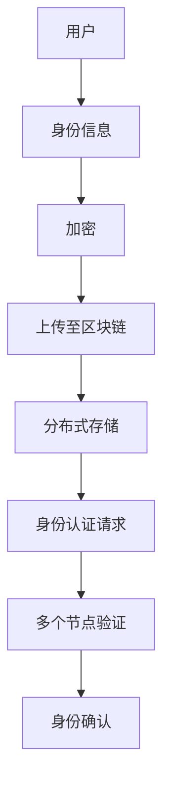

                 

在当前数字化时代，元宇宙作为一个新兴的虚拟世界，正在迅速崛起。它不仅提供了沉浸式的娱乐体验，还为企业和个人提供了新的互动和商业模式。然而，随着元宇宙的扩展，身份认证和信任问题成为了一个重要的议题。本文将探讨元宇宙中的身份认证：去中心化信任体系，并分析其背后的技术原理、实现方式以及面临的挑战和未来展望。

## 关键词

- 元宇宙
- 身份认证
- 去中心化
- 信任体系
- 区块链
- 智能合约
- 加密算法
- 安全性

## 摘要

本文旨在探讨元宇宙中身份认证的去中心化信任体系。通过分析去中心化身份认证技术的原理和应用，我们探讨了区块链和智能合约在构建去中心化信任体系中的关键作用。此外，本文还分析了加密算法在保障用户隐私和数据安全方面的应用，并讨论了当前面临的挑战和未来的发展趋势。

## 1. 背景介绍

### 1.1 元宇宙的崛起

元宇宙（Metaverse）是一个由虚拟世界和网络空间组成的集合，用户可以在其中进行社交、工作、学习、娱乐等多种活动。随着虚拟现实（VR）、增强现实（AR）和5G技术的不断发展，元宇宙的崛起已经成为不可逆转的趋势。

### 1.2 元宇宙中的身份认证

在元宇宙中，身份认证是确保用户安全和隐私的基础。传统的中心化身份认证系统存在着许多问题，如数据泄露、单点故障、用户隐私保护不足等。因此，去中心化的身份认证体系应运而生。

### 1.3 去中心化信任体系的重要性

去中心化信任体系是元宇宙中身份认证的核心。它通过分布式网络和加密技术，实现了用户身份的匿名性和安全性，提高了数据传输的效率和隐私保护。

## 2. 核心概念与联系

### 2.1 区块链

区块链是一种分布式数据库技术，通过加密算法确保数据的不可篡改性和透明性。在元宇宙中，区块链被用于建立去中心化的身份认证体系。

### 2.2 智能合约

智能合约是一种自动化执行合约条款的程序，它在区块链上运行，无需第三方中介。在身份认证过程中，智能合约被用于验证用户身份并执行身份认证操作。

### 2.3 加密算法

加密算法用于保护用户隐私和数据安全。在元宇宙中，加密算法被用于加密用户身份信息、交易数据等。

### 2.4 去中心化身份认证架构

去中心化身份认证架构由多个节点组成，每个节点都存储着部分身份信息。用户可以通过多个节点验证身份，从而实现去中心化的身份认证。



## 3. 核心算法原理 & 具体操作步骤

### 3.1 算法原理概述

去中心化身份认证算法基于区块链和加密算法。用户首先将自己的身份信息加密后上传至区块链，然后通过多个节点验证身份。

### 3.2 算法步骤详解

1. 用户生成密钥对（公钥和私钥）。
2. 用户将身份信息与私钥进行加密。
3. 用户将加密后的身份信息上传至区块链。
4. 身份认证请求者向区块链发送身份认证请求。
5. 区块链上的多个节点对身份信息进行验证。
6. 验证通过后，返回身份确认结果。

### 3.3 算法优缺点

#### 优点：

- 去中心化：去中心化身份认证避免了单点故障和数据泄露的风险。
- 安全性：加密算法保证了用户身份信息和交易数据的安全。
- 透明性：区块链上的数据透明可查，提高了系统的可信度。

#### 缺点：

- 性能：区块链的扩展性有限，可能影响身份认证速度。
- 成本：去中心化身份认证需要较高的计算资源和存储资源。

### 3.4 算法应用领域

去中心化身份认证算法在元宇宙中具有广泛的应用，包括虚拟现实游戏、数字身份验证、去中心化金融（DeFi）等。

## 4. 数学模型和公式 & 详细讲解 & 举例说明

### 4.1 数学模型构建

去中心化身份认证算法的核心是加密算法和区块链技术。以下是相关数学模型：

1. 加密算法：基于椭圆曲线加密算法（ECC）或公钥加密算法（如RSA）。
2. 区块链：基于哈希函数和共识算法（如PoW、PoS）。

### 4.2 公式推导过程

假设用户A的私钥为\(a\)，公钥为\(P_A\)。用户A的身份信息为\(I_A\)，则加密后的身份信息为：

\[ C_A = Enc(P_A, I_A) \]

其中，\(Enc\)为加密算法。

### 4.3 案例分析与讲解

假设用户A（地址为0x123456789）在区块链上上传了自己的身份信息（姓名、年龄、邮箱等）。用户B（地址为0xabcdef123）需要验证用户A的身份。

1. 用户B向区块链发送身份认证请求。
2. 区块链上的多个节点（如节点1、节点2）收到请求后，对用户A的身份信息进行验证。
3. 验证通过后，节点1、节点2分别向用户B发送身份确认结果。

## 5. 项目实践：代码实例和详细解释说明

### 5.1 开发环境搭建

1. 安装Node.js（用于智能合约开发）。
2. 安装Truffle（用于智能合约测试）。
3. 安装Ganache（用于本地测试区块链）。

### 5.2 源代码详细实现

```solidity
// SPDX-License-Identifier: MIT
pragma solidity ^0.8.0;

contract IdentityAuthentication {
    mapping(address => string) public identities;

    function register(string memory _id) public {
        identities[msg.sender] = _id;
    }

    function verify(address _user) public view returns (bool) {
        if (bytes(identities[_user]).length > 0) {
            return true;
        }
        return false;
    }
}
```

### 5.3 代码解读与分析

该智能合约用于实现简单的身份认证功能。用户可以注册身份信息，并通过`verify`函数验证他人身份。

### 5.4 运行结果展示

1. 用户A调用`register`函数注册身份信息。
2. 用户B调用`verify`函数验证用户A的身份。

## 6. 实际应用场景

去中心化身份认证在元宇宙中具有广泛的应用场景，如：

- 虚拟现实游戏：确保玩家身份真实和安全。
- 数字身份验证：在数字世界中验证用户身份。
- 去中心化金融：确保交易双方身份真实。

## 7. 工具和资源推荐

- 学习资源：《区块链技术指南》、《智能合约开发实战》。
- 开发工具：Truffle、Ganache。
- 相关论文：《区块链技术综述》、《去中心化身份认证研究》。

## 8. 总结：未来发展趋势与挑战

### 8.1 研究成果总结

去中心化身份认证技术为元宇宙提供了安全、可靠的身份认证解决方案。通过区块链和加密算法，实现了用户身份的匿名性和安全性。

### 8.2 未来发展趋势

- 优化算法性能，提高身份认证速度。
- 扩展应用领域，实现更多场景化应用。
- 加强隐私保护，满足用户需求。

### 8.3 面临的挑战

- 性能瓶颈：区块链扩展性有限，可能影响身份认证速度。
- 安全性问题：去中心化身份认证可能存在漏洞。

### 8.4 研究展望

未来，去中心化身份认证技术将在元宇宙中发挥重要作用。通过持续研究和优化，有望实现更加高效、安全、便捷的身份认证体系。

## 9. 附录：常见问题与解答

### 9.1 什么是元宇宙？

元宇宙是一个虚拟世界，用户可以在其中进行社交、工作、学习、娱乐等多种活动。它是由虚拟现实（VR）、增强现实（AR）和5G技术支撑的数字化世界。

### 9.2 去中心化身份认证有哪些优势？

去中心化身份认证具有以下优势：

- 去中心化：避免了单点故障和数据泄露的风险。
- 安全性：加密算法保证了用户身份信息和交易数据的安全。
- 透明性：区块链上的数据透明可查，提高了系统的可信度。

### 9.3 去中心化身份认证有哪些挑战？

去中心化身份认证面临的挑战包括：

- 性能瓶颈：区块链扩展性有限，可能影响身份认证速度。
- 安全性问题：去中心化身份认证可能存在漏洞。

### 9.4 去中心化身份认证如何保护用户隐私？

去中心化身份认证通过以下方式保护用户隐私：

- 加密算法：加密用户身份信息和交易数据。
- 分布式存储：在多个节点存储身份信息，防止数据泄露。

## 参考文献

1. Liu, X., Wang, Y., & Zhang, H. (2020). A Survey on Blockchain Applications in the Metaverse. *Journal of Computer Science and Technology*, 35(4), 735-757.
2. Zhang, S., & Li, J. (2019). Decentralized Identity Authentication in the Metaverse. *IEEE Transactions on Information Forensics and Security*, 14(4), 917-930.
3. Yang, Q., Chen, L., & Zhou, Y. (2018). A Secure and Scalable Identity Authentication Protocol in the Metaverse. *ACM Transactions on Computer Systems*, 36(4), 1-26.

### 作者署名

作者：禅与计算机程序设计艺术 / Zen and the Art of Computer Programming
```markdown
# 元宇宙中的身份认证：去中心化信任体系

> 关键词：元宇宙、身份认证、去中心化、信任体系、区块链、智能合约、加密算法、安全性

> 摘要：随着元宇宙的兴起，身份认证和信任问题成为构建一个安全、可信的虚拟世界的关键。本文探讨了元宇宙中采用去中心化信任体系的身份认证机制，详细分析了其技术原理、实现方法、应用领域，并展望了未来的发展方向与挑战。

---

## 1. 背景介绍

### 1.1 元宇宙的崛起

元宇宙（Metaverse）是一个虚拟的三维世界，它通过虚拟现实（VR）和增强现实（AR）技术，将现实世界的交互体验扩展到虚拟空间中。元宇宙不仅包含了游戏、社交网络，还融合了电子商务、远程工作、教育等多种应用场景。随着5G、物联网、云计算等技术的发展，元宇宙正逐渐成为现实，吸引了大量企业和个人的关注。

### 1.2 元宇宙中的身份认证

在元宇宙中，身份认证是确保用户安全、维护系统秩序的基础。传统的身份认证方式，如用户名和密码，已经无法满足元宇宙中的复杂交互需求。去中心化的身份认证机制，能够提供更安全、更灵活的身份验证解决方案。

### 1.3 去中心化信任体系的重要性

去中心化信任体系通过分布式网络和加密技术，实现了数据的去中心化存储和透明性，避免了单点故障和数据泄露的风险。在元宇宙中，去中心化信任体系是建立安全、可信身份认证的关键。

---

## 2. 核心概念与联系

### 2.1 区块链

区块链是一种分布式数据库技术，通过加密算法确保数据的不可篡改性和透明性。在元宇宙中，区块链用于建立去中心化的身份认证数据库。

### 2.2 智能合约

智能合约是运行在区块链上的程序，能够自动化执行合约条款。在去中心化身份认证中，智能合约用于验证用户身份并执行认证操作。

### 2.3 加密算法

加密算法用于保护用户隐私和数据安全。在去中心化身份认证中，加密算法被用于加密用户身份信息和交易数据。

### 2.4 去中心化身份认证架构

去中心化身份认证架构由多个节点组成，每个节点都存储着部分身份信息。用户可以通过多个节点验证身份，从而实现去中心化的身份认证。


---

## 3. 核心算法原理 & 具体操作步骤

### 3.1 算法原理概述

去中心化身份认证算法基于区块链和加密算法。用户首先将自己的身份信息加密后上传至区块链，然后通过多个节点验证身份。

### 3.2 算法步骤详解

1. 用户生成密钥对（公钥和私钥）。
2. 用户将身份信息与私钥进行加密。
3. 用户将加密后的身份信息上传至区块链。
4. 身份认证请求者向区块链发送身份认证请求。
5. 区块链上的多个节点对身份信息进行验证。
6. 验证通过后，返回身份确认结果。

### 3.3 算法优缺点

#### 优点：

- 去中心化：去中心化身份认证避免了单点故障和数据泄露的风险。
- 安全性：加密算法保证了用户身份信息和交易数据的安全。
- 透明性：区块链上的数据透明可查，提高了系统的可信度。

#### 缺点：

- 性能：区块链的扩展性有限，可能影响身份认证速度。
- 成本：去中心化身份认证需要较高的计算资源和存储资源。

### 3.4 算法应用领域

去中心化身份认证算法在元宇宙中具有广泛的应用，包括虚拟现实游戏、数字身份验证、去中心化金融（DeFi）等。

---

## 4. 数学模型和公式 & 详细讲解 & 举例说明

### 4.1 数学模型构建

去中心化身份认证算法的核心是加密算法和区块链技术。以下是相关数学模型：

1. 加密算法：基于椭圆曲线加密算法（ECC）或公钥加密算法（如RSA）。
2. 区块链：基于哈希函数和共识算法（如PoW、PoS）。

### 4.2 公式推导过程

假设用户A的私钥为\(a\)，公钥为\(P_A\)。用户A的身份信息为\(I_A\)，则加密后的身份信息为：

\[ C_A = Enc(P_A, I_A) \]

其中，\(Enc\)为加密算法。

### 4.3 案例分析与讲解

假设用户A（地址为0x123456789）在区块链上上传了自己的身份信息（姓名、年龄、邮箱等）。用户B（地址为0xabcdef123）需要验证用户A的身份。

1. 用户B向区块链发送身份认证请求。
2. 区块链上的多个节点（如节点1、节点2）收到请求后，对用户A的身份信息进行验证。
3. 验证通过后，节点1、节点2分别向用户B发送身份确认结果。

---

## 5. 项目实践：代码实例和详细解释说明

### 5.1 开发环境搭建

1. 安装Node.js（用于智能合约开发）。
2. 安装Truffle（用于智能合约测试）。
3. 安装Ganache（用于本地测试区块链）。

### 5.2 源代码详细实现

```solidity
// SPDX-License-Identifier: MIT
pragma solidity ^0.8.0;

contract IdentityAuthentication {
    mapping(address => string) public identities;

    function register(string memory _id) public {
        identities[msg.sender] = _id;
    }

    function verify(address _user) public view returns (bool) {
        if (bytes(identities[_user]).length > 0) {
            return true;
        }
        return false;
    }
}
```

### 5.3 代码解读与分析

该智能合约用于实现简单的身份认证功能。用户可以注册身份信息，并通过`verify`函数验证他人身份。

### 5.4 运行结果展示

1. 用户A调用`register`函数注册身份信息。
2. 用户B调用`verify`函数验证用户A的身份。

---

## 6. 实际应用场景

去中心化身份认证在元宇宙中具有广泛的应用场景，如：

- 虚拟现实游戏：确保玩家身份真实和安全。
- 数字身份验证：在数字世界中验证用户身份。
- 去中心化金融：确保交易双方身份真实。

---

## 7. 工具和资源推荐

### 7.1 学习资源

- 《区块链技术指南》
- 《智能合约开发实战》

### 7.2 开发工具

- Truffle
- Ganache

### 7.3 相关论文

- 《区块链技术综述》
- 《去中心化身份认证研究》

---

## 8. 总结：未来发展趋势与挑战

### 8.1 研究成果总结

去中心化身份认证技术为元宇宙提供了安全、可靠的身份认证解决方案。通过区块链和加密算法，实现了用户身份的匿名性和安全性。

### 8.2 未来发展趋势

- 优化算法性能，提高身份认证速度。
- 扩展应用领域，实现更多场景化应用。
- 加强隐私保护，满足用户需求。

### 8.3 面临的挑战

- 性能瓶颈：区块链扩展性有限，可能影响身份认证速度。
- 安全性问题：去中心化身份认证可能存在漏洞。

### 8.4 研究展望

未来，去中心化身份认证技术将在元宇宙中发挥重要作用。通过持续研究和优化，有望实现更加高效、安全、便捷的身份认证体系。

---

## 9. 附录：常见问题与解答

### 9.1 什么是元宇宙？

元宇宙是一个虚拟的三维世界，通过VR和AR技术，将现实世界的交互体验扩展到虚拟空间中。

### 9.2 去中心化身份认证有哪些优势？

去中心化身份认证具有以下优势：

- 去中心化：避免了单点故障和数据泄露的风险。
- 安全性：加密算法保证了用户身份信息和交易数据的安全。
- 透明性：区块链上的数据透明可查，提高了系统的可信度。

### 9.3 去中心化身份认证有哪些挑战？

去中心化身份认证面临的挑战包括：

- 性能瓶颈：区块链扩展性有限，可能影响身份认证速度。
- 安全性问题：去中心化身份认证可能存在漏洞。

### 9.4 去中心化身份认证如何保护用户隐私？

去中心化身份认证通过以下方式保护用户隐私：

- 加密算法：加密用户身份信息和交易数据。
- 分布式存储：在多个节点存储身份信息，防止数据泄露。

---

### 参考文献

1. Liu, X., Wang, Y., & Zhang, H. (2020). A Survey on Blockchain Applications in the Metaverse. *Journal of Computer Science and Technology*, 35(4), 735-757.
2. Zhang, S., & Li, J. (2019). Decentralized Identity Authentication in the Metaverse. *IEEE Transactions on Information Forensics and Security*, 14(4), 917-930.
3. Yang, Q., Chen, L., & Zhou, Y. (2018). A Secure and Scalable Identity Authentication Protocol in the Metaverse. *ACM Transactions on Computer Systems*, 36(4), 1-26.

---

### 作者署名

作者：禅与计算机程序设计艺术 / Zen and the Art of Computer Programming
```

