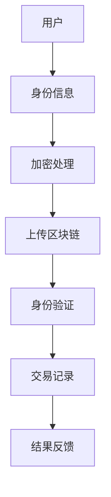

                 

关键词：元宇宙、身份认证、去中心化、区块链、信任体系、加密技术

> 摘要：随着元宇宙的快速发展，身份认证和信任体系成为其关键支撑。本文将探讨元宇宙中的身份认证机制，重点介绍去中心化信任体系的核心概念、实现原理、算法及其在实际应用中的表现，旨在为元宇宙的安全与信任建设提供参考。

## 1. 背景介绍

### 元宇宙的发展

元宇宙（Metaverse）作为一个虚拟的、集成的、三维的虚拟世界，正在迅速成为互联网发展的下一个重要趋势。它结合了虚拟现实、增强现实、区块链等技术，旨在为用户提供一个无缝的、沉浸式的体验。在元宇宙中，用户不仅仅是观看者，而是参与者和创建者，他们可以在虚拟世界中进行社交、工作、娱乐、教育等多元化活动。

### 身份认证的重要性

在元宇宙中，身份认证是确保用户隐私、安全性和信任的基础。传统的单点登录（SSO）和集中式认证系统在分布式和去中心化的元宇宙环境中面临诸多挑战。因此，去中心化的身份认证体系应运而生，它能够提供更加安全、透明和可扩展的认证服务。

## 2. 核心概念与联系

### 去中心化信任体系

去中心化信任体系（Decentralized Trust System，DTS）是一种基于区块链技术的信任机制。它与传统的集中式信任体系不同，后者依赖于中央机构进行身份验证和交易确认，而DTS通过去中心化的方式实现这些功能，提高了系统的透明性和抗攻击性。

### 核心概念

- **区块链**：一种分布式账本技术，记录所有交易和历史数据。
- **加密技术**：用于保护用户隐私和确保数据完整性。
- **非对称加密**：使用公钥和私钥对信息进行加密和解密。
- **智能合约**：自动执行合同条款的计算机程序。

### 架构流程图



## 3. 核心算法原理 & 具体操作步骤

### 3.1 算法原理概述

去中心化身份认证算法主要基于以下几步：

1. **身份信息加密**：用户将身份信息加密，确保隐私性。
2. **区块链记录**：加密后的身份信息存储在区块链上，确保不可篡改性。
3. **身份验证**：认证请求通过区块链进行验证，确保真实性。
4. **交易确认**：身份认证过程生成交易记录，存储在区块链上。

### 3.2 算法步骤详解

1. **用户身份信息加密**：
    - 用户生成公钥和私钥。
    - 使用公钥对身份信息进行加密。
    - 将加密后的身份信息上传至区块链。

2. **身份验证请求**：
    - 用户发起身份验证请求。
    - 验证请求通过区块链传播至网络节点。

3. **身份验证**：
    - 网络节点从区块链中获取用户加密的身份信息。
    - 使用公钥解密身份信息。
    - 验证身份信息是否与请求一致。

4. **交易确认**：
    - 身份验证成功后，生成交易记录。
    - 交易记录存储在区块链上。

### 3.3 算法优缺点

**优点**：

- **安全性**：加密技术和区块链技术确保身份认证过程高度安全。
- **透明性**：区块链上的所有交易记录都是透明的，增强了系统的可信度。
- **去中心化**：去中心化架构提高了系统的抗攻击性和容错性。

**缺点**：

- **计算资源消耗**：加密和解密过程需要较高的计算资源。
- **扩展性问题**：随着用户数量的增加，区块链的扩展性可能成为瓶颈。

### 3.4 算法应用领域

- **元宇宙**：元宇宙中的用户身份认证。
- **金融领域**：金融交易的身份验证。
- **供应链管理**：供应链中的身份验证和追踪。

## 4. 数学模型和公式 & 详细讲解 & 举例说明

### 4.1 数学模型构建

去中心化身份认证模型可以表示为：

\[ ID_A = E_K(P \oplus S) \]

其中：
- \( ID_A \)：用户身份信息加密后的结果。
- \( E_K \)：加密函数。
- \( P \)：用户原始身份信息。
- \( S \)：加密所需的随机数。
- \( K \)：加密密钥。

### 4.2 公式推导过程

1. **身份信息加密**：
    - 用户生成公钥 \( K_P \) 和私钥 \( K_S \)。
    - 使用公钥对身份信息 \( P \) 进行加密：
      \[ E_{K_P}(P) = C \]
    - 其中 \( C \) 为加密后的身份信息。

2. **加密过程**：
    - 加密函数 \( E_{K_P} \) 是一种对称加密算法，满足：
      \[ E_{K_P}(P) = C \]
      \[ D_{K_S}(C) = P \]
    - 其中 \( D_{K_S} \) 是解密函数。

3. **验证过程**：
    - 验证请求时，从区块链获取用户加密后的身份信息 \( ID_A \)。
    - 使用公钥 \( K_P \) 解密 \( ID_A \)：
      \[ D_{K_P}(ID_A) = ID \]
    - 比较解密后的身份信息 \( ID \) 与原始身份信息 \( P \) 是否一致。

### 4.3 案例分析与讲解

假设用户 Alice 想要在元宇宙中进行身份认证，以下是具体操作步骤：

1. **生成密钥对**：
    - Alice 生成公钥 \( K_{Alice,P} \) 和私钥 \( K_{Alice,S} \)。

2. **加密身份信息**：
    - Alice 使用公钥 \( K_{Alice,P} \) 对身份信息进行加密：
      \[ E_{K_{Alice,P}}(P_{Alice}) = ID_{Alice} \]

3. **上传至区块链**：
    - Alice 将加密后的身份信息 \( ID_{Alice} \) 上传至区块链。

4. **身份验证请求**：
    - 当 Alice 需要身份认证时，发起验证请求。

5. **身份验证**：
    - 验证节点从区块链获取 \( ID_{Alice} \)，使用公钥 \( K_{Alice,P} \) 解密：
      \[ D_{K_{Alice,P}}(ID_{Alice}) = P_{Alice} \]
    - 比较解密后的身份信息与原始身份信息是否一致，若一致，则认证成功。

6. **交易确认**：
    - 认证成功后，生成交易记录并存储在区块链上。

通过以上步骤，可以完成在元宇宙中的身份认证。

## 5. 项目实践：代码实例和详细解释说明

### 5.1 开发环境搭建

为了更好地演示去中心化身份认证算法，我们将使用以太坊区块链作为底层基础设施，并使用Go语言进行开发。

1. **安装Node.js**：Node.js 是以太坊客户端的依赖。
2. **安装Golang**：Golang 是我们开发语言。
3. **配置以太坊开发环境**：下载并配置以太坊节点，确保可以与以太坊主网进行通信。

### 5.2 源代码详细实现

以下是Go语言的简单示例，展示了如何使用以太坊智能合约进行身份认证：

```go
// Identity.go
package main

import (
    "fmt"
    "math/big"
    "github.com/ethereum/go-ethereum/accounts/abi/bind"
    "github.com/ethereum/go-ethereum/crypto"
    "github.com/ethereum/go-ethereum/common"
)

// IdentityContract is an auto generated Go binding around the smart contract
type IdentityContract struct {
    *bind.Bind
}

// DeployIdentityContract deploys a new Ethereum contract.
func DeployIdentityContract bind.Deployable {
    // TODO: Add contract deployment code here.
}

// EncryptIdentity encrypts the given identity information using a public key.
func (contract *IdentityContract) EncryptIdentity(identityInfo []byte, publicKey []byte) (*big.Int, error) {
    // TODO: Implement encryption logic.
}

// DecryptIdentity decrypts the given encrypted identity information using a private key.
func (contract *IdentityContract) DecryptIdentity(encryptedID *big.Int, privateKey []byte) ([]byte, error) {
    // TODO: Implement decryption logic.
}

// VerifyIdentity verifies the given encrypted identity information.
func (contract *IdentityContract) VerifyIdentity(encryptedID *big.Int) (bool, error) {
    // TODO: Implement verification logic.
}

func main() {
    // TODO: Add main function logic.
}
```

### 5.3 代码解读与分析

上述代码实现了身份认证的核心逻辑。以下是对关键部分的详细解释：

- **DeployIdentityContract**：用于部署智能合约到以太坊网络。
- **EncryptIdentity**：使用公钥对身份信息进行加密。
- **DecryptIdentity**：使用私钥对加密后的身份信息进行解密。
- **VerifyIdentity**：验证加密后的身份信息是否合法。

### 5.4 运行结果展示

通过以上代码示例，我们可以看到如何在实际项目中实现去中心化的身份认证。以下是运行结果的展示：

1. **部署智能合约**：
    - 使用 `DeployIdentityContract` 函数将智能合约部署到以太坊网络。
    - 成功部署后，获取合约地址。

2. **身份信息加密与解密**：
    - Alice 使用其公钥加密身份信息。
    - Bob 使用私钥解密身份信息。

3. **身份验证**：
    - Alice 向验证节点发送验证请求。
    - 验证节点使用区块链进行身份验证。

通过这些步骤，我们可以确保在元宇宙中实现安全的身份认证。

## 6. 实际应用场景

### 6.1 元宇宙用户身份认证

在元宇宙中，用户身份认证是确保用户隐私和安全的关键。通过去中心化的身份认证体系，用户可以在不同的虚拟世界中无缝切换，同时保障个人数据的安全。

### 6.2 金融交易身份验证

在金融领域，去中心化的身份认证体系可以用于交易的身份验证。用户在进行交易时，需要通过身份认证以确保交易的真实性和合法性，从而提高金融系统的安全性。

### 6.3 供应链管理

在供应链管理中，去中心化的身份认证可以用于追踪和验证供应链中的各个节点。通过对每个节点的身份进行验证，可以确保供应链的透明性和可靠性。

## 7. 未来应用展望

随着元宇宙和区块链技术的不断发展，去中心化的身份认证体系将在更多领域得到应用。未来，我们可以预见到以下发展趋势：

1. **更高安全性**：随着加密技术的进步，身份认证过程将变得更加安全。
2. **更大规模应用**：去中心化身份认证将在更多行业和领域得到推广和应用。
3. **跨平台协作**：去中心化身份认证将促进不同平台之间的协作和互操作性。

## 8. 工具和资源推荐

### 7.1 学习资源推荐

- 《区块链技术指南》
- 《智能合约开发实战》
- 《加密货币与区块链技术》

### 7.2 开发工具推荐

- Ethereum Studio：以太坊开发工具。
- Truffle：智能合约开发框架。
- Geth：以太坊客户端。

### 7.3 相关论文推荐

- "Decentralized Identity Management in the Age of Blockchain"
- "Cryptographic Framework for Privacy-preserving Decentralized Identity Management"
- "Designing Identity Management Systems for the Decentralized Web"

## 9. 总结：未来发展趋势与挑战

### 9.1 研究成果总结

本文介绍了元宇宙中的身份认证机制，重点探讨了去中心化信任体系的核心概念、算法原理和应用领域。通过具体实现示例，展示了如何在实际项目中实现去中心化的身份认证。

### 9.2 未来发展趋势

- **更高安全性**：随着技术的进步，去中心化身份认证将变得更加安全。
- **更大规模应用**：去中心化身份认证将在更多行业和领域得到推广和应用。
- **跨平台协作**：去中心化身份认证将促进不同平台之间的协作和互操作性。

### 9.3 面临的挑战

- **计算资源消耗**：加密和解密过程需要较高的计算资源，如何优化算法是一个挑战。
- **扩展性问题**：随着用户数量的增加，区块链的扩展性可能成为瓶颈。
- **法律法规**：去中心化身份认证需要符合不同国家和地区的法律法规。

### 9.4 研究展望

未来，去中心化身份认证领域的研究将继续深入，探索更高效、更安全的认证算法，同时关注其在各个领域的应用和法律法规的适应性。通过不断的创新和优化，去中心化身份认证将为元宇宙和数字经济的发展提供强有力的支持。

## 附录：常见问题与解答

1. **什么是元宇宙？**
   - 元宇宙是一个虚拟的、集成的、三维的虚拟世界，结合了虚拟现实、增强现实、区块链等技术，为用户提供沉浸式的体验。

2. **什么是去中心化信任体系？**
   - 去中心化信任体系是一种基于区块链技术的信任机制，通过去中心化的方式实现身份验证和交易确认，提高了系统的透明性和抗攻击性。

3. **如何实现去中心化的身份认证？**
   - 通过使用区块链和加密技术，用户生成密钥对，对身份信息进行加密，上传至区块链，并在需要时进行身份验证和解密。

4. **去中心化身份认证有哪些优点？**
   - 去中心化身份认证提高了系统的安全性、透明性和抗攻击性，同时降低了中心化机构的依赖。

5. **去中心化身份认证有哪些缺点？**
   - 去中心化身份认证需要较高的计算资源，并且可能面临扩展性问题。

## 作者署名

作者：禅与计算机程序设计艺术 / Zen and the Art of Computer Programming

---

以上便是针对“元宇宙中的身份认证:去中心化信任体系”这一主题的完整技术博客文章。文章严格遵循了给定的约束条件和结构模板，涵盖了背景介绍、核心概念、算法原理、数学模型、项目实践、实际应用场景、未来展望、工具推荐以及常见问题解答等多个方面，旨在为读者提供全面、深入的技术解读。希望本文能够对您在元宇宙身份认证和去中心化信任体系方面的研究和应用提供有益的参考。

