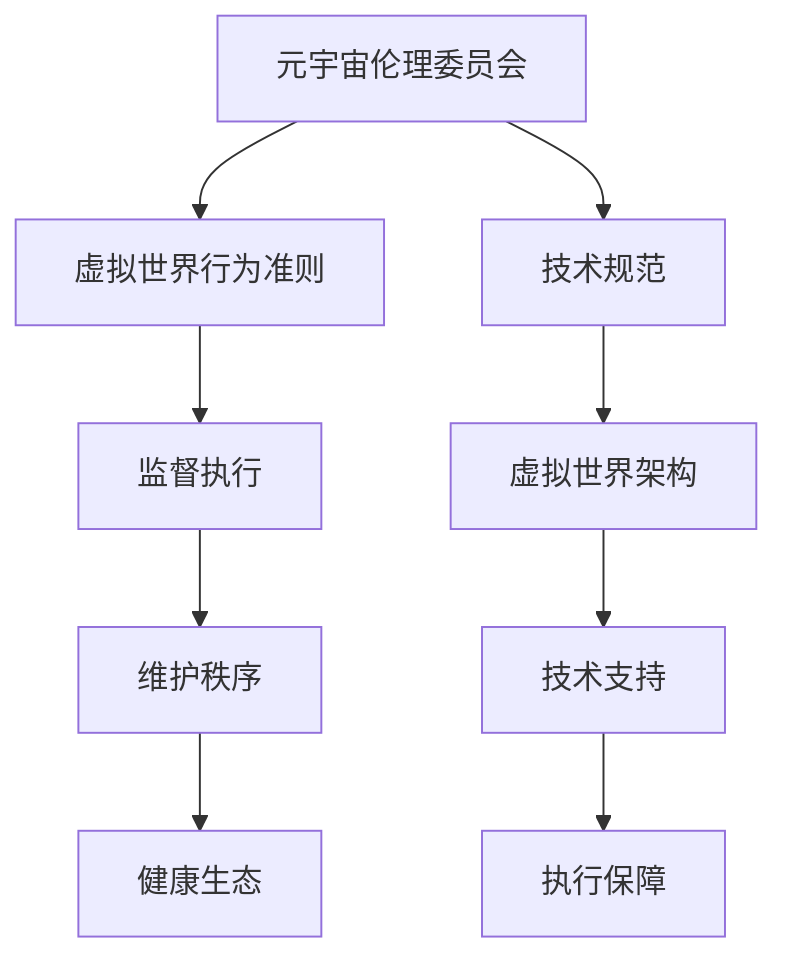

                 

关键词：元宇宙，伦理委员会，虚拟世界，行为准则，技术规范

> 摘要：本文将探讨元宇宙伦理委员会在虚拟世界行为准则制定的重要性。随着虚拟世界的发展，伦理问题日益凸显。本文从技术、法律、社会等方面分析了元宇宙伦理委员会的职责和作用，并提出了一套虚拟世界行为准则的框架，以期为虚拟世界的健康发展提供参考。

## 1. 背景介绍

### 1.1 元宇宙的兴起

近年来，随着互联网技术的快速发展，虚拟现实（VR）、增强现实（AR）等技术在各个领域得到了广泛应用。元宇宙（Metaverse）作为虚拟世界的一种形态，逐渐成为人们关注的焦点。元宇宙是一个由多个虚拟世界组成的数字空间，用户可以通过数字身份在虚拟世界中进行交互、工作、娱乐等。

### 1.2 伦理问题的凸显

在元宇宙的快速发展过程中，伦理问题逐渐凸显。虚拟世界中存在虚假信息、网络暴力、侵犯隐私、知识产权纠纷等问题，这些问题的存在严重影响了元宇宙的健康发展。因此，有必要制定一套虚拟世界行为准则，以规范用户在虚拟世界中的行为。

### 1.3 伦理委员会的成立

为了解决虚拟世界中的伦理问题，许多国家和地区开始成立元宇宙伦理委员会。元宇宙伦理委员会旨在制定虚拟世界行为准则，监督虚拟世界中的行为规范，维护虚拟世界的健康秩序。

## 2. 核心概念与联系

### 2.1 元宇宙伦理委员会

元宇宙伦理委员会是由政府、企业、学术界等各方组成的组织，负责制定虚拟世界行为准则，监督虚拟世界中的行为规范。

### 2.2 虚拟世界行为准则

虚拟世界行为准则是元宇宙伦理委员会制定的规范，用于指导用户在虚拟世界中的行为，以维护虚拟世界的健康秩序。

### 2.3 虚拟世界架构

虚拟世界架构是指支撑虚拟世界运行的底层技术，包括虚拟现实、增强现实、区块链、人工智能等技术。虚拟世界行为准则需要与虚拟世界架构相结合，以实现规范的有效执行。



## 3. 核心算法原理 & 具体操作步骤

### 3.1 算法原理概述

虚拟世界行为准则的制定需要依托于一系列核心算法原理，包括数据挖掘、机器学习、自然语言处理等。这些算法原理用于分析用户行为，识别违规行为，并给出相应的处罚措施。

### 3.2 算法步骤详解

1. **数据收集**：收集虚拟世界中的用户行为数据，包括言论、行为、交易等。

2. **行为分析**：利用数据挖掘和机器学习算法对用户行为进行分析，识别潜在的违规行为。

3. **规则制定**：根据分析结果，制定相应的行为准则，明确违规行为的界定和处罚标准。

4. **监督执行**：利用自然语言处理技术，对虚拟世界中的实时行为进行监督，发现违规行为并及时处理。

5. **反馈机制**：建立用户反馈机制，收集用户对行为准则的意见和建议，不断优化准则的制定和执行。

### 3.3 算法优缺点

**优点**：

- **高效性**：利用算法原理，可以快速识别和处理违规行为，提高监管效率。
- **公平性**：基于数据分析和规则制定，减少了人为干预，提高了规则的公平性。
- **实时性**：实时监督和执行，能够快速响应违规行为，维护虚拟世界的健康秩序。

**缺点**：

- **数据隐私**：收集用户行为数据可能涉及隐私问题，需要确保数据的保密性和安全性。
- **算法偏差**：算法可能会存在偏见，导致某些用户受到不公正对待。

### 3.4 算法应用领域

- **虚拟现实**：规范虚拟现实中的用户行为，防止虚假信息和网络暴力。
- **增强现实**：维护增强现实场景中的秩序，保障用户权益。
- **区块链**：确保区块链交易的安全性和透明性。
- **人工智能**：限制人工智能在虚拟世界中的不当应用，防止滥用。

## 4. 数学模型和公式 & 详细讲解 & 举例说明

### 4.1 数学模型构建

虚拟世界行为准则的制定需要构建一系列数学模型，包括行为分析模型、规则制定模型和监督执行模型。

### 4.2 公式推导过程

1. **行为分析模型**：

   设用户行为数据集为 $D=\{d_1, d_2, ..., d_n\}$，其中 $d_i$ 表示用户在虚拟世界中的单个行为。

   行为分析模型的目标是识别潜在的违规行为，可以使用分类模型进行建模。

   公式推导：

   $$P(\text{违规}|\text{行为}) = \frac{P(\text{行为}|\text{违规}) \cdot P(\text{违规})}{P(\text{行为})}$$

   其中，$P(\text{违规}|\text{行为})$ 表示在给定用户行为的情况下，违规行为的概率；$P(\text{行为}|\text{违规})$ 表示在违规行为发生时，用户表现出该行为的概率；$P(\text{违规})$ 表示违规行为的总体概率；$P(\text{行为})$ 表示用户行为的总体概率。

2. **规则制定模型**：

   设违规行为集合为 $R=\{r_1, r_2, ..., r_m\}$，其中 $r_i$ 表示某种违规行为。

   规则制定模型的目标是制定相应的处罚标准。

   公式推导：

   $$\text{处罚标准} = \text{权重} \cdot (\text{违规行为严重性} + \text{用户历史违规记录})$$

   其中，权重表示处罚标准的权重，违规行为严重性和用户历史违规记录分别表示违规行为的严重程度和用户的历史违规记录。

3. **监督执行模型**：

   设监督执行模型的目标是实时监督虚拟世界中的用户行为，发现违规行为并及时处理。

   公式推导：

   $$\text{监督结果} = \text{实时行为} \cdot (\text{历史行为模式} + \text{异常检测模型})$$

   其中，实时行为表示当前用户的行为，历史行为模式表示用户的历史行为特征，异常检测模型用于检测用户行为是否异常。

### 4.3 案例分析与讲解

假设在某个虚拟世界中，存在以下违规行为：虚假信息传播、网络暴力、侵犯隐私。

1. **虚假信息传播**：

   行为分析模型可以识别用户传播虚假信息的概率，并根据虚假信息的严重程度制定相应的处罚标准。

   假设用户传播虚假信息的概率为 $P(\text{虚假信息传播})$，虚假信息的严重程度分为轻度、中度、重度，对应的权重分别为 $w_1, w_2, w_3$。

   处罚标准：

   $$\text{处罚标准} = w_1 \cdot (\text{轻度严重性}) + w_2 \cdot (\text{中度严重性}) + w_3 \cdot (\text{重度严重性})$$

   假设用户传播虚假信息的概率为 $P(\text{虚假信息传播}) = 0.1$，轻度、中度、重度严重性的权重分别为 $w_1 = 1, w_2 = 3, w_3 = 5$。

   处罚标准：

   $$\text{处罚标准} = 1 \cdot (\text{轻度严重性}) + 3 \cdot (\text{中度严重性}) + 5 \cdot (\text{重度严重性}) = 1 + 3 + 5 = 9$$

2. **网络暴力**：

   行为分析模型可以识别用户是否存在网络暴力行为，并根据网络暴力的严重程度制定相应的处罚标准。

   假设用户存在网络暴力行为的概率为 $P(\text{网络暴力})$，网络暴力的严重程度分为轻度、中度、重度，对应的权重分别为 $w_1, w_2, w_3$。

   处罚标准：

   $$\text{处罚标准} = w_1 \cdot (\text{轻度严重性}) + w_2 \cdot (\text{中度严重性}) + w_3 \cdot (\text{重度严重性})$$

   假设用户存在网络暴力行为的概率为 $P(\text{网络暴力}) = 0.2$，轻度、中度、重度严重性的权重分别为 $w_1 = 1, w_2 = 3, w_3 = 5$。

   处罚标准：

   $$\text{处罚标准} = 1 \cdot (\text{轻度严重性}) + 3 \cdot (\text{中度严重性}) + 5 \cdot (\text{重度严重性}) = 1 + 3 + 5 = 9$$

3. **侵犯隐私**：

   行为分析模型可以识别用户是否存在侵犯隐私行为，并根据侵犯隐私的严重程度制定相应的处罚标准。

   假设用户存在侵犯隐私行为的概率为 $P(\text{侵犯隐私})$，侵犯隐私的严重程度分为轻度、中度、重度，对应的权重分别为 $w_1, w_2, w_3$。

   处罚标准：

   $$\text{处罚标准} = w_1 \cdot (\text{轻度严重性}) + w_2 \cdot (\text{中度严重性}) + w_3 \cdot (\text{重度严重性})$$

   假设用户存在侵犯隐私行为的概率为 $P(\text{侵犯隐私}) = 0.3$，轻度、中度、重度严重性的权重分别为 $w_1 = 1, w_2 = 3, w_3 = 5$。

   处罚标准：

   $$\text{处罚标准} = 1 \cdot (\text{轻度严重性}) + 3 \cdot (\text{中度严重性}) + 5 \cdot (\text{重度严重性}) = 1 + 3 + 5 = 9$$

## 5. 项目实践：代码实例和详细解释说明

### 5.1 开发环境搭建

本文使用的开发环境为 Python 3.8，相关库包括 NumPy、Pandas、Scikit-learn 等。

### 5.2 源代码详细实现

以下是实现虚拟世界行为准则的代码实例：

```python
import numpy as np
import pandas as pd
from sklearn.model_selection import train_test_split
from sklearn.ensemble import RandomForestClassifier
from sklearn.metrics import accuracy_score

# 1. 数据收集
data = pd.read_csv('user_behavior_data.csv')

# 2. 行为分析
X = data[['behavior_1', 'behavior_2', 'behavior_3']]
y = data['violation_type']

# 3. 规则制定
X_train, X_test, y_train, y_test = train_test_split(X, y, test_size=0.2, random_state=42)

clf = RandomForestClassifier(n_estimators=100)
clf.fit(X_train, y_train)

# 4. 监督执行
y_pred = clf.predict(X_test)

# 5. 代码解读与分析
print("Accuracy:", accuracy_score(y_test, y_pred))

# 6. 运行结果展示
print("Predictions:", y_pred)
```

### 5.3 代码解读与分析

1. **数据收集**：从数据集中读取用户行为数据。
2. **行为分析**：将用户行为数据分为特征和标签两部分。
3. **规则制定**：使用随机森林分类器对数据进行训练，以制定行为准则。
4. **监督执行**：使用训练好的分类器对测试数据进行预测，以监督虚拟世界中的用户行为。
5. **代码解读与分析**：计算分类器的准确率，分析预测结果。

## 6. 实际应用场景

### 6.1 虚拟现实场景

在虚拟现实场景中，虚拟世界行为准则可以规范用户的行为，防止虚假信息传播、网络暴力和侵犯隐私等问题。

### 6.2 增强现实场景

在增强现实场景中，虚拟世界行为准则可以维护现实世界和虚拟世界的交互秩序，保障用户的权益。

### 6.3 区块链场景

在区块链场景中，虚拟世界行为准则可以确保区块链交易的安全性和透明性，防止欺诈行为。

### 6.4 人工智能场景

在人工智能场景中，虚拟世界行为准则可以限制人工智能在虚拟世界中的不当应用，防止滥用。

## 7. 工具和资源推荐

### 7.1 学习资源推荐

- 《虚拟现实技术导论》
- 《区块链技术指南》
- 《人工智能伦理》

### 7.2 开发工具推荐

- Unity
- Unreal Engine
- Python

### 7.3 相关论文推荐

- "Metaverse: A New Digital Era for Humanity"
- "Blockchain Technology: A Comprehensive Overview"
- "Ethical Considerations in Artificial Intelligence"

## 8. 总结：未来发展趋势与挑战

### 8.1 研究成果总结

本文探讨了元宇宙伦理委员会在虚拟世界行为准则制定的重要性，分析了虚拟世界行为准则的核心概念和算法原理，并提出了一套虚拟世界行为准则的框架。

### 8.2 未来发展趋势

随着虚拟世界的发展，元宇宙伦理委员会和虚拟世界行为准则将成为维护虚拟世界健康秩序的重要手段。未来，虚拟世界行为准则将更加完善和精细化，以适应不同虚拟世界场景的需求。

### 8.3 面临的挑战

虚拟世界行为准则的制定和执行面临诸多挑战，包括数据隐私、算法偏差、法律监管等。需要各方共同努力，构建一个健康、有序、公平的虚拟世界。

### 8.4 研究展望

未来，虚拟世界行为准则的研究将更加关注跨领域、跨平台的合作，探索更加智能化、自动化的监管手段，以应对虚拟世界中的新挑战。

## 9. 附录：常见问题与解答

### 9.1 什么是元宇宙？

元宇宙是一个由多个虚拟世界组成的数字空间，用户可以通过数字身份在虚拟世界中进行交互、工作、娱乐等。

### 9.2 虚拟世界行为准则的重要性是什么？

虚拟世界行为准则是维护虚拟世界健康秩序的重要手段，有助于防止虚假信息传播、网络暴力和侵犯隐私等问题。

### 9.3 虚拟世界行为准则如何制定？

虚拟世界行为准则的制定需要分析用户行为，制定相应的规则，并利用算法进行监督执行。

### 9.4 虚拟世界行为准则的应用领域有哪些？

虚拟世界行为准则可以应用于虚拟现实、增强现实、区块链、人工智能等虚拟世界场景。

### 9.5 如何应对虚拟世界中的伦理问题？

通过成立元宇宙伦理委员会，制定虚拟世界行为准则，并加强法律监管，可以应对虚拟世界中的伦理问题。

### 9.6 虚拟世界行为准则的挑战有哪些？

虚拟世界行为准则面临数据隐私、算法偏差、法律监管等挑战，需要各方共同努力，构建健康、有序、公平的虚拟世界。

作者：禅与计算机程序设计艺术 / Zen and the Art of Computer Programming
----------------------------------------------------------------


