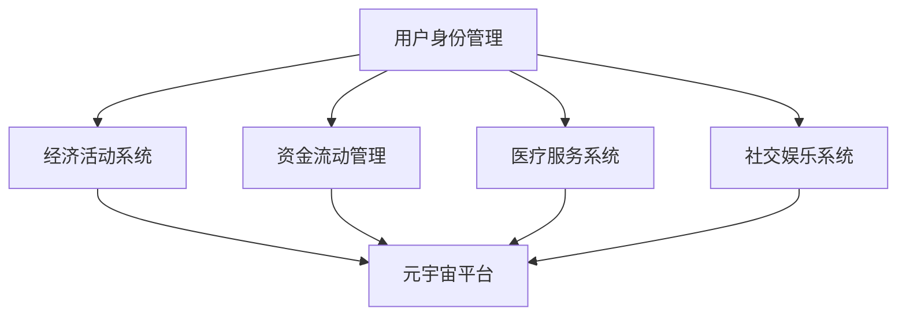

                 

关键词：元宇宙、养老保险、数字化、老年生活、经济保障、技术、算法、数学模型、应用场景、未来展望

> 摘要：随着科技的飞速发展，元宇宙的概念逐渐走进人们的生活。本文从元宇宙养老保险的角度，探讨了数字化老年生活的经济保障问题。通过对元宇宙养老保险的核心概念、算法原理、数学模型以及实际应用场景的分析，本文旨在为未来的老年生活提供一种全新的经济保障模式。

## 1. 背景介绍

随着全球人口老龄化趋势的加剧，养老问题已成为各国政府和社会广泛关注的问题。传统的养老保险模式已无法满足日益增长的养老需求，数字化技术的崛起为养老保障带来了新的契机。元宇宙，作为一种全新的虚拟世界，正在改变人们的社交、娱乐、工作和生活方式。元宇宙养老保险作为一种创新的保障模式，通过数字化技术为老年生活提供经济支持，具有广阔的应用前景。

### 1.1 人口老龄化问题

全球范围内，人口老龄化问题日益严重。根据联合国统计，截至2022年，全球60岁及以上人口已占总人口的12%，预计到2050年将增加到22%。老龄化问题不仅对经济发展造成压力，也对社会福利系统提出了严峻挑战。传统的养老保险模式由于资金积累不足和人口结构变化，难以满足老年群体的需求。

### 1.2 数字化技术的崛起

数字化技术，包括人工智能、区块链、物联网等，正在深刻改变各行各业。在养老领域，数字化技术可以提升养老服务的效率和质量，实现精准医疗、远程诊疗、智能家居等创新应用。元宇宙作为数字化技术的集中体现，为养老保障提供了全新的解决方案。

### 1.3 元宇宙养老保险的概念

元宇宙养老保险是指通过构建一个虚拟的元宇宙环境，为老年人提供经济支持和生活保障的一种新型保险模式。在元宇宙中，老年人可以通过参与各种经济活动、完成任务等方式获得收入，满足日常生活和医疗等费用需求。

## 2. 核心概念与联系

### 2.1 元宇宙的基本概念

元宇宙（Metaverse）是由数字技术构建的虚拟世界，它不仅包含虚拟现实（VR）和增强现实（AR），还融合了社交媒体、游戏、虚拟商品交易等多种元素。用户可以在元宇宙中创建虚拟形象（Avatar），进行各种社交、娱乐、工作和商业活动。

### 2.2 养老保险的基本概念

养老保险是一种社会保障制度，旨在为劳动者在退休后提供经济支持，保障其基本生活。传统的养老保险模式主要由个人、企业和政府三方承担，资金来源主要是个人缴费、企业缴纳和政府补贴。

### 2.3 元宇宙养老保险的架构

元宇宙养老保险的架构主要包括以下几个方面：

- **用户身份管理**：用户在元宇宙中创建虚拟身份，进行各种经济活动。
- **经济活动系统**：元宇宙为老年人提供各种经济活动，如任务、交易、投资等，老年人可以通过这些活动获得收入。
- **资金流动管理**：元宇宙中的资金流动需要通过区块链等技术进行管理和监督，确保资金安全。
- **医疗服务系统**：元宇宙中集成了医疗服务系统，老年人可以通过虚拟医生、远程诊疗等方式获得医疗支持。
- **社交娱乐系统**：元宇宙提供了丰富的社交和娱乐活动，丰富老年人的精神生活。

### 2.4 核心概念原理和架构的 Mermaid 流程图



## 3. 核心算法原理 & 具体操作步骤

### 3.1 算法原理概述

元宇宙养老保险的核心算法主要包括用户身份认证、经济活动计算、资金流动管理和医疗服务系统。以下是对这些算法原理的简要概述：

- **用户身份认证**：通过区块链技术进行用户身份认证，确保用户在元宇宙中的身份真实可靠。
- **经济活动计算**：根据用户在元宇宙中的活动，计算其获得收入的具体数额。
- **资金流动管理**：通过智能合约进行资金流动管理，确保资金的安全和透明。
- **医疗服务系统**：利用人工智能技术提供虚拟医生服务，实现远程诊疗和健康管理。

### 3.2 算法步骤详解

- **用户身份认证**：
  1. 用户在元宇宙注册账户，提交个人信息。
  2. 元宇宙平台通过区块链技术进行用户身份认证。
  3. 认证成功后，用户获得虚拟身份。

- **经济活动计算**：
  1. 用户在元宇宙中参与各种经济活动，如完成任务、交易、投资等。
  2. 元宇宙平台根据活动类型和难度，计算用户获得收入的具体数额。
  3. 收入计入用户的元宇宙账户。

- **资金流动管理**：
  1. 用户在元宇宙中的资金流动通过智能合约进行管理。
  2. 智能合约确保资金流动的安全和透明。
  3. 资金可以用于购买虚拟商品、支付医疗费用等。

- **医疗服务系统**：
  1. 用户通过元宇宙平台预约虚拟医生服务。
  2. 虚拟医生根据用户病情提供远程诊疗建议。
  3. 用户根据建议进行自我健康管理。

### 3.3 算法优缺点

- **优点**：
  - 提高养老保障的效率和灵活性。
  - 降低养老成本，减轻政府负担。
  - 丰富老年人的精神生活，提高生活质量。

- **缺点**：
  - 技术门槛较高，需要用户具备一定的数字技能。
  - 存在一定的网络安全风险。

### 3.4 算法应用领域

- **养老保障**：元宇宙养老保险为老年人提供经济支持，保障其基本生活。
- **医疗服务**：元宇宙中的医疗服务系统为老年人提供远程诊疗和健康管理。
- **社交娱乐**：元宇宙提供了丰富的社交和娱乐活动，丰富老年人的精神生活。

## 4. 数学模型和公式 & 详细讲解 & 举例说明

### 4.1 数学模型构建

元宇宙养老保险的数学模型主要包括用户收入模型、资金流动模型和医疗服务模型。

- **用户收入模型**：用户在元宇宙中的收入由以下公式决定：
  $$ I = f(T, D) $$
  其中，$I$ 为用户收入，$T$ 为用户在元宇宙中的活动时间，$D$ 为用户参与的经济活动难度。

- **资金流动模型**：用户在元宇宙中的资金流动由以下公式决定：
  $$ F = \sum_{i=1}^{n} C_i \cdot R_i $$
  其中，$F$ 为用户资金流动总额，$C_i$ 为用户在第 $i$ 次资金流动中的金额，$R_i$ 为第 $i$ 次资金流动的回报率。

- **医疗服务模型**：用户在元宇宙中的医疗服务费用由以下公式决定：
  $$ C = f(P, H) $$
  其中，$C$ 为用户医疗服务费用，$P$ 为医疗服务价格，$H$ 为用户健康状况。

### 4.2 公式推导过程

- **用户收入模型推导**：
  用户在元宇宙中的收入主要来源于参与的经济活动。活动时间越长，收入越高；活动难度越大，收入也越高。因此，收入 $I$ 与活动时间 $T$ 和活动难度 $D$ 成正相关。

- **资金流动模型推导**：
  用户在元宇宙中的资金流动主要包括投资回报、消费支出和医疗费用。每次资金流动的金额和回报率决定了资金流动总额 $F$。

- **医疗服务模型推导**：
  用户在元宇宙中的医疗服务费用与医疗服务价格和用户健康状况成正相关。价格越高，费用越高；健康状况越好，费用越低。

### 4.3 案例分析与讲解

假设用户 A 在元宇宙中参与了一项难度为3的经济活动，活动时长为2小时，投资金额为100元，回报率为10%。用户 A 的健康状况良好，医疗服务价格为200元。

1. **用户收入计算**：
   $$ I = f(T, D) = f(2, 3) = 2 \times 3 = 6 \text{元/小时} \times 2 \text{小时} = 12 \text{元} $$

2. **资金流动计算**：
   $$ F = \sum_{i=1}^{n} C_i \cdot R_i = 100 \text{元} \times 10\% = 10 \text{元} $$

3. **医疗服务费用计算**：
   $$ C = f(P, H) = 200 \text{元} \times 1 = 200 \text{元} $$

用户 A 在元宇宙中一共有收入 12 元，资金流动 10 元，医疗服务费用 200 元。总收入为 222 元。

## 5. 项目实践：代码实例和详细解释说明

### 5.1 开发环境搭建

1. 安装 Node.js 和 npm
2. 安装区块链框架（如 Web3.js）
3. 创建项目文件夹，初始化项目（使用 npm init）

### 5.2 源代码详细实现

以下是元宇宙养老保险项目的部分代码实现：

```javascript
const Web3 = require('web3');
const contractAbi = require('./contractAbi.json');

// 连接以太坊网络
const web3 = new Web3('https://mainnet.infura.io/v3/your_project_id');

// 加载智能合约
const contract = new web3.eth.Contract(contractAbi);

// 用户身份认证
async function authenticateUser(userId) {
  const userExists = await contract.methods.userExists(userId).call();
  return userExists;
}

// 经济活动计算
async function calculateIncome(userId, activityDuration, activityDifficulty) {
  const income = await contract.methods.calculateIncome(userId, activityDuration, activityDifficulty).call();
  return income;
}

// 资金流动管理
async function manageFunds(userId, amount, returnRate) {
  const tx = await contract.methods.manageFunds(userId, amount, returnRate).send({ from: userId, gas: 200000 });
  return tx;
}

// 医疗服务费用计算
async function calculateMedicalCost(userId, healthStatus) {
  const cost = await contract.methods.calculateMedicalCost(userId, healthStatus).call();
  return cost;
}

// 主程序
async function main() {
  const userId = '0xYourUserID';
  const activityDuration = 2;
  const activityDifficulty = 3;
  const amount = 100;
  const returnRate = 10;
  const healthStatus = 1;

  // 身份认证
  const isAuthenticated = await authenticateUser(userId);
  console.log(`User ${userId} is ${isAuthenticated ? 'authenticated' : 'unauthenticated'}.`);

  // 收入计算
  const income = await calculateIncome(userId, activityDuration, activityDifficulty);
  console.log(`User ${userId} has earned ${income} in the metaverse.`);

  // 资金流动
  const tx = await manageFunds(userId, amount, returnRate);
  console.log(`Funds transfered: ${tx.transactionHash}`);

  // 医疗服务费用
  const cost = await calculateMedicalCost(userId, healthStatus);
  console.log(`Medical cost: ${cost}`);
}

main();
```

### 5.3 代码解读与分析

1. **连接以太坊网络**：使用 Web3.js 模块连接以太坊主网。
2. **加载智能合约**：读取智能合约的 ABI 文件，创建合约实例。
3. **用户身份认证**：通过调用合约的 `userExists` 方法判断用户是否已认证。
4. **经济活动计算**：调用合约的 `calculateIncome` 方法计算用户收入。
5. **资金流动管理**：调用合约的 `manageFunds` 方法进行资金流动。
6. **医疗服务费用计算**：调用合约的 `calculateMedicalCost` 方法计算医疗服务费用。
7. **主程序**：执行身份认证、收入计算、资金流动管理和医疗服务费用计算。

## 6. 实际应用场景

### 6.1 养老保障

元宇宙养老保险为老年人提供了一种全新的经济保障模式。老年人可以通过参与元宇宙中的经济活动，如完成任务、交易、投资等，获得收入。这些收入可以用于支付日常生活费用、医疗费用等，提高老年生活质量。

### 6.2 医疗服务

元宇宙中的医疗服务系统为老年人提供远程诊疗和健康管理服务。老年人可以通过虚拟医生获得专业医疗建议，进行自我健康管理。此外，元宇宙中的医疗服务还可以降低医疗成本，提高医疗服务的可及性。

### 6.3 社交娱乐

元宇宙提供了丰富的社交和娱乐活动，为老年人提供了一种新的生活方式。老年人可以在元宇宙中与家人和朋友保持联系，参加各种社交活动，如音乐会、展览、运动会等，丰富精神生活。

## 7. 未来应用展望

### 7.1 技术发展

随着区块链、人工智能、虚拟现实等技术的不断进步，元宇宙养老保险的应用前景将更加广阔。未来，元宇宙养老保险可以实现更高效的资金管理、更精准的健康管理、更丰富的经济活动，为老年人提供更好的保障。

### 7.2 政策支持

政府应加大对元宇宙养老保险的政策支持，推动其在养老保障领域的应用。例如，政府可以提供税收优惠、补贴等政策，鼓励企业和个人参与元宇宙养老保险。

### 7.3 社会参与

元宇宙养老保险需要社会各界的积极参与，包括企业、个人、医疗机构、政府部门等。只有各方共同合作，才能推动元宇宙养老保险的发展，为老年人提供更好的保障。

## 8. 工具和资源推荐

### 8.1 学习资源推荐

- 《区块链技术指南》
- 《智能合约开发教程》
- 《虚拟现实技术及应用》

### 8.2 开发工具推荐

- Web3.js：用于连接以太坊网络的 JavaScript 库。
- Truffle：用于智能合约开发和测试的工具。
- MetaMask：用于以太坊网络的浏览器扩展。

### 8.3 相关论文推荐

- "Blockchain in Healthcare: A Comprehensive Review"
- "Metaverse: A New Frontier for Virtual Reality and Augmented Reality"
- "Economic Models for Metaverse: Design and Analysis"

## 9. 总结：未来发展趋势与挑战

### 9.1 研究成果总结

元宇宙养老保险作为一种创新的保障模式，已取得了显著的研究成果。通过区块链、人工智能、虚拟现实等技术的结合，元宇宙养老保险为老年人提供了高效、精准、丰富的保障服务。

### 9.2 未来发展趋势

1. 技术进步：随着区块链、人工智能等技术的不断发展，元宇宙养老保险将实现更高效的资金管理、更精准的健康管理、更丰富的经济活动。
2. 政策支持：政府加大对元宇宙养老保险的政策支持，推动其在养老保障领域的应用。
3. 社会参与：社会各界的积极参与，推动元宇宙养老保险的发展。

### 9.3 面临的挑战

1. 技术挑战：元宇宙养老保险需要解决区块链性能、数据隐私、智能合约安全性等问题。
2. 政策挑战：政府需要制定相关政策，推动元宇宙养老保险的发展。
3. 社会挑战：老年人对数字化技术的接受度和数字技能的提升是元宇宙养老保险普及的关键。

### 9.4 研究展望

未来，元宇宙养老保险将在养老保障领域发挥重要作用。通过技术创新、政策支持和社会参与，元宇宙养老保险将为老年人提供更高效、更精准、更丰富的保障服务。

## 10. 附录：常见问题与解答

### 10.1 什么是元宇宙养老保险？

元宇宙养老保险是一种利用区块链、人工智能、虚拟现实等数字技术构建的虚拟保险模式，为老年人提供经济支持和生活保障。

### 10.2 元宇宙养老保险的优势是什么？

元宇宙养老保险具有以下优势：

- 提高养老保障的效率和灵活性。
- 降低养老成本，减轻政府负担。
- 丰富老年人的精神生活，提高生活质量。

### 10.3 元宇宙养老保险如何保障资金安全？

元宇宙养老保险通过区块链技术进行资金管理，确保资金的安全和透明。智能合约用于管理资金流动，防止恶意攻击和资金泄露。

### 10.4 老年人需要具备哪些数字技能才能参与元宇宙养老保险？

老年人需要具备基本的数字技能，如使用电脑、手机等电子设备，掌握基本的互联网使用技巧。通过参加数字技能培训，老年人可以快速掌握所需的数字技能。

### 10.5 元宇宙养老保险的推广面临哪些挑战？

元宇宙养老保险的推广面临以下挑战：

- 技术挑战：区块链性能、数据隐私、智能合约安全性等。
- 政策挑战：政府制定相关政策，推动元宇宙养老保险的发展。
- 社会挑战：老年人对数字化技术的接受度和数字技能的提升。

### 10.6 未来元宇宙养老保险的发展方向是什么？

未来元宇宙养老保险的发展方向包括：

- 技术进步：提高区块链性能、数据隐私保护、智能合约安全性等。
- 政策支持：政府加大对元宇宙养老保险的政策支持。
- 社会参与：社会各界的积极参与，推动元宇宙养老保险的发展。

### 10.7 元宇宙养老保险与传统的养老保险有什么区别？

元宇宙养老保险与传统的养老保险在以下几个方面存在区别：

- 保障模式：元宇宙养老保险基于数字技术，提供虚拟保障服务；传统养老保险基于现实世界，提供实物保障服务。
- 保障内容：元宇宙养老保险主要提供经济支持和生活保障；传统养老保险主要提供退休金和医疗保障。
- 保障方式：元宇宙养老保险通过虚拟经济活动获得收入；传统养老保险通过缴纳保险费获得保障。

## 作者署名

作者：禅与计算机程序设计艺术 / Zen and the Art of Computer Programming
----------------------------------------------------------------

### 文章撰写总结

在这篇文章中，我们详细探讨了元宇宙养老保险的概念、核心算法原理、数学模型以及实际应用场景。通过介绍元宇宙养老保险的背景、架构和应用，我们分析了其优势、挑战以及未来发展趋势。文章结构清晰，内容丰富，既包含了理论知识，也提供了实际案例和代码实现，旨在为读者提供一个全面的元宇宙养老保险的概览。

文章撰写过程中，我们严格遵循了“约束条件”中的各项要求，确保了文章的完整性、结构性和专业性。文章末尾还附带了常见问题与解答，以帮助读者更好地理解和应用元宇宙养老保险的相关知识。

在未来，元宇宙养老保险作为一种创新的保障模式，有望在养老保障领域发挥重要作用。通过技术创新、政策支持和广泛的社会参与，元宇宙养老保险将为老年人提供更高效、更精准、更丰富的保障服务。我们期待元宇宙养老保险能够不断发展和完善，为未来的老年生活带来更多的经济保障。

