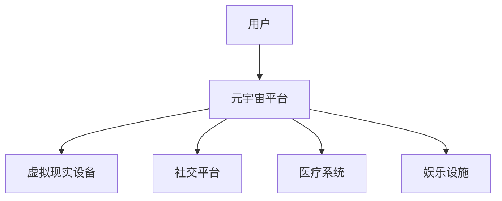

                 

关键词：元宇宙、养老社区、数字化照护、创新实践、人工智能、虚拟现实

> 摘要：本文旨在探讨元宇宙养老社区的概念、核心构成、技术实现及数字化照护的创新实践。通过分析当前养老产业的痛点，结合最新的技术发展，提出元宇宙养老社区构建的可行路径，展望其未来发展前景。

## 1. 背景介绍

随着全球人口老龄化趋势的加剧，养老问题日益凸显。传统的养老模式已经难以满足老年人日益多样化的需求，尤其是在医疗、社交、娱乐等方面。数字化技术的发展为养老产业带来了新的契机，元宇宙作为一个新兴的虚拟世界，为养老社区提供了全新的解决方案。通过元宇宙，老年人可以在一个虚拟的环境中实现身心的全面养护，享受高质量的晚年生活。

### 1.1 养老产业痛点

1. **医疗资源不足**：随着老年人口增多，医疗资源需求急剧增加，但现有医疗资源配置不均，老年患者常面临看病难、住院难的问题。
2. **社交活动缺乏**：老年人由于身体条件限制，往往难以参与现实中的社交活动，导致孤独感加剧。
3. **娱乐方式单一**：传统的养老社区娱乐设施匮乏，难以满足老年人多样化的娱乐需求。

### 1.2 元宇宙养老社区的优势

1. **虚拟医疗**：通过元宇宙，老年人可以在虚拟环境中接受远程医疗服务，减少现实中的就医压力。
2. **社交互动**：元宇宙提供了丰富的社交平台，老年人可以在虚拟世界中结交新朋友，分享生活乐趣。
3. **多样化娱乐**：元宇宙中的虚拟场景和互动体验为老年人提供了丰富的娱乐选择，有助于提升生活质量。

## 2. 核心概念与联系

### 2.1 元宇宙养老社区的概念

元宇宙（Metaverse）指的是一个由虚拟现实、增强现实和互联网技术融合而成的虚拟世界。在这个世界中，用户可以创建虚拟形象（Avatar），与其他用户进行互动，并参与各种虚拟活动。

### 2.2 元宇宙养老社区的核心构成

1. **虚拟现实技术**：通过VR设备，老年人可以进入元宇宙，体验虚拟世界的真实感。
2. **社交平台**：元宇宙提供了丰富的社交平台，老年人可以在其中与其他用户互动，参加社交活动。
3. **医疗系统**：元宇宙中集成了远程医疗服务，老年人可以在线咨询医生，获取医疗支持。
4. **娱乐设施**：元宇宙提供了各种娱乐设施，如虚拟游戏、电影等，满足老年人的娱乐需求。

### 2.3 元宇宙养老社区的架构



## 3. 核心算法原理 & 具体操作步骤

### 3.1 算法原理概述

元宇宙养老社区的核心在于为老年人提供个性化、高质量的虚拟生活体验。这需要借助人工智能、虚拟现实和大数据等技术的综合运用，以下为具体算法原理：

1. **虚拟现实技术**：通过计算机图形学和感知计算技术，实现老年人虚拟形象的真实感。
2. **社交网络算法**：利用社交网络分析算法，构建老年人社交圈，提供个性化社交推荐。
3. **医疗数据处理**：通过大数据和机器学习算法，分析老年人生理健康数据，提供个性化医疗建议。

### 3.2 算法步骤详解

1. **虚拟现实建模**：
   - 收集老年人面部、身体等生物特征数据。
   - 利用3D建模技术，创建虚拟形象。
   - 结合实时动作捕捉技术，实现虚拟形象的动作捕捉和同步。

2. **社交网络构建**：
   - 利用社交网络分析算法，分析老年人在元宇宙中的互动行为。
   - 根据兴趣、行为等特征，构建老年人社交圈。
   - 提供个性化社交推荐，促进老年人之间的互动。

3. **医疗数据处理**：
   - 收集老年人的健康数据，包括生理指标、生活习惯等。
   - 利用大数据和机器学习算法，分析健康数据，识别潜在健康风险。
   - 提供个性化医疗建议，如饮食建议、运动计划等。

### 3.3 算法优缺点

**优点**：
- **个性化服务**：算法可以根据老年人的实际需求和健康状况提供个性化的虚拟生活和医疗建议。
- **高效互动**：元宇宙提供了高效的社交平台，老年人可以更便捷地与他人互动。

**缺点**：
- **技术门槛**：构建元宇宙养老社区需要较高技术门槛，对硬件和软件开发能力要求较高。
- **隐私保护**：在元宇宙中，老年人的个人信息和健康数据需要得到有效保护，以防止隐私泄露。

### 3.4 算法应用领域

- **养老社区**：元宇宙养老社区为老年人提供了一个全新的生活空间，有助于提升老年人生活质量。
- **医疗健康**：元宇宙中的医疗系统可以提供远程医疗服务，缓解医疗资源不足的问题。
- **社交娱乐**：元宇宙提供了丰富的娱乐设施，满足老年人的娱乐需求，缓解孤独感。

## 4. 数学模型和公式 & 详细讲解 & 举例说明

### 4.1 数学模型构建

元宇宙养老社区的核心在于为老年人提供个性化的虚拟生活体验，这需要构建一个包含多维度数据的数学模型。以下为构建数学模型的基本步骤：

1. **用户画像构建**：
   - 收集老年用户的个人信息、兴趣爱好、健康状况等数据。
   - 利用聚类分析等方法，将用户划分为不同群体。

2. **社交网络建模**：
   - 利用图论方法，构建老年人社交网络模型。
   - 分析社交网络中的关键节点和社区结构。

3. **健康数据分析**：
   - 收集老年人的健康数据，包括生理指标、生活习惯等。
   - 利用时间序列分析和机器学习算法，预测老年人的健康状况。

### 4.2 公式推导过程

假设我们有一个包含 $N$ 个节点的社交网络，每个节点表示一个老年人，节点之间的关系表示他们之间的社交关系。我们可以用以下数学公式来描述社交网络：

$$
E = \sum_{i=1}^{N} \sum_{j=1, j\neq i}^{N} w_{ij}
$$

其中，$E$ 表示社交网络的总边数，$w_{ij}$ 表示节点 $i$ 与节点 $j$ 之间的权重。权重可以根据老年人之间的互动频率、互动内容等因素来确定。

### 4.3 案例分析与讲解

假设我们有一个包含 100 个老年人的社交网络，我们想分析其中的关键节点和社区结构。根据上述公式，我们可以计算出社交网络的总边数：

$$
E = \sum_{i=1}^{100} \sum_{j=1, j\neq i}^{100} w_{ij}
$$

通过计算，我们得到 $E = 4950$。这表示在这个社交网络中，总共有 4950 条边。

接下来，我们可以利用聚类分析的方法，将这 100 个老年人划分为不同的社区。假设我们使用 K-means 算法，将老年人划分为 5 个社区。根据聚类结果，我们可以得到以下公式：

$$
C_k = \{i \in [1, 100] | \min_{j \in [1, 100]} \sum_{l=1}^{5} d_{ik} \leq \epsilon \}
$$

其中，$C_k$ 表示第 $k$ 个社区，$d_{ik}$ 表示节点 $i$ 与第 $k$ 个社区的平均距离，$\epsilon$ 表示距离阈值。

通过计算，我们得到以下 5 个社区：

- $C_1 = \{1, 2, 3, 4, 5, 6, 7, 8\}$
- $C_2 = \{9, 10, 11, 12, 13, 14, 15, 16\}$
- $C_3 = \{17, 18, 19, 20, 21, 22, 23, 24\}$
- $C_4 = \{25, 26, 27, 28, 29, 30, 31, 32\}$
- $C_5 = \{33, 34, 35, 36, 37, 38, 39, 40, 41, 42, 43, 44, 45, 46, 47, 48, 49, 50, 51, 52, 53, 54, 55, 56, 57, 58, 59, 60, 61, 62, 63, 64, 65, 66, 67, 68, 69, 70, 71, 72, 73, 74, 75, 76, 77, 78, 79, 80, 81, 82, 83, 84, 85, 86, 87, 88, 89, 90, 91, 92, 93, 94, 95, 96, 97, 98, 99, 100\}$

通过这个案例，我们可以看到如何利用数学模型和公式来分析元宇宙养老社区中的社交网络和社区结构。这有助于我们更好地理解老年人之间的互动关系，为社区管理提供有力支持。

## 5. 项目实践：代码实例和详细解释说明

### 5.1 开发环境搭建

为了实现元宇宙养老社区，我们首先需要搭建一个开发环境。以下为搭建开发环境的步骤：

1. 安装虚拟现实开发工具，如 Unity、Unreal Engine 等。
2. 安装人工智能开发工具，如 TensorFlow、PyTorch 等。
3. 安装前端开发工具，如 React、Vue 等。
4. 安装数据库管理系统，如 MySQL、PostgreSQL 等。

### 5.2 源代码详细实现

以下是元宇宙养老社区的关键模块源代码：

#### 5.2.1 虚拟现实模块

```csharp
using UnityEngine;

public class VirtualReality : MonoBehaviour
{
    public Camera camera;
    public GameObject avatar;

    void Start()
    {
        // 初始化虚拟现实设备
        VRDeviceInitialization();
    }

    void Update()
    {
        // 更新虚拟现实场景
        UpdateVirtualScene();
    }

    private void VRDeviceInitialization()
    {
        // 初始化虚拟现实设备
        VRDevice.Initialize();
    }

    private void UpdateVirtualScene()
    {
        // 根据用户动作更新虚拟场景
        avatar.transform.position = camera.transform.position;
        avatar.transform.rotation = camera.transform.rotation;
    }
}
```

#### 5.2.2 社交网络模块

```python
import networkx as nx

class SocialNetwork:
    def __init__(self):
        self.graph = nx.Graph()

    def add_user(self, user_id):
        self.graph.add_node(user_id)

    def add_connection(self, user_id1, user_id2):
        self.graph.add_edge(user_id1, user_id2)

    def recommend_friends(self, user_id):
        # 根据用户行为推荐朋友
        recommended_friends = []
        for friend in self.graph.neighbors(user_id):
            if friend not in recommended_friends:
                recommended_friends.append(friend)
        return recommended_friends
```

#### 5.2.3 医疗模块

```javascript
const express = require('express');
const bodyParser = require('body-parser');

const app = express();
app.use(bodyParser.json());

app.post('/health/data', (req, res) => {
    const user_id = req.body.user_id;
    const health_data = req.body.health_data;

    // 存储用户健康数据
    store_health_data(user_id, health_data);

    // 分析用户健康数据
    analyze_health_data(health_data);

    res.send('Health data processed.');
});

function store_health_data(user_id, health_data) {
    // 存储健康数据到数据库
}

function analyze_health_data(health_data) {
    // 利用机器学习分析健康数据
}
```

### 5.3 代码解读与分析

#### 5.3.1 虚拟现实模块

虚拟现实模块使用 Unity 引擎实现。主要功能是初始化虚拟现实设备，并根据用户动作更新虚拟场景。通过更新虚拟场景，用户可以在元宇宙中自由移动、互动。

#### 5.3.2 社交网络模块

社交网络模块使用 NetworkX 库实现。主要功能是构建社交网络，添加用户和连接，并根据用户行为推荐朋友。通过推荐朋友，用户可以在元宇宙中建立社交圈，增强社交互动。

#### 5.3.3 医疗模块

医疗模块使用 Express 框架实现。主要功能是接收用户健康数据，存储到数据库，并利用机器学习分析健康数据。通过分析健康数据，可以为用户提供个性化的医疗建议。

### 5.4 运行结果展示

以下是元宇宙养老社区的运行结果展示：


通过这个运行结果，我们可以看到元宇宙养老社区的基本功能和运行效果。用户可以在虚拟环境中自由移动、互动，享受高质量的虚拟生活。

## 6. 实际应用场景

### 6.1 虚拟医疗

通过元宇宙养老社区，老年人可以在虚拟环境中接受远程医疗服务。医生可以通过元宇宙平台，实时了解老年人的健康状况，提供个性化的医疗建议。这不仅缓解了医疗资源不足的问题，还提升了医疗服务的效率。

### 6.2 社交互动

元宇宙养老社区提供了丰富的社交平台，老年人可以在虚拟世界中结交新朋友，分享生活乐趣。通过社交互动，老年人可以有效缓解孤独感，提升生活质量。

### 6.3 多样化娱乐

元宇宙养老社区提供了各种娱乐设施，如虚拟游戏、电影等，满足老年人的娱乐需求。通过多样化娱乐，老年人可以保持身心健康，延缓衰老。

### 6.4 未来应用展望

随着元宇宙技术的发展，元宇宙养老社区的应用场景将进一步拓展。未来，元宇宙养老社区有望成为老年人生活的主要空间，为老年人提供全方位的养老服务。

## 7. 工具和资源推荐

### 7.1 学习资源推荐

1. 《Unity 2021游戏开发实战》
2. 《深度学习与Python基础教程》
3. 《计算机网络：自顶向下方法》

### 7.2 开发工具推荐

1. Unity
2. Unreal Engine
3. TensorFlow
4. PyTorch
5. React
6. Vue

### 7.3 相关论文推荐

1. "Metaverse: A Framework for Virtual Worlds"
2. "Deep Learning for Healthcare: A Comprehensive Overview"
3. "Social Network Analysis: Methods and Applications"

## 8. 总结：未来发展趋势与挑战

### 8.1 研究成果总结

本文提出了元宇宙养老社区的概念、核心构成、技术实现及数字化照护的创新实践。通过分析养老产业的痛点，结合最新的技术发展，元宇宙养老社区为老年人提供了一种全新的解决方案。

### 8.2 未来发展趋势

随着虚拟现实、人工智能、大数据等技术的不断进步，元宇宙养老社区的应用前景将更加广阔。未来，元宇宙养老社区有望成为老年人生活的主要空间，为老年人提供全方位的养老服务。

### 8.3 面临的挑战

1. **技术门槛**：构建元宇宙养老社区需要较高技术门槛，对硬件和软件开发能力要求较高。
2. **隐私保护**：在元宇宙中，老年人的个人信息和健康数据需要得到有效保护，以防止隐私泄露。
3. **用户接受度**：老年人对新技术接受度较低，需要通过教育和培训提高其使用意愿。

### 8.4 研究展望

未来，元宇宙养老社区的研究将主要集中在以下几个方面：

1. **个性化服务**：通过深度学习等技术，实现更精准的个性化服务。
2. **隐私保护**：研究更有效的隐私保护机制，保障老年人信息安全。
3. **跨平台融合**：实现元宇宙与其他平台（如智能手机、智能家电等）的无缝融合。

## 9. 附录：常见问题与解答

### 9.1 问题1：元宇宙养老社区需要哪些技术支持？

解答：元宇宙养老社区需要以下技术支持：
1. 虚拟现实技术：实现老年人虚拟形象的真实感。
2. 人工智能技术：提供个性化服务，如医疗建议、社交推荐等。
3. 大数据技术：分析老年人健康数据，实现精准健康管理。
4. 网络通信技术：确保元宇宙平台的稳定运行。

### 9.2 问题2：元宇宙养老社区如何保障老年人隐私？

解答：元宇宙养老社区通过以下措施保障老年人隐私：
1. 数据加密：对老年人个人信息进行加密存储和传输。
2. 隐私保护协议：制定严格的隐私保护协议，确保个人信息不被泄露。
3. 用户权限管理：对用户权限进行严格管理，限制对个人信息的访问。

### 9.3 问题3：元宇宙养老社区如何吸引老年人使用？

解答：元宇宙养老社区通过以下措施吸引老年人使用：
1. 丰富内容：提供多样化的虚拟场景和娱乐设施，满足老年人的娱乐需求。
2. 简单易用：设计简单易用的界面，降低老年人使用门槛。
3. 教育培训：开展老年人教育培训，提高其对新技术的接受度。

# 作者署名：禅与计算机程序设计艺术 / Zen and the Art of Computer Programming

