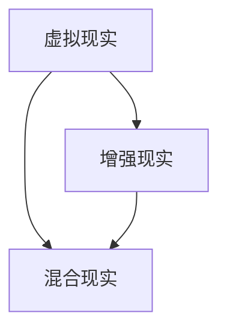
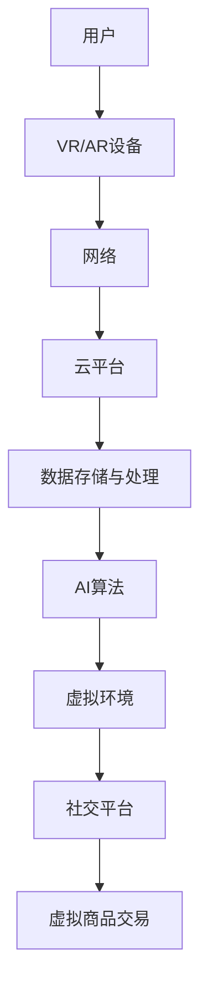

                 

随着科技的发展和互联网的普及，虚拟现实（VR）和增强现实（AR）技术正逐渐融入到我们的日常生活中。元宇宙，作为虚拟与现实融合的下一代互联网空间，正在引发前所未有的商业变革。本文将探讨元宇宙创业的机遇、挑战以及如何利用这一技术实现虚拟与现实的深度融合。

## 关键词

- 元宇宙
- 虚拟现实
- 增强现实
- 创业
- 商业模式

## 摘要

本文旨在揭示元宇宙作为新兴创业领域的巨大商机。通过分析元宇宙的核心概念、技术架构、算法原理和应用场景，本文将帮助读者理解如何把握这一趋势，开展成功的元宇宙创业项目。

## 1. 背景介绍

1. 元宇宙的定义与历史演变
2. 虚拟现实与增强现实技术的发展
3. 元宇宙的商业潜力与挑战

## 2. 核心概念与联系

### 2.1 虚拟现实与增强现实

点击展开 Mermaid 流程图

### 2.2 元宇宙架构与核心技术

点击展开 Mermaid 流程图

## 3. 核心算法原理 & 具体操作步骤

### 3.1 算法原理概述

1. 3D图形渲染算法
2. 视觉感知与跟踪算法
3. 人工智能算法在元宇宙中的应用

### 3.2 算法步骤详解

1. 3D模型构建与加载
2. 用户输入处理与交互
3. 环境感知与动态更新
4. AI算法实现个性化推荐

### 3.3 算法优缺点

1. 优缺点分析
2. 典型应用场景

### 3.4 算法应用领域

1. 游戏娱乐
2. 教育培训
3. 医疗健康

## 4. 数学模型和公式 & 详细讲解 & 举例说明

### 4.1 数学模型构建

1. 虚拟环境中的物理模型
2. 社交网络的数学模型

### 4.2 公式推导过程

1. 三维空间中的点、线、面
2. 矩阵运算与线性变换

### 4.3 案例分析与讲解

1. VR游戏中的物理引擎
2. AR应用中的图像识别技术

## 5. 项目实践：代码实例和详细解释说明

### 5.1 开发环境搭建

1. 开发工具与软件
2. 环境配置与调试

### 5.2 源代码详细实现

1. 主要模块与功能
2. 关键代码解释

### 5.3 代码解读与分析

1. 功能实现与性能优化
2. 潜在问题与解决方案

### 5.4 运行结果展示

1. 实际运行效果
2. 用户反馈与改进

## 6. 实际应用场景

1. 虚拟旅游与观光
2. 虚拟购物与体验
3. 虚拟社交与娱乐

## 7. 未来应用展望

1. 元宇宙的扩展与应用
2. 跨界融合与创新

## 8. 工具和资源推荐

1. 开发工具与平台
2. 学习资源与教程
3. 学术论文与研究报告

## 9. 总结：未来发展趋势与挑战

### 9.1 研究成果总结

1. 成果总结
2. 当前技术瓶颈

### 9.2 未来发展趋势

1. 技术革新
2. 商业模式创新

### 9.3 面临的挑战

1. 技术挑战
2. 法律法规与道德伦理

### 9.4 研究展望

1. 发展方向
2. 应用前景

## 附录：常见问题与解答

1. 问题一
2. 问题二
3. 问题三

## 参考文献

[参考文献列表]

### 作者署名

作者：禅与计算机程序设计艺术 / Zen and the Art of Computer Programming

----------------------------------------------------------------

**注：以上内容仅为文章框架和部分内容示例，请根据实际撰写需求进行补充和扩展。**

