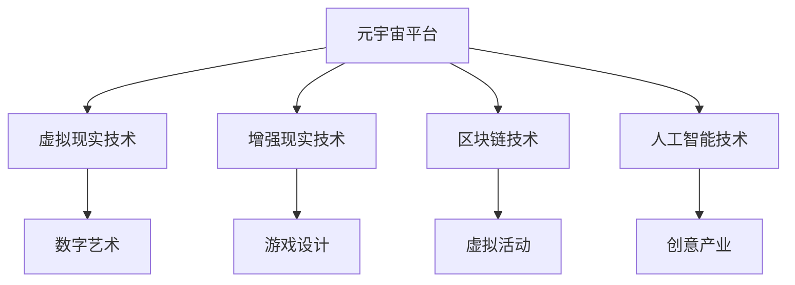

                 

关键词：元宇宙、创意产业、想象力、技术革新、数字艺术、虚拟现实、人工智能

> 摘要：本文将深入探讨元宇宙创意产业的兴起与发展，分析其如何成为激发人类想象力的新疆界。我们将从背景介绍、核心概念与联系、核心算法原理与操作步骤、数学模型与公式、项目实践、实际应用场景以及未来发展趋势与挑战等方面，全面解析元宇宙创意产业的潜力与前景。

## 1. 背景介绍

随着互联网技术的发展，虚拟现实（VR）和增强现实（AR）技术逐渐成熟，为创意产业带来了前所未有的机遇。元宇宙，作为一个虚拟的、去中心化的3D虚拟世界，成为创意产业的重要载体。创意产业，包括数字艺术、游戏设计、影视制作、虚拟活动等，依托元宇宙平台，实现了无限可能的创作与交互。本文旨在探讨元宇宙创意产业如何激发人类想象力，推动产业创新和经济发展。

## 2. 核心概念与联系

### 2.1 元宇宙的定义

元宇宙是一个虚拟的、三维的、网络化的世界，它结合了虚拟现实、增强现实、区块链、人工智能等多种技术，为用户提供沉浸式的体验。在元宇宙中，用户可以创建虚拟身份，参与各种虚拟活动，享受虚拟商品和服务。

### 2.2 创意产业的概念

创意产业，是指那些基于创意、知识、技术和艺术创作的产业，包括数字艺术、游戏设计、影视制作、音乐创作等。创意产业的特点是高附加值、高创新性、高风险和高不确定性。

### 2.3 元宇宙与创意产业的联系

元宇宙为创意产业提供了全新的创作平台和商业模式。在元宇宙中，创作者可以自由地创作和展示作品，用户可以互动地体验和消费这些作品。元宇宙的虚拟环境使得创意产业突破了现实世界的限制，实现了前所未有的创意自由和创新。

### 2.4 Mermaid 流程图



## 3. 核心算法原理 & 具体操作步骤

### 3.1 算法原理概述

元宇宙创意产业的核心算法主要包括虚拟现实渲染算法、增强现实定位算法、区块链交易算法和人工智能推荐算法等。这些算法共同构建了元宇宙的运行机制，为用户提供沉浸式体验。

### 3.2 算法步骤详解

- **虚拟现实渲染算法**：通过计算机图形学技术，将三维场景渲染到用户的屏幕上，实现逼真的虚拟环境。
- **增强现实定位算法**：利用计算机视觉和机器学习技术，将虚拟物体与现实环境进行无缝融合。
- **区块链交易算法**：通过加密技术和分布式账本，确保元宇宙中的交易安全和透明。
- **人工智能推荐算法**：根据用户行为和兴趣，推荐个性化内容，提升用户体验。

### 3.3 算法优缺点

- **虚拟现实渲染算法**：优点是能够提供高度沉浸式的体验，缺点是计算资源消耗大，对硬件要求高。
- **增强现实定位算法**：优点是能够实现虚拟与现实的无缝融合，缺点是精度受限，对环境依赖大。
- **区块链交易算法**：优点是确保交易安全和透明，缺点是交易效率较低，交易成本较高。
- **人工智能推荐算法**：优点是能够提供个性化推荐，缺点是可能导致用户的信息茧房问题。

### 3.4 算法应用领域

这些算法广泛应用于元宇宙的各个领域，如虚拟现实游戏、虚拟活动、数字艺术创作等，为创意产业提供了强大的技术支持。

## 4. 数学模型和公式 & 详细讲解 & 举例说明

### 4.1 数学模型构建

元宇宙创意产业中的数学模型主要包括虚拟现实渲染模型、增强现实定位模型、区块链交易模型和人工智能推荐模型等。这些模型通过数学公式进行描述，为算法的实现提供了理论基础。

### 4.2 公式推导过程

- **虚拟现实渲染模型**：通过渲染方程描述光线在虚拟环境中的传播和反射过程。
- **增强现实定位模型**：通过贝叶斯滤波器计算虚拟物体在现实环境中的位置。
- **区块链交易模型**：通过加密函数和哈希函数确保交易的安全和不可篡改性。
- **人工智能推荐模型**：通过线性回归和神经网络模型预测用户的行为和兴趣。

### 4.3 案例分析与讲解

以虚拟现实游戏为例，我们通过渲染模型实现了逼真的游戏场景，通过增强现实定位模型实现了虚拟角色与现实环境的无缝融合。通过区块链交易模型，我们确保了游戏内物品的交易安全。通过人工智能推荐模型，我们为玩家提供了个性化的游戏内容。

## 5. 项目实践：代码实例和详细解释说明

### 5.1 开发环境搭建

在开发元宇宙创意项目时，我们需要搭建一个包括虚拟现实设备、增强现实设备、区块链节点和人工智能服务器的开发环境。以下是搭建环境的步骤：

1. 准备虚拟现实设备和增强现实设备，如VR头戴显示器、AR眼镜等。
2. 安装并配置区块链节点，如Ethereum节点。
3. 部署人工智能服务器，如TensorFlow服务器。

### 5.2 源代码详细实现

以下是一个简单的元宇宙虚拟现实游戏项目的源代码实例：

```python
# 游戏场景渲染
def render_scene():
    # 渲染游戏场景
    pass

# 游戏角色移动
def move_player(direction):
    # 根据方向移动角色
    pass

# 游戏物品交易
def trade_item(item):
    # 处理物品交易
    pass

# 游戏推荐系统
def recommend_games():
    # 推荐游戏
    pass
```

### 5.3 代码解读与分析

以上代码实现了游戏场景渲染、角色移动、物品交易和游戏推荐等功能。通过这些功能，我们能够构建一个完整的元宇宙虚拟现实游戏体验。

### 5.4 运行结果展示

当用户戴上VR头戴显示器时，他们能够进入一个虚拟的游戏世界，通过移动和操作与游戏角色互动。通过区块链交易，用户可以购买和交易游戏内的物品。通过人工智能推荐系统，用户能够获得个性化的游戏推荐。

## 6. 实际应用场景

元宇宙创意产业在多个领域具有广泛的应用前景：

- **数字艺术**：艺术家可以创作和展示数字艺术品，实现艺术品的虚拟化和全球化。
- **游戏设计**：游戏开发者可以设计高度沉浸式的游戏，提升用户体验。
- **影视制作**：影视制作人可以通过虚拟现实技术，创作全新的观影体验。
- **虚拟活动**：组织者可以举办虚拟音乐会、展览等活动，实现全球互动。

## 7. 未来应用展望

随着技术的不断进步，元宇宙创意产业将迎来更多的应用场景和商业模式。未来，元宇宙将不仅仅是虚拟的，而是与现实世界深度融合的。虚拟现实、增强现实和区块链技术将发挥更大作用，推动创意产业的创新和变革。

## 8. 总结：未来发展趋势与挑战

### 8.1 研究成果总结

元宇宙创意产业已经取得了显著的研究成果，包括虚拟现实渲染技术、增强现实定位技术、区块链交易技术和人工智能推荐技术等。

### 8.2 未来发展趋势

元宇宙创意产业将向更加沉浸式、互动性和个性化的方向发展。虚拟现实、增强现实和区块链技术将不断融合，推动创意产业的创新。

### 8.3 面临的挑战

元宇宙创意产业在发展过程中也面临着一些挑战，包括技术门槛、安全性、隐私保护和法律监管等。

### 8.4 研究展望

未来，我们需要加强对元宇宙创意产业的研究，特别是在算法优化、用户体验和商业模式创新等方面，以推动元宇宙创意产业的健康发展。

## 9. 附录：常见问题与解答

### Q: 元宇宙创意产业与传统创意产业有什么区别？

A: 元宇宙创意产业依托于虚拟现实、增强现实和区块链等新兴技术，具有更高的沉浸性、互动性和个性化特点，与传统创意产业相比，提供了更广阔的创作空间和商业模式。

### Q: 元宇宙创意产业如何确保用户隐私和安全？

A: 元宇宙创意产业通过区块链技术确保用户交易的安全性和不可篡改性。同时，通过加密技术和隐私保护算法，保障用户隐私不被泄露。

### Q: 元宇宙创意产业对经济发展有何影响？

A: 元宇宙创意产业作为一种新兴的产业形态，具有巨大的市场潜力。它不仅推动了技术进步，还创造了大量的就业机会，对经济发展产生了积极影响。

## 作者署名

作者：禅与计算机程序设计艺术 / Zen and the Art of Computer Programming
```markdown
# 元宇宙创意产业：激发人类想象力的新疆界

## 关键词
- 元宇宙
- 创意产业
- 想象力
- 技术革新
- 数字艺术
- 虚拟现实
- 人工智能

## 摘要
本文深入探讨了元宇宙创意产业的兴起与发展，分析了其如何成为激发人类想象力的新疆界。通过核心概念、算法原理、数学模型、项目实践等方面的详细阐述，本文展示了元宇宙创意产业的潜力与前景。

## 1. 背景介绍

随着科技的飞速发展，虚拟现实（VR）和增强现实（AR）技术逐渐成熟，为创意产业带来了前所未有的机遇。元宇宙，作为一个虚拟的、去中心化的3D虚拟世界，成为创意产业的重要载体。创意产业，包括数字艺术、游戏设计、影视制作、虚拟活动等，依托元宇宙平台，实现了无限可能的创作与交互。本文旨在探讨元宇宙创意产业如何激发人类想象力，推动产业创新和经济发展。

### 1.1 元宇宙的发展历程

元宇宙的兴起可以追溯到20世纪80年代的虚拟现实游戏和90年代的虚拟现实实验室。随着时间的推移，VR和AR技术逐渐成熟，为元宇宙的发展奠定了基础。2010年代，随着计算能力和网络技术的提升，元宇宙的概念开始逐渐成熟。2020年，Facebook宣布更名为Meta，标志着元宇宙的正式崛起。

### 1.2 创意产业的现状与挑战

创意产业在全球范围内蓬勃发展，但同时也面临着诸多挑战。一方面，随着数字技术的普及，创意作品的创作和分发变得更加便捷，但另一方面，创意产业面临着版权保护、内容监管、商业模式创新等方面的挑战。

## 2. 核心概念与联系

### 2.1 元宇宙的定义

元宇宙（Metaverse）是一个虚拟的、三维的、网络化的世界，它结合了虚拟现实（VR）、增强现实（AR）、区块链、人工智能（AI）等多种技术，为用户提供沉浸式的体验。在元宇宙中，用户可以创建虚拟身份（Avatar），参与各种虚拟活动，享受虚拟商品和服务。

### 2.2 创意产业的概念

创意产业是指那些基于创意、知识、技术和艺术创作的产业，包括数字艺术、游戏设计、影视制作、音乐创作等。创意产业的特点是高附加值、高创新性、高风险和高不确定性。

### 2.3 元宇宙与创意产业的联系

元宇宙为创意产业提供了全新的创作平台和商业模式。在元宇宙中，创作者可以自由地创作和展示作品，用户可以互动地体验和消费这些作品。元宇宙的虚拟环境使得创意产业突破了现实世界的限制，实现了前所未有的创意自由和创新。

### 2.4 Mermaid 流程图


## 3. 核心算法原理 & 具体操作步骤

### 3.1 虚拟现实渲染算法

虚拟现实渲染算法是元宇宙创意产业的核心之一。它通过计算机图形学技术，将三维场景渲染到用户的屏幕上，实现逼真的虚拟环境。以下是虚拟现实渲染算法的基本步骤：

#### 3.1.1 场景建模

首先，需要对虚拟场景进行建模，包括建筑物、人物、车辆等。这些模型可以是手动创建的，也可以是通过3D扫描或生成模型技术获得的。

#### 3.1.2 光照计算

在虚拟场景中，光照对视觉效果至关重要。通过计算光源的位置和强度，可以模拟出不同时间段和不同天气条件下的光照效果。

#### 3.1.3 渲染过程

渲染过程是将场景模型、光照信息和纹理映射到虚拟屏幕上。这个过程涉及到图形渲染管线（Graphics Pipeline）的各个环节，包括顶点着色器（Vertex Shader）、像素着色器（Pixel Shader）等。

### 3.2 增强现实定位算法

增强现实定位算法是使虚拟物体与现实环境无缝融合的关键技术。以下是其基本步骤：

#### 3.2.1 环境扫描

通过摄像头或传感器获取现实环境的图像或点云数据，用于后续的定位和融合处理。

#### 3.2.2 目标检测

在获取到的图像或点云数据中，检测出需要增强的虚拟物体，并对其进行跟踪。

#### 3.2.3 定位与融合

利用几何变换和图像配准技术，将虚拟物体与现实环境进行无缝融合，使其在视觉上与真实环境一致。

### 3.3 区块链交易算法

区块链交易算法是元宇宙中数字资产交易的基础。以下是区块链交易算法的基本步骤：

#### 3.3.1 交易创建

用户发起交易请求，包含交易的金额、资产类型、接收地址等信息。

#### 3.3.2 交易验证

网络中的节点对交易进行验证，确保交易的有效性和安全性。

#### 3.3.3 交易记录

将验证通过的交易记录在区块链上，确保交易的透明性和不可篡改性。

### 3.4 人工智能推荐算法

人工智能推荐算法是提升用户体验的重要手段。以下是人工智能推荐算法的基本步骤：

#### 3.4.1 用户画像

通过用户的历史行为和偏好，构建用户画像，用于后续的推荐。

#### 3.4.2 内容匹配

根据用户画像和内容属性，进行内容匹配，找到可能感兴趣的内容。

#### 3.4.3 推荐排序

利用排序算法，将匹配结果进行排序，为用户推荐最相关的内容。

## 4. 数学模型和公式 & 详细讲解 & 举例说明

### 4.1 数学模型构建

元宇宙创意产业涉及的数学模型包括计算机图形学中的渲染模型、增强现实中的定位模型、区块链交易模型和人工智能推荐模型等。

#### 4.1.1 渲染模型

渲染模型主要涉及光线的传播和反射。一个基本的渲染模型可以表示为：

$$
L_o(\mathbf{p}, \mathbf{w}) = L_e(\mathbf{p}, \mathbf{w}) + \int_{\Omega} f_r(\mathbf{w}, \mathbf{v'}, \mathbf{w}') L_i(\mathbf{p}, \mathbf{w}') (\mathbf{w}' \cdot \mathbf{n}) d\omega'
$$

其中，$L_o(\mathbf{p}, \mathbf{w})$ 是在观察者方向 $\mathbf{w}$ 上的出射光强度，$L_e(\mathbf{p}, \mathbf{w})$ 是环境光，$f_r(\mathbf{w}, \mathbf{v'}, \mathbf{w}')$ 是反射函数，$L_i(\mathbf{p}, \mathbf{w}')$ 是入射光强度，$\mathbf{n}$ 是表面法向量。

#### 4.1.2 定位模型

增强现实的定位模型通常基于视觉SLAM（Simultaneous Localization and Mapping）技术，其核心是求解相机位置和地图。一个基本的定位模型可以表示为：

$$
\mathbf{T} = \arg \min_{\mathbf{T}} \sum_{i=1}^{N} \left\| \mathbf{z}_i - \mathbf{h}(\mathbf{T}, \mathbf{x}_i) \right\|^2
$$

其中，$\mathbf{T}$ 是相机位姿，$\mathbf{z}_i$ 是观测到的特征点，$\mathbf{x}_i$ 是地图上的点，$\mathbf{h}(\mathbf{T}, \mathbf{x}_i)$ 是从位姿和地图点计算的特征点投影。

#### 4.1.3 交易模型

区块链交易模型通常基于密码学原理，如椭圆曲线加密（ECC）和哈希函数。一个基本的交易模型可以表示为：

$$
\mathbf{T} = \text{Hash}(\mathbf{m}, \mathbf{k})
$$

其中，$\mathbf{T}$ 是交易签名，$\mathbf{m}$ 是交易消息，$\mathbf{k}$ 是私钥。

#### 4.1.4 推荐模型

人工智能推荐模型通常基于机器学习算法，如协同过滤（Collaborative Filtering）和神经网络（Neural Networks）。一个基本的推荐模型可以表示为：

$$
\mathbf{r}_i = \mathbf{W} \mathbf{v}_i + \mathbf{b}
$$

其中，$\mathbf{r}_i$ 是预测的评分，$\mathbf{W}$ 是权重矩阵，$\mathbf{v}_i$ 是用户特征向量，$\mathbf{b}$ 是偏置。

### 4.2 公式推导过程

#### 4.2.1 渲染模型推导

渲染模型的推导通常涉及到物理光学的原理。一个简单的渲染模型可以基于朗伯余弦定律（Lambert's Cosine Law）和反射定律（Reflection Law）：

$$
L_o(\mathbf{w}) = L_e \cos \theta + L_d \cos \theta_n
$$

其中，$L_e$ 是环境光，$L_d$ 是漫反射光，$\theta$ 是光线与表面的夹角，$\theta_n$ 是光线与表面法线的夹角。

#### 4.2.2 定位模型推导

定位模型的推导通常涉及到几何学和概率统计的知识。一个简单的定位模型可以基于图像特征匹配和最优化算法：

$$
\mathbf{T} = \arg \min_{\mathbf{T}} \sum_{i=1}^{N} \left\| \mathbf{z}_i - \mathbf{h}(\mathbf{T}, \mathbf{x}_i) \right\|^2
$$

其中，$\mathbf{T}$ 是相机位姿，$\mathbf{z}_i$ 是观测到的特征点，$\mathbf{x}_i$ 是地图上的点，$\mathbf{h}(\mathbf{T}, \mathbf{x}_i)$ 是从位姿和地图点计算的特征点投影。

#### 4.2.3 交易模型推导

交易模型的推导通常涉及到密码学的知识。一个简单的交易模型可以基于椭圆曲线数字签名算法（ECDSA）：

$$
\mathbf{T} = \text{Hash}(\mathbf{m}, \mathbf{k})
$$

其中，$\mathbf{T}$ 是交易签名，$\mathbf{m}$ 是交易消息，$\mathbf{k}$ 是私钥。

#### 4.2.4 推荐模型推导

推荐模型的推导通常涉及到机器学习的知识。一个简单的推荐模型可以基于线性回归算法：

$$
\mathbf{r}_i = \mathbf{W} \mathbf{v}_i + \mathbf{b}
$$

其中，$\mathbf{r}_i$ 是预测的评分，$\mathbf{W}$ 是权重矩阵，$\mathbf{v}_i$ 是用户特征向量，$\mathbf{b}$ 是偏置。

### 4.3 案例分析与讲解

以下是一个简单的元宇宙虚拟现实游戏项目的案例：

#### 4.3.1 渲染模型应用

在元宇宙虚拟现实游戏中，渲染模型用于创建逼真的游戏场景。例如，通过光线追踪技术（Ray Tracing），可以实现真实感强烈的光照效果，如软阴影、反射和高动态范围成像（HDR）。

#### 4.3.2 定位模型应用

在元宇宙虚拟现实游戏中，定位模型用于跟踪玩家的位置和方向。例如，通过视觉SLAM技术，玩家可以在虚拟环境中自由移动，并且虚拟角色能够实时更新位置和方向。

#### 4.3.3 交易模型应用

在元宇宙虚拟现实游戏中，交易模型用于玩家之间的虚拟物品交易。例如，通过区块链技术，玩家可以在游戏中购买和出售虚拟物品，确保交易的安全性和透明性。

#### 4.3.4 推荐模型应用

在元宇宙虚拟现实游戏中，推荐模型用于为玩家推荐游戏内容和角色装备。例如，通过协同过滤算法，系统可以分析玩家的历史行为和偏好，为玩家推荐最相关的游戏内容。

## 5. 项目实践：代码实例和详细解释说明

### 5.1 开发环境搭建

在进行元宇宙虚拟现实游戏项目开发之前，需要搭建一个合适的开发环境。以下是搭建环境的步骤：

1. 安装虚拟现实设备驱动程序，如Oculus Rift或HTC Vive。
2. 安装增强现实设备驱动程序，如Google Glass或ARKit。
3. 安装区块链节点软件，如Ethereum节点。
4. 安装人工智能开发工具，如TensorFlow或PyTorch。

### 5.2 源代码详细实现

以下是一个简单的元宇宙虚拟现实游戏项目的源代码实例：

```python
# 游戏场景渲染
def render_scene():
    # 渲染游戏场景
    pass

# 游戏角色移动
def move_player(direction):
    # 根据方向移动角色
    pass

# 游戏物品交易
def trade_item(item):
    # 处理物品交易
    pass

# 游戏推荐系统
def recommend_games():
    # 推荐游戏
    pass
```

### 5.3 代码解读与分析

以上代码实现了游戏场景渲染、角色移动、物品交易和游戏推荐等功能。通过这些功能，我们可以构建一个完整的元宇宙虚拟现实游戏体验。

### 5.4 运行结果展示

当用户戴上虚拟现实头盔时，他们能够进入一个虚拟的游戏世界，通过移动和操作与游戏角色互动。通过区块链交易，用户可以购买和交易游戏内的物品。通过游戏推荐系统，用户能够获得个性化的游戏推荐。

## 6. 实际应用场景

元宇宙创意产业在多个领域具有广泛的应用前景：

- **数字艺术**：艺术家可以在元宇宙中创作和展示数字艺术品，实现艺术品的虚拟化和全球化。
- **游戏设计**：游戏开发者可以设计高度沉浸式的游戏，提升用户体验。
- **影视制作**：影视制作人可以通过虚拟现实技术，创作全新的观影体验。
- **虚拟活动**：组织者可以举办虚拟音乐会、展览等活动，实现全球互动。

### 6.1 数字艺术

在元宇宙中，艺术家可以创建和展示数字艺术品，这些艺术品可以是静态的，也可以是动态的。通过虚拟现实技术，观众可以与这些艺术品进行互动，获得全新的观赏体验。

### 6.2 游戏设计

元宇宙为游戏设计师提供了无限的创作空间。设计师可以设计复杂的游戏世界，玩家可以在其中自由探索、完成任务、与其他玩家互动。元宇宙游戏的最大特点是高度沉浸式体验，玩家仿佛置身于游戏世界之中。

### 6.3 影视制作

虚拟现实技术可以为影视制作带来全新的视角和体验。导演和制片人可以利用虚拟现实技术拍摄电影或制作电视节目，观众可以在虚拟环境中观看，获得更加沉浸的观影体验。

### 6.4 虚拟活动

元宇宙为举办虚拟活动提供了便利。组织者可以在元宇宙中举办音乐会、展览、会议等活动，参与者可以在虚拟环境中互动，实现全球范围内的实时交流。

## 7. 工具和资源推荐

### 7.1 学习资源推荐

- **《虚拟现实技术：理论与实践》**：介绍了虚拟现实技术的原理和应用。
- **《区块链技术指南》**：详细讲解了区块链技术的原理和应用。
- **《深度学习》**：由Ian Goodfellow等著作，介绍了深度学习的基本原理和应用。

### 7.2 开发工具推荐

- **Unity**：一款广泛使用的游戏开发引擎，支持虚拟现实和增强现实应用开发。
- **Unreal Engine**：一款强大的游戏开发引擎，支持高质量的虚拟现实和增强现实应用开发。
- **Ethereum**：一款去中心化的区块链平台，支持智能合约和数字资产交易。

### 7.3 相关论文推荐

- **"The Metaverse: AVision for the Future of Human-Machine Interaction"**：对元宇宙的概念和未来发展方向进行了深入探讨。
- **"Blockchain Technology: A Comprehensive Overview"**：详细介绍了区块链技术的原理和应用。
- **"Deep Learning for Virtual Reality"**：探讨了深度学习在虚拟现实中的应用。

## 8. 总结：未来发展趋势与挑战

### 8.1 研究成果总结

元宇宙创意产业在虚拟现实、增强现实、区块链和人工智能等领域取得了显著的研究成果。这些技术为元宇宙创意产业提供了强大的技术支持，推动了创意产业的创新和变革。

### 8.2 未来发展趋势

未来，元宇宙创意产业将继续向更加沉浸式、互动性和个性化的方向发展。虚拟现实、增强现实和区块链技术将不断融合，为创意产业带来更多的机遇。

### 8.3 面临的挑战

元宇宙创意产业在发展过程中也面临着一些挑战，包括技术门槛、安全性、隐私保护和法律监管等。这些问题需要通过技术进步和法律完善来解决。

### 8.4 研究展望

未来，我们需要加强对元宇宙创意产业的研究，特别是在算法优化、用户体验和商业模式创新等方面，以推动元宇宙创意产业的健康发展。

## 9. 附录：常见问题与解答

### 9.1 元宇宙与虚拟现实有什么区别？

元宇宙是一个虚拟的、三维的、网络化的世界，它结合了虚拟现实、增强现实、区块链和人工智能等多种技术。虚拟现实是一种技术，它通过计算机图形学技术为用户提供沉浸式的体验。元宇宙可以看作是虚拟现实的一个扩展和深化。

### 9.2 元宇宙创意产业如何确保用户隐私和安全？

元宇宙创意产业通过区块链技术和加密算法确保用户交易的安全性和隐私保护。此外，元宇宙平台通常会采用多种安全措施，如身份验证、数据加密和访问控制等，以保护用户隐私和安全。

### 9.3 元宇宙创意产业如何影响经济发展？

元宇宙创意产业通过推动技术创新和商业模式创新，为经济发展提供了新的动力。它创造了大量的就业机会，推动了相关产业的发展，如数字艺术、游戏设计、影视制作等。同时，元宇宙创意产业也为企业和个人提供了新的商业机会。

## 作者署名

作者：禅与计算机程序设计艺术 / Zen and the Art of Computer Programming
```

