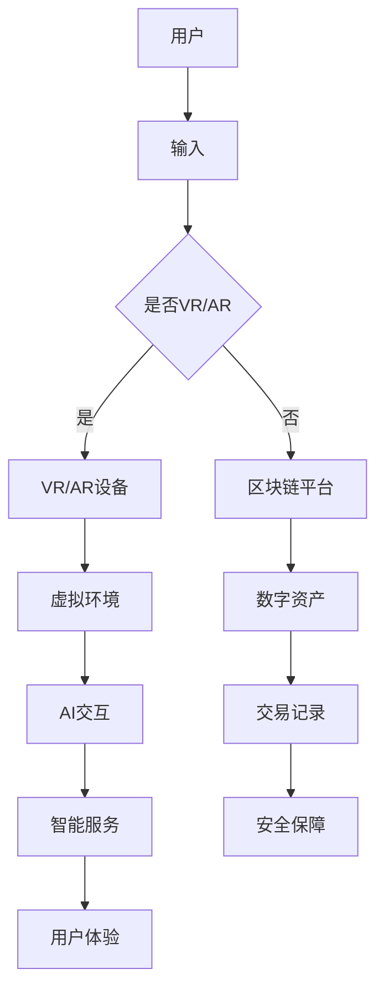

                 

关键词：元宇宙、创意产业、人工智能、虚拟现实、数字化、想象力、用户体验

> 摘要：随着技术的不断进步，元宇宙成为了一个充满无限可能的创意产业领域。本文将探讨元宇宙创意产业的发展背景、核心概念、算法原理、数学模型、项目实践以及未来应用场景，旨在为读者揭示这一新兴领域的魅力与潜力。

## 1. 背景介绍

### 元宇宙的崛起

元宇宙（Metaverse）是一个虚拟的、扩展现实的三维空间，它融合了虚拟现实（VR）、增强现实（AR）、区块链、人工智能（AI）等多种技术，为用户提供了一个沉浸式的数字世界。近年来，随着5G、云计算、大数据等技术的飞速发展，元宇宙逐渐成为人们关注的焦点。

### 创意产业的转型

创意产业是指以创意为核心，通过创意思维和技术手段，创造出具有独特价值的文化产品和服务的行业。在元宇宙中，创意产业将迎来前所未有的变革。通过虚拟现实、增强现实等技术，创意工作者可以更加便捷地创作和展示作品，用户也可以更加直观地体验和互动。

## 2. 核心概念与联系

### 核心概念

- **虚拟现实（VR）**：通过计算机技术模拟出一个逼真的三维环境，用户可以通过头戴式显示器等设备沉浸其中。
- **增强现实（AR）**：在现实环境中叠加虚拟元素，使用户在现实和虚拟之间自由切换。
- **区块链**：一种去中心化的分布式数据库技术，用于记录交易和其他数据，确保数据的透明和安全。
- **人工智能（AI）**：通过模拟人类智能，实现自动化决策和智能交互。

### Mermaid 流程图



## 3. 核心算法原理 & 具体操作步骤

### 3.1 算法原理概述

元宇宙中的核心算法主要包括VR渲染算法、AR融合算法、区块链交易算法和AI交互算法。这些算法共同构成了元宇宙的底层技术架构。

### 3.2 算法步骤详解

- **VR渲染算法**：通过对三维场景进行实时渲染，为用户提供沉浸式体验。
- **AR融合算法**：将虚拟元素与现实环境进行融合，实现自然交互。
- **区块链交易算法**：实现数字资产的安全交易和存储。
- **AI交互算法**：模拟人类智能，提供个性化的智能服务。

### 3.3 算法优缺点

- **VR渲染算法**：优点是沉浸式体验强，缺点是计算量大，对硬件要求高。
- **AR融合算法**：优点是交互自然，缺点是现实环境复杂，融合精度要求高。
- **区块链交易算法**：优点是安全可靠，缺点是交易速度较慢。
- **AI交互算法**：优点是智能化，缺点是数据隐私和安全问题。

### 3.4 算法应用领域

- **VR渲染算法**：应用于游戏、教育、医疗等领域。
- **AR融合算法**：应用于零售、旅游、建筑等领域。
- **区块链交易算法**：应用于数字货币、版权交易等领域。
- **AI交互算法**：应用于智能客服、智能家居等领域。

## 4. 数学模型和公式 & 详细讲解 & 举例说明

### 4.1 数学模型构建

在元宇宙中，数学模型主要用于以下几个方面：

- **三维空间建模**：通过三维几何学和线性代数构建虚拟环境。
- **图像处理**：通过图像处理算法实现AR融合。
- **机器学习**：通过机器学习算法实现智能交互。

### 4.2 公式推导过程

- **三维空间建模**：
  - 点乘公式：\( \vec{a} \cdot \vec{b} = a_x b_x + a_y b_y + a_z b_z \)
  - 向量加法：\( \vec{a} + \vec{b} = (a_x + b_x, a_y + b_y, a_z + b_z) \)
  
- **图像处理**：
  - 边缘检测公式：\( G(x, y) = \frac{-1}{2\pi} \int_{-\infty}^{\infty} \int_{-\infty}^{\infty} w(u, v) e^{-j2\pi ux} e^{-j2\pi vy} dudv \)
  
- **机器学习**：
  - 线性回归公式：\( y = \beta_0 + \beta_1 x \)

### 4.3 案例分析与讲解

以AR融合算法为例，我们来看一个简单的案例。

假设用户在现实环境中捕捉到一个物体，我们需要将一个虚拟元素叠加在这个物体上。

1. **物体识别**：使用深度学习模型对物体进行识别。
2. **三维建模**：根据物体的识别结果，构建虚拟元素的三维模型。
3. **位置定位**：通过图像处理算法确定虚拟元素在现实环境中的位置。
4. **融合叠加**：将虚拟元素叠加到现实环境中。

## 5. 项目实践：代码实例和详细解释说明

### 5.1 开发环境搭建

我们使用Unity作为开发平台，C#作为编程语言。

### 5.2 源代码详细实现

以下是一个简单的AR融合项目的代码实例：

```csharp
using UnityEngine;

public class ARFusion : MonoBehaviour
{
    public GameObject virtualObject;
    private Camera arCamera;

    void Start()
    {
        arCamera = Camera.main;
        // 初始化AR融合相关组件
    }

    void Update()
    {
        // 检测现实环境中的物体
        RaycastHit hit;
        if (Physics.Raycast(arCamera.transform.position, arCamera.transform.forward, out hit))
        {
            // 如果检测到物体，则创建虚拟元素
            Instantiate(virtualObject, hit.point, arCamera.transform.rotation);
        }
    }
}
```

### 5.3 代码解读与分析

这段代码实现了在Unity中创建一个AR融合项目的基本功能。通过检测现实环境中的物体，并在物体上创建虚拟元素。

### 5.4 运行结果展示

当用户在Unity中运行这个项目时，摄像头会捕捉现实环境中的物体，并在物体上叠加虚拟元素。

## 6. 实际应用场景

### 6.1 教育领域

元宇宙可以为教育领域带来全新的教学体验。通过虚拟现实技术，学生可以身临其境地学习历史事件、自然科学等知识。

### 6.2 文化产业

元宇宙为文化产业提供了无限的创作空间。艺术家和设计师可以在虚拟世界中创作作品，并与其他用户分享和互动。

### 6.3 旅游领域

通过虚拟现实技术，用户可以体验全球各地的名胜古迹，甚至是在家中就能实现“环游世界”。

## 7. 工具和资源推荐

### 7.1 学习资源推荐

- 《Unity官方教程》
- 《深度学习基础》
- 《区块链技术指南》

### 7.2 开发工具推荐

- Unity
- Blender
- MetaMask

### 7.3 相关论文推荐

- “Metaverse: A Space for Social Interaction and Knowledge Sharing”
- “Deep Learning for Augmented Reality”
- “Blockchain Technology: Principles and Applications”

## 8. 总结：未来发展趋势与挑战

### 8.1 研究成果总结

元宇宙创意产业已经取得了一系列重要成果，包括虚拟现实、增强现实、区块链和人工智能等技术的融合与发展。

### 8.2 未来发展趋势

元宇宙创意产业将继续保持快速发展，未来将出现更多创新应用，如虚拟现实游戏、数字艺术展览、数字房地产等。

### 8.3 面临的挑战

- **技术挑战**：如虚拟现实设备的舒适度、图像处理速度等。
- **隐私和安全**：如何保护用户隐私和数据安全。

### 8.4 研究展望

元宇宙创意产业的研究将朝着更加智能化、个性化和多样化的方向发展，为人类社会带来更多创新和便利。

## 9. 附录：常见问题与解答

### 9.1 元宇宙是什么？

元宇宙是一个虚拟的三维空间，通过融合多种技术（如虚拟现实、增强现实、区块链等），为用户提供沉浸式体验。

### 9.2 元宇宙有哪些应用场景？

元宇宙可以应用于教育、文化产业、旅游、零售等多个领域，为用户带来全新的体验。

### 9.3 如何开发元宇宙项目？

开发元宇宙项目需要掌握多种技术，如虚拟现实、增强现实、区块链和人工智能等。常用的开发工具包括Unity、Blender等。

```
----------------------------------------------------------------
# 作者：禅与计算机程序设计艺术 / Zen and the Art of Computer Programming
```

