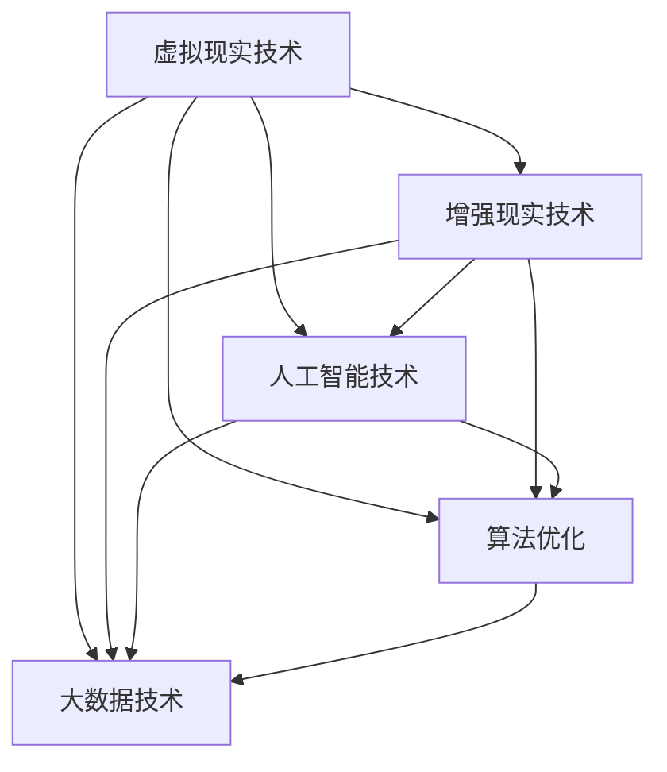

                 

 关键词：元宇宙、娱乐产业、沉浸式体验、虚拟现实、人工智能、算法、数学模型、代码实例、应用场景、未来展望

> 摘要：随着科技的发展，元宇宙娱乐产业正迅速崛起，为用户提供前所未有的沉浸式体验。本文将深入探讨元宇宙娱乐产业的核心概念、算法原理、数学模型、项目实践及其应用场景，展望其未来的发展趋势与挑战。

## 1. 背景介绍

### 1.1 元宇宙娱乐产业的兴起

随着虚拟现实（VR）和增强现实（AR）技术的日益成熟，元宇宙娱乐产业正迅速崛起。元宇宙，即“地球之外的另一个世界”，是一个由虚拟空间构成的网络平台，用户可以在其中互动、娱乐、工作和学习。娱乐产业是元宇宙的一个重要组成部分，涵盖了游戏、直播、影视、音乐等多个领域。

### 1.2 沉浸式体验的重要性

沉浸式体验是元宇宙娱乐产业的核心价值所在。通过虚拟现实和增强现实技术，用户可以身临其境地参与到虚拟世界中，感受前所未有的刺激和乐趣。这种体验不仅提高了用户的满意度，也极大地丰富了娱乐产业的内涵。

### 1.3 技术发展的驱动因素

元宇宙娱乐产业的兴起得益于多个技术领域的突破。人工智能（AI）技术的发展使得虚拟角色和场景更加逼真，算法优化提高了用户体验的流畅度，而大数据和云计算则为海量数据的处理提供了支持。

## 2. 核心概念与联系

### 2.1 虚拟现实与增强现实

虚拟现实（VR）是一种通过计算机技术创建的虚拟环境，用户可以通过VR设备（如VR头显）进入并与之互动。增强现实（AR）则是将虚拟元素叠加到现实世界中，用户通过AR设备（如智能手机或AR眼镜）可以看到增强后的现实世界。

### 2.2 人工智能与虚拟角色

人工智能（AI）在元宇宙娱乐产业中发挥着重要作用，特别是在虚拟角色的生成和交互方面。通过深度学习和自然语言处理技术，AI可以生成高度逼真的虚拟角色，并实现与用户的智能对话和互动。

### 2.3 算法优化与性能提升

算法优化是提高元宇宙娱乐产业性能的关键。通过优化渲染算法、物理引擎和图形处理技术，可以实现更流畅、更真实的沉浸式体验。

### 2.4 大数据与用户行为分析

大数据技术在元宇宙娱乐产业中用于收集和分析用户行为数据，以便更好地理解用户需求，优化产品设计和用户体验。

### 2.5 Mermaid 流程图



## 3. 核心算法原理 & 具体操作步骤

### 3.1 算法原理概述

元宇宙娱乐产业的核心算法主要包括虚拟现实渲染算法、物理引擎算法、深度学习算法和自然语言处理算法。这些算法共同作用，实现了高质量的沉浸式体验。

### 3.2 算法步骤详解

#### 3.2.1 虚拟现实渲染算法

虚拟现实渲染算法用于生成虚拟环境中的三维图像。其主要步骤包括：

1. **场景建模**：使用3D建模工具创建虚拟环境的三维模型。
2. **纹理映射**：将纹理图像映射到三维模型上，增加真实感。
3. **光照计算**：模拟虚拟环境中的光照效果，提高图像质量。
4. **渲染输出**：将渲染后的图像输出到VR设备上。

#### 3.2.2 物理引擎算法

物理引擎算法用于模拟虚拟环境中的物理现象，如重力、碰撞等。其主要步骤包括：

1. **物体建模**：创建虚拟环境中的物体模型。
2. **碰撞检测**：检测物体之间的碰撞，计算碰撞效果。
3. **运动模拟**：根据物理定律模拟物体的运动轨迹。
4. **反馈机制**：将运动结果反馈到虚拟环境中，实现实时交互。

#### 3.2.3 深度学习算法

深度学习算法用于生成和识别虚拟角色。其主要步骤包括：

1. **数据收集**：收集大量的虚拟角色图像数据。
2. **模型训练**：使用深度学习模型对图像数据进行训练。
3. **角色生成**：根据训练结果生成新的虚拟角色。
4. **角色识别**：使用训练模型识别虚拟角色。

#### 3.2.4 自然语言处理算法

自然语言处理算法用于实现虚拟角色与用户的智能对话。其主要步骤包括：

1. **语音识别**：将用户的语音转化为文本。
2. **语义理解**：理解文本的含义，提取关键信息。
3. **生成回复**：根据语义理解生成合适的回复文本。
4. **语音合成**：将回复文本转化为语音输出。

### 3.3 算法优缺点

#### 3.3.1 虚拟现实渲染算法

优点：能够生成高质量的虚拟环境图像，提供沉浸式体验。

缺点：计算量大，对硬件性能要求高。

#### 3.3.2 物理引擎算法

优点：能够模拟真实的物理现象，提高虚拟环境的真实感。

缺点：计算复杂度高，实时性要求高。

#### 3.3.3 深度学习算法

优点：能够高效地生成和识别虚拟角色，提高用户体验。

缺点：数据依赖性强，模型训练时间较长。

#### 3.3.4 自然语言处理算法

优点：能够实现虚拟角色与用户的智能对话，提高交互体验。

缺点：语音识别准确率有限，语义理解能力有待提高。

### 3.4 算法应用领域

虚拟现实渲染算法和物理引擎算法主要应用于游戏和虚拟现实体验中。深度学习算法和自然语言处理算法则广泛应用于虚拟角色生成和智能交互领域。

## 4. 数学模型和公式 & 详细讲解 & 举例说明

### 4.1 数学模型构建

在元宇宙娱乐产业中，数学模型广泛应用于场景建模、物理现象模拟和用户行为分析等环节。以下是一个简单的数学模型示例：

#### 4.1.1 场景建模

场景建模通常使用三维几何图形表示虚拟环境中的物体。一个简单的基本模型可以表示为一个立方体，其公式如下：

$$
V = l \times w \times h
$$

其中，$V$ 表示体积，$l$、$w$、$h$ 分别表示立方体的长度、宽度和高度。

#### 4.1.2 物理现象模拟

物理现象模拟通常使用牛顿运动定律。一个简单的例子是物体在重力作用下的运动，其公式如下：

$$
F = m \times a
$$

其中，$F$ 表示力，$m$ 表示物体质量，$a$ 表示加速度。

### 4.2 公式推导过程

#### 4.2.1 场景建模公式的推导

场景建模的公式可以由基本几何原理推导得出。假设一个立方体的边长为 $l$，则其体积可以表示为：

$$
V = l \times l \times l = l^3
$$

由于立方体的长度、宽度和高度相等，所以可以将其简化为：

$$
V = l \times w \times h
$$

#### 4.2.2 物理现象模拟公式的推导

物理现象模拟的公式基于牛顿运动定律。根据牛顿第二定律，物体所受合力等于物体质量与加速度的乘积。所以，可以推导出：

$$
F = m \times a
$$

其中，$F$ 表示物体所受合力，$m$ 表示物体质量，$a$ 表示加速度。

### 4.3 案例分析与讲解

#### 4.3.1 场景建模案例

假设我们设计一个虚拟现实游戏场景，其中有一个边长为2米的立方体。根据场景建模公式，我们可以计算出该立方体的体积：

$$
V = 2 \times 2 \times 2 = 8 \text{立方米}
$$

这意味着该立方体的体积为8立方米。

#### 4.3.2 物理现象模拟案例

假设我们在游戏中有一个质量为5千克的物体，其在重力作用下的加速度为9.8米/秒²。根据物理现象模拟公式，我们可以计算出该物体所受的合力：

$$
F = 5 \times 9.8 = 49 \text{牛顿}
$$

这意味着该物体在重力作用下的合力为49牛顿。

## 5. 项目实践：代码实例和详细解释说明

### 5.1 开发环境搭建

在本文中，我们将使用Unity引擎作为开发平台，结合C#编程语言来实现元宇宙娱乐项目的核心功能。首先，需要在计算机上安装Unity Hub和Unity Editor。

### 5.2 源代码详细实现

以下是一个简单的Unity C#脚本示例，用于实现虚拟现实场景的渲染和交互功能：

```csharp
using UnityEngine;

public class VRSceneController : MonoBehaviour
{
    public GameObject cubePrefab; // 立方体预制体

    void Start()
    {
        // 创建立方体
        Instantiate(cubePrefab, Vector3.zero, Quaternion.identity);
    }

    void Update()
    {
        // 处理用户输入
        if (Input.GetKeyDown(KeyCode.Space))
        {
            // 切换立方体颜色
            cubePrefab.GetComponent<MeshRenderer>().material.color = Color.red;
        }
    }
}
```

### 5.3 代码解读与分析

此脚本用于创建一个虚拟立方体，并实现用户输入时的颜色切换功能。具体解读如下：

1. **引用声明**：引入了Unity引擎中常用的组件和类，如`GameObject`、`MeshRenderer`和`Material`。
2. **脚本功能**：在`Start`方法中创建一个立方体对象，并在`Update`方法中处理用户输入事件。
3. **用户输入处理**：当用户按下空格键时，切换立方体的颜色。

### 5.4 运行结果展示

在Unity编辑器中运行此脚本，将创建一个初始颜色为白色的立方体。当用户按下空格键时，立方体的颜色将切换为红色。

## 6. 实际应用场景

### 6.1 游戏领域

元宇宙娱乐产业在游戏领域有着广泛的应用。虚拟现实游戏通过提供沉浸式体验，使玩家能够身临其境地参与到游戏世界中。例如，虚拟现实赛车游戏可以让玩家感受到驾驶的真实感，而虚拟现实恐怖游戏则能带来强烈的紧张感和刺激感。

### 6.2 直播领域

元宇宙娱乐产业在直播领域也有着巨大的潜力。通过虚拟现实技术，直播平台可以为用户提供身临其境的观看体验，如虚拟演唱会、虚拟旅游等。观众可以在虚拟场景中自由移动，与主播和其他观众互动，感受更加真实的直播体验。

### 6.3 影视领域

虚拟现实技术在影视领域也有着重要的应用。通过虚拟现实技术，观众可以在家中观看虚拟现实电影，感受到前所未有的沉浸式观影体验。此外，虚拟现实技术还可以用于制作虚拟现实短片和广告，为影视产业带来新的发展机遇。

### 6.4 音乐领域

虚拟现实技术在音乐领域也有着广泛的应用。通过虚拟现实音乐演出，观众可以感受到与现场演出相似的沉浸式音乐体验。此外，虚拟现实技术还可以用于音乐制作和音乐教育，为音乐产业带来新的发展空间。

## 7. 工具和资源推荐

### 7.1 学习资源推荐

- 《虚拟现实技术与应用》
- 《增强现实技术与应用》
- 《人工智能：一种现代方法》

### 7.2 开发工具推荐

- Unity引擎
- Unreal Engine
- Blender

### 7.3 相关论文推荐

- "Virtual Reality and Its Applications in Entertainment"
- "Enhanced Reality in Entertainment: A Review"
- "Artificial Intelligence in Entertainment: A Multidisciplinary Approach"

## 8. 总结：未来发展趋势与挑战

### 8.1 研究成果总结

元宇宙娱乐产业已经取得了显著的研究成果，包括虚拟现实技术的成熟、人工智能算法的应用、大数据和云计算的支持等。这些成果为元宇宙娱乐产业的快速发展奠定了基础。

### 8.2 未来发展趋势

未来，元宇宙娱乐产业将继续向更加沉浸式、智能化的方向发展。虚拟现实和增强现实技术的不断提升将带来更加真实的体验，人工智能和大数据技术的应用将使娱乐内容更加个性化和多样化。

### 8.3 面临的挑战

元宇宙娱乐产业在发展过程中也面临一些挑战，包括技术瓶颈、用户隐私保护、内容监管等。需要进一步研究和解决这些问题，以确保元宇宙娱乐产业的可持续发展。

### 8.4 研究展望

元宇宙娱乐产业具有巨大的发展潜力，未来将成为科技和娱乐领域的重要方向。通过不断探索和创新，元宇宙娱乐产业将带来更加丰富和多样化的娱乐体验，为人类社会带来更多价值。

## 9. 附录：常见问题与解答

### 9.1 虚拟现实与增强现实有什么区别？

虚拟现实（VR）是通过计算机技术创建的完全虚拟环境，用户可以通过VR设备（如VR头显）进入并与之互动。而增强现实（AR）是将虚拟元素叠加到现实世界中，用户通过AR设备（如智能手机或AR眼镜）可以看到增强后的现实世界。

### 9.2 人工智能在元宇宙娱乐产业中有哪些应用？

人工智能（AI）在元宇宙娱乐产业中有多种应用，包括虚拟角色的生成和交互、场景的智能模拟、用户行为的分析和推荐等。通过深度学习和自然语言处理技术，AI可以实现高度逼真的虚拟角色和智能对话功能。

### 9.3 元宇宙娱乐产业的发展前景如何？

元宇宙娱乐产业具有巨大的发展潜力，未来将继续向更加沉浸式、智能化的方向发展。随着技术的不断进步和应用的拓展，元宇宙娱乐产业将为用户提供更加丰富和多样化的娱乐体验，成为科技和娱乐领域的重要方向。

### 9.4 如何保障用户隐私和安全？

保障用户隐私和安全是元宇宙娱乐产业的重要挑战。需要采取以下措施：

- 强化用户身份认证，确保用户身份的真实性。
- 加密用户数据，防止数据泄露。
- 建立完善的隐私政策和数据使用规范，明确用户数据的收集和使用范围。
- 加强内容监管，防止不良信息的传播。

----------------------------------------------------------------

作者：禅与计算机程序设计艺术 / Zen and the Art of Computer Programming
----------------------------------------------------------------


