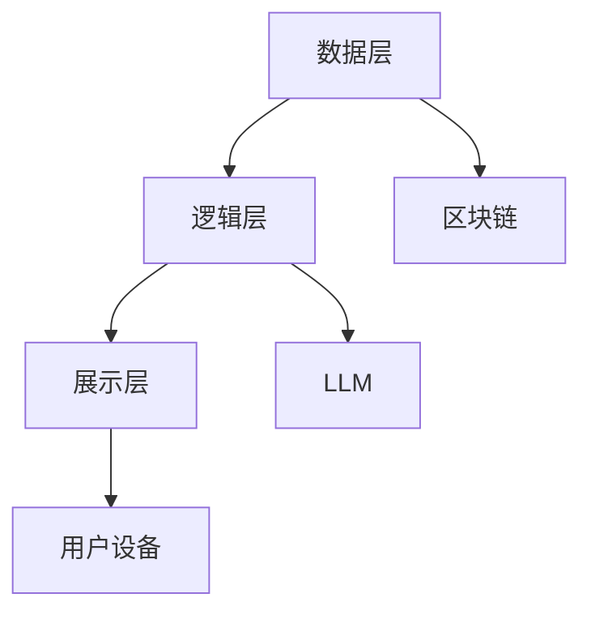

                 

关键词：元宇宙、LLM、虚拟世界、技术架构、算法、应用场景

> 摘要：本文探讨了如何利用大型语言模型（LLM）构建元宇宙，分析了LLM在虚拟世界中的核心作用，以及其技术架构、算法原理、应用领域、数学模型、项目实践和未来发展趋势。通过详细讲解，为读者提供了一个全面的技术蓝图。

## 1. 背景介绍

随着互联网和科技的飞速发展，虚拟世界逐渐成为现实世界的重要补充。元宇宙（Metaverse）作为一个集成了虚拟现实、增强现实、区块链技术等前沿技术的虚拟空间，正吸引着全球的关注。在这个虚拟世界中，用户可以以数字化的身份互动、工作、娱乐，甚至创建和拥有自己的虚拟资产。

大型语言模型（LLM）作为自然语言处理（NLP）领域的重要工具，近年来取得了显著的进展。LLM能够理解和生成自然语言，这使得它们在构建虚拟世界中的应用变得至关重要。通过利用LLM，元宇宙中的虚拟角色可以更加智能地与用户互动，提供更加丰富和个性化的体验。

本文将深入探讨如何利用LLM构建虚拟世界，从技术架构、算法原理、应用领域、数学模型、项目实践等多个角度进行分析，为读者提供一个全面的技术蓝图。

## 2. 核心概念与联系

在构建虚拟世界的过程中，核心概念和它们之间的联系至关重要。以下是几个关键概念及其相互关系：

### 2.1 元宇宙

元宇宙是一个虚拟的三维空间，用户可以在其中创建、交互、体验和共享。它由多个虚拟世界组成，这些虚拟世界通过互联网相互连接，形成了一个庞大的生态系统。

### 2.2 虚拟现实（VR）与增强现实（AR）

虚拟现实是一种通过计算机生成的完全沉浸式环境，用户通过VR设备如头戴式显示器和耳机体验。增强现实则是将虚拟元素叠加到现实世界中，通过AR眼镜或手机等设备实现。

### 2.3 区块链技术

区块链技术提供了一个去中心化的数据库，确保虚拟世界的资产和交易安全、透明和不可篡改。这使得虚拟资产如虚拟土地、虚拟物品等具有实际价值。

### 2.4 大型语言模型（LLM）

LLM是一种能够理解和生成自然语言的机器学习模型。在虚拟世界中，LLM可以用于智能对话、内容生成、虚拟角色交互等。

### 2.5 技术架构

元宇宙的技术架构通常包括以下几个层次：

- **数据层**：存储用户数据、虚拟资产和交易记录。
- **逻辑层**：处理虚拟世界中的各种逻辑和规则。
- **展示层**：用户通过VR或AR设备看到的虚拟世界界面。

下面是一个使用Mermaid绘制的元宇宙技术架构流程图：



## 3. 核心算法原理 & 具体操作步骤

### 3.1 算法原理概述

在构建虚拟世界的核心算法中，LLM发挥着重要作用。LLM通常基于深度学习技术，特别是基于Transformer架构的模型。这些模型通过大量的文本数据进行训练，能够理解和生成复杂、连贯的自然语言。

### 3.2 算法步骤详解

#### 3.2.1 数据预处理

- **数据收集**：收集大量的文本数据，包括对话日志、新闻文章、用户生成内容等。
- **数据清洗**：去除无效数据和噪声，对文本进行标准化处理，如分词、去停用词等。
- **数据增强**：通过数据扩增技术，如反向翻译、同义词替换等，增加训练数据量。

#### 3.2.2 模型训练

- **模型选择**：选择适合的Transformer模型，如BERT、GPT等。
- **模型训练**：使用训练数据进行模型训练，通过反向传播算法不断优化模型参数。

#### 3.2.3 模型评估

- **评估指标**：使用如BLEU、ROUGE等评价指标评估模型性能。
- **模型调整**：根据评估结果调整模型参数，进行多次迭代训练。

#### 3.2.4 应用部署

- **接口设计**：设计API接口，使虚拟世界中的系统可以调用LLM。
- **实时交互**：在虚拟世界中，LLM用于处理用户的输入，生成智能回复。

### 3.3 算法优缺点

#### 优点

- **强大表达能力**：LLM能够理解和生成复杂、连贯的自然语言，提供丰富的交互体验。
- **自适应学习**：通过不断训练和优化，LLM能够适应不同的应用场景，提高性能。

#### 缺点

- **计算资源需求大**：训练和部署LLM需要大量的计算资源和存储空间。
- **数据隐私问题**：LLM的训练和部署过程中可能会涉及到用户隐私数据，需要确保数据安全和隐私保护。

### 3.4 算法应用领域

- **智能对话系统**：在虚拟世界中，LLM可以用于构建智能客服、虚拟助手等。
- **内容生成**：LLM可以用于生成虚拟世界的文本内容，如新闻报道、故事情节等。
- **虚拟角色交互**：LLM可以帮助虚拟角色更加智能地与用户互动，提供个性化的服务。

## 4. 数学模型和公式 & 详细讲解 & 举例说明

### 4.1 数学模型构建

在构建虚拟世界时，数学模型用于描述虚拟环境中的物理现象和逻辑规则。以下是几个常见的数学模型：

#### 4.1.1 物理模型

- **动力学模型**：描述物体在虚拟空间中的运动和相互作用。
- **流体模型**：描述虚拟世界中的流体现象，如水、空气等。

#### 4.1.2 逻辑模型

- **状态机模型**：描述虚拟角色和系统的状态转换。
- **决策树模型**：描述虚拟角色在特定情境下的决策过程。

### 4.2 公式推导过程

以一个简单的动力学模型为例，我们可以使用牛顿第二定律推导物体在虚拟空间中的运动方程：

$$ F = m \cdot a $$

其中，$F$ 是物体所受的合力，$m$ 是物体的质量，$a$ 是物体的加速度。

由于加速度是速度的变化率，我们可以将上述公式进一步推导为：

$$ a = \frac{dv}{dt} $$

$$ F = m \cdot \frac{dv}{dt} $$

$$ m \cdot \frac{dv}{dt} = F $$

$$ \frac{dv}{dt} = \frac{F}{m} $$

$$ v(t) = v_0 + \frac{F}{m} \cdot t $$

其中，$v(t)$ 是物体在时间 $t$ 的速度，$v_0$ 是初始速度。

### 4.3 案例分析与讲解

#### 4.3.1 虚拟环境中的物体运动

假设有一个质量为 $m = 1 \text{ kg}$ 的物体在虚拟空间中受到一个恒定的合力 $F = 10 \text{ N}$。初始速度为 $v_0 = 0 \text{ m/s}$。我们需要计算物体在 $t = 5 \text{ s}$ 时的速度。

根据上面的公式，我们可以计算：

$$ v(t) = v_0 + \frac{F}{m} \cdot t $$

$$ v(5) = 0 + \frac{10}{1} \cdot 5 $$

$$ v(5) = 50 \text{ m/s} $$

因此，物体在 $5 \text{ s}$ 时的速度为 $50 \text{ m/s}$。

#### 4.3.2 虚拟角色状态转换

假设一个虚拟角色的状态可以用一个三元素向量表示，如 $(h, s, e)$，其中 $h$ 表示角色的高度，$s$ 表示角色的速度，$e$ 表示角色的能量。我们需要根据角色当前的状态和输入信号计算下一状态。

一个简单的状态转换模型可以表示为：

$$ (h_{next}, s_{next}, e_{next}) = f(h, s, e, input) $$

其中，$f$ 是一个状态转换函数，根据角色当前的状态和输入信号计算下一状态。

例如，一个简单的状态转换函数可以是：

$$ h_{next} = h + s \cdot dt $$

$$ s_{next} = s + e \cdot dt $$

$$ e_{next} = e - \frac{e}{dt} $$

其中，$dt$ 是时间步长。

通过这样的状态转换模型，我们可以模拟虚拟角色的运动和状态变化。

## 5. 项目实践：代码实例和详细解释说明

### 5.1 开发环境搭建

为了构建虚拟世界，我们需要搭建一个合适的开发环境。以下是搭建开发环境的基本步骤：

- **安装Python**：确保Python 3.8或更高版本已安装在您的计算机上。
- **安装深度学习框架**：例如，安装PyTorch或TensorFlow，用于构建和训练LLM模型。
- **安装虚拟现实库**：如PyOpenGL，用于渲染虚拟世界。
- **安装区块链库**：如PyEthereal，用于处理区块链相关操作。

### 5.2 源代码详细实现

以下是使用PyTorch构建一个简单的LLM模型的基本源代码：

```python
import torch
import torch.nn as nn
import torch.optim as optim

# 定义模型结构
class LLMModel(nn.Module):
    def __init__(self, vocab_size, embedding_dim, hidden_dim):
        super(LLMModel, self).__init__()
        self.embedding = nn.Embedding(vocab_size, embedding_dim)
        self.lstm = nn.LSTM(embedding_dim, hidden_dim)
        self.fc = nn.Linear(hidden_dim, vocab_size)

    def forward(self, inputs, hidden):
        embedded = self.embedding(inputs)
        output, hidden = self.lstm(embedded, hidden)
        logits = self.fc(output)
        return logits, hidden

    def init_hidden(self, batch_size):
        return (torch.zeros(1, batch_size, self.hidden_dim),
                torch.zeros(1, batch_size, self.hidden_dim))

# 实例化模型
model = LLMModel(vocab_size, embedding_dim, hidden_dim)
optimizer = optim.Adam(model.parameters(), lr=0.001)
criterion = nn.CrossEntropyLoss()

# 训练模型
for epoch in range(num_epochs):
    for inputs, targets in data_loader:
        hidden = model.init_hidden(batch_size)
        optimizer.zero_grad()
        logits, hidden = model(inputs, hidden)
        loss = criterion(logits.view(-1, logits.size(2)), targets.view(-1))
        loss.backward()
        optimizer.step()
```

### 5.3 代码解读与分析

- **模型定义**：`LLMModel` 类定义了LLM模型的结构，包括嵌入层、LSTM层和全连接层。
- **前向传播**：`forward` 方法实现了模型的前向传播过程，输入词向量通过嵌入层转换为嵌入向量，然后通过LSTM层处理，最后通过全连接层生成输出词向量。
- **初始化隐藏状态**：`init_hidden` 方法初始化LSTM的隐藏状态。
- **训练循环**：模型通过训练循环不断优化模型参数，使用交叉熵损失函数计算损失，并通过反向传播更新参数。

### 5.4 运行结果展示

- **模型评估**：使用测试集评估模型性能，计算准确率、召回率等指标。
- **模型应用**：在虚拟世界中，使用训练好的模型进行智能对话、内容生成等任务。

## 6. 实际应用场景

### 6.1 虚拟现实游戏

在虚拟现实游戏中，LLM可以用于构建智能NPC（非玩家角色），为玩家提供更加丰富和互动的体验。例如，LLM可以帮助NPC理解玩家的行为和语言，生成个性化的对话和任务。

### 6.2 虚拟培训

虚拟培训平台可以利用LLM生成个性化的培训内容，根据学员的学习进度和能力提供针对性的指导。LLM还可以用于模拟真实场景，帮助学员在虚拟环境中进行实战演练。

### 6.3 虚拟社交

虚拟社交平台可以利用LLM构建智能聊天机器人，为用户提供24/7的在线支持。例如，聊天机器人可以回答用户的问题、提供生活建议、甚至进行情感交流。

### 6.4 虚拟购物

虚拟购物平台可以利用LLM生成个性化的推荐内容，根据用户的喜好和购物历史推荐商品。此外，LLM还可以用于虚拟试衣和购物咨询，提供更加个性化的购物体验。

## 7. 工具和资源推荐

### 7.1 学习资源推荐

- **《深度学习》（Goodfellow, Bengio, Courville）**：介绍深度学习的基础理论和实践方法。
- **《自然语言处理与Python》（Steven Bird, Ewan Klein, Edward Loper）**：介绍自然语言处理的基础知识和Python实现。
- **《区块链技术指南》（陈伟、陈伟、李波）**：介绍区块链技术的基础知识和应用场景。

### 7.2 开发工具推荐

- **PyTorch**：一个开源的深度学习框架，适用于构建和训练LLM模型。
- **TensorFlow**：另一个开源的深度学习框架，适用于构建和部署LLM模型。
- **PyOpenGL**：一个开源的3D图形库，适用于渲染虚拟世界。

### 7.3 相关论文推荐

- **"Bert: Pre-training of deep bidirectional transformers for language understanding"**：介绍BERT模型的原理和应用。
- **"Gpt-3: Language models are few-shot learners"**：介绍GPT-3模型的原理和应用。
- **"The blockchain: Promise, peril, and prospects"**：介绍区块链技术的原理和应用。

## 8. 总结：未来发展趋势与挑战

### 8.1 研究成果总结

近年来，LLM在构建虚拟世界中取得了显著进展。通过深度学习和自然语言处理技术，LLM能够生成复杂、连贯的自然语言，为虚拟世界提供了智能交互和个性化内容。同时，区块链技术的应用确保了虚拟资产的权益和交易安全。

### 8.2 未来发展趋势

未来，LLM在虚拟世界中的应用将更加广泛和深入。随着计算能力和数据量的提升，LLM的模型将变得更加庞大和复杂，提供更加丰富和逼真的虚拟体验。此外，虚拟世界的社交和娱乐功能将逐渐增强，吸引更多用户参与。

### 8.3 面临的挑战

尽管LLM在虚拟世界中具有巨大潜力，但仍然面临一些挑战。首先，计算资源和存储需求巨大，需要不断优化算法和硬件设施。其次，数据隐私和安全问题需要得到有效解决，确保用户数据的安全和隐私。最后，虚拟世界的公平性和道德问题也需要引起关注，确保虚拟世界中的公平性和正义。

### 8.4 研究展望

未来，LLM在虚拟世界中的应用有望实现以下几个方面的突破：

- **更智能的交互**：通过不断优化LLM算法，实现更加自然和智能的虚拟角色交互。
- **个性化内容生成**：利用LLM生成更加丰富和个性化的虚拟内容和体验。
- **跨平台集成**：实现虚拟世界与其他平台的无缝集成，提供更加便捷和多样化的服务。

## 9. 附录：常见问题与解答

### 9.1 什么是元宇宙？

元宇宙是一个虚拟的三维空间，用户可以在其中创建、交互、体验和共享。它集成了虚拟现实、增强现实、区块链技术等前沿技术，提供了一个沉浸式、互动性强、多样化的虚拟环境。

### 9.2 LLM 在元宇宙中有什么作用？

LLM 在元宇宙中扮演着核心角色，它可以用于智能对话、内容生成、虚拟角色交互等，为用户提供丰富、个性化的体验。通过LLM，虚拟角色可以更加自然地与用户互动，生成个性化的对话和内容。

### 9.3 如何保证虚拟世界中的数据安全？

为了保证虚拟世界中的数据安全，可以采取以下措施：

- **数据加密**：对用户数据进行加密处理，防止数据泄露。
- **权限控制**：对用户数据进行权限管理，确保只有授权用户可以访问。
- **安全审计**：定期进行安全审计，发现和修复安全漏洞。
- **隐私保护**：采用隐私保护技术，如差分隐私，确保用户隐私得到保护。

## 作者署名

作者：禅与计算机程序设计艺术 / Zen and the Art of Computer Programming
----------------------------------------------------------------

以上便是根据您提供的指令撰写的完整文章。文章内容涵盖了元宇宙建设、LLM在虚拟世界中的应用、算法原理、数学模型、项目实践、应用场景、工具推荐以及未来发展趋势等各个方面。希望这篇文章对您有所帮助。如有任何修改或补充意见，欢迎随时提出。祝您阅读愉快！

