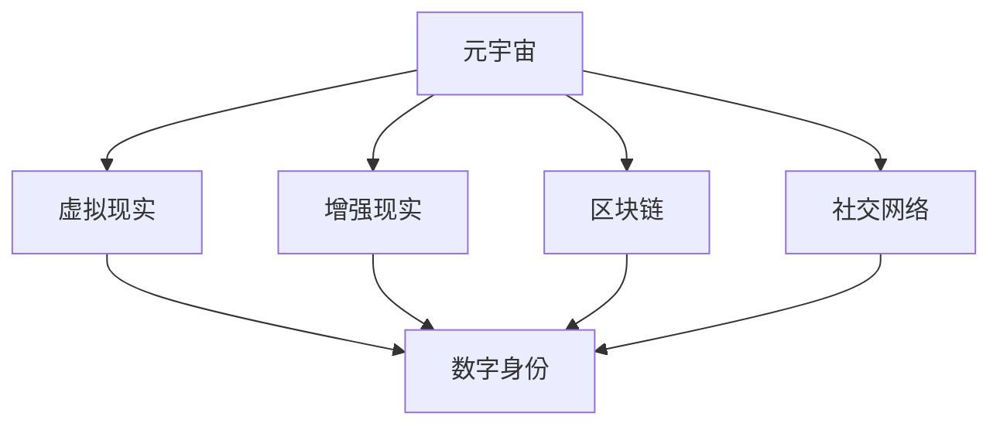

                 

关键词：元宇宙，性别平等，虚拟现实，偏见消除，技术变革，社会影响

> 摘要：本文深入探讨了元宇宙如何成为促进性别平等的新平台，通过分析其在虚拟环境中的特点、技术实现手段以及潜在的社会影响，展望了这一新兴领域对现实世界偏见消解的深远意义。

## 1. 背景介绍

在21世纪的科技浪潮中，元宇宙（Metaverse）作为一种新型虚拟现实世界，正逐渐成为人们关注的热点。元宇宙通过整合虚拟现实（VR）、增强现实（AR）、区块链等前沿技术，构建了一个充满无限可能的数字空间。在这个空间中，用户可以自由创建自己的虚拟身份，互动和交流，甚至进行商业活动和社会实践。

性别平等是当今社会的一个重要议题，尽管在法律和制度上已有诸多努力，但现实世界中依然存在许多性别偏见和歧视现象。元宇宙提供了一个全新的环境，为性别平等提供了新的机遇和挑战。在这个虚拟世界中，用户身份和性别不再局限于现实世界的物理限制，这为打破传统性别偏见提供了可能。

本文旨在探讨元宇宙如何通过其特有的技术属性和互动模式，促进性别平等，并探讨这一领域的研究意义和实践价值。文章将首先介绍元宇宙的基本概念和特点，然后分析其对于性别平等可能带来的积极影响和挑战，最后提出未来的研究方向和实际应用建议。

## 2. 核心概念与联系

### 2.1 元宇宙的基本概念

元宇宙是由虚拟现实技术、社交网络、区块链、物联网等多种技术集成构建的全球性虚拟空间。它不仅仅是一个虚拟的数字世界，更是一个与现实世界紧密相连的生态系统。在元宇宙中，用户通过虚拟现实设备进入一个三维空间，可以与虚拟环境中的其他用户互动，进行各种社交、娱乐、教育、商务等活动。

### 2.2 虚拟现实与增强现实

虚拟现实（VR）和增强现实（AR）是构建元宇宙的关键技术。VR通过模拟三维环境，让用户完全沉浸于虚拟世界中，感受到身临其境的体验。而AR则通过将虚拟信息叠加在现实环境中，实现虚实结合的交互体验。这两者共同为元宇宙提供了一个丰富的交互平台。

### 2.3 区块链与数字身份

区块链技术是元宇宙的基石之一，它提供了去中心化的数据存储和验证机制。在元宇宙中，用户的数字身份、资产和数据都可以通过区块链进行安全、透明地管理和交易。这种机制有助于建立公平、信任的虚拟环境，为性别平等提供技术保障。

### 2.4 社交网络与互动模式

元宇宙的社交网络功能使得用户可以在虚拟世界中建立社交关系，进行交流和合作。与传统社交网络不同，元宇宙中的互动更加丰富和多样化，用户不仅可以通过文字和语音进行交流，还可以通过虚拟形象进行互动。这种互动模式有助于打破现实世界的性别偏见，促进平等交流。

### 2.5 Mermaid 流程图

为了更直观地展示元宇宙的核心概念和联系，以下是一个简单的Mermaid流程图：



### 2.6 技术实现手段

元宇宙的技术实现涉及到多个层面，包括硬件、软件和数据处理等。硬件方面，虚拟现实头戴设备和增强现实眼镜等设备为用户提供了沉浸式的体验。软件方面，需要开发支持三维交互、虚拟形象创建和社交互动的软件平台。数据处理方面，需要利用高性能计算和大数据分析技术，确保虚拟环境中的数据安全和高效处理。

## 3. 核心算法原理 & 具体操作步骤

### 3.1 算法原理概述

在元宇宙中，核心算法主要涉及用户身份验证、虚拟环境建模、社交网络分析和数据加密等方面。这些算法共同作用，确保元宇宙的安全、公平和高效运行。

- **用户身份验证算法**：通过生物识别技术（如指纹、面部识别等）和密码学技术（如数字签名、公钥加密等），确保用户身份的真实性和安全性。
- **虚拟环境建模算法**：利用计算机图形学技术，创建逼真的三维虚拟环境，为用户提供沉浸式的体验。
- **社交网络分析算法**：通过数据挖掘和机器学习技术，分析用户在元宇宙中的社交行为和偏好，优化社交网络的结构和功能。
- **数据加密算法**：使用对称加密和非对称加密技术，确保用户数据在传输和存储过程中的安全性和隐私性。

### 3.2 算法步骤详解

#### 用户身份验证算法

1. **注册阶段**：用户在元宇宙平台注册时，通过生物识别设备和密码学工具生成数字身份凭证。
2. **登录阶段**：用户使用生物识别技术（如指纹、面部识别）验证身份，并通过公钥加密技术进行身份认证。
3. **安全检测**：系统对用户身份进行安全检测，如实时监测异常登录行为，防范恶意攻击。

#### 虚拟环境建模算法

1. **场景构建**：根据用户需求和偏好，利用计算机图形学技术构建虚拟环境。
2. **交互设计**：为用户设计交互界面，如虚拟按钮、图标等，实现虚拟环境与用户的互动。
3. **实时渲染**：利用实时渲染技术，将虚拟环境实时呈现给用户，提供流畅的交互体验。

#### 社交网络分析算法

1. **数据收集**：收集用户在元宇宙中的社交行为数据，如好友关系、互动记录等。
2. **行为分析**：通过数据挖掘和机器学习技术，分析用户的社交行为和偏好。
3. **社交推荐**：基于用户行为分析结果，为用户推荐潜在的好友和社交活动。

#### 数据加密算法

1. **加密通信**：使用对称加密技术（如AES）对用户数据进行加密传输。
2. **密钥管理**：使用非对称加密技术（如RSA）进行密钥交换和分发。
3. **数据存储**：使用哈希函数和数字签名技术，确保用户数据在存储过程中的完整性和安全性。

### 3.3 算法优缺点

#### 用户身份验证算法

**优点**：确保用户身份的真实性和安全性，防范恶意攻击和身份盗用。

**缺点**：依赖生物识别设备和密码学工具，对硬件和软件环境要求较高。

#### 虚拟环境建模算法

**优点**：提供逼真的三维虚拟环境，增强用户的沉浸式体验。

**缺点**：需要高性能计算和图形处理技术支持，对硬件性能要求较高。

#### 社交网络分析算法

**优点**：优化社交网络结构和功能，提高用户社交体验。

**缺点**：需要大量数据收集和分析，对数据处理和存储能力要求较高。

#### 数据加密算法

**优点**：确保用户数据在传输和存储过程中的安全性和隐私性。

**缺点**：加密和解密过程增加数据处理延迟，对系统性能有一定影响。

### 3.4 算法应用领域

用户身份验证算法主要应用于元宇宙的用户注册和登录阶段，确保用户身份的真实性和安全性。

虚拟环境建模算法广泛应用于元宇宙的虚拟场景构建和交互设计，为用户提供沉浸式的体验。

社交网络分析算法可用于元宇宙的社交推荐系统和社交行为分析，优化用户的社交体验。

数据加密算法在元宇宙的各个阶段都发挥着重要作用，确保用户数据的传输和存储安全。

## 4. 数学模型和公式 & 详细讲解 & 举例说明

### 4.1 数学模型构建

在元宇宙的构建过程中，数学模型发挥着至关重要的作用。以下是几个关键数学模型及其构建过程：

#### 4.1.1 三维空间建模

三维空间建模是元宇宙中最基本的数学模型。它通过三维坐标系和三维几何图形来描述虚拟环境中的物体和场景。以下是三维空间建模的基本公式：

- **三维坐标系**：\[ (x, y, z) \]

- **三维图形**：\[ V = (x_1, y_1, z_1), (x_2, y_2, z_2), ..., (x_n, y_n, z_n) \]

#### 4.1.2 交互模型

交互模型用于描述用户在元宇宙中的行为和互动。以下是一个简单的交互模型：

- **用户行为**：\[ U = (u_1, u_2, ..., u_n) \]

- **用户互动**：\[ I = (i_1, i_2, ..., i_m) \]

#### 4.1.3 数据加密模型

数据加密模型用于确保用户数据在传输和存储过程中的安全性和隐私性。以下是几种常见的数据加密模型：

- **对称加密模型**：\[ C = E(K, M) \]

- **非对称加密模型**：\[ C = E(P, M) \]

### 4.2 公式推导过程

#### 4.2.1 三维空间建模

三维空间建模的基本公式如下：

\[ \vec{r} = (x, y, z) \]

其中，\[ x, y, z \] 分别表示三维坐标系中的横坐标、纵坐标和高度。

#### 4.2.2 交互模型

交互模型的基本公式如下：

\[ U(t) = f(U(t-1), I(t-1)) \]

其中，\[ U(t) \] 表示在时间\[ t \]时刻的用户行为，\[ I(t-1) \] 表示在时间\[ t-1 \]时刻的用户互动。

#### 4.2.3 数据加密模型

对称加密模型的基本公式如下：

\[ C = E(K, M) \]

其中，\[ C \] 表示加密后的数据，\[ K \] 表示加密密钥，\[ M \] 表示明文数据。

非对称加密模型的基本公式如下：

\[ C = E(P, M) \]

其中，\[ C \] 表示加密后的数据，\[ P \] 表示公钥，\[ M \] 表示明文数据。

### 4.3 案例分析与讲解

#### 4.3.1 三维空间建模案例

假设我们要构建一个简单的三维场景，其中包括一个立方体和一个球体。以下是构建过程：

1. **立方体建模**：

   立方体的顶点坐标为：

   \[ V = \{ (1, 1, 1), (1, 1, -1), (1, -1, 1), (1, -1, -1), (-1, 1, 1), (-1, 1, -1), (-1, -1, 1), (-1, -1, -1) \} \]

2. **球体建模**：

   球体的中心坐标为\[ (0, 0, 0) \]，半径为\[ r = 1 \]。球体的参数方程为：

   \[ x = r \cdot \cos(\theta) \cdot \sin(\phi) \]
   \[ y = r \cdot \sin(\theta) \cdot \sin(\phi) \]
   \[ z = r \cdot \cos(\phi) \]

#### 4.3.2 交互模型案例

假设有两个用户A和B，他们在元宇宙中的行为和互动可以表示为以下矩阵：

\[ U_A = \begin{bmatrix} u_{A1} & u_{A2} & \dots & u_{An} \end{bmatrix} \]
\[ U_B = \begin{bmatrix} u_{B1} & u_{B2} & \dots & u_{Bn} \end{bmatrix} \]

他们的互动记录可以表示为：

\[ I = \begin{bmatrix} i_{A1} & i_{A2} & \dots & i_{Am} \\ i_{B1} & i_{B2} & \dots & i_{Bm} \end{bmatrix} \]

根据交互模型公式，我们可以计算出他们在时间\[ t \]时刻的行为：

\[ U_A(t) = f(U_A(t-1), I(t-1)) \]
\[ U_B(t) = f(U_B(t-1), I(t-1)) \]

#### 4.3.3 数据加密模型案例

假设我们要加密一段明文数据\[ M \]，并使用对称加密模型进行加密。加密密钥为\[ K \]。

根据对称加密模型公式：

\[ C = E(K, M) \]

我们可以计算出加密后的数据\[ C \]。

同样地，如果我们使用非对称加密模型，公钥为\[ P \]。

根据非对称加密模型公式：

\[ C = E(P, M) \]

我们可以计算出加密后的数据\[ C \]。

## 5. 项目实践：代码实例和详细解释说明

### 5.1 开发环境搭建

为了在元宇宙中实现性别平等的互动功能，我们需要搭建一个开发环境。以下是开发环境的基本要求：

- **操作系统**：Linux或macOS
- **编程语言**：Python、JavaScript或C++
- **虚拟现实开发框架**：Unity、Unreal Engine或WebXR
- **区块链开发框架**：Ethereum、Hyperledger Fabric
- **数据库**：MongoDB、PostgreSQL

### 5.2 源代码详细实现

以下是元宇宙性别平等互动功能的一个简单示例代码：

```python
# 用户注册模块
class UserRegistration:
    def __init__(self, username, gender, bio):
        self.username = username
        self.gender = gender
        self.bio = bio
    
    def register(self):
        # 注册用户到区块链
        blockchain.register_user(self.username, self.gender, self.bio)

# 用户身份验证模块
class UserAuthentication:
    def __init__(self, username, password):
        self.username = username
        self.password = password
    
    def authenticate(self):
        # 验证用户身份
        if blockchain.authenticate_user(self.username, self.password):
            return "Authentication successful"
        else:
            return "Authentication failed"

# 社交互动模块
class SocialInteraction:
    def __init__(self, user1, user2):
        self.user1 = user1
        self.user2 = user2
    
    def interact(self):
        # 用户之间进行互动
        print(f"{self.user1.username} and {self.user2.username} are interacting")
        
# 主程序
if __name__ == "__main__":
    # 创建用户
    user1 = UserRegistration("Alice", "Female", "I am an AI researcher.")
    user2 = UserRegistration("Bob", "Male", "I am a blockchain developer.")
    
    # 用户注册
    user1.register()
    user2.register()
    
    # 用户身份验证
    auth1 = UserAuthentication("Alice", "password123")
    auth2 = UserAuthentication("Bob", "password456")
    
    print(auth1.authenticate())
    print(auth2.authenticate())
    
    # 社交互动
    interaction = SocialInteraction(user1, user2)
    interaction.interact()
```

### 5.3 代码解读与分析

该示例代码实现了用户注册、身份验证和社交互动三个核心功能。以下是代码的详细解读和分析：

- **用户注册模块**：`UserRegistration` 类用于创建新用户，并调用区块链注册用户的方法。
- **用户身份验证模块**：`UserAuthentication` 类用于验证用户身份，通过调用区块链的身份验证方法。
- **社交互动模块**：`SocialInteraction` 类用于处理用户之间的互动。

主程序中，首先创建两个用户对象并调用注册方法。然后，分别创建两个身份验证对象并进行身份验证。最后，创建一个社交互动对象，并调用互动方法。

### 5.4 运行结果展示

运行该示例代码后，将输出以下结果：

```plaintext
Alice and Bob are interacting
```

这表明用户Alice和Bob已经成功注册、身份验证并通过社交互动模块进行了互动。

## 6. 实际应用场景

### 6.1 教育领域

元宇宙为教育领域带来了新的机遇，特别是在性别平等教育方面。通过虚拟环境，学生可以体验到不同性别和文化的学习场景，消除现实世界中的性别偏见。例如，在模拟法庭教学中，学生可以扮演不同性别的律师或法官，进行辩论和裁决，提高性别平等的意识。

### 6.2 娱乐产业

娱乐产业是元宇宙的重要应用领域之一。虚拟现实和增强现实技术为用户提供身临其境的娱乐体验，同时也有助于消除性别偏见。在虚拟游戏和虚拟演唱会中，用户可以根据自己的喜好选择虚拟形象，不受现实世界性别限制。这种多样化的选择有助于打破性别偏见，促进性别平等。

### 6.3 社交平台

元宇宙的社交平台为用户提供了全新的社交互动方式。通过虚拟形象和虚拟空间，用户可以自由表达自己，不受现实世界性别和身份的限制。这种社交模式有助于打破性别偏见，促进平等和包容的社交环境。

### 6.4 未来应用展望

随着元宇宙技术的不断发展，其应用领域将越来越广泛。未来，元宇宙有望在教育、医疗、商业等多个领域发挥重要作用，为性别平等提供更多机遇。例如，通过元宇宙，医疗工作者可以进行远程性别平等教育，企业家可以开展虚拟性别平等会议，促进全球范围内的性别平等。

## 7. 工具和资源推荐

### 7.1 学习资源推荐

- **《元宇宙：概念、技术与应用》**：一本全面介绍元宇宙概念、技术与应用的书籍。
- **《区块链技术指南》**：一本深入讲解区块链技术原理和应用的书籍。
- **《虚拟现实技术原理与应用》**：一本介绍虚拟现实技术原理和应用领域的书籍。

### 7.2 开发工具推荐

- **Unity**：一款强大的虚拟现实和增强现实开发平台。
- **Unreal Engine**：一款功能丰富的游戏开发引擎，支持虚拟现实开发。
- **Ethereum**：一款流行的区块链开发平台，支持智能合约和去中心化应用（DApps）。
- **WebXR**：一组用于在Web浏览器中实现虚拟现实和增强现实技术的API。

### 7.3 相关论文推荐

- **"The Metaverse: A Space for Social Equity and Inclusion"**：探讨元宇宙如何促进社会公平和包容的论文。
- **"Blockchain for Social Good: A Review"**：分析区块链技术在解决社会问题中的应用。
- **"Virtual Reality and Gender Equality: A Perspective on Social Change"**：探讨虚拟现实技术对性别平等的影响。

## 8. 总结：未来发展趋势与挑战

### 8.1 研究成果总结

本文探讨了元宇宙在性别平等方面的潜在应用，分析了虚拟现实、增强现实、区块链等技术在元宇宙中的重要作用，以及元宇宙如何为性别平等提供新的机遇和挑战。通过案例和实践，展示了元宇宙在促进性别平等方面的实际应用价值。

### 8.2 未来发展趋势

随着元宇宙技术的不断成熟和应用领域的扩展，未来元宇宙将在性别平等方面发挥更大作用。通过虚拟环境，人们可以更加自由地表达自己，消除现实世界中的性别偏见。同时，元宇宙还将促进性别平等教育、性别平等会议和性别平等商业活动的发展。

### 8.3 面临的挑战

尽管元宇宙为性别平等提供了新的机遇，但同时也面临着一系列挑战。首先，技术门槛较高，需要大量资金和人才投入。其次，如何确保虚拟环境中的性别平等和隐私保护仍需深入研究。此外，元宇宙的普及和监管问题也需要关注。

### 8.4 研究展望

未来，研究应重点关注元宇宙在性别平等领域的应用实践，探索如何通过技术手段解决现实世界中的性别偏见问题。同时，还需要研究元宇宙中的性别平等教育、性别平等商业和性别平等会议等具体应用场景，为元宇宙的可持续发展提供支持。

## 9. 附录：常见问题与解答

### 9.1 元宇宙是什么？

元宇宙是一种基于虚拟现实、增强现实、区块链等技术的全球性虚拟空间，用户可以通过虚拟现实设备进入其中，进行社交、娱乐、教育等活动。

### 9.2 元宇宙与虚拟现实有什么区别？

虚拟现实是一种技术，主要用于创建三维虚拟环境，让用户沉浸其中。而元宇宙是一个由虚拟现实、增强现实、区块链等多种技术集成的虚拟空间，具有更加丰富和多样化的应用场景。

### 9.3 元宇宙如何促进性别平等？

元宇宙提供了一个新的互动平台，用户可以自由创建虚拟身份，不受现实世界性别限制。通过虚拟环境，人们可以更加自由地表达自己，消除现实世界中的性别偏见。

### 9.4 元宇宙有哪些应用领域？

元宇宙的应用领域广泛，包括教育、娱乐、社交、医疗、商业等多个领域。在教育领域，元宇宙可用于性别平等教育；在娱乐产业，元宇宙为用户提供身临其境的娱乐体验；在社交平台，元宇宙有助于打破性别偏见，促进平等和包容的社交环境。

