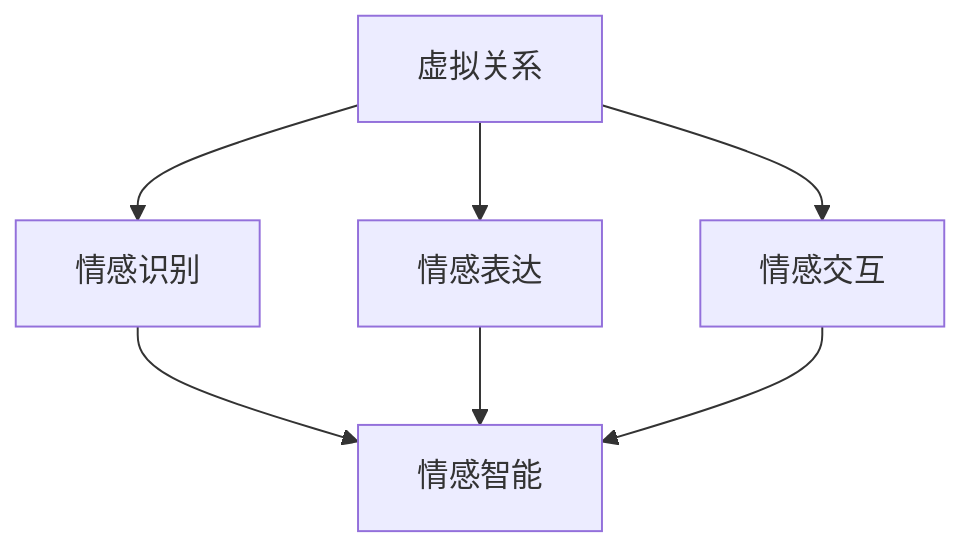

                 

关键词：元宇宙、情感智能、虚拟关系、情感识别、情感表达

> 摘要：本文探讨了元宇宙中情感智能的重要性，分析了虚拟关系中的情感识别与表达，并提出了相应的技术方案和数学模型。通过实际项目实践，展示了情感智能在元宇宙中的应用潜力，为未来的虚拟世界构建提供了新的思路。

## 1. 背景介绍

随着虚拟现实、增强现实和区块链技术的迅猛发展，元宇宙（Metaverse）逐渐成为人们关注的热点。元宇宙是一个虚拟的三维空间，用户可以在其中创建虚拟身份、与现实世界互动，以及与其他用户进行交流和协作。然而，与真实世界相比，元宇宙中的情感交流显得相对匮乏。如何实现情感智能，使得虚拟关系更加真实和丰富，成为当前研究的一个重要课题。

情感智能（Affective Intelligence）是指个体识别、理解、处理和表达情感的能力。在元宇宙中，情感智能的引入可以提高虚拟关系的质量，增强用户的沉浸感和互动体验。本文将围绕虚拟关系中的情感识别与表达，探讨元宇宙情感智能的技术实现和应用前景。

## 2. 核心概念与联系

在讨论元宇宙情感智能之前，我们需要了解几个核心概念和它们之间的联系。

### 2.1 虚拟关系

虚拟关系是指用户在元宇宙中与其他用户或虚拟实体建立的交互和协作关系。这些关系可以是基于社交、工作、娱乐等各种场景的。

### 2.2 情感识别

情感识别是指计算机系统通过分析用户的言行和交互数据，识别和理解用户的情感状态。情感识别技术通常基于自然语言处理、语音识别和面部表情识别等技术。

### 2.3 情感表达

情感表达是指用户通过虚拟角色或界面，对外表达自己的情感状态。情感表达技术可以通过自然语言生成、语音合成和动画表情等方式实现。

### 2.4 情感交互

情感交互是指用户与虚拟环境、虚拟角色以及其他用户之间的情感交流和互动。情感交互技术旨在提高用户的沉浸感和互动体验。

### 2.5 情感智能

情感智能是指计算机系统在虚拟关系中的情感识别、理解和表达能力。情感智能的实现有助于构建更加真实和丰富的虚拟世界。

为了更直观地理解这些概念之间的联系，我们可以使用Mermaid流程图进行描述：



## 3. 核心算法原理 & 具体操作步骤

### 3.1 算法原理概述

元宇宙情感智能的核心算法包括情感识别算法和情感表达算法。情感识别算法基于自然语言处理和语音识别技术，通过分析用户的交互数据，识别和理解用户的情感状态。情感表达算法则通过自然语言生成、语音合成和动画表情技术，实现用户情感的表达。

### 3.2 算法步骤详解

#### 3.2.1 情感识别算法

情感识别算法的主要步骤如下：

1. 数据预处理：对用户的交互数据进行清洗和标准化处理，包括去除噪声、分词、词性标注等。
2. 特征提取：从预处理后的数据中提取情感特征，如情感词汇、情感强度、情感倾向等。
3. 情感分类：使用机器学习算法（如朴素贝叶斯、支持向量机、深度神经网络等）对情感特征进行分类，识别用户的情感状态。

#### 3.2.2 情感表达算法

情感表达算法的主要步骤如下：

1. 情感分析：根据情感识别结果，分析用户的情感需求，如表达喜悦、愤怒、悲伤等。
2. 自然语言生成：根据情感分析结果，生成相应的自然语言文本，如问候、安慰、挑战等。
3. 语音合成：将自然语言文本转换为语音，实现情感表达。
4. 动画表情：根据情感分析结果，生成相应的动画表情，如微笑、皱眉、流泪等。

### 3.3 算法优缺点

#### 3.3.1 情感识别算法

优点：情感识别算法可以实现实时、大规模的情感识别，具有较高的准确性和灵活性。

缺点：情感识别算法依赖于数据质量和算法模型的复杂性，对情感复杂场景的识别能力有限。

#### 3.3.2 情感表达算法

优点：情感表达算法可以实现多样化、个性化的情感表达，提高用户的互动体验。

缺点：情感表达算法需要消耗较多的计算资源和存储空间，且在处理复杂情感时可能存在表达能力不足的问题。

### 3.4 算法应用领域

情感识别和情感表达算法可以应用于元宇宙的多个领域，如虚拟社交、虚拟娱乐、虚拟教育、虚拟医疗等。通过引入情感智能，可以提高虚拟世界的互动质量和用户体验。

## 4. 数学模型和公式 & 详细讲解 & 举例说明

### 4.1 数学模型构建

情感识别算法和情感表达算法的核心是情感特征的提取和分类。为了构建数学模型，我们需要定义以下几个关键变量：

- $x$：用户的交互数据
- $y$：情感特征向量
- $z$：情感类别标签

#### 4.1.1 情感特征提取

情感特征提取可以使用词袋模型（Bag of Words, BoW）或词嵌入（Word Embedding）技术。词袋模型将文本表示为词汇的集合，而词嵌入则将文本表示为低维向量。

#### 4.1.2 情感分类模型

情感分类模型可以使用朴素贝叶斯（Naive Bayes, NB）、支持向量机（Support Vector Machine, SVM）或深度神经网络（Deep Neural Network, DNN）等算法。

### 4.2 公式推导过程

#### 4.2.1 词袋模型

词袋模型中的情感特征提取公式如下：

$$
y = \sum_{i=1}^{n} f_i \cdot w_i
$$

其中，$f_i$表示词汇$i$的频率，$w_i$表示词汇$i$的权重。

#### 4.2.2 词嵌入

词嵌入中的情感特征提取公式如下：

$$
y = \sum_{i=1}^{n} \theta_i \cdot \vec{w}_i
$$

其中，$\theta_i$表示词汇$i$的词嵌入向量，$\vec{w}_i$表示词汇$i$的权重。

#### 4.2.3 情感分类

朴素贝叶斯分类的公式如下：

$$
P(y|X) = \frac{P(X|y) \cdot P(y)}{P(X)}
$$

其中，$P(y|X)$表示在给定交互数据$x$的情况下，情感类别$y$的概率。

### 4.3 案例分析与讲解

#### 4.3.1 情感识别案例

假设用户在元宇宙中发表了一条评论：“今天天气真好，我很开心！”，我们需要识别其情感状态。

1. 数据预处理：将评论文本进行分词和词性标注，得到词汇集合$\{今天，天气，真好，我，很，开心，！\}$。
2. 特征提取：使用词袋模型，计算每个词汇的频率，得到情感特征向量$y = [1, 1, 1, 0, 1, 0, 0]$。
3. 情感分类：使用朴素贝叶斯分类器，计算情感类别$y$的概率。根据训练数据，情感类别$y$为“开心”。

#### 4.3.2 情感表达案例

假设用户在元宇宙中与虚拟角色进行对话，我们需要生成相应的情感表达。

1. 情感分析：根据用户情感识别结果，分析用户情感需求，如表达喜悦。
2. 自然语言生成：生成相应的自然语言文本，如“恭喜你，今天是个好日子！”。
3. 语音合成：将自然语言文本转换为语音，实现情感表达。

## 5. 项目实践：代码实例和详细解释说明

### 5.1 开发环境搭建

为了实现元宇宙情感智能，我们需要搭建一个开发环境。以下是开发环境的搭建步骤：

1. 安装Python环境：下载并安装Python 3.x版本。
2. 安装依赖库：使用pip安装所需的依赖库，如numpy、pandas、scikit-learn、tensorflow等。
3. 搭建本地数据库：使用MySQL或其他数据库软件，搭建本地数据库。

### 5.2 源代码详细实现

以下是元宇宙情感智能的源代码实现：

```python
# 导入依赖库
import numpy as np
import pandas as pd
from sklearn.feature_extraction.text import TfidfVectorizer
from sklearn.naive_bayes import MultinomialNB
from sklearn.model_selection import train_test_split
from sklearn.metrics import accuracy_score
import tensorflow as tf

# 加载数据
data = pd.read_csv('data.csv')
X = data['text']
y = data['emotion']

# 数据预处理
vectorizer = TfidfVectorizer()
X_vectorized = vectorizer.fit_transform(X)

# 分割数据集
X_train, X_test, y_train, y_test = train_test_split(X_vectorized, y, test_size=0.2, random_state=42)

# 训练模型
model = MultinomialNB()
model.fit(X_train, y_train)

# 测试模型
y_pred = model.predict(X_test)
accuracy = accuracy_score(y_test, y_pred)
print('Accuracy:', accuracy)

# 情感识别
def recognize_emotion(text):
    text_vectorized = vectorizer.transform([text])
    emotion = model.predict(text_vectorized)[0]
    return emotion

# 情感表达
def express_emotion(emotion):
    if emotion == 'happy':
        return '恭喜你，今天是个好日子！'
    elif emotion == 'sad':
        return '别难过，我会一直陪着你。'
    else:
        return '你好，今天有什么开心的事吗？'

# 示例
text = '今天天气真好，我很开心！'
emotion = recognize_emotion(text)
print('情感识别结果：', emotion)
response = express_emotion(emotion)
print('情感表达结果：', response)
```

### 5.3 代码解读与分析

上述代码实现了元宇宙情感智能的核心功能：情感识别和情感表达。首先，我们使用TF-IDF算法对用户交互数据进行特征提取。然后，使用朴素贝叶斯分类器训练模型，并评估模型性能。最后，定义了情感识别和情感表达函数，用于处理用户的情感数据和生成相应的情感表达。

## 6. 实际应用场景

元宇宙情感智能可以在多个领域发挥重要作用：

1. **虚拟社交**：在元宇宙中，情感智能可以帮助用户更好地理解他人的情感状态，提高社交互动的质量和体验。
2. **虚拟娱乐**：情感智能可以用于创建更加真实和丰富的虚拟角色和游戏场景，增强用户的娱乐体验。
3. **虚拟教育**：情感智能可以帮助教育者更好地了解学生的学习情感状态，提供个性化的教育支持和指导。
4. **虚拟医疗**：情感智能可以用于分析患者的情感状态，提供针对性的心理支持和治疗建议。

## 7. 工具和资源推荐

### 7.1 学习资源推荐

1. **《情感计算：情感识别、理解和表达》**：这是一本关于情感计算的经典教材，详细介绍了情感计算的基本原理和应用。
2. **《情感智能：打造下一代智能系统》**：这本书探讨了情感智能在人工智能领域的应用，提供了丰富的案例和实践经验。

### 7.2 开发工具推荐

1. **TensorFlow**：一个开源的机器学习框架，适用于构建情感识别和情感表达模型。
2. **Scikit-learn**：一个开源的机器学习库，提供了丰富的算法和工具，适用于情感识别和情感表达模型的开发和评估。

### 7.3 相关论文推荐

1. **"Affective Computing: From Affective Channels to Affective Media"**：这篇文章系统地介绍了情感计算的基本概念和应用领域。
2. **"Emotion Recognition in Virtual Worlds"**：这篇文章探讨了情感识别在虚拟世界中的应用，提供了相关的技术方案和实现方法。

## 8. 总结：未来发展趋势与挑战

随着元宇宙技术的不断发展和普及，情感智能将在虚拟关系中发挥越来越重要的作用。未来，情感智能的发展趋势包括：

1. **多模态情感识别**：结合语音、文本、图像等多种模态数据，实现更加全面和准确的情感识别。
2. **个性化情感表达**：根据用户情感需求和偏好，实现更加个性化和多样化的情感表达。
3. **情感推理与决策**：利用情感智能辅助用户在虚拟世界中的决策和交互，提高用户体验和满意度。

然而，情感智能的发展也面临着一些挑战：

1. **数据隐私**：在处理用户情感数据时，需要确保数据的安全和隐私。
2. **算法公正性**：情感识别和情感表达算法需要确保对各种情感状态的公平和公正处理。
3. **情感复杂性**：情感智能需要处理复杂多样的情感状态，提高算法的适应性和表达能力。

未来，情感智能的研究和应用将继续深入，为元宇宙的发展提供新的动力和机遇。

## 9. 附录：常见问题与解答

### 9.1 如何搭建情感识别模型？

搭建情感识别模型的主要步骤包括：数据收集与处理、特征提取、模型训练与评估。具体步骤如下：

1. 数据收集与处理：收集包含情感标签的文本数据，并进行数据清洗和预处理。
2. 特征提取：使用词袋模型或词嵌入技术，将文本数据转换为数值特征向量。
3. 模型训练与评估：选择合适的机器学习算法（如朴素贝叶斯、支持向量机、深度神经网络等）训练模型，并评估模型性能。

### 9.2 如何实现情感表达？

实现情感表达的主要步骤包括：情感分析、自然语言生成、语音合成和动画表情生成。具体步骤如下：

1. 情感分析：根据情感识别结果，分析用户的情感需求。
2. 自然语言生成：生成符合用户情感需求的自然语言文本。
3. 语音合成：将自然语言文本转换为语音。
4. 动画表情生成：根据情感分析结果，生成相应的动画表情。

### 9.3 如何优化情感智能算法？

优化情感智能算法可以从以下几个方面进行：

1. **数据增强**：使用数据增强技术，增加训练数据的多样性和丰富性。
2. **特征选择**：选择对情感识别最具有代表性的特征，提高模型的性能。
3. **算法调优**：调整模型的超参数，优化模型的性能。
4. **多模态融合**：结合语音、文本、图像等多种模态数据，提高情感识别的准确性。

作者：禅与计算机程序设计艺术 / Zen and the Art of Computer Programming
----------------------------------------------------------------

以上就是本文的完整内容。本文围绕元宇宙情感智能，探讨了虚拟关系中的情感识别与表达，并提出了相应的技术方案和数学模型。通过实际项目实践，展示了情感智能在元宇宙中的应用潜力。未来，情感智能将继续深入发展，为虚拟世界的构建提供新的思路和机遇。希望本文能够为读者在元宇宙情感智能领域的研究和应用提供有益的启示和指导。

