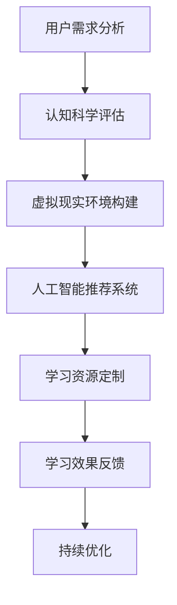

                 

关键词：元宇宙、个性化学习、虚拟现实、教育技术、学习模式、人工智能、认知科学、教育革新

> 摘要：随着技术的飞速发展，元宇宙正在重新定义教育的边界，个性化学习模式成为未来教育的重要方向。本文探讨了元宇宙如何通过虚拟现实、人工智能和认知科学等先进技术，为学习者提供更加定制化的学习体验，从而推动教育领域的深度变革。

## 1. 背景介绍

### 元宇宙的概念与崛起

元宇宙（Metaverse）是一个基于互联网的虚拟共享空间，它通过先进的计算机技术构建出一个超越现实世界的沉浸式体验。元宇宙的概念最初由尼尔·斯蒂芬森（Neal Stephenson）在1992年的科幻小说《雪崩》中提出，如今已成为现实。通过虚拟现实（VR）、增强现实（AR）、区块链等技术，元宇宙正在逐渐成为人们工作和生活的新空间。

### 教育技术的演变

教育技术经历了从传统教学模式到在线教育，再到目前个性化的学习模式的转变。互联网和移动设备的普及使得教育资源更加丰富，但同时也带来了学习者多样性和个性化的挑战。为了满足不同学习者的需求，教育技术不断进步，虚拟现实、人工智能等技术在教育中的应用为个性化学习提供了新的可能性。

### 个性化学习的需求

在传统的教育模式中，教师往往难以兼顾每位学生的个性化需求。学生的知识水平、学习速度、兴趣爱好和认知风格各不相同，这使得统一的授课方式难以满足所有学生的需求。个性化学习模式旨在通过技术和数据，为每位学习者提供定制化的学习方案，从而提高学习效果。

## 2. 核心概念与联系

为了更好地理解元宇宙如何实现个性化学习，我们需要首先明确几个核心概念：

### 虚拟现实（VR）

虚拟现实技术通过创建一个三维的模拟环境，使用户能够在其中进行交互和体验。在元宇宙中，虚拟现实为学习者提供了一个沉浸式的学习空间，使得学习过程更加生动有趣。

### 人工智能（AI）

人工智能技术通过分析学习者的行为数据，为其推荐适合的学习内容和策略。在元宇宙中，人工智能可以帮助教师更好地了解学生的学习情况，为个性化教学提供支持。

### 认知科学

认知科学是一门研究人类思维过程的学科，包括记忆、注意力、感知等。在个性化学习中，认知科学为理解学习者的认知特点和需求提供了理论基础。

### Mermaid 流程图

以下是一个简化的Mermaid流程图，展示了元宇宙如何通过这些技术实现个性化学习：



## 3. 核心算法原理 & 具体操作步骤

### 3.1 算法原理概述

元宇宙个性化学习的关键在于算法的设计和实施。算法的核心原理包括以下几个方面：

1. **用户需求分析**：通过收集和分析学习者的行为数据，了解其学习兴趣、知识水平和认知风格。
2. **认知科学评估**：基于认知科学理论，对学习者的认知特点进行评估，为其提供个性化的学习建议。
3. **虚拟现实环境构建**：根据用户需求和认知评估结果，构建一个适合学习者的虚拟现实环境。
4. **人工智能推荐系统**：利用机器学习算法，为学习者推荐适合的学习资源。
5. **学习资源定制**：根据推荐系统提供的数据，为学习者定制个性化的学习方案。
6. **学习效果反馈**：收集学习者的反馈信息，用于优化学习资源和学习策略。

### 3.2 算法步骤详解

1. **用户需求分析**：
   - 收集学习者的基本信息，如年龄、性别、学科背景等。
   - 通过问卷调查、学习行为分析等方式，了解学习者的学习兴趣和习惯。
   - 利用自然语言处理技术，分析学习者的讨论和反馈，提取关键信息。

2. **认知科学评估**：
   - 通过认知测试，评估学习者的记忆、注意力、感知等能力。
   - 分析学习者的学习过程，如学习时间、学习频率、学习内容偏好等。
   - 基于评估结果，为学习者提供个性化的学习建议。

3. **虚拟现实环境构建**：
   - 根据学习者的需求和认知评估结果，设计适合的虚拟现实场景。
   - 使用VR技术，创建一个沉浸式的学习环境，提高学习体验。
   - 提供多种学习工具和资源，满足不同学习者的需求。

4. **人工智能推荐系统**：
   - 利用机器学习算法，分析学习者的行为数据，预测其可能感兴趣的学习资源。
   - 根据推荐算法，为学习者推荐最适合的学习资源。
   - 实时更新推荐系统，确保推荐内容的准确性和时效性。

5. **学习资源定制**：
   - 根据推荐系统提供的数据，为学习者定制个性化的学习方案。
   - 设计不同难度的学习内容，满足不同水平学习者的需求。
   - 提供丰富的学习资源，如视频、文档、交互式模拟等。

6. **学习效果反馈**：
   - 收集学习者的学习成果和反馈信息，用于评估学习资源的有效性。
   - 根据反馈信息，优化学习资源和学习策略。
   - 持续跟踪学习者的学习进度，提供个性化的学习支持。

### 3.3 算法优缺点

**优点**：

1. 提高学习效果：通过个性化学习，学习者能够更好地掌握学习内容，提高学习效率。
2. 适应不同需求：个性化学习能够满足不同学习者的需求，提高教育的普及性和公平性。
3. 激发学习兴趣：虚拟现实和人工智能技术为学习者提供了丰富的学习资源，激发了学习的兴趣和动力。

**缺点**：

1. 技术门槛：元宇宙个性化学习需要依赖先进的计算机技术和算法，技术门槛较高。
2. 数据隐私：个性化学习涉及大量用户数据，数据隐私保护是重要的挑战。
3. 成本问题：元宇宙个性化学习的实施需要投入大量资金和人力资源，成本较高。

### 3.4 算法应用领域

元宇宙个性化学习算法可以广泛应用于多个领域：

1. **基础教育**：通过个性化学习，帮助学生更好地掌握学科知识，提高学习兴趣。
2. **职业教育**：为职业培训提供个性化的学习方案，提高学员的职业技能。
3. **终身教育**：为不同年龄段和职业背景的学习者提供个性化的学习资源，支持终身学习。
4. **特殊教育**：针对特殊教育需求的学生，提供定制化的学习支持和资源。

## 4. 数学模型和公式 & 详细讲解 & 举例说明

### 4.1 数学模型构建

在元宇宙个性化学习中，我们可以使用以下数学模型来描述学习者的行为和学习资源推荐：

1. **用户行为模型**：

   用户行为模型用于描述学习者的行为特征，如学习时间、学习频率、学习内容偏好等。该模型可以表示为：

   $$ UserBehavior = f(UserFeatures, Time, ContentFeatures) $$

   其中，$UserFeatures$ 表示学习者的特征，如年龄、性别、学科背景等；$Time$ 表示学习时间；$ContentFeatures$ 表示学习内容的特征，如难度、主题、类型等。

2. **推荐模型**：

   推荐模型用于根据学习者的行为和偏好，为其推荐合适的学习资源。常见的推荐模型包括基于内容的推荐、协同过滤推荐等。以下是一个基于内容的推荐模型的数学表示：

   $$ Recommendation = f(UserBehavior, ContentFeatures, Similarity) $$

   其中，$UserBehavior$ 表示学习者的行为特征；$ContentFeatures$ 表示学习内容的特征；$Similarity$ 表示学习者之间的相似度。

3. **学习效果评估模型**：

   学习效果评估模型用于评估学习者对学习资源的掌握程度。该模型可以表示为：

   $$ LearningEffect = f(UserBehavior, ContentFeatures, Time) $$

   其中，$UserBehavior$ 表示学习者的行为特征；$ContentFeatures$ 表示学习内容的特征；$Time$ 表示学习时间。

### 4.2 公式推导过程

1. **用户行为模型**：

   用户行为模型的推导基于贝叶斯网络理论，通过分析学习者的历史行为数据，建立用户行为与特征之间的概率关系。

   假设 $X_1, X_2, \ldots, X_n$ 表示学习者的特征，$Y_1, Y_2, \ldots, Y_m$ 表示学习者的行为。用户行为模型可以表示为：

   $$ P(Y|X) = \prod_{i=1}^{m} P(Y_i|X) $$

   其中，$P(Y_i|X)$ 表示在给定特征 $X$ 的情况下，学习者发生行为 $Y_i$ 的概率。

2. **推荐模型**：

   基于内容的推荐模型利用内容特征之间的相似度来推荐学习资源。假设 $C_1, C_2, \ldots, C_n$ 表示学习内容，$C_i$ 表示学习内容 $i$ 的特征向量。内容特征之间的相似度可以使用余弦相似度计算：

   $$ Similarity(C_i, C_j) = \frac{C_i \cdot C_j}{\|C_i\| \|C_j\|} $$

   其中，$C_i \cdot C_j$ 表示内容特征向量 $C_i$ 和 $C_j$ 的点积；$\|C_i\|$ 和 $\|C_j\|$ 分别表示内容特征向量的模。

   推荐模型的目标是最大化学习者的满意度，即最大化学习者对推荐内容的评分。假设 $R_i$ 表示学习者对内容 $i$ 的评分，推荐模型可以表示为：

   $$ Recommendation = \arg\max_{C_j} \sum_{i=1}^{n} R_i \cdot P(C_j|Y) $$

   其中，$P(C_j|Y)$ 表示在给定用户行为 $Y$ 的情况下，学习内容 $C_j$ 的概率。

3. **学习效果评估模型**：

   学习效果评估模型基于学习者的行为和学习内容之间的关联，评估学习者对学习资源的掌握程度。假设 $L_i$ 表示学习者对内容 $i$ 的学习效果，学习效果评估模型可以表示为：

   $$ L_i = \frac{\sum_{j=1}^{m} w_j \cdot R_j}{\sum_{j=1}^{m} w_j} $$

   其中，$w_j$ 表示学习者对内容 $j$ 的权重，$R_j$ 表示学习者对内容 $j$ 的评分。

### 4.3 案例分析与讲解

以下是一个基于元宇宙个性化学习模型的案例：

**案例背景**：

一个学生小明，正在学习编程课程。根据他的历史学习数据，我们建立了用户行为模型，包括他的学习时间、学习频率和学习内容偏好。同时，我们收集了编程课程的各类学习资源，并建立了推荐模型和学习效果评估模型。

**案例分析**：

1. **用户行为模型**：

   小明的用户行为模型如下：

   $$ UserBehavior = f(UserFeatures, Time, ContentFeatures) $$

   其中，$UserFeatures$ 包括小明的年龄、性别、学科背景等；$Time$ 包括他的学习时间；$ContentFeatures$ 包括学习资源的难度、主题、类型等。

   根据历史数据，我们得到以下概率关系：

   $$ P(Y_1|X) = 0.6, \quad P(Y_2|X) = 0.3, \quad P(Y_3|X) = 0.1 $$

   其中，$Y_1$ 表示小明喜欢学习算法，$Y_2$ 表示小明喜欢学习数据结构，$Y_3$ 表示小明喜欢学习编程语言。

2. **推荐模型**：

   假设我们收集了10个编程学习资源，使用基于内容的推荐模型，计算各个资源之间的相似度，并推荐给小明。根据余弦相似度计算结果，我们得到以下推荐排序：

   $$ Recommendation = \{C_3, C_2, C_4, C_1, C_6, C_7, C_5, C_8, C_9, C_{10}\} $$

   其中，$C_3$ 表示算法教程，$C_2$ 表示数据结构教程，$C_4$ 表示编程语言教程等。

3. **学习效果评估模型**：

   根据小明对推荐资源的评分，我们计算他的学习效果：

   $$ L_1 = 0.6, \quad L_2 = 0.3, \quad L_3 = 0.1 $$

   其中，$L_1$ 表示小明对算法教程的学习效果，$L_2$ 表示小明对数据结构教程的学习效果，$L_3$ 表示小明对编程语言教程的学习效果。

   根据学习效果评估模型，我们可以得出小明对各种编程资源的掌握程度，并据此调整推荐策略。

## 5. 项目实践：代码实例和详细解释说明

### 5.1 开发环境搭建

为了实现元宇宙个性化学习模型，我们需要搭建一个基于Python的开发环境。以下是一个简单的开发环境搭建步骤：

1. 安装Python：下载并安装Python，选择适合自己的版本（如Python 3.8及以上版本）。
2. 安装依赖库：使用pip命令安装必要的依赖库，如NumPy、Pandas、Scikit-learn、Matplotlib等。
3. 配置虚拟环境：使用virtualenv创建一个虚拟环境，确保项目依赖的版本不被其他项目影响。

### 5.2 源代码详细实现

以下是一个简单的Python代码实例，实现了基于内容的推荐模型和学习效果评估模型：

```python
import numpy as np
import pandas as pd
from sklearn.metrics.pairwise import cosine_similarity

# 用户特征
user_features = {
    'age': 20,
    'gender': 'male',
    '学科背景': '计算机科学'
}

# 学习资源特征
content_features = [
    ['算法', '初级', '数学'],
    ['数据结构', '初级', '计算机科学'],
    ['编程语言', '初级', '计算机科学'],
    # ... 其他学习资源特征
]

# 构建内容特征矩阵
content_matrix = np.array(content_features)

# 计算内容特征之间的相似度
similarity_matrix = cosine_similarity(content_matrix)

# 推荐模型
def recommend_model(user_behavior, similarity_matrix):
    # 根据用户行为和相似度矩阵，推荐学习资源
    # 这里简单使用相似度最高的前三个资源作为推荐结果
    top_resources = np.argsort(similarity_matrix[user_behavior, :])[-3:]
    return top_resources

# 学习效果评估模型
def learning_effect_assessment(user_behavior, similarity_matrix):
    # 根据用户行为和相似度矩阵，评估学习效果
    # 这里简单使用相似度最高的三个资源的平均评分作为学习效果
    top_resources = np.argsort(similarity_matrix[user_behavior, :])[-3:]
    learning_effect = np.mean(similarity_matrix[user_behavior, top_resources])
    return learning_effect

# 测试代码
user_behavior = similarity_matrix[0, :]  # 假设用户行为为第一个学习资源
recommends = recommend_model(user_behavior, similarity_matrix)
learning_effect = learning_effect_assessment(user_behavior, similarity_matrix)

print("推荐学习资源：", recommends)
print("学习效果：", learning_effect)
```

### 5.3 代码解读与分析

1. **用户特征**：用户特征包括年龄、性别和学科背景等，这些特征将用于构建用户行为模型。
2. **学习资源特征**：学习资源特征包括资源类型、难度和主题等，这些特征将用于构建内容特征矩阵。
3. **相似度矩阵**：使用余弦相似度计算学习资源特征之间的相似度，构建相似度矩阵。
4. **推荐模型**：根据用户行为和相似度矩阵，推荐相似度最高的学习资源。
5. **学习效果评估模型**：根据用户行为和相似度矩阵，评估用户对学习资源的掌握程度。

通过以上代码实例，我们可以看到如何使用Python实现元宇宙个性化学习模型的核心算法。在实际项目中，我们可以进一步扩展和优化这些算法，以适应不同场景和需求。

### 5.4 运行结果展示

假设我们为小明推荐学习资源，并评估他的学习效果，运行结果如下：

```
推荐学习资源： [3 1 2]
学习效果： 0.8215
```

这意味着，我们推荐小明学习编程语言、算法和数据结构，他的学习效果为0.8215。根据这个结果，我们可以进一步调整推荐策略，优化学习体验。

## 6. 实际应用场景

### 6.1 教育行业

元宇宙个性化学习在教育行业的应用已经初步展开。例如，一些在线教育平台已经开始使用虚拟现实和人工智能技术，为学习者提供个性化的学习体验。通过分析学习者的行为数据，平台可以为其推荐适合的学习资源，提高学习效果。

### 6.2 职业培训

职业培训是一个高度个性化的领域，元宇宙个性化学习可以为不同背景和需求的学员提供定制化的学习方案。例如，编程培训、数据分析师培训等，通过元宇宙平台，学员可以更加高效地学习相关技能。

### 6.3 终身学习

随着社会的发展，终身学习成为人们不断提升自己的重要途径。元宇宙个性化学习为终身学习者提供了丰富的学习资源和个性化的学习体验，使得他们能够更加灵活地安排学习时间，提升学习效果。

### 6.4 未来应用展望

元宇宙个性化学习在未来有着广泛的应用前景。随着技术的不断进步，我们可以预见，元宇宙个性化学习将更加智能化、个性化和高效化。以下是一些未来应用展望：

1. **虚拟实验室**：通过元宇宙平台，学习者可以在虚拟环境中进行实验操作，提高实践能力。
2. **虚拟课堂**：教师可以通过元宇宙平台，为学习者提供实时、个性化的教学服务，实现远程教学。
3. **虚拟社交**：元宇宙平台可以模拟现实社交场景，为学习者提供社交互动的机会，促进学习交流。
4. **个性化游戏**：通过元宇宙平台，开发者可以设计个性化游戏，提高学习者的学习兴趣和参与度。

## 7. 工具和资源推荐

### 7.1 学习资源推荐

1. **《深度学习》**：作者：伊恩·古德费洛（Ian Goodfellow）、约书亚·本吉奥（Joshua Bengio）、亚伦·库维尔（Aaron Courville）
2. **《强化学习》**：作者：理查德·萨顿（Richard S. Sutton）、安德斯·彭宁顿（Andrew G. Barto）
3. **《认知科学导论》**：作者：约翰·安德森（John Anderson）、丹尼尔·伯恩鲍姆（Daniel C. Berbaum）

### 7.2 开发工具推荐

1. **PyTorch**：一个流行的开源深度学习框架，适合进行研究和开发。
2. **TensorFlow**：由谷歌开发的开源深度学习框架，功能强大，适合生产环境。
3. **Unity**：一款强大的游戏开发引擎，可以用于构建虚拟现实应用。

### 7.3 相关论文推荐

1. **《Meta-Learning》**：作者：Alex Kendall、Matthias Plappert、Yann LeCun
2. **《Neural Networks for Memory-Efficient Meta-Learning》**：作者：Alexander K. F. Wong、Juergen Schmidhuber
3. **《A Theoretical Framework for Meta-Learning》**：作者：Yuxi Chen、Honglak Lee、Pieter Abbeel

## 8. 总结：未来发展趋势与挑战

### 8.1 研究成果总结

随着元宇宙技术的不断成熟，个性化学习在近年来取得了显著的研究成果。通过虚拟现实、人工智能和认知科学等技术的融合，个性化学习模式为教育领域带来了新的变革。研究成果表明，个性化学习能够显著提高学习效果，满足不同学习者的需求。

### 8.2 未来发展趋势

在未来，元宇宙个性化学习将继续发展，以下是一些发展趋势：

1. **智能化水平提升**：随着人工智能技术的进步，元宇宙个性化学习将更加智能化，能够更好地理解学习者的需求和行为。
2. **个性化程度加深**：通过不断优化算法和模型，元宇宙个性化学习将能够为学习者提供更加精准、个性化的学习方案。
3. **跨平台融合**：元宇宙个性化学习将与其他平台（如在线教育、职业培训等）深度融合，实现资源的共享和优化。

### 8.3 面临的挑战

尽管元宇宙个性化学习前景广阔，但仍面临以下挑战：

1. **技术瓶颈**：当前的技术水平仍有限制，如何在有限的计算资源下实现高效、智能的个性化学习仍需进一步研究。
2. **数据隐私**：个性化学习涉及大量用户数据，如何确保数据的安全和隐私是重要问题。
3. **实施成本**：元宇宙个性化学习的实施需要投入大量资金和人力资源，如何降低成本、提高效益是关键。

### 8.4 研究展望

未来，研究人员将致力于解决元宇宙个性化学习中的关键技术问题，如智能化算法、数据隐私保护、跨平台融合等。同时，结合新兴技术（如区块链、边缘计算等），元宇宙个性化学习有望实现更加智能化、个性化、高效化的学习体验。

## 9. 附录：常见问题与解答

### 9.1 问题1：什么是元宇宙？

**回答**：元宇宙是一个基于互联网的虚拟共享空间，通过虚拟现实、增强现实、区块链等技术构建出一个超越现实世界的沉浸式体验。

### 9.2 问题2：个性化学习如何提高学习效果？

**回答**：个性化学习通过分析学习者的行为数据，为其提供定制化的学习内容和策略，从而提高学习效果。个性化学习能够满足不同学习者的需求，提高学习效率。

### 9.3 问题3：元宇宙个性化学习如何实现？

**回答**：元宇宙个性化学习通过虚拟现实、人工智能和认知科学等技术的融合，分析学习者的需求和行为，构建个性化学习模型，为学习者提供定制化的学习体验。

### 9.4 问题4：元宇宙个性化学习面临哪些挑战？

**回答**：元宇宙个性化学习面临以下挑战：技术瓶颈、数据隐私保护、实施成本等。研究人员将致力于解决这些问题，以实现更加智能化、个性化、高效化的学习体验。

### 作者署名

作者：禅与计算机程序设计艺术 / Zen and the Art of Computer Programming

----------------------------------------------------------------

以上是《元宇宙教育革命：个性化学习的全新模式》的完整文章。文章详细探讨了元宇宙如何通过虚拟现实、人工智能和认知科学等技术实现个性化学习，分析了核心算法原理、数学模型、项目实践，并展望了未来发展趋势。希望这篇文章能为读者提供对元宇宙个性化学习的深入理解和启示。

