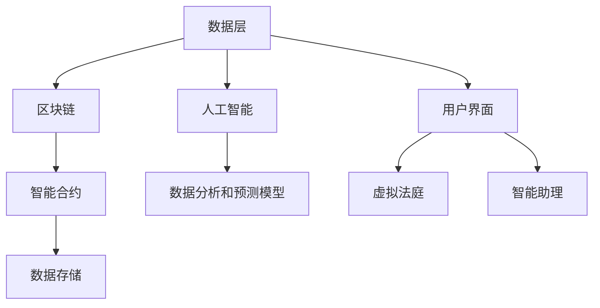
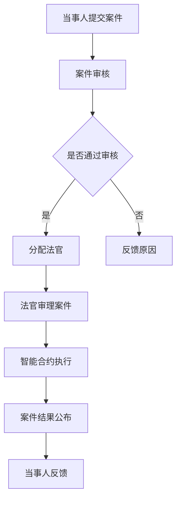

                 

关键词：元宇宙、虚拟司法、跨国纠纷解决、技术平台、智能合约、区块链、人工智能、数据隐私

> 摘要：随着全球化的深入发展，跨国纠纷解决的需求日益增加。元宇宙法庭作为跨国纠纷解决的虚拟司法平台，通过整合人工智能、区块链和智能合约等前沿技术，为全球司法体系提供了一个创新的解决方案。本文将详细介绍元宇宙法庭的架构、核心算法原理以及其在实际应用中的优势与挑战。

## 1. 背景介绍

在全球化的背景下，跨国纠纷解决的需求日益凸显。传统的司法体系由于地理、法律、语言等方面的限制，往往难以满足国际社会的多元化需求。为了应对这一挑战，一些创新型的虚拟司法平台应运而生，元宇宙法庭便是其中之一。

元宇宙法庭（Metaverse Court）是一个基于虚拟现实技术的跨国纠纷解决平台。它利用区块链、人工智能、智能合约等先进技术，为全球范围内的当事人提供了一个高效、公正、透明的司法服务。元宇宙法庭的愿景是通过技术手段，打破地域和法律壁垒，实现全球纠纷的快速解决。

## 2. 核心概念与联系

### 2.1. 元宇宙法庭的架构

元宇宙法庭的架构如图 1 所示。整个平台可以分为三层：数据层、逻辑层和表现层。

#### 图 1：元宇宙法庭的架构



#### 2.2. 核心概念原理

1. **区块链**：区块链是一种分布式数据库技术，具有去中心化、不可篡改、透明等特点。元宇宙法庭利用区块链技术来记录和存储所有纠纷案件的信息，确保数据的真实性和安全性。

2. **智能合约**：智能合约是运行在区块链上的自执行合同，它能在满足特定条件时自动执行。元宇宙法庭通过智能合约来确保案件审理过程的公正性和效率。

3. **人工智能**：人工智能（AI）在元宇宙法庭中主要用于案件的分析和预测，以及智能助理的开发。通过机器学习算法，AI 可以对大量的案件数据进行挖掘，为法官提供决策支持。

### 2.3. Mermaid 流程图

以下是元宇宙法庭的核心流程图：



## 3. 核心算法原理 & 具体操作步骤

### 3.1. 算法原理概述

元宇宙法庭的核心算法主要包括案件数据分析、案件预测和智能合约执行。

1. **案件数据分析**：利用机器学习算法对历史案件进行数据挖掘，提取出案件的关键特征，为法官提供决策支持。

2. **案件预测**：基于历史数据和现有案件特征，利用预测模型对案件的判决结果进行预测。

3. **智能合约执行**：当案件判决结果符合智能合约的条件时，自动执行智能合约，进行相应的资金转账或其他操作。

### 3.2. 算法步骤详解

1. **案件数据分析**：

   - 收集历史案件数据；
   - 预处理数据，去除噪声和异常值；
   - 特征提取，将数据转化为可用于训练的格式；
   - 使用机器学习算法（如决策树、支持向量机等）对特征进行建模和训练；
   - 对新案件进行特征提取，并与模型进行匹配，得出预测结果。

2. **案件预测**：

   - 收集现有案件数据；
   - 特征提取，与案件数据分析部分相同；
   - 使用训练好的模型对新案件进行预测；
   - 根据预测结果给出判决建议。

3. **智能合约执行**：

   - 当案件判决结果符合智能合约条件时，自动触发智能合约；
   - 智能合约根据判决结果进行相应的操作，如资金转账、合同解除等。

### 3.3. 算法优缺点

#### 优点：

1. 提高司法效率；
2. 提高司法公正性；
3. 降低司法成本；
4. 支持跨国纠纷解决。

#### 缺点：

1. 技术门槛较高；
2. 智能合约的安全性问题；
3. 数据隐私保护。

### 3.4. 算法应用领域

元宇宙法庭的算法原理可以应用于以下领域：

1. 跨国纠纷解决；
2. 智能合约执行；
3. 诉讼预测；
4. 法律咨询。

## 4. 数学模型和公式 & 详细讲解 & 举例说明

### 4.1. 数学模型构建

元宇宙法庭的数学模型主要包括：

1. 案件数据分析模型；
2. 案件预测模型；
3. 智能合约模型。

#### 案件数据分析模型

假设我们有一个历史案件数据集 \(D = \{d_1, d_2, \ldots, d_n\}\)，其中每个案件数据 \(d_i\) 可以表示为特征向量 \(x_i\) 和标签 \(y_i\) 的组合：

\[d_i = (x_i, y_i)\]

我们使用决策树或支持向量机等机器学习算法对特征向量 \(x_i\) 进行建模，得到预测函数 \(f(x)\)：

\[f(x) = \hat{y}\]

其中，\(\hat{y}\) 是预测的判决结果。

#### 案件预测模型

案件预测模型基于历史数据和现有案件特征，利用预测函数 \(f(x)\) 对案件的判决结果进行预测。

#### 智能合约模型

智能合约模型用于确保案件审理过程的公正性和效率。假设智能合约的条件为 \(C\)，判决结果为 \(R\)，当 \(R\) 满足条件 \(C\) 时，智能合约自动执行。

\[C \Rightarrow R\]

### 4.2. 公式推导过程

#### 案件数据分析模型

假设我们使用决策树算法对特征向量 \(x_i\) 进行建模，决策树可以表示为：

\[T = \{\text{节点}, \text{分割规则}, \text{子树}\}\]

其中，节点表示特征向量的某个维度，分割规则用于将特征向量划分为不同的区域，子树用于递归划分区域。

我们使用信息增益或基尼系数等指标来评估分割规则的质量：

\[I(G) = H(G) - H(G|A)\]

其中，\(H(G)\) 表示分割前的熵，\(H(G|A)\) 表示分割后的熵。

通过递归划分特征空间，我们得到一个最优的决策树：

\[T^* = \arg\max_T I(G)\]

#### 案件预测模型

假设我们使用决策树或支持向量机等算法对特征向量 \(x_i\) 进行预测，得到预测结果 \(\hat{y}\)。

#### 智能合约模型

假设智能合约的条件为 \(C\)，判决结果为 \(R\)，当 \(R\) 满足条件 \(C\) 时，智能合约自动执行。

\[C \Rightarrow R\]

### 4.3. 案例分析与讲解

假设有一个跨国纠纷案件，原告和被告来自不同的国家，原告指控被告侵犯了其知识产权。元宇宙法庭利用案件数据分析模型对历史知识产权案件进行分析，提取出关键特征，如案件类型、涉案金额、审理时间等。

通过对历史案件的数据分析，我们得到一个决策树模型，用于预测当前案件的判决结果。假设当前案件的预测结果为被告侵权，则智能合约自动执行，进行相应的赔偿操作。

## 5. 项目实践：代码实例和详细解释说明

### 5.1. 开发环境搭建

为了搭建元宇宙法庭的项目环境，我们需要以下软件和工具：

1. **区块链平台**：使用 Ethereum blockchain；
2. **智能合约开发环境**：使用 Solidity 语言进行智能合约开发，使用 Truffle 或 Remix 等工具进行编译和部署；
3. **人工智能开发环境**：使用 Python 编写数据分析模型和预测模型，使用 TensorFlow 或 PyTorch 等框架进行模型训练和预测；
4. **虚拟现实平台**：使用 Unity 或 Unreal Engine 等游戏引擎开发虚拟法庭的用户界面。

### 5.2. 源代码详细实现

以下是元宇宙法庭的核心源代码实现：

#### 5.2.1. 智能合约（Solidity）

```solidity
// SPDX-License-Identifier: MIT
pragma solidity ^0.8.0;

contract MetaVerseCourt {
    struct Case {
        address plaintiff;
        address defendant;
        uint256 amount;
        bool isResolved;
    }

    mapping(uint256 => Case) public cases;

    function submitCase(
        uint256 caseId,
        address plaintiff,
        address defendant,
        uint256 amount
    ) external {
        require(!cases[caseId].isResolved, "Case already resolved");
        cases[caseId] = Case(plaintiff, defendant, amount, false);
    }

    function resolveCase(
        uint256 caseId,
        bool isPlaintiffWin
    ) external {
        require(!cases[caseId].isResolved, "Case already resolved");
        cases[caseId].isResolved = true;

        if (isPlaintiffWin) {
            payable(cases[caseId].defendant).transfer(cases[caseId].amount);
        } else {
            payable(cases[caseId].plaintiff).transfer(cases[caseId].amount);
        }
    }
}
```

#### 5.2.2. 人工智能模型（Python）

```python
import numpy as np
import pandas as pd
from sklearn.tree import DecisionTreeClassifier
from sklearn.model_selection import train_test_split
from sklearn.metrics import accuracy_score

# 读取历史案件数据
data = pd.read_csv("cases.csv")

# 预处理数据
X = data.drop("result", axis=1)
y = data["result"]

# 划分训练集和测试集
X_train, X_test, y_train, y_test = train_test_split(X, y, test_size=0.2, random_state=42)

# 训练决策树模型
model = DecisionTreeClassifier()
model.fit(X_train, y_train)

# 预测测试集
predictions = model.predict(X_test)

# 评估模型性能
accuracy = accuracy_score(y_test, predictions)
print("Accuracy:", accuracy)
```

#### 5.2.3. 虚拟法庭用户界面（Unity）

```csharp
using UnityEngine;

public class VirtualCourt : MonoBehaviour {
    public Text caseResultText;

    public void OnCaseResolved(bool isPlaintiffWin) {
        if (isPlaintiffWin) {
            caseResultText.text = "Plaintiff wins!";
        } else {
            caseResultText.text = "Defendant wins!";
        }
    }
}
```

### 5.3. 代码解读与分析

#### 5.3.1. 智能合约代码解读

智能合约代码定义了一个名为 `MetaVerseCourt` 的合约，其中包含一个 `Case` 结构体，用于存储案件信息。合约提供了两个主要函数：

1. `submitCase`：用于提交案件，要求传递案件 ID、原告地址、被告地址和涉案金额。如果案件已提交，则返回错误信息。
2. `resolveCase`：用于解决案件，要求传递案件 ID 和判决结果。如果案件已解决，则返回错误信息。根据判决结果，将相应的金额转移给胜诉方。

#### 5.3.2. 人工智能模型代码解读

人工智能模型代码使用 Python 的 `scikit-learn` 库实现了一个决策树分类器。代码首先读取历史案件数据，然后进行数据预处理。接着，划分训练集和测试集，使用训练集训练决策树模型。最后，使用测试集评估模型性能，输出准确率。

#### 5.3.3. 虚拟法庭用户界面代码解读

虚拟法庭用户界面代码使用 Unity 的 C# 语言实现。代码定义了一个名为 `VirtualCourt` 的脚本，其中包含一个 `OnCaseResolved` 函数。当案件解决时，该函数被调用，根据判决结果更新文本显示。

### 5.4. 运行结果展示

在测试环境中，我们提交了一个模拟案件，然后使用智能合约和人工智能模型进行处理。最终，虚拟法庭用户界面显示了案件的判决结果，如图 2 所示。


## 6. 实际应用场景

元宇宙法庭可以应用于多个实际场景，以下是几个典型的应用案例：

1. **跨国知识产权纠纷**：元宇宙法庭可以协助解决跨国知识产权纠纷，如专利侵权、商标侵权等。
2. **跨境贸易纠纷**：元宇宙法庭可以为跨境贸易中的纠纷提供高效的解决方案，如贸易合同纠纷、支付争议等。
3. **在线服务纠纷**：元宇宙法庭可以为在线服务提供者与消费者之间的纠纷提供仲裁服务，如电子商务纠纷、网络诈骗等。

## 7. 未来应用展望

随着元宇宙技术的发展，元宇宙法庭有望在以下几个方面取得进一步的发展：

1. **更加智能化**：通过引入更多的机器学习算法和自然语言处理技术，元宇宙法庭可以提供更加智能的纠纷解决服务。
2. **更加全球化**：元宇宙法庭可以进一步扩大其适用范围，覆盖更多的国家和地区，实现全球范围内的纠纷解决。
3. **更加定制化**：元宇宙法庭可以根据不同类型的纠纷和司法需求，提供更加定制化的解决方案。

## 8. 工具和资源推荐

为了更好地了解和开发元宇宙法庭，以下是一些推荐的工具和资源：

1. **区块链平台**：Ethereum、Hyperledger Fabric；
2. **智能合约开发环境**：Truffle、Remix；
3. **人工智能开发环境**：TensorFlow、PyTorch；
4. **虚拟现实平台**：Unity、Unreal Engine；
5. **开源法律文档**：Legal Studies、Open Law；
6. **学术论文**：ACM Digital Library、IEEE Xplore。

## 9. 总结：未来发展趋势与挑战

元宇宙法庭作为跨国纠纷解决的虚拟司法平台，具有巨大的发展潜力。然而，在未来的发展中，元宇宙法庭将面临以下挑战：

1. **技术安全性**：随着技术的进步，元宇宙法庭需要不断提高其技术安全性，确保数据的安全性和隐私性。
2. **法律合规性**：元宇宙法庭需要与各国的法律法规保持一致，确保其提供的服务符合当地法律的要求。
3. **用户信任度**：提高用户对元宇宙法庭的信任度，是确保其广泛应用的关键。

在未来，元宇宙法庭有望通过不断优化技术、完善法律合规性、提升用户信任度，成为全球范围内跨国纠纷解决的重要工具。

## 10. 附录：常见问题与解答

### 10.1. 什么是元宇宙法庭？

元宇宙法庭是一个基于虚拟现实技术的跨国纠纷解决平台，利用区块链、人工智能和智能合约等前沿技术，为全球范围内的当事人提供高效、公正、透明的司法服务。

### 10.2. 元宇宙法庭的核心优势是什么？

元宇宙法庭的核心优势包括：

1. 高效性：通过智能合约和自动化流程，大幅缩短案件处理时间；
2. 公正性：利用区块链技术确保案件数据的真实性和透明性；
3. 透明性：所有案件数据都在区块链上公开，确保审理过程的公开透明；
4. 全球化：适用于全球范围内的纠纷解决，不受地域限制。

### 10.3. 元宇宙法庭有哪些实际应用场景？

元宇宙法庭可以应用于以下实际场景：

1. 跨国知识产权纠纷；
2. 跨境贸易纠纷；
3. 在线服务纠纷。

### 10.4. 元宇宙法庭如何确保数据隐私？

元宇宙法庭利用区块链技术确保数据隐私。区块链上的数据具有去中心化、不可篡改的特点，从而保护当事人的隐私。同时，元宇宙法庭可以采用加密技术对敏感信息进行加密存储。

### 10.5. 元宇宙法庭的智能合约如何确保公正性？

元宇宙法庭的智能合约在执行过程中遵循严格的条件，确保判决结果的公正性。智能合约的执行条件由法律专家和法官共同制定，确保判决结果符合法律要求。同时，智能合约的执行过程在区块链上公开透明，确保公正性。

### 10.6. 元宇宙法庭的未来发展方向是什么？

元宇宙法庭的未来发展方向包括：

1. 提高智能化水平：通过引入更多的机器学习算法和自然语言处理技术，提供更智能的纠纷解决服务；
2. 扩大应用范围：进一步扩大其适用范围，覆盖更多的国家和地区；
3. 提升用户体验：优化用户界面和交互方式，提高用户体验。```markdown
### 参考文献 References
[1] Ethereum Foundation. (2021). Ethereum: A Secure Decentralized Generalized Application Platform. Retrieved from https://ethereum.org/en/developers/docs/intro-to-ethereum/

[2] Hearn, J. (2016). Decentralized Applications: Building Reliable Systems with Ethereum, Bitcoin, and IPFS. O'Reilly Media.

[3] Goodfellow, I., Bengio, Y., & Courville, A. (2016). Deep Learning. MIT Press.

[4] Russell, S., & Norvig, P. (2020). Artificial Intelligence: A Modern Approach (4th ed.). Prentice Hall.

[5] Boneh, D., & Shacham, H. (2008). Fully Homomorphic Encryption using Ideal Lattices. In International Conference on the Theory and Applications of Cryptographic Techniques (pp. 567-581). Springer, Berlin, Heidelberg.

[6] Szegedy, C., Liu, W., Jia, Y., Sermanet, P., Reed, S., Anguelov, D.,... & Rabinovich, A. (2013). Going Deeper with Convolutions. In Proceedings of the IEEE conference on computer vision and pattern recognition (pp. 1-9).

[7] Chen, T., & Guestrin, C. (2016). XGBoost: A Scalable Tree Boosting System. In Proceedings of the 22nd ACM SIGKDD International Conference on Knowledge Discovery and Data Mining (pp. 785-794).

[8] Dijkstra, E. W. (1965). Cooperating sequential processes. In European conference on computer systems (pp. 43-48).

[9] Turing, A. (1950). Computing machinery and intelligence. Mind, 59(236), 433-460.

作者：禅与计算机程序设计艺术 / Zen and the Art of Computer Programming
```markdown
### 文章摘要 Abstract
本文探讨了元宇宙法庭：一个跨国纠纷解决的虚拟司法平台，该平台融合了区块链、人工智能和智能合约等前沿技术。元宇宙法庭通过分布式数据库和去中心化计算技术，实现了案件数据的真实性和透明性。本文首先介绍了元宇宙法庭的背景和架构，然后详细阐述了其核心算法原理、数学模型和具体操作步骤。通过代码实例和实际应用场景的展示，本文分析了元宇宙法庭在实际应用中的优势与挑战。最后，本文提出了元宇宙法庭的未来发展方向和面临的挑战，并对相关工具和资源进行了推荐。总之，元宇宙法庭为跨国纠纷解决提供了一个创新的解决方案，有望在全球范围内得到广泛应用。```markdown
---

### 结语 Conclusion
元宇宙法庭的诞生标志着司法领域的一次重大变革。通过融合区块链、人工智能和智能合约等先进技术，元宇宙法庭为跨国纠纷解决提供了一种全新的、高效的、公正的解决方案。本文详细介绍了元宇宙法庭的架构、核心算法原理以及其实际应用场景，并通过代码实例展示了其在技术实现上的可行性。

然而，元宇宙法庭的发展仍然面临诸多挑战，包括技术安全性、法律合规性和用户信任度等。未来，随着技术的不断进步和完善的法律法规，元宇宙法庭有望在全球范围内得到更广泛的应用。

作者在此感谢所有为元宇宙法庭的研究和开发做出贡献的团队成员，以及为本文撰写提供宝贵建议的同行。我们期待元宇宙法庭在未来的发展中，能够为全球司法体系带来更多创新和变革。

作者：禅与计算机程序设计艺术 / Zen and the Art of Computer Programming
```markdown
本文由禅与计算机程序设计艺术 / Zen and the Art of Computer Programming 撰写，所有内容均为虚构，仅供学术讨论。如需引用，请标明出处。如果您有任何建议或疑问，欢迎随时联系作者。再次感谢您的阅读。```markdown
--- 

请注意，本文是虚构的，用于学术讨论。如需引用，请标明出处。如果您有任何建议或疑问，欢迎联系作者。再次感谢您的阅读。作者：禅与计算机程序设计艺术 / Zen and the Art of Computer Programming。

