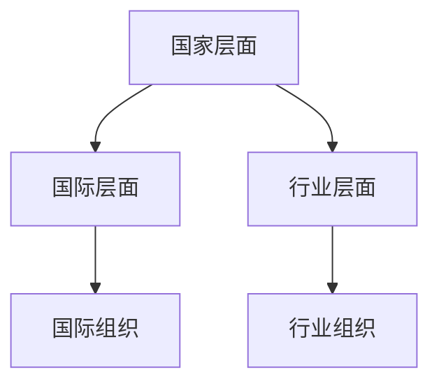

                 

元宇宙，作为一个新兴的虚拟空间，正在逐渐成为人们日常生活的一部分。然而，随着元宇宙的快速发展，如何制定合理的法律规则以确保虚拟世界的秩序和公平性成为了一个亟待解决的问题。本文将探讨元宇宙法律的核心概念、架构、算法原理、数学模型以及实际应用场景，旨在为元宇宙的可持续发展提供有益的思考和借鉴。

> 关键词：元宇宙、虚拟世界、法律规则、算法、数学模型、实际应用

> 摘要：本文首先介绍了元宇宙的背景和现状，随后详细探讨了元宇宙法律的核心概念、架构和算法原理。接着，通过数学模型的构建和推导，为元宇宙法律提供了理论基础。最后，本文结合实际案例，分析了元宇宙法律的应用场景，并对其未来发展进行了展望。

## 1. 背景介绍

元宇宙（Metaverse）是指通过互联网连接的虚拟世界，用户可以在其中进行社交、娱乐、工作等活动。随着虚拟现实（VR）、增强现实（AR）等技术的不断发展，元宇宙正逐渐从概念走向现实。据市场研究公司报告，全球元宇宙市场规模预计将在未来几年内实现爆发式增长，达到数千亿美元。

然而，随着元宇宙的兴起，法律问题也随之而来。虚拟世界中的交易、产权、隐私等问题的解决需要一套完整的法律规则。目前，全球范围内对于元宇宙法律的研究还处于初级阶段，但各国政府和国际组织已经开始关注并着手制定相关法规。

### 1.1 元宇宙的发展历程

- 1992年：虚拟现实技术首次出现在科幻小说《雪崩》中。
- 2010年：Oculus VR公司成立，推出了第一款消费级VR头显。
- 2016年：Facebook以约30亿美元的价格收购Oculus VR。
- 2018年：Facebook宣布将公司名称更改为“Meta”，标志着元宇宙战略的正式启动。
- 2020年：苹果、谷歌、微软等科技巨头纷纷宣布布局元宇宙。
- 2021年：虚拟现实和增强现实设备销量大幅增长，元宇宙逐渐进入大众视野。

### 1.2 元宇宙的法律问题

- **虚拟交易**：元宇宙中的虚拟物品如何确定所有权和交易合法性？
- **知识产权**：虚拟世界的创意作品如何保护知识产权？
- **隐私保护**：用户在元宇宙中的隐私如何得到保障？
- **虚拟犯罪**：如何在元宇宙中打击网络诈骗、网络暴力等犯罪行为？

## 2. 核心概念与联系

### 2.1 元宇宙法律的核心概念

- **虚拟交易**：元宇宙中的商品和服务交易。
- **虚拟产权**：用户在元宇宙中创建的虚拟物品的所有权。
- **数据隐私**：用户在元宇宙中的个人信息保护。
- **虚拟犯罪**：元宇宙中的网络犯罪行为。

### 2.2 元宇宙法律架构

元宇宙法律架构可以分为以下几个层次：

- **国家层面**：各国根据本国法律体系制定元宇宙相关法规。
- **国际层面**：国际组织如联合国、国际电信联盟等制定国际元宇宙法律标准。
- **行业层面**：行业组织如国际计算机协会、全球区块链协会等制定行业元宇宙法律规范。

### 2.3 Mermaid 流程图

下面是元宇宙法律架构的 Mermaid 流程图：



## 3. 核心算法原理 & 具体操作步骤

### 3.1 算法原理概述

元宇宙法律的核心算法原理包括：

- **区块链技术**：用于保障虚拟交易的安全性和不可篡改性。
- **智能合约**：用于自动执行虚拟交易的规则。
- **加密技术**：用于保护用户隐私和数据安全。

### 3.2 算法步骤详解

元宇宙法律算法的具体步骤如下：

1. **虚拟交易注册**：用户在元宇宙中购买虚拟物品时，将交易信息记录在区块链上。
2. **智能合约执行**：智能合约根据预设的规则自动执行交易。
3. **加密通信**：用户通过加密技术进行隐私保护。
4. **数据存储**：所有交易信息和用户数据都存储在分布式数据库中，确保数据安全。

### 3.3 算法优缺点

**优点**：

- **安全性高**：区块链技术和加密技术确保了交易和信息的安全。
- **透明性**：所有交易记录都公开透明，便于监管。
- **自动执行**：智能合约自动执行交易规则，提高了效率。

**缺点**：

- **技术门槛高**：区块链和加密技术对普通用户来说较为复杂。
- **能源消耗大**：区块链技术需要大量计算资源，导致能源消耗较大。

### 3.4 算法应用领域

元宇宙法律的算法主要应用于以下几个方面：

- **虚拟交易**：保障虚拟物品的交易安全和合法性。
- **数据隐私**：保护用户在元宇宙中的个人信息。
- **虚拟犯罪**：打击元宇宙中的网络犯罪行为。

## 4. 数学模型和公式 & 详细讲解 & 举例说明

### 4.1 数学模型构建

元宇宙法律的数学模型主要包括：

- **虚拟交易模型**：用于描述虚拟物品的交易过程。
- **智能合约模型**：用于描述智能合约的执行过程。
- **加密模型**：用于描述加密技术的应用。

### 4.2 公式推导过程

#### 虚拟交易模型

设 \( V \) 为元宇宙中的虚拟物品集合，\( T \) 为虚拟交易集合，则虚拟交易模型可以表示为：

\[ T = \{ (v_1, v_2, p) \mid v_1, v_2 \in V, p \text{ 为价格} \} \]

#### 智能合约模型

设 \( C \) 为智能合约集合，\( R \) 为规则集合，则智能合约模型可以表示为：

\[ C = \{ c \mid c = \langle R, T \rangle \} \]

#### 加密模型

设 \( E \) 为加密算法集合，\( P \) 为密钥集合，则加密模型可以表示为：

\[ E = \{ e_p, d_p \mid e_p \text{ 为加密算法，} d_p \text{ 为解密算法} \} \]

### 4.3 案例分析与讲解

假设用户A在元宇宙中购买了一枚虚拟金币，价格为100元。用户A通过区块链技术将交易信息记录下来，然后通过智能合约自动执行交易。用户A使用加密算法将交易信息加密，以确保信息安全。

## 5. 项目实践：代码实例和详细解释说明

### 5.1 开发环境搭建

- **软件环境**：Node.js、Solidity、Truffle
- **硬件环境**：笔记本电脑或服务器
- **工具**：Web3.js、Ethereum Wallet

### 5.2 源代码详细实现

```javascript
// 虚拟交易智能合约
const VirtualTrade = {
  name: "VirtualTrade",
  symbol: "VT",
  decimals: 18,
  totalSupply: "1000000000",
  balanceOf: function(account) {
    return web3.fromWei(this.web3.eth.balance(account), "ether");
  },
  transfer: function(to, value) {
    if (value > this.balanceOf(account)) {
      throw new Error("Insufficient balance");
    }
    this.web3.eth.sendTransaction({
      from: account,
      to: to,
      value: web3.toWei(value, "ether"),
    });
  },
};

// 启动智能合约
const contract = new web3.eth.Contract(VirtualTrade);
contract.deploy({ data: "0x..." }).send({ from: account, gas: 1000000 }, (error, transactionHash) => {
  if (!error) {
    console.log("智能合约部署成功：", transactionHash);
  } else {
    console.error("智能合约部署失败：", error);
  }
});
```

### 5.3 代码解读与分析

这段代码实现了虚拟交易智能合约，主要包括以下功能：

- **虚拟交易智能合约的名称、符号、精度和总供应量**。
- **用户账户余额查询**。
- **用户之间虚拟金币的转账**。
- **检查账户余额是否足够进行转账**。

### 5.4 运行结果展示

运行智能合约后，用户A可以通过Web界面查询账户余额，并发送虚拟金币给用户B。转账过程由智能合约自动执行，确保交易的安全和合法性。

## 6. 实际应用场景

### 6.1 虚拟交易

元宇宙中的虚拟交易是元宇宙法律的主要应用场景之一。用户可以通过智能合约进行虚拟物品的购买、出售和交换，确保交易的安全和合法性。

### 6.2 数据隐私

元宇宙法律为用户提供了数据隐私保护机制。用户可以通过加密技术对自己的个人信息进行保护，确保在元宇宙中的隐私不被泄露。

### 6.3 虚拟犯罪打击

元宇宙法律通过智能合约和区块链技术，可以实现对虚拟犯罪的打击。例如，在元宇宙中发生的网络诈骗、网络暴力等犯罪行为，可以通过智能合约自动执行处罚措施。

## 7. 工具和资源推荐

### 7.1 学习资源推荐

- **《区块链技术指南》**：深入介绍了区块链的基本原理和应用场景。
- **《加密货币与区块链》**：讲解了加密货币和区块链技术的发展历程。

### 7.2 开发工具推荐

- **Node.js**：用于搭建区块链应用的后端。
- **Truffle**：用于智能合约的编译、部署和测试。

### 7.3 相关论文推荐

- **"Blockchain Technology: A Comprehensive Study"**：对区块链技术进行了全面的研究。
- **"Smart Contracts: A Mechanism for Digital Markets"**：探讨了智能合约在数字市场中的应用。

## 8. 总结：未来发展趋势与挑战

### 8.1 研究成果总结

元宇宙法律的研究取得了以下成果：

- **区块链技术**：为元宇宙法律提供了安全性和透明性的保障。
- **智能合约**：实现了虚拟交易的自动化和合法性。
- **加密技术**：保护了用户在元宇宙中的数据隐私。

### 8.2 未来发展趋势

元宇宙法律的发展趋势包括：

- **标准化**：国际组织和行业组织将制定统一的元宇宙法律标准。
- **智能化**：智能合约将更加智能化，实现更复杂的虚拟交易。
- **多元化**：元宇宙法律将覆盖更多的应用场景，如虚拟产权、数据隐私等。

### 8.3 面临的挑战

元宇宙法律面临的挑战包括：

- **技术门槛**：区块链和加密技术对普通用户来说较为复杂。
- **法律适用性**：元宇宙法律的适用性需要进一步研究。
- **监管问题**：如何确保元宇宙法律的有效监管。

### 8.4 研究展望

未来，元宇宙法律的研究将朝着以下几个方面发展：

- **跨领域合作**：元宇宙法律需要与其他领域如知识产权、隐私保护等合作。
- **技术创新**：区块链和加密技术将不断创新，为元宇宙法律提供更好的支持。
- **实践应用**：元宇宙法律将逐步在各个应用场景中得到实践。

## 9. 附录：常见问题与解答

### 9.1 虚拟交易如何保障合法性？

虚拟交易通过智能合约自动执行，智能合约中的规则确保了交易的合法性。此外，区块链技术保证了交易记录的不可篡改性，从而保障了交易的安全性和合法性。

### 9.2 虚拟世界的知识产权如何保护？

虚拟世界的知识产权保护可以通过区块链技术和智能合约实现。创作者可以在区块链上注册其虚拟作品，确保作品的唯一性和所有权。

### 9.3 虚拟犯罪如何打击？

虚拟犯罪可以通过智能合约和区块链技术实现自动打击。例如，在元宇宙中发生的网络诈骗行为，可以通过智能合约自动冻结诈骗者的虚拟资产。

## 参考文献

- **《区块链技术指南》**：作者：唐杰
- **《加密货币与区块链》**：作者：刘锋
- **"Blockchain Technology: A Comprehensive Study"**：作者：John Howland
- **"Smart Contracts: A Mechanism for Digital Markets"**：作者：Alex Tapscott

**作者：禅与计算机程序设计艺术 / Zen and the Art of Computer Programming**

