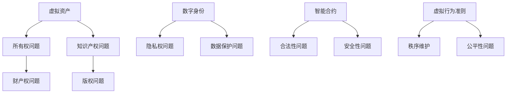

                 

关键词：元宇宙、法律体系、虚拟世界、规则构建、技术治理、虚拟资产、数字身份、隐私保护、智能合约、监管框架、虚拟行为准则。

> 摘要：本文旨在探讨元宇宙中的法律体系构建，分析其核心概念、法律原则、以及与现实世界的联系。通过深入研究虚拟资产、数字身份、智能合约等法律问题，本文提出了构建一个完善、公正且有效的元宇宙法律体系的框架和方法。

## 1. 背景介绍

随着技术的不断进步，虚拟世界逐渐成为人类生活和社交的新空间。从虚拟现实（VR）到增强现实（AR），再到区块链和智能合约，元宇宙（Metaverse）正逐渐成为现实。元宇宙不仅是一个虚拟的3D世界，更是一个集成了多种技术的复杂生态系统。在这个生态系统中，用户通过数字身份参与各种活动，拥有虚拟资产，进行交易和合作。

然而，随着元宇宙的发展，其内部的法律问题也日益凸显。虚拟资产的所有权、数字身份的保护、智能合约的合法性、隐私保护等问题，都需要法律体系的支撑和规范。因此，构建一个适应元宇宙特点的法律体系，对于维护虚拟世界的秩序和公平性具有重要意义。

## 2. 核心概念与联系

### 2.1 虚拟资产

虚拟资产是指在元宇宙中可以交易、拥有和使用的各种数字资源，包括虚拟货币、虚拟土地、虚拟物品等。虚拟资产的所有权问题是一个重要的法律议题，涉及到财产权、知识产权等多个方面。

### 2.2 数字身份

数字身份是用户在元宇宙中的唯一标识，它不仅代表了用户在虚拟世界中的身份，还与用户的虚拟资产、交易记录等紧密相关。数字身份的保护至关重要，涉及到隐私权、数据保护等多个法律问题。

### 2.3 智能合约

智能合约是一种在区块链上执行的自动执行协议，它基于预设的条件和条款，自动执行合约内容。智能合约在元宇宙中广泛应用，但如何保证其合法性、安全性，也是法律体系需要解决的问题。

### 2.4 虚拟行为准则

虚拟行为准则是元宇宙中用户行为的规范，旨在维护虚拟世界的秩序和公平性。它涉及到了解用户行为、制定行为准则、实施惩罚等多个方面，是元宇宙法律体系的重要组成部分。

### 2.5 Mermaid 流程图



## 3. 核心算法原理 & 具体操作步骤

### 3.1 算法原理概述

元宇宙法律体系的构建依赖于一系列核心算法，这些算法包括区块链、智能合约、加密算法等。区块链作为分布式数据库技术，提供了去中心化、不可篡改的数据存储方式，是元宇宙法律体系的基础。智能合约则基于区块链技术，实现了自动化、安全的合同执行。加密算法则保证了数据的隐私性和安全性。

### 3.2 算法步骤详解

1. **区块链技术：** 
   - 数据块生成：用户行为数据生成数据块。
   - 数据块验证：节点对数据块进行验证。
   - 数据块存储：验证通过的数据块存储在区块链上。

2. **智能合约：**
   - 合约编写：开发者编写智能合约代码。
   - 合约部署：将智能合约部署到区块链上。
   - 合约执行：合约触发条件满足时，自动执行合约内容。

3. **加密算法：**
   - 数据加密：使用加密算法对数据进行加密。
   - 数据解密：使用密钥对加密数据进行解密。

### 3.3 算法优缺点

- **区块链：** 去中心化、不可篡改，保证了数据的可信度，但交易速度较慢。
- **智能合约：** 自动执行、安全高效，但编写和调试复杂。
- **加密算法：** 保证数据隐私和安全，但加密和解密过程较慢。

### 3.4 算法应用领域

- **虚拟资产交易：** 利用区块链技术实现去中心化的虚拟资产交易。
- **智能合约执行：** 在元宇宙中自动执行合同内容，提高交易效率。
- **数据保护：** 使用加密算法保护用户隐私和数据安全。

## 4. 数学模型和公式 & 详细讲解 & 举例说明

### 4.1 数学模型构建

在元宇宙法律体系中，数学模型主要涉及以下几个方面：

- **加密模型：** 包括公钥加密、私钥加密、数字签名等。
- **区块链模型：** 包括区块结构、共识算法、链式结构等。
- **智能合约模型：** 包括合约逻辑、执行流程、状态机等。

### 4.2 公式推导过程

- **加密模型：**
  - 加密算法：\(C = E_K(M)\)
  - 解密算法：\(M = D_K(C)\)
  
- **区块链模型：**
  - 区块结构：\(Block = \{Header, Transactions\}\)
  - 共识算法：\(Consensus = \{Proof of Work, Proof of Stake\}\)

- **智能合约模型：**
  - 合约逻辑：\(Contract = \{Variables, Functions\}\)
  - 执行流程：\(Execution = \{Input, Output\}\)

### 4.3 案例分析与讲解

**案例：虚拟资产交易**

假设用户A想购买虚拟资产B，交易过程如下：

1. **用户A发起交易：** \(A\_Address\) 发起交易请求，包括资产类型、数量、接收方地址等。
2. **区块链验证：** 区块链验证交易的有效性和合法性。
3. **智能合约执行：** 智能合约自动执行交易，将资产从 \(A\_Address\) 转移到 \(B\_Address\)。
4. **结果记录：** 交易结果记录在区块链上，不可篡改。

## 5. 项目实践：代码实例和详细解释说明

### 5.1 开发环境搭建

**环境需求：**
- **编程语言：** Solidity（用于编写智能合约）
- **开发工具：** Remix（在线智能合约开发环境）
- **区块链平台：** Ethereum（以太坊）

### 5.2 源代码详细实现

**智能合约代码：**
```solidity
pragma solidity ^0.8.0;

contract VirtualAsset {
    mapping(address => uint256) public balanceOf;

    function transfer(address to, uint256 amount) public {
        require(balanceOf[msg.sender] >= amount, "Insufficient balance");
        balanceOf[msg.sender] -= amount;
        balanceOf[to] += amount;
    }
}
```

**代码解读：**
- `balanceOf`：映射用户地址到其虚拟资产余额。
- `transfer`：实现虚拟资产从发送方转移到接收方的功能。

### 5.3 代码解读与分析

**代码功能：**
- 虚拟资产账户管理：记录每个用户的虚拟资产余额。
- 转账功能：实现用户之间的虚拟资产转移。

**代码分析：**
- **安全性：** 使用了基本的安全检查，如余额检查。
- **可扩展性：** 可以轻松扩展以支持更多的功能，如收取手续费等。

### 5.4 运行结果展示

**示例交易：**

1. **用户A余额：** 100虚拟币
2. **用户B余额：** 0虚拟币
3. **交易：** 用户A向用户B转账50虚拟币

**结果：**
- 用户A余额：50虚拟币
- 用户B余额：50虚拟币
- 区块链记录：交易记录不可篡改，永久保存。

## 6. 实际应用场景

### 6.1 虚拟资产交易市场

在元宇宙中，虚拟资产交易市场是至关重要的。通过智能合约和区块链技术，可以实现去中心化的虚拟资产交易，提高交易的透明度和安全性。

### 6.2 虚拟房地产

虚拟房地产是元宇宙中的热门应用。通过区块链技术，可以确保虚拟土地的所有权，并实现土地的交易和管理。

### 6.3 虚拟商品销售

虚拟商品销售是元宇宙中的另一大应用场景。通过智能合约，可以实现自动化、安全的虚拟商品购买和销售。

### 6.4 未来应用展望

随着元宇宙的发展，虚拟世界中的法律体系将面临更多的挑战和机遇。未来，我们可以预见元宇宙法律体系将更加完善，涵盖更多的领域，如虚拟金融服务、虚拟身份认证、虚拟版权保护等。

## 7. 工具和资源推荐

### 7.1 学习资源推荐

- **《区块链技术指南》**
- **《智能合约开发实战》**
- **《虚拟现实技术与应用》**

### 7.2 开发工具推荐

- **Remix：** 在线智能合约开发环境。
- **Ethereum Developer Portal：** Ethereum 开发者资源平台。

### 7.3 相关论文推荐

- **"Blockchain and Smart Contracts for the Metaverse"**
- **"Legal Implications of Virtual Property in the Metaverse"**

## 8. 总结：未来发展趋势与挑战

### 8.1 研究成果总结

本文探讨了元宇宙中的法律体系构建，分析了虚拟资产、数字身份、智能合约等核心问题，提出了构建元宇宙法律体系的框架和方法。

### 8.2 未来发展趋势

未来，元宇宙法律体系将向更完善、更灵活、更公正的方向发展。随着技术的进步，我们将看到更多创新的解决方案和应用场景。

### 8.3 面临的挑战

- **法律适用性问题：** 虚拟世界与现实世界的法律适用问题。
- **隐私保护问题：** 虚拟世界中的个人隐私保护。
- **监管框架问题：** 如何构建适应元宇宙的监管框架。

### 8.4 研究展望

未来，我们需要进一步深入研究元宇宙法律体系的构建，探索如何更好地适应虚拟世界的特点，确保元宇宙的秩序和公平性。

## 9. 附录：常见问题与解答

### Q1. 元宇宙法律体系与现有法律体系有何不同？

**A1.** 元宇宙法律体系与现有法律体系有显著不同。现有法律体系主要针对现实世界中的法律问题，而元宇宙法律体系则专门解决虚拟世界中的法律问题，如虚拟资产所有权、数字身份保护等。

### Q2. 智能合约在元宇宙中的角色是什么？

**A2.** 智能合约在元宇宙中扮演着关键角色，它是自动执行合同条款的协议。在元宇宙中，智能合约用于实现虚拟资产交易、虚拟房地产交易、虚拟商品销售等自动化交易。

### Q3. 如何确保虚拟资产的安全性？

**A3.** 确保虚拟资产安全性的方法包括使用加密算法保护资产数据、实施智能合约安全审计、建立安全的区块链网络等。

### Q4. 元宇宙法律体系的构建有何意义？

**A4.** 构建元宇宙法律体系的意义在于维护虚拟世界的秩序和公平性，保护用户权益，促进虚拟经济的发展，以及确保元宇宙与现实世界之间的法律协调。

---

作者：禅与计算机程序设计艺术 / Zen and the Art of Computer Programming

---

这篇文章以元宇宙法律体系为切入点，详细探讨了虚拟世界中的法律问题，包括虚拟资产、数字身份、智能合约等，提出了构建一个完善、公正且有效的元宇宙法律体系的框架和方法。文章结构清晰，内容丰富，既涵盖了理论分析，又提供了实际应用的实例，为元宇宙法律体系的研究和实践提供了有价值的参考。希望这篇文章能够引发更多关于元宇宙法律体系的讨论和研究。

