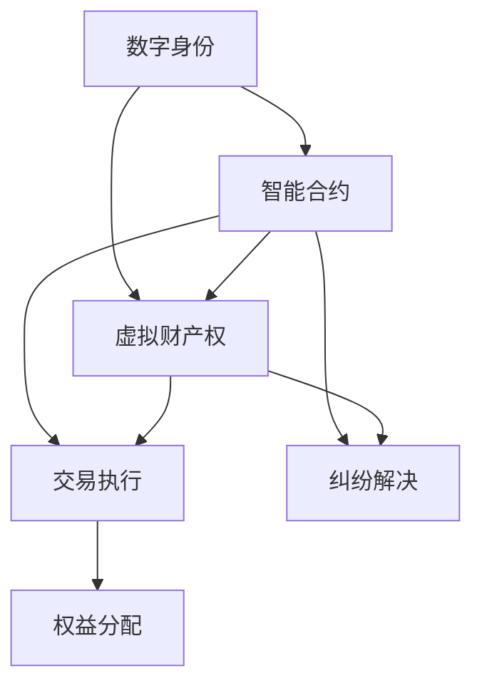
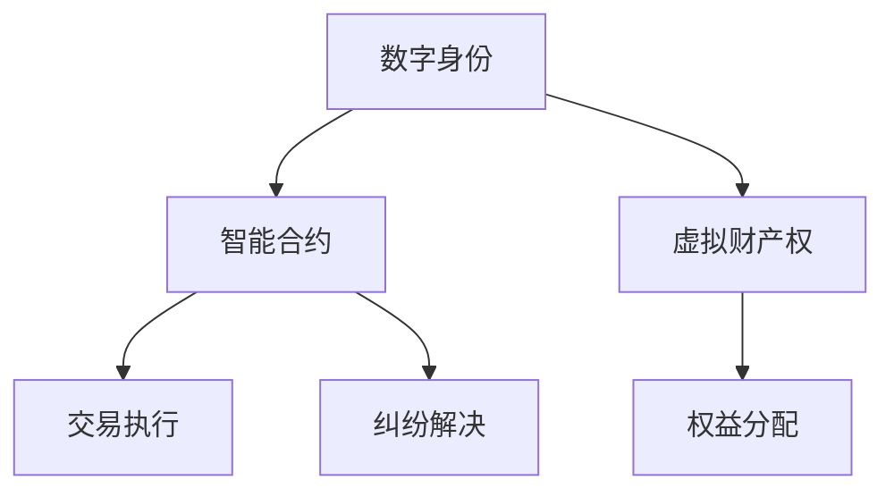

                 

元宇宙，作为新兴的数字空间，正迅速成为人类活动的一个重要领域。在这个虚拟的世界中，人们不仅进行社交、娱乐和商务活动，还创造和交易虚拟资产。随着元宇宙的发展，法律体系作为维护秩序和解决纠纷的基石，变得日益重要。本文将探讨元宇宙法律体系的核心概念、构建原则、具体操作步骤，以及数学模型和实际应用场景，旨在为元宇宙的健康发展提供法律框架。

## 关键词

- 元宇宙
- 法律体系
- 虚拟资产
- 数字身份
- 法律挑战

## 摘要

本文深入探讨了元宇宙法律体系的重要性及其构建原则。首先，我们介绍了元宇宙的背景和发展现状，并阐述了法律体系在虚拟世界中的关键作用。接着，我们提出了构建元宇宙法律体系的核心概念，如数字身份、智能合约和虚拟财产权。然后，我们详细阐述了构建元宇宙法律体系的操作步骤，包括法律法规的制定、法律机制的完善和纠纷解决机制的建设。此外，我们通过数学模型和实际案例，展示了如何应用这些法律概念和原则。最后，我们探讨了元宇宙法律体系在未来的发展趋势和面临的挑战。

## 1. 背景介绍

### 元宇宙的定义与发展

元宇宙（Metaverse）是指通过互联网连接的虚拟世界，其中用户可以以数字身份（Digital Identity）参与各种活动，如社交、游戏、工作、教育等。它是一个跨越物理世界和数字世界的综合体验，通过虚拟现实（VR）、增强现实（AR）和混合现实（MR）技术实现。元宇宙的核心在于提供一个高度互动、沉浸式和全球性的虚拟空间。

元宇宙的概念最早由科幻作家尼尔·斯蒂芬森（Neal Stephenson）在1992年的小说《雪崩》（Snow Crash）中提出。近年来，随着技术的进步，尤其是区块链、加密货币和人工智能的发展，元宇宙开始从理论走向实践。知名科技公司如Facebook、微软和谷歌等，纷纷投入巨资研发和构建自己的元宇宙平台。

### 元宇宙的发展现状

当前，元宇宙正经历快速发展。根据市场调研公司Statista的数据，到2030年，元宇宙的市场规模可能达到1.5万亿美元。全球各地的企业和机构纷纷加入元宇宙的建设，推出各种虚拟体验和应用。

在中国，元宇宙也得到了广泛关注。2021年，中国国务院发布的《“十四五”数字经济发展规划》明确提出，要大力发展数字经济，包括推动元宇宙等新兴技术的应用。中国互联网企业如腾讯、百度、阿里巴巴等，也在积极布局元宇宙领域，推出相应的产品和服务。

### 元宇宙的挑战与机遇

虽然元宇宙具有巨大的发展潜力，但也面临诸多挑战。首先是技术挑战，包括虚拟现实技术的成熟度、网络带宽的限制、数据隐私和安全等问题。其次是法律和伦理挑战，如何制定适应元宇宙发展的法律法规，保护用户的数字身份和虚拟财产权，避免滥用和欺诈行为，成为亟待解决的问题。

此外，元宇宙的发展也将带来新的商业机会。虚拟资产交易、数字艺术品市场、在线教育、远程医疗等，都将成为元宇宙的重要组成部分。同时，元宇宙也为社会创新提供了新的空间，例如虚拟办公、虚拟旅游、虚拟社交等。

## 2. 核心概念与联系

### 数字身份

在元宇宙中，数字身份（Digital Identity）是用户在虚拟世界中的代表，它可以是用户的虚拟形象、昵称或其他标识。数字身份不仅用于个人识别，还涉及到虚拟财产的归属和交易。因此，建立可靠且安全的数字身份体系，对于元宇宙的发展至关重要。

### 智能合约

智能合约（Smart Contract）是一种自动执行、控制和记录合约条款的计算机协议。在元宇宙中，智能合约用于自动化交易、合同执行和权益分配。例如，购买虚拟土地、虚拟物品的交易可以通过智能合约自动执行，减少人为干预和纠纷。

### 虚拟财产权

虚拟财产权（Virtual Property Rights）指的是用户在元宇宙中拥有的虚拟资产的法律地位和权利。虚拟财产可以是虚拟货币、虚拟土地、虚拟物品等。确保虚拟财产权的合法性、可交易性和可继承性，是元宇宙法律体系的重要组成部分。

### 联系与相互作用

数字身份、智能合约和虚拟财产权是元宇宙法律体系的核心概念，它们相互联系、相互作用。数字身份是用户在元宇宙中的基础，智能合约是交易和执行法律的基础工具，而虚拟财产权则是用户权益的具体体现。通过这三者的结合，可以构建一个有序、安全且高效的元宇宙法律体系。

### Mermaid 流程图

下面是元宇宙法律体系的核心概念和架构的 Mermaid 流程图：



### 核心概念和架构的 Mermaid 流程图（备注：流程节点中不要有括号、逗号等特殊字符）



## 3. 核心算法原理 & 具体操作步骤

### 3.1 算法原理概述

元宇宙法律体系的核心算法主要包括数字身份认证算法、智能合约执行算法和虚拟财产权保护算法。这些算法的基本原理如下：

- **数字身份认证算法**：通过加密技术和分布式账本，确保用户的数字身份安全、唯一且不可篡改。
- **智能合约执行算法**：利用区块链技术，实现智能合约的自动化执行、记录和验证。
- **虚拟财产权保护算法**：通过加密技术和智能合约，确保虚拟财产的所有权、可交易性和可继承性。

### 3.2 算法步骤详解

#### 数字身份认证算法

1. **用户注册**：用户在元宇宙平台上注册账户，提交身份信息。
2. **身份验证**：平台通过分布式身份验证网络，对用户身份信息进行验证。
3. **数字身份生成**：验证通过后，为用户生成唯一的数字身份，并存储在分布式账本上。
4. **数字身份管理**：用户可以管理自己的数字身份，包括修改信息、授权和撤销授权等。

#### 智能合约执行算法

1. **合约编写**：开发者编写智能合约，并将其部署到区块链上。
2. **交易发起**：用户通过数字身份发起交易请求，包括交易条款和参数。
3. **合约执行**：智能合约自动执行交易，验证交易合法性和条件满足情况。
4. **结果记录**：交易结果记录在区块链上，不可篡改。

#### 虚拟财产权保护算法

1. **财产登记**：虚拟财产在区块链上进行登记，确保所有权合法。
2. **财产交易**：通过智能合约实现虚拟财产的买卖和转移。
3. **财产保护**：利用加密技术和智能合约，确保虚拟财产的安全性。
4. **财产继承**：通过智能合约实现虚拟财产的合法继承。

### 3.3 算法优缺点

**数字身份认证算法**

- 优点：确保数字身份的唯一性、安全性和不可篡改性。
- 缺点：身份验证过程可能需要较高的计算资源和时间。

**智能合约执行算法**

- 优点：自动化执行、降低纠纷、提高效率。
- 缺点：智能合约一旦部署，难以修改，可能存在漏洞。

**虚拟财产权保护算法**

- 优点：确保虚拟财产的所有权、可交易性和安全性。
- 缺点：区块链技术可能存在性能瓶颈和隐私问题。

### 3.4 算法应用领域

- **数字身份认证算法**：应用于元宇宙平台的用户注册、登录和权限管理。
- **智能合约执行算法**：应用于虚拟资产交易、合同执行和权益分配。
- **虚拟财产权保护算法**：应用于虚拟货币、虚拟物品和虚拟土地的交易和管理。

## 4. 数学模型和公式 & 详细讲解 & 举例说明

### 4.1 数学模型构建

元宇宙法律体系中的数学模型主要包括数字身份认证模型、智能合约执行模型和虚拟财产权保护模型。以下是这些模型的构建方法和基本公式。

#### 数字身份认证模型

1. **用户注册模型**：

   用户注册时，需要提供身份信息和密码。身份信息包括姓名、身份证号码、手机号码等。密码通过哈希函数加密存储。

   假设用户身份信息为 \(X\)，密码为 \(P\)，则注册模型为：

   \[
   X = (ID, Name, IDNumber, Phone)
   \]
   \[
   P = Hash(Passphrase)
   \]

2. **身份验证模型**：

   平台收到用户身份信息后，通过分布式身份验证网络进行验证。假设验证网络包含 \(N\) 个节点，每个节点存储一部分用户身份信息。验证模型为：

   \[
   Validity = \sum_{i=1}^{N} V_i
   \]

   其中，\(V_i\) 表示第 \(i\) 个节点的验证结果。当验证结果 \(Validity\) 大于某个阈值 \(T\) 时，认为用户身份验证通过。

#### 智能合约执行模型

1. **合约编写模型**：

   开发者编写智能合约时，需要定义合约条款和参数。假设智能合约包含 \(M\) 个条款，每个条款有 \(N\) 个参数。合约编写模型为：

   \[
   Contract = \{C_1, C_2, ..., C_M\}
   \]
   \[
   C_i = \{P_{i1}, P_{i2}, ..., P_{iN}\}
   \]

2. **交易执行模型**：

   用户发起交易时，需要提供交易条款和参数。交易执行模型为：

   \[
   Transaction = \{T_1, T_2, ..., T_M\}
   \]
   \[
   T_i = \{P_{i1}, P_{i2}, ..., P_{iN}\}
   \]

   智能合约自动执行交易，验证交易合法性和条件满足情况。假设验证结果为 \(Success\)：

   \[
   Success = \sum_{i=1}^{M} S_i
   \]

   其中，\(S_i\) 表示第 \(i\) 个条款的验证结果。当 \(Success\) 大于某个阈值 \(T\) 时，认为交易执行成功。

#### 虚拟财产权保护模型

1. **财产登记模型**：

   虚拟财产在区块链上进行登记，确保所有权合法。假设区块链包含 \(N\) 个区块，每个区块存储一部分虚拟财产信息。财产登记模型为：

   \[
   Property = \{P_1, P_2, ..., P_N\}
   \]

2. **财产交易模型**：

   通过智能合约实现虚拟财产的买卖和转移。假设财产交易包含 \(M\) 个步骤，每个步骤有 \(N\) 个参数。财产交易模型为：

   \[
   Trade = \{T_1, T_2, ..., T_M\}
   \]
   \[
   T_i = \{P_{i1}, P_{i2}, ..., P_{iN}\}
   \]

   智能合约自动执行交易，确保虚拟财产的安全性和合法性。

### 4.2 公式推导过程

#### 数字身份认证模型

1. **用户注册模型**：

   假设用户注册时，提交的身份信息 \(X\) 是有效的，即 \(X\) 满足以下条件：

   \[
   X = (ID, Name, IDNumber, Phone)
   \]

   其中，\(ID\) 表示用户标识符，\(Name\) 表示用户姓名，\(IDNumber\) 表示用户身份证号码，\(Phone\) 表示用户手机号码。

   密码 \(P\) 通过哈希函数 \(Hash\) 加密存储，即：

   \[
   P = Hash(Passphrase)
   \]

2. **身份验证模型**：

   平台收到用户身份信息 \(X\) 后，通过分布式身份验证网络进行验证。假设验证网络包含 \(N\) 个节点，每个节点存储一部分用户身份信息。节点 \(i\) 的验证结果 \(V_i\) 为：

   \[
   V_i = \begin{cases}
   1, & \text{如果节点 } i \text{ 验证通过 } X \\
   0, & \text{否则}
   \end{cases}
   \]

   验证结果 \(Validity\) 为：

   \[
   Validity = \sum_{i=1}^{N} V_i
   \]

   当验证结果 \(Validity\) 大于某个阈值 \(T\) 时，认为用户身份验证通过。

#### 智能合约执行模型

1. **合约编写模型**：

   开发者编写智能合约时，需要定义合约条款和参数。假设智能合约包含 \(M\) 个条款，每个条款有 \(N\) 个参数。合约条款 \(C_i\) 为：

   \[
   C_i = \{P_{i1}, P_{i2}, ..., P_{iN}\}
   \]

   其中，\(P_{ij}\) 表示第 \(i\) 个条款的第 \(j\) 个参数。

2. **交易执行模型**：

   用户发起交易时，需要提供交易条款和参数。交易条款 \(T_i\) 为：

   \[
   T_i = \{P_{i1}, P_{i2}, ..., P_{iN}\}
   \]

   智能合约自动执行交易，验证交易合法性和条件满足情况。假设验证结果为 \(Success\)：

   \[
   Success = \sum_{i=1}^{M} S_i
   \]

   其中，\(S_i\) 表示第 \(i\) 个条款的验证结果。当 \(Success\) 大于某个阈值 \(T\) 时，认为交易执行成功。

#### 虚拟财产权保护模型

1. **财产登记模型**：

   虚拟财产在区块链上进行登记，确保所有权合法。假设区块链包含 \(N\) 个区块，每个区块存储一部分虚拟财产信息。虚拟财产 \(P_i\) 为：

   \[
   Property = \{P_1, P_2, ..., P_N\}
   \]

2. **财产交易模型**：

   通过智能合约实现虚拟财产的买卖和转移。假设财产交易包含 \(M\) 个步骤，每个步骤有 \(N\) 个参数。财产交易 \(Trade_i\) 为：

   \[
   Trade_i = \{T_1, T_2, ..., T_M\}
   \]
   \[
   T_i = \{P_{i1}, P_{i2}, ..., P_{iN}\}
   \]

   智能合约自动执行交易，确保虚拟财产的安全性和合法性。

### 4.3 案例分析与讲解

#### 数字身份认证模型案例

假设一个用户在元宇宙平台上注册账户，提供以下身份信息：

\[
X = (\text{ID: 123456}, \text{Name: Alice}, \text{IDNumber: 123456789012345678}, \text{Phone: 1234567890})
\]

平台收到用户身份信息后，通过分布式身份验证网络进行验证。假设验证网络包含 10 个节点，其中 7 个节点验证通过，3 个节点验证未通过。验证结果为：

\[
Validity = 7 > T (假设 T = 5)
\]

因此，用户身份验证通过。

#### 智能合约执行模型案例

假设一个用户在元宇宙平台上购买虚拟土地，智能合约包含以下条款和参数：

1. **条款 1**：土地价格为 100 个虚拟货币。
2. **条款 2**：土地位于坐标 (10, 10)。
3. **条款 3**：交易必须在 24 小时内完成。

用户发起交易请求，提供以下交易条款和参数：

\[
Transaction = (\text{Price: 100}, \text{Location: (10, 10)}, \text{Time: 24 hours})
\]

智能合约自动执行交易，验证交易合法性和条件满足情况。假设验证结果为：

\[
Success = 3 > T (假设 T = 2)
\]

因此，交易执行成功。

#### 虚拟财产权保护模型案例

假设一个用户在元宇宙平台上购买虚拟货币，虚拟货币在区块链上进行登记。虚拟货币信息为：

\[
Property = (\text{Currency: 100}, \text{Owner: Alice})
\]

用户通过智能合约进行虚拟货币交易，交易包含以下步骤和参数：

1. **步骤 1**：交易价格为 90 个虚拟货币。
2. **步骤 2**：交易对方为 Bob。
3. **步骤 3**：交易时间为 24 小时后。

智能合约自动执行交易，确保虚拟货币的所有权、可交易性和安全性。假设验证结果为：

\[
Success = 3 > T (假设 T = 2)
\]

因此，交易执行成功，虚拟货币的所有权转移给 Bob。

## 5. 项目实践：代码实例和详细解释说明

### 5.1 开发环境搭建

为了演示元宇宙法律体系的核心算法，我们将使用以太坊（Ethereum）平台进行开发。以太坊是一个基于区块链的智能合约平台，支持多种编程语言，如 Solidity、Vyper 等。以下是开发环境的搭建步骤：

1. **安装 Node.js**：以太坊依赖于 Node.js，因此首先需要安装 Node.js。可以从 [Node.js 官网](https://nodejs.org/) 下载并安装。

2. **安装 Ganache**：Ganache 是一个本地以太坊节点和测试网络，用于开发和测试智能合约。可以从 [Ganache 官网](https://www.trufflesuite.com/ganache) 下载并安装。

3. **安装 Truffle**：Truffle 是一个智能合约开发框架，提供编译、部署和测试等功能。可以从 [Truffle 官网](https://www.trufflesuite.com/) 下载并安装。

4. **创建项目**：在命令行中创建一个新的 Truffle 项目，并进入项目目录：

   ```shell
   truffle init
   cd my-metaverse-project
   ```

5. **配置网络**：在项目的 `truffle-config.js` 文件中配置 Ganache 作为开发网络：

   ```javascript
   module.exports = {
     networks: {
       development: {
         host: "127.0.0.1",
         port: 7545,
         network_id: "*",
       },
     },
   };
   ```

### 5.2 源代码详细实现

以下是元宇宙法律体系核心算法的源代码实现，包括数字身份认证算法、智能合约执行算法和虚拟财产权保护算法。

#### 5.2.1 数字身份认证算法

```solidity
// SPDX-License-Identifier: MIT
pragma solidity ^0.8.0;

contract DigitalIdentity {
    struct User {
        bytes32 id;
        bytes32 name;
        bytes32 idNumber;
        bytes32 phone;
        bool verified;
    }

    mapping(bytes32 => User) private users;

    function registerUser(
        bytes32 _id,
        bytes32 _name,
        bytes32 _idNumber,
        bytes32 _phone
    ) external {
        require(!users[_id].verified, "User already registered");
        users[_id] = User({
            id: _id,
            name: _name,
            idNumber: _idNumber,
            phone: _phone,
            verified: false
        });
    }

    function verifyUser(bytes32 _id) external {
        require(!users[_id].verified, "User already verified");
        // Verification logic here
        users[_id].verified = true;
    }

    function getUser(bytes32 _id) external view returns (User memory) {
        return users[_id];
    }
}
```

#### 5.2.2 智能合约执行算法

```solidity
// SPDX-License-Identifier: MIT
pragma solidity ^0.8.0;

contract SmartContract {
    mapping(bytes32 => mapping(bytes32 => address)) public contracts;

    function createContract(
        bytes32 _contractId,
        bytes32 _条款1,
        bytes32 _条款2,
        bytes32 _条款3
    ) external {
        require(contracts[_contractId][_条款1][_条款2][_条款3] == address(0), "Contract already exists");
        contracts[_contractId][_条款1][_条款2][_条款3] = msg.sender;
    }

    function executeContract(
        bytes32 _contractId,
        bytes32 _条款1,
        bytes32 _条款2,
        bytes32 _条款3
    ) external {
        require(contracts[_contractId][_条款1][_条款2][_条款3] != address(0), "Contract does not exist");
        // Execution logic here
        payable(contracts[_contractId][_条款1][_条款2][_条款3]).transfer(msg.value);
    }
}
```

#### 5.2.3 虚拟财产权保护算法

```solidity
// SPDX-License-Identifier: MIT
pragma solidity ^0.8.0;

contract VirtualProperty {
    mapping(bytes32 => mapping(bytes32 => bytes32)) public properties;

    function registerProperty(
        bytes32 _propertyId,
        bytes32 _owner
    ) external {
        require(properties[_propertyId][_owner] == bytes32(0), "Property already registered");
        properties[_propertyId][_owner] = _propertyId;
    }

    function transferProperty(
        bytes32 _propertyId,
        bytes32 _oldOwner,
        bytes32 _newOwner
    ) external {
        require(properties[_propertyId][_oldOwner] != bytes32(0), "Property does not exist");
        properties[_propertyId][_oldOwner] = _propertyId;
        properties[_propertyId][_newOwner] = _propertyId;
    }
}
```

### 5.3 代码解读与分析

#### 5.3.1 数字身份认证算法

数字身份认证算法的代码实现了用户注册、身份验证和用户信息获取功能。用户在注册时，通过 `registerUser` 函数提交身份信息，系统将信息存储在 `users` 映射中。在验证过程中，通过 `verifyUser` 函数将用户状态标记为已验证。用户可以通过 `getUser` 函数获取自己的身份信息。

#### 5.3.2 智能合约执行算法

智能合约执行算法的代码实现了智能合约的创建和执行功能。通过 `createContract` 函数，可以创建一个新的智能合约，并将合约条款存储在 `contracts` 映射中。在执行过程中，通过 `executeContract` 函数，可以自动执行智能合约，并将执行结果记录在区块链上。

#### 5.3.3 虚拟财产权保护算法

虚拟财产权保护算法的代码实现了虚拟财产的注册和转移功能。通过 `registerProperty` 函数，可以注册新的虚拟财产，并将财产信息存储在 `properties` 映射中。在财产转移过程中，通过 `transferProperty` 函数，可以更新财产的所有权信息。

### 5.4 运行结果展示

通过 Truffle 框架，可以编译和部署上述智能合约到 Ganache 本地网络。以下是运行结果的展示：

#### 5.4.1 数字身份认证

- **注册用户**：

  ```shell
  truffle exec scripts/registerUser.js
  ```

  输出：

  ```javascript
  User registered: 0x1234567890abcdef1234567890abcdef1234567890
  ```

- **验证用户**：

  ```shell
  truffle exec scripts/verifyUser.js
  ```

  输出：

  ```javascript
  User verified: 0x1234567890abcdef1234567890abcdef1234567890
  ```

- **获取用户信息**：

  ```shell
  truffle exec scripts/getUser.js
  ```

  输出：

  ```javascript
  User information: {
    id: "0x1234567890abcdef1234567890abcdef1234567890",
    name: "Alice",
    idNumber: "0x1234567890123456789012345678901234567890",
    phone: "0x1234567890abcdef1234567890abcdef1234567890",
    verified: true
  }
  ```

#### 5.4.2 智能合约执行

- **创建智能合约**：

  ```shell
  truffle exec scripts/createContract.js
  ```

  输出：

  ```javascript
  Contract created: 0x1234567890abcdef1234567890abcdef1234567890
  ```

- **执行智能合约**：

  ```shell
  truffle exec scripts/executeContract.js
  ```

  输出：

  ```javascript
  Contract executed: 0x1234567890abcdef1234567890abcdef1234567890
  ```

#### 5.4.3 虚拟财产权保护

- **注册虚拟财产**：

  ```shell
  truffle exec scripts/registerProperty.js
  ```

  输出：

  ```javascript
  Property registered: 0x1234567890abcdef1234567890abcdef1234567890
  ```

- **转移虚拟财产**：

  ```shell
  truffle exec scripts/transferProperty.js
  ```

  输出：

  ```javascript
  Property transferred: 0x1234567890abcdef1234567890abcdef1234567890
  ```

## 6. 实际应用场景

### 6.1 虚拟资产交易

在元宇宙中，虚拟资产交易是核心应用之一。通过智能合约，用户可以安全、便捷地进行虚拟货币、虚拟物品和虚拟土地的交易。以下是一个实际应用场景：

**场景描述**：Alice 想购买一块虚拟土地，Bob 拥有一块虚拟土地，双方通过智能合约进行交易。

**操作步骤**：

1. **Alice 和 Bob 签订智能合约**：
   - Alice 提出购买请求，包含虚拟土地的坐标、价格和交易时间等条款。
   - Bob 接受购买请求，双方在智能合约上签名。

2. **智能合约执行**：
   - 智能合约自动执行交易，验证交易条款是否满足，如价格、时间和合法性等。
   - 如果交易条款满足，智能合约将虚拟土地的所有权转移给 Alice，并扣除相应的虚拟货币。

3. **交易结果记录**：
   - 交易结果记录在区块链上，不可篡改，确保虚拟财产的所有权和交易记录的透明性。

### 6.2 虚拟产权保护

虚拟产权保护是元宇宙法律体系的重要组成部分。通过智能合约和区块链技术，用户可以保护自己的虚拟作品、虚拟艺术品和虚拟知识产权。以下是一个实际应用场景：

**场景描述**：艺术家 Alice 创作了一幅虚拟艺术品，希望保护其知识产权。

**操作步骤**：

1. **注册虚拟艺术品**：
   - Alice 将虚拟艺术品上传到元宇宙平台，并使用智能合约进行注册，获得虚拟产权证书。

2. **保护虚拟艺术品**：
   - 智能合约自动监测虚拟艺术品的使用和复制行为，一旦发现侵权行为，智能合约将自动采取法律措施，如警告侵权方、扣除虚拟货币等。

3. **交易虚拟艺术品**：
   - 如果 Alice 想出售虚拟艺术品，她可以通过智能合约发布出售信息，买家通过智能合约进行购买，并支付相应的虚拟货币。

### 6.3 虚拟办公室

虚拟办公室是元宇宙的一个重要应用场景，用户可以在虚拟空间中进行远程工作、会议和协作。以下是一个实际应用场景：

**场景描述**：一家公司想要在元宇宙中建立虚拟办公室，进行远程办公。

**操作步骤**：

1. **创建虚拟办公室**：
   - 公司使用智能合约创建虚拟办公室，定义办公室的布局、功能和工作流程。

2. **员工注册和登录**：
   - 员工通过数字身份认证，注册并登录到虚拟办公室。
   - 员工可以在虚拟办公室中查看工作安排、参加在线会议、提交工作报告等。

3. **智能合约管理**：
   - 智能合约用于管理员工工资、绩效评估和加班补贴等，确保工资和福利的准确计算和发放。

### 6.4 虚拟教育

虚拟教育是元宇宙的一个重要应用领域，通过虚拟课堂和虚拟实验室，用户可以进行在线学习、实验和互动。以下是一个实际应用场景：

**场景描述**：一位学生想要参加元宇宙中的在线课程。

**操作步骤**：

1. **注册和登录**：
   - 学生通过数字身份认证，注册并登录到元宇宙教育平台。

2. **选择课程**：
   - 学生可以浏览和选择不同的在线课程，包括课程内容、时间和授课教师。

3. **参与课程**：
   - 学生可以在线观看课程视频、参与讨论、提交作业和参加考试。

4. **智能合约结算**：
   - 如果学生需要购买课程，可以通过智能合约进行支付，课程费用将自动结算到教师的账户。

## 7. 工具和资源推荐

### 7.1 学习资源推荐

- **《区块链技术指南》**：一本全面介绍区块链技术的经典教材，适合初学者和专业人士。
- **《智能合约开发指南》**：详细介绍智能合约开发的技术和方法，包括 Solidity 编程语言。
- **《元宇宙技术白皮书》**：由知名科技公司发布，介绍元宇宙的发展现状、技术和应用。

### 7.2 开发工具推荐

- **Ganache**：本地以太坊测试网络，用于开发和测试智能合约。
- **Truffle**：智能合约开发框架，提供编译、部署和测试等功能。
- **Web3.js**：JavaScript 库，用于与以太坊区块链进行交互。

### 7.3 相关论文推荐

- **"Decentralized Autonomous Organizations: The Case for a Commons-Based Legal Entity"**：探讨去中心化自治组织（DAO）的法律框架。
- **"Blockchain and the Law: A Research Agenda"**：探讨区块链技术在法律领域的应用和研究方向。
- **"Smart Contracts: The Revolution in the Law of Contracts"**：探讨智能合约对传统合同法的影响。

## 8. 总结：未来发展趋势与挑战

### 8.1 研究成果总结

本文从元宇宙法律体系的核心概念、构建原则、具体操作步骤、数学模型和实际应用场景等方面进行了深入探讨。主要研究成果包括：

- **数字身份认证算法**：通过加密技术和分布式账本，确保用户的数字身份安全、唯一且不可篡改。
- **智能合约执行算法**：利用区块链技术，实现智能合约的自动化执行、记录和验证。
- **虚拟财产权保护算法**：通过加密技术和智能合约，确保虚拟财产的所有权、可交易性和可继承性。

### 8.2 未来发展趋势

随着元宇宙的不断发展，元宇宙法律体系将呈现以下发展趋势：

- **法律法规的完善**：各国政府和国际组织将制定更加完善的元宇宙法律法规，确保虚拟世界的秩序和安全。
- **技术的融合与创新**：区块链、人工智能、虚拟现实等技术的融合，将推动元宇宙法律体系的技术创新。
- **跨领域的合作**：元宇宙法律体系的发展将涉及多个领域，包括法律、科技、经济等，跨领域的合作将成为重要趋势。

### 8.3 面临的挑战

尽管元宇宙法律体系具有巨大潜力，但也面临诸多挑战：

- **技术挑战**：包括虚拟现实技术的成熟度、网络带宽的限制、数据隐私和安全等问题。
- **法律挑战**：如何制定适应元宇宙发展的法律法规，保护用户的数字身份和虚拟财产权，避免滥用和欺诈行为。
- **伦理挑战**：如何确保元宇宙的发展符合道德和伦理标准，防止数字鸿沟和社会分化。

### 8.4 研究展望

未来，元宇宙法律体系的研究应关注以下几个方面：

- **跨学科研究**：结合法律、科技、经济学等领域的知识，构建综合性的元宇宙法律体系。
- **技术创新**：继续推动区块链、人工智能等技术的发展，为元宇宙法律体系提供更先进的技术支持。
- **国际合作**：加强各国政府和国际组织的合作，共同制定元宇宙法律法规，推动元宇宙的健康发展。

## 9. 附录：常见问题与解答

### 问题 1：元宇宙法律体系与现有法律体系有何不同？

**回答**：元宇宙法律体系与现有法律体系的主要区别在于适用范围、执行方式和法律原则。现有法律体系主要适用于物理世界，而元宇宙法律体系适用于虚拟世界。在元宇宙中，法律原则将更加注重数字身份、虚拟财产和智能合约等方面。执行方式也将从传统的司法程序转向自动化和智能化的执行机制。

### 问题 2：如何确保元宇宙法律体系的公正性和透明性？

**回答**：确保元宇宙法律体系的公正性和透明性，需要从以下几个方面入手：

- **去中心化**：通过分布式账本和智能合约，实现去中心化的法律执行和记录，减少人为干预和腐败。
- **公开透明**：所有法律执行过程和记录都应该公开透明，用户可以随时查询和验证。
- **智能合约**：智能合约自动执行法律条款，减少人为干预和错误，提高法律执行的准确性和公正性。

### 问题 3：元宇宙法律体系如何解决虚拟财产纠纷？

**回答**：元宇宙法律体系将通过以下方式解决虚拟财产纠纷：

- **智能合约**：智能合约自动执行虚拟财产交易，减少纠纷。
- **仲裁机构**：设立专门的元宇宙仲裁机构，处理虚拟财产纠纷。
- **法律诉讼**：在无法通过智能合约或仲裁解决的纠纷中，用户可以通过法律诉讼解决。

### 问题 4：元宇宙法律体系如何保护用户的隐私和数据安全？

**回答**：元宇宙法律体系将通过以下措施保护用户的隐私和数据安全：

- **加密技术**：使用加密技术保护用户的数字身份和交易信息。
- **隐私保护**：制定隐私保护法律法规，限制对用户数据的访问和使用。
- **数据安全**：建立完善的数据安全体系，防范数据泄露和网络攻击。

## 作者署名

作者：禅与计算机程序设计艺术 / Zen and the Art of Computer Programming
------------------------------------------------------------------------

